以下是《胡亥模拟器》IF线“扶苏即位”全五章合并的 Mermaid 分支总图，涵盖从沙丘告发到最终结局的完整分支脉络。

---

### IF线全五章·分支总图

```mermaid
flowchart TD
    subgraph 序章IF沙丘告发
        P0[始皇崩于沙丘] --> P1[赵高邀胡亥矫诏]
        P1 --> P2[胡亥犹豫未答]
        P2 --> P3[蒙毅察觉有异 扣留赵高]
        P3 --> P4[遗诏保全 扶苏即位]
        P4 --> P5[胡亥被押回咸阳待罪]
        P5 --> P6([IF线开启])
    end

    subgraph 第一章待罪皇子
        C1[扶苏即位大典] --> C1A{扶苏问罪}
        C1A -->|A：雍城闭门| C1A1([雍城闭门])
        C1A -->|B：巴蜀之封| C1A2([巴蜀之封])
        C1A1 & C1A2 --> C1B[狱中探赵高<br>赵高的最后一课]
        C1B --> C1C[途中子婴相伴<br>子婴的劝慰]
        C1C --> C1D[抵达封地/软禁地]
    end

    subgraph 第二章仁君的困境
        C2[扶苏行仁政 分封之争起] --> C2A[李斯反对分封 蒙毅力主]
        C2A --> C2B[胡亥在封地日常]
        C2B --> C2C[赵高狱中被秘密转移]
        C2C --> C2D[胡亥收到首封挑拨密信]
        C2D --> C2E{密信的抉择}
        C2E -->|A：呈送扶苏| C2E1([呈送密信])
        C2E -->|B：留存| C2E2([留存密信])
        C2E -->|C：焚毁| C2E3([焚毁密信])
    end

    subgraph 第三章裂痕
        C3[扶苏颁布郡国并行诏] --> C3A[胡亥进封蜀王]
        C3A --> C3B{蜀王的道路}
        C3B -->|A：韬光养晦| C3B1([韬光养晦])
        C3B -->|B：整军经武| C3B2([整军经武])
        C3B -->|C：联络诸王| C3B3([联络诸王])
        C3B1 & C3B2 & C3B3 --> C3C[齐王高被架空积怨]
        C3C --> C3D[赵高在关东布局 选齐王为火种]
        C3D --> C3E[胡亥收到第二封密信]
        C3E --> C3F{密信再现}
        C3F -->|A：再次呈送<br>需扶苏好感≥3| C3F1([再次呈送])
        C3F -->|B：静观其变<br>需权谋≥4| C3F2([静观其变])
        C3F -->|C：主动同盟<br>需权谋≥3| C3F3([主动同盟])
    end

    subgraph 第四章宗室之会
        C4[扶苏召十二王入朝] --> C4A[咸阳客馆 诸王串联]
        C4A --> C4B{朝堂对答}
        C4B -->|A：支持诸王| C4B1([朝堂直谏])
        C4B -->|B：保持中立| C4B2([朝堂中立])
        C4B -->|C：支持扶苏<br>需扶苏好感≥3| C4B3([朝堂驳斥])
        C4B1 & C4B2 & C4B3 --> C4C[偏殿兄弟夜话]
        C4C --> C4D{兄弟夜话}
        C4D -->|A：劝放权| C4D1([劝放权])
        C4D -->|B：献推恩策<br>需扶苏好感≥4| C4D2([推恩之策])
        C4D -->|C：沉默以对| C4D3([沉默以对])
        C4D1 & C4D2 & C4D3 --> C4E[子婴查明赵高未死]
        C4E --> C4F[齐王夜访 被告知赵高真相]
        C4F --> C4G[第三封密信：返蜀即自投罗网]
        C4G --> C4H{何去何从}
        C4H -->|A：返蜀证清白| C4H1([返蜀证清白])
        C4H -->|B：滞留咸阳| C4H2([滞留咸阳])
        C4H -->|C：秘密离京<br>需蜀地兵力≥1| C4H3([秘密离京])
        C4H1 --> TAG1[获赵高落网<br>若曾呈送且扶苏好感≥4]
        C4H2 --> TAG2[获赵高在逃]
        C4H3 --> TAG3{追杀赵高?}
        TAG3 -->|是| TAG3A[获赵高落网]
        TAG3 -->|否| TAG3B[获赵高在逃]
    end

    subgraph 第五章大秦何往
        C5[齐王高起兵清君侧] --> C5A[扶苏令章邯平叛]
        C5A --> C5B{赵高在逃?}
        C5B -->|是| C5B1[隐藏结局解锁]
        C5B -->|否| C5B2[扶苏存活]
        
        C5B1 --> C5C
        C5B2 --> C5C
        
        C5C{胡亥状态与抉择}
        C5C -->|返蜀+表忠| C5D1[扶苏好感≥6?]
        C5D1 -->|是| END1([HE·仁君之佐])
        C5D1 -->|否| END2([TE·蜀王的选择])
        
        C5C -->|返蜀+按兵不动| C5D2{最终抉择}
        C5D2 -->|支持扶苏| END2
        C5D2 -->|继续骑墙| END3([TE·咸阳的冬天])
        
        C5C -->|返蜀+暗通齐王| C5D3[诸王同盟兵败]
        C5D3 --> END4([TE·诸王同盟])
        
        C5C -->|滞留咸阳| C5D4[困于客馆 遣归巴蜀]
        C5D4 --> END3
        
        C5C -->|秘密离京+起兵| C5D5{战局}
        C5D5 -->|成功| END5([HE·巴蜀王])
        C5D5 -->|失败| END6([BE·兄弟阋墙])
        
        C5B1 --> HIDE[隐藏线]
        HIDE --> H1[扶苏遇刺]
        H1 --> END7([TE·扶苏之殂])
    end

    P6 --> C1
    C1D --> C2
    C2E1 & C2E2 & C2E3 --> C3
    C3F1 & C3F2 & C3F3 --> C4
    C4H1 & C4H2 & C4H3 --> C5
    TAG1 & TAG2 & TAG3A & TAG3B --> C5

    style END1 fill:#99ff99
    style END5 fill:#99ff99
    style END2 fill:#cccccc
    style END3 fill:#cccccc
    style END4 fill:#cccccc
    style END7 fill:#cccccc
    style END6 fill:#ff6666
    style P6 fill:#cce5ff
    style C1A1 fill:#fff4cc
    style C1A2 fill:#cce5ff
    style C2E1 fill:#cce5ff
    style C2E2 fill:#fff4cc
    style C2E3 fill:#ffe6cc
    style C3B1 fill:#cce5ff
    style C3B2 fill:#fff4cc
    style C3B3 fill:#ffe6cc
    style C4H1 fill:#cce5ff
    style C4H2 fill:#fff4cc
    style C4H3 fill:#ffcccc
    style TAG1 fill:#e6ffe6
    style TAG3A fill:#e6ffe6
    style TAG2 fill:#ffe6cc
    style TAG3B fill:#ffe6cc
```

---

### IF线全结局一览

| 序号 | 结局          | 类型     | 核心条件                           |
| :--- | :------------ | :------- | :--------------------------------- |
| 1    | HE·仁君之佐   | HE       | 始终信任扶苏，表忠助剿，扶苏好感≥6 |
| 2    | HE·巴蜀王     | HE       | 秘密离京起兵成功，割据巴蜀         |
| 3    | TE·蜀王的选择 | TE       | 观望后支持扶苏，平庸善终           |
| 4    | TE·咸阳的冬天 | TE       | 滞留咸阳或长期骑墙，兄弟情尽       |
| 5    | TE·诸王同盟   | TE       | 暗通诸王，兵败被囚雍城             |
| 6    | TE·扶苏之殂   | TE(隐藏) | 赵高在逃，扶苏遇刺身亡             |
| 7    | BE·兄弟阋墙   | BE       | 起兵失败，战死汉中                 |
