# 《胡亥模拟器》IF线：扶苏即位·第一章（修正版）

## 【IF线开场·背景说明】

*画面淡入，黑底白字浮现*

**公元前210年，七月丙寅。**

**始皇崩于沙丘平台。**

**赵高、李斯秘不发丧，欲矫诏立胡亥为太子。然上卿蒙毅察觉有异，深夜质询。赵高神色慌张，李斯言辞闪烁。蒙毅疑心大起，扣留赵高，保全始皇遗诏。**

**遗诏未改。扶苏名正言顺。**

**胡亥向蒙毅告发赵高，保全遗诏有功，随车队返回咸阳。赵高下狱。李斯称病不出。**

**天下，没有滑入二世而亡的深渊。**

**而你的命运，也将彻底改变——你不再是那个被赵高推上皇位的傀儡。你只是一个在沙丘之夜做出了正确选择的皇子。但皇家的事，从来不是简单的对错能衡量的。**

**新君即位。你站在咸阳宫中，等待兄长对你命运的裁决。**

## 【场景一：咸阳宫·章台殿·新君即位】

*沉重的钟声在咸阳上空回荡。*

*玄色的旌旗从章台宫铺到司马门，百官缟素，却非举哀——今日是新君即位，丧礼已毕，天下有了新的主人。*

*而你——嬴胡亥，始皇帝第十八子——此刻正跪在大殿最角落的位置。你身后没有人，你身前是黑压压的群臣。他们的目光都投向同一个方向——御座之上，那个正在接受百官朝拜的人。*

*扶苏。你的长兄。*

*他穿着玄色十二章纹的冕服，头戴十二旒的冕冠，端坐在御座之上。他的面容与你记忆中的样子有了些许变化——上郡的风沙磨去了他脸上的柔和，取而代之的是沉静而坚毅的神色。他瘦了，但眼神更加清明。*

*你跪在角落里，膝盖已经麻木。冕旒垂在扶苏眼前，你看不清他的表情。*

*从大典开始到现在，他的目光扫过群臣，扫过蒙恬，扫过蒙毅，扫过冯去疾——终于，在你身上停留了一瞬。只是极短的一瞬，短到你几乎以为是自己的错觉。然后他的目光移开了。*

*你低下头，盯着地砖上的纹路。*

*一个月前，在沙丘那个闷热的夜晚，赵高问你：公子可想做皇帝？*

*你说不。你向蒙毅告发了赵高。你保全了父皇的遗诏。蒙毅说，公子大义灭亲，臣敬佩。*

*但此刻你跪在这里，心中没有一丝“大义灭亲”的骄傲。你只有不安。你不确定扶苏会怎么看你——是把你当成忠心的弟弟，还是一个差点被赵高拉拢、只是最后关头才醒悟的摇摆者？*

*你不知道。*

*冗长的大典终于结束。群臣依次退出大殿，每个人经过你身边时，都刻意避开了目光。没有人看你，没有人跟你说话。你不是罪人，但你也似乎不再是“公子”了。你是一个让人不知该如何对待的存在。*

*你跪在原地，不知道该不该起身。*

*一只手按住了你的肩膀。你抬头。*

**蒙毅**：“公子。陛下召你。”

*他的声音平稳，没有恨意，也没有过分的亲近。*

*你站起身，膝盖一软，险些跌倒。蒙毅扶住了你，手很有力。*

**蒙毅**：（低声）“公子。见了陛下，有什么话，直说便是。陛下仁厚，不会为难公子。”

*他顿了顿。*

**蒙毅**：“但公子也要知道——沙丘的事，陛下心里，未必像臣一样想得那么简单。”

*你没有说话。你跟着他，穿过长长的甬道，走向偏殿。*

## 【场景二：偏殿·兄弟对峙】

*偏殿中只有两个人。*

*扶苏坐在案后，冕旒已摘，露出了他的面容。他看着你，你也看着他。你们之间隔着一张案几，却像隔着一道天堑。*

*沉默。*

*蒙毅退到殿外。殿门合拢，只剩下你和扶苏。*

**扶苏**：（缓缓开口）“亥弟。”

*他的声音很轻，但你的心猛地一缩。他叫你“亥弟”，不是“胡亥”，不是“罪人”。这个称呼让你几乎落下泪来。*

**胡亥**：（跪下）“兄长……”

*你不知道该自称什么。“臣”？“弟”？你跪在那里，额头抵着冰冷的地砖。*

*扶苏沉默了很久。*

**扶苏**：“朕看过蒙毅的奏报了。沙丘那夜，赵高拉拢你矫诏。你拒绝了，向蒙毅告发。”

*你的后背渗出冷汗。*

**扶苏**：“朕知道，是你保全了父皇的遗诏。若没有你，朕可能已经接到一封假诏，赐死于上郡军中。”

*他顿了顿。*

**扶苏**：“但朕也听说，你在拒绝赵高之前……犹豫过。”

*你张了张嘴。你在想什么？你在想，扶苏即位必用蒙恬，你和赵高都会死。你在想，你不想死。你在想，如果做了皇帝，就不用再怕了。那一瞬间的犹豫——赵高看出来了，李斯看出来了。蒙毅或许也看出来了。*

*这些念头，你能说吗？*

**胡亥**：“臣弟……怕。”

*你说出了最真实的那句话。*

**胡亥**：“赵高说，兄长为帝，必杀臣弟。臣弟怕死，所以……犹豫了。”

*你低下头。*

**胡亥**：“臣弟不敢辩白。臣弟确实犹豫过。请兄长治罪。”

*殿中安静得能听见烛火的噼啪声。*

*扶苏站起身，绕过案几，走到你面前。你跪在他脚下，不敢抬头。*

**扶苏**：“亥弟，你知道朕在接到遗诏之前，在做什么吗？”

*你摇头。*

**扶苏**：“朕在上郡，每日巡边，操练士卒，修筑长城。朕以为父皇让朕监军，是因为朕让他失望了。朕每日都在想，如何才能不辜负父皇的期望。”

*他顿了顿。*

**扶苏**：“朕从未想过要杀你。朕从未想过要杀任何一个兄弟。”

*你抬起头，看着他。他的眼眶有些发红。*

**扶苏**：“但你不信朕。你宁可相信赵高，也不相信朕会饶你一命。那一瞬间的犹豫——朕不在乎。你是朕的弟弟，你怕死，这是人之常情。你最后选择了告发，这就够了。”

*他转过身，背对着你。*

**扶苏**：“朕不会治你的罪。你是保全遗诏的功臣。”

*你跪在地上，眼泪无声地落在地砖上。*

**扶苏**：（背对着你）“但朕也不能把你留在咸阳。不是因为你犯了什么错，是因为沙丘的事已经传开了。群臣都知道，赵高曾拉拢你。你留在咸阳，会有无数人揣测朕对你的态度，会有无数人试图通过你来试探朕。你累，朕也累。”

*他转过身，看着你。*

**扶苏**：“朕给你两个选择。第一，去雍城旧都，闭门读书，远离朝堂。朕保你衣食无忧，你就在那里安安静静地过日子。第二，去巴蜀。朕封你为蜀侯，给你一块封地，你替朕守着那片土地。此去千里，你可能这辈子都回不了咸阳了。”

*他看着你。*

**扶苏**：“亥弟。你自己选。”*

## ★ 核心选择节点：命运的分岔 ★

**选项A：留在雍城，闭门思过**

*你跪在地上，沉默了很久。*

**胡亥**：“臣弟……愿去雍城。”

*扶苏看着你，眼中闪过一丝复杂的神色。*

**扶苏**：“你想好了？”

**胡亥**：“臣弟不想再给兄长添乱了。雍城是先帝旧都，臣弟在那里闭门读书，了此残生，已是兄长天恩。”

*扶苏沉默片刻，点了点头。*

**扶苏**：“传朕旨意。公子胡亥，出居雍城旧都。一应衣食，由少府供给。”

*他没有说“无诏不得出”，但你知道，那就是软禁的意思。你没有争辩。*

*你叩首。*

**胡亥**：“臣弟……谢陛下隆恩。”

*你退出偏殿时，回头看了一眼。扶苏独自坐在案后，烛火将他的影子拉得很长。他没有看你。*

*（获得关键标记【雍城闭门】。扶苏好感度+1。此路线侧重“静观其变”，你将在雍城旧都度过软禁生涯——或在未来的变局中重新登场。）*

**选项B：前往巴蜀，为国守边**

*你跪在地上，抬起头。*

**胡亥**：“陛下。臣弟愿去巴蜀。”

*扶苏的眉毛微微一挑。*

**扶苏**：“巴蜀偏远，瘴气横行。你想好了？”

**胡亥**：“臣弟想了很久。臣弟留在雍城，虽说是闭门读书，但说到底，还是兄长的累赘。”

*你顿了顿。*

**胡亥**：“父皇灭了六国，把天下交给了兄长。臣弟没资格坐享其成，但臣弟也不想做一个废人。巴蜀虽远，也是大秦的疆土。臣弟愿去那里，替兄长守着。”

*扶苏看着你，久久没有说话。*

*然后，他忽然笑了。不是冷笑，不是苦笑，是真的，带着一点释然的笑意。*

**扶苏**：“亥弟。你知道吗，你方才这番话，是朕认识你以来，你说过的最像秦室子弟的话。”

*他站起身。*

**扶苏**：“传朕旨意。封公子胡亥为蜀侯，领巴郡、蜀郡。三日后启程。”

*你叩首。*

**胡亥**：“臣弟……领旨。”

*你退出偏殿时，扶苏叫住了你。*

**扶苏**：“亥弟。”

*你回头。*

**扶苏**：“保重。”

*你点了点头，走出了偏殿。殿外阳光刺眼，你眯起眼睛。咸阳的天空湛蓝如洗，你忽然意识到，这是你作为皇子的最后一天。明天起，你就是蜀侯了。*

*（获得关键标记【巴蜀之封】。扶苏好感度+2。此路线侧重“经营封地”，你将以蜀侯身份前往巴蜀，面对全新的挑战与机遇。）*

## 【场景三：狱中·赵高的最后一课】

*离京之前，你做了一件事。你去看了赵高。*

*廷尉狱阴暗潮湿，空气中弥漫着霉味和铁锈味。狱卒提着灯，引你穿过长长的甬道，在最深处的一间牢房前停下。*

*赵高坐在角落里，须发蓬乱，囚服污秽。他不再是那个意气风发的郎中令，只是一个等死的老人。*

*但他看到你时，嘴角仍然勾起了一抹笑意。*

**赵高**：“公子来了。”

*他的声音沙哑，但仍然带着那种让你不舒服的从容。*

**胡亥**：“你知道我会来？”

**赵高**：“公子是臣教出来的。公子会做什么，臣自然知道。”

*你看着铁栏后的这个人。他是你的老师，是你恐惧的来源，是差点把你拖入深渊的人。你恨他，但你也不得不承认，你从他身上学到了很多东西。*

**胡亥**：“我来，是想问你一句话。”

*赵高挑了挑眉。*

**胡亥**：“沙丘那夜，你说扶苏即位，我必死。你是真心这样认为，还是只是为了拉我入伙？”

*赵高笑了。笑声在空旷的牢狱中回荡。*

**赵高**：“公子以为呢？”

**胡亥**：“我不知道。所以我来问你。”

*赵高收住笑，看着你。他的眼睛里没有了往日的幽深，只剩下一种将死之人的疲惫。*

**赵高**：“臣说的是实话。扶苏若即位，臣必死。公子你——或许不会死，但你永远不会被信任。你会被软禁，被监视，被剥夺一切。你活着，但比死更难受。”

*他顿了顿。*

**赵高**：“现在看来，臣没有说错。”

*你沉默了。你想反驳他——扶苏没有杀你，他给了你选择，他甚至封你为蜀侯。但你也知道，赵高说的并非全无道理。你不是囚徒，但你也永远不可能被当成真正的兄弟。雍城或巴蜀，都是让你远离权力中心的方式。*

**胡亥**：（缓缓开口）“赵高。你说的，也许有一部分是真的。但你漏了最重要的一点。”

*赵高抬起眼皮。*

**胡亥**：“扶苏是我兄长。他可以不杀我，也可以不信任我。但他终究是我兄长。而你，只是一个想把我拖进深渊的人。”

*赵高盯着你，嘴角的笑意慢慢凝固。*

**胡亥**：“蒙毅在沙丘对我说，公子大义灭亲，臣敬佩。那是我这辈子第一次，不是因为父皇、不是因为赵高，而是因为我自己做的事，被人敬佩。”

*你站起身。*

**胡亥**：“赵高。你的课，我上完了。”*

*你转身离开。身后传来赵高低低的哼唱声，像是某首古老的秦地歌谣。你没有回头。*

*但赵高的话，像一根刺，扎在了你心里。你知道自己不该信他，但你无法把那根刺拔出来。*

*（获得关键对话【赵高的最后一课】。赵高态度：视你为“未能拉拢的棋子”。此场景将在你心中埋下对扶苏既感激又疏离的复杂阴影。）*

## 【场景四：离京】

*三日时间，转瞬即逝。*

*你站在咸阳城外的驰道旁，身后是咸阳巍峨的城墙。*

*你只有一辆车，几卷竹简，一袋钱币。蒙毅来送你了。他站在你面前，递给你一柄短剑。*

**蒙毅**：“公子。这是先帝赐给臣的。臣把它转赠给公子。”

*你接过剑。剑鞘朴素，但拔出半寸，寒光逼人。*

**胡亥**：“蒙上卿……为什么？”

*蒙毅看着你。*

**蒙毅**：“沙丘那夜，公子没有答应赵高。仅凭这一点，臣就敬公子三分。”

*他顿了顿。*

**蒙毅**：“陛下让公子离开咸阳，不是不信任公子，是公子留在咸阳，对公子、对陛下，都不好。朝堂上的事，公子离得越远越安全。”

*你握紧剑柄。*

**胡亥**：“蒙上卿。我走之后，兄长……陛下他……”

**蒙毅**：“臣会竭尽全力辅佐陛下。公子不必担心。”

*他向你行了一礼。*

**蒙毅**：“公子此去，山高路远。保重。”

*你握着剑，向他回礼。然后转身上车。*

*车驾辚辚，扬起漫天尘土。你掀开车帘，回望咸阳。那座你生活了二十年的城池，在你的视野中越来越小，越来越模糊，最后消失在秋天的薄雾里。*

*你不知道这一去，还能不能回来。*

*但至少，你活着。*

*（蒙毅好感度+1。获得物品【蒙毅所赠短剑】。）*

## 【场景五：路途·遇见子婴】

*离开咸阳的第五天。*

*无论哪条路，你在途中都遇见了一个人。公子婴。你的堂叔。*

*他骑着一匹瘦马，只带了一个老仆，风尘仆仆。他在路边等你，像是早就知道你会从这里经过。*

**子婴**：（行礼）“公子。”

*你下了车，向他行礼。*

**胡亥**：“叔父。你怎么……”

**子婴**：“臣向陛下请旨，随公子同行。”

*你愣住了。*

**胡亥**：“叔父……何必如此？此去路途遥远，叔父年事已高……”

*子婴摆摆手。*

**子婴**：“臣这把老骨头还硬朗。公子不必多言。”

*他翻身上马，与你的车驾并行。风吹动他花白的须发，他的面容依旧平静，像一潭深水。*

*你们沉默地走了一段路。*

**子婴**：（忽然开口）“公子可知道，陛下为什么让你离开咸阳？”

**胡亥**：“……因为沙丘的事。群臣看着，宗室看着。陛下需要避嫌。”

**子婴**：“这是一层。”

*他顿了顿。*

**子婴**：“还有一层——陛下是在保护你。”

*你转头看着他。*

**子婴**：“咸阳是什么地方？是秦国的都城，是天下权力的中心，也是杀人的泥潭。陛下刚即位，赵高虽已下狱，但他的党羽还在。李斯称病不出，但他在朝中经营数十年，势力盘根错节。宗室诸公子各怀心思。咸阳这潭水，深得很。”

*他看着远处的山峦。*

**子婴**：“公子是沙丘事件的亲历者。赵高怎么跟你说的，李斯怎么反应的，蒙毅怎么进场的——你是唯一一个见证了全过程的人。你留在咸阳，会有无数人想从你嘴里掏出东西来。有人想用你攻击李斯，有人想用你攻击蒙毅，有人想用你揣测陛下的心意。你防不胜防。”

*你沉默了。*

**子婴**：“陛下让你走，是让你离开这个是非之地。雍城也好，巴蜀也好，虽偏远，但至少，没有人会利用你。你安全了，陛下也安心了。”

*他看着你。*

**子婴**：“公子。臣说这些，不是让你感激陛下，也不是让你疏远陛下。臣只是想告诉你——你离开咸阳，不是流放，是解脱。”

*马车继续前行。你看着窗外掠过的枯黄田野。*

*子婴的话，和赵高的话，哪个是真的？也许两个都是真的。但至少，子婴是站在你身边的。*

*（子婴好感度+2。获得关键对话【子婴的劝慰】。子婴将成为你在封地/软禁期间最重要的盟友与导师。）*

## 【场景六：新朝气象·奏报选段】

*无论你身在雍城还是巴蜀，扶苏即位后的消息，仍会通过奏报、书信，断断续续地传到你的耳中。*

*以下是你在抵达目的地后数月内，陆续收到的消息——*

**第一条**：陛下即位后，大赦天下。赵高等首恶下狱议罪。李斯称病请辞，陛下慰留，仍为丞相，但郎中令一职由蒙毅兼任，李斯职权被削去近半。

**第二条**：陛下下诏，减免关东各郡今岁赋税两成。阿房宫工程暂缓，骊山陵刑徒减半。黔首欢呼，称陛下为“仁君”。

**第三条**：陛下召诸儒生入咸阳，议定礼乐制度。淳于越等七十余人应召入朝。李斯上书称“儒生复古，乱秦法度”，陛下不纳，但亦未全盘采纳儒生之议。

**第四条**：陛下与群臣议分封之事。丞相李斯力主郡县，称“分封乃乱之本”。蒙毅及宗室诸公子则认为，关东六国故地，当分封宗室以镇之。两派争执不下，陛下未决。

*子婴给你写信，信中评述此事：“陛下欲行郡国并行之制。此乃大变革。成，则大秦可长治久安；败，则天下土崩。公子在远方静观其变，未尝不是幸事。”*

**第五条**：楚地有人聚众数千，请求减免赋税。陛下遣使安抚，赋税减半，乱遂息。但朝中有人议论——若扶苏没有减免赋税，这些人是不是就要造反了？

*你放下奏报，望着窗外。扶苏在做他该做的事。而你，在这偏远之地，能做些什么？*

## 【场景七：子婴辞行·菜园论政】

*子婴的菜园。他在住处旁开垦了一小片地，无论身在雍城还是巴蜀，他都保持着这个习惯。*

*他蹲在地里，侍弄着他的菜苗。你站在他身后，看着他花白的后脑勺。*

**子婴**：“公子。陛下召臣回咸阳，议分封之事。臣明日便启程。”

**胡亥**：“叔父……要走了？”

*子婴站起来，拍了拍手上的泥土。他转过身，看着你。*

**子婴**：“臣这一去，不知何时能再见到公子。有些话，臣想对公子说。”

*你静静地听着。*

**子婴**：“陛下是仁君。仁君是好事，也是坏事。好事是，天下黔首得以喘息；坏事是，仁君容易被欺。”

*他顿了顿。*

**子婴**：“咸阳朝堂上，李斯是法家，蒙毅是兵家，诸儒生想恢复周礼，旧贵族想分封。每个人都在拉扯陛下。陛下想做一个让所有人都满意的皇帝，但这世上，没有能让所有人都满意的事。”

*他叹了口气。*

**子婴**：“公子在远方，远离这些纷争，是福不是祸。但公子也要记住——你是嬴姓的子弟，是大秦的宗室。无论你愿不愿意，你的血统决定了你永远不可能真正置身事外。”

*他从地里拔起一棵菜，递给你。*

**子婴**：“这棵菜，公子留着。臣不在的时候，看到它，就当是臣还在。”

*你接过菜。菜根上还带着泥土。*

**胡亥**：“叔父……保重。”

*子婴点点头，转身离去。走了几步，他忽然停住。*

**子婴**：（背对着你）“公子。如果有一天，咸阳出事了。不管发生什么——陛下召你也好，别人召你也好——公子都不要轻易回去。活着，比什么都重要。”

*他没有回头，走出了菜园。*

*你站在菜园里，手里握着那棵带泥的菜。风吹过，菜叶微微颤动。*

*（子婴好感度+1。获得关键对话【菜园论政·改】。子婴关于“仁君容易被欺”的告诫，将成为后续剧情的重要伏笔。）*

## 【第一章·终】

*画面暗下。字幕浮现。*

**扶苏即位，天下翕然。减免赋税，与民休息。黔首称仁，儒生归心。**

**然咸阳朝堂，暗流涌动。李斯、蒙毅、宗室、旧臣——每一个人都在拉扯着这位仁厚的新君。**

**而胡亥，那个在沙丘之夜告发赵高、保全遗诏的皇子，被送往遥远的雍城或巴蜀。**

**他不是罪人，但他也永远不可能回到从前了。**

**他不知道，他的命运是否就此尘埃落定。**

**他也不知道，咸阳的仁政之下，正在酝酿着新的风暴。**

**他只记得子婴的话——“活着，就比什么都强。”**

## 【下章预告】

*画面亮起。*

*不同的画面碎片闪现——*

*咸阳宫。扶苏坐在御座上，面前摊着两卷针锋相对的奏疏。一卷来自李斯，力主继续推行秦法；一卷来自蒙毅，请求行郡国并行。扶苏揉着眉心，面容疲惫。*

*雍城/巴蜀。胡亥在自己的住处，收到了一封来自咸阳的密信。信中没有署名，只有一行字——“李斯与儒生之争愈演愈烈。公子早做打算。”*

*廷尉狱。赵高在狱中见到了一个神秘访客。那人穿着斗篷，看不清面容。赵高嘴角勾起一抹笑意。*

*字幕浮现。*

**第二章——《仁君的困境》**

**敬请期待。**

## 【第一章完成·数值结算】

| 数值           | 选项A（雍城闭门）      | 选项B（巴蜀之封）      |
| :------------- | :--------------------- | :--------------------- |
| 扶苏好感度     | +1                     | +2                     |
| 子婴好感度     | +3                     | +3                     |
| 蒙毅好感度     | +1                     | +1                     |
| 赵高态度       | 敌意（未能拉拢的棋子） | 敌意（未能拉拢的棋子） |
| 恐惧值         | 2（被软禁的压抑）      | 1（前路未知）          |
| 权谋值（隐藏） | +1                     | +2                     |

**关键标记：**

- 选项A：获得【雍城闭门】——你被软禁在雍城旧都，静观其变。
- 选项B：获得【巴蜀之封】——你以蜀侯身份经营巴蜀。
- 共通：获得【赵高的最后一课】【子婴的劝慰】【菜园论政·改】。
- 共通：获得物品【蒙毅所赠短剑】。

**关键人物状态：**

- 扶苏：新君即位，推行仁政，但朝堂暗流涌动
- 赵高：下狱待死，但似乎有人与他暗中联络
- 蒙恬：仍守北疆，未受影响
- 蒙毅：进位御史大夫，兼任郎中令，成为扶苏重臣
- 李斯：称病请辞被慰留，仍为丞相，但职权被削，与扶苏政见渐显分歧
- 子婴：你的导师和盟友，被召回咸阳议政

**第一章结束。存档。**

```mermaid
flowchart TD
    subgraph IF线第一章待罪皇子
        IF_START[IF线开场<br>扶苏即位 胡亥随行返京] --> S1[场景一：章台殿大典<br>胡亥跪于角落<br>群臣避目]
        S1 --> S2[场景二：偏殿兄弟对峙<br>扶苏质问]
        S2 --> S2A[胡亥坦言：我怕死]
        S2A --> N1{★ 命运的分岔 ★}
        
        N1 -->|选项A：雍城闭门| A1[自请软禁雍城旧都<br>闭门思过]
        A1 --> A2([标记：雍城闭门])
        A2 --> A3[扶苏好感+1<br>恐惧值+2<br>权谋值+1]
        A3 --> A4[路线侧重：静观其变]
        
        N1 -->|选项B：巴蜀之封| B1[自请远赴巴蜀<br>为国守边]
        B1 --> B2([标记：巴蜀之封])
        B2 --> B3[扶苏好感+2<br>恐惧值+1<br>权谋值+2]
        B3 --> B4[路线侧重：经营封地]
        
        A4 --> S3
        B4 --> S3
        
        S3[场景三：狱中探访赵高] --> S3A{胡亥内心判断}
        S3A -->|相信赵高| S3B[认同“你是牌坊”<br>埋下疏离扶苏的种子]
        S3A -->|质疑赵高| S3C[回想蒙毅的敬意<br>不完全相信赵高<br>但仍有阴影]
        S3B --> S3D([获得：赵高的最后一课])
        S3C --> S3D
        
        S3D --> S4[场景四：蒙毅赠剑送别]
        S4 --> S4A[蒙毅：公子没有答应赵高<br>臣敬公子三分]
        S4A --> S4B([蒙毅好感+1])
        
        S4B --> S5[场景五：途中遇见子婴]
        S5 --> S5A[子婴自请随行<br>剖析扶苏保护之意<br>咸阳是非之地 远离是福]
        S5A --> S5B([子婴好感+2<br>关键对话：子婴的劝慰])
        
        S5B --> S6[场景六：抵达目的地<br>接收咸阳奏报]
        S6 --> S6A[扶苏行仁政<br>减免赋税 与民休息<br>李斯称病请辞被慰留<br>分封之争初现]
        S6A --> S6B([了解朝局动向])
        
        S6B --> S7[场景七：子婴菜园辞行]
        S7 --> S7A[子婴被召回咸阳<br>告诫：仁君容易被欺<br>活着比什么都强]
        S7A --> S7B([子婴好感+1<br>关键对话：菜园论政·改])
        
        S7B --> END_CH1
        
        END_CH1[第一章结束<br>进入第二章：仁君的困境]
    end

    style IF_START fill:#cce5ff
    style A2 fill:#fff4cc
    style B2 fill:#cce5ff
    style S3D fill:#e6e6ff
    style S5B fill:#e6ffe6
    style S7B fill:#e6ffe6
    style END_CH1 fill:#ffcc99
```

