# 《胡亥模拟器》IF线：扶苏即位·第二章·仁君的困境（修正版）

## 【前情回顾】

*画面淡入，黑底白字浮现*

**公元前210年，秋至冬。**

**扶苏即位于咸阳，是为秦二世。大赦天下，减免赋税，与民休息。天下翕然，黔首称仁。**

**胡亥因沙丘之谋被发配——或幽居雍城旧都，闭门思过；或远赴巴蜀，受封蜀侯。**

**公子婴自请随行，相伴左右。**

**赵高下狱待死。李斯仍居相位。蒙毅进位御史大夫。**

**一切似乎尘埃落定。**

**但咸阳的朝堂，从未平静。仁君的冠冕之下，暗流正在涌动。**

## 【场景一：咸阳宫·章台殿·数月后】

*咸阳。章台殿。*

*扶苏坐在御座上，冕旒垂在眼前。殿下群臣分列，正在激烈争辩。这场争论已经持续了整整两个时辰。*

*争论的核心，是一卷摊开的奏疏——御史大夫蒙毅所上《请行郡国并行疏》。*

**蒙毅**：（声音沉稳）“陛下。先帝灭六国，废分封，行郡县，天下为一。然关东六国故地，民心思旧。陈胜振臂一呼，楚地便有数千人应和——此事去岁方有，陛下当记忆犹新。”

*他扫视殿中群臣。*

**蒙毅**：“臣非主张恢复周制。臣主张的是——郡县与分封并行。关中、巴蜀、北疆等秦之故地，仍行郡县，由陛下直辖。关东六国故地，可分封宗室诸公子为王，以秦人之血脉，镇六国之故土。如此，则关东可安，天下可久。”

*殿中一阵骚动。*

*李斯出列。他须发皆白，面容瘦削——沙丘之变后，他被削去部分职权，但仍是丞相。他看着蒙毅，目光锐利。*

**李斯**：“蒙大夫此言，老臣不敢苟同。”

*他转向扶苏，躬身行礼。*

**李斯**：“陛下。周行分封，天子之地不过千里。诸侯坐大，天子不能制，乃有春秋五霸、战国七雄。先帝灭六国，废分封，正是以周为鉴。今蒙大夫欲复分封，是欲将先帝一剑一剑打下的江山，重新切成碎块吗？”

*蒙毅脸色一沉。*

**蒙毅**：“丞相此言差矣。周之分封，封的是异姓。臣所言之分封，封的是嬴姓宗室。血脉相连，岂会如周室诸侯般离心？”

**李斯**：（冷笑）“血脉？蒙大夫莫非忘了——长安君成蟜，是何人血脉？”

*殿中骤然安静。*

*长安君成蟜。始皇帝的亲弟弟。在始皇帝即位后不久起兵叛乱，兵败身死。那是嬴姓宗室内部最不愿被提起的往事。*

*蒙毅的脸色变了。*

**李斯**：“长安君与先帝，同父同母。血脉之亲，莫过如此。然他照样起兵反叛。蒙大夫说宗室不会离心——老臣请问，公子胡亥，为何现在在雍城？在巴蜀？”

*沉默。*

*李斯的声音不高，但每一个字都像刀。*

**李斯**：“老臣并非针对公子胡亥。老臣只是说——权力面前，血脉不值一提。若将关东分封给宗室诸公子，十年之后，二十年后，谁能保证他们不会成为第二个长安君？第二个胡亥？”

*殿中群臣噤若寒蝉。*

*扶苏坐在御座上，冕旒的玉珠在他眼前微微晃动。他看着李斯，又看着蒙毅。两个人的话都有道理。但两个人的路，截然相反。*

**扶苏**：（缓缓开口）“两位爱卿所言，朕都听明白了。”

*他顿了顿。*

**扶苏**：“此事……容朕三思。退朝。”

## 【场景二：咸阳宫·偏殿·扶苏与蒙毅】

*退朝后。偏殿。*

*扶苏独坐案后，揉着眉心。蒙毅站在殿下，神色复杂。*

**蒙毅**：“陛下。李斯之言，虽刻薄，但非无理。”

*扶苏抬起头。*

**扶苏**：“你是说……亥弟？”

*蒙毅沉默片刻，点了点头。*

**蒙毅**：“公子胡亥，是陛下亲自发配的。宗室诸公子都看在眼里。陛下若行分封，他们受封之后，心中当真毫无芥蒂？”

*扶苏没有回答。*

**蒙毅**：“但臣仍主张分封。不是因为臣相信宗室的忠诚，是因为臣相信陛下。陛下若以仁德待宗室，宗室必不负陛下。胡亥之事，是赵高蛊惑，非其本心。陛下若能将宗室凝聚起来，大秦的根基，将远比先帝时稳固。”

*扶苏看着他。*

**扶苏**：“蒙毅。你告诉朕——你主张分封，究竟是为了大秦，还是为了制衡李斯？”

*蒙毅沉默了一瞬。*

**蒙毅**：“……两者皆有。”

*他抬起头，目光坦荡。*

**蒙毅**：“陛下。李斯是法家。他主张的郡县制，核心是‘权出于上’。所有的权力集中在陛下手中，所有的官员由陛下任免。这听起来很好——但陛下，您一个人，管得了整个天下吗？”

*扶苏没有说话。*

**蒙毅**：“先帝管得了，因为先帝是千古一帝。先帝可以不眠不休地批阅奏章，可以亲自巡行天下监察郡县。陛下是仁君，但陛下不是先帝。李斯的郡县制，是为先帝量身打造的。陛下若全盘继承，只会被这套制度压垮。”

*扶苏沉默了很久。*

**扶苏**：“……朕知道了。你下去吧。”

*蒙毅行礼，退出偏殿。*

*扶苏独自坐在殿中。烛火将他的影子拉得很长。他忽然想起父皇。父皇坐在这个位置上时，会不会也像他一样，左右为难？*

*他不知道。他只知道，他必须在李斯和蒙毅之间，做出选择。*

## 【场景三：雍城/巴蜀·胡亥的日常】

*千里之外。*

*（以下场景根据第一章选择呈现不同版本。）*

**【若第一章选择A：雍城闭门】**

*雍城。秦国的旧都。*

*这里曾是秦德公至秦献公十九代国君的都城，拥有近三百年的辉煌。但自从公孙鞅变法、迁都咸阳之后，雍城便渐渐沉寂。旧宫还在，宗庙还在，只是廊柱上的漆已经斑驳，宫墙上的瓦已经残缺。*

*你被软禁在雍城旧宫的一处偏院里。院子不大，只有三间房，一个小院。院中有一棵老槐树，树冠遮住了大半边天空。每日除了读书，便是望着这棵槐树发呆。*

*子婴住在隔壁院子。他每日种菜、读书、偶尔与你对弈。他不提咸阳，不提朝政，仿佛你们只是两个隐居山林的老农。*

*但你知道他在等。等什么，他没有说，你也没有问。*

*这一日，你在院中读《韩非子》。那是父皇让你读的书。你翻开其中一卷，读到这样一句话——“人主之患，在于信人。信人，则制于人。”*

*你放下竹简。*

*父皇信赵高。赵高差点颠覆了大秦。*

*扶苏会信谁？他会信李斯吗？会信蒙毅吗？会信那些口口声声说“陛下仁君”的儒生吗？*

*你忽然很想去咸阳，去看看扶苏，去问问他——兄长，你做皇帝，累吗？*

*但你出不去。*

*院门紧闭。门外有士卒轮值。你是被软禁的皇子，无诏不得出。*

*你只能等。*

**【若第一章选择B：巴蜀之封】**

*巴蜀。蜀侯府。*

*府邸是原蜀郡郡守的旧署，虽不及咸阳宫阙万一，但也算宽敞。你住在后院，前院是处理政务的公堂。*

*你名义上是蜀侯，领巴郡、蜀郡。但实际上，两郡的郡守、郡尉都是扶苏任命的人。你的“封地”，更像是一个虚衔。郡中大小事务，郡守自决，只在形式上呈报给你。你没有兵权，没有财权，只有一个蜀侯的空名。*

*子婴劝你不要着急。他说，饭要一口一口吃。*

*你不着急。你也没有资格着急。*

*你每日做的事，就是巡视乡里，体察民情。你去了都江堰，看了李冰父子开凿的离堆。你去了成都的市井，吃了蜀地的花椒和鱼。你去了岷江边，看了那些在江上拉纤的纤夫。*

*你忽然明白了一件事——你以前在咸阳，从不知道天下是这个样子。*

*黔首不在乎谁做皇帝。他们只在乎今年的收成，只在乎徭役重不重，只在乎家里的孩子能不能吃饱。扶苏减免赋税，他们就说扶苏是仁君。但如果有一天扶苏加税，他们立刻就会骂他是暴君。*

*你把这些想法写在竹简上，想寄给扶苏。但你写完之后，又烧了。*

*你是什么人？一个戴罪的皇子，一个被发配的蜀侯。你有什么资格给皇帝写信？*

*竹简在火盆中化为灰烬。你看着那些灰，沉默了很久。*

## 【场景四：廷尉狱·赵高与神秘访客】

*咸阳。廷尉狱。*

*赵高已经在狱中度过了数月。*

*他没有被杀。扶苏仁厚，不愿背上“诛先帝旧臣”的名声。但也没有放他。只是关着，像是忘了他这个人。*

*这一夜，狱中来了一个访客。*

*那人穿着深色斗篷，兜帽遮住大半张脸。狱卒收了钱，放他进去，然后远远避开。*

*神秘访客站在铁栏外，看着蜷缩在角落里的赵高。*

**访客**：（声音低哑）“赵高。”

*赵高抬起头。须发蓬乱，面容枯槁。但他的眼睛，仍然亮得惊人。*

**赵高**：“你是何人？”

*访客没有回答。他从袖中取出一卷竹简，从铁栏缝隙中递了进去。*

*赵高接过竹简，展开。就着墙壁上油灯的微光，他一行一行地看。他的嘴角，渐渐勾起了一抹笑意。*

**赵高**：“有意思。扶苏要行分封？”

**访客**：“蒙毅力主，李斯反对。陛下犹豫未决。”

*赵高将竹简卷起，还给访客。*

**赵高**：“你来找我，想让我做什么？”

**访客**：“你在宫中二十年，门生故吏遍布内外。虽然你已下狱，但你的那些人，还在。”

*赵高眯起眼睛。*

**赵高**：“你想让我的人，支持分封，还是反对分封？”

*访客沉默片刻。*

**访客**：“分封也好，郡县也罢。重要的是——不能让扶苏坐稳这把椅子。”

*赵高盯着铁栏外那张隐藏在兜帽下的脸，忽然开口。*

**赵高**：“你家主人，是李斯？”

*访客不动。*

**赵高**：“不是李斯。李斯不会用这种藏头露尾的方式。是宗室？公子高？公子将闾？还是……”

*他顿了顿，声音压低。*

**赵高**：“还是那个在沙丘之夜，一言不发的人？”

*访客的身形微微一滞。极短暂的一瞬，但赵高捕捉到了。*

*他笑了。*

**赵高**：“有意思。”

**访客**：（声音更冷）“你不需要知道。”

**赵高**：“我可以帮你。但我有一个条件。”

**访客**：“说。”

**赵高**：“事成之后，我要活着出去。”

*访客沉默了一瞬。*

**访客**：“……可以。”

*他转身离去。脚步声渐渐消失在甬道尽头。*

*赵高靠在墙上，闭上眼睛。油灯的火苗微微跳动，将他的影子投在墙上，像一个扭曲的鬼魅。*

*他低声哼起了一首古老的秦地歌谣。*

## 【场景五：雍城/巴蜀·密信】

*这一日，你收到了一封来自咸阳的密信。*

*（无论选择雍城或巴蜀，本场景均触发。）*

*信是子婴转交给你的。他面色凝重，将一卷竹简递给你时，手指微微发颤——你从未见过他这样。*

**子婴**：“公子。咸阳来的。”

*你接过竹简，展开。*

*信中没有署名，只有寥寥数行字。字迹工整，却透着一种刻意的、不自然的规范——像是不愿被认出笔迹。*

**“陛下欲削宗室之权。分封之议，名为封王，实为圈禁。公子高、公子将闾等已联名上书，请陛下明示。公子亦嬴姓血脉，当知此事利害。”**

*你读完，将竹简放在案上。*

**胡亥**：“叔父……这是谁送来的？”

**子婴**：“不知道。信是通过少府的渠道送来的。能调动少府渠道的人，在咸阳不超过五个。”

*他顿了顿。*

**子婴**：“李斯，蒙毅，冯去疾。还有……赵高的人。”

*你沉默。赵高还在狱中。但他的人，似乎还在活动。*

**胡亥**：“叔父。信中所言，几分真，几分假？”

*子婴没有立刻回答。他走到窗边，看着院中那棵老槐树/远处青黛色的山影。*

**子婴**：“分封之议，确有其事。蒙毅主张，李斯反对。陛下犹豫未决。这些都是真的。”

*他转过身，看着你。*

**子婴**：“但‘削宗室之权’、‘名为封王实为圈禁’——这是挑拨。而且，能提前知道公子高、公子将闾将要联名上书的人，在咸阳，不超过三个。”

*你看着他。*

**胡亥**：“叔父为何如此确定‘削宗室之权’是挑拨？”

**子婴**：“因为陛下不需要‘削’宗室之权。宗室本就没有什么权。”

*他苦笑了一下。*

**子婴**：“先帝在位时，宗室诸公子除了封地食邑，没有任何实权。兵权在蒙氏手中，政权在李斯手中。宗室唯一的‘权’，就是他们的血脉。这血脉既是荣耀，也是枷锁。陛下若要削，反而要先给他们权，才能削。这不是多此一举吗？”

*你明白了。*

**胡亥**：“所以……这封信，是有人想让我对陛下心生怨恨。”

**子婴**：“是。”

*他顿了顿。*

**子婴**：“不只是你。公子高、公子将闾，恐怕都收到了类似的信。”

*你握紧了拳头。有人，在咸阳，在扶苏的眼皮底下，正在织一张网。*

## ★ 核心选择节点：密信的抉择 ★

**选项A：将密信呈送扶苏**

*你沉默了很久。最后，你开口了。*

**胡亥**：“叔父。替我把这封信，转呈陛下。”

*子婴抬起头，眼中闪过一丝意外。*

**子婴**：“公子……想好了？”

**胡亥**：“想好了。”

*你站起身，走到窗前。窗外，老槐树的叶子已经落尽/远处青黛色的山影在暮色中沉默。*

**胡亥**：“这封信是挑拨。我若留下，便是中了圈套。我若烧掉，便是心中有鬼。唯有呈送陛下，才能自证清白。”

*你转过身，看着子婴。*

**胡亥**：“而且……陛下需要知道，有人在织网。”

*子婴看着你，眼中渐渐浮现出一种你从未见过的神色——是欣慰，是敬意，还是别的什么。*

**子婴**：“公子长大了。”

*他接过密信，郑重收入怀中。*

**子婴**：“臣这就安排人，八百里加急，送往咸阳。”

*（扶苏好感度+2。子婴好感度+1。权谋值+2。获得关键标记【呈送密信】。你选择相信扶苏，这将影响后续兄弟关系的走向。）*

---

*数日后。咸阳。*

*扶苏收到了那封密信。他展开竹简，一行一行地看。看完之后，他沉默了很久。*

*蒙毅站在殿下，面色凝重。*

**蒙毅**：“陛下。公子胡亥呈送此信，是向陛下表明心迹。”

**扶苏**：“朕知道。”

*他放下竹简，望向殿外。*

**扶苏**：（低声）“亥弟……你在那么远的地方，还在替朕留意这些。”

*他提起笔，在密信上批了几个字——“留中。勿泄。”*

*（扶苏对胡亥的信任度上升。此插叙将在后续剧情中产生连锁影响。）*

**选项B：将密信留存，静观其变**

*你看着那卷竹简，沉默了很久。*

**胡亥**：“叔父。这封信……先留着。”

*子婴的眉头微微皱起。*

**子婴**：“公子不信陛下？”

**胡亥**：“我不是不信陛下。我是不信咸阳。”

*你顿了顿。*

**胡亥**：“赵高在咸阳经营了二十年。他下了狱，但他的人还在。李斯、蒙毅、宗室诸公子……每一个人都有自己的心思。陛下是仁君，但仁君最容易被人蒙蔽。”

*你看着子婴。*

**胡亥**：“这封信，也许不只是挑拨。也许它说的，有一部分是真的。在弄清真相之前，我不能把它交出去——交出去，就是把自己的命交到别人手里。”

*子婴沉默了很久。*

**子婴**：“公子可知道，私藏此信，若被人告发，便是‘心怀怨望’之罪？”

**胡亥**：“我知道。”

**子婴**：“公子还要留？”

**胡亥**：“留。”

*子婴看着你，良久，叹了口气。*

**子婴**：“……臣替公子收着。”

*他将密信收入怀中，神色复杂。*

*（扶苏好感度-1。权谋值+3。获得关键标记【留存密信】。你选择保留底牌，这将使你在后续变局中拥有更多主动权，但也埋下了兄弟猜忌的隐患。）*

**选项C：销毁密信，当作从未收到**

*你拿起那卷竹简，走到火盆边。*

**胡亥**：“叔父。今日没有密信。从来没有。”

*你将竹简丢入火盆。*

*火焰舔舐着竹片，发出细微的噼啪声。墨字在火中扭曲、变淡、化为灰烬。*

*子婴看着你，没有说话。*

**胡亥**：“这封信，不管是谁送来的，他的目的都是让我猜忌陛下。我烧了它，就是在告诉那个人——你的手段，对我没用。”

*火盆中的竹简已化为灰烬。你转过身，看着子婴。*

**胡亥**：“叔父。从今往后，咸阳来的任何消息，我都要知道。但咸阳的任何圈套，我都不跳。”

*子婴看着你，眼中闪过一丝亮光。*

**子婴**：“公子能这样想，臣就放心了。”

*他顿了顿。*

**子婴**：“但公子也要知道。有些事，不是你不跳，就不会掉进去的。”

*（扶苏好感度不变。权谋值+2。获得关键标记【焚毁密信】。你选择置身事外，但树欲静而风不止。）*

## 【场景六：咸阳·朝堂·分封之争（续）】

*咸阳。章台殿。*

*分封之争仍在继续。*

*公子高、公子将闾等宗室公子联名上书，支持蒙毅的分封之议。他们在奏疏中写道——“臣等嬴姓血脉，愿为陛下镇守四方。若得封王，必世世代代，屏藩大秦。”*

*李斯当庭反驳，言辞激烈。*

**李斯**：“陛下！宗室诸公子联名上书，看似忠恳，实则逼宫！他们是在告诉陛下——若不封他们为王，他们便不为陛下屏藩！此非臣子之道！”

*公子高脸色涨红。*

**公子高**：“丞相血口喷人！臣等一片忠心，天地可鉴！”

*李斯冷笑。*

**李斯**：“忠心？公子胡亥在沙丘犹豫的那一夜，他的忠心在哪里？”

*殿中骤然安静。*

*扶苏的眉头猛地皱起。*

**扶苏**：“李斯。朕说过，沙丘之事，不必再提。”

*李斯叩首。*

**李斯**：“老臣知罪。但老臣必须说——宗室诸公子今日联名上书，与沙丘那夜赵高拉拢胡亥，本质并无不同。都是在问——这天下，到底谁说了算？”

*殿中死寂。*

*扶苏看着李斯，又看着公子高等人。他忽然觉得很累。*

*李斯说错了吗？没有。宗室诸公子联名上书，确实有“逼宫”的意味。*

*但蒙毅说错了吗？也没有。若不分封宗室，关东六国故地如何镇守？全靠郡守郡尉？陈胜振臂一呼，数千人响应，郡兵根本压不住。*

*他需要一个答案。但他找不到。*

## 【场景七：咸阳宫·寝殿·扶苏的独白】

*深夜。寝殿。*

*扶苏独自坐在案前。案上摊着两卷奏疏——蒙毅的《请行郡国并行疏》，李斯的《驳分封疏》。*

*他看了很久。然后放下竹简，闭上眼睛。*

*他想起上郡。想起那里的风沙，想起蒙恬教他射箭时说过的话。*

**（回忆）蒙恬**：“公子，弓不能拉得太满。太满，弦会断。”

*他当时不懂。现在他懂了。*

*大秦就是这张弓。父皇把它拉到了最满。六国灭了，百越平了，匈奴退了，驰道修了，长城筑了。这张弓，在父皇手中，弦没有断。*

*但父皇把这把弓交给了他的时候，弓弦已经发出了不堪重负的嘎吱声。*

*他想松一松弦。减免赋税，与民休息，这是他松弦的方式。*

*但李斯告诉他——不能松。弓弦一松，箭就射不出去了。大秦的威严，就建立在“时刻拉满”之上。*

*蒙毅告诉他——松弦不够，得换一把弓。分封，就是换一把弓。*

*他不知道该听谁的。*

*他睁开眼，看着案上的烛火。烛火跳了跳。*

**扶苏**：（低声）“父皇。儿臣该怎么办？”

*没有人回答。*

## 【场景八：雍城/巴蜀·子婴的告诫】

*同夜。雍城旧宫/蜀侯府。*

*你和子婴在院中对坐。月明星稀，夜风清冷。*

**子婴**：“公子。咸阳的消息，分封之争愈演愈烈。公子高、公子将闾联名上书支持分封。李斯当庭斥其为‘逼宫’。”

*你沉默地听着。*

**子婴**：“陛下左右为难。支持分封，得罪李斯和法家一派。反对分封，得罪宗室和六国故地的民心。”

**胡亥**：“叔父觉得，陛下会怎么选？”

*子婴沉默了很久。*

**子婴**：“臣不知道。但臣知道另一件事——无论陛下怎么选，都会有人不满。不满的人，就会生事。”

*他顿了顿。*

**子婴**：“公子。咸阳的火药桶，已经点着了。什么时候炸，不知道。但一定会炸。”

*你看着夜空中那轮冷月。*

**胡亥**：“炸的时候……我能做什么？”

*子婴转过头，看着你。月光照在他苍老的面容上，他的眼睛像两潭深水，平静得近乎冷酷。*

**子婴**：“活着。”

*他顿了顿。*

**子婴**：“然后，等。”

## 【场景九：廷尉狱·赵高的棋局】

*廷尉狱。深夜。*

*赵高靠在墙上，手指在地上划着什么。油灯的微光映出地上的痕迹——是一幅简略的咸阳宫城图。*

*他在图上标注着什么。宫门、禁卫换防时间、某处偏殿的位置……*

*他的嘴角挂着淡淡的笑意。*

*他在这座狱中已经待了数月。但他从来没有停止过思考。他就像一只蛰伏在暗处的蜘蛛，耐心地等待着猎物撞入网中。*

*——扶苏在犹豫。犹豫，就是破绽。*

*——李斯和蒙毅在争斗。争斗，就是裂痕。*

*——宗室诸公子在索要权力。索要，就是贪婪。*

*犹豫的君主，争斗的大臣，贪婪的宗室。*

*这张网，每一个节点都在松动。*

*赵高轻轻吹了声口哨。狱卒探头进来。*

**赵高**：“告诉外面的人。可以开始了。”

*狱卒点点头，消失在黑暗中。*

*赵高重新靠在墙上，闭上眼睛。油灯的火苗跳了跳，将他的影子投在墙上。那影子不像一个囚徒，像一个正在布局的棋手。*

*数日后。*

*赵高被秘密提出廷尉狱，押入一辆黑色车驾。车驾驶入夜色，去向不明。*

## 【第二章·终】

*画面暗下。字幕浮现。*

**“扶苏左右为难。仁君的冠冕，比暴君的王冠更加沉重。”**

**“咸阳的朝堂上，分封之争撕裂了群臣。李斯与蒙毅，宗室与法家，每一个人都在拉扯着这位仁厚的新君。”**

**“千里之外，胡亥收到了那封没有署名的密信。他选择了相信，或选择了保留，或选择了焚毁。无论哪种选择，他都已无法真正置身事外。”**

**“而在廷尉狱深处，赵高正在下一盘棋。棋盘是大秦的天下，棋子是每一个身在其中的人。”**

**“仁君的困境，才刚刚开始。”**

## 【下章预告】

*画面亮起。*

*咸阳宫。扶苏终于做出了决定——他颁布了《郡国并行诏》。关东六国故地，分封宗室十二人为王。李斯当庭摘冠，跪地请辞。扶苏不允。李斯长跪不起。*

*雍城/巴蜀。你收到了一封新的诏书。扶苏封你为“蜀王”——不再是蜀侯。但你看着那封诏书，心中五味杂陈。子婴说：“公子。这是赏赐，也是试探。”*

*关东。某处封地。公子高在封王之后，收到了第二封密信。信上只有一句话——“陛下削宗室之权，此为第一步。”公子高握着那封信，手指微微发抖。*

*咸阳。黑色车驾停在某座府邸后门。赵高从车中走出，抬头看着夜空。他的嘴角，挂着一抹意味深长的笑意。*

*字幕浮现。*

**第三章——《裂痕》**

**敬请期待。**

## 【第二章完成·数值结算】

**根据本章选择，当前隐藏数值状态（在第一章基础上累计）：**

| 数值           | 选项A（呈送密信） | 选项B（留存密信） | 选项C（焚毁密信） |
| :------------- | :---------------- | :---------------- | :---------------- |
| 扶苏好感度     | +2（累计+3/+4）   | -1（累计0/+1）    | 不变（累计+1/+2） |
| 子婴好感度     | +1（累计+4）      | 不变（累计+3）    | 不变（累计+3）    |
| 权谋值（隐藏） | +2                | +3                | +2                |
| 恐惧值         | 1                 | 2                 | 1                 |

*（注：扶苏好感度累计值因第一章选项A/B而异——选A雍城闭门则起点为+1，选B巴蜀之封则起点为+2。）*

**关键标记：**

- 选项A：获得【呈送密信】——你选择相信扶苏，兄弟关系向和解方向发展。
- 选项B：获得【留存密信】——你保留底牌，后续拥有更多主动权，但存在兄弟猜忌隐患。
- 选项C：获得【焚毁密信】——你试图置身事外，但树欲静而风不止。
- 共通：获得【分封之争】【赵高的棋局】剧情标记。

**关键人物状态：**

- 扶苏：在分封之争中左右为难，仁君的冠冕愈发沉重。若选项A，对胡亥的信任度上升。
- 赵高：在狱中暗中布局，已被秘密转移，去向不明。
- 李斯：坚决反对分封，与蒙毅及宗室矛盾激化。
- 蒙毅：力主郡国并行，成为宗室诸公子的盟友。
- 公子高等宗室：联名上书支持分封，与李斯公开对立。
- 子婴：始终陪伴胡亥，成为最重要的谋士与盟友。

**第二章结束。存档。**

```mermaid
flowchart TD
    subgraph IF线第二章仁君的困境
        CH2_START[第二章开局<br>扶苏即位数月] --> S1[场景一：章台殿<br>分封之争爆发]
        S1 --> S1A[蒙毅力主郡国并行<br>李斯坚决反对<br>提及长安君成蟜]
        S1A --> S1B[扶苏犹豫未决<br>退朝]
        
        S1B --> S2[场景二：偏殿<br>扶苏与蒙毅密谈]
        S2 --> S2A[蒙毅坦言<br>分封亦为制衡李斯]
        S2A --> S2B[蒙毅：先帝的制度<br>是为千古一帝量身<br>陛下需自己的制度]
        
        S2B --> S3{场景三：胡亥的日常<br>第一章选择}
        S3 -->|A：雍城闭门| S3A[雍城旧宫<br>闭门读书 望槐度日]
        S3 -->|B：巴蜀之封| S3B[蜀侯府<br>巡视乡里 体察民情]
        S3A --> S3C[读韩非子：<br>人主之患在于信人]
        S3B --> S3D[写与扶苏的信<br>写后焚毁]
        S3C --> S4
        S3D --> S4
        
        S4[场景四：廷尉狱<br>赵高与神秘访客] --> S4A[访客传递分封之争情报<br>要求赵高暗中配合]
        S4A --> S4B[赵高试探访客身份<br>访客引用沙丘密语]
        S4B --> S4C[赵高应允<br>提出事成后脱身条件]
        
        S4C --> S5[场景五：雍城/巴蜀<br>胡亥收到密信]
        S5 --> S5A[子婴转交匿名密信<br>字迹刻意规范]
        S5A --> S5B[密信内容：<br>陛下欲削宗室之权<br>公子高等已联名上书]
        S5B --> S5C[子婴分析：<br>能提前知道联名上书的人<br>咸阳不超过三个]
        S5C --> N1{★ 密信的抉择 ★}
        
        N1 -->|A：呈送扶苏| A1[将密信转呈咸阳<br>自证清白 警示陛下]
        A1 --> A2([标记：呈送密信])
        A2 --> A3[扶苏好感+2<br>子婴好感+1<br>权谋+2]
        A3 --> A4[子婴赞：公子长大了]
        A4 --> A5[插叙：咸阳<br>扶苏收到密信<br>沉默良久]
        
        N1 -->|B：留存密信| B1[将密信留存<br>静观其变]
        B1 --> B2([标记：留存密信])
        B2 --> B3[扶苏好感-1<br>权谋+3]
        B3 --> B4[子婴警告：<br>私藏此信乃心怀怨望之罪]
        
        N1 -->|C：焚毁密信| C1[将密信投入火盆<br>当作从未收到]
        C1 --> C2([标记：焚毁密信])
        C2 --> C3[扶苏好感不变<br>权谋+2]
        C3 --> C4[子婴：树欲静而风不止]
        
        A5 --> S6
        B4 --> S6
        C4 --> S6
        
        S6[场景六：咸阳朝堂<br>分封之争激化] --> S6A[公子高等宗室<br>联名上书支持分封]
        S6A --> S6B[李斯当庭斥为逼宫<br>提及胡亥沙丘之事]
        S6B --> S6C[扶苏不悦：<br>沙丘之事不必再提]
        
        S6C --> S7[场景七：寝殿<br>扶苏的独白]
        S7 --> S7A[回忆蒙恬：<br>弓不能拉得太满]
        S7A --> S7B[扶苏不知该听谁的<br>深夜独坐]
        
        S7B --> S8[场景八：雍城/巴蜀<br>子婴的告诫]
        S8 --> S8A[子婴分析咸阳局势<br>火药桶已点着]
        S8A --> S8B[子婴：无论陛下怎么选<br>都会有人不满]
        S8B --> S8C[胡亥：炸的时候<br>我能做什么？<br>子婴：活着，然后等]
        
        S8C --> S9[场景九：廷尉狱<br>赵高的棋局]
        S9 --> S9A[赵高在狱中勾画宫城图<br>认为时机已到]
        S9A --> S9B[赵高命狱卒传话：<br>可以开始了]
        S9B --> S9C[数日后<br>赵高被秘密转移<br>去向不明]
        
        S9C --> END_CH2[第二章结束<br>进入第三章：裂痕]
    end

    style A2 fill:#cce5ff
    style B2 fill:#fff4cc
    style C2 fill:#ffe6cc
    style A5 fill:#e6f3ff
    style END_CH2 fill:#e6ffe6
```

