# 《胡亥模拟器》IF线：扶苏即位·第三章·裂痕（最终定稿）

## 【评估结论】

经过逐段对比，**原剧本在内容完整性和路线呼应上更优**，主要优势包括：
1. 完整保留了“雍城闭门”与“巴蜀之封”两条路线的封王诏书场景，与第一章选择形成呼应，使玩家的前期选择产生持续影响
2. 场景三“成都·蜀王府”的过渡自然，展现了胡亥从接到诏书到正式就封的时间推移
3. 数值结算表详尽，清晰呈现了三条路线在不同维度的差异化结果
4. 各选项的前置条件标注明确，便于玩家理解选择逻辑

改动版的主要改进在于：精简了部分场景标题和过渡文字，使阅读节奏更紧凑。

**最终定稿策略**：以原剧本为基础，吸收改动版在文字精炼度上的优点（如场景标题的简化），保留原剧本完整的双线结构、过渡场景及详尽的数值结算体系。

## 【前情回顾】

*画面淡入，黑底白字浮现*

**公元前209年，春。**

**扶苏即位的第二年。**

**《郡国并行诏》颁布。关东六国故地，分封宗室十二人为王。公子高为齐王，公子将闾为赵王，公子婴为韩王……胡亥，封为蜀王。**

**李斯当庭摘冠，长跪不起。扶苏不允其辞。李斯沉默退朝。**

**咸阳朝堂的裂痕，第一次暴露在阳光下。**

**而在千里之外，胡亥接到了那封封王的诏书。**

**他应该高兴。从蜀侯到蜀王，一字之差，天壤之别。**

**但子婴说——“公子。这是赏赐，也是试探。”**

## 【场景一：雍城/巴蜀·封王诏书】

*（以下场景根据第一章选择呈现不同版本。）*

**【若第一章选择A：雍城闭门】**

雍城。旧宫。

诏书送到时，你正在院中读书。老槐树的叶子已经落尽，光秃秃的枝丫伸向灰白的天空。

使者是从咸阳来的郎官，年轻，面生，态度恭谨。他展开诏书，朗声宣读——

“……封公子胡亥为蜀王，领巴、蜀、汉中三郡。即日启程，赴成都就封。钦此。”

你跪在地上，听着自己的名字和“蜀王”两个字连在一起。

蜀王。

从被软禁的罪人，到裂土封王。

你应该高兴。但你跪在那里，只觉得一股寒意从脊背升起。

子婴跪在你身侧，面色平静如水。

使者宣读完诏书，双手呈上王印和冕服。你接过，沉甸甸的。

**使者**：“蜀王殿下。陛下有口谕。”

你低下头。

**使者**：“陛下说——‘亥弟。巴蜀偏远，瘴气横行。你若不愿，朕不勉强。’”

你沉默了很久。

你若不愿，朕不勉强。

这句话，是关切，还是试探？是让你选，还是看你怎么选？

**胡亥**：“……臣领旨谢恩。请使者回禀陛下——臣，愿往巴蜀。”

使者躬身退去。

院中只剩下你和子婴。

**子婴**：（低声）“公子方才的回答，很好。”

**胡亥**：“叔父。陛下为何忽然封我为王？分封之议，不是李斯反对吗？”

**子婴**：“李斯反对的是分封宗室。但陛下还是封了。这说明两件事。”

他伸出一根手指。

**子婴**：“第一，陛下压住了李斯。这位仁君，比我们想象的要强硬。”

他伸出第二根手指。

**子婴**：“第二，陛下封你为蜀王，是在向天下人展示——他对你，没有芥蒂。”

你看着他。

**胡亥**：“……叔父信吗？”

子婴沉默了一瞬。

**子婴**：“臣信不信不重要。重要的是，天下人信不信。”

他顿了顿。

**子婴**：“走吧。去巴蜀。去做你的蜀王。”

你点点头。你忽然意识到——从被软禁的雍城到成都，这段路，是你走向封地的路，也是你走向未知的路。

**【若第一章选择B：巴蜀之封】**

成都。蜀侯府。

诏书送到时，你正在公堂上翻阅郡中钱粮账册。使者是从咸阳来的郎官，年轻，面生，态度恭谨。他展开诏书，朗声宣读——

“……进封蜀侯胡亥为蜀王，领巴、蜀、汉中三郡。赐王印、冕服、节钺。钦此。”

你跪在地上，听着“蜀侯”变成了“蜀王”。

一字之差。

蜀侯是虚衔，蜀王是实封。从今日起，巴、蜀、汉中三郡的军政财权，名义上都归你节制。

你应该高兴。你跪在那里，接过王印和冕服。王印是铜铸的，上面刻着“蜀王之玺”四个篆字。沉甸甸的。

子婴跪在你身侧，面色平静。

使者宣读完诏书，又补充了一句。

**使者**：“陛下有口谕——‘蜀地偏远，若有缓急，蜀王可自决，不必事事请示咸阳。’”

你抬起头。

自决。不必请示。

这是天大的信任，还是天大的试探？

**胡亥**：“臣领旨谢恩。请使者回禀陛下——臣定不负陛下所托。”

使者退去。

公堂中只剩下你和子婴。

**胡亥**：“叔父。陛下这是什么意思？”

子婴沉默片刻。

**子婴**：“两层意思。第一，陛下确实信任公子——至少表面上如此。第二，陛下在告诉公子——巴蜀是你的封地，也是你的牢笼。你在这里做什么都可以，但不要回咸阳。”

你握紧了手中的王印。

**胡亥**：“……我明白了。”

*（隐藏数值变化：无论选择A或B，获得关键标记【蜀王之封】。扶苏好感度+1。你从罪人/虚侯变成了真正的裂土封王。但这究竟是信任还是试探，取决于你后续的选择。）*

## 【场景二：咸阳·李斯府】

咸阳。丞相府。

李斯独坐书房。案上没有奏疏，没有竹简，只有一盏孤灯。

他已经三天没有上朝了。

《郡国并行诏》颁布那天，他在章台殿当庭摘冠，长跪不起。他说——“陛下此举，是裂先帝之一统，开乱亡之祸端。老臣不能奉诏。”

扶苏没有动怒。他只是沉默了很久，然后说——“丞相起来吧。朕意已决。”

李斯没有起来。他跪了整整一个时辰。扶苏最终起身退朝，留他一人跪在空荡荡的大殿里。

从那以后，李斯便称病不出。

今夜，有人来访。

门被轻轻推开。一个身影走了进来。来人是蒙毅。

李斯没有抬头。

**李斯**：“蒙大夫深夜来访，是来嘲笑老臣的吗？”

**蒙毅**：“丞相误会了。”

他走到案前，坐下。两个人隔着一盏孤灯，相对无言。

**蒙毅**：“分封之诏已下，木已成舟。丞相何必如此？”

李斯抬起头。他的眼睛布满血丝，但目光依然锐利。

**李斯**：“蒙毅。你以为你赢了？”

蒙毅没有说话。

**李斯**：“你以为陛下封了十二个王，大秦就稳固了？你错了。裂痕已经打开了。宗室诸公子各怀心思，今日他们谢恩，明日他们就会索要更多。兵权、财权、任免之权。陛下给还是不给？给，则天子之地日削，诸侯之地日广。不给，则诸侯生怨。这不是长治久安，这是养虎为患。”

他盯着蒙毅。

**李斯**：“你我都读过周史。周武王分封诸侯，诸侯朝贡，天下太平。然后呢？然后平王东迁，天子式微，春秋五霸，战国七雄。五百年的乱世，源头就是分封。”

蒙毅沉默了很久。

**蒙毅**：“丞相所言，皆是史实。但丞相忘了一件事。”

**李斯**：“什么事？”

**蒙毅**：“周之分封，封的是异姓。秦之分封，封的是嬴姓。”

他顿了顿。

**蒙毅**：“血脉相连，难道还不如异姓？”

李斯忽然笑了。笑声苍老而疲惫。

**李斯**：“血脉？蒙毅，你太年轻了。”

他站起身，走到窗前，背对着蒙毅。

**李斯**：“老臣侍奉先帝三十年。先帝的弟弟长安君成蟜，是先帝的亲弟弟。他叛乱时，先帝没有手软。先帝的母亲赵姬，是先帝的生母。她与嫪毐私通，先帝将她幽禁至死。先帝的仲父吕不韦，是先帝的恩人。他饮鸩而死。”

他转过身，看着蒙毅。

**李斯**：“你告诉我。在权力面前，血脉值几个钱？”

蒙毅无言以对。

李斯重新坐下，闭上眼睛。

**李斯**：“老臣老了。大秦的未来，不是老臣能操心的了。但老臣还是要说——分封之策，必生大乱。届时，希望蒙大夫不要后悔。”

他不再说话。孤灯的火苗微微跳动，将两个老人的影子投在墙上。

## 【场景三：成都·蜀王府】

数月后。成都。

你正式就封蜀王。巴、蜀、汉中三郡的郡守、郡尉，皆来参拜。仪式肃穆而简短。你坐在王座上，看着那些匍匐在地的官员，心中五味杂陈。

他们跪的是“蜀王”，不是你胡亥。你很清楚。

仪式结束后，子婴将三郡的军政册籍呈到你面前。竹简堆积如山。

**子婴**：“殿下。这是三郡的户籍、钱粮、兵马册籍。请殿下过目。”

你随手翻开一卷。巴郡户数、口数、田亩数、赋税额……数字密密麻麻。你一行一行地看，越看越觉得心惊。

巴蜀三郡，人口不过百余万。兵马不过万余。钱粮除去上缴咸阳的部分，所剩无几。

这就是你的“封国”。

**胡亥**：“叔父。这些兵马，这些钱粮，我真的能调动吗？”

子婴沉默了一瞬。

**子婴**：“殿下是蜀王。名义上，三郡的军政财权，皆归殿下节制。”

你听出了他的弦外之音。

**胡亥**：“……实际上呢？”

**子婴**：“实际上，三郡的郡守、郡尉，皆是陛下任命。他们听命于咸阳，只是表面上尊奉殿下。”

你放下竹简。

**胡亥**：“所以，我这个蜀王，只是一个空壳。”

子婴没有否认。

**子婴**：“殿下不必灰心。空壳也好，实封也罢，关键是殿下如何经营。咸阳任命的郡守郡尉，未必不能成为殿下的臂助。三郡的黔首，未必不能真心拥戴殿下。只是……需要时间。”

你看着他。

**胡亥**：“叔父。时间，我有。但我不知道，咸阳会不会给我时间。”

子婴沉默。

窗外，成都的天空灰蒙蒙的。远处隐约传来江水奔流的声音。

## 【场景四：齐地·临淄·公子高的密信】

齐地。临淄。

公子高就封齐王，已三月有余。

齐地是六国故地中最富庶的地区之一。鱼盐之利，冠绝天下。公子高坐在齐王宫中，看着案上堆积如山的奏报，却没有一丝喜悦。

因为他发现，他这个齐王，和胡亥的蜀王一样——只是一个空壳。

齐地的郡守是咸阳任命的，郡尉是咸阳任命的，甚至连齐王宫的卫尉，都是咸阳派来的。公子高名义上是齐王，实际上，他连调一队侍卫出宫，都需要卫尉的同意。

他上过书，委婉地请求增加齐王的权限。扶苏的回复很温和，但核心意思只有一个——“齐国初封，百事待举。王弟宜稍安勿躁。”

稍安勿躁。

公子高握着那封回书，手指微微发抖。

这一夜，他收到了一封密信。

信中没有署名。信的内容只有一句话——“陛下削宗室之权，此为第一步。齐王若不信，不妨看看其他诸王，是否与你一样。”

公子高将这封信读了三遍。然后他将信放在烛火上。火焰舔舐着竹简，将那一行字化为灰烬。

但他记住了那句话。

他开始秘密联络其他封王。

## 【场景五：咸阳·廷尉狱旧址·赵高的踪迹】

咸阳。

廷尉狱中，赵高曾经待过的那间牢房，已经空了。

没有人知道赵高去了哪里。廷尉的奏报上说——“罪人赵高，于某夜暴病而亡，已草葬于城东。”

扶苏看到这封奏报时，沉默了很久。然后他批了一个字——“准”。

他没有追问。也许他不想追问。也许他心知肚明，追问下去，会挖出他不愿看到的东西。

但赵高没有死。

此刻，他正坐在一辆行驶在关东驰道上的马车里。马车外表朴素，像是商贾所用。车内却铺着厚厚的褥垫，案上甚至有一壶温酒。

赵高靠在车壁上，闭着眼睛。他的面容比在狱中时更加消瘦，但精神却出奇地好。

坐在他对面的，是一个穿着深色斗篷的人。兜帽遮住大半张脸，只露出一双精光四射的眼睛。

**访客**：“赵公。前面就是函谷关了。出了关，便是关东。”

赵高睁开眼睛。

**赵高**：“关东……六国故地。”

他的嘴角勾起一抹笑意。

**赵高**：“分封十二王。十二个不满的火种。你家主人真是好算计。”

**访客**：“主人说，赵公是最懂人心的人。这十二个王，谁先燃起来，怎么燃，何时燃——全凭赵公调度。”

赵高端起案上的酒，轻轻啜了一口。

**赵高**：“公子高。齐王。”

他放下酒杯。

**赵高**：“此人心高气傲，又最得始皇帝喜爱。他在齐地受了三个月的窝囊气，一定已经快憋不住了。从他开始。”

马车辚辚，驶向函谷关。关东的夜色，正浓。

## 【场景六：成都·蜀王府·子婴的进言】

同夜。成都。

你与子婴对坐书房。案上摊着一幅关东地图。

**子婴**：“殿下。臣收到消息。齐王高、赵王将闾、燕王某某……诸封王皆与咸阳有隙。咸阳派去的郡守郡尉，架空了诸王的权力。诸王名为封君，实为囚徒。”

你看着地图。

**胡亥**：“我这里，也是一样。”

**子婴**：“不一样。”

你抬起头。

**子婴**：“殿下是陛下亲自封的蜀王。而且，殿下是沙丘罪人。陛下对殿下，既有血脉之亲，又有猜忌之心。他封殿下为王，是向天下展示他的仁厚。但殿下若真想在巴蜀坐大，陛下第一个不答应。”

他顿了顿。

**子婴**：“所以，殿下比其他诸王，更难。但也更安全。”

**胡亥**：“更难，更安全？”

**子婴**：“难，是因为陛下对殿下的戒心最重。安全，是因为只要殿下不越雷池，陛下绝不会第一个动殿下——动了殿下，他的仁君之名便毁了。”

你沉默了很久。

**胡亥**：“叔父的意思是……让我忍？”

**子婴**：“臣的意思是——殿下要忍，但不能只忍。”

他指着地图上的巴蜀。

**子婴**：“巴蜀，天府之国。沃野千里，户口百万。都江堰灌田万顷，成都平原的粮食，足以养活整个关中。殿下若能真正掌握巴蜀，进可争天下，退可守一方。”

他看着你。

**子婴**：“但前提是——殿下必须让巴蜀的黔首，只知有蜀王，不知有咸阳。”

你心中一震。

**胡亥**：“叔父……这是……”

**子婴**：“臣没有说什么。臣只是说，殿下要把封地治理好。”

他站起身，向你行了一礼，退出书房。

你独自坐在案前，看着地图上的巴蜀。子婴的话，像一颗种子，落入了你心中的土壤。会不会发芽，你不知道。但种子已经在那里了。

## ★ 核心选择节点：蜀王的道路 ★

**选项A：韬光养晦，深根固本**

你思考了整整一夜。

第二天，你召见三郡郡守郡尉，态度恭谨，言辞谦逊。你说——“孤初来乍到，不谙蜀中政务。一切仰仗诸位，照旧例施行。”

郡守郡尉们松了口气。他们原本担心你会夺权，会安插亲信，会打乱咸阳的布局。但你没有。你只是每日巡视乡里，体察民情，与黔首交谈。你在都江堰立了一块碑，刻上“秦蜀王亥督修”六个字。你减免了孤寡老人的赋税，奖赏了勤于农事的农户。

你没有动咸阳任命的任何一个官员。但黔首们开始知道——有一个蜀王，会亲自到田间地头，问他们收成好不好，徭役重不重。

子婴看着你的所作所为，眼中渐渐浮现出欣慰的神色。

**子婴**：“殿下这是在种地。”

**胡亥**：“种地？”

**子婴**：“种人心。人心种下去了，收获只是时间问题。”

*（隐藏数值变化：权谋值+2。蜀地民心+2。获得关键标记【韬光养晦】。你选择先站稳脚跟，这将为日后打下坚实基础，但也意味着短期内你无法应对咸阳的变局。）*

**选项B：整军经武，以备不测**

你思考了整整一夜。

第二天，你召见三郡郡尉，询问巴蜀兵马情况。巴蜀兵马名义上有一万二千人，实际上吃空饷严重，可用之兵不过七千。你下令清点兵册，裁汰老弱，招募精壮。

你在蜀王府中设立“讲武堂”，延揽巴蜀本地的武士、猎户、少数民族首领，教授骑射阵法。你亲自参加操练，与士卒同吃同住。你的手被弓弦磨出了茧，你的脸被日头晒得黝黑。

半年后，你拥有了一支三千人的精锐亲军。人数不多，但号令严明，士气高昂。

咸阳派来的郡尉对此颇有微词，上书弹劾你“私练兵马，图谋不轨”。你把弹劾奏疏的抄本拿给子婴看。

**子婴**：“殿下打算怎么办？”

**胡亥**：“不怎么办。”

你提笔给扶苏写了一封信。信中只字不提练兵之事，只是详细汇报巴蜀的政务、农事、民生。信的末尾，你写了一句——“臣弟在蜀，日日思念陛下。望陛下保重圣体，勿以臣弟为念。”

子婴读完，沉默良久。

**子婴**：“殿下这封信，是给陛下看的，还是给陛下身边的人看的？”

**胡亥**：“都是。”

*（隐藏数值变化：权谋值+3。蜀地兵力+1。获得关键标记【整军经武】。你选择积蓄军事力量，这将使你在变局中拥有自保之力，但也引来了咸阳的猜忌。）*

**选项C：联络诸王，同气连枝**

你思考了整整一夜。

第二天，你秘密派出使者，前往齐、赵、燕、韩等封国，联络公子高、公子将闾等封王。使者带去的信函内容很简单——“诸王皆嬴姓血脉，当互通声气。若有缓急，可相为应援。”

回信陆续到来。公子高的回信最热情——“亥弟所言极是。我等血脉相连，正当同气连枝。”公子将闾的回信较为谨慎——“互通声气可也，然当以陛下为尊，不可越界。”

子婴看完这些回信，面色凝重。

**子婴**：“殿下。这是在走钢丝。”

**胡亥**：“我知道。”

**子婴**：“若陛下知道殿下联络诸王，必以为殿下在结党。”

**胡亥**：“若陛下不知道呢？”

子婴沉默。

**胡亥**：“叔父。咸阳的朝堂上，李斯与蒙毅相争。封国之中，诸王与咸阳派来的郡守相争。天下看似太平，实则裂痕处处。我不知道这些裂痕什么时候会崩开，但我知道——崩开的时候，我一个人，撑不住。”

子婴看着你，良久，叹了口气。

**子婴**：“殿下既然选了这条路，臣便陪殿下走下去。”

*（隐藏数值变化：权谋值+2。诸王好感度+1。获得关键标记【联络诸王】。你选择与宗室诸王结盟，这将使你在咸阳变局中拥有更多筹码，但也大大增加了被扶苏猜忌的风险。）*

## 【场景七：咸阳宫·寝殿·扶苏的忧虑】

咸阳。寝殿。深夜。

扶苏独坐案前。案上摊着几份奏报。

第一份，来自巴蜀郡尉——弹劾蜀王胡亥私练兵马。

第二份，来自齐地郡守——齐王高对郡守阳奉阴违，有收买人心之嫌。

第三份，来自赵地郡尉——赵王将闾扩充王府侍卫至千人，超出定制。

第四份，来自蒙毅——弹劾李斯称病不朝，心怀怨望。

第五份，来自李斯——弹劾蒙毅勾结宗室，动摇国本。

扶苏一份一份地看。看完之后，他放下竹简，闭上眼睛。

他即位一年有余。减免赋税，与民休息，天下黔首都称他为仁君。但在这座咸阳宫里，在这张御案之上，他看到的不是感恩，是裂痕。

宗室诸王在封地自行其是。李斯与蒙毅势同水火。赵高“暴病而亡”的疑云尚未散去。

他忽然想起父皇。父皇在位时，可曾有过这样的夜晚？可曾面对过这样一堆让他无从下手的奏报？

他不知道。他只知道，他必须做出决断。

他提起笔，在第一份奏报上批了一个字——“查”。

笔尖悬在第二份奏报上方，停顿了很久。然后他批了同样的一个字——“查”。

第三份。第四份。第五份。全部是一个字。

“查”。

他放下笔。烛火将他的影子投在墙上，孤零零的。

## 【场景八：关东·某处驿馆·赵高的棋局】

关东。某处驿馆。

赵高坐在案前，面前摊着一幅关东地图。地图上标注着十二个封国的位置——齐、楚、燕、韩、赵、魏……还有巴蜀。

他用朱笔在“齐”字上画了一个圈。又在“赵”字上画了一个圈。

**赵高**：（自言自语）“公子高，公子将闾。先帝最优秀的两个儿子。一个心高气傲，一个隐忍深沉。”

他的嘴角勾起笑意。

**赵高**：“让他们互相猜忌，比让他们联合起来更容易。”

他提起笔，在齐与赵之间画了一条线。然后在线上写了一个字——“争”。

站在他身后的神秘访客开口了。

**访客**：“赵公。主人问，何时可以发动？”

赵高放下笔。

**赵高**：“不急。裂痕还不够大。”

他指着地图上的“蜀”。

**赵高**：“蜀王胡亥。他是最关键的棋子。他是沙丘罪人，是陛下最猜忌的人，也是诸王中最隐忍的人。他若动，则天下动。他若不动，我们动谁，都差一分火候。”

**访客**：“如何让他动？”

赵高端起酒杯，轻轻摇晃。

**赵高**：“不需要让他动。只需要让陛下觉得——他要动了。”

他将杯中酒一饮而尽。

## 【场景九：成都·蜀王府·密信再现】

数月后。成都。

你又收到了一封密信。

这一次，信不是通过少府渠道送来的。信是夹在一车蜀锦中，从关东运来的。子婴检查那批蜀锦时，从其中一匹的卷轴中发现了这封信。

信中没有署名。信的内容只有一句话——

**“齐王高与赵王将闾，密谋联名上书，请陛下削蜀王之封。蜀王若不早做准备，恐为他人所图。”**

你将信递给子婴。子婴看完，面色凝重。

**子婴**：“殿下。这封信……与前次那封密信，笔迹不同。”

你心中一动。

**胡亥**：“叔父的意思是……不是同一个人送来的？”

**子婴**：“不是同一个人。但目的相同——挑拨。”

他顿了顿。

**子婴**：“齐王和赵王是否真的联名上书，臣不知道。但臣知道——有人想让殿下知道这件事。知道之后，殿下自然会猜忌齐王和赵王。齐王和赵王那边，恐怕也收到了类似的信，内容大约是‘蜀王胡亥密奏陛下，请削齐赵之权’。”

你握紧了拳头。

有一只手，在暗中拨弄着所有的封王。让他们互相猜忌，互相提防，甚至互相攻讦。

这只手是谁的？

**胡亥**：“叔父。我能做什么？”

子婴沉默了很久。

**子婴**：“殿下什么都不能做。至少现在不能。”

他指着那封信。

**子婴**：“这封信，殿下必须当作没有收到。如果殿下对齐王、赵王表现出敌意，就正中挑拨者的下怀。如果殿下向陛下告发齐王、赵王，殿下就是不打自招——承认自己在诸王中安插了耳目。”

你深吸一口气。

**胡亥**：“所以，我只能等。”

**子婴**：“只能等。”

你看着那封密信。烛火映着那一行字，像一条吐信的蛇。

## ★ 核心选择节点：密信再现 ★

*（此节点的可选范围，受第二章“密信的抉择”影响。）*

**选项A：继续呈送扶苏**

*（需第二章选择A“呈送密信”，或扶苏好感度≥3。）*

你沉默了很久。然后，你做出了和上次一样的选择。

**胡亥**：“叔父。把这封信，转呈陛下。”

子婴抬起头。

**子婴**：“殿下想好了？这封信一旦呈送，殿下与齐王、赵王之间，便再无转圜余地。”

**胡亥**：“我知道。”

你站起身，走到窗前。成都的夜空漆黑如墨。

**胡亥**：“但我没有别的选择。这封信是挑拨。我若藏着，便是在养虎。我若烧了，便是心中有鬼。唯有呈送陛下，才能自证清白。至于齐王和赵王怎么想……我管不了。”

子婴看着你，眼中闪过一丝复杂的神色。

**子婴**：“殿下长大了。”

他接过密信，郑重收入怀中。

*（隐藏数值变化：扶苏好感度+2。齐王高好感度-1，赵王将闾好感度-1。获得关键标记【再次呈送】。你选择始终相信扶苏，这将巩固兄弟之间的信任，但也让你在宗室诸王中日益孤立。）*

**选项B：留存密信，静观其变**

*（需第二章选择B“留存密信”，或权谋值≥4。）*

你看着那封密信，沉默了很久。

**胡亥**：“叔父。这封信……留着。”

子婴没有意外。他点了点头，将密信收入怀中。

**子婴**：“殿下是想看看，接下来还会发生什么？”

**胡亥**：“是。”

你顿了顿。

**胡亥**：“第一封密信，是挑拨我和陛下。第二封密信，是挑拨我和诸王。这两封信，不是同一个人送来的，但背后的人，一定是同一个。他想让我动，让我猜忌，让我犯错。我偏不动。我偏要看——他还有什么手段。”

子婴看着你，眼中浮现出一丝激赏。

**子婴**：“殿下能这样想，臣就放心了。但殿下也要知道——不动，也是一种动。背后的人见殿下不动，一定会用更激烈的手段。”

**胡亥**：“那就让他来。”

*（隐藏数值变化：权谋值+2。获得关键标记【静观其变】。你选择按兵不动，观察局势，这将让你保持主动权，但也意味着你要承受更大的压力。）*

**选项C：秘密联络齐王赵王，寻求同盟**

*（需第二章选择B或C，且权谋值≥3。）*

你看着那封密信，忽然笑了。

**胡亥**：“叔父。这封信，是挑拨我和齐王、赵王。”

**子婴**：“是。”

**胡亥**：“如果我偏不上当呢？”

子婴微微一怔。

**胡亥**：“他挑拨我们互相猜忌。我偏要联络齐王、赵王，把这件事摊开来说。我要告诉他们——有人给我们每个人都送了挑拨信。他的目的是让我们内斗。我们若斗起来，就中了他的圈套。我们若联起手来，他的圈套就不攻自破。”

子婴沉默了很久。

**子婴**：“殿下此计，若成，则诸王同心，咸阳不敢轻动。若败……”

**胡亥**：“若败，齐王、赵王不信我，反而告发我。我便坐实了‘联络诸王、图谋不轨’的罪名。”

**子婴**：“殿下还要做吗？”

你沉默了一瞬。然后，你点了点头。

**胡亥**：“做。”

*（隐藏数值变化：权谋值+3。齐王高好感度+1，赵王将闾好感度+1。获得关键标记【主动同盟】。你选择主动出击，这有可能为你赢得宗室诸王的支持，但也冒了极大的政治风险。）*

## 【第三章·终】

*画面暗下。字幕浮现。*

**“《郡国并行诏》颁布。十二封王，十二颗不安的种子。”**

**“李斯沉默。蒙毅坚持。扶苏在奏报上批下一个又一个‘查’字。”**

**“而在关东的驿馆中，赵高正在下棋。棋盘是大秦的天下，棋子是每一个嬴姓血脉。”**

**“胡亥收到了第二封密信。他选择了呈送，或留存，或主动同盟。”**

**“无论哪种选择，裂痕都在扩大。仁君的困境，正在变成仁君的危机。”**

## 【下章预告】

*画面亮起。*

咸阳。章台殿。扶苏召集诸王入朝觐见。十二封王，齐聚咸阳。这是分封之后，第一次宗室大朝会。

齐王高在殿上发难——“臣弟在齐，名为封王，实为囚徒。请陛下明示——这郡国并行，究竟是分封，还是圈禁？”

扶苏沉默。满朝文武，鸦雀无声。

成都。你收到了入朝诏书。子婴说——“殿下此去咸阳，是赴宴，还是赴死，全在陛下一念之间。”

关东。赵高站在某座山丘上，遥望咸阳的方向。他身后，站着整装待发的数百私兵。

**赵高**：（低声）“裂痕够大了。该收了。”

*字幕浮现。*

**第四章——《宗室之会》**

**敬请期待。**

## 【第三章完成·数值结算】

**根据本章选择，当前隐藏数值状态（在第二章基础上累计）：**

| 数值           | 路线A （呈送+韬光养晦+再次呈送） | 路线B （留存+整军经武+静观其变） | 路线C （焚毁+联络诸王+主动同盟） |
| :------------- | :---------------------------------- | :---------------------------------- | :---------------------------------- |
| 扶苏好感度     | +5                                  | +1                                  | 0                                   |
| 子婴好感度     | +5                                  | +4                                  | +4                                  |
| 齐王高好感度   | -1                                  | 0                                   | +1                                  |
| 赵王将闾好感度 | -1                                  | 0                                   | +1                                  |
| 权谋值         | +3                                  | +6                                  | +7                                  |
| 蜀地民心       | +2                                  | 0                                   | 0                                   |
| 蜀地兵力       | 0                                   | +1                                  | 0                                   |

*（注：本表为示例性三条典型路线。实际游戏中，蜀王的道路与密信再现的选择可自由组合，数值将根据具体组合叠加。）*

**关键标记：**

- 路线A：获得【蜀王之封】【韬光养晦】【再次呈送】。你选择始终相信扶苏，兄弟关系稳固，但与诸王关系疏离。
- 路线B：获得【蜀王之封】【整军经武】【静观其变】。你选择积蓄力量、静观其变，拥有更多底牌，但扶苏对你的猜忌在暗中积累。
- 路线C：获得【蜀王之封】【联络诸王】【主动同盟】。你选择主动与诸王结盟，宗室势力渐成，但政治风险极高。

**关键人物状态：**

- 扶苏：面对诸王离心、大臣相争、密信疑云，仁君的冠冕愈发沉重。他即将召集诸王入朝。
- 赵高：在关东暗中布局，将十二封王视作棋子，等待裂痕扩大的时机。
- 李斯：称病不朝，但仍在观察局势。
- 蒙毅：分封之策的推动者，但面对诸王的不满，也开始感到压力。
- 公子高等宗室诸王：对咸阳派来的郡守日益不满，裂痕正在扩大。
- 子婴：始终陪伴胡亥，是最重要的谋士与盟友。

**第三章结束。存档。**

*（IF线第三章剧本·最终定稿完）*

```mermaid
flowchart TD
    subgraph IF线第三章裂痕
        CH3_START[第三章开局<br>扶苏颁布郡国并行诏] --> S1{第一章选择}
        S1 -->|A：雍城闭门| S1A[雍城旧宫接诏<br>从罪人进封蜀王]
        S1 -->|B：巴蜀之封| S1B[成都蜀侯府接诏<br>从虚侯进封蜀王]
        S1A --> S2
        S1B --> S2
        
        S2([获得标记：蜀王之封<br>扶苏好感+1]) --> S3[咸阳·李斯府<br>李斯与蒙毅夜谈]
        S3 --> S3A[李斯警告分封必生大乱<br>蒙毅坚持郡国并行]
        S3A --> S4
        
        S4[成都·蜀王府<br>胡亥就封蜀王] --> S4A[发现三郡兵马钱粮有限<br>郡守郡尉皆咸阳任命]
        S4A --> N1{蜀王的道路}
        
        N1 -->|A：韬光养晦| A1[不夺权 深耕民心<br>巡视乡里 立碑督修]
        A1 --> A2([标记：韬光养晦])
        A2 --> A3[权谋+2 蜀地民心+2]
        A3 --> A4[子婴赞：种人心]
        
        N1 -->|B：整军经武| B1[清点兵册 招募精壮<br>设讲武堂 练亲军三千]
        B1 --> B2([标记：整军经武])
        B2 --> B3[权谋+3 蜀地兵力+1]
        B3 --> B4[遭咸阳郡尉弹劾<br>胡亥以温情家书化解]
        
        N1 -->|C：联络诸王| C1[密遣使者联络齐赵燕韩<br>互通声气 相为应援]
        C1 --> C2([标记：联络诸王])
        C2 --> C3[权谋+2 诸王好感+1]
        C3 --> C4[子婴警告：走钢丝]
        
        A4 --> S5
        B4 --> S5
        C4 --> S5
        
        S5[齐地·临淄<br>公子高受封齐王] --> S5A[被咸阳派来的郡守架空<br>收到挑拨密信]
        S5A --> S5B[公子高焚信 但开始联络诸王]
        
        S5B --> S6[关东·赵高踪迹]
        S6 --> S6A[赵高被秘密转移至函谷关外<br>与神秘访客会面]
        S6A --> S6B[赵高选定公子高为第一枚棋子]
        
        S6B --> S7[成都·蜀王府<br>子婴进言]
        S7 --> S7A[子婴分析：巴蜀可进可退<br>当让黔首只知蜀王不知咸阳]
        
        S7A --> S8[咸阳宫·寝殿<br>扶苏批阅弹劾奏报]
        S8 --> S8A[收到弹劾蜀王/齐王/赵王奏疏<br>批下五个“查”字]
        
        S8A --> S9[关东·赵高布局]
        S9 --> S9A[赵高在地图上标记齐赵蜀<br>认为胡亥是最关键棋子]
        S9A --> S9B[赵高计策：让陛下觉得胡亥要动]
        
        S9B --> S10[成都·蜀王府<br>第二封密信]
        S10 --> S10A[密信内容：齐王赵王联名请削蜀王之封]
        S10A --> S10B[子婴识破仍是挑拨 且笔迹不同]
        S10B --> N2{密信再现}
        
        N2 -->|A：再次呈送<br>需扶苏好感≥3| DA[将密信转呈咸阳]
        DA --> DA1([标记：再次呈送])
        DA1 --> DA2[扶苏好感+2<br>齐王/赵王好感-1]
        DA2 --> DA3[巩固兄弟信任<br>但孤立于宗室]
        
        N2 -->|B：静观其变<br>需权谋值≥4| DB[留存密信 按兵不动]
        DB --> DB1([标记：静观其变])
        DB1 --> DB2[权谋+2]
        DB2 --> DB3[保持主动权<br>但需承受更大压力]
        
        N2 -->|C：主动同盟<br>需权谋值≥3| DC[秘密联络齐王赵王<br>摊开挑拨信件]
        DC --> DC1([标记：主动同盟])
        DC1 --> DC2[权谋+3<br>齐王/赵王好感+1]
        DC2 --> DC3[若成则诸王同心<br>若败则坐实谋逆]
        
        DA3 --> END_CH3
        DB3 --> END_CH3
        DC3 --> END_CH3
        
        END_CH3[第三章结束<br>进入第四章：宗室之会]
    end

    style A2 fill:#cce5ff
    style B2 fill:#fff4cc
    style C2 fill:#ffe6cc
    style DA1 fill:#cce5ff
    style DB1 fill:#fff4cc
    style DC1 fill:#ffccff
    style END_CH3 fill:#e6ffe6
```

