# 《胡亥模拟器》IF线：扶苏即位·第四章·宗室之会（最终定稿）

## 【评估结论】

经过逐段对比，**原剧本在内容完整性和细节丰富度上更优**，主要优势包括：
1. 保留了“雍城闭门”与“巴蜀之封”两条路线的封王诏书场景，与第一章选择形成持续呼应
2. 场景三“成都·蜀王府”的过渡自然，展现了胡亥从接到诏书到正式就封的时间推移
3. 数值结算表详尽，清晰呈现了三条路线在不同维度的差异化结果
4. 各选项的前置条件标注明确，便于玩家理解选择逻辑
5. 新增的【赵高在逃】【赵高落网】标记及判定逻辑完整，为第五章隐藏结局提供清晰触发条件

改动版的主要改进在于文字精炼度，但删除了部分有价值的过渡内容和细节描写。

**最终定稿策略**：以原剧本为基础，吸收改动版在文字精炼度上的优点，保留原剧本完整的双线结构、过渡场景、详尽数值结算体系及新增标记判定逻辑。

## 【前情回顾】

*画面淡入，黑底白字浮现*

**公元前209年，秋。**

**扶苏即位的第二年。天下看似太平。**

**《郡国并行诏》颁布已逾半年。十二封王，各就其国。然裂痕日深——咸阳派去的郡守郡尉架空了诸王权力，诸王名为封君，实为囚徒。齐王高、赵王将闾等多次上书，请求扩权，皆被扶苏以“稍安勿躁”婉拒。**

**李斯称病不朝。蒙毅独撑朝局。扶苏在奏报上批下一个又一个“查”字。**

**关东暗处，赵高的身影若隐若现。他将十二封王视作棋子，等待着裂痕扩大的时机。**

**而此刻，一封诏书从咸阳发出，送往十二封国——**

**“召诸王入咸阳，行宗室大朝会。”**

## 【场景一：成都·蜀王府·入朝诏书】

成都。蜀王府。

诏书送到时，正值深秋。成都的秋天比咸阳温润得多，院中的桂花开得正盛，香气弥漫整个王府。

你跪在前堂，听着使者宣读诏书。

**使者**：“……召蜀王亥，于十月初一前，入咸阳朝会。钦此。”

你接过诏书。沉甸甸的。

使者退去后，子婴从屏风后走出。他的面色比往常更加凝重。

**子婴**：“殿下。这次朝会，不同寻常。”

**胡亥**：“叔父何意？”

**子婴**：“陛下即位以来，从未召集诸王同时入朝。这次忽然召十二王齐聚咸阳，必有大事。”

他顿了顿。

**子婴**：“要么，是陛下要安抚诸王，示以恩宠。要么……”

**胡亥**：“要么什么？”

**子婴**：“要么，是陛下要收网了。”

你握紧了手中的诏书。

**胡亥**：“收网……针对谁？”

**子婴**：“臣不知道。但殿下必须做好准备。”

他走近一步，压低声音。

**子婴**：“殿下此去咸阳，是赴宴，还是赴死，全在陛下一念之间。殿下在咸阳没有兵，没有权，只有一条命。若陛下真要动殿下，殿下连反抗的余地都没有。”

你沉默了很久。

**胡亥**：“叔父……我可以不去吗？”

**子婴**：“不去，便是抗旨。抗旨，便是给了陛下动殿下的理由。”

你深吸一口气。

**胡亥**：“所以，去也是险，不去也是险。”

**子婴**：“是。”

他看着你，那双深水般的眼睛里，第一次露出了某种难以言说的情绪。

**子婴**：“殿下。臣陪您去。”

## 【场景二：咸阳·章台殿·朝会前夜】

十月初一。咸阳。

十二封王齐聚旧都。这是分封之后，第一次宗室大朝会。咸阳城中的气氛比任何时候都要紧张。驰道上车驾络绎不绝，每一辆车上都坐着一位嬴姓的封王。他们穿着王袍，戴着王冠，仪仗肃穆。但每一个封王进入咸阳时，随行的侍卫都被拦在了城外。

只准带两名随从入城。

你带着子婴，住进了咸阳宫中的客馆。客馆不大，但布置精雅。窗外能看到章台殿的飞檐。

你站在窗前，看着那座灯火通明的大殿。明天，你将在那里，面对扶苏，面对诸王，面对整个大秦的权力中心。

门被轻轻推开。子婴走进来，手中拿着一卷竹简。

**子婴**：“殿下。臣打探到了一些消息。”

**胡亥**：“说。”

**子婴**：“齐王高昨日已到咸阳。他入城时，与守城校尉发生了争执。争执的原因是——齐王想带十名侍卫入城，校尉只准带两名。齐王当街怒斥校尉，说‘孤是嬴姓血脉，不是囚徒’。”

你心中一沉。

**胡亥**：“此事陛下知道了吗？”

**子婴**：“全咸阳都知道了。”

他顿了顿。

**子婴**：“还有。赵王将闾、燕王某某、韩王某某……诸王入城后，都在客馆中闭门不出。但臣注意到，齐王的随从，昨夜去了赵王的客馆。赵王的随从，今晨又去了燕王的客馆。”

你转过头，看着他。

**胡亥**：“他们在串联。”

**子婴**：“是。”

他沉默了一瞬。

**子婴**：“殿下。明天的朝会，恐怕不会平静。”

*（若第三章选择C“主动同盟”——触发隐藏对话。）*

**子婴**：（低声）“殿下，齐王派人送来了口信。”

你心中一动。

**胡亥**：“什么口信？”

**子婴**：“齐王说——‘亥弟。明日朝会，我等当同进退。’”

你沉默了很久。

**胡亥**：“……叔父怎么看？”

**子婴**：“同进退，便是结党。结党，便是授人以柄。殿下若答应齐王，便与诸王绑在了一起。若不答应，便得罪了诸王。进退两难。”

他看着你。

**子婴**：“但臣要说——殿下在诸王中，本就孤立。若不趁此机会与诸王结好，日后更难立足。”

## 【场景三：章台殿·宗室大朝会（上）】

翌日。章台殿。

十二封王分列殿下，依照封国大小、血脉亲疏排列。齐王高居首，赵王将闾次之，你排在第七位。

扶苏坐在御座上，冕旒垂在眼前。他的面容比一年前更加清瘦，颧骨微微突出，眼下有淡淡的青影。但他端坐的姿态依然挺拔，目光扫过殿中诸王时，依然沉稳而克制。

李斯站在文臣之首。他须发皆白，面容枯瘦，但腰背挺得笔直。蒙毅站在武将之首，神色凝重。

殿中气氛压抑。所有人都在等待。

扶苏开口了。

**扶苏**：“朕即位以来，推行郡国并行之制，分封宗室十二人为王，镇守关东。今已逾半年。朕召诸王入朝，是想听听——诸位王弟，在封地可还安好？”

沉默。

诸王面面相觑，没有人率先开口。

扶苏的目光扫过众人。

**扶苏**：“怎么？都不说话？”

齐王高上前一步。

**公子高**：“陛下既然问了，臣弟便斗胆直言。”

殿中空气骤然凝固。

**公子高**：“臣弟在齐，名为封王，实为囚徒。齐地的郡守、郡尉，皆是陛下任命。臣弟想巡视封国，需要郡守批准。臣弟想调动一队侍卫出宫，需要郡尉同意。臣弟想减免封国内一县之赋税，需要咸阳点头。”

他抬起头，直视扶苏。

**公子高**：“臣弟敢问陛下——这郡国并行，究竟是分封，还是圈禁？”

殿中死寂。

扶苏没有说话。冕旒的玉珠在他眼前微微晃动，看不清他的表情。

赵王将闾上前一步。

**公子将闾**：“陛下。臣弟在赵，与齐王兄所遇相同。赵地的郡守，事事掣肘。臣弟空有赵王之名，却无赵王之权。长此以往，臣弟这个赵王，与咸阳宫中的一名郎官何异？”

燕王上前。韩王上前。一个接一个。

殿中的气氛越来越凝重。诸王的声音此起彼伏，虽不敢公然指责，但每一句话都带着压抑已久的不满。

你站在原地，一言不发。你注意到，扶苏的目光，隔着冕旒的玉珠，正落在你身上。

## 【场景四：章台殿·宗室大朝会（下）】

诸王的声音渐渐平息。所有人的目光都集中在你身上。

十二封王，有十一人已经表态。只有你，还没有开口。

扶苏看着你。

**扶苏**：“蜀王。你怎么看？”

殿中安静得能听见烛火的噼啪声。

你感到无数道目光刺在你身上。齐王高的目光是期待——他希望你站在他一边。赵王将闾的目光是审视——他在判断你的立场。李斯的目光是冷漠——他不在乎宗室诸王的纷争。蒙毅的目光是担忧——他似乎预感到了什么。

而扶苏的目光——你看不清。

你必须回答。

## ★ 核心选择节点：朝堂对答 ★

**选项A：支持诸王，直言进谏**

你深吸一口气，上前一步。

**胡亥**：“陛下。臣弟在蜀，与诸王兄所遇相同。”

殿中一阵骚动。

**胡亥**：“臣弟领巴、蜀、汉中三郡。三郡的郡守、郡尉，皆是陛下任命。臣弟名为蜀王，实权不及咸阳一中郎。臣弟并非抱怨。臣弟只是想说——陛下若以郡国并行为长久之策，便当授予诸王实权。否则，诸王离心，分封之策，名存实亡。”

齐王高的眼中闪过一丝亮光。赵王将闾微微点头。

扶苏沉默了很久。

**扶苏**：“蜀王。你这是在教朕如何治国吗？”

他的声音不高，但每一个字都像冰。

**胡亥**：“臣弟不敢。臣弟只是……”

**扶苏**：（打断）“够了。”

他站起身。冕旒的玉珠哗啦作响。

**扶苏**：“朕知道了。诸王的意思，朕都听到了。退朝。”

他转身离去，没有再看任何人。

诸王面面相觑，陆续退出大殿。你站在原地，子婴走到你身边，面色凝重。

**子婴**：（低声）“殿下今日之言，已得罪了陛下。”

**胡亥**：“我知道。”

**子婴**：“但殿下也赢得了诸王的敬重。”

你苦笑。赢得诸王的敬重，失去陛下的信任。这笔买卖，不知道是赚了还是赔了。

*（隐藏数值变化：扶苏好感度-2。齐王高好感度+2，赵王将闾好感度+2，诸王好感度+2。获得关键标记【朝堂直谏】。你选择与诸王站在同一阵线，这让你在宗室中威望上升，但与扶苏的裂痕加深。）*

**选项B：保持中立，不偏不倚**

你沉默片刻，上前一步。

**胡亥**：“陛下。臣弟在蜀，确有与诸王兄相似之处。但臣弟以为，郡国并行之制，初行不过半年，诸事皆在摸索。郡守与封王之间的权限划分，不可能一蹴而就。”

齐王高的眉头皱了起来。

**胡亥**：“臣弟斗胆建言——陛下可召集群臣，详定《郡国职官令》，明确郡守与封王各自的权限。如此，郡守有法可依，封王有章可循。诸王之困，自可迎刃而解。”

殿中安静了一瞬。

扶苏的目光透过冕旒，落在你身上。你看不清他的表情，但你感觉到，那目光比方才柔和了一些。

**扶苏**：“蜀王所言，不无道理。”

他顿了顿。

**扶苏**：“蒙毅。”

蒙毅出列。

**扶苏**：“蜀王所言的《郡国职官令》，由你主持草拟。一个月内，呈朕御览。”

**蒙毅**：“臣领旨。”

扶苏起身。

**扶苏**：“退朝。”

诸王退出大殿。齐王高经过你身边时，脚步顿了顿，似乎想说什么，但最终没有开口，径直离去。

子婴走到你身边。

**子婴**：“殿下今日之言，既未得罪陛下，也未得罪诸王。但……”

**胡亥**：“但什么？”

**子婴**：“但也没有赢得任何一方。”

你沉默。是的。你没有选边。有时候，不选边，也是一种选边。

*（隐藏数值变化：扶苏好感度不变。齐王高好感度-1，赵王将闾好感度-1。获得关键标记【朝堂中立】。你试图保持中立，但这让你在诸王中显得不够可靠，也未能真正赢得扶苏的信任。）*

**选项C：支持扶苏，驳斥诸王**

*（此选项需扶苏好感度≥3，或第二章选择A“呈送密信”。）*

你深吸一口气，上前一步。

**胡亥**：“陛下。臣弟在蜀，情形与诸王兄或有不同。”

齐王高的目光骤然转向你。

**胡亥**：“臣弟以为，郡国并行之制，本是为了稳固关东。陛下派郡守郡尉，是为辅佐诸王，而非掣肘。诸王若觉权限不清，可上书详陈，请陛下圣断。而非在朝堂之上，当众质问。”

殿中气氛骤然紧张。齐王高的脸色沉了下来。

**公子高**：“蜀王此言，是说我等在‘质问’陛下？”

**胡亥**：（不看他）“臣弟只是说，有事可上书，不必当众而言。”

**公子高**：（冷笑）“蜀王在巴蜀待了一年，连胆子都待小了。”

扶苏开口了。

**扶苏**：“够了。”

他看着齐王高。

**扶苏**：“蜀王所言，亦是朕之所想。诸王若有不便，可上书详陈，朕自会斟酌。今日朝会，到此为止。退朝。”

他起身离去。

诸王退出大殿。齐王高经过你身边时，脚步停住。

**公子高**：（低声）“亥弟。你今日之言，孤记下了。”

他没有再看你，径直离去。

子婴走到你身边，面色复杂。

**子婴**：“殿下今日……是把诸王得罪遍了。”

**胡亥**：“我知道。”

**子婴**：“但陛下记住了殿下的忠心。”

你苦笑。忠心。在这座咸阳宫里，忠心值几个钱？

*（隐藏数值变化：扶苏好感度+2。齐王高好感度-3，赵王将闾好感度-2，诸王好感度-3。获得关键标记【朝堂驳斥】。你选择站在扶苏一边，这让你在诸王中成为众矢之的，但赢得了扶苏的信任。）*

## 【场景五：咸阳宫·偏殿·兄弟对饮】

朝会当夜。

你被扶苏单独召入偏殿。

偏殿中只有你们二人。案上摆着两壶酒，几碟小菜。扶苏坐在案后，冕旒已摘，面容疲惫。他指了指对面的位置。

**扶苏**：“坐。”

你坐下。他亲自为你斟了一杯酒。

**扶苏**：“朕记得，上一次与亥弟对饮，还是在父皇东巡之前。那时你才十九岁，喝了两杯就脸红。”

你端起酒杯。

**胡亥**：“陛下记性好。臣弟现在酒量也好不到哪里去。”

扶苏笑了一下。笑容很淡，转瞬即逝。

**扶苏**：“亥弟。今日朝堂之上，你说的话……朕都听见了。”

他顿了顿。

**扶苏**：“朕知道，诸王心中有怨。朕也知道，他们的怨，并非全无道理。”

你沉默地听着。

**扶苏**：“但朕不能放权。”

他抬起头，看着你。烛火在他的瞳孔里跳动。

**扶苏**：“李斯说得对。分封是一把双刃剑。封王有实权，则诸侯坐大，天子不能制。封王无实权，则诸侯离心，分封名存实亡。朕……进退两难。”

他端起酒杯，一饮而尽。

**扶苏**：“亥弟。你告诉朕——如果你是朕，你会怎么做？”

你握着酒杯，沉默了很久。

## ★ 核心选择节点：兄弟夜话 ★

**选项A：劝扶苏放权**

你放下酒杯。

**胡亥**：“陛下若问臣弟，臣弟便直言。”

**扶苏**：“说。”

**胡亥**：“分封之策，本就是为了让宗室诸王为陛下屏藩四方。若不给实权，诸王如何屏藩？若不给实权，诸王与咸阳宫中的一名闲散宗室何异？”

你顿了顿。

**胡亥**：“臣弟知道陛下担心什么。担心诸王坐大，担心尾大不掉，担心分封变成第二个周室。但陛下——周室分封，封的是异姓。陛下分封，封的是嬴姓。血脉相连，难道还比不上异姓？”

扶苏沉默。

**胡亥**：“臣弟在蜀一年，深知一件事——黔首不在乎谁是郡守、谁是封王。他们只在乎谁对他们好。陛下若放权给诸王，诸王若能善待黔首，黔首便拥戴诸王。诸王拥戴陛下，大秦的根基，便稳如泰山。”

扶苏看着你，眼中闪过一丝复杂的神色。

**扶苏**：“亥弟。你是第一个对朕说这些话的人。”

他沉默了很久。

**扶苏**：“……朕会考虑。”

*（隐藏数值变化：扶苏好感度+1。诸王好感度+2。获得关键标记【劝放权】。你劝扶苏向诸王放权，这将影响扶苏的决策，也可能改变大秦的走向。）*

**选项B：劝扶苏集权**

*（此选项需第三章选择C“朝堂驳斥”，或扶苏好感度≥4。）*

你放下酒杯。

**胡亥**：“陛下若问臣弟，臣弟便直言。”

**扶苏**：“说。”

**胡亥**：“陛下不能放权。”

扶苏的眉毛微微一挑。

**胡亥**：“李斯之言，虽刻薄，但非无理。分封之弊，周室五百年来已昭然若揭。诸侯坐大，天子不能制，乃有春秋五霸、战国七雄。陛下若放权给诸王，十年之后，二十年之后，谁能保证不会出现第二个齐桓公、第二个晋文公？”

扶苏沉默。

**胡亥**：“臣弟不是说诸王有不臣之心。臣弟只是说——权力面前，血脉不值一提。陛下若想大秦长治久安，便不能将希望寄托在诸王的‘忠心’上。”

**扶苏**：“那朕该怎么办？不放权，诸王离心。放权，诸侯坐大。朕进退都是错？”

**胡亥**：“臣弟有一计。”

扶苏看着他。

**胡亥**：“推恩。”

扶苏微微一怔。

**胡亥**：“陛下可下一道诏令——封王死后，其封地非由嫡长子一人继承，而是分封给所有子嗣。一代之后，齐地不再是齐王一人所有，而是分为齐东、齐西、齐北、齐南数个小国。二代之后，再分。三代之后，诸侯之地不过一县，兵力不过数百。届时，诸侯虽有心，亦无力与咸阳抗衡。”

扶苏的眼睛渐渐亮了起来。

**扶苏**：“推恩……推恩……”

他重复着这两个字，脸上的疲惫一扫而空。

**扶苏**：“亥弟。你从哪里学来的这一策？”

**胡亥**：“臣弟在蜀中，闲来无事，读了不少书。这一策，是臣弟自己想出来的。”

扶苏看着他，眼中浮现出一种你从未见过的神色——是激赏，是欣慰，还是别的什么。

**扶苏**：“亥弟。你比朕想象的要聪明得多。”

*（隐藏数值变化：扶苏好感度+3。权谋值+2。获得关键标记【推恩之策】。你向扶苏献上了推恩令，这将从根本上改变分封制的走向，也让扶苏对你刮目相看。）*

**选项C：沉默以对**

你握着酒杯，沉默了很久。最后，你摇了摇头。

**胡亥**：“陛下。臣弟不知道。”

扶苏看着你。

**胡亥**：“臣弟只是一个被发配到巴蜀的罪人。蒙陛下恩典，封为蜀王。臣弟每日想的，只是如何把巴蜀治理好，如何不让陛下失望。至于这天下该怎么治……臣弟不懂。”

扶苏沉默了很久。

**扶苏**：“……朕知道了。”

他端起酒杯，一饮而尽。烛火将他的影子投在墙上，孤零零的。

你没有再说话。两个人沉默地对饮。酒很烈，烧得喉咙发痛。但你觉得，这沉默比酒更烈。

*（隐藏数值变化：扶苏好感度不变。获得关键标记【沉默以对】。你选择不表态，这让扶苏略感失望，但也避免了卷入更深的政治漩涡。）*

## 【场景六：咸阳客馆·子婴的密报】

回到客馆，已是深夜。

子婴还没有睡。他坐在案前，面前摊着一卷竹简。看到你进来，他抬起头。

**子婴**：“殿下。臣收到了一条消息。”

你坐下。

**胡亥**：“什么消息？”

**子婴**：“赵高没有死。”

你猛地抬起头。

**胡亥**：“什么？！”

**子婴**：“廷尉狱报称赵高‘暴病而亡’，是假。有人买通了狱卒，将赵高秘密转移出了咸阳。”

他的声音压得更低。

**子婴**：“臣打探到的消息是——赵高现在在关东。具体在哪里，受谁庇护，尚不清楚。但有一件事是确定的。”

**胡亥**：“什么事？”

**子婴**：“诸王收到的那些挑拨密信，背后的人，就是赵高。”

你握紧了拳头。

赵高。你的老师。沙丘之谋的策划者。他还没有死。他像一条毒蛇，蛰伏在关东的暗处，吐着信子，等待着时机。

**胡亥**：“叔父。此事……陛下知道吗？”

**子婴**：“臣不知道。但臣猜测——陛下知道。或者至少，怀疑过。”

他顿了顿。

**子婴**：“赵高‘暴病而亡’的奏报呈上去时，陛下批了一个‘准’字。没有追问，没有彻查。这不符合陛下的性格。除非……”

**胡亥**：“除非陛下不想查。”

子婴点头。

你沉默了。扶苏为什么不想查？是因为他知道，查下去会挖出他不愿看到的东西？还是因为他留着赵高，另有他用？

你不知道。但你知道一件事——赵高活着，对所有人都是威胁。

## 【场景七：咸阳客馆·齐王夜访】

子婴刚刚退出，门又被敲响了。

你打开门。门外站着一个人——齐王高。

他只带了一个随从，穿着深色便服，兜帽遮住半张脸。他看着你，眼中带着审视。

**公子高**：“亥弟。孤能进去吗？”

你侧身让他进来。

两人对坐。烛火在中间跳动。

**公子高**：（开门见山）“亥弟。今日朝堂之上，你我意见相左。孤不怪你。每个人都有自己的立场。但孤今夜来，是想问你一句话。”

你看着他。

**公子高**：“你——到底站在哪一边？”

沉默。

**公子高**：“孤不跟你绕弯子。陛下召集诸王入朝，名义是朝会，实际是试探。试探诸王谁有异心，谁可信任。孤今天在朝堂上说了那些话，陛下一定已经将孤列入了‘不可信任’的名单。孤无所谓。但亥弟——你呢？”

他盯着你。

**公子高**：“你是沙丘罪人。陛下封你为蜀王，是天大的恩典。但你也知道，陛下对你的猜忌，比对我们任何一个都重。你今天替他说话，他会记住你的忠心。但他不会真正信任你。永远不会。”

他的话像刀子，一刀一刀剜在你心上。

**公子高**：“孤今夜来，是想告诉你——诸王已经在暗中联络。陛下若不给我们活路，我们便自己找活路。亥弟，你是嬴姓的血脉。孤希望，你站在我们这边。”

他站起身。

**公子高**：“孤的话说完了。亥弟自己掂量。”

他转身向门口走去。

**胡亥**：“王兄。”

公子高停步。

**胡亥**：“赵高没有死。”

公子高猛地转过身。

**公子高**：“什么？”

**胡亥**：“那些挑拨密信，背后的推手，就是赵高。他在关东。他想让我们内斗。”

公子高沉默了很久。他的脸色在烛光中明暗不定。

**公子高**：“……你确定？”

**胡亥**：“子婴查到的。”

公子高深吸一口气。

**公子高**：“赵高……这条毒蛇。”

他顿了顿。

**公子高**：“亥弟。你告诉孤这个消息，是为什么？”

**胡亥**：“我想告诉王兄——我们的敌人，不是陛下。是赵高。是那些想让我们嬴姓血脉自相残杀的人。”

公子高看着你，眼中闪过一丝复杂的神色。

**公子高**：“……亥弟。你比孤想象的要聪明。”

他没有再说话，推门而出，消失在夜色中。

*（若第三章选择C“主动同盟”，公子高会多说一句话。）*

**公子高**：（临走前）“亥弟。之前你派人联络孤，说‘诸王当同气连枝’。孤当时半信半疑。今夜，孤信了。”

## 【场景八：关东·某处庄园·赵高的收网】

关东。某处隐秘的庄园。

赵高坐在池边，手中握着一把鱼食，不紧不慢地撒入水中。锦鲤争相跃起，搅乱了一池静水。

神秘访客站在他身后。

**访客**：“赵公。咸阳消息——诸王朝会，齐王当庭发难。蜀王胡亥，立场摇摆。陛下与诸王之间的裂痕，比预想的更大。”

赵高嘴角勾起笑意。

**赵高**：“很好。”

**访客**：“赵公打算何时动手？”

赵高将手中最后一把鱼食撒入池中。

**赵高**：“不急。让裂痕再扩大一些。”

他看着池中争食的锦鲤。

**赵高**：“齐王高，心高气傲，最易被激怒。赵王将闾，隐忍深沉，最擅等待时机。燕王懦弱，韩王贪婪，魏王多疑……十二封王，十二种性格，十二种弱点。我要让他们每个人都觉得——自己的机会来了。”

他站起身，拍了拍手上的鱼食屑。

**赵高**：“传令下去。让齐王高的人，‘偶然’发现咸阳发给齐地郡守的密诏——内容是‘严密监视齐王，若有异动，可就地拿下’。”

**访客**：“这密诏……是假的？”

赵高笑了。

**赵高**：“真假不重要。重要的是，齐王高会不会信。”

他转身向屋内走去。

**赵高**：“还有。给蜀王胡亥，送第三封信。”

**访客**：“信上写什么？”

赵高停下脚步。

**赵高**：“就写——‘陛下已密令蜀郡郡守，于宗室朝会后，就地软禁蜀王。蜀王若返蜀，便是自投罗网。’”

访客沉默了一瞬。

**访客**：“赵公。蜀王胡亥此人，隐忍异常。前两封信，他都没有上当。这第三封……”

**赵高**：“他不上当也无妨。”

他转过身，眼中闪过一丝幽光。

**赵高**：“信不是给他看的。是给陛下看的。”

## 【场景九：咸阳客馆·第三封密信】

宗室朝会的最后一日。

你收拾行装，准备明日启程返回巴蜀。咸阳的秋夜比成都冷得多，窗外的桂树已经开始落叶。

子婴推门进来，面色比任何时候都要凝重。他手中拿着一卷竹简。

**子婴**：“殿下。又来了。”

你接过竹简，展开。

**“陛下已密令蜀郡郡守，于宗室朝会后，就地软禁蜀王。蜀王若返蜀，便是自投罗网。”**

你读完，将竹简放在案上。

**胡亥**：“……第三封了。”

**子婴**：“是。”

你沉默了很久。

第一封信，挑拨你和扶苏。第二封信，挑拨你和诸王。第三封信，直接告诉你——回蜀就是死。

真假？你不知道。但你知道一件事——写这些信的人，正在一步一步收紧绳索。

**胡亥**：“叔父。你觉得……这是真的吗？”

子婴沉默了很久。

**子婴**：“臣不知道。但臣知道——殿下不能赌。”

他顿了顿。

**子婴**：“陛下对殿下的猜忌，确实存在。齐王在朝堂上发难，诸王串联，咸阳暗流涌动。在这种情况下，陛下会不会先下手为强，控制住所有封王？臣不敢说不会。”

你握紧了拳头。

**胡亥**：“那我该怎么办？不回去？不回去就是抗旨。回去……可能就是自投罗网。”

子婴看着你。那双深水般的眼睛里，第一次露出了某种决绝的神色。

**子婴**：“殿下。臣有一个办法。”

## ★ 核心选择节点：何去何从 ★

**选项A：返回巴蜀，以证清白**

你沉默了很久。最后，你开口了。

**胡亥**：“叔父。我回去。”

子婴抬起头。

**子婴**：“殿下想好了？”

**胡亥**：“想好了。”

你站起身，走到窗前。咸阳的夜空漆黑如墨。

**胡亥**：“这封信，和前面两封一样，都是挑拨。我若不敢回去，便正中写信者的下怀。他会对陛下说——你看，蜀王心虚了，他果然有异心。”

你转过身，看着子婴。

**胡亥**：“我回去。哪怕回去之后，真的有郡守在等着软禁我。我也要回去。至少，我没有辜负陛下的信任。”

子婴看着你，眼中浮现出一种复杂的神色——是敬佩，是心疼，还是别的什么。

**子婴**：“殿下……真的变了。”

*（隐藏数值变化：扶苏好感度+2。恐惧值-1。获得关键标记【返蜀证清白】。你选择相信扶苏，返回巴蜀。这将巩固兄弟之间的信任，但也意味着你将置身于可能的危险之中。）*

**选项B：滞留咸阳，静观其变**

你沉默了很久。最后，你开口了。

**胡亥**：“叔父。我暂时不回去。”

子婴的眉头微微皱起。

**子婴**：“殿下打算以何为名？”

**胡亥**：“病。就说我染了风寒，需要在咸阳调养数日。”

子婴沉默了一瞬。

**子婴**：“此计可行。但殿下需知——滞留咸阳，便是置身于漩涡中心。咸阳即将发生的事，殿下避不开。”

**胡亥**：“我知道。”

你顿了顿。

**胡亥**：“但我现在回去，可能真的会死。留在咸阳，至少能看清楚——到底是谁在织网，到底是谁想让我死。”

子婴看着你，点了点头。

**子婴**：“臣陪殿下。”

*（隐藏数值变化：权谋值+2。获得关键标记【滞留咸阳】。你选择留在咸阳，这将让你亲眼目睹即将发生的变局，但也意味着你无法回避任何冲突。）*

**选项C：秘密离京，返回巴蜀整军备战**

*（此选项需第三章选择B“整军经武”，且蜀地兵力≥1。）*

你沉默了很久。最后，你开口了。

**胡亥**：“叔父。我今夜就走。”

子婴抬起头。

**子婴**：“殿下……不告而别？”

**胡亥**：“告了，就走不了了。”

你站起身，眼中闪过一丝决绝。

**胡亥**：“这封信，不管是真是假，有一件事是确定的——有人想让我死。我不能坐以待毙。我要回巴蜀。我要整军备战。不管将来是陛下要动我，还是赵高要动我，还是诸王要动我——我都要有自保之力。”

子婴沉默了很久。

**子婴**：“殿下此去，便是与咸阳……决裂了。”

**胡亥**：“我知道。”

你看着他。

**胡亥**：“叔父。你留在咸阳，替我周旋。我回巴蜀，替我练兵。我们分头行动。”

子婴看着你，良久，深深一揖。

**子婴**：“殿下保重。”

当夜，你带着两名亲卫，秘密离开了咸阳客馆。车驾驶出咸阳城门时，你掀开车帘，回望那座巍峨的城池。夜色中，章台殿的飞檐隐约可见。

你不知道这一去，还能不能回来。但你知道——从今夜起，你不再是一个被动的棋子。

*（隐藏数值变化：扶苏好感度-3。权谋值+3。蜀地兵力+1。获得关键标记【秘密离京】。你选择不告而别，返回巴蜀整军备战。这让你获得了主动权，但也意味着你与扶苏的兄弟关系濒临破裂。）*

## 【场景十：咸阳·章台殿·朝会最后一日】

翌日。章台殿。

这是宗室朝会的最后一日。扶苏在殿上颁布了三道诏令。

第一道——命蒙毅主持草拟《郡国职官令》，明确郡守与封王各自权限。

*（若你在兄弟夜话中选择了“推恩之策”，此处改为——“命蒙毅、李斯共同草拟《推恩令》，凡封王之子，皆可分封。”诸王闻言，面色各异。公子高脸色铁青，公子将闾若有所思。）*

第二道——赐诸王金帛，以示恩宠。

第三道——命诸王三日内各返封国，无诏不得擅离。

诸王领旨谢恩。

扶苏坐在御座上，目光扫过殿中众人。他的目光在齐王高脸上停留了一瞬，在赵王将闾脸上停留了一瞬，最后落在了空着的那个位置——蜀王胡亥的位置。

**扶苏**：“蜀王何在？”

蒙毅出列。

**蒙毅**：“回陛下。蜀王染疾，在客馆休养，遣使告假。”

扶苏沉默了一瞬。

**扶苏**：“……知道了。”

他没有再问。但殿中所有人都注意到，他的眉头，微微皱了起来。

*（若你选择了C“秘密离京”，此处改为——）*

**蒙毅**：“回陛下。蜀王……已于昨夜离京。”

殿中骤然安静。

扶苏的脸色沉了下来。

**扶苏**：“离京？朕未曾下旨，他竟擅自离京？”

蒙毅沉默。

扶苏握紧了御座的扶手。指节微微发白。

**扶苏**：“……退朝。”

他起身离去。脚步比往日更快。冕旒的玉珠哗啦作响。

## 【第四章·终】

*画面暗下。字幕浮现。*

**“宗室之会，不欢而散。裂痕未弥，反而更深。”**

**“齐王高愤然返齐。赵王将闾沉默归赵。诸王各怀心思，各返封国。”**

**“李斯依旧称病。蒙毅独撑朝局。扶苏在寝殿中独坐到深夜。”**

**“而在关东，赵高看着池中争食的锦鲤，露出了笑容。他等的那一天，越来越近了。”**

**“胡亥呢？他选择了返蜀，以证清白；或滞留咸阳，静观其变；或秘密离京，整军备战。”**

**“无论哪种选择，他都已经无法回到从前。”**

## 【下章预告】

*画面亮起。*

成都。蜀王府。你站在院中，看着那棵从雍城移栽过来的老槐树。子婴站在你身边。一封来自齐地的密信摊在案上——“齐王高起兵，讨赵高，清君侧。”

咸阳。章台殿。扶苏握着齐王起兵的军报，手指微微发抖。蒙毅跪在殿中，面色铁青。

关东。赵高站在山丘上，遥望齐地的烽火。他身后，是整装待发的数千私兵。他低声说了一句话——“终于，开始了。”

*字幕浮现。*

**第五章——《大秦何往》**

**敬请期待。**

## 【第四章完成·数值结算】

**根据本章选择，当前隐藏数值状态（在第三章基础上累计）：**

| 数值           | 路线A （朝堂直谏+劝放权+返蜀证清白） | 路线B （朝堂中立+推恩之策+滞留咸阳） | 路线C （朝堂驳斥+沉默+秘密离京） |
| :------------- | :-------------------------------------- | :-------------------------------------- | :---------------------------------- |
| 扶苏好感度     | +4                                      | +4                                      | -1                                  |
| 子婴好感度     | +5                                      | +5                                      | +4                                  |
| 齐王高好感度   | +4                                      | -1                                      | -3                                  |
| 赵王将闾好感度 | +4                                      | -1                                      | -2                                  |
| 诸王好感度     | +4                                      | -1                                      | -3                                  |
| 权谋值         | +4                                      | +6                                      | +8                                  |
| 蜀地民心       | +2                                      | 0                                       | 0                                   |
| 蜀地兵力       | 0                                       | 0                                       | +2                                  |
| 恐惧值         | 0                                       | 1                                       | 2                                   |

**关键标记：**

- 路线A：获得【朝堂直谏】【劝放权】【返蜀证清白】。你选择相信扶苏，与诸王结好，试图在二者之间找到平衡。
- 路线B：获得【朝堂中立】【推恩之策】【滞留咸阳】。你以智谋取胜，献上推恩令，留在咸阳静观其变。
- 路线C：获得【朝堂驳斥】【沉默以对】【秘密离京】。你选择与扶苏决裂，返回巴蜀整军备战，走上了最危险也最自主的道路。

**新增关键标记：**

| 标记名称     | 获得条件                                                   | 影响                                      |
| :----------- | :--------------------------------------------------------- | :---------------------------------------- |
| **赵高在逃** | 未向扶苏密报赵高踪迹，或秘密离京后未派人追杀赵高           | 第五章隐藏结局“TE·扶苏之殂”的必要触发条件 |
| **赵高落网** | 通过子婴查明赵高踪迹后呈报扶苏，或秘密离京后派亲卫追杀赵高 | 锁定隐藏结局，确保扶苏存活                |

**判定逻辑：**

- 若第二章选择“呈送密信”+ 第四章选择“返蜀证清白”+ 兄弟夜话中扶苏好感度≥4 → 自动获得【赵高落网】
- 若第二章选择“留存密信”或“焚毁密信”+ 第四章未主动向扶苏提供赵高线索 → 获得【赵高在逃】
- 若第四章选择“秘密离京”且蜀地兵力≥2 → 可选择是否派兵追杀赵高。选是则【赵高落网】，选否则【赵高在逃】

**关键人物状态：**

- 扶苏：宗室朝会后，与诸王裂痕加深。若你献上推恩之策，他视你为智囊；若你不告而别，他对你心生警惕。
- 赵高：布局收网，即将点燃齐地的烽火。
- 齐王高：愤然返齐，已成为赵高手中最危险的棋子。
- 诸王：各怀心思，各返封国，裂痕已无法弥合。
- 子婴：始终陪伴胡亥，是最重要的谋士与盟友。

**第四章结束。存档。**

*（IF线第四章剧本·最终定稿完）*

```mermaid
flowchart TD
    subgraph IF线第四章宗室之会
        CH4_START[第四章开局<br>扶苏召十二王入朝] --> S1[成都·蜀王府<br>胡亥接诏]
        S1 --> S2[子婴警告：此去是赴宴或赴死]
        S2 --> S3[咸阳客馆·朝会前夜]
        S3 --> S3A[齐王高入城争执<br>诸王暗中串联]
        S3A --> S3B{若第三章选择C：主动同盟}
        S3B -->|是| S3C[齐王派人口信：明日同进退]
        S3B -->|否| S4
        S3C --> S4
        
        S4[章台殿·宗室大朝会] --> N1{朝堂对答}
        
        N1 -->|A：支持诸王直言进谏| A1[当庭陈述蜀中与诸王相同困境<br>请授诸王实权]
        A1 --> A2([标记：朝堂直谏])
        A2 --> A3[扶苏好感-2<br>诸王好感+2]
        A3 --> A4[扶苏不悦退朝<br>赢得诸王敬重<br>但兄弟裂痕加深]
        
        N1 -->|B：保持中立不偏不倚| B1[建言详定《郡国职官令》<br>明确权限划分]
        B1 --> B2([标记：朝堂中立])
        B2 --> B3[扶苏好感不变<br>诸王好感-1]
        B3 --> B4[扶苏采纳建言<br>命蒙毅草拟职官令<br>两不得罪亦两不靠拢]
        
        N1 -->|C：支持扶苏驳斥诸王<br>需扶苏好感≥3| C1[当庭驳斥诸王当众质问<br>有事可上书]
        C1 --> C2([标记：朝堂驳斥])
        C2 --> C3[扶苏好感+2<br>诸王好感-3]
        C3 --> C4[扶苏赞赏<br>但成为宗室众矢之的]
        
        A4 --> S5
        B4 --> S5
        C4 --> S5
        
        S5[偏殿·兄弟夜话] --> S5A[扶苏坦言进退两难<br>问胡亥：若你为朕当如何]
        S5A --> N2{兄弟夜话}
        
        N2 -->|A：劝扶苏放权| D1[劝扶苏信任宗室<br>放权以固屏藩]
        D1 --> D2([标记：劝放权])
        D2 --> D3[扶苏好感+1<br>诸王好感+2]
        D3 --> D4[扶苏称会考虑]
        
        N2 -->|B：劝扶苏集权<br>需扶苏好感≥4| E1[献推恩之策<br>封王死后分封诸子]
        E1 --> E2([标记：推恩之策])
        E2 --> E3[扶苏好感+3<br>权谋+2]
        E3 --> E4[扶苏激赏<br>命李斯蒙毅草拟推恩令]
        
        N2 -->|C：沉默以对| F1[自称不懂治国之道<br>只求治理好巴蜀]
        F1 --> F2([标记：沉默以对])
        F2 --> F3[扶苏好感不变]
        F3 --> F4[扶苏略感失望<br>但未加深矛盾]
        
        D4 --> S6
        E4 --> S6
        F4 --> S6
        
        S6[咸阳客馆·子婴密报] --> S6A[子婴查实：赵高未死<br>在关东暗中布局<br>挑拨密信皆出其手]
        S6A --> S7
        
        S7[咸阳客馆·齐王夜访] --> S7A[齐王高直言：<br>诸王已暗中联络<br>问胡亥站在哪边]
        S7A --> S7B[胡亥告知赵高未死<br>敌人非陛下而是赵高]
        S7B --> S7C{若第三章选择C：主动同盟}
        S7C -->|是| S7D[齐王高：孤信你]
        S7C -->|否| S8
        S7D --> S8
        
        S8[关东·赵高布局] --> S8A[赵高命人伪造咸阳密诏<br>称将软禁齐王<br>并给胡亥送第三封密信]
        S8A --> S9
        
        S9[咸阳客馆·第三封密信] --> S9A[密信内容：<br>陛下已令蜀郡郡守软禁蜀王<br>返蜀即自投罗网]
        S9A --> N3{何去何从}
        
        N3 -->|A：返回巴蜀以证清白| G1[决定返蜀<br>不信挑拨 不辜负信任]
        G1 --> G2([标记：返蜀证清白])
        G2 --> G3[扶苏好感+2 恐惧-1]
        G3 --> G4[子婴赞：殿下真的变了]
        G4 --> TAG1[获得标记：赵高落网<br>条件：曾呈送密信且扶苏好感≥4]
        
        N3 -->|B：滞留咸阳静观其变| H1[以染疾为由暂留咸阳]
        H1 --> H2([标记：滞留咸阳])
        H2 --> H3[权谋+2]
        H3 --> H4[置身漩涡中心<br>避无可避]
        H4 --> TAG2[获得标记：赵高在逃<br>默认]
        
        N3 -->|C：秘密离京整军备战<br>需蜀地兵力≥1| I1[不告而别 连夜出城]
        I1 --> I2([标记：秘密离京])
        I2 --> I3[扶苏好感-3 权谋+3<br>蜀地兵力+1]
        I3 --> I4[与咸阳决裂<br>但获得主动权]
        I4 --> TAG3{是否派兵追杀赵高？}
        TAG3 -->|是| TAG3A[获得标记：赵高落网]
        TAG3 -->|否| TAG3B[获得标记：赵高在逃]
        
        TAG1 --> S10
        TAG2 --> S10
        TAG3A --> S10
        TAG3B --> S10
        
        S10[章台殿·朝会最后一日] --> S10A[扶苏颁布三道诏令<br>命诸王三日内返封国]
        S10A --> S10B{胡亥状态}
        S10B -->|返蜀/滞留| S10C[胡亥告假或正常返蜀<br>扶苏未深究]
        S10B -->|秘密离京| S10D[扶苏得知胡亥擅离<br>脸色阴沉]
        
        S10C --> END_CH4
        S10D --> END_CH4
        
        END_CH4[第四章结束<br>进入第五章：大秦何往]
    end

    style A2 fill:#cce5ff
    style B2 fill:#fff4cc
    style C2 fill:#ffccff
    style D2 fill:#e6ffe6
    style E2 fill:#99ff99
    style F2 fill:#ffe6cc
    style G2 fill:#cce5ff
    style H2 fill:#fff4cc
    style I2 fill:#ffcccc
    style TAG1 fill:#e6ffe6
    style TAG2 fill:#ffe6cc
    style TAG3A fill:#e6ffe6
    style TAG3B fill:#ffe6cc
    style END_CH4 fill:#e6ffe6
```

