# 《胡亥模拟器》IF线：扶苏即位·第五章·大秦何往（修正版）

## 【前情回顾】

*画面淡入，黑底白字浮现*

**公元前209年，冬。**

**宗室之会，不欢而散。十二封王各返其国，裂痕未弥，反而更深。**

**齐王高愤然返齐。赵王将闾沉默归赵。燕王、韩王、魏王……每一个嬴姓的封王，都带着对咸阳的不满回到了自己的封地。**

**胡亥呢？他选择了返蜀证清白，或滞留咸阳静观其变，或秘密离京整军备战。无论哪种选择，他都已无法回到从前。**

**扶苏在章台殿的御座上独坐至深夜。他颁布了《郡国职官令》，试图弥合裂痕——但裂痕已经太大。**

**而在关东暗处，赵高露出了笑容。他等的这一天，终于来了。**

**齐王高在返齐途中，收到了一份咸阳发往齐地郡守的“密诏”——**

**“严密监视齐王，若有异动，可就地拿下。”**

**齐王高握着那封密诏，手指微微发抖。然后，他笑了。不是愤怒的笑，是一种终于下定决心的笑。**

**“既然如此，孤便先下手。”**

## 【场景一：齐地·临淄·烽火起】

*齐地。临淄。齐王宫。*

*公子高站在王宫正殿，身着甲胄。殿外，数千齐地精兵列阵而立，旌旗猎猎。他的手中握着一卷帛书，帛书上只有五个字——“讨赵高，清君侧。”*

*这是他起兵的檄文。*

*他没有打出反秦的旗号。他是嬴姓血脉，反秦便是反自己的祖宗。他打出的旗号是“清君侧”——清除陛下身边的奸佞。那个奸佞，就是赵高。*

*虽然赵高名义上已经“暴病而亡”，但公子高知道他没有死。胡亥告诉过他。他要替陛下除掉这条毒蛇。*

*这是他给自己的理由。也是他给天下人的理由。*

**公子高**：（对诸将）“咸阳被奸佞蒙蔽，陛下不知关东实情。孤今日起兵，非为反秦，是为清君侧。诸君可愿随孤？”

*诸将齐声高呼——“愿随大王！”*

*公子高翻身上马。*

**公子高**：“兵发咸阳！”

*数千精兵，出临淄，西向函谷关。齐地起兵的消息，像野火一样在关东大地上蔓延。*

*赵王将闾收到了公子高的密信——“兄已起兵，弟何日响应？”公子将闾握着信，沉默了一整夜。他没有立刻响应，但也没有向咸阳告发。他在等。等局势明朗。*

*燕王、韩王、魏王……每一个封王都收到了类似的消息。没有人立刻响应，但也没有人站在咸阳一边。所有人都在观望。观望齐王的兵锋能走多远，观望咸阳如何应对。*

*而咸阳，还没有反应过来。*

## 【场景二：咸阳·章台殿·扶苏的抉择】

*咸阳。章台殿。*

*齐王起兵的消息传入咸阳时，扶苏正在批阅奏章。*

*蒙毅匆匆入殿，面色铁青。他手中握着一卷军报。*

**蒙毅**：“陛下。齐王高……起兵了。”

*扶苏的手停住了。笔尖悬在竹简上方，墨汁滴落，洇开一团黑色的污渍。*

**扶苏**：（声音很轻）“多少人？”

**蒙毅**：“号称三万，实约五千。但沿途郡县……多有观望，未加阻拦。”

*扶苏放下笔。*

**扶苏**：“他打的什么旗号？”

*蒙毅沉默了一瞬。*

**蒙毅**：“……清君侧。讨赵高。”

*扶苏忽然笑了。笑声中满是疲惫。*

**扶苏**：“讨赵高。赵高已经‘死’了。他讨的是谁？是朕。”

*蒙毅跪下。*

**蒙毅**：“陛下！齐王虽反，但诸王尚未响应。此时若处置得当，叛乱可速平。臣请陛下——下诏削齐王之封，令邻近郡县合兵讨之。同时，派使者安抚其余诸王，示以恩宠，不使从逆。”

*扶苏沉默了很久。*

**扶苏**：“蒙毅。你告诉朕——齐王为什么要反？”

*蒙毅沉默。*

**扶苏**：“不是因为赵高。是因为朕。是朕把他们封到关东，是朕不给他们实权，是朕让他们觉得自己是囚徒。齐王反的不是赵高，是朕。”

*他站起身，走到殿门口。咸阳的天空灰蒙蒙的，铅云低垂，像要下雪。*

**扶苏**：“传朕旨意。第一，削齐王高之封，令章邯率军三万，东出函谷关平叛。第二，派使者分赴赵、燕、韩、魏、蜀诸国，安抚诸王，告诉他们——朕不会株连。只要不与齐王同逆，便仍是朕的兄弟，仍是大秦的封王。”

*他顿了顿。*

**扶苏**：“第三……”

*他转过身，看着蒙毅。*

**扶苏**：“第三，彻查赵高下落。生要见人，死要见尸。”

## 【场景三：关东·某处山丘·赵高的棋局】

*关东。某处山丘。*

*赵高站在山丘上，遥望齐地的方向。虽然是冬日，但他只穿了一件单薄的深衣，似乎丝毫不觉得冷。他身后，站着那个神秘访客。*

**访客**：“赵公。齐王起兵了。五千人，西向函谷关。”

*赵高嘴角勾起笑意。*

**赵高**：“五千人。够了。”

**访客**：“章邯已率三万军东出。齐王那五千人，恐怕不是章邯的对手。”

**赵高**：“我知道。”

*他转过身，看着访客。*

**赵高**：“齐王高从来就不是用来打赢的。他是用来点燃的。”

*访客沉默。*

**赵高**：“五千人西进，沿途郡县观望，咸阳震动。这就是火种。赵王将闾在观望，燕王在观望，韩王、魏王都在观望。他们看到齐王起兵，看到咸阳慌乱，他们就会想——也许，孤也可以？”

*他看着远处的地平线。*

**赵高**：“火一旦点着了，就不是谁能扑灭的了。”

*访客顿了顿。*

**访客**：“赵公。主人问——您何时回咸阳？”

*赵高没有回答。他看着齐地的方向，眼中闪过一丝幽光。*

**赵高**：“不急。等火再烧旺一些。”

*他低声哼起了一首古老的秦地歌谣。那首歌谣，他在沙丘哼过，在廷尉狱中哼过，此刻又在这关东的山丘上哼起。*

**赵高**：（低声）“风起于青萍之末……浪成于微澜之间……”

## 【场景四：隐藏结局触发判定】

*（此场景在第五章齐王起兵后、赵王串联前自动触发。）*

*若【赵高在逃】标记存在——*

*咸阳。夜。*

*赵高站在关东山丘上，遥望咸阳的方向。神秘访客站在他身后。*

**访客**：“赵公。咸阳传来消息，宫中那枚棋子，已就位。”

*赵高嘴角勾起笑意。*

**赵高**：“让他等。等扶苏最疲惫的时候。”

*访客顿了顿。*

**访客**：“何时是扶苏最疲惫的时候？”

**赵高**：“当他以为，叛乱已经平定的时候。”

*他转过身，向山丘下走去。*

**赵高**：（低声）“仁君最大的弱点，就是总以为别人和他一样仁慈。”

*——隐藏结局“TE·扶苏之殂”已解锁。——*

*若【赵高落网】标记存在——*

*咸阳。廷尉狱。*

*赵高被锁在重囚牢房中，手脚皆戴镣铐。这是他第二次入狱。上一次，他“暴病而亡”，金蝉脱壳。这一次，扶苏没有再给他任何机会。*

*蒙毅亲自审问。*

**蒙毅**：“赵高。你在宫中潜伏的死士，还有几人？”

*赵高抬起满是污垢的脸，看着蒙毅。他的嘴角仍然挂着那抹笑意。*

**赵高**：“蒙大夫以为，抓住了我，就天下太平了？”

*他靠回墙上，闭上眼睛。*

**赵高**：“火已经点着了。扑不灭的。”

*——隐藏结局“TE·扶苏之殂”已锁定。扶苏将存活。——*

## 【场景五：巴蜀/咸阳·胡亥的抉择】

*（以下场景根据第四章选择呈现不同版本。）*

**【若第四章选择A：返回巴蜀，以证清白】**

*成都。蜀王府。*

*齐王起兵的消息传到巴蜀时，你正站在院中，看着那棵从雍城移栽过来的老槐树。树已经适应了成都的水土，来年春天，应该就能发芽了。*

*子婴站在你身侧，面色凝重。*

**子婴**：“殿下。齐王反了。”

*你沉默了很久。*

**胡亥**：“……果然。”

**子婴**：“陛下已削齐王封爵，命章邯率军平叛。同时派使者安抚诸王，蜀地也在安抚之列。”

*你转过身，看着他。*

**胡亥**：“叔父觉得……我该怎么做？”

*子婴沉默了一瞬。*

**子婴**：“殿下有三条路。”

*他伸出一根手指。*

**子婴**：“第一，上书陛下，表忠。请求率蜀地之兵，协助章邯平叛。这是最稳妥的路。陛下会记住殿下的忠心。”

*他伸出第二根手指。*

**子婴**：“第二，按兵不动，静观其变。这是最安全的路。但陛下若察觉殿下观望，猜忌必深。”

*他伸出第三根手指。*

**子婴**：“第三……响应齐王。这是最危险的路。但若成，殿下可从蜀地出汉中，与齐王东西呼应。”

*他看着你。*

**子婴**：“殿下选哪条？”

**★ 核心选择节点：蜀王的抉择 ★**

**选项A-1：上书表忠，请求率兵助剿**

*你抬起头。*

**胡亥**：“叔父。替我拟奏疏。上书陛下，蜀王愿率巴蜀之兵，助章邯将军平叛。”

*子婴的眼中闪过一丝亮光。*

**子婴**：“殿下想好了？”

**胡亥**：“想好了。”

*你顿了顿。*

**胡亥**：“齐王反，是因为他不信陛下。我若也观望，便是第二个齐王。陛下对我本就有猜忌，我若再不表忠，猜忌便会变成杀意。”

*子婴点了点头。*

**子婴**：“殿下此举，虽冒险，但正大光明。”

*奏疏发出。巴蜀兵马开始集结。*

*一个月后，咸阳的回复到了。扶苏亲笔回书——“亥弟之心，朕已知之。巴蜀之兵，不必远赴关东。亥弟替朕守好巴蜀，便是大功。”*

*你握着那封回书，心中五味杂陈。扶苏没有让你出兵。他不需要你的兵。他只需要你的态度。你的态度，他收到了。*

*（隐藏数值变化：扶苏好感度+3。获得关键标记【表忠助剿】。你选择与扶苏站在一起，这巩固了兄弟之间的信任，但也意味着若扶苏失败，你将与他一同沉没。）*

*（转入结局线：HE·仁君之佐 或 TE·蜀王的选择）*

**选项A-2：按兵不动，静观其变**

*你沉默了很久。*

**胡亥**：“叔父。我……先不动。”

*子婴的眉头微微皱起。*

**子婴**：“殿下是担心……”

**胡亥**：“我担心齐王不止是齐王。赵高在关东，他既然能让齐王反，就能让其他王也反。若诸王皆反，陛下未必撑得住。我若现在出兵助陛下，若陛下败了，我便万劫不复。我若现在响应齐王，若齐王败了，我也万劫不复。”

*你看着子婴。*

**胡亥**：“巴蜀是天府之国，易守难攻。我先守着这片土地，看局势如何发展。谁赢了，我便站在谁那边。”

*子婴沉默了很久。*

**子婴**：“殿下这是……骑墙。”

**胡亥**：“是。但骑墙，有时候是唯一能活下来的办法。”

*子婴叹了口气。*

**子婴**：“臣明白了。”

*（隐藏数值变化：扶苏好感度-1。权谋值+2。获得关键标记【按兵不动】。你选择观望，这让你保留了选择权，但也让扶苏对你的信任产生了裂痕。）*

*（转入结局线：TE·蜀王的选择 或 TE·咸阳的冬天）*

**选项A-3：秘密联络齐王，伺机响应**

*（此选项需第三章选择C“主动同盟”，或齐王高好感度≥3。）*

*你站在老槐树下，沉默了整整一个时辰。最后，你开口了。*

**胡亥**：“叔父。替我写信给齐王。”

*子婴猛地抬起头。*

**子婴**：“殿下！”

**胡亥**：“不是现在响应。是告诉他——蜀地，与他同在。但何时出兵，需待时机。”

*子婴沉默了很久。*

**子婴**：“殿下可知道，这封信一旦被陛下截获……”

**胡亥**：“我知道。”

*你转过身，看着子婴。*

**胡亥**：“叔父。陛下是仁君。但仁君压不住这乱世。齐王反了，赵王在观望，燕王在观望。大秦已经裂了。我若死守巴蜀，不参与这场博弈，最终无论谁赢，我都只是一枚被摆布的棋子。我要做下棋的人。”

*子婴看着你，那双深水般的眼睛里，浮现出一种复杂的情绪——是担忧，是激赏，还是别的什么。*

**子婴**：“殿下……真的变了。”

*信发出去了。巴蜀的兵马开始秘密整训，粮草开始暗中囤积。你在等。等一个时机。*

*（隐藏数值变化：扶苏好感度-3。齐王高好感度+2。权谋值+3。获得关键标记【暗通齐王】。你选择站在诸王一边，这让你成为咸阳的敌人，但也让你在宗室中成为核心人物。）*

*（转入结局线：TE·诸王同盟）*

**【若第四章选择B：滞留咸阳】**

*咸阳客馆。*

*你已经在咸阳滞留了数月。齐王起兵时，你在咸阳；齐王兵败时，你在咸阳；赵王串联时，你仍在咸阳。扶苏没有召见你，也没有驱逐你。他只是让你待在客馆里，像一个被遗忘的人。*

*但你知道，他没有忘。他只是在等。等你自己做出选择。*

*这一夜，子婴从巴蜀发来密信。信中只有一句话——“赵王密使已至成都。殿下速归，或速决。”*

*你握着那封信，站在咸阳客馆的窗前。窗外，咸阳的冬雪正纷纷扬扬地落下来。你必须在今夜做出决定。*

*（转入结局线：TE·咸阳的冬天）*

**【若第四章选择C：秘密离京】**

*成都。蜀王府。*

*你站在校场上，看着你的三千亲军列阵操练。从咸阳秘密离京至今，你日夜不停地整军备战。蜀地的兵马已从三千扩充至六千，粮草已囤积了足够一年之需。*

*子婴站在你身侧。*

**子婴**：“殿下。赵王的密使到了。他请殿下起兵响应。燕王、韩王、魏王，皆已答应。”

*你看着校场上那些年轻的士卒。他们的脸被寒风吹得通红，但眼神坚定。他们不知道自己要打谁。他们只知道，蜀王让他们练，他们便练。*

**胡亥**：“叔父。我若起兵，胜算几何？”

*子婴沉默了很久。*

**子婴**：“若诸王真能同心协力，东西夹击咸阳，胜算……三成。”

*三成。七成是死。*

*你沉默了很久。然后你忽然笑了。*

**胡亥**：“三成。比当年在沙丘，赵高问我‘公子可想做皇帝’时的胜算，已经高多了。”

*（转入结局线：HE·巴蜀王 或 BE·兄弟阋墙）*

## 【场景六：函谷关外·章邯与齐王】

*函谷关外。*

*章邯的三万秦军与齐王高的五千齐兵对峙。*

*章邯没有立刻进攻。他派出使者，劝齐王投降。使者带回的，是齐王高的一句话——“孤起兵为清君侧，非为反秦。章邯将军若忠于大秦，当与孤一同西进，清除奸佞。”*

*章邯沉默。他当然不会与齐王一同“清君侧”。但他也看出来了——齐王不是要打赢，他是要扛旗。扛起“清君侧”的大旗，让天下人都看到，嬴姓的封王，反了。*

*章邯叹了口气。*

**章邯**：“传令。明日，进攻。”

*那一战，齐王的五千人全军覆没。公子高被生擒。他被押到章邯面前时，没有跪下。他看着章邯，眼中没有恐惧，只有一种近乎解脱的平静。*

**公子高**：“章邯。你赢了。但你赢的只是孤一个人。关东的火，你扑不灭。”

*章邯没有说话。他命人将公子高押入槛车，送往咸阳。*

## 【场景七：咸阳·章台殿·扶苏与公子高】

*公子高被押入咸阳时，扶苏在章台殿召见了他。*

*槛车停在殿外。公子高被押入殿中，披枷带锁，衣袍污秽。但他走进大殿时，腰背挺得笔直。他跪在扶苏面前。*

**扶苏**：“高弟。你为何要反？”

*公子高抬起头，看着扶苏。*

**公子高**：“陛下问臣弟为何反。臣弟反问陛下——陛下为何不信臣弟？”

*扶苏沉默。*

**公子高**：“臣弟在齐，名为封王，实为囚徒。臣弟上书请求扩权，陛下说‘稍安勿躁’。臣弟入朝觐见，当庭陈情，陛下拂袖而去。臣弟返齐途中，截获咸阳发给齐地郡守的密诏——‘严密监视齐王，若有异动，可就地拿下’。陛下，臣弟是嬴姓的血脉，是先帝的儿子，是您的弟弟。您就这样对待您的弟弟？”

*扶苏沉默了很久。*

**扶苏**：“那封密诏……不是朕发的。”

*公子高愣住了。*

**扶苏**：“朕从未发过那样的密诏。”

*公子高嘴唇颤抖。*

**公子高**：“……是赵高？”

*扶苏没有回答。但沉默本身就是回答。*

*公子高忽然笑了。笑声中满是苍凉。*

**公子高**：“赵高……赵高……他用一封假密诏，就让嬴姓的兄弟兵戎相见……”

*他跪在地上，额头抵着冰冷的地砖。*

**公子高**：“陛下。臣弟罪无可赦。请陛下赐死。”

*扶苏看着他，很久，很久。*

**扶苏**：“传朕旨意。齐王高，削去王爵，废为庶人。终身囚于雍城旧宫。”

*公子高抬起头，眼中满是不可置信。*

**公子高**：“陛下……不杀臣弟？”

**扶苏**：“朕杀的人够多了。”

*他站起身。*

**扶苏**：“朕不杀你。不是因为你不该死。是因为……你是朕的弟弟。”

*他转身离去。公子高跪在地上，泪流满面。*

## 【场景八：关东·赵高收网】

*关东。某处庄园。*

*赵高坐在池边，手中握着一把鱼食。池中的锦鲤已经少了许多——入冬后，他将大部分鱼都移入了室内暖池。剩下的几尾，在冷水中迟缓地游动。*

*神秘访客站在他身后。*

**访客**：“赵公。齐王败了。章邯生擒齐王，押送咸阳。”

*赵高没有回头。*

**赵高**：“陛下杀了他？”

**访客**：“没有。废为庶人，囚于雍城。”

*赵高笑了。*

**赵高**：“果然是仁君。仁君不杀兄弟。”

*他将手中的鱼食撒入池中。*

**赵高**：“但这正是他最蠢的地方。”

*访客沉默。*

**赵高**：“齐王虽然败了，但他的火已经点着了。赵王将闾看到齐王被废为庶人，会怎么想？他会想——陛下今日不杀齐王，明日会不会杀我？燕王、韩王、魏王，每一个封王都会想——齐王的今天，就是我的明天。”

*他站起身，拍了拍手上的鱼食屑。*

**赵高**：“恐惧比愤怒更好用。愤怒会让人冲动，冲动的人容易犯错。但恐惧……恐惧会让人夜不能寐，会让人在每一个选择面前犹豫不决。而犹豫的人，最好控制。”

*访客顿了顿。*

**访客**：“赵公。赵王将闾，动了。”

*赵高眉毛一挑。*

**访客**：“赵王没有起兵。但他派了密使，前往燕、韩、魏、蜀四国。密使带去的话是——‘齐王已败，我等若不联手，必被逐个击破。’”

*赵高嘴角的笑意更深了。*

**赵高**：“赵王将闾。隐忍深沉，最擅等待时机。他终于不等了。”

*他望着池中最后几尾锦鲤。*

**赵高**：“齐王是火种。赵王是干柴。现在，干柴要点着了。”

## 【场景九：咸阳·扶苏的觉醒】

*咸阳。寝殿。深夜。*

*扶苏独坐案前。案上摊着两份奏报。第一份，是蒙毅呈上的——赵王将闾秘密联络诸王，图谋不轨。第二份，是子婴从巴蜀发来的——赵高的踪迹终于被锁定。他在关东，受某位神秘人物庇护。那位神秘人物是谁，尚未查明。*

*扶苏看完两份奏报，闭上眼睛。*

*他终于明白了。从沙丘开始，到现在，所有的乱局背后，都有一只手。那只手的主人，是他以为已经死了的赵高。赵高没有死。他躲在关东，像一只蜘蛛，织了一张巨大的网。齐王是网中的飞蛾，赵王是网中的飞蛾，每一个不满的封王都是网中的飞蛾。甚至，连他自己，也是网中的飞蛾。*

*他睁开眼睛。*

**扶苏**：（低声）“赵高……你好深的心机。”

*他提起笔，在奏报上批了几个字——“全力缉拿赵高。生要见人，死要见尸。凡庇护赵高者，与赵高同罪。”*

*笔尖悬在另一份奏报上方。那是关于赵王将闾的。他沉默了很久，最后批了两个字——“监视。”*

*他不愿再杀兄弟了。但这一次，他也不能再心软。*

## 【隐藏场景：咸阳宫·扶苏遇刺】

*（此场景仅在【赵高在逃】标记存在时触发。）*

*齐王之乱平定后的第三个月。*

*赵王将闾的叛乱正在关东蔓延。扶苏每日在章台殿批阅军报，通宵达旦。他瘦了很多，颧骨突出，眼下青影深重。*

*这一夜，他在偏殿召见几名郎官，商议粮草调运之事。其中一名郎官，是赵高在宫中潜伏多年的死士。*

*当那名郎官从袖中抽出短剑时，扶苏正在低头看地图。剑光闪过，刺入了他的胸口。*

*殿中大乱。侍卫冲入，将刺客斩为肉泥。但已经晚了。*

*扶苏倒在御案上，鲜血染红了摊开的地图。地图上标注的是关东的叛军分布——那是他每天都在看的东西。他临终前，说了最后一句话。*

**扶苏**：（低声）“赵高……”

*他死在了章台殿的御案上。死在了他日夜操劳的地方。*

*消息传到巴蜀时，你正在院中修剪那棵老槐树的枯枝。子婴将密报递给你，手指微微发抖。你读完，剪刀从手中滑落，落在地上，发出清脆的响声。*

*扶苏死了。你的兄长死了。被赵高的刺客刺杀。*

*你站在那里，很久没有说话。成都的冬雨又开始下了。雨打在槐树的枯枝上，发出沙沙的声音。你忽然想起小时候，扶苏从北方回咸阳述职，总会给你带一些小玩意儿。塞外的石头，胡人的弓箭，草原上捡到的鹰羽。他摸着你的头说，亥弟，你又长高了。*

*那些鹰羽，现在还收在你寝宫的匣子里。*

*你跪在雨中，泪水和雨水混在一起。*

*扶苏没有子嗣。他死后，咸阳群臣拥立公子婴为秦王。子婴诛赵高余党，但已无力回天。数月后，刘邦入关，子婴降。大秦终究二世而亡——只是这“二世”，从胡亥变成了扶苏。*

*（结局达成：TE·扶苏之殂）*

## ★ 终局·结局分支 ★

*根据你在全五章中的选择，最终将导向以下结局之一。*

### 【结局一：HE·仁君之佐】

*（达成条件：扶苏好感度≥6 + 子婴好感度≥4 + 获得标记【呈送密信】【返蜀证清白】【表忠助剿】；或权谋值≥8 + 获得【推恩之策】标记）*

*齐王之乱平定后，扶苏没有株连诸王。他颁布了一道诏令——诸王若愿交还兵权，可保留王爵，回咸阳居住，安享富贵。若不愿交还兵权，可继续留镇封国，但需接受咸阳派去的国相。*

*诸王中，大半选择了回咸阳。只有赵王将闾、燕王等数人选择留镇。*

*你选择了回咸阳。扶苏在章台殿召见了你。*

**扶苏**：“亥弟。朕要你留在朕身边。做朕的丞相。”

*你愣住了。*

**胡亥**：“陛下……臣弟是沙丘罪人，有何资格……”

**扶苏**：（打断）“沙丘之事，朕早已不放在心上。”

*他顿了顿。*

**扶苏**：“朕即位以来，左右皆言分封、言郡县、言推恩、言削藩。只有你，从未替自己争过什么。你替朕守住了巴蜀，替朕稳住了西南。朕信你。”

*你跪在地上，眼眶发热。*

*你做了扶苏的丞相。十年。二十年。扶苏在位四十年，大秦从战国的废墟中崛起，走向了一个前所未有的盛世。郡国并行之制逐渐演变为成熟的郡县制，诸侯的权势被推恩令消解于无形。儒家与法家在碰撞中融合，关东与关中不再对立。*

*那些年里，章邯一直是扶苏最倚重的大将。齐王之乱后，他又平定了赵王将闾、燕王等诸王之叛。关东平定后，扶苏没有让他继续领兵，而是召他回咸阳，拜为太尉，总领天下兵马。*

*你与章邯，一个在朝，一个在军，成为扶苏的左膀右臂。你们偶尔在朝会后对饮，说起当年在巨鹿的那场未曾发生的决战，说起那些已经死去的人——蒙恬、李斯、公子高。章邯酒量极好，你从未见他醉过。只有一次，他喝得多了些，忽然说了一句话。*

**章邯**：“若先帝在时，能用蜀王与臣如此，大秦何至有沙丘之祸。”

*你沉默。杯中酒映着烛火，明灭不定。*

*章邯终老于太尉任上，年七十余。扶苏亲临其丧，为之辍朝三日。你站在送葬的行列中，看着那具黑漆棺椁缓缓入土。大秦最后的名将，就这样走进了历史。*

*你晚年致仕，回到雍城旧宫。院中那棵老槐树已经亭亭如盖。你坐在树下，想起很多年前，扶苏从北方给你带回来的鹰羽。还收在匣子里。*

*你这一生，没有做皇帝。但你做的，比皇帝更多。*

*（史家评语·司马迁：“胡亥以沙丘罪人，终成仁君之佐。扶苏之治，亥实有力焉。使始皇有知，当叹此子终不负嬴姓。”）*

*（结局达成：HE·仁君之佐）*

### 【结局二：HE·巴蜀王】

*（达成条件：第四章选择C“秘密离京” + 蜀地兵力≥2 + 权谋值≥6 + 选择起兵且成功）*

*你起兵了。*

*不是响应赵王。是赵王响应你。因为你选择了一个最合适的时机——章邯的大军被赵王牵制在关东，咸阳空虚。你的六千蜀兵出汉中，走陈仓故道，直扑咸阳。*

*那一战，打了三个月。*

*章邯回师不及，咸阳守军不过万余。你围城三十日，咸阳城中粮尽。扶苏在城头与你隔空相望。*

*你没有攻城。你只是围着。围到咸阳自己打开了城门。*

*扶苏没有抵抗。他在章台殿等你。*

*你走进大殿时，他坐在御座上，冕旒垂在眼前。他看着你，你看不清他的表情。*

**扶苏**：“亥弟。你来了。”

*你跪在他面前。*

**胡亥**：“兄长。臣弟……不是来夺位的。”

*扶苏沉默。*

**胡亥**：“臣弟只是不想再做棋子。臣弟要巴蜀，要汉中。臣弟不要咸阳，不要这御座。”

*扶苏沉默了很久。*

**扶苏**：“……朕可以给你。但朕有一个条件。”

**胡亥**：“兄长请讲。”

**扶苏**：“你替朕……除掉赵高。”

*你抬起头。*

*扶苏从御案上拿起一卷竹简，递给你。上面是赵高藏身的精确位置。*

**扶苏**：“朕查了很久。他受赵王庇护。朕的兵进不了赵地，但你的兵可以。”

*你接过竹简。*

*一个月后，你的蜀兵突袭了关东那座隐秘的庄园。赵高被生擒。他被押到你面前时，须发蓬乱，囚服污秽，但他的嘴角仍然挂着笑意。*

**赵高**：“公子长大了。”

*你没有说话。你拔出剑。*

**赵高**：“公子。臣再教您最后一课。”

*你看着他。*

**赵高**：“您以为您赢了。但您走出这一步，就再也回不去了。您不再是嬴胡亥，您是蜀王。蜀王和咸阳，永远不可能真正和平。”

*剑光闪过。赵高的人头滚落在地。他的嘴角，仍然挂着那抹笑意。*

*你回到了巴蜀。扶苏信守承诺，将巴、蜀、汉中三郡正式割予你，蜀国成为大秦境内唯一的独立封国。你和扶苏之间，维持着一种微妙的平衡——他承认你的独立，你承认他的天子之位。*

*章邯平叛后声望如日中天，关东将士皆称“章将军”。朝中有人进谗言——“章邯与蜀王有旧，蜀王赠锦，邯亦回书。恐有异心。”扶苏沉默良久。他未必全信，但为防万一，拜章邯为太尉，尊其名位，实收兵权。*

*此后数十年，章邯在咸阳郁郁不得志。他本是名将之姿，却因与你的那点“旧情”，被扶苏束之高阁。你听闻此讯，沉默了很久，最终派人给章邯送去了一车蜀锦和一封信。信中只有两个字——“惭愧”。*

*章邯回信，也只有两个字——“无妨”。*

*章邯卒于咸阳，年六十余。扶苏以公侯之礼葬之，但你听说，送葬的人并不多。一个被束之高阁的名将，注定被人遗忘。*

*你终身未再踏入咸阳。但你每年都会派人给扶苏送去巴蜀的蜀锦和花椒。扶苏每年都会回赠咸阳的玉器和美酒。*

*兄弟二人，隔着秦岭，隔着汉中，隔着那场未曾真正爆发的战争，隔着那道永远无法弥合的裂痕——就这样，做了四十年的“君臣”。*

*（史家评语·司马迁：“胡亥据巴蜀自立，与咸阳分庭抗礼。兄弟二人，相安四十年。盖棺而论，胡亥非叛秦者，乃存秦者也。嬴姓宗庙，赖有巴蜀一脉，终得不绝。”）*

*（结局达成：HE·巴蜀王）*

### 【结局三：TE·蜀王的选择】

*（达成条件：第四章选择A“返蜀证清白” + 本章选择A-2“按兵不动” + 在最终节点选择支持扶苏；或第四章选择C“秘密离京” + 本章选择“不起兵”）*

*你最终选择了支持扶苏。*

*赵王将闾起兵时，你没有响应。燕王起兵时，你没有响应。诸王的密使一次次来到成都，你一次次将他们礼送出境。*

*子婴问你：殿下在等什么？*

*你说：我在等陛下赢。*

*扶苏赢了。章邯用了一年时间，逐个平定了关东的叛乱。赵王将闾兵败自尽，燕王被俘，韩王、魏王投降。诸王的封国被削，郡县制重新推行。分封之策，以失败告终。*

*扶苏没有追究你的观望。他在给你的诏书中写道——“亥弟虽未出兵助朕，亦未从逆。朕知亥弟之心，始终在朕这边。”*

*你握着那封诏书，心中五味杂陈。你没有背叛扶苏，但你也没有全力支持他。你选择了最安全的路，而最安全的路，往往也是最平庸的路。*

*此后数十年，你安心做你的蜀王。扶苏治下的大秦逐渐稳固，郡县制重新成为主流，分封的裂痕被时间慢慢弥合。你每年入朝觐见，扶苏待你如初。但你们都知道，有些东西，已经不一样了。*

*章邯平定诸王之乱后，被拜为太尉，但兵权渐被蒙毅一系取代。他晚年闲居咸阳，极少与人往来。你每年入朝觐见时，偶尔会在朝会上远远望见他。他的须发一年比一年白，腰背一年比一年弯。*

*你们从未单独说过话。你不敢，他也不能。一个观望成败的蜀王，一个平定叛乱的名将——你们之间，隔着的不是距离，是立场。*

*章邯卒于咸阳，年六十有八。你没有去送葬。你只是在那天晚上，独自在蜀王府的院中，对着那棵老槐树，饮尽了一壶酒。*

*你在成都的蜀王府中度过了余生。晚年，你常常站在那棵老槐树下，想起很多年前在沙丘的那个夜晚。赵高问你：公子可想做皇帝？你犹豫了。然后蒙毅冲了进来。*

*如果那一夜，你没有犹豫，会是什么样子？*

*你不知道。你只知道，你选择了最安全的路。安全，但平庸。*

*（史家评语·司马迁：“胡亥谨慎，不冒奇险。观齐王之败，赵王之殂，燕韩魏之覆，而亥独以观望得全。终其一生，无大功，亦无大过。或曰：乱世之中，善终即大幸。然其兄扶苏，终其世未再召亥入咸阳。兄弟之情，存于名分，亡于猜忌。善终者，果善乎？”）*

*（结局达成：TE·蜀王的选择）*

### 【结局四：TE·咸阳的冬天】

*（达成条件：第四章选择B“滞留咸阳” + 未能在赵王起兵前离开；或本章选择A-2“按兵不动”后继续骑墙）*

*你没有来得及离开。*

*赵王将闾起兵的消息传入咸阳的那天，咸阳全城戒严。客馆被封，你出不去了。*

*你被困在咸阳客馆中，听着外面的马蹄声、喊杀声、兵器碰撞声。你不知道谁在打谁，不知道谁赢了谁输了。你只知道，这座咸阳城，正在变成一座牢笼。*

*章邯率军平叛，咸阳的戒严持续了整整两个月。两个月里，扶苏没有召见你。你像一个被遗忘的人，困在那间客馆里，每日望着窗外的天空。*

*两个月后，叛乱平定。扶苏终于召见了你。*

*章台殿中，他坐在御座上，面容疲惫。他看着你，沉默了很久。*

**扶苏**：“亥弟。你回去吧。”

*他没有问你这几个月在想什么。没有问你是否曾动过响应赵王的念头。他只是让你回去。*

*你回到了巴蜀。此后的岁月里，你安心做你的蜀王，扶苏安心做他的皇帝。*

*每年除夕，咸阳会送来一壶屠苏酒。只是酒，没有信，没有口谕。二十年，二十壶酒。你每年收到，都默默饮尽，从未回信。*

*你们再也没有见过面。*

*你常常想起在咸阳客馆的那两个月。窗外下着雪，你不知道明天会怎样。那种感觉，你一辈子都忘不了。*

*（史家评语·司马迁：“胡亥滞留咸阳，困于客馆六十余日。窗外兵甲之声，日夜不绝。及乱平，扶苏召见，不过寥寥数语，便遣归蜀。此后二十年，每年除夕，扶苏必遣使赐屠苏酒一壶，无一字附言。亥亦无一字回奏。兄弟不复相见。或问：此兄弟耶？此君臣耶？太史公曰：帝王之家，兄弟即君臣。既为君臣，便无情分。然二十壶屠苏，岂非情乎？”）*

*（结局达成：TE·咸阳的冬天）*

### 【结局五：TE·诸王同盟】

*（达成条件：第四章选择A“返蜀证清白” + 本章选择A-3“暗通齐王” + 诸王同盟成功但最终失败）*

*你加入了诸王同盟。*

*赵王将闾、燕王、韩王、魏王，还有你。五国联军，东西夹击咸阳。*

*那一战，打了半年。*

*章邯是名将。他以一敌五，各个击破。赵王将闾最先兵败，自尽于邯郸。然后是燕王、韩王、魏王。最后，章邯的大军兵临成都城下。*

*你没有投降。你站在成都城头，看着城下黑压压的秦军方阵。子婴站在你身边。*

**子婴**：“殿下。降了吧。”

*你沉默了很久。*

**胡亥**：“叔父。我降了，陛下会饶我吗？”

*子婴没有回答。沉默本身就是回答。*

*你走下城头，打开了城门。章邯骑着马，缓缓入城。他下马，走到你面前。*

**章邯**：“蜀王殿下。陛下有旨——若殿下开城投降，可免一死。废为庶人，囚于雍城旧宫。”

*你跪在地上。成都的冬雨淅淅沥沥地落下来，打湿了你的衣袍。*

*你被押回了雍城。那座你曾主动选择闭门思过的地方，如今成了你真正的囚牢。你住在当年住过的那间偏院里，每日望着院中那棵老槐树。树已经枯死了。你让人重新栽了一棵，但不知道能不能活。*

*扶苏没有杀你。他是仁君。仁君不杀兄弟。但你知道，你的余生，都将在这座旧宫中度过了。*

*（史家评语·司马迁：“胡亥暗通诸王，兵败被囚于雍城旧宫。此宫者，亥当年自请闭门思过之地也。自请而来，被囚而至。同一宫室，两番心境。扶苏终其世未再召见，亦未再降罪。亥于雍城旧宫中度余生二十载，日观老槐，夜听秋雨。临终，遗言唯二字——‘兄长’。使者以闻，扶苏默然良久，批一字——‘葬’。兄弟一场，以一字始，以一字终。”）*

*（结局达成：TE·诸王同盟）*

### 【结局六：BE·兄弟阋墙】

*（达成条件：第四章选择C“秘密离京” + 蜀地兵力≥2 + 起兵失败）*

*你起兵了。你败了。*

*章邯的大军比你预想的来得更快。赵王将闾没有如约牵制住章邯的主力——他比你更早兵败。当你的六千蜀兵走出汉中时，迎面撞上的不是咸阳空虚的守军，而是章邯回师的三万铁骑。*

*那一战，在汉中平原上展开。从清晨打到黄昏。你的蜀兵死战不退，但寡不敌众。你被围在一座小土丘上，身边只剩下百余名亲卫。*

*章邯亲自上山劝降。*

**章邯**：“蜀王殿下。陛下有旨——殿下若降，可免一死。”

*你看着他，忽然笑了。*

**胡亥**：“章邯将军。你告诉我，陛下真的会饶我吗？”

*章邯沉默。*

*你没有降。你率最后百余人冲下山丘。箭矢如雨。*

*你中箭落马时，天空正飘着雪。汉中的雪比咸阳的雪更湿，更重。你仰面倒在地上，雪花落在你的脸上，化成了水。你想起沙丘那个夜晚。赵高问你——公子可想做皇帝？你犹豫了。然后蒙毅冲了进来。*

*如果那一夜你没有犹豫，会是什么样子？*

*你不知道了。你闭上了眼睛。*

*（史家评语·司马迁：“胡亥起兵巴蜀，兵败身死。兄弟阋墙，天下寒心。秦之宗室，自此凋零。”）*

*（结局达成：BE·兄弟阋墙）*

### 【结局七：TE·扶苏之殂】

*（此结局为隐藏结局，需触发特殊条件——【赵高在逃】标记存在 + 扶苏在平叛过程中遇刺。）*

*（详见【隐藏场景：咸阳宫·扶苏遇刺】）*

*（史家评语·司马迁：“扶苏仁君，竟死于刺客之手。赵高虽未亲弑，实为元凶。秦失仁主，天下遂不可为。悲夫！”）*

*（结局达成：TE·扶苏之殂）*

## 【终章·尾声】

*画面暗下。字幕浮现。*

*无论你走向了哪个结局，历史的河流都在继续向前。*

*有些结局中，大秦走向了前所未有的盛世。扶苏在位四十年，郡国并行之制演化为成熟的郡县体系，儒家与法家在碰撞中融合，关东与关中的裂痕被时间慢慢弥合。*

*有些结局中，大秦在宗室内乱中耗尽了元气。扶苏死后，天下再度分崩。刘邦、项羽等枭雄趁势而起，大秦终究未能逃脱二世而亡的命运。*

*有些结局中，你成为了扶苏最信任的臂膀，辅佐他开创盛世。有些结局中，你割据巴蜀，与咸阳分庭抗礼，在裂痕中求存。有些结局中，你兵败身死，倒在了汉中平原的雪地里。有些结局中，你在雍城旧宫中度过了余生，每日望着那棵老槐树，想起那些再也回不去的时光。*

*但无论哪种结局，有一件事是相同的——*

*你不再是沙丘那个夜晚，被赵高吓得浑身发抖的少年了。*

*你做出了选择。你承担了后果。*

*这，就是你的故事。*

## 【全剧终·史家评语】

*画面暗下。缓缓浮现一行行篆书——*

**“太史公曰：余观扶苏即位之事，未尝不废书而叹。”**

**“扶苏仁厚，若得继位，秦或不至于二世而亡。然历史不容假设，人事由来复杂。仁君未必能驭乱世，血脉未必能弥裂痕。”**

**“胡亥者，沙丘罪人也。然观其一生，或忠或叛，或兴或亡，皆由自择。使胡亥生于寻常人家，或可为一富家翁，终老牖下。然生于帝王家，则身不由己矣。”**

**“赵高之奸，宗室之裂，郡国之争，天下之势——此数者合，而秦虽得仁主，亦难万世。”**

**“悲夫！后人观史，当知兴替。慎之，戒之。”**

*画面渐黑。一行小字浮现在最下方——*

**“《胡亥模拟器》IF线·扶苏即位·全五章 终”**

**“本作参考《史记》之《秦始皇本纪》《李斯列传》《蒙恬列传》等，及出土文献《赵政书》。史实为骨，虚构为肉。谨以此作，致敬太史公。”**

## 【IF线全结局达成条件一览】

| 结局              | 类型 | 达成条件                                                     |
| :---------------- | :--- | :----------------------------------------------------------- |
| **HE·仁君之佐**   | HE   | 扶苏好感度≥6 + 子婴好感度≥4 + 获得【呈送密信】【返蜀证清白】【表忠助剿】；或权谋值≥8 + 获得【推恩之策】 |
| **HE·巴蜀王**     | HE   | 第四章选择C“秘密离京” + 蜀地兵力≥2 + 权谋值≥6 + 起兵成功     |
| **TE·蜀王的选择** | TE   | 第四章选择A“返蜀证清白” + 第五章选择A-2“按兵不动” + 最终支持扶苏；或第四章选择C“秘密离京” + 不起兵 |
| **TE·咸阳的冬天** | TE   | 第四章选择B“滞留咸阳”；或第五章选择A-2“按兵不动”后继续骑墙   |
| **TE·诸王同盟**   | TE   | 第四章选择A“返蜀证清白” + 第五章选择A-3“暗通齐王” + 兵败被囚 |
| **BE·兄弟阋墙**   | BE   | 第四章选择C“秘密离京” + 蜀地兵力≥2 + 起兵失败                |
| **TE·扶苏之殂**   | TE   | 【赵高在逃】标记存在 + 隐藏场景触发                          |

*（IF线全五章剧本·最终定稿完）*

```mermaid
flowchart TD
    subgraph IF线第五章大秦何往
        CH5_START[第五章开局<br>齐王高起兵清君侧] --> S1[场景一：齐地临淄<br>公子高举兵西进]
        S1 --> S2[场景二：咸阳章台殿<br>扶苏令章邯平叛<br>派使者安抚诸王]
        S2 --> S3[场景三：关东山丘<br>赵高棋局<br>齐王为火种 意在点燃诸王]
        
        S3 --> S4[场景四：隐藏结局触发判定]
        S4 --> S4A{赵高在逃?}
        S4A -->|是| S4B[赵高死士潜伏咸阳<br>TE·扶苏之殂解锁]
        S4A -->|否| S4C[赵高落网<br>扶苏存活 隐藏结局锁定]
        
        S4B --> S5
        S4C --> S5
        
        S5{胡亥第四章状态} 
        S5 -->|A：返蜀证清白| S5A[场景五A：成都蜀王府]
        S5 -->|B：滞留咸阳| S5B[场景五B：咸阳客馆]
        S5 -->|C：秘密离京| S5C[场景五C：成都蜀王府<br>整军备战]
        
        S5A --> N1{★ 蜀王的抉择 ★}
        N1 -->|A-1：表忠助剿| A1[上书请率蜀兵助剿]
        A1 --> A1A[扶苏回书嘉勉<br>命守好巴蜀]
        A1A --> A1B([标记：表忠助剿<br>扶苏好感+3])
        A1B --> R1[转入结局判定]
        
        N1 -->|A-2：按兵不动| A2[骑墙观望]
        A2 --> A2A([标记：按兵不动<br>扶苏好感-1 权谋+2])
        A2A --> R2[转入结局判定]
        
        N1 -->|A-3：暗通齐王<br>需齐王好感≥3| A3[密信联络齐王<br>承诺伺机响应]
        A3 --> A3A([标记：暗通齐王<br>扶苏好感-3 权谋+3])
        A3A --> R3[转入结局判定]
        
        S5B --> S5B1[困于客馆 亲历内乱]
        S5B1 --> S5B2[咸阳戒严两月<br>扶苏遣归巴蜀]
        S5B2 --> S5B3[二十年屠苏酒<br>不复相见]
        S5B3 --> R4[转入结局判定]
        
        S5C --> S5C1[亲军扩至六千<br>赵王密使请联手]
        S5C1 --> N2{★ 起兵与否 ★}
        N2 -->|起兵| C1[率蜀兵出汉中]
        C1 --> C1A{战局结果}
        C1A -->|成功| C1B[围咸阳三十日<br>扶苏开城 割巴蜀自立]
        C1B --> C1B1[章邯遭谗被闲置<br>蜀王赠锦]
        C1B1 --> R5
        C1A -->|失败| C1C[章邯回师<br>汉中平原战败]
        C1C --> R6
        N2 -->|不起兵| C2[观望或降服]
        C2 --> R7
        
        R1 --> E1{条件判定}
        E1 -->|扶苏好感≥6<br>子婴≥4 有表忠标记| E1A([HE·仁君之佐])
        E1 -->|权谋≥8且有推恩之策| E1A
        E1 -->|条件不足| E1B([TE·蜀王的选择])
        
        R2 --> E2{后续抉择}
        E2 -->|最终支持扶苏| E2A([TE·蜀王的选择])
        E2 -->|继续骑墙| E2B([TE·咸阳的冬天])
        
        R3 --> E3[诸王同盟东西夹击]
        E3 --> E3A[章邯各个击破<br>成都被围 开城投降]
        E3A --> E3B([TE·诸王同盟])
        
        R4 --> E4([TE·咸阳的冬天])
        
        R5 --> E5([HE·巴蜀王])
        R6 --> E6([BE·兄弟阋墙])
        R7 --> E7([TE·蜀王的选择])
        
        S4B --> HIDE[隐藏结局线]
        HIDE --> H1[场景八后：咸阳宫遇刺]
        H1 --> H2{扶苏遇刺结果}
        H2 -->|身亡| H3[扶苏之殂<br>子婴立 刘邦入关]
        H3 --> H4([TE·扶苏之殂])
    end

    style A1B fill:#cce5ff
    style A2A fill:#fff4cc
    style A3A fill:#ffcccc
    style E1A fill:#99ff99
    style E5 fill:#99ff99
    style E1B fill:#cccccc
    style E2A fill:#cccccc
    style E2B fill:#cccccc
    style E3B fill:#cccccc
    style E4 fill:#cccccc
    style E7 fill:#cccccc
    style E6 fill:#ff6666
    style H4 fill:#cccccc
```

