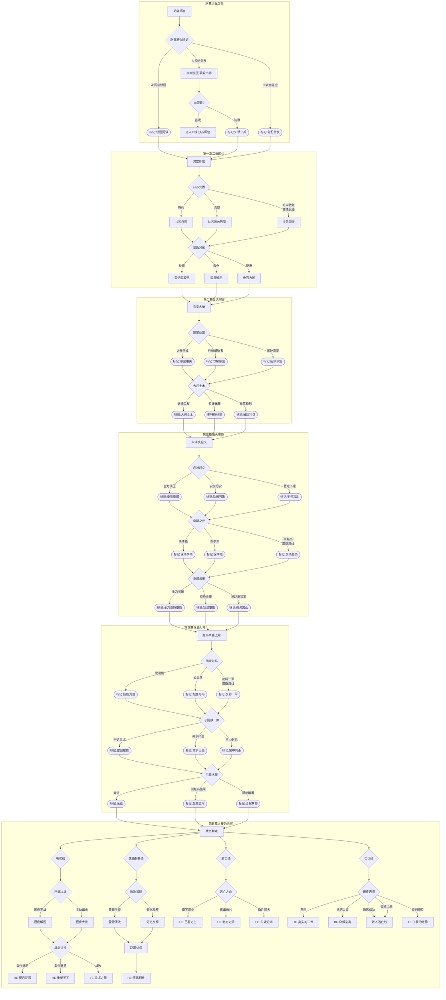

```mermaid
flowchart TD
    subgraph 序章沙丘之夜
        P0[始皇驾崩] --> P1{赵高邀你矫诏}
        P1 -->|A:同意矫诏| P1A([标记:矫诏同谋])
        P1 -->|B:拒绝告发| P1B[李斯施压,蒙毅出场]
        P1B --> P1B1{向蒙毅?}
        P1B1 -->|告发| P1B1A[进入IF线:扶苏即位]
        P1B1 -->|沉默| P1B1B([标记:知情不报])
        P1 -->|C:表面答应| P1C([标记:隐忍待发])
    end

    subgraph 第一章二世即位
        C1[灵堂即位] --> C1A{扶苏处置}
        C1A -->|赐死| C1A1[扶苏自尽]
        C1A -->|流放| C1A2[扶苏流放巴蜀]
        C1A -->|暗中赦免<br>需隐忍线| C1A3[扶苏同盟]
        C1A1 & C1A2 & C1A3 --> C1B{蒙氏兄弟}
        C1B -->|处死| C1B1[蒙恬蒙毅死]
        C1B -->|赦免| C1B2[蒙氏留用]
        C1B -->|贬庶| C1B3[免官为民]
    end

    subgraph 第二章血洗宗室
        C2[宗室名册] --> C2A{宗室处置}
        C2A -->|大开杀戒| C2A1([标记:宗室屠夫])
        C2A -->|只杀威胁者| C2A2([标记:软禁宗室])
        C2A -->|保护宗室| C2A3([标记:庇护宗室])
        C2A1 & C2A2 & C2A3 --> C2B{大兴土木}
        C2B -->|继续工程| C2B1([标记:大兴土木])
        C2B -->|暂缓休养| C2B2([无特殊标记])
        C2B -->|改革税制| C2B3([标记:触动利益])
    end

    subgraph 第三章烽火燎原
        C3[大泽乡起义] --> C3A{应对起义}
        C3A -->|全力镇压| C3A1([标记:重用章邯])
        C3A -->|安抚招安| C3A2([标记:软弱可欺])
        C3A -->|置之不理| C3A3([标记:坐视叛乱])
        C3A1 & C3A2 & C3A3 --> C3B{李斯之死}
        C3B -->|杀李斯| C3B1([标记:诛杀李斯])
        C3B -->|保李斯| C3B2([标记:保李斯])
        C3B -->|杀赵高<br>需隐忍线| C3B3([标记:反杀赵高])
        C3B1 & C3B2 & C3B3 --> C3C{章邯求援}
        C3C -->|全力增援| C3C1([标记:全力支持章邯])
        C3C -->|拒绝增援| C3C2([标记:猜忌章邯])
        C3C -->|派赵高监军| C3C3([标记:调虎离山])
    end

    subgraph 第四章指鹿为马
        C4[赵高牵鹿上殿] --> C4A{指鹿为马}
        C4A -->|说是鹿| C4A1([标记:指鹿为鹿])
        C4A -->|说是马| C4A2([标记:指鹿为马])
        C4A -->|反将一军<br>需隐忍线| C4A3([标记:反将一军])
        C4A1 & C4A2 & C4A3 --> C4B{子婴献三策}
        C4B -->|密诏章邯| C4B1([标记:密诏章邯])
        C4B -->|离京出巡| C4B2([标记:离京出巡])
        C4B -->|宫中刺杀| C4B3([标记:宫中刺杀])
        C4B1 & C4B2 & C4B3 --> C4C{巨鹿求援}
        C4C -->|亲征| C4C1([标记:亲征])
        C4C -->|派赵高监军| C4C2([标记:赵高监军])
        C4C -->|拒绝增援| C4C3([标记:坐视章邯])
    end

    subgraph 第五章大秦的余烬
        C5[状态判定] --> C5L1{明君线}
        C5L1 --> C5L1A{巨鹿决战}
        C5L1A -->|围而不战| C5L1A1[巨鹿解围]
        C5L1A -->|主动出击| C5L1A2[巨鹿大捷]
        C5L1A1 & C5L1A2 --> C5L1B{战后抉择}
        C5L1B -->|条件满足| HE1[HE·明君逆袭]
        C5L1B -->|条件满足| HE2[HE·重塑天下]
        C5L1B -->|战败| TE1[TE·章邯之降]

        C5[状态判定] --> C5L2{傀儡翻身线}
        C5L2 --> C5L2A{清洗策略}
        C5L2A -->|雷霆手段| C5L2A1[雷霆清洗]
        C5L2A -->|分化瓦解| C5L2A2[分化瓦解]
        C5L2A1 & C5L2A2 --> C5L2B[赵高伏诛]
        C5L2B --> HE3[HE·傀儡翻身]

        C5[状态判定] --> C5L3{逃亡线}
        C5L3 --> C5L3A{逃亡方向}
        C5L3A -->|南下汉中| HE4[HE·巴蜀之主]
        C5L3A -->|东出函谷| HE5[HE·北方之狼]
        C5L3A -->|隐姓埋名| HE6[HE·东渡沧海]

        C5[状态判定] --> C5L4{亡国线}
        C5L4 --> C5L4A{最终选择}
        C5L4A -->|自刎| TE2[TE·真实的二世]
        C5L4A -->|抵抗失败| BE1[BE·众叛亲离]
        C5L4A -->|抵抗成功| C5L4E[转入逃亡线]
        C5L4A -->|密道出逃| C5L4E
        C5L4A -->|谈判禅位| TE3[TE·子婴的继承]
    end

    P1A --> C1
    P1B1B --> C1
    P1C --> C1
    C1B1 & C1B2 & C1B3 --> C2
    C2B1 & C2B2 & C2B3 --> C3
    C3C1 & C3C2 & C3C3 --> C4
    C4C1 & C4C2 & C4C3 --> C5
```

