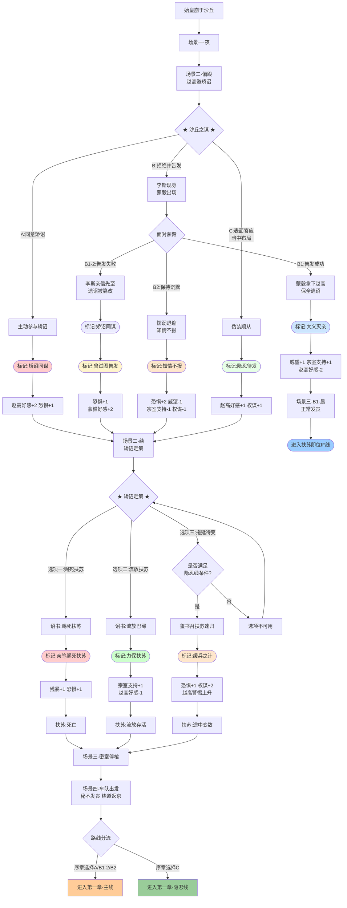

# 《胡亥模拟器》序章：沙丘之夜

## 【序章开场】

*画面渐显。黑屏之上，缓缓浮现一行行篆书。*

**公元前210年，七月，丙寅。**

**始皇帝嬴政东巡，至平原津而病。**

**车驾行至沙丘平台，帝疾益甚。**

**乃为玺书赐公子扶苏曰：“与丧会咸阳而葬。”**

**书已封，在中车府令赵高所，未付使者。**

**七月丙寅，始皇崩于沙丘。**

## 【场景一：沙丘行宫·夜】

*画面亮起。*

*沙丘。这个三十三年前曾经困死赵武灵王的地方，今夜迎来了又一位帝王的死亡。*

*行宫简陋，不似咸阳宫阙巍峨。夜风钻入，烛火明灭不定。*

*远处有巡逻士卒的脚步声，沉闷而规律。除此之外，一片死寂。*

*你跪在内室门外，已经跪了两个时辰，膝盖生疼。*

*你叫嬴胡亥，始皇帝第十八子。*

*你今年……你忽然有些记不清自己多少岁了。大概是二十？二十一？*

*你只知道，父亲说你最像他年少时，所以每次东巡都带着你。*

*这是恩宠。所有人都这么说。*

*内室里偶尔传出压抑的咳嗽声。从平原津开始，父亲就一直在发烧。御医们忙前忙后，脸色一日比一日难看。*

*没有人敢说那个字，但所有人都在等待。*

*等待那个时刻的到来。*

*又过了不知多久。*

*内室的门忽然开了。*

*一个人影走了出来。他身形瘦削，面容清癯，眼眶微陷，却目光炯炯。他穿着中车府令的官服，衣襟上沾着药渍，显然已在病榻前守了许久。*

*赵高。你的老师，始皇帝最信任的宦官。*

*他轻轻掩上门，然后转向你。他的脸上没有表情，但你依然在他的眼底看到了一种从未见过的、极力压制的亢奋，像蛇在暗处吐着信子。*

**赵高**：（低声）“公子。”

*你抬起头。*

**胡亥**：“老师……父皇他……”

*赵高缓步走到你面前，烛光在他脸上投下大片阴影，让他的表情难以捉摸。*

**赵高**：“公子，请随臣来。”

## 【场景二：沙丘行宫·偏殿】

*偏殿一眼望去只看见一张案几，两盏铜灯，显得有些空荡。*

*赵高示意你坐下。他却没有坐，而是站在你面前看着你。那审视的目光让你不太舒服。*

**胡亥**：“老师，父皇到底……”

**赵高**：“陛下驾崩了。”

*你愣住了，张了张嘴，却发不出声音。*

*父皇……死了？那个横扫六合、并吞八荒的男人，那个让你既敬仰又畏惧的父亲，就这么……死了？死在沙丘这个鬼地方，死在这场莫名其妙的东巡途中？*

*你的脑子一片空白。*

**赵高**：（语气平静，盯着你）“陛下驾崩，天下即将无主。公子，臣有一言，不得不问。”

**赵高**：“公子可想做皇帝？”

*你猛地抬起头。*

**胡亥**：“……什么？”

**赵高**：“陛下临终前，曾为玺书赐公子扶苏。书曰：‘与丧会咸阳而葬。’公子可知，这句话是什么意思？”

*你从未想过这些事。皇位、遗诏、继嗣，这些事情离你太远了。*

**赵高**：“意思是，让扶苏回咸阳主持葬礼。主持葬礼者，便是嗣君。”

*他从袖中取出一卷竹简，放在案上。竹简上封泥完好，盖着始皇帝的玺印。*

**赵高**：“这便是那封玺书。陛下亲手封缄，命臣交付使者，发往上郡。但陛下封好之后，便……昏迷不醒。这封玺书，至今还在臣手中。”

**赵高**：“公子。玺书一旦发出，扶苏便是名正言顺的嗣君。他素来不喜法家，又与蒙恬交厚。一旦即位，必重用蒙氏。到那时，臣不过一中车府令，死不足惜。但公子你呢？”

**赵高**：（声音压低）“公子是陛下最宠爱的儿子。陛下屡次在群臣面前夸赞公子，说诸子之中，唯有公子最肖陛下。扶苏对此，岂能无恨？公子随臣学习狱法多年，深通律令。在扶苏眼中，公子便是法家一脉。他即位之后，公子能安享富贵否？”

**胡亥**：（后背一阵发凉）“可是……遗诏已封……”

**赵高**：（微微勾起嘴角）“遗诏在臣手中。除了陛下与臣，无人知晓其中内容。公子，这天下的主人是谁，不过是一封诏书的事。”

**赵高**：“臣问公子——可想做皇帝？”

*殿中静得你能听见自己的心跳声。*

*你想做皇帝吗？*

*你从未想过这个问题。皇帝是父亲，是那个坐在高高的御座上、令人不敢正视的人。皇帝是一把悬在天下人头顶的刀。父亲这样说过。*

*你觉得自己不配做那把刀。你怕疼，怕血，怕死。*

*但你也怕……*

*你怕扶苏即位后，你失去父亲的庇护，变成一个无关紧要的宗室公子，被软禁在封地，了此残生。或者……像那些被父亲灭国的六国宗室一样，在某一天被送上一杯毒酒。*

*你怕死。*

*真的很怕。*

*赵高看着你。他在等你的回答。*

*而你，必须在今夜，在沙丘行宫，做出你人生中最重要的决定。*

## ★ 核心选择节点：沙丘之谋 ★

### 【选项A：同意矫诏】（主线入口）

*你垂下眼睛，手在袖中攥紧。*

**胡亥**：（声音很低，很慢）“老师说得对。兄长即位，必用蒙恬。蒙氏素来与法家不睦，你我师徒……皆无葬身之地。”

*你抬起头，与赵高对视。*

**胡亥**：“这帝位……我取了。”

*赵高露出一丝极淡的笑意。他缓缓跪倒，向你行了大礼。*

**赵高**：“陛下圣明。”

*你听着这两个字，不知该喜还是该惧。*

**赵高**：“此事干系重大，非臣一人能成。需得丞相首肯。”

**胡亥**：“李斯？他会同意？”

**赵高**：“丞相是聪明人。聪明人，知道该怎么选。”

*他起身，向殿外走去。走到门口时，忽然停步。*

**赵高**：（背对着你）“陛下放心。从今夜起，这天下的刀，握在陛下手中了。”

*赵高的身影消失在夜色里。*

*你独自坐在空荡的偏殿中，看着案上那封尚未发出的遗诏。烛火映着封泥上的玺印。*

*你伸出手，轻轻摸了摸那枚冰冷的封印。*

*父亲。原谅我。*

*（隐藏数值变化：矫诏密谋开启。赵高好感度+2。恐惧值+1。获得关键标记【矫诏同谋】。）*

*（剧情继续：进入【矫诏定策】节点。）*

### 【选项B：拒绝并告发】

*你猛地站起来。*

**胡亥**：“赵高！你疯了！”

*赵高脸上的笑意凝固了。*

**胡亥**：“矫诏夺位，大逆不道！父皇尸骨未寒，你竟敢……竟敢……”

*你气得说不出话来。你虽然胆小，虽然怕死，但有些底线，你从未想过要跨越。*

*那是你的父亲，和你的兄长。*

**赵高**：（眯起眼睛）“公子，你可想清楚了？”

**胡亥**：“我现在就去见丞相！把你的话，一字不漏地告诉他！”

*你转身向殿门走去。*

*然而，你刚迈出两步，殿门忽然从外面推开了。*

*一个高大的身影站在门口。烛光映出一张苍老而威严的面孔。*

*正是左丞相李斯。*

**李斯**：（沉声）“公子要去哪里？”

*你愣住了。李斯为什么会在这里？他什么时候来的？*

*你回头看向赵高。赵高站在原地，神色平静，仿佛一切都在他预料之中。*

**赵高**：“丞相来得正好。公子方才说，要告发臣。”

*李斯缓步走进殿内，目光在你和赵高之间来回扫视。*

**李斯**：“告发何事？”

*你张了张嘴，正要说话——*

**赵高**：“臣方才对公子说，陛下驾崩，遗诏未发。为社稷计，当立公子为嗣。公子听了，便说臣大逆不道，要去告发。”

*他叹了口气。*

**赵高**：“公子忠孝，臣自愧不如。只是……”

*他转向李斯。*

**赵高**：“丞相。遗诏在臣手中。诏书内容，只有你我知道。若是公子扶苏即位，丞相以为，他会如何看待你我？”

*李斯的脸色微变。*

**赵高**：“扶苏素与蒙恬交厚，厌恶法家。他若为帝，蒙恬必为丞相。到那时，丞相置于何地？商君车裂，吕相饮鸩。秦国相位，从来不是善终之官。”

*李斯沉默，眉头紧锁。*

*你看着李斯，心中涌起一阵寒意。你明白了，赵高根本不是要拉拢你。他早就拉拢了李斯。你只是他们完成计划的一个环节，一个必要的步骤。*

**李斯**：“公子。今日之事，请公子三思。”

*正在此时，殿外传来一阵急促的脚步声。一个高大的身影大步走入，是上卿蒙毅。他奉命随行东巡，今夜值守行宫。*

**蒙毅**：“丞相，赵高，深夜在此商议何事？公子为何面色如此难看？”

*赵高与李斯迅速交换了一个眼神。*

**赵高**：（从容）“蒙上卿来得正好。陛下驾崩，臣正与丞相、公子商议后事。”

**蒙毅**：（脸色大变）“陛下驾崩了？！”

*他看向你。你从他的目光中看到了震惊和悲痛，以及可以赋予信任的力量。*

*你必须做出选择。*

#### 分支B1：向蒙毅告发（扶苏即位线入口）

*你咬紧牙关，猛地指向赵高。*

**胡亥**：“蒙上卿！赵高矫诏，欲谋大逆！”

*蒙毅瞳孔骤缩，手按剑柄。赵高脸色铁青。李斯退后一步，似在观望。*

*蒙毅拔剑上前，护在你身前。*

**蒙毅**：“赵高！你好大的胆子！”

*赵高脸色数变，最终冷笑一声。*

**赵高**：“蒙上卿，你一个人，能做什么？”

*但蒙毅并非一个人。殿外传来兵甲之声，部属已闻声而至。*

*李斯看着这一幕，缓缓退到阴影中。他没有帮赵高，也没有帮你。*

*赵高被拿下。那封遗诏，完好无损地保留了下来。*

*天亮之后，遗诏被发往上郡。扶苏接诏，启程返回咸阳。*

*而你，胡亥，站在沙丘的晨光中，不知道等待自己的将是什么。*

*（隐藏数值变化：威望值+1，宗室支持度+1。赵高好感度-2。获得关键标记【大义灭亲】。）*

*（剧情转入“扶苏即位线”——进入独立场景【场景三-B1：沙丘行宫·晨】。）*

#### 分支B1-2：向蒙毅告发，但未能阻止矫诏（主线入口）

*你咬紧牙关，猛地指向赵高。*

**胡亥**：“蒙上卿！赵高矫诏，欲谋大逆！”

*蒙毅瞳孔骤缩，手按剑柄。赵高脸色骤变。*

*然而就在此时，殿外忽然涌入一队士卒，却是李斯的人。李斯面色铁青。他比蒙毅早一步调来了亲信。原来他早已料到今夜可能生变。*

*蒙毅被数名士卒围住，手按剑柄却不敢轻动。*

*他只有一人，而李斯的亲信有十余人。赵高趁乱将那封遗诏藏入袖中，退到阴影里。*

*当混乱平息时，遗诏已被篡改。扶苏仍被赐死，你仍被立为太子。*

*但蒙毅记得。记得你曾试图告发。他在被李斯的士卒押出偏殿时，回头看了你一眼。那一眼里没有恨意，只有一种复杂、却又难以言说的惋惜和不甘。*

*你知道他在想什么。你没保住遗诏，他没保住先帝。你们都是失败者。*

*（隐藏数值变化：矫诏密谋成功。恐惧值+1。获得关键标记【矫诏同谋】。同时获得专属标记【曾试图告发】——蒙毅好感度起点+2，后续相关选项效果变化。）*

*（剧情继续：进入【矫诏定策】节点。）*

#### 分支B2：保持沉默（主线入口）

*你张了张嘴，最终没有说出话来。你怕。你怕蒙毅一个人敌不过赵高和李斯联手。你怕一旦告发失败，你会死得更快。*

*你垂下头。*

**胡亥**：“……无事。只是……父皇驾崩，我心中难过。”

*蒙毅看着你，眼中闪过一丝疑色。但赵高已经接过了话头。*

**赵高**：“陛下驾崩，国不可一日无君。臣与丞相商议，当秘不发丧，速回咸阳，奉公子胡亥即位。”

*蒙毅眉头紧皱。*

**蒙毅**：“先帝可有遗诏？”

**赵高**：（面不改色）“遗诏在臣处。先帝临终，命公子胡亥嗣位。”

*蒙毅看向李斯。李斯沉默片刻，点了点头。*

*蒙毅缓缓跪倒。*

**蒙毅**：“……臣，领旨。”

*你看着他跪下，心中一片冰凉。你没有说话，但你已经做出了懦弱的选择。*

*（隐藏数值变化：矫诏密谋成功。恐惧值+2。威望值-1，宗室支持度-1，权谋值-1。获得关键标记【知情不报】。蒙毅后续态度将受影响。）*

*（剧情继续：进入【矫诏定策】节点。）*

### 【选项C：表面答应，暗中布局】（隐忍线入口）

*你沉默了很久。*

*你想起了父亲说过的话。父亲说，为君者，当忍常人所不能忍。你要么做那把刀，要么被刀折断。*

*你现在还不是刀。但你也不想被折断。*

**胡亥**：（缓缓开口）“老师说得对。兄长若即位，你我皆死路一条。”

*你抬起头，让自己的表情显得畏惧而顺从。*

**胡亥**：“一切……听老师安排。”

*赵高脸上露出满意的笑容。*

**赵高**：“公子圣明。臣这就去与丞相商议细节。”

*他深深一揖，转身离去。*

*你独自坐在偏殿里，听着他的脚步声渐渐远去。*

*直到那声音彻底消失，你脸上的畏惧才慢慢褪去，而渐渐变得冷静。*

*你当然不想做赵高的傀儡。但你也知道，今夜若不答应，你根本走不出这座偏殿。赵高既然敢对你说这些话，就一定有把握让你闭嘴，无论是以何种方式。*

*所以，先答应他。*

*然后……*

*你起身，走到窗边，望向行宫的另一个方向。那是蒙毅今夜值守的方向。*

*沙丘的夜空漆黑如墨。但你知道，天总会亮的。*

*（隐藏数值变化：矫诏密谋表面参与。获得关键标记【隐忍待发】。赵高好感度+1。隐藏属性【权谋值】+1。后续可解锁“反杀赵高”剧情线。）*

*（剧情继续：进入【矫诏定策】节点。）*

## 【场景二·续：沙丘行宫·偏殿·矫诏定策】

*（注：此场景仅对进入主线或隐忍线的玩家开放。进入扶苏即位线的玩家直接跳转至【场景三-B1】。）*

*赵高离去后不久，又折返回来。这一次，李斯与他同行。*

*李斯的面色在烛光下显得格外凝重。他看了你一眼，那目光里有审视，有盘算，还带着些许疲惫。*

**李斯**：（对赵高）“公子既已应允，下一步便是拟诏。诏书如何措辞，需公子定夺。”

*赵高从袖中取出一卷空白的帛书，在案上铺开。墨已研好，笔已蘸饱。*

**赵高**：“陛下。矫诏之事，牵一发而动全身。诏书发往上郡，扶苏接诏后如何处置，关乎社稷安稳。”

*他停顿了一下，目光落在你脸上。*

**赵高**：“臣斗胆，请陛下圣断。”

### ★ 核心选择节点：矫诏定策 ★

#### 【选项一：赐死扶苏，囚禁蒙恬】

**赵高**：“公子若欲绝后患，诏书中当明言：扶苏不孝，赐死于上郡军中。蒙恬与扶苏同谋，亦当赐死，或下狱待决。”

*你握紧了拳头。*

*你看向李斯。李斯避开了你的目光。*

*你看向赵高。赵高正静静地看着你，像一个等待学生交卷的老师。*

**胡亥**：（声音极低）“……就如此写。”

*赵高微微颔首，提笔在帛书上写下数行。笔尖划过帛面的声音，在寂静的偏殿中格外清晰。*

*你不敢看那上面的字。*

*（隐藏数值变化：残暴值+1，恐惧值+1。扶苏命运锁定：赐死。获得关键标记【亲笔赐死扶苏】。后续剧情中，你将对扶苏之死负有直接责任。）*

**【若隐忍线·内心独白】**

***你说出那四个字的时候，心里有什么东西裂开了。***

***但你不能让那道裂缝被赵高看见。***

***你让自己的嘴唇微微发抖，眼眶泛红——一个被逼着做了可怕决定的、软弱的弟弟。赵高会喜欢这个形象的。***

***至于裂缝底下是什么，只有你自己知道。***

***兄长，对不起。亥弟现在还不能救你。但至少，赵高不会怀疑我了。***

#### 【选项二：流放扶苏，削去官职】

*你沉默了很久。烛火在案上跳动了数次。*

**胡亥**：“……等等。”

*赵高停笔，看向你。*

**胡亥**：“赐死……是否太过？兄长毕竟是父皇长子，若以赐死诏书发往上郡，三十万将士会如何看待？天下人会如何看待？”

*你没有看赵高，而是看向李斯。*

**胡亥**：“丞相以为呢？”

*李斯显然没有预料到你会主动问他。*

**李斯**：“……公子所虑，不无道理。扶苏在军中素有仁厚之名。若赐死诏书引发将士哗变，反倒不妙。”

*赵高的目光在你和李斯之间来回扫了一遍，嘴角那丝若有若无的笑意淡了下去。*

**赵高**：“那公子的意思是？”

**胡亥**：“流放。削去扶苏公子之位，流放巴蜀，永不叙用。蒙恬……降职留用，戴罪守边。”

*赵高沉默了一瞬。*

**赵高**：“公子仁厚。”

**胡亥**：（低声）“不是仁厚。是稳妥。”

*赵高不再说话。他重新蘸墨，在帛书上写下新的诏书内容。*

*（隐藏数值变化：扶苏存活。宗室支持度+1，赵高好感度-1。获得关键标记【力保扶苏】。）*

*（注：若序章已选C“暗中布局”，则权谋值额外+1。）*

**【若隐忍线·内心独白】**

***你保住了扶苏的命。***

***用的是“稳妥”这个理由。赵高无法反驳，因为他说过“关乎社稷安稳”。你不能显得比赵高更在意扶苏的生死，那会引起他的警觉。你只能显得比赵高更谨慎，更害怕意外。***

***一个谨慎的、害怕意外的皇帝，也是好控制的。***

***赵高不会为了一个流放巴蜀的扶苏和你翻脸。但对你来说，扶苏活着，就是一枚赵高不知道的棋子。***

***这就够了。***

#### 【选项三：按兵不动，拖延待变】

*（需序章选择C“暗中布局”方可解锁）*

*你看着那卷空白帛书，忽然开口。*

**胡亥**：“诏书之事，可否暂缓？”

*赵高和李斯同时看向你。*

**赵高**：“公子何意？”

**胡亥**：“上郡距此千里之遥。消息往返，至少半月。在此期间，若生变故……”

*你故意没有把话说完。*

**李斯**：（皱眉）“公子的意思是？”

**胡亥**：“先以玺书召扶苏回咸阳，只说父皇病重，令其速归。待他离开上郡、脱离蒙恬大军之后，再行定夺。”

*赵高沉默片刻，眼中闪过一丝玩味。*

**赵高**：“公子思虑周全。只是……若扶苏回到咸阳，见到陛下已崩，该如何？”

**胡亥**：“到那时，他孤身一人，在咸阳宫中。是赐死，是流放，还是……”

*你抬起眼睛，与赵高对视。*

**胡亥**：“……还是另做打算，皆可从容布置。”

*赵高看了你很久。*

*然后他笑了。那是你从未见过的笑容，那是一种发现猎物比想象中有趣的、猎人的笑。*

**赵高**：“公子长大了。”

*他提笔，在帛书上写下：召公子扶苏速归咸阳。*

*（隐藏数值变化：恐惧值+1，权谋值+2。扶苏命运锁定：暂未处置，后续章节中出现变数。获得关键标记【缓兵之计】。赵高对你的警惕度上升。后续章节中，赵高将更频繁地试探你。）*

**【若隐忍线·内心独白】**

***你提出这个方案时，心跳如鼓。***

***你知道赵高会看出你的心思。***

***你不是真的想杀扶苏，你在拖延，你在等待变数。但你也知道，这个方案本身是合理的。扶苏离开军队，对赵高同样有利。***

***赵高果然同意了。但他看你的那一眼，让你后背发凉。***

***他知道了。他知道你在动脑子了。***

***不过没关系。让他知道你在动脑子，未必是坏事。一个完全没脑子的傀儡，随时可以被替换。一个有点脑子但仍在掌控中的傀儡，才值得留着。***

***你只需要让他觉得，你依旧在他的掌控之中。***

## 【场景三：沙丘行宫·密室内】

*（注：此场景仅对进入主线或隐忍线的玩家开放。进入扶苏即位线的玩家请跳至【场景三-B1】。）*

*无论你在矫诏定策中做出了怎样的选择，这一切都还没有结束。*

*始皇帝驾崩的消息被严密封锁。所有知晓内情的近侍、御医，一夜之间全部“失踪”。*

*但你已经是这个秘密的一部分了。*

*你被一阵轻微的脚步声惊醒。赵高派来的一名心腹宦官，将你引入一间你从未踏足的密室。*

*密室中央，停放着一口巨大的梓木棺椁。*

*烛火幽暗，棺身漆黑，一股浓烈、刺鼻的草药与香料混合的气味扑面而来，几乎让你窒息。*

*但即便如此，你依然能捕捉到那股若有若无的腐败气息。*

*赵高与李斯侍立两侧，见你进来，目光交汇。*

**赵高**：（低声，毫无波澜）“殿下，都准备好了。明日车队便会启程。棺椁将安置于辒辌车中，一切如常。”

**李斯**：（眉头紧锁，声音干涩）“殿下，为防万一……臣已命人备好了几石鲍鱼。”

*李斯的话语顿了顿，烛火在他脸上投下摇曳的阴影。*

**李斯**：（深吸一口气）“若车驾之中有异味传出……臣会启奏，此乃陛下新纳的东海贡品。”

*密室内陷入一片死寂。*

*你想起父亲曾说：“朕为始皇帝。後世以计数，二世三世至于万世，传之无穷”*

*但帝国已经开始腐烂。*

**胡亥**：（低声）“父皇……”

*对不起……*

*儿臣怕……*

*长夜将尽。绣着秦国图腾的玄色旌旗在晨风中轻轻摆动。*

## 【场景三-B1：沙丘行宫·晨】

*（注：此场景仅对进入扶苏即位线——选项B1的玩家开放。）*

*天亮之后。*

*蒙毅的部属已控制行宫内外。赵高被押入囚车，李斯称病不出。那封遗诏，完好无损地保留了下来。*

*你站在行宫的高台之上，看着东方泛起的晨光。*

*蒙毅走到你身后。*

**蒙毅**：“公子，遗诏已遣快马发往上郡。扶苏公子接诏后，不日将返咸阳主持先帝丧仪。”

*你沉默着。*

**蒙毅**：“公子大义灭亲，保全遗诏，臣敬佩。只是……公子可曾想过，扶苏公子即位后，公子当如何自处？”

**胡亥**：“不知道。”

**胡亥**：“但至少，我不用再做赵高的刀了。”

*蒙毅沉默片刻，缓缓点头。*

**蒙毅**：“公子放心。昨夜之事，臣会如实禀报扶苏公子。公子是忠是奸，天下人自有公论。”

*晨光越来越亮。车队开始集结，始皇帝驾崩的消息将正式发丧，天下将为之震动。*

*而你的命运，从此不在你手中了。*

*（剧情转入“扶苏即位IF线”——序章结束。跳至【序章完成·扶苏即位线数值结算】。）*

## 【场景四：沙丘行宫·出发】

*（注：此场景仅对进入主线或隐忍线的玩家开放。）*

*车队启程。*

*辒辌车里载着始皇帝的棺椁。*

*车队中另备数车，满载鲍鱼——那是李斯提前备下的。*

*赵高骑马随行在辒辌车旁，神色如常，仿佛什么都没有发生过。*

*李斯骑在马上，神色肃然。昨夜密室中的那份沉重，此刻被他压在了心底。*

*你坐在自己的车驾中，掀开车帘，望向队伍最前方那辆黑色车驾——那是父皇的辒辌车。*

*车驾辚辚，扬起漫天尘土。*

*沙丘渐渐消失在身后。你放下车帘。*

*这一路比往常更久。*

*他们不敢直接返京，绕道井陉，折向九原。没有人知道还要走多少天。*

*你就要是皇帝了吗……*

*车驾摇晃。你闭上眼睛。*

*眼前浮现的，是父亲教你射箭时的样子。他的手握着你的手，温暖而有力。*

*可那双手，再也不会握你的手了。*

*你睁开眼，车帘缝隙间，正对上赵高投来的目光。他朝你微微颔首，随即转过头去，继续策马前行。*

*你忽然明白——从沙丘到咸阳的这段路，你和他同坐一条船上。但船靠岸之后呢？*

*车驾继续向前。你没有答案。*

## 【序章·终·主线/隐忍线】

*画面暗下。*

*字幕浮现。*

**“七月丙寅，始皇崩于沙丘。”**

**“赵高、李斯秘不发丧，矫诏立少子胡亥为太子。”**

**“秦帝国的命运，在这一夜悄然转折。”**

**“而胡亥的命运，从此刻起，再也由不得他自己。”**

## 【序章完成·数值结算——主线/隐忍线】

**根据本序章选择，初始数值如下：**

| 数值           | 选项A | 选项B1-2 | 选项B2 | 选项C |
| :------------- | :---- | :------- | :----- | :---- |
| 残暴值         | 0*    | 0*       | 0*     | 0*    |
| 威望值         | 0     | 0        | -1     | 0     |
| 恐惧值         | 1     | 1        | 2      | 1     |
| 赵高好感度     | +2    | 0        | 0      | +1    |
| 宗室支持度     | 0     | 0        | -1     | 0     |
| 权谋值（隐藏） | 0     | 0        | -1     | +1    |

*\*注：若在【矫诏定策】中选择“赐死扶苏”，则残暴值+1。*

**矫诏定策节点额外数值变化：**

| 矫诏定策选择     | 额外数值变化               | 获得标记         | 扶苏命运 |
| :--------------- | :------------------------- | :--------------- | :------- |
| 选项一：赐死扶苏 | 残暴值+1，恐惧值+1         | 【亲笔赐死扶苏】 | 死亡     |
| 选项二：流放扶苏 | 宗室支持度+1，赵高好感度-1 | 【力保扶苏】     | 流放存活 |
| 选项三：拖延待变 | 恐惧值+1，权谋值+2         | 【缓兵之计】     | 暂未处置 |

**关键标记汇总：**

| 路线     | 标记一       | 标记二（如有）             |
| :------- | :----------- | :------------------------- |
| 选项A    | 【矫诏同谋】 | 矫诏定策选择决定第二个标记 |
| 选项B1-2 | 【矫诏同谋】 | 【曾试图告发】             |
| 选项B2   | 【知情不报】 | 矫诏定策选择决定第二个标记 |
| 选项C    | 【隐忍待发】 | 矫诏定策选择决定第二个标记 |

**关键人物状态：**

| 人物 | 选项A      | 选项B1-2   | 选项B2     | 选项C      |
| :--- | :--------- | :--------- | :--------- | :--------- |
| 扶苏 | 待矫诏定策 | 待矫诏定策 | 待矫诏定策 | 待矫诏定策 |
| 蒙恬 | 待矫诏定策 | 待矫诏定策 | 待矫诏定策 | 待矫诏定策 |
| 蒙毅 | 态度冷淡   | 好感+2     | 态度冷淡   | 态度中立   |
| 赵高 | 高好感     | 中立       | 中立       | 中高好感   |
| 李斯 | 默认同盟   | 默认同盟   | 默认同盟   | 默认同盟   |

**路线去向：**

- 选项A / B1-2 / B2 → **进入第一章·主线**
- 选项C → **进入第一章·隐忍线**

## 【序章完成·数值结算——扶苏即位线】

*（仅选项B1玩家查看）*

**初始数值：**

| 数值           | 选项B1 |
| :------------- | :----- |
| 残暴值         | 0      |
| 威望值         | +1     |
| 恐惧值         | 0      |
| 赵高好感度     | -2     |
| 宗室支持度     | +1     |
| 权谋值（隐藏） | 0      |

**关键标记：**

- 获得【大义灭亲】

**关键人物状态：**

| 人物 | 状态                 |
| :--- | :------------------- |
| 扶苏 | 存活，即将返咸阳继位 |
| 蒙恬 | 存活，仍守上郡       |
| 蒙毅 | 关键盟友，高度信任   |
| 赵高 | 下狱，敌对状态       |
| 李斯 | 态度不明，称病不出   |

**路线去向：**

- 选项B1 → **进入扶苏即位IF线·第一章**

---

**序章结束。存档。**

