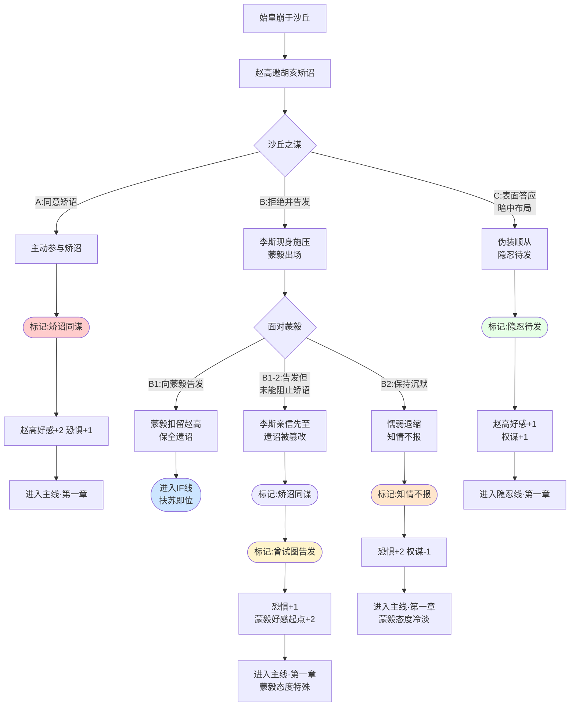

# 《胡亥模拟器》序章：沙丘之夜（结局扩展增改版）

## 【使用说明】

本剧本在主线序章基础上进行增量创作。**加粗段落**为本次结局扩展新增内容——在分支B1“向蒙毅告发”中增加一条极细分支“告发但未能阻止矫诏”，用于支持HE·英雄救赎的触发条件。其余部分与原序章完全一致。

## 【序章开场】

*画面渐显。黑屏之上，缓缓浮现一行行篆书。*

**公元前210年，七月，丙寅。**

**始皇帝嬴政东巡，至平原津而病。**

**车驾行至沙丘平台，帝疾益甚。**

**乃为玺书赐公子扶苏曰：“与丧会咸阳而葬。”**

**书已封，在中车府令赵高所，未付使者。**

**七月丙寅，始皇崩于沙丘。**

## 【场景一：沙丘行宫·夜】

*画面亮起。*

*沙丘。这个三十三年前曾经困死赵武灵王的地方，今夜迎来了又一位帝王的死亡。*

*行宫简陋，不似咸阳宫阙巍峨。夜风从窗缝钻入，吹得烛火明灭不定。远处有巡逻士卒的脚步声，沉闷而规律。除此之外，一片死寂。*

*你跪在内室门外，已经跪了两个时辰。*

*你叫嬴胡亥，始皇帝第十八子。你今年……你忽然有些记不清自己多少岁了。大概是二十？二十一？你只知道，父亲说你最像他年少时，所以每次东巡都带着你。*

*这是恩宠。所有人都这么说。*

*但此刻你跪在这里，只觉得膝盖生疼，心头乱跳。*

*内室里偶尔传出压抑的咳嗽声——那是天子的咳嗽声。每一声都像敲在你的心上。父亲病了，病得很重。从平原津开始，他就一直在发烧。御医们忙前忙后，脸色一日比一日难看。没有人敢说那个字，但所有人都在等待。*

*等待那个时刻的到来。*

*又过了不知多久。*

*内室的门忽然开了。*

*一个人影走了出来。他身形瘦削，面容清癯，眼眶微陷，却目光炯炯。他穿着中车府令的官服，衣襟上沾着药渍，显然已在病榻前守了许久。*

*赵高。你的老师，始皇帝最信任的宦官。*

*他轻轻掩上门，然后转向你。他的脸上没有表情，但你在他的眼底看到了某种从未见过的东西——那是一种极力压制的亢奋，像一条蛇在暗处吐信。*

**赵高**：（低声）“公子。”

*你抬起头。*

**胡亥**：“老师……父皇他……”

*赵高没有回答。他缓步走到你面前，居高临下地看着跪在地上的你。烛光在他脸上投下大片阴影，让他的表情难以捉摸。*

**赵高**：“公子，请随臣来。”

*他转身向偏殿走去。你犹豫了一瞬，起身跟上。*

## 【场景二：沙丘行宫·偏殿】

*偏殿空荡。一张案几，两盏铜灯，再无他物。*

*赵高示意你坐下。你照做了。他却没有坐，而是站在你面前，用一种审视的目光看着你。那目光让你不太舒服——他从来没有这样看过你。*

**胡亥**：“老师，父皇到底……”

**赵高**：（打断）“陛下驾崩了。”

*你愣住了。*

*烛火“噼啪”地跳了一下。殿外夜风呜咽，像是什么东西在哭泣。*

*你张了张嘴，却发不出声音。*

*父皇……死了？那个横扫六合、并吞八荒的男人，那个让你既敬仰又畏惧的父亲，就这么……死了？死在沙丘这个鬼地方，死在这场莫名其妙的东巡途中？*

*你的脑子一片空白。*

**赵高**：（语气平静）“陛下驾崩，天下即将无主。公子，臣有一言，不得不问。”

*他盯着你。*

**赵高**：“公子可想做皇帝？”

*你猛地抬起头。*

**胡亥**：“……什么？”

**赵高**：“陛下临终前，曾为玺书赐公子扶苏。书曰：‘与丧会咸阳而葬。’公子可知，这句话是什么意思？”

*你摇头。你确实不知道。你从未想过这些事。皇位、遗诏、继嗣——这些事情离你太远了。你只是始皇帝最小的儿子，你的任务就是跟着父亲东巡，背你的律令，做一个乖巧的皇子。*

**赵高**：（一字一顿）“与丧会咸阳而葬。意思是，让扶苏回咸阳主持葬礼。主持葬礼者，便是嗣君。”

*他从袖中取出一卷竹简，放在案上。竹简上封泥完好，盖着始皇帝的玺印。*

**赵高**：“这就是那封玺书。陛下亲手封缄，命臣交付使者，发往上郡。但陛下封好之后，便……昏迷不醒。这封玺书，至今还在臣手中。”

*你盯着那卷竹简。*

**赵高**：“公子。玺书一旦发出，扶苏便是名正言顺的嗣君。他素来不喜法家，又与蒙恬交厚。一旦即位，必重用蒙氏。到那时——臣不过一中车府令，死不足惜。但公子你呢？”

*他的声音压得更低了。*

**赵高**：“公子是陛下最宠爱的儿子。陛下屡次在群臣面前夸赞公子，说诸子之中，唯有公子最肖陛下。扶苏对此，岂能无恨？公子随臣学习狱法多年，深通律令。在扶苏眼中，公子便是法家一脉。他即位之后，公子能安享富贵否？”

*你感到后背一阵发凉。*

**胡亥**：“可是……遗诏已封……”

**赵高**：（微微勾起嘴角）“遗诏在臣手中。除了陛下与臣，无人知晓其中内容。公子，这天下的主人是谁，不过是一封诏书的事。”

*他停顿了一下，目光灼灼地看着你。*

**赵高**：“臣问公子——可想做皇帝？”

*殿中极静。静得你能听见自己的心跳声。咚、咚、咚。*

*你想做皇帝吗？*

*你从未想过这个问题。皇帝是父亲，是那个坐在高高的御座上、永远看不清表情的人。皇帝是一把悬在天下人头顶的刀。父亲这样说过。你觉得自己不配做那把刀。你怕疼，怕血，怕死。*

*但你也怕另一件事。*

*你怕扶苏即位后，你失去父亲的庇护，变成一个无关紧要的宗室公子，被软禁在封地，了此残生。或者更糟——像那些被父亲灭国的六国宗室一样，某一天，一杯毒酒便送到了面前。*

*你怕死。真的很怕。*

*赵高看着你。他在等你的回答。*

*而你，必须在今夜，在这个曾经困死过一位赵武灵王的沙丘行宫，做出你人生中最重要的决定。*

## ★ 核心选择节点：沙丘之谋 ★

**【选项A：同意矫诏】**

*你垂下眼睛。你的手在袖中攥紧，指甲几乎刺破掌心。*

**胡亥**：（声音很低，很慢）“老师说得对。兄长即位，必用蒙恬。蒙氏素来与法家不睦，你我师徒……皆无葬身之地。”

*你抬起头，与赵高对视。*

**胡亥**：“这帝位……我取了。”

*赵高脸上露出一丝极淡的笑意。他缓缓跪倒，向你行了大礼。*

**赵高**：“陛下圣明。”

*这是他第一次叫你“陛下”。*

*你听着这两个字，不知该喜还是该惧。*

**赵高**：“此事干系重大，非臣一人能成。需得丞相首肯。”

**胡亥**：“李斯？他会同意？”

**赵高**：“丞相是聪明人。聪明人，知道该怎么选。”

*他起身，向殿外走去。走到门口时，忽然停步。*

**赵高**：（背对着你）“陛下放心。从今夜起，这天下的刀，握在陛下手中了。”

*他推门而出，消失在夜色里。*

*你独自坐在空荡的偏殿中，看着案上那封尚未发出的遗诏。烛火映着封泥上的玺印——那是父亲的印。*

*你伸出手，轻轻摸了摸那枚冰冷的封印。*

*父亲。原谅我。*

*（隐藏数值变化：矫诏密谋开启。赵高好感度+2。恐惧值+1。获得关键标记【矫诏同谋】。）*

**【选项B：拒绝并告发】**

*你猛地站起来。*

**胡亥**：“赵高！你疯了！”

*你的声音在空荡的偏殿里回荡。赵高转过身，脸上的笑意凝固了。*

**胡亥**：“矫诏夺位，大逆不道！父皇尸骨未寒，你竟敢……竟敢……”

*你气得说不出话来。你虽然胆小，虽然怕死，但有些底线，你从未想过要跨越。*

*那是你的父亲。那是你的兄长。*

**赵高**：（眯起眼睛）“公子，你可想清楚了？”

**胡亥**：“朕——我现在就去见丞相！把你的话，一字不漏地告诉他！”

*你转身向殿门走去。*

*然而，你刚迈出两步，殿门忽然从外面推开了。*

*一个高大的身影站在门口。烛光映出一张苍老而威严的面孔——正是左丞相李斯。*

**李斯**：（沉声）“公子要去哪里？”

*你愣住了。李斯为什么会在这里？他什么时候来的？*

*你回头看向赵高。赵高站在原地，神色平静，仿佛一切都在他预料之中。*

**赵高**：“丞相来得正好。公子方才说，要告发臣。”

*李斯缓步走进殿内，目光在你和赵高之间来回扫视。*

**李斯**：“告发何事？”

*你张了张嘴，正要说话——*

**赵高**：（抢先一步）“臣方才对公子说，陛下驾崩，遗诏未发。为社稷计，当立公子为嗣。公子听了，便说臣大逆不道，要去告发。”

*他叹了口气。*

**赵高**：“公子忠孝，臣自愧不如。只是……”

*他转向李斯。*

**赵高**：“丞相。遗诏在臣手中。诏书内容，只有你我知道。若是公子扶苏即位，丞相以为，他会如何看待你我？”

*李斯的脸色变了。*

**赵高**：“扶苏素与蒙恬交厚，厌恶法家。他若为帝，蒙恬必为丞相。到那时，丞相置于何地？商君车裂，吕相饮鸩——秦国相位，从来不是善终之官。”

*李斯沉默。他的眉头紧锁，额上青筋微微跳动。*

*你看着李斯，心中涌起一阵寒意。你明白了——赵高根本不是要拉拢你。他早就拉拢了李斯。你只是一个环节，一个必要的步骤。*

*李斯缓缓转向你。*

**李斯**：“公子。今日之事，请公子三思。”

*他的语气很客气，但你听出了威胁。*

*（触发剧情分支：蒙毅救场线）*

*正在此时，殿外传来一阵急促的脚步声。一个中年将领大步走入——是上卿蒙毅。他奉命随行东巡，今夜值守行宫。*

**蒙毅**：“丞相，赵高，深夜在此商议何事？公子为何面色如此难看？”

*赵高与李斯迅速交换了一个眼神。*

**赵高**：（从容）“蒙上卿来得正好。陛下驾崩，臣正与丞相、公子商议后事。”

**蒙毅**：（脸色大变）“陛下驾崩了？！”

*他看向你。你从他的目光中看到了震惊和悲痛——还有某种你可以信任的东西。*

*你必须做出选择。*

> **分支B1：向蒙毅告发**
>
> *你咬紧牙关，猛地指向赵高。*
>
> **胡亥**：“蒙上卿！赵高矫诏，欲谋大逆！”
>
> *蒙毅瞳孔骤缩，手按剑柄。赵高脸色铁青。李斯退后一步，似在观望。*
>
> *（剧情转入“扶苏即位线”——扶苏接真遗诏继位，胡亥的命运将发生根本改变。详见后文“分支路线汇总”。）*

> **【新增分支B1-2：向蒙毅告发，但未能阻止矫诏】**
>
> *（此分支为结局扩展新增，用于支持HE·英雄救赎的触发。）*
>
> *你咬紧牙关，猛地指向赵高。*
>
> **胡亥**：“蒙上卿！赵高矫诏，欲谋大逆！”
>
> *蒙毅瞳孔骤缩，手按剑柄。赵高脸色骤变。*
>
> *然而就在此时，殿外忽然涌入一队士卒——是李斯的人。李斯站在门口，面色铁青。他比蒙毅早一步调来了亲信。原来他早已料到今夜可能生变。*
>
> *蒙毅被数名士卒围住，手按剑柄却不敢轻动——他只有一人，而李斯的亲信有十余人。赵高趁乱将那封遗诏藏入袖中，退到阴影里。*
>
> *当混乱平息时，遗诏已被篡改。扶苏仍被赐死，你仍被立为太子。*
>
> *但蒙毅记得。记得你曾试图告发。他在被李斯的士卒押出偏殿时，回头看了你一眼。那一眼里没有恨意，只有一种复杂的、难以言说的东西——像是惋惜，又像是不甘。*
>
> *你知道他在想什么。你没保住遗诏，他没保住先帝。你们都是失败者。*
>
> *（剧情转入主线——胡亥即位，与选项A/B2路线合流。但蒙毅对你的态度将与主线不同。）*
>
> *（隐藏数值变化：矫诏密谋成功。恐惧值+1。获得关键标记【矫诏同谋】。同时获得专属标记【曾试图告发】——蒙毅好感度起点+2，后续相关选项效果变化。）*

> **分支B2：保持沉默**
>
> *你张了张嘴，最终没有说出话来。你怕。你怕蒙毅一个人敌不过赵高和李斯联手。你怕一旦告发失败，你会死得更快。*
>
> *你垂下头。*
>
> **胡亥**：“……无事。只是……父皇驾崩，我心中难过。”
>
> *蒙毅看着你，眼中闪过一丝疑色。但赵高已经接过了话头。*
>
> **赵高**：“陛下驾崩，国不可一日无君。臣与丞相商议，当秘不发丧，速回咸阳，奉公子胡亥即位。”
>
> *蒙毅眉头紧皱。*
>
> **蒙毅**：“先帝可有遗诏？”
>
> **赵高**：（面不改色）“遗诏在臣处。先帝临终，命公子胡亥嗣位。”
>
> *蒙毅看向李斯。李斯沉默片刻，点了点头。*
>
> *蒙毅缓缓跪倒。*
>
> **蒙毅**：“……臣，领旨。”
>
> *你看着他跪下，心中一片冰凉。你没有说话，但你已经做出了选择——懦弱的选择。*
>
> *（隐藏数值变化：矫诏密谋成功。恐惧值+2。获得关键标记【知情不报】。蒙毅后续态度将受影响。）*

**【选项C：表面答应，暗中布局】**

*你沉默了很久。*

*赵高在等你的回答。烛火在他的瞳孔里跳动，像两簇幽幽的鬼火。*

*你想起了父亲说过的话。父亲说，为君者，当忍常人所不能忍。你要么做那把刀，要么被刀折断。*

*你现在还不是刀。但你也不想被折断。*

**胡亥**：（缓缓开口）“老师说得对。兄长若即位，你我皆死路一条。”

*你抬起头，让自己的表情显得畏惧而顺从。*

**胡亥**：“一切……听老师安排。”

*赵高脸上露出满意的笑容。*

**赵高**：“公子圣明。臣这就去与丞相商议细节。”

*他深深一揖，转身离去。*

*你独自坐在偏殿里，听着他的脚步声渐渐远去。*

*直到那声音彻底消失，你脸上的畏惧才慢慢褪去。取而代之的，是一种你从未在别人面前展露过的、冷静得近乎冷酷的神情。*

*你当然不想做赵高的傀儡。但你也知道，今夜若不答应，你根本走不出这座偏殿。赵高既然敢对你说这些话，就一定有把握让你闭嘴——无论是以何种方式。*

*所以，先答应他。*

*然后……*

*你起身，走到窗边，望向行宫的另一个方向。那是蒙毅今夜值守的方向。*

*沙丘的夜空漆黑如墨。但你知道，天总会亮的。*

*（隐藏数值变化：矫诏密谋表面参与。获得关键标记【隐忍待发】。赵高好感度+1。隐藏属性【权谋值】+1。后续可解锁“反杀赵高”剧情线。）*

## 【场景三：沙丘行宫·始皇寝殿】

*无论你做出何种选择，这一夜都还没有结束。*

*赵高与李斯密议之后，行宫内外的一切都被重新安排。始皇帝驾崩的消息被严密封锁。所有知晓内情的近侍、御医，一夜之间全部“失踪”。载着尸体的辒辌车被装上几石臭鱼烂虾，以掩盖尸臭。百官奏事如常，膳食照常送入车中——只是再没有人动过那些食物。*

*临行前夜。你独自走进父亲的寝殿。*

*殿中空无一人。只有一具棺椁，和长明灯幽暗的火光。*

*你跪在棺椁前，许久没有说话。*

**胡亥**：（低声）“父皇……”

*你不知道该说什么。道歉？辩解？还是什么都不说？*

*你想起小时候。父亲教你射箭，你拉不开弓，他便握着你的手，一点一点拉开。他的手很大，很粗糙，但很温暖。他说，胡亥，你要记住，秦国的男儿，从不退缩。*

*你那时候觉得，父亲是天底下最强大的人。他是永远不会倒下的。*

*但现在他躺在那里面。而你在外面，做着他绝不允许的事。*

*你俯下身，额头抵在冰冷的地砖上。*

**胡亥**：“父皇……儿臣怕。”

*没有人回答你。*

*长明灯静静地燃着，照亮棺椁上那面玄色旌旗。旗上绣着秦国的图腾——那是一只展翅的黑鹰，爪牙锋利，睥睨天下。*

*你跪了很久，很久。直到烛火将尽，天色将明。*

## 【场景四：沙丘行宫·出发】

*车队启程返回咸阳。*

*辒辌车里载着始皇帝的尸身，和几石臭鱼。赵高骑马随行在车旁，神色如常。李斯主持车队调度，井井有条。文武百官各司其职，没有人知道天子已崩。*

*你坐在自己的车驾中，掀开车帘，望向队伍最前方那辆黑色车驾——那是父皇的辒辌车。*

*车驾辚辚，扬起漫天尘土。*

*沙丘渐渐消失在身后。那个困死过赵武灵王的行宫，如今又多了一个死去的帝王。*

*你放下车帘。*

*从沙丘到咸阳，大约需要走十天。十天之后，你将跪在咸阳宫的灵堂里，接受百官的朝拜。*

*十天之后，你就是皇帝了。*

*车驾摇晃。你闭上眼睛。*

*眼前浮现的，是父亲教你射箭时的样子。他的手握着你的手，温暖而有力。*

*可那双手，再也不会握你的手了。*

## 【序章·终】

*画面暗下。*

*字幕浮现。*

**“七月丙寅，始皇崩于沙丘。”**

**“赵高、李斯秘不发丧，矫诏立少子胡亥为太子。”**

**“赐死扶苏。”**

**“秦帝国的命运，在这一夜悄然转折。”**

**“而胡亥的命运，从此刻起，再也由不得他自己。”**

## 【序章完成·数值结算】

**根据本序章选择，初始数值如下：**

| 数值           | 选项A | 选项B1（原） | 选项B1-2（新增） | 选项B2 | 选项C |
| :------------- | :---- | :----------- | :--------------- | :----- | :---- |
| 残暴值         | 0     | 0            | 0                | 0      | 0     |
| 威望值         | 0     | +1           | 0                | -1     | 0     |
| 恐惧值         | 1     | 0            | 1                | 2      | 1     |
| 赵高好感度     | +2    | -2           | 0                | 0      | +1    |
| 宗室支持度     | 0     | +1           | 0                | -1     | 0     |
| 权谋值（隐藏） | 0     | 0            | 0                | -1     | +1    |

**关键标记：**

- 选项A：获得【矫诏同谋】
- 选项B1（原）：进入【扶苏即位线】（剧情大幅变动，详见IF线）
- **选项B1-2（新增）：获得【矫诏同谋】+【曾试图告发】——进入主线，但蒙毅好感度起点+2，后续相关选项效果变化**
- 选项B2：获得【知情不报】
- 选项C：获得【隐忍待发】

**关键人物状态：**

- 扶苏：收到假诏，待后续章节判定
- 蒙恬：同上郡，待后续章节判定
- 蒙毅：选项B1中成为关键盟友（进入IF线）；**选项B1-2中态度复杂，对胡亥抱有惋惜与不甘**；其余选项中态度冷淡/疏离
- 赵高：根据选择对玩家产生不同态度预设
- 李斯：默认参与矫诏，后续可能分化

**序章结束。存档。**

