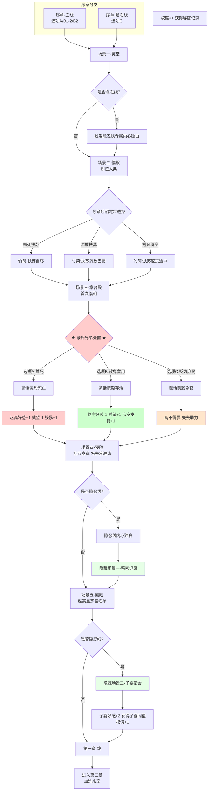

# 《胡亥模拟器》第一章：二世即位

## 【使用说明】

本剧本包含**主线**与**隐忍线**两条路线的内容。以 `【若隐忍线】` 标注的段落为隐忍线专属新增内容（包括内心独白与隐藏场景），其余部分为主线与隐忍线共用。进入扶苏即位IF线的玩家请参阅独立剧本，本章不包含该路线内容。

*校订说明：本章时间线按现有章节总纲统一为“公元前210年八月上旬至中旬”。序章中的“七月丙寅”仅对应沙丘之变当夜，不再沿用到咸阳发丧与即位场景。*

## 【场景一：咸阳宫·灵堂】

*时间线：公元前210年，八月上旬，即位前夕。*

*画面淡入，黑底白字浮现*

**公元前210年，八月上旬。**

**秦始皇嬴政先前崩于沙丘平台。**

**中车府令赵高秘不发丧，与丞相李斯合谋，矫诏立少子胡亥为太子。**

*（注：此处字幕根据序章矫诏定策选择呈现不同内容——若选赐死，则追加“赐死长公子扶苏”；若选流放，则追加“流放长公子扶苏于巴蜀”；若选拖延，则不显示扶苏相关内容。）*

*沉重的钟声在咸阳上空回荡。*

*丧旗从章台宫一直铺到司马门。*

*百官缟素，天下举哀。*

*你此刻正跪在灵堂最前列，身后是仍在咸阳的诸位兄弟姐妹，身前，是那具盛放着父亲尸体的黑色棺椁。*

*你低着头，手还在微微发抖。*

*从沙丘那个闷热的夜晚到现在，一切都像梦一样。你点了头，遗诏被篡改，扶苏的命运在你笔下被决定，车队载着鲍鱼和棺椁绕道返回咸阳……*

*现在，你是太子了。*

*明天，你就是皇帝。*

*可为什么，你跪在这里，却觉得那棺椁里的目光仍在注视着你？*

**【若隐忍线·内心独白】**

*（你在赵高面前点了头。但你点的那个头，不是臣服，是活命。）*

*（你知道，若不答应，你走不出那座偏殿。赵高敢对你说出矫诏之谋，就一定做好了被你拒绝的准备。死人的嘴最严。）*

*（所以你点了头，为了活着。）*

*（棺椁里的父皇沉默着。你不敢看那面玄色旌旗，不是因为心虚，是因为你怕自己一抬头，眼泪就会掉下来。）*

*冗长的丧仪终于结束。你起身时，膝盖已经麻木。宗室和百官依次退出灵堂，每个人经过你身边时，都深深地低下头。*

*他们会像敬畏父亲那样敬畏你吗？*

*一只手轻轻扶住了你的手臂。*

**赵高**：（低声）“陛下节哀。明日即位大典，诸多事宜还需陛下定夺。”

*你看向他。这个中车府令，你的老师，篡谋的真正策划者。他面容清瘦，双目深陷，在众人面前永远是一副恭谨温顺的模样。*

**【若隐忍线·内心独白】**

*（你心中涌起一股难以言说的情绪。）*

*（这个人教你狱法，教你律令，教你如何做一个合格的皇子。他曾经是你最信任的老师。）*

*（他是把你推上皇位的人，也是把你变成囚徒的人。）*

*你垂下眼睫，脸上浮现出几分不安和依赖。*

**胡亥**：“老师……明日之后，我就是皇帝了。”

**赵高**：“陛下本就是皇帝。从始皇帝龙驭宾天的那一刻起，这天下的主人，就只有一个。”

**【若隐忍线·内心独白】**

*（天下的主人。）*

*（你心中冷笑。是，你是皇帝。但你的每一个决定都要经过赵高的手。你坐在御座上，像只被牵着线的木偶。）*

*（不过没关系。你才二十岁。你可以等。）*

*你沉默片刻。*

**胡亥**：（声音很低）“兄长那边……有消息了吗？”

**赵高**：“上郡路远，消息往返需要时日。不过陛下不必忧虑，诏书已发，不日便会有回音。”

*你张了张嘴，想说些什么。*

*扶苏真的会束手就擒吗？*

*那三十万长城军团，真的会坐视主帅被囚吗？*

*如果扶苏起兵，你该怎么办？*

*但你没有问出口。这些问题目前轮不到你来决定。*

**【若隐忍线·内心独白】**

*（不。不是轮不到你决定。）*

*（是你现在还不能让赵高知道，你想决定。）*

*（你必须在赵高面前维持一个怯懦、依赖、没有主见的形象。这是你唯一的盾牌。）*

*你垂下头，让肩膀微微塌下去。*

*命运在推着你走。*

**赵高**：“明日即位，陛下今夜好生歇息。”

*他深深一揖，退入阴影里。灵堂中只剩下你，和那具沉默的棺椁。*

**【若隐忍线·内心独白】**

*（你跪回灵前。）*

*（你抬起头，第一次直视那面玄色旌旗。）*

*（父皇，你在天上看着儿臣吗？）*

*（父皇，儿臣不会做刀。儿臣要做持刀的人。）*

*（但在这之前，儿臣得先学会——怎么藏起自己的刀刃。）*

## 【场景二：咸阳宫·偏殿】

*时间线：公元前210年，八月上旬，即位当日。*

*次日，即位大典。*

*你穿着冕服，头戴冕冠，一步一步走上御阶。每走一步，冕旒上的玉珠便碰撞出清脆的声响。*

*你坐在御座之上，百官三跪九叩，山呼万岁。*

*“皇帝陛下，万岁，万岁，万万岁——”*

*你看着那些匍匐在地的背影，忽然觉得有些恍惚。*

*三个月前，你每天最烦恼的事不过是背不完的律令。而现在，天下人的生死，都在你一念之间。*

*你不确定这是权力的滋味，还是恐惧的滋味。*

**【若隐忍线·内心独白】**

*（你端坐如仪，扫视着群臣。）*

*（李斯站在文臣之首，他的额头贴得很低，你看不到他的表情。）*

*（赵高站在你身侧稍后的位置，用清点羊群的目光扫过群臣。）*

*（忍。你在心里对自己说。今天是第一天。）*

*大典结束。偏殿中，只有赵高与你二人。*

**赵高**：“陛下，上郡有消息了。”

*你的心猛地一缩。*

**胡亥**：“兄长……如何了？”

---

### 【分支一：序章矫诏定策选择“赐死扶苏”】

*赵高从袖中取出一卷竹简，双手呈上。*

**赵高**：“扶苏公子接诏后，当场自尽。蒙恬疑心有诈，不肯就死，已下狱待决。这是上郡传回的奏报。”

*你接过竹简。那上面写着寥寥数行字——扶苏接诏，泣涕终日，谓蒙恬曰：“父赐子死，尚安复请。”遂自刎。*

*你反复读着那行字。*

*他就这么死了。你那位仁厚忠孝的长兄，蒙恬三十万大军在侧，他却没有半分犹豫，就这么死了。*

*你喉咙发干。*

*小时候，扶苏从北方回咸阳述职，总会给你带一些小玩意儿。塞外的石头，胡人的弓箭，草原上捡到的鹰羽。他摸着你的头说，亥儿，你又长高了。*

*那些鹰羽，现在还收在你寝宫的匣子里。*

**【若隐忍线·内心独白】**

*（眼眶有些发热。）*

*（赵高正在观察你，他的目光冰凉而有耐心。）*

*（你不能让他不安。一个让他不安的皇帝，活不长。）*

*（你握紧竹简，让眼泪涌上来，但没有落下来；让嘴唇微微颤抖，但没有发出声音。）*

*（无疑是一个伤心的、软弱的、被兄长的死击垮的弟弟。）*

*（这是赵高想看到的。一个被愧疚压垮的皇帝，最好控制。）*

*（兄长，对不起。亥弟现在还不能为你哭。）*

**赵高**：“陛下？”

**胡亥**：“兄长……以公子之礼，厚葬。”

**赵高**：“遵旨。”

*（隐藏数值变化：残暴值+1，恐惧值+1。扶苏死亡。）*

### 【分支二：序章矫诏定策选择“流放扶苏”】

*赵高从袖中取出一卷竹简，但他的动作比平时慢了一分。*

**赵高**：“陛下……上郡之事，与预想略有不同。”

*你接过竹简。*

*上面写的是：扶苏接诏后，知自己已失储位，闭门不出一昼夜。军中议论纷纷，蒙恬亦上书申辩，不肯轻离边郡。最终，扶苏缴印受命，在亲兵押送下西赴巴蜀；蒙恬暂留军中，戴罪守边。*

*你握着竹简，指节微微发白。*

*他活着。*

*你的兄长，还活着。*

*赵高的声音从身侧传来，不辨喜怒。*

**赵高**：“陛下仁厚。臣已依陛下先前旨意，将扶苏流放巴蜀。只是……扶苏在军中素有威望，留其性命，恐为后患。”

*你抬起头，与赵高对视。*

**胡亥**：“老师。朕说了，流放。”

*赵高沉默了一瞬，然后深深地躬下身去。*

**赵高**：“……遵旨。”

*他的嘴角抿成了一条线。*

*你不知道这个决定是对是错。但至少今夜，你能睡着了。*

**【若隐忍线·内心独白】**

*（你看着赵高退出的背影，心中涌起一种奇异的感觉。）*

*（这是你第一次对他说“不”。不是激烈的反抗，只是一个温和的、看似出于仁厚的修改。）*

*（赵高不会为了一个流放的扶苏和你翻脸。不值得。他的目标是蒙氏，是整个朝廷。一个被发配到巴蜀的兄长，对他构不成威胁。）*

*（但你救下了扶苏。你让他活着。）*

*（你不知道将来能不能用到这颗棋子。但至少，你手里有了一颗赵高不知道的棋子。）*

*（这就够了。）*

*（隐藏数值变化：扶苏存活，流放巴蜀。宗室支持度+1，赵高好感度-1。获得关键标记【力保扶苏】。）*

### 【分支三：序章矫诏定策选择“拖延待变”】

*（此分支仅隐忍线可见。）*

*赵高从袖中取出一卷竹简，神色比往日凝重。*

**赵高**：“陛下。扶苏接诏后，已启程返京。但……”

**赵高**：“蒙恬并未随行。他以‘北境防务不可无人主持’为由，留驻上郡。扶苏只带了数百亲兵上路。”

*你心中飞速盘算。*

*蒙恬不随行，这意味着他起了疑心。但扶苏仍然上路了，说明他还在赌，赌父皇只是病重，赌这封玺书是真的。*

**赵高**：“陛下，扶苏不日将至咸阳。届时见到先帝已崩，恐生变故。陛下需早做定夺。”

**胡亥**：“朕知道了。等他到了再说。”

**赵高**：“……陛下圣明。”

*（隐藏数值变化：扶苏存活，正在返京途中。后续章节将出现“扶苏归来”事件。恐惧值+1，权谋值+1。赵高警惕度上升。）*

**【若隐忍线·内心独白】**

*（扶苏在回来的路上。）*

*（你不知道这是好事还是坏事。他若见到咸阳的局势，会怎么做？会揭竿而起，还是隐忍不发？如果他揭竿而起，你怎么办？如果他隐忍不发，你又怎么办？）*

*（但至少，他现在还活着。比死了强。）*

*（你在心里默默记下一笔，蒙恬起了疑心，扶苏仍在赌。这两个人，或许可以成为你将来的变数。）*

### 【场景二通用结尾】

**赵高**：“还有一事，需陛下圣断。蒙恬虽已下狱，但其弟蒙毅尚在咸阳，为上卿。蒙氏世代为将，军中门生故吏遍布天下。如今……蒙氏若不除，恐生后患。”

**胡亥**：“老师的意思是……”

**赵高**：“蒙恬当死，蒙毅亦当死。”

## 【场景三：咸阳宫·章台殿】

*时间线：公元前210年，八月上旬，即位第三日。*

*即位第三日。*

*你第一次正式临朝听政。御座又高又硬，坐得你腰背酸痛。殿下群臣黑压压跪了一片，无数双眼睛盯着你，等着你开口。*

*你感到喉咙发干。*

**赵高**：（低声）“陛下，今日廷议，有两件事需要圣裁。其一，蒙毅的处置。其二，始皇帝陵和阿房宫的工期。”

*你点点头。*

**胡亥**：“蒙毅何在？”

*队列中，一人出列，伏地叩首。*

**蒙毅**：“罪臣蒙毅，叩见陛下。”

*蒙毅与其兄蒙恬不同，蒙恬是武将，蒙毅是文臣，位至上卿，深得父皇信任。你记得小时候，蒙毅曾教过你兵法。他总是很严厉，但从不吝啬夸奖。*

*现在他跪在你面前，自称罪臣。*

**胡亥**：“蒙毅，你可知罪？”

**蒙毅**：（叩首）“罪臣之兄蒙恬，驻军上郡，拥兵自重，疑有异心。罪臣身为宗族子弟，未能及时举发，有负先帝圣恩。请陛下治罪。”

**赵高**：“陛下，蒙毅此人，巧言令色，不可轻信。先帝在时，他便屡次进谗，诽谤陛下。如今其兄谋逆已露，蒙毅岂能独善其身？”

*你看向赵高，又看向匍匐在地的蒙毅。*

*殿上落针可闻。所有人都在等你的决定。*

**【若隐忍线·内心独白】**

*（蒙氏是将门世家，军中门生故吏遍布天下。如果能把蒙毅暗中保下来，将来便是对抗赵高的重要力量。但赵高正盯着你，满朝文武正盯着你。你不能表现得太明显。）*

*（你得想一个让赵高无法反驳的理由……）*

## ★ 核心选择节点：蒙氏兄弟的处置 ★

### 【选项A：同意赵高，处死蒙恬蒙毅】

*你闭上眼睛。再睁开时，目光已经冷了下来。*

**胡亥**：“蒙氏兄弟，心怀不轨。蒙恬拥兵自重，蒙毅知情不报。传朕旨意，蒙恬赐死于阳周狱中，蒙毅斩于咸阳东市。蒙氏宗族，徙边。”

*蒙毅猛地抬起头，眼中满是不可置信。*

**蒙毅**：“陛下！罪臣冤枉！先帝在时，罪臣忠心耿耿，天地可鉴！”

**赵高**：（冷冷）“拖下去。”

*两名侍卫上前，将蒙毅架出殿外。他的喊冤声越来越远，终于消失在殿门之外。*

*殿上群臣，无一人敢言。*

*你端坐在御座上，感到自己的心跳得很快。你告诉自己，这是必要的。你是皇帝了，皇帝不能心软。*

*可为什么，你觉得御座又冷了几分？*

*（隐藏数值变化：赵高好感度+1，威望值-1，残暴值+1。蒙恬、蒙毅死亡。）*

**【若隐忍线·内心独白】**

*（蒙恬，蒙毅。大秦最后的柱石。你亲手把他们拆了。不是因为你恨他们，是因为你现在还不够强。你保不住他们。）*

*（你在心里默念那两个名字。将来有一天，如果你能赢，你要为他们平反。如果你输了——那这些账，就一起埋进土里吧。）*

### 【选项B：赦免留用】

*你沉默良久，终于开口。*

**胡亥**：“蒙恬守边十余年，匈奴不敢南下而牧马。蒙毅事君数载，先帝未尝有过恶言。今以疑罪杀忠良，非朕所愿。”

**赵高**：“陛下——”

**胡亥**：（提高声音）“传朕旨意。蒙恬仍守北疆，戴罪立功。蒙毅降职三等，留朝听用。此事到此为止。”

*蒙毅浑身一颤，重重叩首。*

**蒙毅**：“罪臣……谢陛下隆恩！”

*他抬起头时，你看到他眼眶发红。*

*退朝后，赵高在偏殿拦住了你。*

**赵高**：“陛下今日之举，臣不敢苟同。蒙氏在军中根深蒂固，今日不除，来日必为大患。”

*你停下脚步，转身看着他。*

**胡亥**：“老师。朕是皇帝。朕说了，到此为止。”

*赵高看着你，眼神变幻不定。最后，他缓缓躬下身。*

**赵高**：“……陛下圣明。”

*但你知道，这件事没有结束。*

*（隐藏数值变化：赵高好感度-1，威望值+1，宗室支持度+1。蒙恬、蒙毅存活。）*

**【若隐忍线·内心独白】**

*（你成功了。你保下了蒙氏兄弟。）*

*（赵高不会善罢甘休，他一定会再找机会除掉他们。但至少今天，你赢了。你用一个仁君的姿态，堵住了赵高的嘴。）*

*（更重要的是，蒙毅抬起头时，你看懂了他眼中的神色。那不是感激，是重新燃起的希望。他知道，你是在用自己的方式保护他。）*

*（这个人，将来可用。）*

### 【选项C：贬为庶民】

*你斟酌再三，选了一个折中的方案。*

**胡亥**：“蒙恬、蒙毅，夺爵免官，贬为庶民。三代之内，不许入仕。”

*蒙毅伏在地上，肩膀微微颤抖。半晌，他重重叩首。*

**蒙毅**：“……罪臣，领旨谢恩。”

*他的声音里没有怨恨，只有一种深沉的疲惫。*

*赵高似乎对这个结果不甚满意，但也没有再说什么。毕竟，失去了官爵的蒙氏，已经不再是威胁。*

*退朝时，你看到蒙毅佝偻着背走出了章台殿。他的背影，显得有些佝偻，像被抽去了骨头。*

*你忽然想起父皇说过的话：蒙氏，秦之柱石也。*

*现在，这根柱石被你亲手拆了。*

*（隐藏数值变化：蒙恬、蒙毅免官为民，不再参与后续剧情。）*

**【若隐忍线·内心独白】**

*（你没有杀他，但也没有保他。你选择了一条中间的路——免官为民，永不叙用。）*

*（这或许是最安全的做法。赵高没有理由再动一个庶民，你也没有给赵高留下话柄。）*

*（但你也失去了一个潜在的盟友。蒙毅回到乡里，从此不问朝政。大秦的柱石，就这样变成了一介农夫。）*

*（你告诉自己，这是必要的取舍。但你还是忍不住想——如果有一天你需要用人的时候，还有人可用吗？）*

## 【场景四：咸阳宫·寝殿】

*时间线：公元前210年，八月上旬，即位第三日，深夜。*

*深夜。*

*你独自坐在寝殿里，面前摊着一卷又一卷的奏章。*各地的钱粮、刑名、工程、军报……*

*你拿起一卷，是李斯的奏疏。他建议继续严格执行秦律，加大株连力度，以严刑峻法震慑天下。*

*你又拿起一卷，是冯去疾的奏疏。他建议减轻徭役，与民休息，否则关东民力将不堪重负。*

*父皇在世时，这些奏疏都是怎么批的？他似乎从来不需要犹豫。对就是对，错就是错，杀就是杀。父皇的手从不颤抖。*

**【若隐忍线·内心独白】**

*（你放下两卷奏疏，揉了揉眉心。）*

*（李斯。冯去疾。一个是法家巨擘，一个是三朝老臣。他们的意见截然相反，但你知道，他们说的都有道理。）*

*（可你现在还不能自己拿主意。明天赵高会来问你——陛下看完了吗？打算怎么批？你会说，老师觉得该怎么批？然后赵高会微笑着说出他的意见，你会点头说，就按老师说的办。）*

*（你每天都是这样过的。）*

*（但你没有浪费这些奏疏。你在看，你在学。你在学李斯的法家之术，在学冯去疾的治国之道。你在心里记住每一郡的钱粮数目，记住每一县的刑案统计。你在心里构建一个属于你自己的大秦。）*

*（总有一天，这些知识会有用。但不是现在。）*

*烛火摇曳。你抬起头，发现殿门口站着一个人。*

*那人身材高大，须发花白，穿着一身半旧的官服。你认出了他——右丞相冯去疾。*

**胡亥**：“冯丞相？这么晚了……”

**冯去疾**：（跪下）“老臣有一言，冒死进谏。”

*你放下竹简。*

**胡亥**：“说。”

**冯去疾**：“陛下即位以来，扶苏之事、蒙氏之事，已令天下震动。老臣斗胆请问陛下——接下来，还要处置多少人？”

*你愣住了。*

**冯去疾**：（叩首，声音苍老而颤抖，却一字一句，掷地有声）“先帝以法治国，然法非不教而诛。扶苏公子仁孝，蒙氏兄弟忠勇，皆先帝所重。今陛下初即位，便如此处置先帝所重之人，天下人当作何想？”

**冯去疾**：“老臣侍奉先帝三十年，今日冒死进言，不为蒙氏，不为扶苏，是为了陛下，是为了大秦。”

**胡亥**：（长久的沉默后）“冯丞相……你下去吧。”

**冯去疾**：“陛下！”

**胡亥**：（提高声音）“下去！”

*冯去疾抬起头，与你对视。他眼中闪过失望、悲哀，最终化为一声叹息。*

**冯去疾**：“……老臣告退。”

**【若隐忍线·内心独白】**

*（冯去疾走了。你看着他的背影，在心中默默记下了这个名字。）*

*（他是少数敢对你说真话的人。但他太直了，直得不适合这座咸阳宫。他今天对你说的话，明天就会传到赵高耳朵里。赵高不会容忍一个敢劝谏皇帝不要杀人的丞相。）*

*（你想保他。但你不知道怎么保。）*

*（你只能在他的名字旁边，在心里打一个记号，此人可用，但需保护。）*

## 【隐藏场景一：胡亥的秘密记录】

*时间线：公元前210年，八月上旬，即位第三日，夜半。*

*（此场景仅隐忍线可见。）*

*冯去疾走后，你没有立刻入睡。*

*你站起身，走到寝殿深处。书架后面，有一道你小时候就发现的暗门。那是父皇留下的密室。父皇在世时，你从未进去过。你不敢。*

*但今天，你推开了那扇门。*

*密室很小，只有一丈见方。墙上有一盏油灯，你点燃它。昏黄的光照亮了空荡荡的石室——一张案几，几卷空白的竹简，笔墨俱全。*

*这是父皇批阅密奏的地方。*

*你坐在案前，提起笔。*

*你在第一卷竹简上写下第一行字——*

*“沙丘。七月丙寅。赵高谓朕曰：遗诏在臣手中。李斯在侧，默然不语。”*

*你写得很慢，一笔一划。*

*“赵高令朕赐死扶苏。朕不能拒。”*

*（注：若序章矫诏定策选择“流放扶苏”，此处改为“赵高令朕赐死扶苏。朕以流放代之。”若选择“拖延待变”，此处改为“赵高令朕赐死扶苏。朕以缓兵之计拖延。”）*

*“赵高令朕处置蒙恬、蒙毅。朕……”*

*（注：此处根据本章选择续写。若处死蒙氏，则记“朕不能拒”；若赦免留用，则记“朕以留用代死”；若贬为庶民，则记“朕以免官折中”。）*

*你放下笔，看着自己写下的字。墨迹未干，在油灯下泛着湿润的光。*

*这是你的秘密。你的记录。你的账本。*

*你不知道这些记录什么时候能用上。但你知道，只要它们在，赵高的每一条罪证就不会被时间抹去。*

*你把竹简卷起，藏入密室暗格。然后吹灭油灯，走出密室。*

*暗门合拢，书架恢复原状。寝殿中一切如常，仿佛什么都没有发生过。*

*窗外，月色如霜。*

*（隐藏数值变化：权谋值+1。获得关键标记【秘密记录】。赵高罪证累计：1。）*

## 【场景五：咸阳宫·偏殿】

*时间线：公元前210年，八月中旬，夜。*

*数日后。夜。*

*赵高密召你至一处偏殿。殿中只有你们二人。*

**赵高**：“陛下，臣近日听到一些风声。”

**胡亥**：“什么风声？”

**赵高**：“宗室诸公子，对陛下颇有微词。尤其是公子高、公子将闾几人，私下多次聚会，言语间似有不臣之意。”

*你皱起眉。*

**胡亥**：“他们说了什么？”

**赵高**：（凑近，压低声音）“他们说……沙丘之事，疑点重重。扶苏之事，恐有隐情。”

*（注：此处根据序章分支细化。若扶苏已死，则为“扶苏之死，恐有隐情”；若扶苏被流放，则为“扶苏流放，恐有隐情”；若扶苏返京途中，则为“扶苏返京，恐生变数”。）*

*你的瞳孔猛地收缩。*

**胡亥**：“他们……知道了？”

**赵高**：（摇头）“不过是猜测。但猜测，就够了。陛下，人心一旦生疑，再想收拢，就难了。”

*他顿了顿，目光幽深地看着你。*

**赵高**：“始皇帝有子女二十余人。这些人，每一个身上都流着先帝的血。每一个，都有资格坐上这把椅子。陛下觉得，他们会甘心吗？”

**赵高**：“斩草不除根，春风吹又生。扶苏之事尚未真正了结，但他的兄弟们还在。只要有一个活着，陛下的江山，就坐不稳。”

*他从袖中取出一卷竹简，双手呈上。*

**赵高**：“这是宗室诸公子的名单。请陛下过目。”

*你接过竹简。上面密密麻麻写着二十几个名字，每一个都是你的手足。公子高，公子将闾，公子婴……你一行一行看下去，越看越觉得那些名字像是一把把刀。*

*你抬起头，看向赵高。他的面容在烛光中平静如水，仿佛在等待一个注定会来的答案。*

*窗外，咸阳的夜空漆黑如墨。没有月亮，也没有星星。*

**【若隐忍线·内心独白】**

*（宗室。你的兄弟姐妹。赵高要把他们也杀掉。）*

*（你知道他的逻辑，所有流着父皇血脉的人，都有资格坐这把椅子。赵高不能容忍任何潜在的威胁。他要让这座咸阳宫里，只剩下你一个嬴姓的子嗣。一个孤零零的、只能依赖他的皇帝。）*

*（你恨他。但你脸上的表情是犹豫，是不安，是一个被说服的懦弱皇帝。）*

*（“老师……让朕再想想。”）*

*（赵高看着你，嘴角微微勾起。他知道你会答应的。你从来都会答应的。）*

*（他退出偏殿。你独自坐在烛火中，将那卷竹简缓缓收拢。）*

*（名单上的每一个名字，你都记住了。尤其是其中一个，公子婴。）*

*（你的堂叔。一个从不参与任何争斗、安安静静种菜的人。）*

*（赵高要杀他。但你不打算让他死。）*

## 【隐藏场景二：与子婴的初次密会】

*时间线：公元前210年，八月中下旬，黄昏。*

*（此场景仅隐忍线可见。触发条件：获得【隐忍待发】标记。）*

*数日后。黄昏。*

*你微服出宫。只带了心腹宦官韩谈一人，车驾朴素，从侧门驶出咸阳宫。*

*你要去公子婴的府邸。*

*你在宗室名单上看到他的名字时，心中就浮现出一个模糊的念头。公子婴，你的堂叔。在始皇帝二十几个子女中，他是最不起眼的一个。不争，不抢，不结党，不营私。每日在府中种菜读书，仿佛他不是嬴姓血脉，只是一个普通的富家翁。*

*但正是这种“不起眼”，让你注意到了他。*

*能在咸阳这座杀人泥潭里“不起眼”地活到现在的人，一定不简单。*

*车驾停在公子婴府邸侧门。这是一座偏僻的宅院，门庭冷落，连看门的仆人都在打瞌睡。你让韩谈留在门外，独自推门而入。*

*院中是一片菜园。*

*公子婴正蹲在地里，侍弄着他的菜苗。夕阳将他的影子拉得很长。他听到脚步声，没有回头。*

**子婴**：“陛下来了。”

**胡亥**：“叔父知道朕要来？”

**子婴**：“臣不知道。臣只是觉得，陛下应该会来。”

*他站起来，拍了拍手上的泥土，转过身看着你。他的眼睛像两潭深水，看不到底。*

**子婴**：“陛下看了赵高呈上的名单。名单上有臣的名字。陛下不想杀臣，所以陛下来了。”

*你心中一震。这个人，什么都知道。*

**胡亥**：“……叔父既然知道赵高要杀你，为何不逃？”

**子婴**：“逃到哪里去？天下都是大秦的疆土，臣能逃到哪里？”

**子婴**：“而且，臣若逃了，陛下怎么向赵高交代？”

**子婴**：“陛下今日来，是想问臣什么？”

*你看着他。*

**胡亥**：“朕想问叔父，朕该怎么办？”

*子婴没有立刻回答。他弯腰，从地里拔起一棵菜，抖掉根上的泥土。*

**子婴**：“陛下有没有想过，赵高为什么敢把名单呈给陛下？”

**子婴**：“因为他知道陛下最后总会退让。自即位以来，扶苏之事如此，蒙氏之事亦如此。赵高已经习惯了陛下在他的刀口上低头。”

**子婴**：“陛下在忍，臣看得出来。但陛下有没有想过，忍，和顺从，有时候看起来一模一样？”

**子婴**：“赵高现在不杀陛下，是因为他觉得陛下好控制。但如果有一天，他发现陛下其实不好控制，发现陛下一直在忍，一直在暗中积蓄力量，陛下觉得，他会怎么做？”

*你握紧了拳头。*

**胡亥**：“……他会先下手为强。”

**子婴**：“是。”

**子婴**：“所以，陛下要忍，但不能只忍。陛下要学会在顺从的外表下，做赵高看不到的事。”

*他从地里又拔起一棵菜，递给你。*

**子婴**：“臣在宗室中是最不起眼的人。不起眼的人，反而好做事。陛下若信得过臣，臣愿为陛下暗中联络可用之人。禁卫中对赵高不满者，蒙氏旧部中被贬黜者，宗室中被赵高威胁者，这些人，散落在咸阳各处，像菜籽一样。陛下需要一个人，把他们一颗一颗捡起来。”

*你接过那棵菜。菜根上还带着泥土，湿润而冰凉。*

**胡亥**：“叔父为什么要帮朕？”

**子婴**：“因为臣也姓嬴。”

**胡亥**：“叔父。从今日起，朕会暗中保护宗室中可用之人。名单上的人，朕能保一个是一个。但朕需要叔父替朕做一件事。”

**子婴**：“陛下请讲。”

**胡亥**：“替朕留意赵高的党羽。禁卫、少府、郎中令，哪些是赵高的人，哪些是可以拉拢的人。朕要知道。”

*子婴深深看了你一眼，然后缓缓躬下身。*

**子婴**：“臣，领旨。”

*他直起身，忽然说了一句不相干的话。*

**子婴**：“陛下。种菜和做人，其实是一个道理。菜要长得好，不能只浇水，还得防虫。虫子这种东西，你不理它，它就会越来越多。等你想理的时候，菜已经被啃光了。”

*（隐藏数值变化：子婴好感度+2。获得关键标记【子婴同盟】。权谋值+1。）*

## 【第一章完成·数值结算】

### 通用数值

| 数值       | 变化情况                           |
| :--------- | :--------------------------------- |
| 残暴值     | 根据蒙氏处置选择：处死+1，其余不变 |
| 威望值     | 赦免留用+1，处死-1，贬为庶民不变   |
| 恐惧值     | 序章累计值 + 本章根据选择可能增加  |
| 赵高好感度 | 处死+1，赦免-1，贬为庶民不变       |
| 宗室支持度 | 赦免留用+1，其余不变               |

### 隐忍线专属数值

| 数值       | 初始值 | 本章变化                     | 当前值 |
| :--------- | :----- | :--------------------------- | :----- |
| 权谋值     | 0      | +1（秘密记录）+1（子婴密会） | 2      |
| 子婴好感度 | 0      | +2（子婴同盟）               | 2      |
| 赵高罪证   | 0      | +1（秘密记录）               | 1      |

### 关键标记汇总

**通用标记（根据选择获得）：**

- 蒙恬蒙毅：死亡 / 存活 / 免官

**隐忍线专属标记：**

- 【隐忍待发】（序章获得）
- 【秘密记录】（隐藏场景一获得）
- 【子婴同盟】（隐藏场景二获得）

### 关键人物状态

| 人物           | 状态                                           |
| :------------- | :--------------------------------------------- |
| 扶苏           | 死亡 / 流放巴蜀 / 返京途中（根据序章矫诏定策） |
| 蒙恬           | 死亡 / 留用 / 免官（根据本章选择）             |
| 蒙毅           | 死亡 / 留用 / 免官（根据本章选择）             |
| 冯去疾         | 失望但仍在朝                                   |
| 赵高           | 对玩家态度根据选择产生分化                     |
| 子婴（隐忍线） | 【子婴同盟】——已建立秘密同盟关系               |

**第一章结束。存档。**

