# 《胡亥模拟器》第一章：二世即位（隐忍线增改版）

## 【使用说明】

本剧本在主线第一章基础上进行增量创作。**加粗段落**为隐忍线专属新增内容，**以 `【若隐忍线】` 标注的段落**为内心独白/隐藏场景，其余部分与原主线完全一致。

## 【前情回顾】

*画面淡入，黑底白字浮现*

**公元前210年，七月丙寅。**

**秦始皇嬴政崩于沙丘平台。**

**中车府令赵高秘不发丧，与丞相李斯合谋，矫诏立少子胡亥为太子，赐死长公子扶苏。**

**历史的车轮，在这一夜悄然转向……**

## 【场景一：咸阳宫·灵堂】

*沉重的钟声在咸阳上空回荡。*

*白虎纹的丧旗从章台宫一直铺到司马门。百官缟素，天下举哀。*

*而你——嬴胡亥，始皇帝第十八子，此刻正跪在灵堂最前列。你身后是你的二十余位兄弟姐妹。你身前，是那具盛放着千古一帝的黑色棺椁。*

*你低着头，不敢去看那棺椁上的玄色旌旗。你的手还在微微发抖。*

*三天前，在沙丘那个闷热的夜晚，你做了人生中最重要的决定——你点了头。然后一切都像梦一样：遗诏被扣下，新的诏书写好，扶苏被赐死，蒙恬被囚禁，车队绕道返回咸阳，臭鱼烂虾被装上车掩盖尸臭……*

*现在，你是太子了。*
*明天，你就是皇帝。*

*可为什么，你跪在这里，却觉得那棺椁里的目光仍在注视着你？*

**【若隐忍线·内心独白】**

*（你低着头，袖中的手指却悄悄握紧了。）*

*三天前，在沙丘那个夜晚，你对赵高点了头。但你点的那个头，不是臣服，是活命。你知道，若不答应，你走不出那座偏殿。赵高敢对你说出矫诏之谋，就一定做好了被你拒绝的准备——死人的嘴，最严。*

*所以你点了头。所以你活着。*

*但你在心里对自己说：胡亥，你要记住。记住今夜赵高说过的每一个字。记住李斯站在他身边时的表情。记住他们是怎么把遗诏换掉的。总有一天，你要让他们知道，你点头，不是因为你怕他们——是因为你要让他们以为你怕他们。*

*棺椁里的父皇沉默着。你不敢看那面玄色旌旗，不是因为心虚，是因为你怕自己一抬头，眼泪就会掉下来。*

*父皇，儿臣不是故意的。但儿臣会活下去。*

*（获得关键标记【隐忍待发】。权谋值+1。）*

*冗长的丧仪终于结束。你起身时，膝盖已经麻木。宗室和百官依次退出灵堂，每个人经过你身边时，都深深地低下头。你不知道那低垂的面孔下，是敬畏，还是别的什么。*

*一只手轻轻扶住了你的手臂。*

**赵高**：（低声）“陛下节哀。明日即位大典，诸多事宜还需陛下定夺。”

*你看向他。这个中车府令，你的法学老师，沙丘之谋的真正策划者。他面容清瘦，双目深陷，永远是一副恭谨温顺的模样。但你知道那双眼睛里藏着什么。*

**【若隐忍线·内心独白】**

*你看着赵高恭谨的面容，心中涌起一股难以言说的情绪。这个人教你狱法，教你律令，教你如何做一个合格的皇子。他曾经是你最信任的老师。*

*但沙丘那夜之后，你再也无法用“老师”两个字来称呼他——至少在心里不行。*

*他是把你推上皇位的人，也是把你变成囚徒的人。*

*你垂下眼睫，让脸上浮现出恰到好处的不安和依赖。*

**胡亥**：“老师……明日之后，朕就是皇帝了。”

**赵高**：“陛下本就是皇帝。从始皇帝龙驭宾天的那一刻起，这天下的主人，就只有一个。”

**【若隐忍线·内心独白】**

*天下的主人。你听着这四个字，心中冷笑。*

*是，你是皇帝。但你的每一道诏书都要经过赵高之手，你的每一个决定都要看赵高的眼色。你坐在御座上，但牵着线的，是站在你身后的这个人。*

*不过没关系。你才二十岁。你可以等。*

*你沉默片刻。*

**胡亥**：（声音很低）“兄长那边……有消息了吗？”

*赵高的嘴角微微牵动。*

**赵高**：“上郡路远，消息往返需要时日。不过陛下不必忧虑，遗诏已发，蒙恬已囚，扶苏公子素来仁孝，必不会抗旨。”

*你张了张嘴，想说些什么。*
*——他真的不会抗旨吗？*
*——那三十万长城军团，真的会坐视主帅被囚吗？*
*——如果扶苏起兵，你该怎么办？*

*但你没有问出口。因为你知道，从沙丘那夜开始，这些问题，就已经轮不到你来决定了。*

**【若隐忍线·内心独白】**

*不。不是轮不到你决定。是你现在还不能让赵高知道，你想决定。*

*你必须在赵高面前维持一个“怯懦、依赖、没有主见”的形象。这是你唯一的盾牌。*

*你垂下头，让肩膀微微塌下去，像一个被命运推着走的孩子。*

**赵高**：“陛下今夜好生歇息。明日即位，还有一场硬仗。”

*他深深一揖，退入烛光照不到的阴影里。*

*灵堂中只剩下你，和那具沉默的棺椁。*

**【若隐忍线·内心独白】**

*你跪回灵前。*

*你抬起头，第一次直视那面玄色旌旗。父皇，你在天上看着儿臣吗？儿臣不知道能不能赢。但儿臣保证，儿臣不会永远做别人的刀。*

## 【过场·梦境】

*是夜，你做了一个梦。*

*梦里，你回到了小时候。你大概是七八岁的样子，正跪在父亲的书房里背律令。你背错了一条，父亲便用竹简敲你的额头。*

*“胡亥，你记住，法者，治之端也。为君者不通律法，何以御臣下？”*

*你哭着说，儿臣知错了。*

*父亲看着你，忽然叹了口气。他把你抱起来，放在膝上。父亲的手很粗糙，但很温暖。*

*“朕这些儿子里，你最像朕年少时。但像朕，未必是好事。”*

*你不懂。*

*“朕这一生，杀人太多。朕不怕天下人恨朕，只怕后世无人懂朕。”*

*他顿了顿，低头看着你的眼睛。*

*“胡亥，你记住。皇帝不是人做的。皇帝是一把刀，一把悬在天下人头顶的刀。你要么永远锋利，要么……就被别人折断。”*

*你从梦中惊醒。*

*窗外，月色如霜。*

**【若隐忍线·内心独白】**

*你坐起身，汗湿透了衣襟。父皇的话还在耳边回响——“你要么永远锋利，要么就被别人折断。”*

*你低声重复了一遍这句话。然后你掀开被褥，赤脚踩在冰凉的地砖上。凉意从脚底蔓延到全身，让你彻底清醒过来。*

*你走到窗边，看着那轮冷月。*

*父皇。儿臣不会做刀。儿臣要做持刀的人。*

*但在这之前，儿臣得先学会——怎么藏起自己的刀刃。*

## 【场景二：咸阳宫·偏殿】

*次日，即位大典。*

*你穿着玄色十二章纹的冕服，头戴十二旒的冕冠，一步一步走上御阶。每走一步，冕旒上的玉珠便碰撞出清脆的声响。那声响在空旷的大殿里回荡，像极了父亲冕冠上的声音。*

*你跪坐在御座之上。*

*殿下，百官三跪九叩，山呼万岁。*

*“皇帝陛下，万岁，万岁，万万岁——”*

*你看着那些匍匐在地的背影，忽然觉得有些恍惚。三个月前，你还只是始皇帝最宠爱的小儿子，每天最烦恼的事不过是背不完的律令。而现在，天下人的生死，都在你一念之间。*

*你不确定这是权力的滋味，还是恐惧的滋味。*

**【若隐忍线·内心独白】**

*你扫视着殿中匍匐的群臣。他们在向你跪拜，但他们的忠诚属于谁？李斯站在文臣之首，他的额头贴着地砖，你看不到他的表情。赵高站在你身侧稍后的位置，他的目光扫过群臣，像一个牧人在清点他的羊群。*

*你知道，这些跪拜的人中，大半跪的不是你，是你身侧的那个人。*

*但你脸上没有任何表情。你端坐如仪，像一个真正的皇帝。*

*——忍。你在心里对自己说。今天是第一天。*

*大典结束。偏殿中，只有赵高与你二人。*

**赵高**：“陛下，上郡有消息了。”

*你的心猛地一缩。*

**胡亥**：“兄长……如何了？”

*赵高从袖中取出一卷竹简，双手呈上。*

**赵高**：“扶苏公子接诏后，当场自尽。蒙恬疑心有诈，不肯就死，已下狱待决。这是上郡传回的奏报。”

*你接过竹简。那上面写着寥寥数行字——扶苏接诏，泣涕终日，谓蒙恬曰：‘父赐子死，尚安复请。’遂自刎。*

*你反复读着那行字，读了一遍又一遍。*

*父赐子死，尚安复请。*

*他就这么死了。你那位仁厚忠孝的长兄，蒙恬三十万大军在侧，他却没有半分犹豫，就这么死了。*

*你忽然觉得喉咙发紧。你想起小时候，扶苏从北方回咸阳述职，总会给你带一些小玩意儿。塞外的石头，胡人的弓箭，草原上捡到的鹰羽。他摸着你的头说，亥儿，你又长高了。*

*那些鹰羽，现在还收在你寝宫的匣子里。*

**【若隐忍线·内心独白】**

*你的喉咙发紧，眼眶发热。但你知道，赵高正在观察你。他的目光像一条蛇，冰凉而耐心，正在评估你的反应——你是会崩溃，还是会愤怒，还是会露出让他不安的表情。*

*你不能让他不安。一个让他不安的皇帝，活不长。*

*你握紧竹简，指节发白。让眼泪涌上来，但没有落下来。让嘴唇微微颤抖，但没有发出声音。你在表演一个伤心的、软弱的、被兄长的死击垮的弟弟。*

*这是赵高想看到的。一个被愧疚压垮的皇帝，最好控制。*

*——兄长。对不起。亥弟现在还不能为你哭。等有一天，亥弟会替你报仇。但不是现在。*

**赵高**：“陛下？”

*你猛地回过神来。赵高正在观察你的表情。*

*你握紧了竹简。*

**胡亥**：“兄长……以公子之礼，厚葬。”

**赵高**：“遵旨。”

*他顿了顿。*

**赵高**：“还有一事，需陛下圣断。蒙恬虽已下狱，但其弟蒙毅尚在咸阳，为上卿。蒙氏世代为将，军中门生故吏遍布天下。如今扶苏已死，蒙氏若不除，恐生后患。”

*你抬起头，看向赵高。*

**胡亥**：“老师的意思是……”

**赵高**：“蒙恬当死，蒙毅亦当死。”

*他声音平静，仿佛在讨论今晚的膳食。*

**【若隐忍线·内心独白】**

*蒙恬。蒙毅。大秦的柱石。父皇最信任的将领。*

*赵高要你杀了他们。不是因为他们有罪，是因为他们忠于扶苏，忠于父皇，唯独不会忠于你——一个被赵高扶上皇位的傀儡。*

*你心里很清楚：蒙氏兄弟活着，就是赵高的威胁。赵高要把所有可能威胁他的人都除掉。而你，是他手里的刀。*

*你不能拒绝。至少现在不能。但你可以……留下一点余地。*

*你垂下眼睫，让脸上浮现出犹豫和挣扎。然后你抬起头，用一种不确定的语气开口。*

## ★ 核心选择节点一：扶苏的处置 ★

*（注：此处的选项实际发生在本场景之前，但通过回忆/对话方式呈现。玩家在游戏开局时已做出选择，此处剧情根据先前选择呈现不同版本。）*

**【若序章选择A：同意矫诏→坚持赐死】**

*你沉默了很久。*

**胡亥**：（低声）“遗诏已发，无可挽回。兄长……对不住了。”

*你没有更改赐死的命令。扶苏自刎于上郡军中，蒙恬下狱。消息传回咸阳，群臣噤若寒蝉。没有人敢议论，但你从他们的眼神中看到了恐惧——和某种你读不懂的东西。*

*（隐藏数值变化：残暴值+1，恐惧值+1）*

**【若隐忍线·内心独白】**

*你没有改口。你让扶苏死了。*

*不是因为你不想救他。是因为你知道，你救不了。赵高要扶苏死，李斯要扶苏死。你一个小小的傀儡皇帝，拿什么去保一个远在上郡、拥兵三十万的长兄？你越保他，赵高越会觉得你有异心。*

*你只能在心里记住：扶苏，是赵高杀的。蒙恬，也是赵高杀的。这些血债，总有一天要算清楚。*

**【若序章选择B：拒绝矫诏→扶苏未死线】**

*（此线剧情不同，呈现为扶苏收到密报后起兵）*

**赵高**：（脸色铁青）“陛下……出事了。扶苏并未自尽。有人走漏了消息，扶苏与蒙恬率三十万大军南下，打出‘清君侧、诛奸佞’的旗号。先锋已过九原。”

*你猛地站起来，冕旒上的玉珠哗啦作响。*

**胡亥**：“什么？！”

*赵高死死盯着你。*

**赵高**：“陛下，事到如今，唯有一战。”

*（剧情转入“兄弟相争”线，第一章后续内容大幅变动）*

**【若序章选择C：暗中布局】**

*你垂下眼睫，不让赵高看清你的表情。*

**胡亥**：“老师说得是。但兄长毕竟是父皇长子，处死有伤圣德。朕意……改赐死为流放。发配巴蜀，永不叙用。”

*赵高眉头微微一皱。*

**赵高**：“陛下仁厚。只是扶苏在军中素有威望，若留其性命……”

**胡亥**：（打断）“老师。朕说了，流放。”

*你抬起眼睛，平静地与赵高对视。*

*这是你第一次用这种语气对他说话。*

*赵高沉默了一瞬，然后深深地躬下身去。*

**赵高**：“……遵旨。”

*他退下时，你看到他的嘴角抿成了一条线。*

*扶苏被流放巴蜀。蒙恬降职留用，仍守北疆。*

*你不知道这个决定是对是错。但至少今夜，你能睡着了。*

*（隐藏数值变化：扶苏存活，宗室支持度+1，赵高好感度-1）*

**【若隐忍线·内心独白】**

*你看着赵高退出的背影，心中涌起一种奇异的感觉。这是你第一次对他说“不”。不是激烈的反抗，只是一个温和的、看似出于“仁厚”的修改。*

*赵高不会为了一个扶苏和你翻脸。不值得。他的目标是蒙氏，是整个朝廷。一个被流放到巴蜀的扶苏，对他构不成威胁。*

*但你救下了兄长。你让他活着。*

*你不知道将来能不能用到这颗棋子。但至少，你手里有了一颗赵高不知道的棋子。*

*这就够了。*

## 【场景三：咸阳宫·章台殿】

*即位第三日。*

*你第一次正式临朝听政。御座又高又硬，坐得你腰背酸痛。殿下群臣黑压压跪了一片，无数双眼睛盯着你，等着你开口。*

*你感到喉咙发干。*

**赵高**：（低声）“陛下，今日廷议，有两件事需要圣裁。其一，蒙毅的处置。其二，始皇帝陵和阿房宫的工期。”

*你点点头。*

**胡亥**：“蒙毅何在？”

*队列中，一人出列，伏地叩首。*

**蒙毅**：“罪臣蒙毅，叩见陛下。”

*你看着这个伏在地上的中年人。蒙毅与其兄蒙恬不同，蒙恬是武将，蒙毅是文臣，位至上卿，深得父皇信任。你记得小时候，蒙毅曾教过你兵法。他总是很严厉，但从不吝啬夸奖。*

*现在他跪在你面前，自称罪臣。*

**胡亥**：“蒙毅，你可知罪？”

**蒙毅**：（叩首）“罪臣之兄蒙恬，驻军上郡，拥兵自重，疑有异心。罪臣身为宗族子弟，未能及时举发，有负先帝圣恩。请陛下治罪。”

*他的声音很稳，但你看到他的手指在微微发抖。*

*你知道他在赌。他在赌你不会杀他，或者至少不会杀得那么快。*

*赵高的声音在你耳边响起。*

**赵高**：“陛下，蒙毅此人，巧言令色，不可轻信。先帝在时，他便屡次进谗，诽谤陛下。如今其兄谋逆已露，蒙毅岂能独善其身？”

*你看向赵高，又看向匍匐在地的蒙毅。*

*殿上落针可闻。所有人都在等你的决定。*

**【若隐忍线·内心独白】**

*你看着跪在地上的蒙毅，心中飞速盘算。*

*蒙氏是将门世家，军中门生故吏遍布天下。如果能把蒙毅暗中保下来，将来便是对抗赵高的重要力量。但赵高正盯着你，满朝文武正盯着你。你不能表现得太明显。*

*你得想一个让赵高无法反驳的理由……*

## ★ 核心选择节点二：蒙氏兄弟的处置 ★

**选项A：同意赵高，处死蒙恬蒙毅**

*你闭上眼睛。再睁开时，目光已经冷了下来。*

**胡亥**：“蒙氏兄弟，心怀不轨。蒙恬拥兵自重，蒙毅知情不报。传朕旨意——蒙恬赐死于阳周狱中，蒙毅斩于咸阳东市。蒙氏宗族，徙边。”

*蒙毅猛地抬起头，眼中满是不可置信。*

**蒙毅**：“陛下！罪臣冤枉！先帝在时，罪臣忠心耿耿，天地可鉴——”

**赵高**：（冷冷）“拖下去。”

*两名侍卫上前，将蒙毅架出殿外。他的喊冤声越来越远，终于消失在殿门之外。*

*殿上群臣，无一人敢言。*

*你端坐在御座上，感到自己的心跳得很快。你告诉自己，这是必要的。你是皇帝了，皇帝不能心软。*

*可为什么，你觉得御座又冷了几分？*

*（隐藏数值变化：赵高好感度+1，威望值-1，残暴值+1。蒙恬、蒙毅死亡。）*

**【若隐忍线·内心独白】**

*你看着蒙毅被拖出大殿，脸上没有任何表情。*

*但你的指甲已经刺破了掌心。*

*蒙恬，蒙毅。大秦最后的柱石。你亲手把他们拆了。不是因为你恨他们，是因为你现在还不够强。你保不住他们。*

*你在心里默念那两个名字。将来有一天，如果你能赢，你要为他们平反。如果你输了——那这些账，就一起埋进土里吧。*

**选项B：赦免留用**

*你沉默良久，终于开口。*

**胡亥**：“蒙恬守边十余年，匈奴不敢南下而牧马。蒙毅事君数载，先帝未尝有过恶言。今以疑罪杀忠良，非朕所愿。”

*赵高脸色微变。*

**赵高**：“陛下——”

**胡亥**：（提高声音）“传朕旨意。蒙恬仍守北疆，戴罪立功。蒙毅降职三等，留朝听用。此事到此为止。”

*蒙毅浑身一颤，重重叩首。*

**蒙毅**：“罪臣……谢陛下隆恩！”

*他抬起头时，你看到他眼眶发红。*

*退朝后，赵高在偏殿拦住了你。*

**赵高**：“陛下今日之举，臣不敢苟同。蒙氏在军中根深蒂固，今日不除，来日必为大患。”

*你停下脚步，转身看着他。*

**胡亥**：“老师。朕是皇帝。朕说了，到此为止。”

*赵高看着你，眼神变幻不定。最后，他缓缓躬下身。*

**赵高**：“……陛下圣明。”

*但你知道，这件事没有结束。*

*（隐藏数值变化：赵高好感度-1，威望值+1，宗室支持度+1。蒙恬、蒙毅存活。）*

**【若隐忍线·内心独白】**

*你成功了。你保下了蒙氏兄弟。*

*赵高不会善罢甘休，他一定会再找机会除掉他们。但至少今天，你赢了。你用一个“仁君”的姿态，堵住了赵高的嘴。*

*更重要的是——蒙毅抬起头时，你看懂了他眼中的神色。那不是感激，是重新燃起的希望。他知道，你是在用自己的方式保护他。*

*这个人，将来可用。*

**选项C：贬为庶民**

*你斟酌再三，选了一个折中的方案。*

**胡亥**：“蒙恬、蒙毅，夺爵免官，贬为庶民。三代之内，不许入仕。”

*蒙毅伏在地上，肩膀微微颤抖。半晌，他重重叩首。*

**蒙毅**：“……罪臣，领旨谢恩。”

*他的声音里没有怨恨，只有一种深沉的疲惫。*

*赵高似乎对这个结果不甚满意，但也没有再说什么。毕竟，失去了官爵的蒙氏，已经不再是威胁。*

*退朝时，你看到蒙毅佝偻着背走出了章台殿。他的背影，像一个被抽去了骨头的人。*

*你忽然想起父皇说过的话：蒙氏，秦之柱石也。*

*现在，这根柱石被你亲手拆了。*

*（隐藏数值变化：蒙恬、蒙毅免官为民，不再参与后续剧情。）*

**【若隐忍线·内心独白】**

*你看着蒙毅佝偻的背影，心中涌起一阵复杂的情绪。*

*你没有杀他，但也没有保他。你选择了一条中间的路——免官为民，永不叙用。*

*这或许是最安全的做法。赵高没有理由再动一个庶民，你也没有给赵高留下“陛下仁厚”的话柄。*

*但你也失去了一个潜在的盟友。蒙毅回到乡里，从此不问朝政。大秦的柱石，就这样变成了一介农夫。*

*你告诉自己，这是必要的取舍。但你还是忍不住想——如果有一天你需要用人的时候，还有人可用吗？*

## 【场景四：咸阳宫·寝殿】

*深夜。*

*你独自坐在寝殿里，面前摊着一卷又一卷的奏章。各地的钱粮、刑名、工程、军报……像一座山压在你的案头。*

*你拿起一卷，是李斯的奏疏。他建议继续严格执行秦律，加大株连力度，以严刑峻法震慑天下。*

*你又拿起一卷，是冯去疾的奏疏。他建议减轻徭役，与民休息，否则关东民力将不堪重负。*

*两卷奏疏，两种声音。你不知道该听谁的。*

*父皇在世时，这些奏疏都是怎么批的？他似乎从来不需要犹豫。对就是对，错就是错，杀就是杀。父皇的手从不颤抖。*

*可你不是父皇。*

**【若隐忍线·内心独白】**

*你放下两卷奏疏，揉了揉眉心。*

*李斯。冯去疾。一个是法家巨擘，一个是三朝老臣。他们的意见截然相反，但你知道，他们说的都有道理。*

*可你现在还不能自己拿主意。明天赵高会来问你——陛下看完了吗？打算怎么批？你会说，老师觉得该怎么批？然后赵高会微笑着说出他的意见，你会点头说，就按老师说的办。*

*你每天都是这样过的。*

*但你没有浪费这些奏疏。你在看，你在学。你在学李斯的法家之术，在学冯去疾的治国之道。你在心里记住每一郡的钱粮数目，记住每一县的刑案统计。你在心里构建一个属于你自己的大秦。*

*总有一天，这些知识会有用。但不是现在。*

*烛火摇曳。你抬起头，发现殿门口站着一个人。*

*那人身材高大，须发花白，穿着一身半旧的官服。你认出了他——右丞相冯去疾。*

**胡亥**：“冯丞相？这么晚了……”

**冯去疾**：（跪下）“老臣有一言，冒死进谏。”

*你放下竹简。*

**胡亥**：“说。”

**冯去疾**：“陛下即位以来，诛扶苏，囚蒙恬，天下震动。老臣斗胆请问陛下——接下来，还要杀多少人？”

*你愣住了。*

**冯去疾**：（叩首）“先帝以法治国，然法非不教而诛。扶苏公子仁孝，蒙氏兄弟忠勇，皆先帝所重。今陛下初即位而诛先帝所重之人，天下人当作何想？”

*他的声音苍老而颤抖，却一字一句，掷地有声。*

**冯去疾**：“老臣侍奉先帝三十年，今日冒死进言，不为蒙氏，不为扶苏——是为了陛下，是为了大秦。”

*你看着他花白的头发，看着他叩首时微微颤抖的肩膀。*

*你知道他说的是对的。但你也知道，有些事情，从沙丘那夜开始，就已经由不得你了。*

**胡亥**：（长久的沉默后）“冯丞相……你下去吧。”

**冯去疾**：“陛下！”

**胡亥**：（提高声音）“下去！”

*冯去疾抬起头，与你对视。他眼中闪过一丝失望，一丝悲哀，最终化为一声叹息。*

**冯去疾**：“……老臣告退。”

*他佝偻着背退出殿外。烛火摇动，将他的影子拉得很长很长。*

*你独自坐在空旷的大殿里。*

*夜风穿过殿门，吹得烛火明灭不定。你忽然觉得冷。很冷。*

**【若隐忍线·内心独白】**

*冯去疾走了。你看着他的背影，在心中默默记下了这个名字。*

*他是少数敢对你说真话的人。但他太直了，直得不适合这座咸阳宫。他今天对你说的话，明天就会传到赵高耳朵里。赵高不会容忍一个敢劝谏皇帝“不要杀人”的丞相。*

*你想保他。但你不知道怎么保。*

*你只能在他的名字旁边，在心里打一个记号——此人可用，但需保护。*

*你吹熄了烛火。黑暗中，你听见自己的心跳，一下，一下，很稳。*

## 【隐藏场景一：胡亥的秘密记录】

*（此场景在主线“场景四”之后触发。仅隐忍线可见。）*

*冯去疾走后，你没有立刻入睡。*

*你站起身，走到寝殿深处。书架后面，有一道你小时候就发现的暗门。那是父皇留下的密室。父皇在世时，你从未进去过。你不敢。*

*但今天，你推开了那扇门。*

*密室很小，只有一丈见方。墙上有一盏油灯，你点燃它。昏黄的光照亮了空荡荡的石室——一张案几，几卷空白的竹简，笔墨俱全。*

*这是父皇批阅密奏的地方。*

*你坐在案前，提起笔。*

*你在第一卷竹简上写下第一行字——*

*“沙丘。七月丙寅。赵高谓朕曰：遗诏在臣手中。李斯在侧，默然不语。”*

*你写得很慢，一笔一划。*

*“赵高令朕赐死扶苏。朕不能拒。”*

*“赵高令朕诛蒙恬、蒙毅。朕不能拒。”*

*你放下笔，看着自己写下的字。墨迹未干，在油灯下泛着湿润的光。*

*这是你的秘密。你的记录。你的账本。*

*你不知道这些记录什么时候能用上。但你知道，只要它们在，赵高的每一条罪证就不会被时间抹去。*

*你把竹简卷起，藏入密室暗格。然后吹灭油灯，走出密室。*

*暗门合拢，书架恢复原状。寝殿中一切如常，仿佛什么都没有发生过。*

*窗外，月色如霜。*

*（隐藏数值变化：权谋值+1。获得关键标记【秘密记录】。赵高罪证累计：1。）*

## 【场景五：咸阳宫·偏殿（原密室场景，隐忍线保留）】

*数日后。夜。*

*赵高密召你至一处偏殿。殿中只有你们二人，烛火昏暗，映得他的脸明暗不定。*

**赵高**：“陛下，臣近日听到一些风声。”

**胡亥**：“什么风声？”

**赵高**：“宗室诸公子，对陛下颇有微词。尤其是公子高、公子将闾几人，私下多次聚会，言语间似有不臣之意。”

*你皱起眉。*

**胡亥**：“他们说了什么？”

**赵高**：（凑近，压低声音）“他们说……沙丘之事，疑点重重。扶苏之死，恐有隐情。”

*你的瞳孔猛地收缩。*

**胡亥**：“他们……知道了？”

**赵高**：（摇头）“不过是猜测。但猜测，就够了。陛下，人心一旦生疑，再想收拢，就难了。”

*他顿了顿，目光幽深地看着你。*

**赵高**：“始皇帝有子女二十余人。这些人，每一个身上都流着先帝的血。每一个，都有资格坐上这把椅子。陛下觉得，他们会甘心吗？”

*你没有说话。*

**赵高**：“斩草不除根，春风吹又生。扶苏已死，但他的兄弟们还在。只要有一个活着，陛下的江山，就坐不稳。”

*他从袖中取出一卷竹简，双手呈上。*

**赵高**：“这是宗室诸公子的名单。请陛下过目。”

*你接过竹简。上面密密麻麻写着二十几个名字，每一个都是你的手足。公子高，公子将闾，公子婴……你一行一行看下去，越看越觉得那些名字像是一把把刀。*

*你抬起头，看向赵高。他的面容在烛光中平静如水，仿佛在等待一个注定会来的答案。*

*窗外，咸阳的夜空漆黑如墨。没有月亮，也没有星星。*

**【若隐忍线·内心独白】**

*你握着那卷写满手足名字的竹简，心中翻涌着赵高看不到的波澜。*

*宗室。你的兄弟姐妹。赵高要把他们也杀掉。*

*你知道他的逻辑——所有流着父皇血脉的人，都有资格坐这把椅子。赵高不能容忍任何潜在的威胁。他要让这座咸阳宫里，只剩下你一个嬴姓的子嗣。一个孤零零的、只能依赖他的皇帝。*

*你恨他。但你脸上的表情是犹豫，是不安，是一个被说服的懦弱皇帝。*

*你开口了。声音很轻，带着恰到好处的颤抖。*

*“老师……让朕再想想。”*

*赵高看着你，嘴角微微勾起。他知道你会答应的。你从来都会答应的。*

*他退出偏殿。你独自坐在烛火中，将那卷竹简缓缓收拢。*

*名单上的每一个名字，你都记住了。尤其是其中一个——公子婴。*

*你的堂叔。一个从不参与任何争斗、安安静静种菜的人。*

*赵高要杀他。但你不打算让他死。*

## 【隐藏场景二：与子婴的初次密会】

*（此场景在主线“场景五”之后触发。仅隐忍线可见。触发条件：获得【隐忍待发】标记。）*

*数日后。黄昏。*

*你微服出宫。只带了韩谈一人，车驾朴素，从侧门驶出咸阳宫。*

*你要去公子婴的府邸。*

*你在宗室名单上看到他的名字时，心中就浮现出一个模糊的念头。公子婴，你的堂叔。在始皇帝二十几个子女中，他是最不起眼的一个。不争，不抢，不结党，不营私。每日在府中种菜读书，仿佛他不是嬴姓血脉，只是一个普通的富家翁。*

*但正是这种“不起眼”，让你注意到了他。*

*能在咸阳这座杀人泥潭里“不起眼”地活到现在的人，一定不简单。*

*车驾停在公子婴府邸侧门。这是一座偏僻的宅院，门庭冷落，连看门的仆人都在打瞌睡。你让韩谈留在门外，独自推门而入。*

*院中是一片菜园。*

*公子婴正蹲在地里，侍弄着他的菜苗。夕阳将他的影子拉得很长。他听到脚步声，没有回头。*

**子婴**：“陛下来了。”

*他的声音平静，像是在说今天的天气。*

*你站在他身后，看着他的背影。*

**胡亥**：“叔父知道朕要来？”

**子婴**：“臣不知道。臣只是觉得，陛下应该会来。”

*他站起来，拍了拍手上的泥土，转过身看着你。他的面容苍老而平静，眼睛像两潭深水，看不到底。*

**子婴**：“陛下看了赵高呈上的名单。名单上有臣的名字。陛下不想杀臣，所以陛下来了。”

*你心中一震。这个人，什么都知道。*

**胡亥**：“……叔父既然知道赵高要杀你，为何不逃？”

**子婴**：“逃到哪里去？天下都是大秦的疆土，臣能逃到哪里？”

*他顿了顿。*

**子婴**：“而且，臣若逃了，陛下怎么向赵高交代？”

*你沉默了。*

**子婴**：“陛下今日来，是想问臣什么？”

*你看着他。*

**胡亥**：“朕想问叔父——朕该怎么办？”

*子婴没有立刻回答。他弯腰，从地里拔起一棵菜，抖掉根上的泥土。*

**子婴**：“陛下有没有想过，赵高为什么敢把名单呈给陛下？”

*你皱眉。*

**子婴**：“因为他知道陛下会答应。陛下自即位以来，赵高让陛下杀谁，陛下就杀谁。扶苏、蒙恬、蒙毅……陛下都杀了。赵高已经习惯了陛下的顺从。”

*他抬起头，看着你。*

**子婴**：“陛下在忍，臣看得出来。但陛下有没有想过——忍，和顺从，有时候看起来一模一样？”

*你的心猛地一沉。*

**子婴**：“赵高现在不杀陛下，是因为他觉得陛下好控制。但如果有一天，他发现陛下其实不好控制——发现陛下一直在忍，一直在暗中积蓄力量——陛下觉得，他会怎么做？”

*你握紧了拳头。*

**胡亥**：“……他会先下手为强。”

**子婴**：“是。”

*他顿了顿。*

**子婴**：“所以，陛下要忍，但不能只忍。陛下要学会在顺从的外表下，做赵高看不到的事。”

*他从地里又拔起一棵菜，递给你。*

**子婴**：“臣在宗室中是最不起眼的人。不起眼的人，反而好做事。陛下若信得过臣，臣愿为陛下暗中联络可用之人。禁卫中对赵高不满者，蒙氏旧部中被贬黜者，宗室中被赵高威胁者——这些人，散落在咸阳各处，像菜籽一样。陛下需要一个人，把他们一颗一颗捡起来。”

*你接过那棵菜。菜根上还带着泥土，湿润而冰凉。*

**胡亥**：“叔父为什么要帮朕？”

*子婴看着你，那双深水般的眼睛里，终于浮现出一丝波澜。*

**子婴**：“因为臣也姓嬴。”

*夕阳沉入城墙，院中暗了下来。你握着那棵带泥的菜，忽然觉得，你来对了。*

**胡亥**：“叔父。从今日起，朕会暗中保护宗室中可用之人。名单上的人，朕能保一个是一个。但朕需要叔父替朕做一件事。”

**子婴**：“陛下请讲。”

**胡亥**：“替朕留意赵高的党羽。禁卫、少府、郎中令——哪些是赵高的人，哪些是可以拉拢的人。朕要知道。”

*子婴深深看了你一眼，然后缓缓躬下身。*

**子婴**：“臣，领旨。”

*他直起身，忽然说了一句不相干的话。*

**子婴**：“陛下。种菜和做人，其实是一个道理。菜要长得好，不能只浇水，还得防虫。虫子这种东西，你不理它，它就会越来越多。等你想理的时候，菜已经被啃光了。”

*他转身，继续蹲在地里侍弄他的菜苗，仿佛刚才的对话从未发生过。*

*你站在原地，看着他的背影。夕阳最后一缕光消失在地平线下，院中彻底暗了下来。*

*你转身离去。*

*身后，子婴低声哼起了一首古老的秦地歌谣。*

*（隐藏数值变化：子婴好感度+2。获得关键标记【子婴同盟】。权谋值+1。）*

## 【第一章·终】

*画面暗下。字幕浮现。*

**“始皇帝有子女二十余人。公子高、公子将闾、公子婴……”**

**“赵高呈上一份名单。”**

**“他说，斩草不除根，春风吹又生。”**

**“胡亥握紧了酒杯。”**

**【若隐忍线·字幕追加】**

**“但在无人看见的密室里，他写下了一个又一个名字。那些不是罪证，是他将来翻盘的棋子。”**

**“在咸阳城最偏僻的菜园里，他找到了第一个盟友。”**

**“隐忍，从今夜开始。”**

**第二章——《血洗宗室》**

**敬请期待。**

## 【第一章完成·数值结算】

**根据本章选择，当前隐藏数值状态：**

| 数值       | 变化情况               |
| :--------- | :--------------------- |
| 残暴值     | 1-3（根据选择累计）    |
| 威望值     | -1至+1（根据选择浮动） |
| 恐惧值     | 1-2（根据选择累计）    |
| 赵高好感度 | -1至+2（根据选择浮动） |
| 宗室支持度 | 0至+2（根据选择浮动）  |

**【隐忍线专属数值】**

| 数值       | 初始值 | 本章变化                                   | 当前值 |
| :--------- | :----- | :----------------------------------------- | :----- |
| 权谋值     | 0      | +1（内心独白）+1（秘密记录）+1（子婴密会） | 3      |
| 子婴好感度 | 0      | +2（子婴同盟）                             | 2      |
| 赵高罪证   | 0      | +1（秘密记录）                             | 1      |

**【隐忍线专属标记】**

- 【隐忍待发】（序章获得）
- 【秘密记录】（隐藏场景一获得）
- 【子婴同盟】（隐藏场景二获得）

**关键人物状态：**

- 扶苏：已死 / 流放巴蜀 / 起兵南下（根据序章选择）
- 蒙恬：已死 / 留用 / 免官
- 蒙毅：已死 / 留用 / 免官
- 冯去疾：失望但仍在朝
- 赵高：对玩家态度根据选择产生分化
- **子婴：【子婴同盟】——已建立秘密同盟关系**

**第一章结束。存档。**

*（隐忍线第一章增改剧本完）*

```mermaid
flowchart TD
    subgraph 第一章二世即位
        CH1_START[第一章开局<br>灵堂即位] --> S1[场景：灵堂与梦境]
        S1 --> S1_HIDDEN[【隐忍线】内心独白<br>获得标记：隐忍待发<br>权谋值+1]
        S1_HIDDEN --> S2[即位大典<br>赵高报扶苏自尽]
        
        S2 --> S2_HIDDEN[【隐忍线】内心独白<br>伪装悲伤 暗中记恨]
        S2_HIDDEN --> F1{扶苏处置}
        
        F1 -->|坚持赐死| F1A[扶苏自尽<br>残暴+1 恐惧+1]
        F1 -->|改流放<br>需隐忍线| F1B[扶苏流放巴蜀<br>宗室支持+1 赵高好感-1]
        F1 -->|暗中赦免<br>需隐忍线| F1C[解锁扶苏同盟<br>宗室支持+2 赵高好感-2]
        
        F1A --> F1A_HIDDEN[【隐忍线】内心独白<br>记下血债]
        F1B --> F1B_HIDDEN[【隐忍线】内心独白<br>扶苏成为隐藏棋子]
        F1C --> F1C_HIDDEN[【隐忍线】内心独白<br>扶苏成为同盟]
        
        F1A_HIDDEN --> M1
        F1B_HIDDEN --> M1
        F1C_HIDDEN --> M1

        M1{蒙氏兄弟处置} -->|处死蒙恬蒙毅| M1A[蒙氏死<br>赵高好感+1 威望-1 残暴+1]
        M1 -->|赦免留用| M1B[蒙氏存活<br>赵高好感-1 威望+1 宗室支持+1]
        M1 -->|贬为庶民| M1C[蒙氏免官<br>无显著好感变化]
        
        M1A --> M1A_HIDDEN[【隐忍线】内心独白<br>记下血债 指甲刺破掌心]
        M1B --> M1B_HIDDEN[【隐忍线】内心独白<br>蒙毅眼中重燃希望<br>此人将来可用]
        M1C --> M1C_HIDDEN[【隐忍线】内心独白<br>失去潜在盟友]
        
        M1A_HIDDEN --> S4
        M1B_HIDDEN --> S4
        M1C_HIDDEN --> S4

        S4[场景：寝殿<br>冯去疾夜谏] --> S4_HIDDEN[【隐忍线】内心独白<br>记下冯去疾可用<br>但需保护]
        S4_HIDDEN --> HIDE1

        HIDE1[【隐藏场景一】<br>胡亥的秘密记录] --> HIDE1A[进入父皇密室<br>记录赵高罪行]
        HIDE1A --> HIDE1B([获得标记：秘密记录])
        HIDE1B --> HIDE1C[权谋值+1<br>赵高罪证+1]
        
        HIDE1C --> S5
        
        S5[场景：赵高呈宗室名单] --> S5_HIDDEN[【隐忍线】内心独白<br>记住名单上每一个名字<br>尤其是公子婴]
        S5_HIDDEN --> HIDE2

        HIDE2[【隐藏场景二】<br>与子婴的初次密会] --> HIDE2A[微服出宫 菜园密谈]
        HIDE2A --> HIDE2B[子婴识破胡亥在忍<br>愿暗中联络可用之人]
        HIDE2B --> HIDE2C([获得标记：子婴同盟])
        HIDE2C --> HIDE2D[子婴好感+2<br>权谋值+1]
        
        HIDE2D --> END_CH1
        
        END_CH1[第一章结束<br>进入第二章：血洗宗室]
    end

    style F1B fill:#fff4cc
    style F1C fill:#fff4cc
    style HIDE1 fill:#e6ffe6
    style HIDE2 fill:#e6ffe6
    style S1_HIDDEN fill:#f0f8ff
    style S2_HIDDEN fill:#f0f8ff
    style F1A_HIDDEN fill:#f0f8ff
    style F1B_HIDDEN fill:#f0f8ff
    style F1C_HIDDEN fill:#f0f8ff
    style M1A_HIDDEN fill:#f0f8ff
    style M1B_HIDDEN fill:#f0f8ff
    style M1C_HIDDEN fill:#f0f8ff
    style S4_HIDDEN fill:#f0f8ff
    style S5_HIDDEN fill:#f0f8ff
```

