# 《胡亥模拟器》第一章：二世即位（B1-2版本·曾试图告发）

## 【使用说明】

本剧本专用于**序章选择B1-2（向蒙毅告发但未能阻止矫诏）** 的路线。在主线第一章基础上进行微调，主要体现胡亥“曾试图告发”的心理状态以及蒙毅对其的特殊态度。**加粗段落**为B1-2版本专属修改内容，**以 `【B1-2版本】` 标注的段落**为新增内心独白/对话微调。

**本版本不含任何隐忍线内容**（秘密记录、子婴密会等均不触发），也不含B2版本的“自我厌恶”特质。

## 【前情回顾】

*画面淡入，黑底白字浮现*

**公元前210年，七月丙寅。**

**秦始皇嬴政崩于沙丘平台。**

**中车府令赵高秘不发丧，与丞相李斯合谋，矫诏立少子胡亥为太子，赐死长公子扶苏。**

**历史的车轮，在这一夜悄然转向……**

## 【场景一：咸阳宫·灵堂】

*沉重的钟声在咸阳上空回荡。*

*白虎纹的丧旗从章台宫一直铺到司马门。百官缟素，天下举哀。*

*而你——嬴胡亥，始皇帝第十八子，此刻正跪在灵堂最前列。你身后是你的二十余位兄弟姐妹。你身前，是那具盛放着千古一帝的黑色棺椁。*

*你低着头，不敢去看那棺椁上的玄色旌旗。你的手还在微微发抖。*

*三天前，在沙丘那个闷热的夜晚，你做了人生中最重要的决定——你向蒙毅告发了赵高。但李斯的亲信先一步控制了局面。遗诏仍被篡改，扶苏仍被赐死。而你，成了太子。*

*现在，你是太子了。*

*明天，你就是皇帝。*

*可为什么，你跪在这里，却觉得那棺椁里的目光仍在注视着你？*

**【B1-2版本·内心独白】**

*你低着头，袖中的手微微握紧。*

*三天前，在沙丘那个夜晚，你试着做了正确的事。你指向赵高，对蒙毅说——“赵高矫诏，欲谋大逆。”*

*但李斯的人来得更快。遗诏被换了，扶苏还是死了，你还是成了皇帝。*

*你没有成功。但至少你试过。*

*你在心里反复对自己说这句话。你试过。你不是同谋。你试过阻止这一切。*

*但扶苏还是死了。你坐在本该属于他的位置上。你试过，但失败了。失败和没有试过，有区别吗？*

*你不知道。*

*棺椁里的父皇沉默着。你不敢看那面玄色旌旗。不是因为心虚，是因为你不知道父皇会怎么看你——一个试着救兄长但没能救成的儿子。*

*冗长的丧仪终于结束。你起身时，膝盖已经麻木。宗室和百官依次退出灵堂，每个人经过你身边时，都深深地低下头。你不知道那低垂的面孔下，是敬畏，还是别的什么。*

*一只手轻轻扶住了你的手臂。*

**赵高**：（低声）“陛下节哀。明日即位大典，诸多事宜还需陛下定夺。”

*你看向他。这个中车府令，你的法学老师，沙丘之谋的真正策划者。他面容清瘦，双目深陷，永远是一副恭谨温顺的模样。但你知道那双眼睛里藏着什么。*

**【B1-2版本·内心独白】**

*你看着赵高，心中涌起一种复杂的情绪。*

*你知道他是你的敌人。沙丘那夜，你指向他的时候，你就已经站在了他的对立面。但他不知道。他以为你最终屈服了，以为你和李斯一样，是他的同谋。*

*他不知道你曾试图告发。蒙毅没有说。李斯也没有说——因为那对谁都没有好处。*

*所以赵高还把你当成那个懦弱的、被他一手扶上皇位的傀儡。*

*你不知道这是好事还是坏事。但至少，他还不知道你恨他。*

**胡亥**：“老师……明日之后，朕就是皇帝了。”

**赵高**：“陛下本就是皇帝。从始皇帝龙驭宾天的那一刻起，这天下的主人，就只有一个。”

*你沉默片刻。*

**胡亥**：（声音很低）“兄长那边……有消息了吗？”

*赵高的嘴角微微牵动。*

**赵高**：“上郡路远，消息往返需要时日。不过陛下不必忧虑，遗诏已发，蒙恬已囚，扶苏公子素来仁孝，必不会抗旨。”

*你张了张嘴，想说些什么。*
*——他真的不会抗旨吗？*
*——那三十万长城军团，真的会坐视主帅被囚吗？*
*——如果扶苏起兵，你该怎么办？*

*但你没有问出口。因为你知道，从沙丘那夜，从你告发失败的那一刻开始，这些问题，就已经轮不到你来决定了。*

**【B1-2版本·内心独白】**

*不。不是轮不到你决定。是你试过了，失败了。你暂时没有第二次机会。*

*但你不是什么都没有得到。蒙毅记得。记得你曾指向赵高。记得你曾试着做正确的事。*

*这就够了。至少在这座咸阳宫里，有一个人知道——你不是心甘情愿做这个皇帝的。*

**赵高**：“陛下今夜好生歇息。明日即位，还有一场硬仗。”

*他深深一揖，退入烛光照不到的阴影里。*

*灵堂中只剩下你，和那具沉默的棺椁。*

## 【过场·梦境】

*是夜，你做了一个梦。*

*梦里，你回到了小时候。你大概是七八岁的样子，正跪在父亲的书房里背律令。你背错了一条，父亲便用竹简敲你的额头。*

*“胡亥，你记住，法者，治之端也。为君者不通律法，何以御臣下？”*

*你哭着说，儿臣知错了。*

*父亲看着你，忽然叹了口气。他把你抱起来，放在膝上。父亲的手很粗糙，但很温暖。*

*“朕这些儿子里，你最像朕年少时。但像朕，未必是好事。”*

*你不懂。*

*“朕这一生，杀人太多。朕不怕天下人恨朕，只怕后世无人懂朕。”*

*他顿了顿，低头看着你的眼睛。*

*“胡亥，你记住。皇帝不是人做的。皇帝是一把刀，一把悬在天下人头顶的刀。你要么永远锋利，要么……就被别人折断。”*

*你从梦中惊醒。*

*窗外，月色如霜。*

**【B1-2版本·内心独白】**

*你坐起身，汗湿透了衣襟。父皇的话还在耳边回响——“你要么永远锋利，要么就被别人折断。”*

*你试着锋利过一次。在沙丘，你指向赵高，说出了真相。但你没有折断他。你被折断了。*

*你赤脚踩在冰凉的地砖上，走到窗边，看着那轮冷月。*

*父皇。儿臣试过了。儿臣失败了。但儿臣不会只试一次。*

## 【场景二：咸阳宫·偏殿】

*次日，即位大典。*

*你穿着玄色十二章纹的冕服，头戴十二旒的冕冠，一步一步走上御阶。每走一步，冕旒上的玉珠便碰撞出清脆的声响。那声响在空旷的大殿里回荡，像极了父亲冕冠上的声音。*

*你跪坐在御座之上。*

*殿下，百官三跪九叩，山呼万岁。*

*“皇帝陛下，万岁，万岁，万万岁——”*

*你看着那些匍匐在地的背影，忽然觉得有些恍惚。三个月前，你还只是始皇帝最宠爱的小儿子，每天最烦恼的事不过是背不完的律令。而现在，天下人的生死，都在你一念之间。*

*你不确定这是权力的滋味，还是恐惧的滋味。*

*大典结束。偏殿中，只有赵高与你二人。*

**赵高**：“陛下，上郡有消息了。”

*你的心猛地一缩。*

**胡亥**：“兄长……如何了？”

*赵高从袖中取出一卷竹简，双手呈上。*

**赵高**：“扶苏公子接诏后，当场自尽。蒙恬疑心有诈，不肯就死，已下狱待决。这是上郡传回的奏报。”

*你接过竹简。那上面写着寥寥数行字——扶苏接诏，泣涕终日，谓蒙恬曰：‘父赐子死，尚安复请。’遂自刎。*

*你反复读着那行字，读了一遍又一遍。*

*父赐子死，尚安复请。*

*他就这么死了。你那位仁厚忠孝的长兄，蒙恬三十万大军在侧，他却没有半分犹豫，就这么死了。*

*你忽然觉得喉咙发紧。你想起小时候，扶苏从北方回咸阳述职，总会给你带一些小玩意儿。塞外的石头，胡人的弓箭，草原上捡到的鹰羽。他摸着你的头说，亥儿，你又长高了。*

*那些鹰羽，现在还收在你寝宫的匣子里。*

**【B1-2版本·内心独白】**

*你的喉咙发紧，眼眶发热。但你知道，赵高正在观察你。*

*你握紧竹简，指节发白。让眼泪涌上来，但没有落下来。你告诉自己——你试过救他。你在沙丘指向赵高的时候，就是试着救他。*

*你失败了。但至少你试过。*

*这句话你对自己说了很多遍。但扶苏还是死了。试过，和没试过，对死人来说，有区别吗？*

**赵高**：“陛下？”

*你猛地回过神来。赵高正在观察你的表情。*

*你握紧了竹简。*

**胡亥**：“兄长……以公子之礼，厚葬。”

**赵高**：“遵旨。”

*他顿了顿。*

**赵高**：“还有一事，需陛下圣断。蒙恬虽已下狱，但其弟蒙毅尚在咸阳，为上卿。蒙氏世代为将，军中门生故吏遍布天下。如今扶苏已死，蒙氏若不除，恐生后患。”

*你抬起头，看向赵高。*

**胡亥**：“老师的意思是……”

**赵高**：“蒙恬当死，蒙毅亦当死。”

*他声音平静，仿佛在讨论今晚的膳食。*

**【B1-2版本·内心独白】**

*蒙恬。蒙毅。*

*赵高要你杀了他们。尤其是蒙毅——那个在沙丘之夜，听你告发赵高的人。*

*赵高不知道你曾告发。但蒙毅知道。蒙毅活着，就是赵高不知道的变数。*

*你心里很清楚：你必须保住蒙毅。不是为了大秦，是为了你自己。他是这座咸阳宫里，唯一知道你不是心甘情愿做皇帝的人。*

## ★ 核心选择节点一：扶苏的处置 ★

*（注：B1-2版本中，此节点呈现为坚持赐死。因序章告发失败，扶苏仍被赐死。）*

**【若序章选择B1-2：坚持赐死】**

*你沉默了很久。*

**胡亥**：（低声）“遗诏已发，无可挽回。兄长……对不住了。”

*你没有更改赐死的命令。扶苏自刎于上郡军中，蒙恬下狱。消息传回咸阳，群臣噤若寒蝉。*

*（隐藏数值变化：残暴值+1，恐惧值+1。）*

**【B1-2版本·内心独白】**

*你没有改口。你让扶苏死了。*

*不是因为你不想救他。是因为你试过了，失败了。现在你没有力量再试第二次。*

*你只能在心里记住：扶苏，是赵高杀的。蒙恬，也是赵高杀的。而你，是那个试图阻止但失败的人。*

*这个“试图”，是你和那些心甘情愿的同谋之间，唯一的区别。*

## 【场景三：咸阳宫·章台殿】

*即位第三日。*

*你第一次正式临朝听政。御座又高又硬，坐得你腰背酸痛。殿下群臣黑压压跪了一片，无数双眼睛盯着你，等着你开口。*

*你感到喉咙发干。*

**赵高**：（低声）“陛下，今日廷议，有两件事需要圣裁。其一，蒙毅的处置。其二，始皇帝陵和阿房宫的工期。”

*你点点头。*

**胡亥**：“蒙毅何在？”

*队列中，一人出列，伏地叩首。*

**蒙毅**：“罪臣蒙毅，叩见陛下。”

*你看着这个伏在地上的中年人。蒙毅与其兄蒙恬不同，蒙恬是武将，蒙毅是文臣，位至上卿，深得父皇信任。你记得小时候，蒙毅曾教过你兵法。他总是很严厉，但从不吝啬夸奖。*

*现在他跪在你面前，自称罪臣。*

*他的目光与你短暂相接。*

**【B1-2版本·蒙毅特殊反应】**

*他的眼睛里，没有恨意，没有恐惧，只有一种复杂的、难以言说的东西——像是惋惜，又像是不甘。*

*你知道他在想什么。沙丘那夜，你指向赵高。他没保住遗诏，你没保住皇位。你们都是失败者。*

*但那一眼里，还有别的东西——一种极淡的、几乎看不出来的……敬意？*

*他记得。记得你曾试着做正确的事。*

*你避开了他的目光。不是因为心虚，是因为你不知道，自己配不配得上那一眼里的东西。*

**胡亥**：“蒙毅，你可知罪？”

**蒙毅**：（叩首）“罪臣之兄蒙恬，驻军上郡，拥兵自重，疑有异心。罪臣身为宗族子弟，未能及时举发，有负先帝圣恩。请陛下治罪。”

*他的声音很稳，但你看到他的手指在微微发抖。*

*你知道他在赌。他在赌你不会杀他。或者，他在赌沙丘那一眼，值不值得他赌这一把。*

*赵高的声音在你耳边响起。*

**赵高**：“陛下，蒙毅此人，巧言令色，不可轻信。先帝在时，他便屡次进谗，诽谤陛下。如今其兄谋逆已露，蒙毅岂能独善其身？”

*你看向赵高，又看向匍匐在地的蒙毅。*

*殿上落针可闻。所有人都在等你的决定。*

**【B1-2版本·内心独白】**

*你看着蒙毅。他的手指在微微发抖。*

*你知道你必须保住他。不是为了大秦，是为了你自己。他是这座咸阳宫里，唯一知道你不是心甘情愿做皇帝的人。*

*但赵高正盯着你。你不能表现得太明显。你得想一个让赵高无法反驳的理由……*

## ★ 核心选择节点二：蒙氏兄弟的处置 ★

**选项A：同意赵高，处死蒙恬蒙毅**

*你闭上眼睛。再睁开时，目光已经垂了下去。*

**胡亥**：“蒙氏兄弟，心怀不轨。蒙恬拥兵自重，蒙毅知情不报。传朕旨意——蒙恬赐死于阳周狱中，蒙毅斩于咸阳东市。蒙氏宗族，徙边。”

*蒙毅猛地抬起头，眼中满是不可置信。*

**蒙毅**：“陛下！罪臣冤枉！先帝在时，罪臣忠心耿耿，天地可鉴——”

**赵高**：（冷冷）“拖下去。”

*两名侍卫上前，将蒙毅架出殿外。他的喊冤声越来越远，终于消失在殿门之外。*

*你始终没有抬头。*

*殿上群臣，无一人敢言。*

*（隐藏数值变化：赵高好感度+1，威望值-1，残暴值+1。蒙恬、蒙毅死亡。）*

**【B1-2版本·内心独白】**

*你听着蒙毅的喊冤声越来越远，直到消失。*

*你没有抬头。你不敢抬头。你怕看到群臣的眼睛，更怕看到自己心里的那双眼睛——那个在沙丘之夜，听你告发赵高的人的眼睛。*

*他记得你曾试着做正确的事。而你杀了他。*

*你告诉自己，这是必要的。你现在还不够强。你保不住他。*

*但你心里知道，你欠他一条命。沙丘那夜，他没有说出你曾告发。如果他说了，赵高不会让你活到今天。*

*他用他的沉默，保住了你的秘密。而你用你的沉默，杀了他。*

**选项B：赦免留用**

*你沉默良久，终于开口。*

**胡亥**：“蒙恬守边十余年，匈奴不敢南下而牧马。蒙毅事君数载，先帝未尝有过恶言。今以疑罪杀忠良，非朕所愿。”

*赵高脸色微变。*

**赵高**：“陛下——”

**胡亥**：（提高声音）“传朕旨意。蒙恬仍守北疆，戴罪立功。蒙毅降职三等，留朝听用。此事到此为止。”

*蒙毅浑身一颤，重重叩首。*

**蒙毅**：“罪臣……谢陛下隆恩！”

*他抬起头时，你看到他眼眶发红。*

**【B1-2版本·蒙毅特殊反应】**

*他抬起头时，你看到他眼眶发红。他的目光与你相接。那一眼里，除了感激，还有一丝微不可察的敬意——和一种无声的默契。*

*他知道你冒了多大的风险。他知道赵高会因此记恨你。但他没有说多余的话。他只是看了你一眼，然后重重叩首。*

*那一眼，比任何言语都重。*

*退朝后，赵高在偏殿拦住了你。*

**赵高**：“陛下今日之举，臣不敢苟同。蒙氏在军中根深蒂固，今日不除，来日必为大患。”

*你停下脚步，转身看着他。*

**胡亥**：“老师。朕是皇帝。朕说了，到此为止。”

*赵高看着你，眼神变幻不定。最后，他缓缓躬下身。*

**赵高**：“……陛下圣明。”

*但你知道，这件事没有结束。*

*（隐藏数值变化：赵高好感度-1，威望值+1，宗室支持度+1。蒙恬、蒙毅存活。蒙毅好感度额外+2。）*

**【B1-2版本·内心独白】**

*你成功了。你保下了蒙毅。*

*赵高不会善罢甘休，他一定会再找机会除掉蒙氏。但至少今天，你赢了。你用一个“仁君”的姿态，堵住了赵高的嘴。*

*更重要的是——蒙毅抬起头时，你看懂了他眼中的神色。那不是简单的感激。那是一种无声的承诺。*

*沙丘那夜，他替你保守了秘密。今天，你保住了他的命。你们之间，有了一种赵高不知道的纽带。*

*这个人，是你在这座咸阳宫里，第一个真正的盟友。*

**选项C：贬为庶民**

*你斟酌再三，选了一个折中的方案。*

**胡亥**：“蒙恬、蒙毅，夺爵免官，贬为庶民。三代之内，不许入仕。”

*蒙毅伏在地上，肩膀微微颤抖。半晌，他重重叩首。*

**蒙毅**：“……罪臣，领旨谢恩。”

*他的声音里没有怨恨，只有一种深沉的疲惫。*

*他抬起头时，与你目光相接。他的眼睛里没有恨，没有怨，只有一种淡淡的失望——和一丝不易察觉的理解。*

*他懂了。你不敢保他，但也不忍杀他。你选择了最安全的路。*

*他佝偻着背走出了章台殿。他的背影，像一个被抽去了骨头的人。*

*你忽然想起父皇说过的话：蒙氏，秦之柱石也。*

*现在，这根柱石被你亲手拆了。*

*（隐藏数值变化：蒙恬、蒙毅免官为民，不再参与后续剧情。蒙毅好感度+1。）*

**【B1-2版本·内心独白】**

*你看着蒙毅佝偻的背影，心中涌起一阵复杂的情绪。*

*你没有杀他，但也没有保他。你选择了一条中间的路——免官为民，永不叙用。*

*他看你的那一眼里，有失望，但更多的是理解。他知道你不敢保他。他知道你的处境。他没有恨你。*

*但你恨你自己。*

*沙丘那夜，他替你保守了秘密。今天，你给了他一条活路，但也仅此而已。你欠他的，远不止这些。*

## 【场景四：咸阳宫·寝殿】

*深夜。*

*你独自坐在寝殿里，面前摊着一卷又一卷的奏章。各地的钱粮、刑名、工程、军报……像一座山压在你的案头。*

*你拿起一卷，是李斯的奏疏。他建议继续严格执行秦律，加大株连力度，以严刑峻法震慑天下。*

*你又拿起一卷，是冯去疾的奏疏。他建议减轻徭役，与民休息，否则关东民力将不堪重负。*

*两卷奏疏，两种声音。你不知道该听谁的。*

*父皇在世时，这些奏疏都是怎么批的？他似乎从来不需要犹豫。对就是对，错就是错，杀就是杀。父皇的手从不颤抖。*

*可你不是父皇。*

*烛火摇曳。你抬起头，发现殿门口站着一个人。*

*那人身材高大，须发花白，穿着一身半旧的官服。你认出了他——右丞相冯去疾。*

**胡亥**：“冯丞相？这么晚了……”

**冯去疾**：（跪下）“老臣有一言，冒死进谏。”

*你放下竹简。*

**胡亥**：“说。”

**冯去疾**：“陛下即位以来，诛扶苏，囚蒙恬，天下震动。老臣斗胆请问陛下——接下来，还要杀多少人？”

*你愣住了。*

**冯去疾**：（叩首）“先帝以法治国，然法非不教而诛。扶苏公子仁孝，蒙氏兄弟忠勇，皆先帝所重。今陛下初即位而诛先帝所重之人，天下人当作何想？”

*他的声音苍老而颤抖，却一字一句，掷地有声。*

**冯去疾**：“老臣侍奉先帝三十年，今日冒死进言，不为蒙氏，不为扶苏——是为了陛下，是为了大秦。”

*你看着他花白的头发，看着他叩首时微微颤抖的肩膀。*

*你知道他说的是对的。但你也知道，有些事情，从沙丘那夜开始，就已经由不得你了。*

**胡亥**：（长久的沉默后）“冯丞相……你下去吧。”

**冯去疾**：“陛下！”

**胡亥**：（提高声音）“下去！”

*冯去疾抬起头，与你对视。他眼中闪过一丝失望，一丝悲哀，最终化为一声叹息。*

**冯去疾**：“……老臣告退。”

*他佝偻着背退出殿外。烛火摇动，将他的影子拉得很长很长。*

*你独自坐在空旷的大殿里。*

*夜风穿过殿门，吹得烛火明灭不定。你忽然觉得冷。很冷。*

## 【场景五：咸阳宫·偏殿】

*数日后。夜。*

*赵高密召你至一处偏殿。殿中只有你们二人，烛火昏暗，映得他的脸明暗不定。*

**赵高**：“陛下，臣近日听到一些风声。”

**胡亥**：“什么风声？”

**赵高**：“宗室诸公子，对陛下颇有微词。尤其是公子高、公子将闾几人，私下多次聚会，言语间似有不臣之意。”

*你皱起眉。*

**胡亥**：“他们说了什么？”

**赵高**：（凑近，压低声音）“他们说……沙丘之事，疑点重重。扶苏之死，恐有隐情。”

*你的瞳孔猛地收缩。*

**胡亥**：“他们……知道了？”

**赵高**：（摇头）“不过是猜测。但猜测，就够了。陛下，人心一旦生疑，再想收拢，就难了。”

*他顿了顿，目光幽深地看着你。*

**赵高**：“始皇帝有子女二十余人。这些人，每一个身上都流着先帝的血。每一个，都有资格坐上这把椅子。陛下觉得，他们会甘心吗？”

*你没有说话。*

**赵高**：“斩草不除根，春风吹又生。扶苏已死，但他的兄弟们还在。只要有一个活着，陛下的江山，就坐不稳。”

*他从袖中取出一卷竹简，双手呈上。*

**赵高**：“这是宗室诸公子的名单。请陛下过目。”

*你接过竹简。上面密密麻麻写着二十几个名字，每一个都是你的手足。公子高，公子将闾，公子婴……你一行一行看下去，越看越觉得那些名字像是一把把刀。*

*你抬起头，看向赵高。他的面容在烛光中平静如水，仿佛在等待一个注定会来的答案。*

*窗外，咸阳的夜空漆黑如墨。没有月亮，也没有星星。*

**【B1-2版本·内心独白】**

*你握着那卷写满手足名字的竹简，心中涌起一种复杂的情绪。*

*宗室。你的兄弟姐妹。赵高要把他们也杀掉。*

*你知道他的逻辑。所有流着父皇血脉的人，都必须死。这样你才能永远依赖他。*

*你想拒绝。但你知道你不能。至少现在不能。你还没有力量。*

*你开口了。声音很轻。*

**胡亥**：“……老师。让朕再想想。”

*赵高看着你，嘴角微微勾起。他知道你会答应的。你从来都会答应的。*

*他退出偏殿。你独自坐在烛火中，将那卷竹简缓缓放在案上。*

*名单上的每一个名字，你都记住了。你告诉自己——沙丘那夜，你没能救下扶苏。今天，你至少要想办法，救下几个。*

## 【第一章·终】

*画面暗下。字幕浮现。*

**“始皇帝有子女二十余人。公子高、公子将闾、公子婴……”**

**“赵高呈上一份名单。”**

**“他说，斩草不除根，春风吹又生。”**

**“胡亥握紧了酒杯。”**

**【B1-2版本·字幕追加】**

**“他想起沙丘那夜。他指向赵高，说出了真相。”**

**“他失败了。但他试过。”**

**“他还会再试。”**

**第二章——《血洗宗室》**

**敬请期待。**

## 【第一章完成·数值结算】

**根据本章选择，当前隐藏数值状态：**

| 数值       | 选项A | 选项B | 选项C |
| :--------- | :---- | :---- | :---- |
| 残暴值     | 1     | 0     | 0     |
| 威望值     | -1    | +1    | 0     |
| 恐惧值     | 2     | 1     | 1     |
| 赵高好感度 | +1    | -1    | 0     |
| 宗室支持度 | 0     | +1    | 0     |

**【B1-2版本专属数值】**

| 数值       | 初始值         | 选项A        | 选项B | 选项C |
| :--------- | :------------- | :----------- | :---- | :---- |
| 蒙毅好感度 | +2（序章标记） | 归零（死亡） | +4    | +3    |
| 权谋值     | 0              | 0            | 0     | 0     |

**【B1-2版本专属标记】**

| 标记           | 获取方式                | 影响                                   |
| :------------- | :---------------------- | :------------------------------------- |
| 【矫诏同谋】   | 序章B1-2自动获得        | 表面身份标记，赵高视胡亥为同谋         |
| 【曾试图告发】 | 序章B1-2自动获得        | 蒙毅好感度起点+2；蒙毅相关选项态度特殊 |
| 【蒙毅的默契】 | 第一章选择B（赦免留用） | 蒙毅成为隐秘盟友，后续可能提供助力     |

**关键人物状态：**

- 扶苏：已死
- 蒙恬：已死（A） / 留用（B） / 免官（C）
- 蒙毅：已死（A） / 留用（B） / 免官（C）
- **蒙毅对胡亥态度**：若存活，怀有复杂但正向的态度（敬意+默契）
- 冯去疾：失望但仍在朝
- 赵高：对玩家态度根据选择产生分化
- **子婴**：未建立任何联系

**第一章结束。存档。**

*（B1-2版本第一章微调剧本完）*

```mermaid
flowchart TD
    subgraph B1-2版本第一章二世即位
        B1_2_START[序章B1-2：告发失败<br>标记：矫诏同谋<br>标记：曾试图告发] --> S1[场景：灵堂]
        S1 --> S1_B1_2[【B1-2版本】内心独白<br>我试过阻止 但失败了<br>蒙毅知道真相]
        S1_B1_2 --> S2[过场：梦境]
        S2 --> S2_B1_2[【B1-2版本】内心独白<br>我试过锋利 被折断了<br>但不会只试一次]
        S2_B1_2 --> S3[即位大典<br>扶苏死讯]
        S3 --> S3_B1_2[【B1-2版本】内心独白<br>试过救兄长 失败了<br>蒙毅是唯一知道的人]
        S3_B1_2 --> F1{扶苏处置}
        
        F1 -->|坚持赐死| F1A[扶苏自尽<br>残暴+1 恐惧+1]
        F1A --> F1A_B1_2[【B1-2版本】内心独白<br>试过但失败 现在无力再试<br>“试图”是与同谋唯一的区别]
        
        F1A_B1_2 --> M1
        
        M1[场景：章台殿<br>蒙毅出场] --> M1_B1_2[【B1-2版本】蒙毅特殊反应<br>目光复杂：惋惜、不甘、一丝敬意<br>他记得胡亥曾告发]
        M1_B1_2 --> N1{蒙氏兄弟处置}
        
        N1 -->|A：处死| M1A[蒙恬蒙毅死<br>赵高好感+1 威望-1 残暴+1]
        M1A --> M1A_B1_2[【B1-2版本】内心独白<br>蒙毅保守了秘密 我却杀了他<br>欠他一条命<br>蒙毅好感归零]
        
        N1 -->|B：赦免留用| M1B[蒙恬蒙毅存活<br>赵高好感-1 威望+1 宗室支持+1]
        M1B --> M1B_B1_2[【B1-2版本】蒙毅特殊反应<br>眼中感激与无声的默契<br>沙丘他保我 今日我保他<br>蒙毅好感+2 累计+4<br>获标记：蒙毅的默契]
        
        N1 -->|C：贬为庶民| M1C[蒙恬蒙毅免官<br>不再参与后续剧情]
        M1C --> M1C_B1_2[【B1-2版本】蒙毅特殊反应<br>眼中淡淡的失望与理解<br>蒙毅好感+1 累计+3]
        
        M1A_B1_2 --> S4
        M1B_B1_2 --> S4
        M1C_B1_2 --> S4
        
        S4[场景：寝殿<br>冯去疾夜谏] --> S4_B1_2[【B1-2版本】沿用主线<br>无言以对]
        S4_B1_2 --> S5[场景：偏殿<br>赵高呈宗室名单]
        S5 --> S5_B1_2[【B1-2版本】内心独白<br>沙丘没能救扶苏<br>这次要想办法救几个]
        S5_B1_2 --> END_B1_2
        
        END_B1_2[第一章结束<br>进入第二章：血洗宗室]
    end
    
    style B1_2_START fill:#fff4cc
    style END_B1_2 fill:#fff4cc
    style M1B_B1_2 fill:#e6ffe6
    style S1_B1_2 fill:#f0f8ff
    style S2_B1_2 fill:#f0f8ff
    style S3_B1_2 fill:#f0f8ff
    style F1A_B1_2 fill:#f0f8ff
    style M1_B1_2 fill:#e6ffe6
    style M1A_B1_2 fill:#f0f8ff
    style M1C_B1_2 fill:#f0f8ff
    style S5_B1_2 fill:#f0f8ff
```

