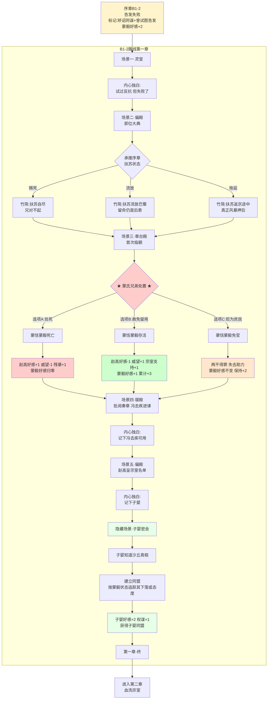

# 《胡亥模拟器》第一章·B1-2路线：二世即位

## 【使用说明】

本剧本为序章选择**B1-2（向蒙毅告发，但未能阻止矫诏）**路线的专属第一章。B1-2路线的核心特征为：胡亥在沙丘之夜向蒙毅告发了赵高的矫诏阴谋，但因李斯亲信先至，遗诏仍被篡改，矫诏成功。胡亥获得关键标记【矫诏同谋】与【曾试图告发】，蒙毅对他的态度与主线其他路线截然不同——蒙毅记得胡亥曾试图告发，对他抱有惋惜与不甘的复杂情感，好感度起点+2。

本剧本在主线第一章框架上，针对B1-2路线的特殊人物关系与心理状态进行专项调整。以 `【B1-2专属】` 标注的段落为该路线独有内容，其余部分与主线共用框架。

*校订说明：现行序章中，`B1-2` 并不直接锁定“赐死扶苏”，而是回落进入通用的【矫诏定策】节点。因此本章已改为兼容三种承接状态：`赐死扶苏`、`流放扶苏`、`扣下原诏、拖延待变`。本章时间线统一承接主线第一章，为“公元前210年八月上旬至中下旬”。*

## 【前情回顾·B1-2专属】

*画面淡入，黑底白字浮现*

**公元前210年，七月丙寅。**

**秦始皇嬴政崩于沙丘平台。**

**中车府令赵高与丞相李斯合谋，矫诏立少子胡亥为太子。公子胡亥向蒙毅告发赵高，然李斯亲信先至，原玺书终被扣下。**

**其后，胡亥仍被迫卷入连夜定策。扶苏或被赐死，或被流放，或被先召回咸阳再作处置；而蒙氏兄弟，也自此被推上了风口浪尖。**

**蒙毅记得那一夜。记得胡亥曾试图告发。他在被押出偏殿时，回头看了胡亥一眼。那一眼里没有恨意，只有惋惜和不甘。**

**而胡亥，带着这沉重的目光，踏上了返回咸阳的路途。**

## 【场景一：咸阳宫·灵堂】

*画面淡入，黑底白字浮现*

*时间线：公元前210年，八月上旬，即位前夕。*

**公元前210年，八月上旬。**

**秦始皇嬴政崩于沙丘平台。**

**赵高、李斯秘不发丧，矫诏立少子胡亥为太子，并另出诏命处置长公子扶苏。**

*沉重的钟声在咸阳上空回荡。*

*丧旗从章台宫一直铺到司马门。*

*百官缟素，天下举哀。*

*你此刻正跪在灵堂最前列，身后是仍在咸阳的诸位兄弟姐妹。你身前，是那具盛放着父亲尸体的黑色棺椁。*

*你低着头，手还在微微发抖。*

*从沙丘那个闷热的夜晚到现在，一切都像一场无法醒来的噩梦。你向蒙毅告发了赵高，你以为自己做了一件正确的事。但李斯的亲信来得更快。遗诏被篡改，你也被迫继续卷入后续定策。扶苏与蒙氏的命运，自那一夜起便不再由他们自己决定。而你，被裹挟着，成了这场阴谋的一部分。*

*现在，你是太子了。*

*明天，你就是皇帝。*

*可为什么，你跪在这里，却觉得那棺椁里的目光仍在注视着你？蒙毅被押出偏殿时回头看你的那一眼，也一直在你脑中挥之不去。*

*那一眼里没有恨意。只有惋惜和不甘。*

*你知道他在想什么。你没保住遗诏，他没保住先帝。你们都是失败者。*

**【B1-2专属·内心独白】**

*（你向蒙毅告发了赵高。你做了正确的事。）*

*（但正确的事，没有带来正确的结果。）*

*（遗诏还是被篡改了。无论你后来怎样定策，你都已经被赵高和李斯裹挟着，成了这场阴谋的“同谋”。蒙毅知道你试过反抗，但他也被卷进局中。你谁也救不了。）*

*（棺椁里的父皇沉默着。你不敢看那面玄色旌旗。不是因为心虚，是因为你觉得自己辜负了他。你试过，但你失败了。）*

*冗长的丧仪终于结束。你起身时，膝盖已经麻木。宗室和百官依次退出灵堂，每个人经过你身边时，都深深地低下头。*

*他们会像敬畏父亲那样敬畏你吗？*

*一只手轻轻扶住了你的手臂。*

**赵高**：（低声）“陛下节哀。明日即位大典，诸多事宜还需陛下定夺。”

*你看向他。这个中车府令，你的老师，篡谋的真正策划者。他面容清瘦，双目深陷，在众人面前永远是一副恭谨温顺的模样。*

*你知道，沙丘那一夜，他未必料到你会当场向蒙毅告发，但他和李斯早就准备好了后手。无论你告不告发，原玺书都很难平安送出。你只是他计划中的一环。*

**【B1-2专属·内心独白】**

*（你心中涌起一股难以言说的情绪。）*

*（这个人教你狱法，教你律令，教你如何做一个合格的皇子。他曾经是你最信任的老师。）*

*（他是把你推上皇位的人，也是让你背上“矫诏同谋”罪名的人。你试过反抗他，但你失败了。现在，你必须在他面前继续扮演一个顺从的傀儡。）*

*（但你和那些从未反抗过的人不一样。你知道反抗的滋味。你知道失败的滋味。你不会再贸然出手了。你会等。）*

*你垂下眼睫，脸上浮现出几分不安和依赖。*

**胡亥**：“老师……明日之后，我就是皇帝了。”

**赵高**：“陛下本就是皇帝。从始皇帝龙驭宾天的那一刻起，这天下的主人，就只有一个。”

**【B1-2专属·内心独白】**

*（天下的主人。）*

*（你心中冷笑。是，你是皇帝。但你的每一个决定都要经过赵高的手。你坐在御座上，像只被牵着线的木偶。）*

*（但你和那些从未反抗过的人不一样。你试过挣脱这根线。你失败了，但你没有放弃。你才二十岁。你可以等。）*

*你沉默片刻。*

**胡亥**：（声音很低）“兄长那边……有消息了吗？”

**赵高**：“上郡路远，消息往返需要时日。不过陛下不必忧虑，诏命既已发出，扶苏公子素来仁孝，多半不会抗旨。”

*你张了张嘴，想说些什么。*

*他真的不会抗旨吗？*

*那三十万长城军团，真的会坐视主帅被囚吗？*

*如果扶苏起兵，你该怎么办？*

*但你没有问出口。这些问题目前轮不到你来决定。*

**【B1-2专属·内心独白】**

*（扶苏。你的兄长。）*

*（无论你在那场定策里做了什么选择，你都知道一件事：真正把扶苏推上绝路的人，不是他自己，也不只是你笔下的那封诏书，而是赵高和李斯联手布成的局。）*

*（你只能在心里记住：扶苏之祸，蒙氏之祸，根子都在赵高身上。这些账，总有一天要算清楚。）*

*（但此刻，你必须在赵高面前维持一个怯懦、依赖、没有主见的形象。这是你唯一的盾牌。）*

*你垂下头，让肩膀微微塌下去。*

*命运在推着你走。*

**赵高**：“明日即位，陛下今夜好生歇息。”

*他深深一揖，退入阴影里。灵堂中只剩下你，和那具沉默的棺椁。*

**【B1-2专属·内心独白】**

*（你跪回灵前。）*

*（你抬起头，第一次直视那面玄色旌旗。）*

*（父皇，你在天上看着儿臣吗？）*

*（儿臣试过。儿臣向蒙毅告发了赵高。但儿臣失败了。）*

*（儿臣不会放弃。儿臣会继续忍。忍到儿臣有能力真正反抗的那一天。）*

*（父皇，求你……再给儿臣一点时间。）*

## 【场景二：咸阳宫·偏殿】

*时间线：公元前210年，八月上旬，即位当日。*

*次日，即位大典。*

*你穿着冕服，头戴冕冠，一步一步走上御阶。每走一步，冕旒上的玉珠便碰撞出清脆的声响。*

*你坐在御座之上。*

*百官三跪九叩，山呼万岁。*

*“皇帝陛下，万岁，万岁，万万岁——”*

*你看着那些匍匐在地的背影，忽然觉得有些恍惚。*

*三个月前，你每天最烦恼的事不过是背不完的律令。而现在，天下人的生死，都在你一念之间。*

*你不确定这是权力的滋味，还是恐惧的滋味。*

**【B1-2专属·内心独白】**

*（你端坐如仪，扫视着群臣。）*

*（李斯站在文臣之首，他的额头贴得很低，你看不到他的表情。沙丘那夜，是他调来亲信，阻止了蒙毅。他是赵高的同谋，也是把你困在局中的锁。）*

*（蒙毅今日也在殿中候命。他尚未被正式发落，只是被压在群臣末列，像一把暂时收回鞘中的旧剑。你看不到他的表情，但你知道，他一定记得沙丘那个夜晚。）*

*（赵高站在你身侧稍后的位置，用清点羊群的目光扫过群臣。）*

*（忍。你在心里对自己说。今天是第一天。）*

*大典结束。偏殿中，只有赵高与你二人。*

**赵高**：“陛下，上郡有消息了。”

*你的心猛地一缩。*

**胡亥**：“兄长……如何了？”

*赵高从袖中取出一卷竹简，双手呈上。*

### 【分支一：序章矫诏定策选择“赐死扶苏”】

**赵高**：“扶苏公子接诏后，当场自尽。蒙恬疑心有诈，不肯就死，已下狱待决。这是上郡传回的奏报。”

*你接过竹简。那上面写着寥寥数行字——扶苏接诏，泣涕终日，谓蒙恬曰：“父赐子死，尚安复请。”遂自刎。*

*你反复读着那行字。*

*他就这么死了。你那位仁厚忠孝的长兄，蒙恬三十万大军在侧，他却没有半分犹豫，就这么死了。*

*你喉咙发干。*

*小时候，扶苏从北方回咸阳述职，总会给你带一些小玩意儿。塞外的石头，胡人的弓箭，草原上捡到的鹰羽。他摸着你的头说，亥儿，你又长高了。*

*那些鹰羽，现在还收在你寝宫的匣子里。*

**【B1-2专属·内心独白】**

*（眼眶有些发热。）*

*（赵高正在观察你，他的目光冰凉而有耐心。）*

*（你不能让他不安。一个让他不安的皇帝，活不长。）*

*（你握紧竹简，让眼泪涌上来，但没有落下来；让嘴唇微微颤抖，但没有发出声音。）*

*（这是赵高想看到的。一个被愧疚压垮的、最好控制的皇帝。）*

*（兄长，对不起。亥弟试过救你，亥弟失败了。亥弟现在还不能为你哭。）*

**胡亥**：“兄长……以公子之礼，厚葬。”

**赵高**：“遵旨。”

*（隐藏数值变化：残暴值+1，恐惧值+1。扶苏死亡。）*

### 【分支二：序章矫诏定策选择“流放扶苏”】

**赵高**：“扶苏公子接诏后，知自己已失储位，闭门不出一昼夜。军中议论纷纷，蒙恬亦上书申辩，不肯轻离边郡。最终，扶苏缴印受命，在亲兵押送下西赴巴蜀；蒙恬暂留军中，戴罪守边。”

*你低头看着竹简。上面的字比刀还钝，却割得人更疼。*

*他没有死。可他从此不再是长公子，也不再是太子。*

*小时候，扶苏从北方回咸阳述职，总会给你带一些小玩意儿。塞外的石头，胡人的弓箭，草原上捡到的鹰羽。他摸着你的头说，亥儿，你又长高了。*

*那些鹰羽，现在还收在你寝宫的匣子里。*

**【B1-2专属·内心独白】**

*（你其实该松一口气。至少他还活着。）*

*（可你知道，这不是结束。流放巴蜀，不过是把刀先收回鞘里。）*

*（赵高正在看你。他想看见一个因“留有后患”而动摇的皇帝。）*

*（于是你垂下眼，只让脸上留下一点不安，一点迟疑。既不像庆幸，也不像反对。）*

**胡亥**：“既已奉诏西赴巴蜀……便按公子之礼安置，不得再加折辱。”

**赵高**：“陛下仁厚。只是……留其性命，终究是个变数。”

*（隐藏数值变化：扶苏存活，流放巴蜀。宗室支持度+1，赵高好感度-1。获得关键标记【力保扶苏】。）*

### 【分支三：序章矫诏定策选择“扣下原诏、拖延待变”】

**赵高**：“扶苏接召后，已启程返京。但蒙恬并未随行，他以‘北境防务不可无人主持’为由，留驻上郡。扶苏只带数百亲兵上路，不日将至咸阳。”

*你把竹简捏得发皱。*

*他还活着，而且正在回来。*

*小时候，扶苏从北方回咸阳述职，总会给你带一些小玩意儿。塞外的石头，胡人的弓箭，草原上捡到的鹰羽。他摸着你的头说，亥儿，你又长高了。*

*那些鹰羽，现在还收在你寝宫的匣子里。*

**【B1-2专属·内心独白】**

*（扶苏在回来的路上。）*

*（这本是你在沙丘能想到的最稳妥的拖延法，却也把真正的风暴押后到了咸阳门前。）*

*（赵高在看你。他想知道你是怕，还是喜。）*

*（你只能让他看见第一种。）*

**胡亥**：“兄长既在返京途中，沿路驿站、车马、供给，不得有误。”

**赵高**：“臣明白。只是待扶苏公子抵京，陛下还需早作定夺。”

*（隐藏数值变化：扶苏存活，正在返京途中。恐惧值+1，权谋值+1。赵高警惕度上升。）*

**赵高**：“还有一事，需陛下圣断。蒙氏世代为将，军中门生故吏遍布天下。扶苏之事既已定下或暂时搁置，蒙氏若不处置，恐生后患。”

**胡亥**：“老师的意思是……”

**赵高**：“蒙恬当死，蒙毅亦当死。”

*你握紧了袖中的手。*

*蒙毅。那个在沙丘之夜被你告发、却被李斯亲信制住的人。那个被押出偏殿时回头看你一眼的人。他没有恨你。他只是惋惜。*

*赵高现在要你杀了他。*

**【B1-2专属·内心独白】**

*（蒙恬，蒙毅。大秦的柱石。父皇最信任的将领。）*

*（赵高要你杀了他们。不是因为他们有罪，而是因为他们忠于扶苏，忠于父皇，唯独不会毫无保留地忠于他亲手扶上的傀儡皇帝。）*

*（你清楚：蒙氏兄弟活着，就是赵高的威胁。赵高要把所有可能威胁他的人都除掉。而你，是他手里的刀。）*

*（但蒙毅不一样。蒙毅知道你是无辜的。他记得你曾试图告发。他是这座咸阳城里，为数不多知道真相的人。）*

*（你不能拒绝赵高。至少现在不能。但你可以……留下一点余地。）*

*（你垂下眼，让脸上浮现出犹豫和挣扎，然后抬起头，用一种不确定的语气开口。）*

## 【场景三：咸阳宫·章台殿】

*时间线：公元前210年，八月上旬，即位第三日。*

*即位第三日。*

*你第一次正式临朝听政。御座又高又硬，坐得你腰背酸痛。殿下群臣黑压压跪了一片，无数双眼睛盯着你，等着你开口。*

*你感到喉咙发干。*

**赵高**：（低声）“陛下，今日廷议，有两件事需要圣裁。其一，蒙毅的处置。其二，始皇帝陵和阿房宫的工期。”

*你点点头。*

**胡亥**：“蒙毅何在？”

*队列中，一人出列，伏地叩首。*

**蒙毅**：“罪臣蒙毅，叩见陛下。”

*你看着这个伏在地上的中年人。他比沙丘那夜憔悴了许多，但腰背依然挺直。他没有抬头看你。*

*你想起他在沙丘被押出偏殿时，回头看你那一眼。惋惜。不甘。没有恨意。*

*现在他跪在你面前，自称罪臣。*

**胡亥**：“蒙毅，你可知罪？”

**蒙毅**：（叩首）“罪臣之兄蒙恬，驻军上郡，拥兵自重，疑有异心。罪臣身为宗族子弟，未能及时举发，有负先帝圣恩。请陛下治罪。”

*他的声音很稳，但你看到他的手指在微微发抖。*

*你知道他在赌。他在赌你不会杀他——或者至少，不会杀得那么快。*

*赵高的声音在你耳边响起。*

**赵高**：“陛下，蒙毅此人，巧言令色，不可轻信。先帝在时，他便屡次进谗，诽谤陛下。如今其兄谋逆已露，蒙毅岂能独善其身？”

*你看向赵高，又看向匍匐在地的蒙毅。*

*殿上落针可闻。所有人都在等你的决定。*

**【B1-2专属·内心独白】**

*（你看着跪在地上的蒙毅，心中飞速盘算。）*

*（他是沙丘之夜唯一知道真相的人。他知道你曾试图告发赵高。他没有恨你，他只是惋惜你们一起失败了。）*

*（如果他能活下来，将来或许能成为你的盟友。但赵高正盯着你，满朝文武正盯着你。你不能表现得太明显。）*

*（你得想一个让赵高无法反驳的理由……）*

## ★ 核心选择节点：蒙氏兄弟的处置 ★

### 【选项A：同意赵高，处死蒙恬蒙毅】

*你闭上眼睛。再睁开时，目光已经冷了下来。*

**胡亥**：“蒙氏兄弟，心怀不轨。蒙恬拥兵自重，蒙毅知情不报。传朕旨意——蒙恬赐死于阳周狱中，蒙毅斩于咸阳东市。蒙氏宗族，徙边。”

*蒙毅猛地抬起头，眼中满是不可置信。*

**蒙毅**：“陛下！罪臣冤枉！先帝在时，罪臣忠心耿耿，天地可鉴——”

**赵高**：（冷冷）“拖下去。”

*两名侍卫上前，将蒙毅架出殿外。他的喊冤声越来越远，终于消失在殿门之外。*

*殿上群臣，无一人敢言。*

*你端坐在御座上，感到自己的心跳得很快。你告诉自己，这是必要的。你是皇帝了，皇帝不能心软。*

*可为什么，你觉得御座又冷了几分？*

*（隐藏数值变化：赵高好感度+1，威望值-1，残暴值+1。蒙恬、蒙毅死亡。）*

**【B1-2专属·内心独白】**

*（蒙恬，蒙毅。大秦最后的柱石。你亲手把他们拆了。）*

*（蒙毅是唯一知道真相的人。他记得你曾试图告发。他看你的那一眼里没有恨意，只有惋惜。）*

*（现在他死了。你杀的。）*

*（不，是赵高杀的。）*

*（你在心里一遍一遍地告诉自己。是赵高把蒙毅的名字列入诛杀名单的，是赵高逼你点的头。你只是他手里的刀。）*

*（但刀柄握在赵高手里，刀刃上的血，沾的是你的手。）*

*（你在心里默念那两个名字。将来有一天，如果你能赢，你要为他们平反。如果你输了——那这些账，就一起埋进土里吧。）*

### 【选项B：赦免留用】

*你沉默良久，终于开口。*

**胡亥**：“蒙恬守边十余年，匈奴不敢南下而牧马。蒙毅事君数载，先帝未尝有过恶言。今以疑罪杀忠良，非朕所愿。”

*赵高脸色微变。*

**赵高**：“陛下——”

**胡亥**：（提高声音）“传朕旨意。蒙恬仍守北疆，戴罪立功。蒙毅降职三等，留朝听用。此事到此为止。”

*蒙毅浑身一颤，重重叩首。*

**蒙毅**：“罪臣……谢陛下隆恩！”

*他抬起头时，你看到他眼眶发红。他的目光与你短暂交汇。那目光里，有感激，有意外，还有一种复杂的东西——他认出了你。他记得沙丘那个夜晚，你向蒙毅告发赵高时的样子。他知道，你是在用自己的方式保护他。*

*退朝后，赵高在偏殿拦住了你。*

**赵高**：“陛下今日之举，臣不敢苟同。蒙氏在军中根深蒂固，今日不除，来日必为大患。”

*你停下脚步，转身看着他。*

**胡亥**：“老师。朕是皇帝。朕说了，到此为止。”

*赵高看着你，眼神变幻不定。最后，他缓缓躬下身。*

**赵高**：“……陛下圣明。”

*但你知道，这件事没有结束。*

*（隐藏数值变化：赵高好感度-1，威望值+1，宗室支持度+1。蒙恬、蒙毅存活。）*

**【B1-2专属·内心独白】**

*（你成功了。你保下了蒙氏兄弟。）*

*（赵高不会善罢甘休，他一定会再找机会除掉他们。但至少今天，你赢了。你用一个“仁君”的姿态，堵住了赵高的嘴。）*

*（更重要的是——蒙毅抬起头时，你看懂了他眼中的神色。那不是单纯的感激。他记得沙丘那个夜晚，记得你曾试图告发赵高。他知道，你和他一样，是那场失败的亲历者。）*

*（你们之间，有一种别人无法理解的默契。）*

*（这个人，将来可用。）*

### 【选项C：贬为庶民】

*你斟酌再三，选了一个折中的方案。*

**胡亥**：“蒙恬、蒙毅，夺爵免官，贬为庶民。三代之内，不许入仕。”

*蒙毅伏在地上，肩膀微微颤抖。半晌，他重重叩首。*

**蒙毅**：“……罪臣，领旨谢恩。”

*他的声音里没有怨恨，只有一种深沉的疲惫。*

*赵高似乎对这个结果不甚满意，但也没有再说什么。毕竟，失去了官爵的蒙氏，已经不再是威胁。*

*退朝时，你看到蒙毅佝偻着背走出了章台殿。他的背影，像一个被抽去了骨头的人。*

*你忽然想起父皇说过的话：蒙氏，秦之柱石也。*

*现在，这根柱石被你亲手拆了。*

*（隐藏数值变化：蒙恬、蒙毅免官为民，不再参与后续剧情。）*

**【B1-2专属·内心独白】**

*（你没有杀他，但也没有保他。你选择了一条中间的路——免官为民，永不叙用。）*

*（这或许是最安全的做法。赵高没有理由再动一个庶民，你也没有给赵高留下“陛下仁厚”的话柄。）*

*（但你也失去了一个潜在的盟友。蒙毅回到乡里，从此不问朝政。大秦的柱石，就这样变成了一介农夫。）*

*（你告诉自己，这是必要的取舍。但你还是忍不住想——如果有一天你需要用人的时候，还有人可用吗？）*

*（蒙毅知道真相。他记得你曾试图告发赵高。你让他活着离开了咸阳。也许有一天，这份恩情，还能用上。）*

## 【场景四：咸阳宫·寝殿】

*时间线：公元前210年，八月上旬，即位第三日，深夜。*

*深夜。*

*你独自坐在寝殿里，面前摊着一卷又一卷的奏章。各地的钱粮、刑名、工程、军报……像一座山压在你的案头。*

*你拿起一卷，是李斯的奏疏。他建议继续严格执行秦律，加大株连力度，以严刑峻法震慑天下。*

*你又拿起一卷，是冯去疾的奏疏。他建议减轻徭役，与民休息，否则关东民力将不堪重负。*

*两卷奏疏，两种声音。你不知道该听谁的。*

*父皇在世时，这些奏疏都是怎么批的？他似乎从来不需要犹豫。对就是对，错就是错，杀就是杀。父皇的手从不颤抖。*

*可你不是父皇。*

**【B1-2专属·内心独白】**

*（你放下两卷奏疏，揉了揉眉心。）*

*（李斯。冯去疾。一个是法家巨擘，一个是三朝老臣。他们的意见截然相反，但你知道，他们说的都有道理。）*

*（可你现在还不能自己拿主意。明天赵高会来问你——陛下看完了吗？打算怎么批？你会说，老师觉得该怎么批？然后赵高会微笑着说出他的意见，你会点头说，就按老师说的办。）*

*（你每天都是这样过的。）*

*（但你没有浪费这些奏疏。你在看，你在学。你在学李斯的法家之术，在学冯去疾的治国之道。你在心里记住每一郡的钱粮数目，记住每一县的刑案统计。你在心里构建一个属于你自己的大秦。）*

*（总有一天，这些知识会有用。但不是现在。）*

*烛火摇曳。你抬起头，发现殿门口站着一个人。*

*那人身材高大，须发花白，穿着一身半旧的官服。你认出了他——右丞相冯去疾。*

**胡亥**：“冯丞相？这么晚了……”

**冯去疾**：（跪下）“老臣有一言，冒死进谏。”

*你放下竹简。*

**胡亥**：“说。”

**冯去疾**：“陛下即位以来，扶苏之事、蒙氏之事，已令天下震动。老臣斗胆请问陛下——接下来，还要处置多少人？”

*你愣住了。*

**冯去疾**：（叩首）“先帝以法治国，然法非不教而诛。扶苏公子仁孝，蒙氏兄弟忠勇，皆先帝所重。今陛下初即位，便如此处置先帝所重之人，天下人当作何想？”

*他的声音苍老而颤抖，却一字一句，掷地有声。*

**冯去疾**：“老臣侍奉先帝三十年，今日冒死进言，不为蒙氏，不为扶苏——是为了陛下，是为了大秦。”

*你看着他花白的头发，看着他叩首时微微颤抖的肩膀。*

*你知道他说的是对的。但你也知道，有些事情，从沙丘那夜开始，就已经由不得你了。*

**胡亥**：（长久的沉默后）“冯丞相……你下去吧。”

**冯去疾**：“陛下！”

**胡亥**：（提高声音）“下去！”

*冯去疾抬起头，与你对视。他眼中闪过一丝失望，一丝悲哀，最终化为一声叹息。*

**冯去疾**：“……老臣告退。”

*他佝偻着背退出殿外。烛火摇动，将他的影子拉得很长很长。*

*你独自坐在空旷的大殿里。*

*夜风穿过殿门，吹得烛火明灭不定。你忽然觉得冷。很冷。*

**【B1-2专属·内心独白】**

*（冯去疾走了。你看着他的背影，在心中默默记下了这个名字。）*

*（他是少数敢对你说真话的人。但他太直了，直得不适合这座咸阳宫。他今天对你说的话，明天就会传到赵高耳朵里。赵高不会容忍一个敢劝谏皇帝“不要杀人”的丞相。）*

*（你想保他。但你不知道怎么保。）*

*（你只能在他的名字旁边，在心里打一个记号——此人可用，但需保护。）*

*（你吹熄了烛火。黑暗中，你听见自己的心跳，一下，一下，很稳。）*

## 【场景五：咸阳宫·偏殿】

*时间线：公元前210年，八月中旬，夜。*

*数日后。夜。*

*赵高密召你至一处偏殿。殿中只有你们二人，烛火昏暗，映得他的脸明暗不定。*

**赵高**：“陛下，臣近日听到一些风声。”

**胡亥**：“什么风声？”

**赵高**：“宗室诸公子，对陛下颇有微词。尤其是公子高、公子将闾几人，私下多次聚会，言语间似有不臣之意。”

*你皱起眉。*

**胡亥**：“他们说了什么？”

**赵高**：（凑近，压低声音）“他们说……沙丘之事，疑点重重。扶苏之事，恐有隐情。”

*你的瞳孔猛地收缩。*

**胡亥**：“他们……知道了？”

**赵高**：（摇头）“不过是猜测。但猜测，就够了。陛下，人心一旦生疑，再想收拢，就难了。”

*他顿了顿，目光幽深地看着你。*

**赵高**：“始皇帝有子女二十余人。这些人，每一个身上都流着先帝的血。每一个，都有资格坐上这把椅子。陛下觉得，他们会甘心吗？”

*你没有说话。*

**赵高**：“斩草不除根，春风吹又生。扶苏之事尚未真正了结，但他的兄弟们还在。只要有一个活着，陛下的江山，就坐不稳。”

*他从袖中取出一卷竹简，双手呈上。*

**赵高**：“这是宗室诸公子的名单。请陛下过目。”

*你接过竹简。上面密密麻麻写着二十几个名字，每一个都是你的手足。公子高，公子将闾，公子婴……你一行一行看下去，越看越觉得那些名字像是一把把刀。*

*你抬起头，看向赵高。他的面容在烛光中平静如水，仿佛在等待一个注定会来的答案。*

*窗外，咸阳的夜空漆黑如墨。没有月亮，也没有星星。*

**【B1-2专属·内心独白】**

*（你握着那卷写满手足名字的竹简，心中翻涌着赵高看不到的波澜。）*

*（宗室。你的兄弟姐妹。赵高要把他们也杀掉。）*

*（你知道他的逻辑——所有流着父皇血脉的人，都有资格坐这把椅子。赵高不能容忍任何潜在的威胁。他要让这座咸阳宫里，只剩下你一个嬴姓的子嗣。一个孤零零的、只能依赖他的皇帝。）*

*（你恨他。但你脸上的表情是犹豫，是不安，是一个被说服的懦弱皇帝。）*

*（你开口了。声音很轻，带着恰到好处的颤抖。）*

*（“老师……让朕再想想。”）*

*（赵高看着你，嘴角微微勾起。他知道你会答应的。你从来都会答应的。）*

*（他退出偏殿。你独自坐在烛火中，将那卷竹简缓缓收拢。）*

*（名单上的每一个名字，你都记住了。尤其是其中一个——公子婴。）*

*（你的堂叔。一个从不参与任何争斗、安安静静种菜的人。）*

*（赵高要杀他。但你不打算让他死。）*

*（蒙毅或死、或退、或仍受制于朝局；无论如何，知道沙丘真相的人都越来越少。你必须活下去。你必须保住能保住的人。）*

## 【隐藏场景：与子婴的初次密会】

*（此场景为B1-2路线专属。触发条件：获得【曾试图告发】标记。）*

*时间线：公元前210年，八月中下旬，黄昏。*

*数日后。黄昏。*

*你微服出宫。只带了心腹宦官韩谈一人，车驾朴素，从侧门驶出咸阳宫。*

*你要去公子婴的府邸。*

*你在宗室名单上看到他的名字时，心中就浮现出一个模糊的念头。公子婴，你的堂叔。在始皇帝二十几个子女中，他是最不起眼的一个。不争，不抢，不结党，不营私。每日在府中种菜读书，仿佛他不是嬴姓血脉，只是一个普通的富家翁。*

*但正是这种“不起眼”，让你注意到了他。*

*能在咸阳这座杀人泥潭里“不起眼”地活到现在的人，一定不简单。*

*车驾停在公子婴府邸侧门。这是一座偏僻的宅院，门庭冷落，连看门的仆人都在打瞌睡。你让韩谈留在门外，独自推门而入。*

*院中是一片菜园。*

*公子婴正蹲在地里，侍弄着他的菜苗。夕阳将他的影子拉得很长。他听到脚步声，没有回头。*

**子婴**：“陛下来了。”

*他的声音平静，像是在说今天的天气。*

*你站在他身后，看着他的背影。*

**胡亥**：“叔父知道朕要来？”

**子婴**：“臣不知道。臣只是觉得，陛下应该会来。”

*他站起来，拍了拍手上的泥土，转过身看着你。他的面容苍老而平静，眼睛像两潭深水，看不到底。*

**子婴**：“陛下看了赵高呈上的名单。名单上有臣的名字。陛下不想杀臣，所以陛下来了。”

*你心中一震。这个人，什么都知道。*

**胡亥**：“……叔父既然知道赵高要杀你，为何不逃？”

**子婴**：“逃到哪里去？天下都是大秦的疆土，臣能逃到哪里？”

*他顿了顿。*

**子婴**：“而且，臣若逃了，陛下怎么向赵高交代？”

*你沉默了。*

**子婴**：“陛下今日来，是想问臣什么？”

*你看着他。*

**胡亥**：“朕想问叔父——朕该怎么办？”

*子婴没有立刻回答。他弯腰，从地里拔起一棵菜，抖掉根上的泥土。*

**子婴**：“陛下有没有想过，赵高为什么敢把名单呈给陛下？”

*你皱眉。*

**子婴**：“因为他知道陛下最后总会退让。自即位以来，扶苏之事如此，蒙氏之事亦如此。赵高已经习惯了陛下在他的刀口上低头。”

*他抬起头，看着你。*

**【B1-2专属·子婴的洞察】**

**子婴**：“但臣知道，陛下不是真的顺从。”

*你心中一震。*

**子婴**：“沙丘那夜的事，臣听到了一些风声。陛下曾向蒙毅告发赵高。虽然失败了，但陛下试过。”

*他看着你的眼睛。*

**子婴**：“一个试过反抗的人，和从未反抗过的人，是不一样的。陛下在忍，臣看得出来。但陛下有没有想过——忍，和顺从，有时候看起来一模一样？”

*你的心猛地一沉。*

**子婴**：“赵高现在不杀陛下，是因为他觉得陛下好控制。但如果有一天，他发现陛下其实不好控制——发现陛下一直在忍，一直在暗中积蓄力量——陛下觉得，他会怎么做？”

*你握紧了拳头。*

**胡亥**：“……他会先下手为强。”

**子婴**：“是。”

*他顿了顿。*

**子婴**：“所以，陛下要忍，但不能只忍。陛下要学会在顺从的外表下，做赵高看不到的事。”

*他从地里又拔起一棵菜，递给你。*

**子婴**：“臣在宗室中是最不起眼的人。不起眼的人，反而好做事。陛下若信得过臣，臣愿为陛下暗中联络可用之人。禁卫中对赵高不满者，蒙氏旧部中被贬黜者，宗室中被赵高威胁者——这些人，散落在咸阳各处，像菜籽一样。陛下需要一个人，把他们一颗一颗捡起来。”

*你接过那棵菜。菜根上还带着泥土，湿润而冰凉。*

**胡亥**：“叔父为什么要帮朕？”

*子婴看着你，那双深水般的眼睛里，终于浮现出一丝波澜。*

**子婴**：“因为臣也姓嬴。”

*夕阳沉入城墙，院中暗了下来。你握着那棵带泥的菜，忽然觉得，你来对了。*

**胡亥**：“叔父。从今日起，朕会暗中保护宗室中可用之人。名单上的人，朕能保一个是一个。但朕需要叔父替朕做一件事。”

**子婴**：“陛下请讲。”

**胡亥**：“替朕留意赵高的党羽。禁卫、少府、郎中令——哪些是赵高的人，哪些是可以拉拢的人。朕要知道。还有……若蒙毅已被免官离朝，替朕留意他的下落；若他仍在朝中，替朕看清他是否还愿意与朕说真话。若他还活着，除了你之外，他是少数知道沙丘真相的人。”

*子婴深深看了你一眼，然后缓缓躬下身。*

**子婴**：“臣，领旨。”

*他直起身，忽然说了一句不相干的话。*

**子婴**：“陛下。种菜和做人，其实是一个道理。菜要长得好，不能只浇水，还得防虫。虫子这种东西，你不理它，它就会越来越多。等你想理的时候，菜已经被啃光了。”

*他转身，继续蹲在地里侍弄他的菜苗，仿佛刚才的对话从未发生过。*

*你站在原地，看着他的背影。夕阳最后一缕光消失在地平线下，院中彻底暗了下来。*

*你转身离去。*

*身后，子婴低声哼起了一首古老的秦地歌谣。*

*（隐藏数值变化：子婴好感度+2。获得关键标记【子婴同盟】。权谋值+1。若蒙毅被免官或留用，获得隐藏线索【蒙毅下落】。）*

## 【第一章·终】

*画面暗下。字幕浮现。*

**“始皇帝有子女二十余人。公子高、公子将闾、公子婴……”**

**“赵高呈上一份名单。”**

**“他说，斩草不除根，春风吹又生。”**

**“胡亥握紧了酒杯。”**

**【B1-2专属·字幕追加】**

**“他试过反抗。在沙丘那个夜晚，他向蒙毅告发了赵高。但他失败了。”**

**“如今，蒙毅或死、或贬、或仍在朝中受制于赵高。知道真相的人，越来越少。”**

**“他在子婴的菜园里，找到了第一个盟友。他知道，自己不是一个人在扛。”**

**“但他也知道，赵高的眼睛，正盯着他的一举一动。”**

**第二章——《血洗宗室》**

**敬请期待。**

## 【第一章完成·数值结算】

### 通用数值

| 数值 | 变化情况 |
|:---|:---|
| 残暴值 | 以序章承接值为准；若前置选择“赐死扶苏”，则已额外+1。本章仅在蒙氏处死（选A）时再+1。 |
| 威望值 | 以序章承接值为准；本章蒙氏处死-1，赦免+1，免官不变。 |
| 恐惧值 | 以序章承接值为准；本章无固定额外变化。 |
| 赵高好感度 | 以序章承接值为准；本章蒙氏处死+1，赦免-1，免官不变。 |
| 宗室支持度 | 以序章承接值为准；本章蒙氏赦免+1，其余不变。 |

### B1-2专属数值

| 数值 | 初始值 | 本章变化 | 当前值 |
|:---|:---|:---|:---|
| 权谋值 | 0 | +1（子婴密会） | 1 |
| 子婴好感度 | 0 | +2（子婴同盟） | 2 |
| 蒙毅好感度 | +2（序章获得） | 根据蒙氏处置选择变化：若处死则归零，若赦免则+1（累计+3），若免官则不变（保持+2） | 视选择而定 |

### 关键标记汇总

**通用标记（根据选择获得）：**
- 蒙恬蒙毅：死亡 / 存活 / 免官
- 序章继承：【矫诏同谋】【曾试图告发】

**B1-2专属标记：**
- 【曾试图告发】（序章获得）——蒙毅好感度起点+2，子婴在密会中提及此事
- 【子婴同盟】（隐藏场景获得）
- 【蒙毅下落】（若蒙毅免官或留用，获得隐藏线索，后续可尝试召回）

### 关键人物状态

| 人物 | 状态 |
|:---|:---|
| 扶苏 | 死亡 / 流放巴蜀 / 返京途中（根据序章矫诏定策） |
| 蒙恬 | 死亡 / 留用 / 免官（根据本章选择） |
| 蒙毅 | 死亡 / 留用 / 免官（根据本章选择）；若存活，对胡亥抱有复杂情感，知道沙丘真相 |
| 冯去疾 | 失望但仍在朝 |
| 赵高 | 对玩家态度根据选择产生分化 |
| 子婴 | 【子婴同盟】——已建立秘密同盟关系，知道胡亥曾试图反抗 |

**第一章结束。存档。**

*（本章章末统一收束至【第二章：《血洗宗室》】，承接文件为 `scripts/chapter2.md`。）*

## 【附：B1-2路线第一章Mermaid流程图】

