# 《胡亥模拟器》第一章：二世即位（B2版本·沉默的共犯）

## 【使用说明】

本剧本基于主线第一章进行微调创作，专用于**序章选择B2（拒绝告发→保持沉默）** 的路线。**加粗段落**为B2版本专属修改内容，**以 `【B2版本】` 标注的段落**为新增内心独白/对话微调，其余部分与主线基本一致。

**本版本不含任何隐忍线内容**（秘密记录、子婴密会等均不触发）。

## 【前情回顾】

*画面淡入，黑底白字浮现*

**公元前210年，七月丙寅。**

**秦始皇嬴政崩于沙丘平台。**

**中车府令赵高秘不发丧，与丞相李斯合谋，矫诏立少子胡亥为太子，赐死长公子扶苏。**

**历史的车轮，在这一夜悄然转向……**

## 【场景一：咸阳宫·灵堂】

*沉重的钟声在咸阳上空回荡。*

*白虎纹的丧旗从章台宫一直铺到司马门。百官缟素，天下举哀。*

*而你——嬴胡亥，始皇帝第十八子，此刻正跪在灵堂最前列。你身后是你的二十余位兄弟姐妹。你身前，是那具盛放着千古一帝的黑色棺椁。*

*你低着头，不敢去看那棺椁上的玄色旌旗。你的手还在微微发抖。*

*三天前，在沙丘那个闷热的夜晚，赵高问你想不想做皇帝。你愣住了。你张了张嘴，想说什么，但没有发出声音。然后蒙毅冲了进来，质问你，质询赵高。赵高反诬你图谋不轨，李斯沉默不语。你站在角落里，像一个被遗忘的影子。*

*最后，你没有告发。你只是沉默。*

*然后一切照旧发生了——遗诏被扣下，新的诏书写好，扶苏被赐死，蒙恬被囚禁，车队绕道返回咸阳……*

*你没有点头。但也没有摇头。你只是站在那里，看着一切发生。*

*现在，你是太子了。*

*明天，你就是皇帝。*

*可为什么，你跪在这里，却觉得那棺椁里的目光仍在注视着你？*

**【B2版本·内心独白】**

*你低着头，不敢看那面玄色旌旗。*

*你在心里反复问自己：如果那夜你开口了，会怎样？如果你对蒙毅说——“赵高要矫诏”，会怎样？扶苏会不会还活着？蒙恬会不会还在北疆？父皇会不会……原谅你？*

*你不知道。因为你没有开口。*

*你只是站在那里。像一个被定住的木偶。*

*沉默。沉默也可以杀人。你杀了扶苏。你用你的沉默，杀了扶苏。*

*棺椁里的父皇沉默着。你觉得他在看你。你觉得所有人都在看你。他们知道。他们一定知道。知道沙丘那夜，你也在场。你没有告发。你是同谋。*

*你把头埋得更低了。*

*冗长的丧仪终于结束。你起身时，膝盖已经麻木。宗室和百官依次退出灵堂，每个人经过你身边时，都深深地低下头。你不知道那低垂的面孔下，是敬畏，还是别的什么。*

*一只手轻轻扶住了你的手臂。*

**赵高**：（低声）“陛下节哀。明日即位大典，诸多事宜还需陛下定夺。”

*你看向他。这个中车府令，你的法学老师，沙丘之谋的真正策划者。他面容清瘦，双目深陷，永远是一副恭谨温顺的模样。*

**【B2版本·内心独白】**

*你看着赵高，心中涌起一种说不清的情绪。不是恨，不是怕。是一种粘稠的、让你喘不过气的东西。*

*是他把你推上皇位的。但你也知道，如果那夜你开口告发，他一定会杀了你。你沉默，是因为你怕死。你怕死，所以扶苏死了。*

*你垂下眼睛，不敢看他的脸。*

**胡亥**：“老师……明日之后，朕就是皇帝了。”

*你的声音很低，像是怕惊醒什么。*

**赵高**：“陛下本就是皇帝。从始皇帝龙驭宾天的那一刻起，这天下的主人，就只有一个。”

*你张了张嘴。天下的主人。你听着这四个字，只觉得它们像一座山，压在你的胸口。*

**胡亥**：（声音很低）“兄长那边……有消息了吗？”

*赵高的嘴角微微牵动。*

**赵高**：“上郡路远，消息往返需要时日。不过陛下不必忧虑，遗诏已发，蒙恬已囚，扶苏公子素来仁孝，必不会抗旨。”

*你张了张嘴，想说些什么。*
*——他真的不会抗旨吗？*
*——那三十万长城军团，真的会坐视主帅被囚吗？*
*——如果扶苏起兵，你该怎么办？*

*但你没有问出口。因为你知道，从你在沙丘闭上嘴的那一刻开始，这些问题，就已经轮不到你来决定了。*

**【B2版本·内心独白】**

*不。不是因为轮不到你决定。是因为你不敢决定。你从来都不敢。*

*你垂下头，让肩膀塌下去。你不敢让赵高看到你的表情。你怕他看到你眼中的恐惧，更怕他看到你眼中除了恐惧之外，什么都没有。*

**赵高**：“陛下今夜好生歇息。明日即位，还有一场硬仗。”

*他深深一揖，退入烛光照不到的阴影里。*

*灵堂中只剩下你，和那具沉默的棺椁。*

**【B2版本·内心独白】**

*你跪回灵前。*

*你想抬头看那面玄色旌旗，但你不敢。你怕看到父皇的眼睛。你怕父皇问你——胡亥，你为什么不说？*

*你把额头抵在冰凉的地砖上。*

*父皇。儿臣怕。儿臣从小就怕。怕你，怕兄长，怕赵高，怕律令，怕背错字，怕射不准箭。儿臣什么都怕。所以儿臣什么都没说。*

*儿臣不是故意的。但儿臣……不知道该怎么弥补。*

## 【过场·梦境】

*是夜，你做了一个梦。*

*梦里，你回到了小时候。你大概是七八岁的样子，正跪在父亲的书房里背律令。你背错了一条，父亲便用竹简敲你的额头。*

*“胡亥，你记住，法者，治之端也。为君者不通律法，何以御臣下？”*

*你哭着说，儿臣知错了。*

*父亲看着你，忽然叹了口气。他把你抱起来，放在膝上。父亲的手很粗糙，但很温暖。*

*“朕这些儿子里，你最像朕年少时。但像朕，未必是好事。”*

*你不懂。*

*“朕这一生，杀人太多。朕不怕天下人恨朕，只怕后世无人懂朕。”*

*他顿了顿，低头看着你的眼睛。*

*“胡亥，你记住。皇帝不是人做的。皇帝是一把刀，一把悬在天下人头顶的刀。你要么永远锋利，要么……就被别人折断。”*

**【B2版本·梦境追加】**

*画面忽然变了。*

*你不再是小孩子。你站在沙丘那座偏殿里。赵高在说话，李斯在沉默，蒙毅站在门口，质问你——“公子，赵高对你说了什么？”*

*你张开了嘴。你想说——赵高要矫诏。赵高要杀扶苏。赵高要立我为帝。*

*但你的喉咙像被什么堵住了。你发不出任何声音。你拼命张嘴，拼命想喊，但只有沉默。*

*蒙毅看着你，眼神从期待变成失望，从失望变成冷漠。他转身离去。赵高在你身后笑了。*

*“公子果然聪明。”*

*你从梦中惊醒。*

*窗外，月色如霜。*

**【B2版本·内心独白】**

*你坐起身，汗湿透了衣襟。你摸了摸自己的喉咙。还能说话。*

*但你已经在梦里错过了说话的时机。就像你在沙丘错过了说话的时机一样。*

*你赤脚踩在冰凉的地砖上，走到窗边，看着那轮冷月。*

*父皇。儿臣不是刀。儿臣从来都不是刀。儿臣只是……只是那把刀切下来的第一块肉。*

## 【场景二：咸阳宫·偏殿】

*次日，即位大典。*

*你穿着玄色十二章纹的冕服，头戴十二旒的冕冠，一步一步走上御阶。每走一步，冕旒上的玉珠便碰撞出清脆的声响。那声响在空旷的大殿里回荡，像极了父亲冕冠上的声音。*

*你跪坐在御座之上。*

*殿下，百官三跪九叩，山呼万岁。*

*“皇帝陛下，万岁，万岁，万万岁——”*

*你看着那些匍匐在地的背影，忽然觉得有些恍惚。三个月前，你还只是始皇帝最宠爱的小儿子，每天最烦恼的事不过是背不完的律令。而现在，天下人的生死，都在你一念之间。*

*你不确定这是权力的滋味，还是恐惧的滋味。*

**【B2版本·内心独白】**

*你看着那些匍匐在地的群臣。他们在向你跪拜，但你觉得他们跪的不是你。他们跪的是这把椅子，是这身冕服，是“皇帝”这两个字。*

*换一个人坐在这里，他们也一样跪。*

*你坐在御座上，觉得自己像一个偷了别人衣服的小偷。这件冕服不属于你。这把椅子不属于你。这声“万岁”不属于你。一切都是你偷来的。不，不是你偷的。是赵高塞给你的。你只是没有拒绝。*

*你扫视殿中。李斯跪在文臣之首，你看不到他的表情。赵高站在你身侧稍后的位置，他的目光扫过群臣，像一个牧人在清点他的羊群。*

*你忽然想：如果扶苏坐在这里，他会是什么表情？他会害怕吗？他会觉得这一切不属于他吗？*

*你不会知道了。扶苏死了。你用你的沉默杀了他。*

*大典结束。偏殿中，只有赵高与你二人。*

**赵高**：“陛下，上郡有消息了。”

*你的心猛地一缩。*

**胡亥**：“兄长……如何了？”

*赵高从袖中取出一卷竹简，双手呈上。*

**赵高**：“扶苏公子接诏后，当场自尽。蒙恬疑心有诈，不肯就死，已下狱待决。这是上郡传回的奏报。”

*你接过竹简。那上面写着寥寥数行字——扶苏接诏，泣涕终日，谓蒙恬曰：‘父赐子死，尚安复请。’遂自刎。*

*你反复读着那行字，读了一遍又一遍。*

*父赐子死，尚安复请。*

*他就这么死了。你那位仁厚忠孝的长兄，蒙恬三十万大军在侧，他却没有半分犹豫，就这么死了。*

*你忽然觉得喉咙发紧。你想起小时候，扶苏从北方回咸阳述职，总会给你带一些小玩意儿。塞外的石头，胡人的弓箭，草原上捡到的鹰羽。他摸着你的头说，亥儿，你又长高了。*

*那些鹰羽，现在还收在你寝宫的匣子里。*

**【B2版本·内心独白】**

*你的喉咙发紧，眼眶发热。眼泪涌上来，你来不及忍住，它们就落了下来。一滴，两滴，落在竹简上，洇开了墨字。*

*你慌忙用手掩面，假装揉眼。但你知道赵高在看。他一定在看。*

*“父赐子死，尚安复请。”扶苏到死都以为，是父皇要他死。他不知道那封遗诏是假的。他不知道他的弟弟，坐在咸阳宫里，穿着冕服，接过了本该属于他的皇位。*

*他不知道他的弟弟，在沙丘那夜，一句话都没有说。*

*你握着竹简，指节发白。眼泪止不住地流。你想对赵高说——这是你逼朕的。你想对赵高喊——朕没有想当皇帝。但你说不出口。因为你知道，无论你说什么，扶苏都已经死了。你说什么都晚了。*

**赵高**：“陛下？”

*你猛地回过神来。赵高正在观察你的表情。他的目光像一条蛇，冰凉而耐心。*

*你用手背胡乱抹了一把脸。你知道自己现在的样子一定很狼狈。但你已经顾不上表演了。*

**胡亥**：（声音沙哑）“兄长……以公子之礼，厚葬。”

**赵高**：“遵旨。”

*他顿了顿。*

**赵高**：“还有一事，需陛下圣断。蒙恬虽已下狱，但其弟蒙毅尚在咸阳，为上卿。蒙氏世代为将，军中门生故吏遍布天下。如今扶苏已死，蒙氏若不除，恐生后患。”

*你抬起头，看向赵高。你的眼睛还是红的。*

**胡亥**：“老师的意思是……”

**赵高**：“蒙恬当死，蒙毅亦当死。”

*他声音平静，仿佛在讨论今晚的膳食。*

**【B2版本·内心独白】**

*蒙恬。蒙毅。大秦的柱石。父皇最信任的将领。*

*赵高要你杀了他们。就像他之前要你杀了扶苏一样。*

*你知道你会点头的。你从来都会点头的。从沙丘那夜开始，你就只会点头了。*

## ★ 核心选择节点一：扶苏的处置 ★

*（注：此处的选项实际发生在本场景之前，但通过回忆/对话方式呈现。玩家在游戏开局时已做出选择，此处剧情根据先前选择呈现不同版本。）*

**【若序章选择A：同意矫诏→坚持赐死】**

*（B2版本不会进入此分支，因序章选择的是B2。）*

**【若序章选择B2：保持沉默→坚持赐死】**

*你沉默了很久。*

**胡亥**：（声音很低，带着一丝不易察觉的颤抖）“遗诏已发……朕、朕能怎么办？”

*这话像是在问赵高，又像是在问自己。*

*赵高没有回答。他只是看着你，嘴角微微牵动。*

*你没有更改赐死的命令。扶苏自刎于上郡军中，蒙恬下狱。消息传回咸阳，群臣噤若寒蝉。*

*（隐藏数值变化：残暴值+0（被动而非主动），恐惧值+2。）*

**【B2版本·内心独白】**

*你没有改口。你让扶苏死了。*

*不是因为你不想救他。是因为你连尝试救他的勇气都没有。你只是坐在那里，说了一句“朕能怎么办”，然后把头埋进沙子里。*

*你在心里对自己说：是赵高杀的。是李斯默许的。朕只是……朕只是没有办法。*

*但你知道这是借口。你永远都有办法。你只是没有用。*

**【若序章选择C：暗中布局】**

*（B2版本不会进入此分支，因序章选择的是B2。）*

## 【场景三：咸阳宫·章台殿】

*即位第三日。*

*你第一次正式临朝听政。御座又高又硬，坐得你腰背酸痛。殿下群臣黑压压跪了一片，无数双眼睛盯着你，等着你开口。*

*你感到喉咙发干。*

**赵高**：（低声）“陛下，今日廷议，有两件事需要圣裁。其一，蒙毅的处置。其二，始皇帝陵和阿房宫的工期。”

*你点点头。*

**胡亥**：“蒙毅何在？”

*队列中，一人出列，伏地叩首。*

**蒙毅**：“罪臣蒙毅，叩见陛下。”

*你看着这个伏在地上的中年人。蒙毅与其兄蒙恬不同，蒙恬是武将，蒙毅是文臣，位至上卿，深得父皇信任。你记得小时候，蒙毅曾教过你兵法。他总是很严厉，但从不吝啬夸奖。*

*现在他跪在你面前，自称罪臣。*

*他的目光与你短暂相接。你立刻避开了。*

**【B2版本·内心独白】**

*他的眼睛。你有没有看错？那双眼睛里，有没有一丝……疑问？*

*他知不知道？沙丘那夜，你也在场。你站在那里，一句话都没有说。他知不知道？*

*如果他知道了，他会怎么看你？他会恨你吗？还是会更瞧不起你——一个连告发都不敢的懦夫？*

*你不敢再看他。你垂下眼睛，盯着御座扶手上的纹路。*

**胡亥**：“蒙毅，你可知罪？”

**蒙毅**：（叩首）“罪臣之兄蒙恬，驻军上郡，拥兵自重，疑有异心。罪臣身为宗族子弟，未能及时举发，有负先帝圣恩。请陛下治罪。”

*他的声音很稳，但你看到他的手指在微微发抖。*

*你知道他在赌。他在赌你不会杀他，或者至少不会杀得那么快。*

*赵高的声音在你耳边响起。*

**赵高**：“陛下，蒙毅此人，巧言令色，不可轻信。先帝在时，他便屡次进谗，诽谤陛下。如今其兄谋逆已露，蒙毅岂能独善其身？”

*你看向赵高，又看向匍匐在地的蒙毅。*

*殿上落针可闻。所有人都在等你的决定。*

**【B2版本·内心独白】**

*你看着蒙毅。他的手指在发抖。你也想发抖。*

*你想说——蒙毅，朕知道你是冤枉的。你想说——赵高才是罪魁祸首。*

*但你说不出口。因为如果你说了，赵高会问你：陛下，沙丘那夜，你为什么不说？*

*你答不上来。所以你只能沉默。像你在沙丘一样沉默。*

## ★ 核心选择节点二：蒙氏兄弟的处置 ★

**选项A：同意赵高，处死蒙恬蒙毅**

*你闭上眼睛。再睁开时，目光已经垂了下去。*

**胡亥**：（声音发抖）“蒙氏兄弟，心怀不轨……传朕旨意——蒙恬赐死于阳周狱中，蒙毅斩于咸阳东市。蒙氏宗族，徙边。”

*你说完，垂下头，不敢看蒙毅被拖走的样子。*

*蒙毅猛地抬起头，眼中满是不可置信。*

**蒙毅**：“陛下！罪臣冤枉！先帝在时，罪臣忠心耿耿，天地可鉴——”

**赵高**：（冷冷）“拖下去。”

*两名侍卫上前，将蒙毅架出殿外。他的喊冤声越来越远，终于消失在殿门之外。*

*你始终没有抬头。*

*殿上群臣，无一人敢言。*

*你端坐在御座上，感到自己的心跳得很快。你告诉自己，这是必要的。你是皇帝了，皇帝不能心软。*

*可为什么，你觉得御座又冷了几分？*

*（隐藏数值变化：赵高好感度+1，威望值-1，残暴值+0（被动），恐惧值+1。蒙恬、蒙毅死亡。）*

**【B2版本·内心独白】**

*你听着蒙毅的喊冤声越来越远，直到消失。*

*你没有抬头。你不敢抬头。你怕看到群臣的眼睛。你怕在他们的眼睛里，看到一个懦弱的、连忠良都不敢保的皇帝。*

*蒙恬。蒙毅。大秦的柱石。你亲手把他们拆了。不，不是你拆的。是赵高拆的。你只是……没有阻止。*

*就像你“没有阻止”赵高杀扶苏一样。*

*你在心里默念那两个名字。你告诉自己，你会为他们平反的。总有一天，等你足够强大了，等你不再怕赵高了，你会为他们平反的。*

*但你知道，那一天可能永远不会来。因为你永远都在怕。*

**选项B：赦免留用**

*你沉默良久，终于开口。你的声音不确定，像是在试探。*

**胡亥**：“蒙恬守边十余年，匈奴不敢南下而牧马。蒙毅事君数载，先帝未尝有过恶言。今以疑罪杀忠良，非朕所愿……”

*赵高脸色微变。*

**赵高**：“陛下——”

*你偷偷看了赵高一眼。他的眉头皱着，目光锐利。你的声音立刻软了下去。*

**胡亥**：“……但老师说得也有道理。此事……此事容朕再想想。”

*你退缩了。*

*赵高看着你，眼神中闪过一丝轻蔑。他缓缓躬下身。*

**赵高**：“陛下圣明。臣以为，蒙氏之患，不可姑息。”

*他的语气不是在商量，是在告诉你——这件事，没有商量的余地。*

*你张了张嘴，最终没有再说话。*

*退朝后，你独自坐在偏殿里，很久没有动。*

*（隐藏数值变化：赵高好感度不变，威望值-1，恐惧值+1。蒙恬、蒙毅的处置被搁置，但赵高会继续施压。）*

**【B2版本·内心独白】**

*你试过了。你试着保下蒙毅。但赵高只是皱了一下眉头，你就退缩了。*

*你坐在偏殿里，忽然想笑。你是皇帝。你是这天下的主人。但你连一个大臣都不敢保。*

*赵高说得对。蒙氏不除，必为大患。但那个“患”不是大秦的患，是赵高的患。而赵高的患，就是你的患。*

*你不知道该怎么办。你想保蒙毅，但你更怕赵高。你永远都更怕赵高。*

**选项C：贬为庶民**

*你斟酌再三，选了一个折中的方案。*

**胡亥**：（声音不大，带着一丝犹豫）“蒙恬、蒙毅，夺爵免官，贬为庶民。三代之内，不许入仕。”

*蒙毅伏在地上，肩膀微微颤抖。半晌，他重重叩首。*

**蒙毅**：“……罪臣，领旨谢恩。”

*他的声音里没有怨恨，没有感激，只有一种深沉的、疲惫的冷漠。*

*他抬起头时，与你目光相接。他的眼睛里没有任何情绪。没有恨，没有怨，没有希望。只有一片空寂。*

*他佝偻着背走出了章台殿。他的背影，像一个被抽去了骨头的人。*

*你忽然想起父皇说过的话：蒙氏，秦之柱石也。*

*现在，这根柱石被你亲手拆了。*

*（隐藏数值变化：蒙恬、蒙毅免官为民，不再参与后续剧情。恐惧值+1。）*

**【B2版本·内心独白】**

*你看着蒙毅佝偻的背影，心中涌起一阵难以言说的情绪。*

*他看你的那一眼，比任何控诉都让你难受。他不恨你。他不怨你。他只是……放弃了。放弃了你，放弃了朝廷，放弃了大秦。*

*你选择了折中。没有杀他，也没有保他。你选择了一条最安全的、谁也不得罪的路。*

*但这条路，也让你失去了最后一个可能忠于你的人。*

*蒙毅回到乡里，从此不问朝政。大秦的柱石，变成了一介农夫。*

*你告诉自己，这是必要的取舍。但你心里知道，这不是取舍。这是懦弱。*

## 【场景四：咸阳宫·寝殿】

*深夜。*

*你独自坐在寝殿里，面前摊着一卷又一卷的奏章。各地的钱粮、刑名、工程、军报……像一座山压在你的案头。*

*你拿起一卷，是李斯的奏疏。他建议继续严格执行秦律，加大株连力度，以严刑峻法震慑天下。*

*你又拿起一卷，是冯去疾的奏疏。他建议减轻徭役，与民休息，否则关东民力将不堪重负。*

*两卷奏疏，两种声音。你不知道该听谁的。*

*父皇在世时，这些奏疏都是怎么批的？他似乎从来不需要犹豫。对就是对，错就是错，杀就是杀。父皇的手从不颤抖。*

*可你不是父皇。*

**【B2版本·内心独白】**

*你放下两卷奏疏，看着它们。*

*李斯说严刑峻法。冯去疾说与民休息。你知道冯去疾说得对。关东的黔首已经活不下去了，再压下去，会反的。*

*但李斯是赵高的人。你不批李斯的奏疏，赵高会不高兴。*

*你想起白天在朝堂上，你试着保蒙毅，但赵高只是皱了一下眉头，你就退缩了。*

*你明天会怎么批这两封奏疏？你会批李斯的那一封。你会对冯去疾说——再议。*

*你知道你会这么做。你从来都会这么做。*

*烛火摇曳。你抬起头，发现殿门口站着一个人。*

*那人身材高大，须发花白，穿着一身半旧的官服。你认出了他——右丞相冯去疾。*

**胡亥**：“冯丞相？这么晚了……”

**冯去疾**：（跪下）“老臣有一言，冒死进谏。”

*你放下竹简。*

**胡亥**：“说。”

**冯去疾**：“陛下即位以来，诛扶苏，囚蒙恬，天下震动。老臣斗胆请问陛下——接下来，还要杀多少人？”

*你愣住了。*

**冯去疾**：（叩首）“先帝以法治国，然法非不教而诛。扶苏公子仁孝，蒙氏兄弟忠勇，皆先帝所重。今陛下初即位而诛先帝所重之人，天下人当作何想？”

*他的声音苍老而颤抖，却一字一句，掷地有声。*

**冯去疾**：“老臣侍奉先帝三十年，今日冒死进言，不为蒙氏，不为扶苏——是为了陛下，是为了大秦。”

*你看着他花白的头发，看着他叩首时微微颤抖的肩膀。*

*你知道他说的是对的。每一个字都是对的。*

*你张了张嘴，想说什么。但你能说什么？说这不是你的本意？说一切都是赵高逼的？你是皇帝。你说不出口。*

**胡亥**：（长久的沉默后）“冯丞相……你下去吧。”

**冯去疾**：“陛下！”

**胡亥**：（提高声音）“下去！”

*冯去疾抬起头，与你对视。他眼中闪过一丝失望，一丝悲哀，最终化为一声叹息。*

**冯去疾**：“……老臣告退。”

*他佝偻着背退出殿外。烛火摇动，将他的影子拉得很长很长。*

*你独自坐在空旷的大殿里。*

*夜风穿过殿门，吹得烛火明灭不定。你忽然觉得冷。很冷。*

**【B2版本·内心独白】**

*冯去疾走了。你看着他的背影，心中涌起一种说不出的滋味。*

*他是少数敢对你说真话的人。但你把他赶走了。因为你不敢听。因为每一句真话都在提醒你——你是一个懦夫。*

*他说“接下来还要杀多少人”。你不知道。你真的不知道。赵高会告诉你还要杀多少人的。你只需要点头。*

*你吹熄了烛火。黑暗中，你听见自己的心跳，一下，一下。很轻，很弱。像一个溺水的人，在水面上冒出的最后一个气泡。*

## 【场景五：咸阳宫·偏殿】

*数日后。夜。*

*赵高密召你至一处偏殿。殿中只有你们二人，烛火昏暗，映得他的脸明暗不定。*

**赵高**：“陛下，臣近日听到一些风声。”

**胡亥**：“什么风声？”

**赵高**：“宗室诸公子，对陛下颇有微词。尤其是公子高、公子将闾几人，私下多次聚会，言语间似有不臣之意。”

*你皱起眉。*

**胡亥**：“他们说了什么？”

**赵高**：（凑近，压低声音）“他们说……沙丘之事，疑点重重。扶苏之死，恐有隐情。”

*你的瞳孔猛地收缩。*

**胡亥**：“他们……知道了？”

**赵高**：（摇头）“不过是猜测。但猜测，就够了。陛下，人心一旦生疑，再想收拢，就难了。”

*他顿了顿，目光幽深地看着你。*

**赵高**：“始皇帝有子女二十余人。这些人，每一个身上都流着先帝的血。每一个，都有资格坐上这把椅子。陛下觉得，他们会甘心吗？”

*你没有说话。*

**赵高**：“斩草不除根，春风吹又生。扶苏已死，但他的兄弟们还在。只要有一个活着，陛下的江山，就坐不稳。”

*他从袖中取出一卷竹简，双手呈上。*

**赵高**：“这是宗室诸公子的名单。请陛下过目。”

*你接过竹简。上面密密麻麻写着二十几个名字，每一个都是你的手足。公子高，公子将闾，公子婴……你一行一行看下去，越看越觉得那些名字像是一把把刀。*

*你抬起头，看向赵高。他的面容在烛光中平静如水，仿佛在等待一个注定会来的答案。*

*窗外，咸阳的夜空漆黑如墨。没有月亮，也没有星星。*

**【B2版本·内心独白】**

*你握着那卷写满手足名字的竹简，心中涌起一种疲惫至极的麻木。*

*宗室。你的兄弟姐妹。赵高要把他们也杀掉。*

*你知道他的逻辑。所有流着父皇血脉的人，都必须死。这样你才能永远依赖他，这样他才能永远控制你。*

*你恨他。但你脸上的表情不是恨，是疲惫。*

*你开口了。声音很轻，没有任何起伏。*

**胡亥**：“……朕知道了。老师……让朕再想想。”

*赵高看着你，嘴角微微勾起。他知道你会答应的。你从来都会答应的。*

*他退出偏殿。你独自坐在烛火中，将那卷竹简缓缓放在案上。*

*你没有再看那些名字。你只是坐在那里，很久，很久。*

*你忽然想起父皇说过的话——皇帝是一把刀。你不是刀。你从来都不是刀。你只是握刀的那只手的手套。脏了，就换一双。*

*你闭上眼睛。*

*你又会点头的。你知道你会点头的。就像沙丘那夜，就像扶苏，就像蒙恬。你从来都会点头的。*

## 【第一章·终】

*画面暗下。字幕浮现。*

**“始皇帝有子女二十余人。公子高、公子将闾、公子婴……”**

**“赵高呈上一份名单。”**

**“他说，斩草不除根，春风吹又生。”**

**“胡亥握紧了酒杯。”**

**【B2版本·字幕追加】**

**“他没有说话。他从来都不说话。”**

**“他只是握紧了酒杯，然后放下。”**

**“然后点头。”**

**第二章——《血洗宗室》**

**敬请期待。**

## 【第一章完成·数值结算】

**根据本章选择，当前隐藏数值状态：**

| 数值       | B2版本（选项A） | B2版本（选项B） | B2版本（选项C） |
| :--------- | :-------------- | :-------------- | :-------------- |
| 残暴值     | 0               | 0               | 0               |
| 威望值     | -1              | -1              | 0               |
| 恐惧值     | 4               | 5               | 4               |
| 赵高好感度 | +2              | +1              | +1              |
| 宗室支持度 | 0               | 0               | 0               |
| 权谋值     | -1              | -1              | -1              |

*（注：B2版本恐惧值起点更高，残暴值不因杀人而增加——因为是被迫而非主动。权谋值为负，表示完全没有主动积蓄的意识和能力。）*

**【B2版本专属标记】**

| 标记             | 获取方式                                    | 影响                                                         |
| :--------------- | :------------------------------------------ | :----------------------------------------------------------- |
| 【知情不报】     | 序章B2自动获得                              | 蒙毅好感度锁定为冷淡；与蒙毅相关选项受限                     |
| 【沉默的共犯】   | 第一章结尾自动获得                          | 胡亥自我认知标记，影响后续内心独白风格（更加自弃、更加麻木） |
| 【赵高的乖傀儡】 | 第一章中未成功反抗赵高（选A或B退缩或C折中） | 赵高对胡亥控制欲更强，后续章节部分反抗选项锁定或难度提升     |

**关键人物状态：**

- 扶苏：已死
- 蒙恬/蒙毅：已死（A） / 搁置待议（B） / 免官为民（C）
- **蒙毅对胡亥态度**：冷淡、疏离、心中有疑（若存活）
- **赵高对胡亥态度**：更加轻视，视为完全可控的傀儡
- **子婴**：未建立任何联系。子婴可能在暗中观察胡亥，但认为“此子不足与谋”
- **冯去疾**：失望但仍在朝

**第一章结束。存档。**

*（B2版本第一章微调剧本完）*

```mermaid
flowchart TD
    subgraph B2版本第一章二世即位
        B2_START[序章B2：保持沉默<br>标记：知情不报] --> S1[场景：灵堂]
        S1 --> S1_B2[【B2版本】内心独白<br>沉默也是同谋<br>自我谴责]
        S1_B2 --> S2[过场：梦境]
        S2 --> S2_B2[【B2版本】梦境追加<br>沙丘重现 发不出声]
        S2_B2 --> S3[即位大典<br>扶苏死讯]
        S3 --> S3_B2[【B2版本】内心独白<br>当场落泪 觉得皇位是偷来的]
        S3_B2 --> F1{扶苏处置}
        
        F1 -->|A：坚持赐死<br>B2版本专属| F1A[语气软弱 自我辩解<br>“朕能怎么办”]
        F1A --> F1A_B2[【B2版本】内心独白<br>没有尝试救他的勇气<br>残暴+0 恐惧+2]
        
        F1A_B2 --> M1
        
        M1[场景：章台殿<br>蒙毅出场] --> M1_B2[【B2版本】内心独白<br>不敢直视蒙毅<br>怕他知道自己沉默]
        M1_B2 --> N1{蒙氏兄弟处置}
        
        N1 -->|A：处死| M1A[声音发抖<br>下令后垂头不敢看]
        M1A --> M1A_B2[【B2版本】内心独白<br>蒙氏柱石 亲手拆毁<br>赵高好感+1 威望-1<br>残暴+0 恐惧+1]
        
        N1 -->|B：赦免留用| M1B[语气不确定<br>偷看赵高脸色后退缩]
        M1B --> M1B_B2[【B2版本】内心独白<br>试着保蒙毅 但赵高皱眉就退缩<br>赵高好感不变 威望-1 恐惧+1]
        
        N1 -->|C：贬为庶民| M1C[折中方案<br>蒙毅眼神空寂]
        M1C --> M1C_B2[【B2版本】内心独白<br>这不是取舍 是懦弱<br>恐惧+1]
        
        M1A_B2 --> S4
        M1B_B2 --> S4
        M1C_B2 --> S4
        
        S4[场景：寝殿<br>冯去疾夜谏] --> S4_B2[【B2版本】内心独白<br>无言以对 因为每一句真话都对]
        S4_B2 --> S5[场景：偏殿<br>赵高呈宗室名单]
        S5 --> S5_B2[【B2版本】内心独白<br>疲惫的麻木<br>“朕又会点头的”]
        S5_B2 --> END_B2
        
        END_B2[第一章结束<br>获标记：沉默的共犯<br>赵高的乖傀儡]
    end
    
    style B2_START fill:#fff4cc
    style END_B2 fill:#fff4cc
    style F1A_B2 fill:#f0f8ff
    style M1A_B2 fill:#f0f8ff
    style M1B_B2 fill:#f0f8ff
    style M1C_B2 fill:#f0f8ff
    style S1_B2 fill:#f0f8ff
    style S2_B2 fill:#f0f8ff
    style S3_B2 fill:#f0f8ff
    style M1_B2 fill:#f0f8ff
    style S4_B2 fill:#f0f8ff
    style S5_B2 fill:#f0f8ff
```

