# 《胡亥模拟器》第二章：血洗宗室（隐忍线增改版）

## 【使用说明】

本剧本在主线第二章基础上进行增量创作。**加粗段落**为隐忍线专属新增内容，**以 `【若隐忍线】` 标注的段落**为内心独白/隐藏场景，其余部分与原主线完全一致。

## 【前情回顾】

*画面淡入，黑底白字浮现*

**公元前210年，秋。**

**胡亥即位于咸阳，是为二世皇帝。**

**扶苏自尽于上郡，蒙恬、蒙毅下狱处死。**

**赵高进位郎中令，权倾朝野。**

**而始皇帝的二十余位子女，仍在咸阳……**

## 【场景一：咸阳宫·寝殿】

*即位已三月有余。*

*你坐在寝殿的案前，面前摊着一卷打开的竹简。竹简上密密麻麻写着名字——公子高、公子将闾、公子婴……每一个名字后面，都用小字标注着封地、食邑、姻亲关系。*

*这是赵高今日呈上来的。他说，这是“宗室名册”。*

*你已经对着这卷竹简坐了一个时辰。烛火跳了又跳，侍女进来换了两次茶，你一口都没有喝。*

*窗外，咸阳的冬夜漆黑如墨。远处隐约传来更鼓声，沉闷、规律，一下一下，像是什么东西在敲你的心口。*

*宗室。*

*这两个字，在你即位的这几个月里，变得越来越沉重。*

*起初，你不觉得他们有什么威胁。他们是你的兄弟姐妹，是父皇的子女。你们一起在咸阳宫里长大，一起读书、习武、挨骂。公子高小时候帮你抄过律令，公子将闾教你骑过马。你们身上流着同样的血。*

*但赵高不这样看。*

---

*“陛下，他们每一个身上，都流着先帝的血。”*

*这是赵高今天说过的话。他说这句话的时候，目光幽深，像一条蛇在草丛中窥视。*

*“陛下能坐上这把椅子，是因为先帝的血统。他们也能。陛下觉得，他们会甘心吗？”*

*你没有回答。*

*“尤其是扶苏死后。宗室诸公子私下聚会，言语间多有怨望。公子高曾在酒宴上说——‘亥弟年少，岂知国政？’”*

*你握紧了手中的酒爵。*

*“公子将闾更甚。他封地在三川，与关东豪杰往来密切。陛下，三川是什么地方？当年韩国故地，六国遗民盘根错节。公子将闾在那里结交豪杰，意欲何为？”*

*你仍然没有回答。*

*赵高便呈上了这卷竹简。*

*“请陛下过目。”他说，“斩草不除根，春风吹又生。先帝统一天下，靠的不是仁慈。”*

*他退下时，脚步声轻得像猫。殿门合拢，留下你一个人，和这卷写满了手足名字的竹简。*

---

*你低下头，一行一行地看。*

*公子高。你的三兄。性格敦厚，少时最得母亲喜爱。他帮你抄过律令，虽然抄错了许多字，但你说没关系。他说，亥弟，你比我聪明，将来一定有出息。*

*公子将闾。你的五兄。武艺高强，箭术在诸公子中数一数二。他教你骑马，你从马上摔下来，他笑得最大声，但也是他第一个跑过来扶你。他说，摔几次就会了，秦国的男儿不怕摔。*

*公子婴。你的堂叔。为人低调，从不与任何人起争执。你对他的印象很模糊，只记得每次家宴，他都坐在最角落的位置，安安静静地饮酒，从不参与任何争论。*

*还有其他人。十几个名字。有些你甚至记不清长相了。*

*这些人……真的想杀你吗？*

*你不知道。*

*但你知道另一件事——赵高把这份名单交给你的时候，他的眼神，不是在跟你商量。*

*他是在告诉你：该动手了。*

**【若隐忍线·内心独白】**

*你一行一行地看，将每一个名字都刻在心里。*

*公子高。公子将闾。公子婴。还有那些你记不清长相的手足。赵高要你杀掉他们。全部。*

*你知道他的逻辑。只要流着父皇血脉的人都死了，你就只能依赖他。你会成为这座咸阳宫里唯一的嬴姓——孤零零的，被一群赵高的人包围。到那时候，他就算不杀你，你也只是他手中的一枚印章。*

*但你不能拒绝。至少不能直接拒绝。*

*赵高正在观察你。他站在殿门口，像一条等待猎物反应的蛇。你脸上的犹豫、痛苦、挣扎——这些他都在看，都在评估。他在判断：你会不会反抗？你能反抗到什么程度？*

*你要让他看到他想看到的。一个被愧疚压垮的、软弱的、不敢反抗的皇帝。*

*然后，在他看不到的地方——你要做他想不到的事。*

*你握紧了竹简。指节发白。*

*——名单上的每一个人，你都会记住。能保的，暗中保。保不住的……把账记下。*

*你起身，走到窗前，推开窗。*

*冷风灌入，吹得烛火剧烈摇晃。你深深吸了一口冰冷的空气，想让自己的脑子清醒一些。*

*咸阳宫的夜色无边无际。层层叠叠的宫阙在黑暗中沉默，像一头头匍匐的巨兽。你忽然想起父皇说过的话。*

*“皇帝没有兄弟姐妹。皇帝只有臣子。”*

*那是父皇教你读《韩非子》的时候说的。你那时不懂，问他：那父皇的兄弟姐妹呢？*

*父皇没有回答。*

*后来你才知道。父皇的弟弟长安君成蟜，在父皇即位后不久便起兵叛乱，兵败身死。父皇的母亲赵姬，与嫪毐私通生子，事发后被幽禁至死。父皇的“仲父”吕不韦，饮鸩自尽。*

*父皇的皇位下，埋着亲族的尸骨。*

*你那时觉得那离你很远。*

*现在，轮到你了。*

**【若隐忍线·内心独白】**

*父皇。儿臣不想杀他们。*

*但儿臣现在还不够强。儿臣只能选择——杀最少的，保最多的。*

*你关上窗。冷风被隔绝在外，烛火重新稳定下来。你在案前坐下，将赵高呈上的那卷宗室名册重新展开。提起笔，在竹简背面，用极小的字写下了几个名字。*

*公子婴。公子高。公子将闾。*

*你在他们名字旁边，各画了一个记号。*

*——这些人，你要想办法保下来。至少，保几个。*

## 【场景二：咸阳宫·偏殿】

*翌日。*

*赵高、李斯奉召入殿。你坐在御座上，面前仍摊着那卷宗室名册。*

**赵高**：“陛下召臣等，可是为了宗室之事？”

*你看着他。他的脸上依旧是那副恭谨温顺的表情。但你知道，他一定已经猜到了你的决定。他从来都能猜到。*

**胡亥**：“老师呈上来的名单，朕看了。”

*你停顿了一下。*

**胡亥**：“朕想听听众卿的意见。”

*李斯上前一步，躬身行礼。他是丞相，但自从沙丘之变后，他的话越来越少。赵高的权势一日盛过一日，李斯似乎正在被边缘化。但他仍然是丞相，是除了赵高之外，唯一知道你皇位真相的人。*

**李斯**：“陛下。宗室诸公子，皆先帝血脉。无故诛戮，恐伤圣德。”

*赵高嘴角微微一动。*

**赵高**：“丞相此言差矣。何为‘无故’？公子高诽谤君上，公子将闾结交关东豪杰，此非罪乎？”

**李斯**：（皱眉）“公子高酒后失言，罪不至死。公子将闾与关东士人往来，亦无实据。以此诛戮宗亲，天下人当作何想？”

**赵高**：（冷笑）“天下人？丞相莫非忘了——这天下，是靠什么打下来的？”

*他转向你，声音放缓，像是老师在教导学生。*

**赵高**：“陛下。先帝灭六国，靠的不是天下人的拥戴。靠的是秦法，靠的是刀兵，靠的是——该杀则杀，绝不姑息。宗室诸公子，每一个都是潜在的叛乱者。今日不除，来日必为大患。待他们起兵之日，陛下再想杀，就来不及了。”

*李斯张了张嘴，想要反驳。但赵高已经抢先一步。*

**赵高**：“丞相若心怀不忍，臣敢问丞相——当年先帝诛嫪毐、囚赵姬、鸩吕不韦，丞相可曾说过‘恐伤圣德’？”

*李斯的脸色变了。*

*那是始皇帝最不愿被提起的往事。赵高当众说出这些话，已经是在赤裸裸地威胁——他知道一切，他什么都敢说。*

*李斯沉默了。*

*殿中陷入一片死寂。*

*你看着这两个人。一个咄咄逼人，一个沉默不语。你知道，李斯并非真的反对杀戮。他只是不想让赵高独揽大权。而赵高，他要把李斯彻底压下去。*

*至于那些兄弟姐妹的性命——在这两个人眼中，不过是一枚棋子。*

*而你呢？*

*你是什么？*

**【若隐忍线·内心独白】**

*你看着这两个人争吵，心中忽然一片澄明。*

*李斯不是你的盟友。他只是赵高的对手。今天他反对杀宗室，不是因为他在乎那些手足的性命，是因为他不想让赵高独揽大权。如果今天是李斯提出杀宗室，赵高一定会反对——理由也一定冠冕堂皇。*

*你夹在两人中间，不是裁判，是棋子。*

*但棋子也可以选择往哪边落子。*

*你垂下眼睫，让脸上浮现出犹豫和挣扎。然后你开口了。声音很轻，带着恰到好处的软弱。*

## ★ 核心选择节点一：宗室屠戮 ★

**选项A：大开杀戒**

*你沉默了很久。烛火在你的瞳孔里跳动，忽明忽暗。*

*最后，你开口了。声音很轻，像是怕惊醒什么。*

**胡亥**：“名单上的人……一个不留。”

*李斯猛地抬起头。*

**李斯**：“陛下！”

**胡亥**：（打断）“传朕旨意。公子高、公子将闾，赐死。其余诸公子，收押内史狱，按律处置。宗室女眷，徙入咸阳宫，永不得出。”

*你的声音平静，平静得连你自己都有些意外。*

*李斯嘴唇颤动，似乎还想说什么。赵高已经跪伏在地。*

**赵高**：“陛下圣明。”

*他抬起头，眼中是毫不掩饰的满意。那种目光让你不太舒服——像一个工匠看着他亲手打造的器物。*

**胡亥**：“丞相。拟诏。”

*李斯沉默了很久。最后，他缓缓跪倒。*

**李斯**：“……臣，领旨。”

*他退出殿外时，脚步沉重得像拖着一座山。你看着他的背影，忽然想起沙丘那个夜晚，他站在赵高身边，一言不发地看着你。那时你觉得他是赵高的同谋。现在你才明白，他也只是赵高网中的一条鱼。*

*而你，是另一条。*

---

*三日后。*

*公子高在府中接诏。诏书称其“诽谤君上，心怀怨望”，赐鸠酒。*

*他接过鸠酒的时候，据说很平静。他问使者：亥弟可好？*

*使者不答。*

*他便饮尽了。死前，他让人取来自己写的一卷诗赋，请使者转呈陛下。那卷诗赋上写的什么，你没有看。你让赵高烧了。*

*公子将闾在三川封地接诏。他没有公子高那样平静。他拔剑斩了使者，率领门客杀出府邸，试图逃往关东。但赵高早已布下伏兵。将闾被擒，槛车送回咸阳。*

*他没有被赐死。赵高说，此人当众行刑，以儆效尤。*

*行刑那天，你没有去。*

*但你听说了。据说将闾被押上刑台时，一直昂着头。他没有求饶，没有哭喊，只是望着咸阳宫的方向，大声说了一句话。*

*他说——“嬴胡亥，父皇在天上看着你。”*

*然后刀落。*

*你那一夜没有睡着。*

*（隐藏数值变化：残暴值+3，恐惧值+2，威望值-2，宗室支持度归零。获得关键标记【宗室屠夫】。锁死HE“明君逆袭”“重塑天下”“英雄救赎”。）*

**【若隐忍线·内心独白】**

*你一夜没有睡着。*

*公子高死前问——亥弟可好？将闾死前喊——父皇在天上看着你。*

*你闭上眼睛，他们就在你眼前。公子高帮你抄律令，字歪歪扭扭。将闾教你骑马，你摔下来，他笑得最大声。现在他们都死了。你杀的。*

*——不。是赵高杀的。*

*你在心里一遍一遍地告诉自己。是赵高把名单呈上来的，是赵高说“斩草除根”，是赵高逼你点的头。你只是他手里的刀。*

*但刀柄握在赵高手里，刀刃上的血，沾的是你的手。*

*你起身，走进密室。提起笔，在秘密记录的竹简上，用发抖的手添上一行字——*

*“赵高令朕诛宗室。公子高、公子将闾等二十余人，皆死于赵高之手。”*

*你写完了。笔搁在案上。烛火将你的影子投在墙上，孤零零的。*

*你救不了他们。但你会记住他们。记住每一个名字。*

*（隐藏数值变化：权谋值+1。赵高罪证+1。）*

**选项B：只杀威胁者**

*你看着名单，沉默了很久。最后，你拿起笔。*

*你没有划掉所有名字。你只在公子高和公子将闾的名字上，点了一下。*

**胡亥**：“公子高酒后失言，公子将闾结交豪杰。此二人，收押议罪。其余宗室……圈禁咸阳，无诏不得出。”

*赵高的眉头几不可察地皱了一下。*

**赵高**：“陛下，其余诸公子……”

**胡亥**：（打断）“老师。他们是朕的血脉至亲。”

*你看着赵高，目光平静。*

**胡亥**：“父皇有二十几个子女。朕若是全杀了，天下人会怎么说？史书上会怎么写？”

*赵高沉默了一瞬。*

**赵高**：“陛下仁厚。只是……”

**胡亥**：“没有只是。照此拟诏。”

*你的语气不容置疑。*

*赵高看着你，你也看着他。殿中空气仿佛凝固了。*

*最后，赵高躬下身。*

**赵高**：“……遵旨。”

*他退下时，你注意到他的嘴角抿成了一条线。*

*你知道他不满意。但你不在乎。这是你的江山，不是他的。*

---

*公子高和公子将闾被处死。其余宗室被软禁在咸阳各处府邸中，派兵看守。*

*诏书下达那天，你去见了公子婴。*

*公子婴是你的堂叔，年纪比你大不少。他的府邸在咸阳城最偏僻的角落，门庭冷落。你去的时候，他正在院子里浇菜。*

*看到你，他放下水瓢，不慌不忙地行礼。*

**子婴**：“陛下驾临，臣有失远迎。”

*你看着他。他的神态从容，不像是一个刚被软禁的人。*

**胡亥**：“叔父好兴致。”

**子婴**：“闲来无事，种些菜蔬。陛下若有兴致，待菜熟时，臣送几棵进宫。”

*你忽然有些不知道该说什么。你本以为他会恐惧，会愤怒，会像将闾那样破口大骂。但他没有。他就像一个普通的农夫，在谈论他的菜。*

**胡亥**：“叔父不恨朕？”

*子婴抬起头，看着你。他的眼睛很平静，像一潭深水。*

**子婴**：“臣为何要恨陛下？”

**胡亥**：“朕杀了高兄、闾兄。朕软禁了所有人。”

*子婴沉默了一会儿。*

**子婴**：（缓缓）“陛下若不杀他们，他们便会杀陛下。这并非对错，而是……不得不为。”

*他顿了顿。*

**子婴**：“先帝统一天下，杀的人远比陛下多。但先帝杀的每一个人，都是不得不杀。陛下只需记住——杀该杀之人，放过可放之人。这就够了。”

*你看着他，心中涌起一股复杂的情绪。*

*你忽然觉得，这个被你忽略了二十年的堂叔，也许是宗室中最清醒的人。*

*（隐藏数值变化：残暴值+1，恐惧值+1，宗室支持度-1。子婴好感度+1。获得关键标记【软禁宗室】。HE“明君逆袭”仍可解锁，但难度增加。）*

**【若隐忍线·内心独白】**

*你看着子婴平静的面容，心中忽然涌起一个念头。*

*他说“杀该杀之人，放过可放之人”。这句话，是对你说的，还是对他自己说的？*

*你知道答案。他是宗室中最清醒的人，也是最隐忍的人。他在咸阳城最偏僻的角落里种了二十年的菜，所有人都以为他只是一个无害的农夫。但你知道——能在赵高的眼皮底下“无害”地活到现在的人，一定不简单。*

*你想起密室里那卷竹简上，你在子婴名字旁边画的记号。*

*这个人，你必须保住。不只是保住他的命，更要让他成为你的盟友。*

*“叔父。”你压低声音，“被圈禁的宗室之中，可有叔父信得过的人？”*

*子婴抬起头，看了你一眼。那双平静如深水的眼睛里，忽然闪过一丝极淡的亮光。*

*他懂了。*

**子婴**：（同样压低声音）“有那么几个。陛下需要臣做什么？”

**胡亥**：“暗中保护他们。不要让他们死在赵高手里。”

*子婴沉默了一瞬，然后点了点头。*

**子婴**：“臣明白了。”

*他没有问为什么。他不需要问。从这一刻起，你们之间建立了一种无声的默契。*

*（隐藏数值变化：权谋值+1。获得隐藏信息【子婴暗中保护宗室】。若后续选择需要宗室力量，此处的布局将成为关键。）*

**选项C：拒绝并保护宗室**

*你看着名单，看了很久。然后，你把它合上了。*

**胡亥**：“不。”

*赵高抬起头。*

**赵高**：“陛下？”

**胡亥**：“朕说了，不。”

*你的声音不大，但很坚定。*

**胡亥**：“高兄、闾兄，还有名单上的所有人——他们是朕的兄弟、叔伯。朕身上流着和他们一样的血。父皇尸骨未寒，朕若屠戮手足，有何面目见父皇于地下？”

*赵高的脸色变了。*

**赵高**：“陛下！此事——”

**胡亥**：（提高声音）“赵高！你是在教朕做事吗？”

*殿中骤然安静。*

*赵高愣住了。他从未被你这样呵斥过。李斯也愣住了，他抬起头，目光在你和赵高之间来回扫视。*

*你站起身，居高临下地看着赵高。*

**胡亥**：“宗室之事，朕自有主张。公子高酒后失言，罚俸一年，闭门思过。公子将闾结交关东士人，召回咸阳，另择封地。其余宗室，各安其位，不得惊扰。”

*你顿了顿。*

**胡亥**：“还有。以后宗室之事，由朕亲自处置。赵卿……不必再费心了。”

*赵高跪在地上，许久没有抬头。你看不到他的表情，但你看到他的手指在微微发抖——不是恐惧，是愤怒。*

*最后，他叩首。*

**赵高**：“……臣，遵旨。”

*那两个字，几乎是从牙缝里挤出来的。*

*退朝后，李斯在殿外追上你。*

**李斯**：（低声）“陛下今日之举，老臣佩服。但陛下需知，赵高此人，睚眦必报。”

*你停下脚步，看着他。*

**胡亥**：“丞相是在提醒朕，还是在威胁朕？”

*李斯沉默片刻，深深一揖。*

**李斯**：“老臣是在恳求陛下——多加小心。”

*他转身离去。你看着他的背影，忽然觉得这个老人并不像你想的那样简单。*

*（隐藏数值变化：残暴值+0，威望值+2，宗室支持度+3。赵高好感度-3。获得关键标记【庇护宗室】。子婴好感度+3，可能成为重要盟友。解锁HE“重塑天下”专属路线。）*

**【若隐忍线·内心独白】**

*你赢了。*

*你当众驳回了赵高的要求，保下了宗室。赵高跪在地上时，你看到了他眼中的愤怒。他在朝堂上经营数十年，从未被人这样当众折辱过——尤其是被一个他一手扶上皇位的傀儡。*

*但他没有当场发作。为什么？*

*因为他不能。你是皇帝。只要你还坐在御座上，他就不敢在满朝文武面前公然违抗你的旨意。他可以架空你，可以蒙蔽你，可以让你成为孤家寡人——但他不能取代你。至少现在不能。*

*这就是你的筹码。*

*你回到寝殿，在密室中取出那卷秘密记录的竹简。提起笔，添上一行字——*

*“赵高欲屠宗室。朕力拒之。宗室得全。”*

*你放下笔，看着自己写下的字。*

*今天你保住了他们。但你知道，赵高不会善罢甘休。他会用别的方式报复你——也许是刺客，也许是谣言，也许是对你更严密的控制。*

*但没关系。你扛住了第一次。就会有第二次，第三次。*

*（隐藏数值变化：权谋值+2。获得关键标记【正面抗赵】。赵高对你的警惕大幅提升，但他暂时不敢轻举妄动。）*

## 【场景三：咸阳宫·寝殿·夜】

*无论你做出何种选择，这一夜都注定无眠。*

*你独自坐在寝殿中。案上放着一卷诗赋——那是公子高死前留下的。你说过让赵高烧掉，但你没有。你把它留下来了。*

*你展开竹简。公子的字迹端正温润，一如其人。*

*“……秋风起兮白云飞，草木黄落兮雁南归。兰有秀兮菊有芳，怀佳人兮不能忘……”*

*你看不下去了。*

*你放下竹简，仰起头。殿顶的藻井彩绘在烛光中明明暗暗，画的是龙凤呈祥。你盯着那些彩绘，直到眼睛发酸。*

*公子高。将闾。*

*你们小时候一起在御花园里捉蟋蟀。公子高总是捉不到，急得满头大汗。将闾最能捉，捉到了就分给你们。他说，我的就是你们的。*

*现在他死了。你说“赐死”的时候，有没有想起他分你蟋蟀的样子？*

*你想不起来了。你只记得烛火在赵高眼中跳动，只记得自己的声音很平静，只记得李斯退出殿外时佝偻的背影。*

*你忽然很想喝酒。*

**【若隐忍线·内心独白】**

*你不能喝酒。*

*你需要清醒。*

*你放下酒壶，将公子高的诗赋重新卷起，收入密室的暗格中。和那卷秘密记录的竹简放在一起。*

*将来有一天，如果赵高死了，如果天下太平了，你会为公子高、将闾，还有那些死去的手足，建一座祠堂。你会把公子高的诗赋刻在碑上，让后人知道——他不是一个“诽谤君上”的罪人，他是一个会写诗的嬴姓公子。*

*但现在，你只能把这些东西藏起来。*

*殿门被轻轻推开。一个宦官端着一壶酒走进来。*

*你正要接过酒壶，手忽然停住了。*

*那个宦官……你没有见过他。*

**胡亥**：“你是何人？当值的韩谈呢？”

*那宦官低着头。*

**宦官**：“回陛下，韩谈身体不适，今夜由奴婢代值。”

*他的声音很低，很哑。你听不出是谁。*

**胡亥**：“抬起头来。”

*那宦官顿了一下，缓缓抬起头。*

*烛光映出一张苍白的、年轻的面孔。五官普通，没有任何特征。但你看他的眼睛——那双眼睛里有一种你无法形容的东西。不是恐惧，不是敬畏。是……*

*是恨。*

*你的心猛地一缩。你下意识地后退一步。*

**胡亥**：“来人——”

*那宦官忽然动了。他从袖中抽出一柄短剑，直刺向你的胸口。剑尖在烛光中闪过一道寒芒。*

*你向后跌倒，案几翻倒，竹简散落一地。那宦官的剑刺穿了你肩头的衣袍，钉在地上。你拼命挣扎，他拔出剑，再次举起——*

*“砰！”*

*殿门被撞开。几名侍卫冲进来，将那名宦官死死按在地上。短剑当啷落地。*

*赵高随后走进来。他的衣冠有些凌乱，似乎是从睡梦中被叫醒的。他看了一眼地上的宦官，又看了一眼狼狈不堪的你。*

**赵高**：“陛下受惊了。”

*他的声音很平静。平静得让你发冷。*

---

*那名宦官被押下去审问。天亮时，赵高带来了结果。*

**赵高**：“他是公子将闾的门客。将闾死后，他潜入宫中，冒充宦官，意图行刺。”

*你坐在御座上，肩头的伤口已经包扎好了。不深，但很疼。*

**胡亥**：“他如何混入宫中的？”

*赵高沉默了一瞬。*

**赵高**：“宫中禁卫，有漏洞。”

*你看着他。*

**胡亥**：“老师是郎中令。禁卫之事，是老师的职责。”

*赵高跪下。*

**赵高**：“臣失职。请陛下降罪。”

*你盯着他的发顶。你忽然想到一件事——那名刺客是怎么知道今夜当值的是韩谈？他又是怎么刚好在韩谈“身体不适”的时候顶替上来的？*

*这些事，真的只是巧合吗？*

*但你没有问。因为你忽然意识到，如果这不是巧合，那你问了，只会让自己更危险。*

**胡亥**：“……彻查禁卫。再有疏漏，提头来见。”

**赵高**：“遵旨。”

*他退下时，你看了一眼他的背影。*

*你忽然觉得，你虽然坐在御座上，但你的命，从来都不在自己手里。*

*（隐藏数值变化：无论此前选择何种宗室处置方案，本事件固定触发。恐惧值额外+1。若此前选择C“保护宗室”，则触发隐藏文本：你意识到，赵高可能在警告你。）*

**【若隐忍线·隐藏文本】**

*（无论此前选择何种宗室处置方案，若为隐忍线，均触发以下隐藏文本。）*

*赵高退出殿外。你独自坐在御座上，肩头的伤口一跳一跳地疼。*

*但你的脑子比任何时候都清醒。*

*刺客。韩谈“恰好”身体不适。禁卫“恰好”有漏洞。赵高“恰好”在刺客动手之后、你得救之前出现。*

*你忽然笑了。不是觉得好笑，是觉得冷。*

*这不是刺杀。这是警告。*

*赵高在告诉你——你的命，在他手里。他可以让刺客混入宫中，也可以让侍卫及时救驾。他想让你活着，你就活着。他想让你死，你连挣扎的余地都没有。*

*为什么是今天？为什么是宗室之议后？*

*因为你今天让他不满意了。或者更准确地说——你今天让他看到了你不顺从的苗头。他要掐掉这根苗。*

*你握紧了御座的扶手。*

*赵高。朕记住了。*

*（隐藏数值变化：权谋值+2。获得关键信息【赵高的警告】。获得关键标记【禁卫漏洞】——后续可借彻查禁卫之名，在禁卫中安插自己的眼线。）*

## 【隐藏场景一：借彻查禁卫安插眼线】

*（此场景在主线“场景三”之后触发。仅隐忍线可见。触发条件：获得【禁卫漏洞】标记。）*

*数日后。夜。*

*你再次微服来到子婴的菜园。*

*春天了，子婴的菜苗已经长高了许多。月光下，他正蹲在地里捉虫。看到你来，他没有起身，只是指了指身边的一块石头。*

*你坐下。*

**胡亥**：“叔父。刺客的事，你听说了？”

**子婴**：“全咸阳都听说了。”

*他捏起一条青虫，丢到墙外。*

**子婴**：“陛下打算怎么办？”

**胡亥**：“赵高让朕彻查禁卫。朕想借这个机会，在禁卫中安插几个自己的人。”

*子婴的手顿了顿。*

**子婴**：“陛下有人选吗？”

**胡亥**：“没有。所以朕来找叔父。”

*子婴沉默了一会儿。他站起身，拍了拍手上的泥土，走进屋内。片刻后，他拿着一卷极小的帛书走出来，递给你。*

**子婴**：“臣这段时间，暗中留意了禁卫中的一些人。这上面有三个名字。”

*你展开帛书。三个名字，后面各用小字标注着他们的出身、职位、以及对赵高的态度。*

*——公孙季，郎中令属官。蒙毅旧部，因蒙毅之死对赵高心怀怨恨。*

*——杨喜，卫尉属吏。其父曾为赵高所陷，贬官流放。*

*——赵某，少府厨令。此人贪财，可以金钱收买。*

*你一行一行地看，心中涌起一股难以言说的情绪。*

*子婴没有等你的命令。从第一章密会之后，他就已经开始行动了。这三个名字，是他几个月来暗中观察、试探、筛选的结果。*

**胡亥**：“叔父……你一直在做这些？”

**子婴**：“臣说过。臣在宗室中是最不起眼的人。不起眼的人，反而好做事。”

*他将帛书重新卷起，塞入你手中。*

**子婴**：“这三个人，陛下可以借彻查禁卫之机，以‘补禁卫之缺’为名，调入宫中。不必都调，调一两个即可。多了，赵高会察觉。”

*你握紧了帛书。*

**胡亥**：“叔父。朕该怎么谢你？”

*子婴抬起头，看着你。月光下，他苍老的面容平静如水。*

**子婴**：“陛下活着。就是谢臣了。”

*他没有再说话，继续蹲下身子，侍弄他的菜苗。你坐在石头上，握着那卷帛书，看着月光下他佝偻的背影。*

*这个人，是你在这座咸阳城里，唯一可以信任的人。*

*（隐藏数值变化：权谋值+2。子婴好感度+1。获得关键标记【禁卫眼线】。获得隐藏盟友：公孙季、杨喜、赵某中的一人或多人——具体数量由玩家选择决定。后续章节中，这些眼线将提供禁卫情报，或成为反杀赵高的内应。）*

## 【场景四：咸阳宫·章台殿】

*刺客事件后，你连续数日没有上朝。*

*等你再次坐回御座时，殿下的群臣似乎和以前一样——匍匐、叩首、山呼万岁。但你觉得有什么东西变了。他们的眼神？他们叩首的幅度？还是你自己？*

*你说不清。*

*赵高呈上最新的奏报：关东各郡的钱粮征收进度、驰道修缮情况、各郡县的刑案统计……你一份一份地看，越看越觉得心烦意乱。*

*最后一份奏报，是关于阿房宫和骊山陵的工程进度。*

*阿房宫，父皇在位时动工，规划方圆三百余里，要容纳六国宫室的美人和珍宝。骊山陵，更是倾天下之力，动用七十余万刑徒，至今尚未完工。*

*这两项工程，每月消耗的钱粮是一个你不敢细算的数字。*

*而关东的黔首，已经有人在逃亡了。*

---

*你放下竹简。*

**胡亥**：“阿房宫和骊山陵……还要修多久？”

*李斯出列。*

**李斯**：“回陛下，阿房宫正殿已完工大半，骊山陵封土尚需时日。若一切顺利，约需……五年。”

**胡亥**：“五年。”

*你重复了一遍这两个字。五年。你知道这意味着什么吗？意味着每年要征发数十万徭役，意味着关东的田地继续荒芜，意味着黔首的怨恨一日深过一日。*

*但你也知道另一件事——阿房宫和骊山陵，是父皇的遗命。你若是停了，便是“不孝”。*

**赵高**：“陛下，先帝统一天下，非为一时，而为万世。阿房宫是大秦的威仪，骊山陵是先帝的万年吉壤。此二者，不可偏废。”

*你看向冯去疾。这位老丞相在上次进谏后，沉默了许多。但今天，他又站了出来。*

**冯去疾**：“陛下，老臣有言。”

**胡亥**：“说。”

**冯去疾**：“关东黔首，已不堪重负。今岁收成本就不佳，若再大举征发徭役，恐生民变。老臣恳请陛下——暂缓工期，与民休息。”

*赵高冷笑。*

**赵高**：“冯丞相此言，是让陛下背负不孝之名？”

**冯去疾**：（怒）“赵高！你——”

**胡亥**：（打断）“够了。”

*殿中安静下来。*

*你揉了揉眉心。肩头的伤口又开始疼了。*

**【若隐忍线·内心独白】**

*你听着赵高和冯去疾的争论，心中迅速盘算。*

*大兴土木，是父皇的遗命。停了，是不孝。不停，关东民力枯竭，迟早生变。赵高主张继续修，是因为他不关心关东的死活——他只关心自己的权势是否稳固。冯去疾主张停，是因为他看到了民变的苗头——但他太直，直得不适合这座朝堂。*

*你必须在两人之间找到一个平衡点。一个既能安抚冯去疾、又不让赵高找到攻击借口的平衡点。*

*你开口了。*

## ★ 核心选择节点二：大兴土木 ★

**选项A：继续工程**

*你放下手，声音冷淡。*

**胡亥**：“阿房宫与骊山陵，皆先帝遗命。朕为人子，不敢怠慢。传朕旨意——工程照常进行。各郡钱粮、徭役，不得有缺。”

*冯去疾的嘴唇动了动，最终没有说出话来。他深深叩首，额头抵在地砖上，很久没有抬起来。*

*赵高面带微笑。*

**赵高**：“陛下圣明。”

*你看着冯去疾花白的头发，心中有一丝不忍。但那丝不忍很快就被肩头的疼痛盖过去了。*

*你是皇帝。皇帝不能心软。*

*（隐藏数值变化：国库持续消耗，民怨积累。后续章节起义军规模+20%。冯去疾好感度-2。获得关键标记【大兴土木】。）*

**【若隐忍线·内心独白】**

*你选择了继续工程。*

*不是因为你不心疼关东的黔首，是因为你现在还不能在赵高面前表现出“仁厚”。刺客的剑伤还在你肩头隐隐作痛——那是赵高的警告。如果你今天选择了暂缓工期，赵高会怎么想？他会认为你在收买民心，在培养自己的势力。*

*你只能选择继续修。*

*你看着冯去疾佝偻的背影退出大殿，心中默默记下——这个老人，是真心为大秦的。将来如果有机会，你要用他。*

**选项B：暂缓休养**

*你沉默良久。最后，你开口了。*

**胡亥**：“传朕旨意。阿房宫工期减半，骊山陵封土暂缓。关东各郡，今岁徭役减免三成。”

*赵高脸色一变。*

**赵高**：“陛下——”

**胡亥**：（抬起手，制止他）“朕意已决。”

*你看向冯去疾。*

**胡亥**：“冯丞相。你替朕草拟诏书，发往各郡。”

*冯去疾抬起头，眼中闪过一丝亮光。他重重叩首。*

**冯去疾**：“老臣……替天下黔首，谢陛下隆恩！”

*他的声音有些哽咽。*

*退朝后，赵高在偏殿拦住你。*

**赵高**：“陛下今日之举，臣以为不妥。先帝陵寝，岂可轻怠？”

*你停下脚步。*

**胡亥**：“老师。朕问你——如果关东的黔首都饿死了，谁来给父皇修陵？”

*赵高语塞。*

*你没有再说话，转身离去。*

*（隐藏数值变化：威望值+1，民心略稳，冯去疾好感度+2。后续章节起义军规模-10%。赵高好感度-1。）*

**【若隐忍线·内心独白】**

*你选择了暂缓工期。*

*赵高会不高兴。但刺客事件刚过，他短时间内不敢再对你动手。你利用这个短暂的窗口期，做了一件对的事。*

*你知道赵高会记恨。但你不在乎。你需要民心。你需要冯去疾这样的老臣站在你这边。你需要让天下人知道——你是皇帝，不是赵高的傀儡。*

**选项C：改革税制**

*你没有直接回答工期的问题。你问了另一个问题。*

**胡亥**：“阿房宫和骊山陵，钱粮从何而来？”

*李斯愣了一下。*

**李斯**：“回陛下，主要来自各郡田租、口赋，及少府收入……”

**胡亥**：“田租口赋，取之于黔首。少府收入，取之于商贾。朕说得可对？”

**李斯**：“……是。”

*你点点头。*

**胡亥**：“传朕旨意。阿房宫、骊山陵工期不变。但——田租口赋，减一成。商税，加三成。”

*殿中骤然喧哗。*

*商税加三成？秦自商鞅以来，重农抑商，商税本就不低。再加三成，无异于割商贾的肉。*

*但你说的是减田租。黔首会感激你。*

*赵高眉头紧皱。他知道，这个决定会触动太多人的利益——秦国的旧贵族、关中的豪商、甚至宫中的某些人。*

**赵高**：“陛下，此事恐有不妥……”

**胡亥**：“何处不妥？”

**赵高**：“商贾虽富，然其背后，多有与宗室、大臣联姻者。加税三成，必遭反弹。”

*你看着他。*

**胡亥**：“老师方才不是说，阿房宫是大秦的威仪，不可偏废吗？既然不可偏废，总要有人出钱。是让种地的黔首出，还是让经商的富人出——老师替朕选一个。”

*赵高沉默了。*

*他无法反驳。因为无论他选哪个，都会得罪一批人。而他不愿意替你做这个决定。*

**胡亥**：“拟诏。”

*李斯深深看了你一眼，躬身。*

**李斯**：“……臣，领旨。”

*（隐藏数值变化：威望值+1，民心上升。但触发隐藏剧情“旧贵族的怨恨”。后续章节可能遭遇暗杀/朝堂反弹事件。赵高好感度-1。获得关键标记【触动利益】。）*

**【若隐忍线·内心独白】**

*你选择了改革税制。*

*这是一步险棋。减田租，黔首会感激你。加商税，旧贵族和豪商会恨你。赵高说得对，商贾背后站着的是宗室、是大臣、是盘根错节的利益。你动了他们的利益，他们就会动你。*

*但你也知道另一件事——旧贵族和豪商，本来就是赵高的人。你不得罪他们，他们也不会支持你。黔首虽然无权无势，但他们人多。人多，就是力量。*

*你在赌。赌民心比金钱更重要。*

## 【场景五：公子婴的菜园】

*数月后。*

*咸阳的春天来得晚，但终究还是来了。柳树抽出新芽，渭水解冻，宫墙下的野草开始返青。*

*你再一次来到公子婴的府邸。*

*这一次，你是微服出行的。只带了两个侍卫，从侧门入府。*

*公子婴还在他的菜园里。春天了，他换了新的菜种，正蹲在地上一株一株地栽苗。他的衣襟上沾着泥土，手指粗糙，看起来和咸阳城里任何一个老农没有区别。*

*他在你面前跪下时，你摆了摆手。*

**胡亥**：“叔父不必多礼。朕今日……只是出来走走。”

*子婴起身，看了你一眼。他的目光还是那样平静，像一潭深水。*

**子婴**：“陛下面色不太好。可是睡得不好？”

*你沉默。*

*你确实睡得不好。刺客事件后，你每夜都会惊醒。有时候是梦见公子高，有时候是梦见将闾，有时候是梦见父皇。父皇在梦里什么都不说，只是看着你。那目光让你浑身发冷。*

*但这些话，你不能对任何人说。*

**胡亥**：（岔开话题）“叔父的菜，种得如何了？”

**子婴**：“快要收成了。陛下若是不嫌弃，待菜熟时，臣送几棵进宫。”

*你点点头。*

*两个人在菜园边沉默地站了一会儿。春风拂过，带来泥土和青草的气息。这是你即位以来，第一次闻到不属于宫墙内的味道。*

**子婴**：（忽然开口）“陛下。臣听说，您减免了关东的徭役。”

*你微微一怔。*

**胡亥**：“叔父如何得知？”

**子婴**：“咸阳城里都传遍了。黔首们说，新皇帝是个仁君。”

*他没有说“陛下圣明”，而是说“黔首们说”。这让你觉得舒服一些。*

**子婴**：“臣还听说，您加了商税。咸阳的富商大贾，颇有怨言。”

*你看着他。*

**胡亥**：“叔父是来替他们说情的？”

*子婴摇头。*

**子婴**：“臣不认识什么富商大贾。臣只是想提醒陛下——商贾虽无权，但有钱。钱能通神，也能买命。”

*你心中一凛。*

**子婴**：“陛下减田租、加商税，黔首感激，商贾怨恨。黔首人多，但无组织；商贾人少，但能买通刺客、收买宦官、结交大臣。陛下需知，刀子不一定要从宫外来。”

*他的话像一盆冷水浇在你头上。*

*你忽然想起那个刺客。想起他如何刚好在韩谈“身体不适”的那一夜出现。想起赵高审问时的平静面容。*

**胡亥**：（低声）“叔父的意思是……”

**子婴**：（平静地）“臣没有任何意思。臣只是说，菜要长得好，不仅要浇水，还要防虫。”

*他俯身，从菜叶上捉起一条青虫，随手丢到墙外。*

**子婴**：“陛下。虫子这种东西，你不理它，它就会越来越多。等你想理的时候，菜已经被啃光了。”

*你看着他苍老而平静的面容，忽然觉得背脊一阵发凉。*

*这个种菜的堂叔，比你想象的知道得多得多。*

*（隐藏数值变化：子婴好感度+1。若此前选择C“保护宗室”，则额外获得关键信息【赵高与刺客的疑点】。解锁隐藏剧情线索。）*

**【若隐忍线·隐藏对话扩展】**

*（若已获得【子婴同盟】标记，此处触发扩展对话。）*

*你沉默了很久。最后，你压低声音。*

**胡亥**：“叔父。禁卫中的那三个人，朕已经调了两个入宫。公孙季在郎中令属下，杨喜在卫尉署。”

*子婴点了点头，手上捉虫的动作没有停。*

**子婴**：“够用了。再多，赵高会察觉。”

**胡亥**：“下一步，朕该做什么？”

*子婴将一条青虫丢到墙外，拍了拍手。他站起身，看着你。*

**子婴**：“陛下已经做了很多了。秘密记录赵高的罪行，暗中保护宗室，在禁卫中安插眼线。这些都是棋子。但棋子再多，也需要一个落子的时机。”

*他顿了顿。*

**子婴**：“时机未到之前，陛下要做的只有一件事——活着。活着，等时机。”

**胡亥**：“时机……会是什么？”

**子婴**：“臣不知道。但臣知道，赵高树敌无数，他的敌人会越来越多。李斯、冯去疾、关东的郡守、军中的将领……总会有人先动手。到那时候，陛下就有了选择。”

*他重新蹲下身，继续侍弄他的菜苗。*

**子婴**：“虫子这种东西，你不理它，它就会越来越多。等你想理的时候，菜已经被啃光了。陛下现在做的，就是不要让菜被啃光。”

*春风穿过菜园，带来泥土和青草的气息。你站在夕阳下，看着子婴佝偻的背影，心中忽然有了一种从未有过的踏实感。*

*你不是一个人在扛。*

## 【场景六：咸阳宫·密室】

*回到宫中，已是黄昏。*

*你独自坐在那间只有你知道的密室里。这间密室是父皇留下的，在寝殿书架后面。空间不大，只有一丈见方，但藏着你即位以来暗中收集的所有东西。*

*案上摊着几卷竹简。有李斯的奏疏抄本，有各郡呈报的钱粮实数，有禁卫轮值的记录……还有一卷，是你自己写的。*

*上面记录着赵高自沙丘以来的一切言行。*

*——沙丘之夜，赵高首倡矫诏。*
*——扶苏死后，赵高力主诛杀蒙氏。*
*——宗室名单，赵高所呈。*
*——公子高死前诗赋，被赵高截留。*
*——刺客事件，赵高审问，无旁证。*
*——禁卫轮值，赵高一手安排。*

*你放下笔，看着自己写下的这些字。*

*烛火跳动。你的影子映在墙壁上，孤零零的。*

*你忽然想起父皇说过的话——皇帝是一把刀。你要么永远锋利，要么被别人折断。*

*你不想被折断。*

*但现在，你还不够锋利。赵高在朝中经营数十年，门生故吏遍布内外。郎中令、少府、卫尉，关键职位上全是他的人。李斯虽是丞相，却已被架空。冯去疾老了。蒙恬死了。宗室被你亲手清洗。*

*你身边，还有谁？*

*你想起公子婴。想起他捉青虫的手。想起他说的那句“虫子这种东西，你不理它，它就会越来越多”。*

*你提起笔，在竹简上又写了一行字。*

*——公子婴。可用。*

*然后你吹熄了烛火。密室陷入黑暗。*

*你在黑暗中坐了很久。*

**【若隐忍线·隐藏扩展】**

*你吹熄了烛火，但没有离开。*

*黑暗中，你伸手摸索着案上的竹简。秘密记录赵高罪行的那一卷。禁卫眼线名单的那一卷。子婴提供的赵高党羽分布的那一卷。*

*这些是你即位以来，暗中积累的全部筹码。*

*不多。远远不够。*

*但比一年前，你在沙丘那个夜晚点的那个头，已经多了太多。*

*你在黑暗中睁开眼睛。什么都看不见，但你的心中有一张越来越清晰的地图。*

*赵高的党羽。赵高的破绽。赵高的敌人。*

*你在等。等一个把这张地图变成致命一击的时机。*

*时机什么时候会来？你不知道。但你知道，它会来的。*

## 【第二章·终】

*画面暗下。字幕浮现。*

**“宗室诸公子，或死或囚。”**

**“咸阳宫中的血，还没有干。”**

**“阿房宫的夯土声，日日夜夜响个不停。”**

**“而在千里之外的大泽乡，一场大雨，即将改变一切。”**

**【若隐忍线·字幕追加】**

**“但在无人看见的密室里，胡亥的记录越写越长。”**

**“在咸阳城最偏僻的菜园里，子婴的菜苗正在生长。”**

**“在禁卫的轮值表上，两个不起眼的名字被悄悄添了上去。”**

**“棋子在增加。棋盘在扩大。”**

**“他还在等。”**

## 【下章预告】

*画面亮起。*

*大雨滂沱。*

*泥泞的道路上，一队衣衫褴褛的戍卒在雨中挣扎前行。领头的是两个身材魁梧的汉子，一个方脸阔口，一个浓眉深目。*

*“陈胜，雨太大了，前面路断了！”*

*“失期当斩。走也是死，不走也是死。”*

*雷声隆隆。*

*方脸的汉子抬起头，任雨水浇在脸上。他的眼睛在黑暗中亮得惊人。*

*“王侯将相，宁有种乎？”*

*画面骤然暗下。*

*字幕浮现。*

**第三章——《烽火燎原》**

**敬请期待。**

## 【第二章完成·数值结算】

**根据本章选择，当前隐藏数值状态（在第一章基础上累计）：**

| 数值       | 选项A组合          | 选项B组合       | 选项C组合          |
| :--------- | :----------------- | :-------------- | :----------------- |
| 残暴值     | 较高（累计3-4）    | 中等（累计2-3） | 较低（累计0-1）    |
| 威望值     | 较低（累计-2至-1） | 中等（累计0-1） | 较高（累计2-3）    |
| 恐惧值     | 较高（累计3-4）    | 中等（累计2-3） | 中等（累计1-2）    |
| 赵高好感度 | 较高（累计2-3）    | 中等（累计0-1） | 极低（累计-3至-2） |
| 宗室支持度 | 归零               | 略低（-1）      | 较高（+3）         |
| 子婴好感度 | 0                  | +1              | +3                 |

**【隐忍线专属数值】**

| 数值                  | 选项A路线                                    | 选项B路线                                                  | 选项C路线                                    |
| :-------------------- | :------------------------------------------- | :--------------------------------------------------------- | :------------------------------------------- |
| 权谋值（第一章基础3） | +1（内心独白）+2（刺客事件）+1（安插眼线）=7 | +1（内心独白）+1（子婴密谈）+2（刺客事件）+1（安插眼线）=8 | +2（正面抗赵）+2（刺客事件）+1（安插眼线）=8 |
| 子婴好感度            | 0（主线）+1（隐藏互动）=1                    | +1（主线）+1（隐藏互动）=2                                 | +3（主线）+1（隐藏互动）=4                   |
| 赵高罪证              | +1（秘密记录新增）                           | +1（秘密记录新增）                                         | 0（选项C未杀宗室，无此条罪证）               |

**【隐忍线专属标记】**

- 【秘密记录】（第一章已获得）→ 本章追加内容
- 【子婴同盟】（第一章已获得）→ 本章深化
- 【禁卫漏洞】→【禁卫眼线】（隐藏场景一获得）
- 【赵高的警告】（刺客事件获得）
- 若选B：获得【子婴暗中保护宗室】
- 若选C：获得【正面抗赵】

**关键人物状态：**

- 扶苏：已死 / 流放巴蜀 / 起兵南下（根据序章选择）
- 蒙恬：已死 / 留用 / 免官
- 蒙毅：已死 / 留用 / 免官
- 宗室：或被诛，或软禁，或保全（根据选项）
- 冯去疾：对玩家态度根据工程选项分化
- 赵高：对玩家态度根据宗室选项分化
- **子婴：同盟关系深化，已成为最核心的谋士与外援**
- **禁卫眼线：公孙季、杨喜等已安插入宫**

**第二章结束。存档。**

*（隐忍线第二章增改剧本完）*

​    

```mermaid
flowchart TD
    subgraph 第二章血洗宗室
        CH2_START[第二章开局<br>赵高呈宗室名册] --> S1[场景：寝殿<br>胡亥面对名单]
        S1 --> S1_HIDDEN[【隐忍线】内心独白<br>记住名单 暗中标记子婴等]
        S1_HIDDEN --> S2[偏殿<br>赵高李斯争论]
        
        S2 --> S2_HIDDEN[【隐忍线】内心独白<br>识破二人皆视宗室为棋子]
        S2_HIDDEN --> N1{宗室屠戮}
        
        N1 -->|选项A：大开杀戒| A1[处死公子高等<br>宗室全灭]
        A1 --> A2([获得标记：宗室屠夫])
        A2 --> A3[残暴+3 恐惧+2<br>威望-2 宗室支持归零]
        A3 --> A4[🔒锁死HE：明君逆袭<br>🔒锁死HE：重塑天下<br>🔒锁死HE：英雄救赎]
        
        N1 -->|选项B：只杀威胁者| B1[处死公子高、将闾<br>其余软禁]
        B1 --> B2([获得标记：软禁宗室])
        B2 --> B3[残暴+1 恐惧+1<br>宗室支持-1 子婴好感+1]
        B3 --> B4[HE“明君逆袭”可解锁<br>⚠️难度增加]
        
        N1 -->|选项C：保护宗室| C1[罚俸闭门 驳回赵高]
        C1 --> C2([获得标记：庇护宗室])
        C2 --> C3[残暴+0 威望+2<br>宗室支持+3 赵高好感-3<br>子婴好感+3]
        C3 --> C4[🔓解锁HE：重塑天下<br>子婴成为重要盟友]
        
        A4 --> A_HIDDEN[【隐忍线】内心独白<br>密室记录：赵高令朕诛宗室<br>权谋+1 罪证+1]
        B4 --> B_HIDDEN[【隐忍线】隐藏对话<br>子婴：杀该杀 放可放<br>获标记：子婴暗中保护宗室<br>权谋+1]
        C4 --> C_HIDDEN[【隐忍线】内心独白<br>正面抗赵 权谋+2<br>获标记：正面抗赵]
        
        A_HIDDEN --> S3
        B_HIDDEN --> S3
        C_HIDDEN --> S3

        S3[场景：寝殿<br>刺客事件] --> S3A[公子将闾门客行刺<br>赵高救驾]
        S3A --> S3B[恐惧值额外+1]
        S3B --> S3_HIDDEN[【隐忍线】隐藏文本<br>识破刺杀为赵高警告<br>权谋+2 获标记：禁卫漏洞]
        
        S3_HIDDEN --> HIDE1

        HIDE1[【隐藏场景一】<br>借彻查禁卫安插眼线] --> HIDE1A[子婴呈上三人名单<br>公孙季 杨喜 赵某]
        HIDE1A --> HIDE1B[选择调任人数]
        HIDE1B --> HIDE1C([获得标记：禁卫眼线])
        HIDE1C --> HIDE1D[权谋+2 子婴好感+1]
        
        HIDE1D --> S4
        
        S4[场景：章台殿<br>大兴土木争议] --> S4_HIDDEN[【隐忍线】内心独白<br>在赵高与冯去疾间权衡]
        S4_HIDDEN --> N2{大兴土木}
        
        N2 -->|选项A：继续工程| GA[阿房宫骊山陵照常]
        GA --> GA1([获得标记：大兴土木])
        GA1 --> GA2[冯去疾好感-2<br>后续起义军规模+20%]
        
        N2 -->|选项B：暂缓休养| GB[工期减半 徭役减免]
        GB --> GB1([无特殊标记])
        GB1 --> GB2[威望+1 冯去疾好感+2<br>赵高好感-1<br>后续起义军规模-10%]
        
        N2 -->|选项C：改革税制| GC[田租减一成 商税加三成]
        GC --> GC1([获得标记：触动利益])
        GC1 --> GC2[威望+1 民心上升<br>赵高好感-1]
        GC2 --> GC3[🔓解锁隐藏剧情<br>旧贵族的怨恨]
        
        GA2 --> GA_HIDDEN[【隐忍线】内心独白<br>非不愿 实不能<br>记下冯去疾可用]
        GB2 --> GB_HIDDEN[【隐忍线】内心独白<br>利用刺客后窗口期<br>收买民心]
        GC3 --> GC_HIDDEN[【隐忍线】内心独白<br>赌民心比金钱重要]
        
        GA_HIDDEN --> S5
        GB_HIDDEN --> S5
        GC_HIDDEN --> S5

        S5[场景：子婴菜园<br>公开微服] --> S5A[子婴提醒商贾怨恨<br>虫喻防微杜渐]
        S5A --> S5_HIDDEN[【隐忍线】扩展对话<br>子婴确认眼线已安插<br>告诫：活着等时机]
        
        S5_HIDDEN --> S6
        
        S6[场景：密室] --> S6A[胡亥记录赵高罪行<br>盘点筹码]
        S6A --> S6_HIDDEN[【隐忍线】隐藏扩展<br>黑暗中摩挲竹简<br>心中地图渐清晰<br>仍在等待时机]
        
        S6_HIDDEN --> END_CH2
        
        END_CH2[第二章结束<br>进入第三章：烽火燎原]
    end

    style A2 fill:#ffcccc
    style B2 fill:#fff4cc
    style C2 fill:#cce5ff
    style GA1 fill:#ffe6cc
    style GB1 fill:#e6ffe6
    style GC1 fill:#ffccff
    style A4 fill:#ff9999
    style C4 fill:#99ccff
    
    style S1_HIDDEN fill:#f0f8ff
    style S2_HIDDEN fill:#f0f8ff
    style A_HIDDEN fill:#f0f8ff
    style B_HIDDEN fill:#e6ffe6
    style C_HIDDEN fill:#f0f8ff
    style S3_HIDDEN fill:#f0f8ff
    style HIDE1 fill:#e6ffe6
    style S4_HIDDEN fill:#f0f8ff
    style GA_HIDDEN fill:#f0f8ff
    style GB_HIDDEN fill:#f0f8ff
    style GC_HIDDEN fill:#f0f8ff
    style S5_HIDDEN fill:#e6ffe6
    style S6_HIDDEN fill:#e6ffe6
```

