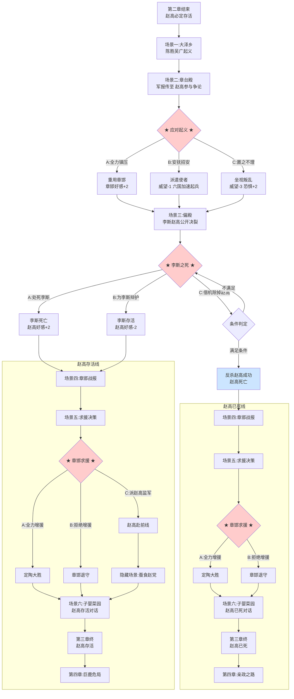

## 第三章：烽火燎原（修正版）

### 【使用说明】

本剧本包含**主线**与**隐忍线**内容。以 `【若隐忍线】` 标注的段落为隐忍线专属新增。以 `【条件分支】` 标注的段落根据前序选择呈现不同文本。**赵高在场景三选项C之前必定存活。场景四至六根据场景三结果分为“赵高存活线”与“赵高已死线”。**

*校订说明：本章时间线实际横跨“秦二世元年七月”至“公元前208年，定陶之战前后”。前半以陈涉起事为硬锚点，后半推进到李斯之死、章邯定陶战局与第四章前夜；本轮不再使用笼统的“秋季”概括关键史事。*

### 【前情回顾·动态字幕】

*画面淡入，黑底白字浮现。根据第一章、第二章实际结局动态生成。*

*时间线：秦二世元年，七月，至公元前208年，定陶之战前后。*

**秦二世元年，七月。**

**胡亥即位一年有余。**

**【若扶苏死亡】** 扶苏自尽于上郡。
**【若扶苏流放】** 扶苏被流放于巴蜀。
**【若扶苏返京途中】** 扶苏仍在返京途中，音讯断绝。

**【若蒙氏死亡】** 蒙恬、蒙毅已死。
**【若蒙氏存活】** 蒙恬仍守北疆，蒙毅降职留用。
**【若蒙氏免官】** 蒙恬、蒙毅免官为民。

**【若第二章选项A（大开杀戒）】** 宗室诸公子，或诛或囚，咸阳宫中嬴姓凋零。
**【若第二章选项B（只杀威胁者）】** 公子高、将闾已死，其余宗室软禁咸阳。
**【若第二章选项C（保护宗室）】** 宗室得以保全，但赵高虎视眈眈。

**【若第二章选项A（继续工程）】** 阿房宫的夯土声日夜不息，骊山陵的刑徒络绎于道。
**【若第二章选项B（暂缓休养）】** 阿房宫工期减半，骊山陵封土暂缓，关中民力稍苏。
**【若第二章选项C（改革税制）】** 田租口赋减一成，商税加三成，黔首稍安，豪商侧目。

**咸阳宫中，赵高权势日盛。李斯沉默，冯去疾苍老。**

**而在千里之外的楚地，一场大雨，即将改变一切……**

**【若隐忍线·字幕追加】**

**“但在无人看见的密室里，胡亥的秘密记录已经写满了三卷竹简。”**
**“在咸阳宫最不起眼的角落，禁卫眼线公孙季、杨喜正在默默记录着赵高党羽的一举一动。”**
**“子婴的菜园里，旧菜已经收过一茬，新翻的泥土还在等下一季的种子。”**
**“他在等。等一个时机。”**

### 【场景一：大泽乡】

*时间线：秦二世元年，七月，大泽乡起事当夜。*

*画面亮起。*

*大雨。*

*不是咸阳那种淅淅沥沥的秋雨，是楚地特有的大雨，铺天盖地，如江河倒灌。*

*雨幕密得让人看不清三步之外的景象。*

*大泽乡。*

*泥泞的道路上，九百名被征发的戍卒正在雨中挣扎。*

*他们衣衫褴褛，面黄肌瘦，许多人连草鞋都没有，赤脚踩在泥水里。*

*他们要去渔阳戍边，但大雨冲毁了道路，他们已经误了期限。*

*按照秦律，失期当斩。*

*队伍停了下来。雨太大了，前面的路被山洪冲断了。两个领头的屯长站在路边，任雨水浇在身上。*

*一个方脸阔口，浓眉深目。他叫陈胜，阳城人，雇农出身。*

*另一个身材稍矮，但肩宽背阔，手掌粗大如蒲扇。他叫吴广，阳夏人，也是雇农。*

*两个人沉默了很久。*

**吴广**：（低声）“陈胜，走也是死，不走也是死。怎么办？”

*陈胜没有立刻回答。他看着雨幕，看着泥泞中挣扎的九百个兄弟，看着这条通往死亡的道路。*

*他忽然笑了。*

**陈胜**：“吴广，你说，王侯将相，是天生的吗？”

*吴广愣住了。*

**陈胜**：“天下苦秦久矣。我听说二世是少子，不该即位。当立的是公子扶苏。扶苏被二世杀了，天下人都替他冤。我还听说，项燕在楚地威望极高，楚人至今以为他还活着。”

**陈胜**：“如果我们假托扶苏和项燕的名义，号召天下反秦，你说，会有多少人响应？”

**吴广**：“你……你要造反？”

**陈胜**：“不。”

*他抬起头，任雨水浇在脸上。*

**陈胜**：“我要让天下人知道——王侯将相，宁有种乎！”

*雷声隆隆。*

*大雨滂沱。*

*大泽乡的九百戍卒，在这一夜，举起了反秦的大旗。*

*而你，在咸阳宫中，还什么都不知道。*

### 【场景二：咸阳宫·章台殿】

*时间线：秦二世元年，七月，其后半月。*

*半个月后。*

*你坐在御座上，正在听赵高汇报各郡的钱粮奏报。一切都和往常一样，枯燥，沉闷，让你昏昏欲睡。*

*然后，一封八百里加急的军报被送进了大殿。*

*送信的使者浑身泥泞，跪在殿上时还在大口喘气。他的脸色白得像死人。*

**使者**：“陛下……大泽乡……九百戍卒叛乱！已攻陷蕲县！”

*殿中骤然安静。*

*你愣了一下。九百人。九百个戍卒。你几乎想笑——九百人能做什么？秦军一个校尉就能率领三千人，碾死他们就像碾死蚂蚁。*

**胡亥**：（不以为然）“区区九百戍卒，也值得八百里加急？传朕旨意，令泗水郡守调兵剿灭便是。”

*使者抬起头，眼中满是恐惧。*

**使者**：“陛下……不、不止九百人了。叛军一路西进，攻下铚、酂、苦、柘、谯……沿途黔首纷纷加入，眼下已不下数万人！他们打出了‘大楚’的旗号，陈胜自称将军，吴广为都尉——”

*你的笑容凝固了。*

**使者**：“——他们还打出了两个人的旗号。一个是公子扶苏，一个是项燕。”

*殿中死一般的寂静。*

*扶苏。*

**【条件分支：若扶苏已死】** 你那位被你赐死的兄长。他的名字，正在被一群泥腿子扛在旗帜上，用来号召天下人反秦。

**【条件分支：若扶苏未死】** 你那位被你流放（或尚在途中）的兄长。他的名字，正在被一群泥腿子扛在旗帜上，用来号召天下人反秦。你保住了他的命，却没能保住他的名字不被利用。

*你感到一阵眩晕。*

**赵高**：（厉声）“妖言惑众！公子扶苏已故，天下皆知！此乃叛贼借名号蛊惑人心，陛下不必忧虑。”

**胡亥**：“……李斯。冯去疾。”

*两位丞相出列。*

**胡亥**：“你们说，怎么办？”

**【条件分支：若冯去疾好感度较高（第二章选项B或C）】**

**冯去疾**：（终于开口）“陛下。九百戍卒不足惧。但陈胜打出扶苏、项燕的旗号，说明关东人心，已离大秦。老臣曾劝陛下与民休息。今日之祸，非一日之寒。”

**冯去疾**：“亡羊补牢，未为晚也。请陛下速发兵平叛，同时下诏安抚关东，减免赋税徭役。剿抚并用，方可平息此乱。”

**【条件分支：若冯去疾好感度较低（第二章选项A）】**

**冯去疾**：（终于开口）“陛下。九百戍卒不足惧。但陈胜打出扶苏、项燕的旗号，说明关东人心已散。”

**冯去疾**：“老臣曾劝陛下与民休息。陛下不听。今日之祸，老臣已无能为力。唯请陛下速发兵平叛。”

**赵高**：（转向你）“陛下，叛贼不过是乌合之众，何须安抚？当以雷霆之势剿灭，传首天下，以儆效尤！”

*两个人针锋相对。殿上群臣噤若寒蝉。*

*你坐在御座上，看着他们争吵。*

*九百戍卒。几天之内变成几万人。打出扶苏的旗号。*

*你的脑子里反复转着这几句话。*

*你忽然想起沙丘那个夜晚。赵高说，只要矫诏发出，天下便是你的。*

*他没有告诉你，天下会用这种方式回应你。*

**【若隐忍线·内心独白】**

*你听着殿下的争吵，心中却出奇地冷静。*

*关东反了。这是你即位以来遇到的最大危机。但你知道，危机对你是危机，对赵高也是危机。*

*赵高慌了。你看得出来。他没想到叛乱会蔓延得这么快。他以为杀了扶苏、杀了蒙恬、杀了宗室，天下就是他的了。但他错了。天下不是杀几个人就能握住的。*

*现在他需要你。需要你坐在御座上，以皇帝的名义调兵平叛。这是他不能取代你的根本原因。*

*你在心里冷笑。赵高，你也有今天。*

*但你的脸上没有任何表情。你只是皱着眉头，像一个被突发事件打懵的年轻皇帝。*

### ★ 核心选择节点一：应对起义 ★

**选项A：全力镇压**

*你握紧了御座的扶手。*

*你不能示弱。父皇从来没有示弱过。六国叛，便灭六国。百越叛，便征百越。秦国的天子，从来不和叛贼谈判。*

**胡亥**：“传朕旨意。赦免骊山刑徒，编入军中。令少府章邯为将，率军东出，剿灭叛贼。”

**赵高**：“陛下圣明！”

**李斯**：“陛下，章邯虽是少府，但未曾领兵……”

**胡亥**：（打断）“丞相可有人选？”

*李斯语塞。*

*秦国可用的宿将并不宽裕。**【若蒙氏死亡】** 蒙恬已死。**【若蒙氏免官】** 蒙恬已废。**【若蒙氏存活】** 蒙恬虽仍在北疆，却远水救不了近火。王离在北方防御匈奴，其余诸将或老或贬。能用的人，确实不多了。*

**胡亥**：“章邯是朕的人。朕信他。”

*章邯是少府出身，与赵高一系没有太深瓜葛。用他，总比用赵高的人强。*

*退朝后，你召见了章邯。*

*章邯四十余岁，面容清瘦，目光沉稳。他是文官出身，但身姿挺拔，隐隐有武人之风。他跪在你面前，神色平静。*

**章邯**：“陛下以重任付臣，臣敢不效死？”

**胡亥**：“章邯。朕不要你死。朕要你赢。”

**胡亥**：“骊山刑徒，朕交给你了。关中的兵，朕也调给你。朕不要过程，只要结果，叛乱平定，陈胜吴广的人头，送到咸阳。”

*章邯叩首。*

**章邯**：“臣，领旨。”

*他退出殿外时，脚步沉稳，没有丝毫犹疑。*

*你忽然觉得，这个人，也许可以信任。*

*（隐藏数值变化：章邯好感度+2。获得关键标记【重用章邯】。赵高好感度+1，因为你没有采纳冯去疾的安抚之策。后续章邯战局的成败，将取决于你后续对他的支持程度。）*

**【若隐忍线·内心独白】**

*你选择了全力镇压。*

*不是因为你不认同冯去疾的安抚之策，是因为你知道，现在还不是和赵高正面冲突的时候。赵高要剿，你便剿。让他在平叛这件事上继续以为你是他的傀儡。*

*但章邯是你的人。你亲自挑选的少府，与赵高一系没有瓜葛。你给了他兵权，给了他信任。他会记住这份恩情。*

*将来有一天，如果你需要一支不听从赵高的军队，章邯，就是你的刀。*

*（隐藏数值变化：权谋值+1。获得关键标记【章邯为刀】——章邯成为潜在的军方盟友。）*

**选项B：安抚招安**

*你沉默了很久。最后，你开口了。*

**胡亥**：“冯丞相。”

**胡亥**：“你说剿抚并用。怎么抚？”

**冯去疾**：“陛下。叛军之中，多数是迫于徭役赋税的黔首。若陛下下诏减免关东钱粮徭役，赦免从叛者的罪行，叛军自会瓦解。”

**赵高**：（冷哼）“冯丞相好大的口气。叛贼已经称王建号，你让陛下赦免他们？”

**冯去疾**：（不理会赵高）“陛下，陈胜打出扶苏的旗号，说明关东人心思稳，只是被暴政所迫。陛下若能施以仁政，叛军不攻自破。”

*如果你下诏安抚，就等于承认了朝廷的过失，等于告诉天下人，父皇的政策错了，赵高的政策错了。*

*赵高不会允许的。*

**胡亥**：（缓缓）“传朕旨意。派遣使者，前往关东，宣谕朕意：从叛者，若解甲归田，既往不咎。今岁关东各郡，赋税减免两成，徭役减半。”

**冯去疾**：“陛下圣明！老臣……老臣替关东千万黔首，谢陛下隆恩！”

*一个月后，消息传回。部分从叛的黔首确实散去了一些，但陈胜的核心部众不但没有瓦解，反而攻占了陈县，自立为“张楚王”。六国旧贵族看到你的招安诏书，不但没有归顺，反而认为你软弱可欺，纷纷起兵响应。*

*魏国宗室魏咎在魏地称王。齐国宗室田儋在齐地称王。项燕的儿子项梁在会稽起兵。*

*你的招安，变成了一个笑话。*

*赵高把这个结果告诉你的时候，语气里带着一丝幸灾乐祸。*

**赵高**：“陛下，臣早就说过，叛贼不可抚。”

*你没有说话。*

*（隐藏数值变化：威望值-1。起义军核心势力未受影响，六国旧贵族加速起兵。获得关键标记【软弱可欺】。后续章节中，朝堂上主战派将占据上风，冯去疾影响力下降。赵高好感度-1。）*

**【若隐忍线·内心独白】**

*你的招安失败了。*

*赵高会拿这件事在朝堂上攻击你，攻击冯去疾。他会说，陛下仁厚，但仁厚不能平叛。他会用这次失败，进一步收紧对你的控制。*

*但你没有完全输。关东的黔首看到了你的招安诏书。他们知道，这个皇帝曾试图减免他们的赋税徭役。虽然诏书没能执行下去，但人心已经种下了。*

*你在密室的竹简上添了一行字——“招安之策，非策之误，乃赵高掣肘之故。”*

*（隐藏数值变化：权谋值+1。）*

**选项C：置之不理**

*你看着那份军报，忽然觉得很累。*

*九百个戍卒。几万叛军。关东那么远，消息传到咸阳都要半个月。等你调兵过去，又是半个月。等你收到战报，又是半个月。*

*你管不了那么远的事。*

**胡亥**：“关东各郡有郡守、郡尉。让他们自行剿灭。”

*李斯抬起头，欲言又止。冯去疾叹了口气，深深叩首。*

**冯去疾**：“陛下，叛军势大，各郡各自为战，恐难……”

**胡亥**：（打断）“朕说了，让他们自行剿灭。”

*你的语气不耐烦。你不想再听这些了。*

*赵高嘴角微微勾起。*

**赵高**：“陛下圣明。关东郡兵足以平叛，何须劳动禁军？”

*退朝后，你再也没有过问关东的战事。*

*两个月后。*

*军报像雪片一样飞入咸阳。*

*陈胜攻占陈县，称王，国号“张楚”。*
*魏咎在魏地称王。*
*田儋在齐地称王。*
*项梁在会稽起兵，拥立楚怀王之孙为楚王。*
*武臣在赵地称王。*
*韩广在燕地称王。*

*关东，几乎全部脱离了秦朝的统治。*

*你坐在御座上，看着一封又一封军报，手指微微发抖。*

*你是怎么把事情搞成这样的？*

*（隐藏数值变化：威望值-3，恐惧值+2。起义军坐大，直接进入最困难模式。后续章节难度大幅提升。获得关键标记【坐视叛乱】。锁死HE“明君逆袭”“重塑天下”。）*

**【若隐忍线·内心独白】**

*你选择了置之不理。不是因为你不关心，是因为你知道，你管不了。*

*赵高把持着禁卫，把持着奏章，把持着诏书。你能调动的兵，不超过你寝殿里的侍卫。你怎么管关东？*

*你只能看着关东一寸一寸地丢失。看着陈胜称王，看着六国复立，看着大秦的疆土在你手中分崩离析。*

*这是赵高的罪，但天下人会记在你的头上。*

*你在密室的竹简上，用发抖的手写下——“赵高隔绝中外，朕欲调兵而不能。关东之失，非朕之罪。”*

*你不知道这卷竹简将来能不能用上。但你必须写下来。写下来，至少能让你自己记住，这不是你的错。*

*（隐藏数值变化：权谋值+1。赵高罪证+1。）*

### 【场景三：咸阳宫·偏殿】

*时间线：公元前209年，冬，陈胜称王消息传至咸阳之日。*

*陈胜称王的消息传到咸阳那天，你在偏殿召见了赵高和李斯。*

*气氛很压抑。*

*赵高依旧是那副恭谨的模样，但你看得出，他也有点慌了。他没想到叛乱会蔓延得这么快。*

*李斯则面沉如水，一言不发。*

**胡亥**：“陈胜称王了。六国旧贵族都反了。关东几乎全丢了。两位爱卿，有什么话说？”

*沉默。*

**胡亥**：（提高声音）“说话！”

*李斯缓缓开口。*

**李斯**：“陛下。老臣有一言，如鲠在喉，不吐不快。”

*你看着他。*

**李斯**：“今日之祸，始于沙丘。”

*赵高猛地转头，死死盯着李斯。*

**李斯**：（不顾赵高的目光）“陛下，沙丘之谋，老臣有份。矫诏赐死扶苏，老臣有份。诛杀蒙恬蒙毅，老臣有份。老臣罪孽深重，不敢辩白。但老臣必须说，赵高，才是罪魁祸首！”

*他指向赵高，手指颤抖。*

**李斯**：“赵高蛊惑陛下，诛戮宗室，屠戮大臣，大兴土木，苛敛天下！今日关东皆反，非反陛下，是反赵高！陛下若诛赵高，以谢天下，叛乱可不攻自破！”

*赵高脸色铁青。*

**赵高**：“李斯！你血口喷人！”

*他转向你，跪地叩首。*

**赵高**：“陛下！李斯此言，是在为叛贼张目！他说天下反的是臣，那陈胜打出扶苏的旗号，也是臣教的吗？六国旧贵族起兵，也是臣逼的吗？分明是李斯身为丞相，治国无方，致使天下离心，如今却想把罪责推到臣头上！”

*两个人针锋相对，互不相让。*

*你坐在御座上，看着他们争吵。*

*你知道李斯说的是真话。至少是一部分真话。*

*但你也知道，杀赵高，没有李斯说的那么容易。赵高掌管内廷、禁卫，他的党羽遍布宫中。你若是现在翻脸，死的未必是他。*

*更何况……李斯自己，就干净吗？*

*现在他来指责赵高，不过是因为赵高权势太大，压过了他。*

*两个人都是你的敌人。*

*但你只能选一个。*

**【若隐忍线·内心独白】**

*你看着殿下争吵的两个人，心中忽然涌起一种奇异的感觉。*

*这是你即位以来，第一次看到他们公开决裂。赵高和李斯，沙丘之谋的两个同谋，一个掌控内廷，一个掌控外朝。他们联手把你推上了皇位，然后一个把你当傀儡，一个在旁沉默。*

*现在他们撕咬起来了。*

*为什么？因为关东反了，因为大秦要亡了，因为他们都在找替罪羊。*

*你看着李斯。这个须发皆白的老人，正在用最后的力气攻击赵高。你知道他说的是真话。你也知道，他不是为了你，是为了他自己。*

*你看着赵高。这个你曾经最信任的老师，正在拼命为自己辩护。你知道他在撒谎。你也知道，他现在不能倒，他倒了，他的党羽会反扑，咸阳会乱。你现在还没有能力收拾那个乱局。*

*但你可以做一个选择。*

### ★ 核心选择节点二：李斯之死 ★

**选项A：相信赵高，处死李斯**

*你看着李斯。这个须发皆白的老人，这个帮父皇统一天下的功臣，这个在沙丘之夜站在赵高身边一言不发的人。*

*他确实有功。但他也知道太多了。*

**胡亥**：（声音很轻）“丞相……朕待你不薄。”

*李斯抬起头，眼中闪过一丝绝望。*

**李斯**：“陛下！老臣侍奉先帝三十余年，为大秦呕心沥血——”

**胡亥**：（打断）“可你今日，在朕面前，将罪责推给赵卿，为叛贼张目。你说陈胜造反，是因为赵高。那朕问你，朕是皇帝，还是赵高是皇帝？”

*李斯愣住了。*

**胡亥**：“天下反的是朕。你不敢说朕，便说赵高。是不是？”

*李斯嘴唇颤抖。*

**李斯**：“陛下……老臣绝无此意……”

**胡亥**：“传朕旨意。丞相李斯，心怀怨望，诽谤君上。下廷尉狱，按律议罪。”

*赵高跪伏在地，声音高亢。*

**赵高**：“陛下圣明！”

*李斯被侍卫架出殿外。他没有挣扎，只是回头看了你一眼。*

*那一眼里，有失望，有悲哀，还有……怜悯。*

---

*李斯下狱后，赵高亲自审问。*

*他给李斯定了三条大罪：一是沙丘之谋中“首鼠两端”；二是长子李由为三川郡守，在陈胜叛军过境时不力战；三是“诽谤君上，为叛贼张目”。*

*李斯在狱中上书自辩。竹简被赵高扣下，你没有看到。*

*数月之后，至公元前208年，七月。*

*李斯被腰斩于咸阳东市，夷三族。*

*行刑那天，咸阳百姓围观如堵。李斯被押上刑台时，须发凌乱，但神色平静。他对着和他一起赴死的次子说了最后一句话。*

*“吾欲与若复牵黄犬，俱出上蔡东门逐狡兔，岂可得乎？”*

*然后刀落。*

*一代名相，就这样死了。*

*你那一夜，梦见了父皇。父皇在梦里什么都不说，只是看着你。他身边站着李斯，站着蒙恬，站着扶苏。他们都看着你。*

*你从梦中惊醒，冷汗湿透了衣襟。*

*（隐藏数值变化：赵高好感度+2。李斯死亡。朝中再无制衡赵高之人。获得关键标记【诛杀李斯】。锁死HE“英雄救赎”，直接导向“傀儡”或“亡国”路线。）*

**【若隐忍线·内心独白】**

*你杀了李斯。*

*不是因为你相信赵高。是因为李斯知道的太多了。沙丘之谋，矫诏赐死，诛杀蒙氏，每一桩，李斯都是同谋，也都是证人。他活着，就是一颗定时炸弹。*

*你选择让赵高除掉他。让赵高以为你依旧是他的傀儡，让赵高继续肆无忌惮地揽权。*

*但你也在密室的竹简上，添了一行字——“李斯之死，赵高罗织罪名，朕不能救。”*

*将来有一天，如果赵高倒了，李斯会被平反。你会的。*

*（隐藏数值变化：权谋值+1。赵高罪证+1。）*

**【以下进入“赵高存活线”后续场景四至六。】** *（注：选项A结束后赵高存活，跳至赵高存活线场景四。）*

**选项B：为李斯辩护**

**胡亥**：“李斯，你说赵高是罪魁祸首。可有证据？”

*李斯猛地抬头。*

**李斯**：“陛下！赵高把持内廷，隔绝中外，陛下可知关东已反了大半？赵高隐匿军报，虚报敌情，使陛下至今仍不知前线凶险！”

*赵高脸色骤变。*

**赵高**：“污蔑！陛下，李斯血口喷人——”

**胡亥**：（打断）“赵高。朕在问李斯。你闭嘴。”

*赵高愣住了。*

*你盯着李斯。*

**胡亥**：“继续说。”

*李斯深吸一口气，从袖中取出一卷竹简。*

**李斯**：“陛下。这是臣收集的各郡军报副本。陈胜叛军实已不下十万，而非赵高所报的‘数万’。六国旧贵族起兵者，已逾二十路。关东仅剩数郡尚在秦手。赵高隐瞒军情，是欲将陛下蒙在鼓中！”

*赵高跪不住了。*

**赵高**：“陛下！李斯私藏军报，分明是图谋不轨！他今日能拿出这些，明日便能拿出别的！此人不可信！”

*你拿起那卷竹简，一一看过。*

*上面的数字触目惊心。*

*你放下竹简，看向赵高。*

**胡亥**：“赵高。李斯所报，可是实情？”

*赵高额头渗出冷汗。*

**赵高**：“陛下……臣、臣也是为了不让陛下忧心……”

**胡亥**：“所以你就骗朕？”

*你的声音不大，但殿中每个人都听出了其中的怒意。*

*赵高叩首，不敢再言。*

**胡亥**：“传朕旨意。李斯官复原职，仍为丞相。赵高……罚俸半年，禁卫之权，暂交——”

*你顿了顿。*

**【条件分支：若蒙氏存活】** “——暂交蒙毅。传朕口谕，即刻召蒙毅入宫听命。”
*殿外侍者领命而去。片刻后，蒙毅入殿叩首。*
**蒙毅**：“臣，万死不辞！”
**【条件分支：若已获得【曾试图告发】】**
*蒙毅抬头看了你一眼。那目光很短，却像把你一下拖回了沙丘那个夜晚。*
**蒙毅**：“沙丘那夜，臣记得公子说过什么。臣今日奉诏，不是尽释旧疑，是愿再信陛下一次。”

**【条件分支：若蒙氏死亡或免官】** “——暂交章邯旧部、郎中令属官公孙季代领。”

*赵高伏在地上，许久没有抬头。你看不到他的表情，但你能感觉到——那具匍匐的身体里，正在酝酿一场风暴。*

*退朝后，李斯留在殿中。*

**李斯**：（低声）“陛下今日保臣，赵高必怀恨在心。陛下需早做防备。”

*他转身离去。你看着他的背影，忽然觉得这个老人比赵高更难读懂。*

*（隐藏数值变化：赵高好感度-2。李斯存活。获得关键标记【保李斯】。后续解锁“李斯派系”剧情线。但赵高从此视你为死敌，后续章节中赵高的敌意和阴谋将大幅升级。）*

**【若隐忍线·内心独白】**

*你保下了李斯。*

*不是因为你信任他，是因为你需要他。需要有人制衡赵高，需要有人在朝堂上牵制赵高的党羽。李斯不是你的朋友，但他是赵高的敌人。敌人的敌人，就是可以用的棋子。*

*你知道赵高会恨你。你知道他会报复。*

*但你已经在禁卫中安插了眼线。公孙季和杨喜会替你盯着赵高的一举一动。子婴会在宫外替你留意赵高党羽的动向。*

*你不是一个人在扛。*

*（隐藏数值变化：权谋值+2。获得关键信息【李斯可用但不可信】。禁卫眼线开始发挥情报作用。）*

**【以下进入“赵高存活线”后续场景四至六。】** *（注：选项B结束后赵高存活，跳至赵高存活线场景四。）*

**选项C：借机除掉赵高**

*（此选项需满足以下条件方可解锁：①序章选择C“隐忍待发”；②权谋值≥7；③子婴好感度≥3；④赵高罪证≥2；⑤已获得【禁卫眼线】标记。若第二章选项C获得【正面抗赵】标记，则条件可适度放宽至权谋值≥6、罪证≥1。）*

*（若不满足条件，此选项为灰色不可选。）*

*你看着殿下争吵的两个人。*

*李斯。赵高。*

*一个知道你的秘密，一个掌控你的禁卫。*

*你谁都不信。*

*但你等了两年。等的就是这一刻。*

*赵高和李斯公开决裂，满朝文武都在看着。这是你出手的最好时机——也可能是唯一的机会。*

**胡亥**：（忽然开口）“够了。”

*殿中安静。*

*你缓缓站起身。*

**胡亥**：“赵高。李斯说你隐匿军报，可是实情？”

*赵高抬头。*

**赵高**：“陛下，臣绝无——”

**胡亥**：“朕没有问你。朕问的是，朕安插在禁卫中的眼线，报回来的叛军人数，是十万。而你告诉朕，只有数万。”

*赵高的脸色变了。*

*他没想到，你居然在禁卫中有自己的眼线。他以为你什么都不知道。*

*他不知道的事，还有很多。*

**胡亥**：“你骗朕。”

**赵高**：“陛下……臣、臣是为了——”

**胡亥**：“是为了什么？是为了让朕安心？还是为了让朕在无知中，等着叛军打到咸阳？”

*赵高额头冷汗涔涔。*

**胡亥**：“来人。”

*殿门打开。*

*不是赵高安排的禁卫。是你通过子婴，从宗室和蒙氏旧部中秘密选拔的亲卫——公孙季带队，杨喜副之。*

**【条件分支：若蒙氏存活】** *蒙毅也在其中，他身着甲胄，目光如炬。*

*他们穿着禁卫的甲胄，但眼神和步伐，与赵高的那些人截然不同。*

*赵高看着那些陌生的面孔，瞳孔骤缩。*

*他终于意识到，你不再是两年前沙丘那个被他吓得发抖的少年了。*

**胡亥**：“郎中令赵高，欺君罔上，隐匿军情，图谋不轨。拿下。”

*赵高猛地跳起来。*

**赵高**：“陛下！你不能！臣侍奉先帝二十年！你的皇位是臣——”

**胡亥**：“是。朕的皇位是你给的。所以朕忍了你两年。”

*你走下御阶，一步一步走到他面前。*

**胡亥**：“两年。你让朕杀扶苏，朕杀了。你让朕杀蒙恬，朕杀了。你让朕杀宗室，朕也杀了。赵高，你是不是以为，朕是你手里的一把刀？”

*赵高嘴唇颤抖，说不出话。*

**胡亥**：“朕不是刀。朕是持刀的人。”

*你摆了摆手。*

**胡亥**：“押入廷尉狱，按律议罪。禁卫、少府、郎中令所属，凡赵高党羽，一网打尽。”

*公孙季和杨喜上前，将赵高双臂反剪。赵高挣扎着，喊叫着，但殿外的侍卫没有动，他们中的大多数，看到公孙季带队，已经明白了风向。*

*赵高被拖出殿外。他的喊叫声渐渐远去。*

*殿中只剩下你和李斯。*

*李斯跪在地上，身体微微发抖。不知是庆幸，还是恐惧。*

*你转过身，看着他。*

**胡亥**：“丞相。”

**李斯**：“……臣在。”

**胡亥**：“拟诏。赵高伏诛。从即日起，朕亲掌大政。”

*李斯叩首。*

**李斯**：“陛下……圣明。”

*他的声音里，有一种你从未听过的东西。*

*是敬畏。*

*（隐藏数值变化：赵高好感度归零，赵高死亡。获得关键标记【反杀赵高】。威望值+5，恐惧值-2，宗室支持度+2。权谋值+5。解锁HE“明君逆袭”“傀儡翻身”等结局路线。后续章节剧情大幅变动——赵高已死，你需要独自面对章邯的战局和关东的叛乱。）*

**【若隐忍线·专属扩展——反杀赵高后的密会】**

*当夜。密室。*

*你独自坐在密室里，面前摊着那几卷秘密记录的竹简。*

*沙丘之夜。矫诏。扶苏之死。蒙恬之死。宗室之屠。刺客事件。隐匿军报。三卷竹简，密密麻麻，都是赵高的罪证。*

*你等了两年。记录了两年的罪证。今天，终于用上了。*

*密室的暗门被轻轻叩响。三短一长，是你和子婴约定的暗号。*

*你打开门。子婴站在门外，穿着一身深色便服。他走进密室，看了一眼案上的竹简，然后向你深深一揖。*

**子婴**：“陛下。做到了。”

*你看着他。这个在你最落魄时陪伴你的堂叔，这个在咸阳城最偏僻的角落里为你物色眼线、编织情报网的人。没有他，你走不到今天。*

**胡亥**：“叔父。不是朕做到的。是朕和你一起做到的。”

*子婴直起身。*

**子婴**：“陛下。赵高虽除，但他的党羽还在。禁卫、少府、郎中令，还有关东各郡的郡守郡尉。这些人，需要时间清洗。”

**胡亥**：“朕知道。”

**子婴**：“还有李斯。陛下今日没有动他，但他不会感激陛下。他只会觉得，陛下需要他。一旦他觉得陛下不需要他了，他就会成为第二个赵高。”

**胡亥**：“朕知道。”

*子婴看着你，忽然笑了。*

**子婴**：“陛下真的长大了。”

*他顿了顿。*

**子婴**：“接下来，陛下打算怎么办？”

*你沉默了片刻，然后从案上拿起一卷空白的竹简，提起笔，在上面写下了几个字——*

*“章邯。关东。秦法。”*

**胡亥**：“这三件事。平叛，靠章邯。收复关东，靠民心。守住天下，靠改秦法。”

*子婴看着你写下的字，眼中光芒愈发明亮。*

**子婴**：“陛下心中已有成算，臣便放心了。”

*你放下笔。*

**胡亥**：“叔父。赵高的党羽清洗，朕交给你。禁卫、少府、郎中令，凡赵高提拔者，一律撤换。朕会从宗室和蒙氏旧部中选拔新人。这件事，必须在三个月内完成。”

*子婴躬身。*

**子婴**：“臣，领旨。”

*他退出密室。你独自坐在烛火前，拿起那三卷竹简，走到火盆边。犹豫了一瞬，然后，将它们一束一束地投入火中。*

*火焰舔舐着竹片，发出噼啪的声响。墨字在火中扭曲、变淡、化为灰烬。*

*你不需要它们了。赵高已经伏诛。那些记录，已经刻在了你的心里。*

*你心中没有复仇的快意，只有一种沉甸甸的清醒。*

*赵高死了。但关东还在反，章邯还在苦战，黔首还在怨恨。*

*你吹熄了烛火，走出密室。*

*从今天起，你不再是傀儡。你是真正的皇帝。*

*（隐藏数值变化：权谋值+2。获得关键标记【亲政】。）*

**【以下进入“赵高已死线”后续场景四至六。】** *（注：选项C成功结束后赵高死亡，跳至赵高已死线场景四。）*

### 【场景四：章邯的战报】

*时间线：秦二世元年末，至公元前208年，定陶之战前后。*

*（此场景为通用剧情，赵高存活线与赵高已死线共用。）*

*此后数月，关东前线的战报一封接一封地传回咸阳。章邯没有让你失望。*

*他率骊山刑徒东出，首战于戏水，大破陈胜部将周文。*

*周文率数十万大军西进，已打到戏水，距离咸阳不过百里。咸阳震动。*

*但章邯在戏水列阵，一举击溃周文。*

*周文败退至曹阳，章邯追至，再破之。*

*周文退至渑池，章邯围城十日，破城，周文自刎。*

*陈胜的主力，被章邯一战荡平。*

*消息传回咸阳，全城沸腾。*

*你拿着战报，反复读了三遍。章邯的字迹端正有力，他在战报最后写了一句——“臣当乘胜东进，剿灭陈胜，收复关东。请陛下静候佳音。”*

*你放下竹简，长长地吐出一口气。*

*这是你即位以来，第一个真正的好消息。*

**【若隐忍线·内心独白】**

***你放下战报，心中涌起一股复杂的情绪。***

***章邯赢了。你亲自挑选的少府，没有让你失望。他以骊山刑徒为主力，在戏水击溃了周文的数十万大军。这是大秦自陈胜起兵以来的第一场大胜。***

***你忽然想起章邯出征前对你说的话——“臣敢不效死？”***

***他是你的人。你给了他信任，他用胜利回报了你。***

***你知道，章邯这把刀，你选对了。***

***（若已获得【章邯为刀】标记）你的心中浮现出一个更大的计划。如果章邯能平定关东，他的威望将如日中天。到那时，你便有了对抗任何权臣的军方力量。***

***（若赵高已死）你提起笔，在章邯的战报上批了一个字——“赏”。***

***然后你顿了顿，又添了一行字——“章邯所部，赐金千斤。阵亡将士，抚恤加倍。”***

*但好景不长。*

*章邯东进后，遇到了真正的对手——项梁。*

*项梁是项燕的儿子，楚国名将之后。*

*他在会稽起兵，拥立楚怀王之孙熊心为楚王，自号武信君。*

*他的侄子项羽，年仅二十四岁，却勇猛异常，在战场上所向披靡。*

*章邯与项梁在定陶对峙。*

### 【场景五：咸阳宫·寝殿·夜】

*时间线：公元前208年，定陶战局期间，夜。*

**【以下为“赵高存活线”剧情。若赵高已死，请跳至后文“赵高已死线”场景五。】**

*你独自坐在寝殿中，面前摊着章邯的求援奏报。*

*定陶战事胶着。章邯请求增派援军，调王离的长城军团南下，夹击项梁。*

*王离的二十万长城军团驻守北疆，防御匈奴。*

*但匈奴自蒙恬北逐后，暂时没有大举南下的迹象。调部分兵力南下，是可以的。*

*但赵高反对。*

**赵高**：“陛下，章邯拥兵自重，若再给援军，尾大不掉。王离军乃北疆屏障，不可轻动。”

*他是你的人。你让他赢。*

**【若隐忍线·内心独白】**

*你看着章邯的求援奏报，心中飞速盘算。*

*赵高反对增援。他说章邯拥兵自重，若再给援军，尾大不掉。*

*你知道他在撒谎。他不是担心章邯坐大，他是担心你——担心你通过章邯，掌握一支不受他控制的军队。*

*你必须做出选择。*

#### ★ 核心选择节点三（赵高存活线）：章邯求援 ★

**选项A：全力增援**

*你提起笔，在诏书上写下了一个字——*

*“准。”*

**胡亥**：“传朕旨意。令王离率长城军团十万，南下驰援章邯。告诉章邯，朕在咸阳等他凯旋。”

*赵高脸色一变。*

**赵高**：“陛下——”

**胡亥**：（打断）“朕意已决。”

*赵高沉默。*

*诏书发出。*

*一个月后，定陶。*

*章邯与王离合兵，大破项梁。项梁战死于定陶城下。楚军溃败，项羽率残部退守彭城。*

*消息传到咸阳，你在群臣面前露出了笑容。*

*章邯在战报中写道：“项梁已死，楚军胆寒。臣当乘胜东进，尽复关东。陛下不必忧虑。”*

*你放下战报，望着殿外澄澈的秋空。*

*也许，大秦还有救。*

*（隐藏数值变化：章邯好感度+3。获得关键标记【全力支持章邯】。定陶之战大胜，项梁死亡。后续巨鹿之战中，章邯兵力充足，战局可能逆转。解锁HE“明君逆袭”的关键条件之一。）*

**【若隐忍线·内心独白】**

*你选择了全力增援。*

*赵高会不高兴。但你不在乎。你需要章邯赢。只有章邯赢了，关东才能平定；只有关东平定了，你才有底气对抗赵高。*

*你看着诏书送出殿外，心中涌起一种从未有过的感觉。这是你第一次在军国大事上，完全按照自己的意志做出了决定。*

*（隐藏数值变化：权谋值+1。）*

**选项B：拒绝增援**

*你犹豫了。*

*赵高的话在你耳边响起——“章邯拥兵自重，若再给他援军，尾大不掉。”*

*你想起蒙恬。蒙恬也曾为大秦戍守北疆，手握三十万大军。*

*如果章邯打赢了项梁，收复了关东，他的威望将如日中天。到那时，他会不会成为第二个蒙恬？或者……第二个王翦？*

*你不知道。*

**胡亥**：（放下笔）“再议。”

*诏书没有发出。*

*章邯没有等到援军。定陶之战，他以寡敌众，虽未大败，但也未能击溃项梁。双方对峙数月，粮草消耗殆尽，章邯被迫退守濮阳。*

*项梁乘势进逼。*

*赵高把章邯退守的消息报给你时，语气平淡。*

**赵高**：“陛下，章邯作战不力，当降旨切责。”

*你沉默了很久。*

**胡亥**：“……拟诏。切责章邯。”

*诏书发出。*

*章邯收到切责诏书后，回了一封奏报。上面只有八个字。*

*“臣力战。援军不至。非臣之罪。”*

*你看着那八个字，忽然觉得它们比任何谏言都要沉重。*

*（隐藏数值变化：章邯好感度-2。定陶之战陷入僵局，项梁未死。后续巨鹿之战中，章邯兵力不足，处境更加艰难。获得关键标记【猜忌章邯】。赵高好感度+1。）*

**【若隐忍线·内心独白】**

*你没有发出援军。*

*不是因为你不信任章邯，是因为你现在还不能让赵高觉得你失控。*

*赵高反对增援，你若是强行发出诏书，他会在其他事情上卡你——粮草、军械、后方补给。章邯就算得到了援军，也会被赵高从背后捅刀子。*

*你选择了退让。但你在密室的竹简上，添了一行字——“章邯求援，赵高阻之。朕不能发兵。”*

*将来有一天，如果章邯败了，如果追究责任，这卷竹简会告诉后人——不是朕的错。*

*（隐藏数值变化：权谋值+1。赵高罪证+1。）*

**选项C：派赵高出征监军**

*你看着赵高，忽然有了一个念头。*

**胡亥**：“老师。章邯求援，朕有意应允。但老师说得对，章邯拥重兵在外，不可不防。”

*赵高点头。*

**赵高**：“陛下圣虑极是。”

**胡亥**：“所以，朕想派一个人去监军。这个人，必须深通兵法，能让章邯信服。老师是先帝旧臣，又精通狱法军律，是最合适的人选。”

*赵高的笑容僵住了。*

**赵高**：“陛下……臣是文臣，不通武事……”

**胡亥**：“老师何必过谦。父皇在时，常夸老师文武兼备。怎么，老师不愿意为朕分忧？”

*赵高看着你，你也看着他。*

*你知道他不想去。前线刀枪无眼，项梁的楚军凶悍，而且一旦离开咸阳，他对朝堂的控制力就会大幅削弱。*

*这正是你的目的。*

**赵高**：（沉默良久，终于叩首）“臣……领旨。”

*赵高以监军身份前往章邯军中。*

*一个月后，消息传回。赵高到了前线，与章邯矛盾重重。他不懂军事，却处处干涉章邯的指挥。章邯多次上书，请求召回赵高。*

*你把章邯的奏报压下了。*

*让赵高在前线多待一阵。咸阳的空气，难得清静。*

*（隐藏数值变化：赵高好感度-1，章邯好感度-1。赵高离京期间，你可以趁机调整禁卫、收拢朝权。但前线将帅不和，定陶战局可能受到不利影响。获得关键标记【调虎离山】。解锁隐藏剧情“蚕食赵党”。）*

### 【隐藏场景一：赵高离京后的行动】

*时间线：公元前208年，定陶战局期间，赵高离京第三日，夜。*

*（此场景在选项C“派赵高出征监军”触发后，自动插入。仅隐忍线可见。）*

*赵高离京的第三天。夜。*

*你在密室中召见了子婴。*

**胡亥**：“叔父。赵高走了。”

*子婴点了点头。*

**子婴**：“陛下等的就是这个机会。”

**胡亥**：“是。赵高在咸阳，朕动不了禁卫。他走了，朕便可以动了。”

*你从案上拿起一卷竹简，递给子婴。上面是禁卫、少府、郎中令三衙门的官员名单。赵高的党羽，你已经在名字旁边用朱笔圈出。*

**胡亥**：“这些人，朕要换掉。不能一次全换，会打草惊蛇。分批换。第一批，换禁卫中与赵高最亲近的将领。借口——轮值疏漏，刺客事件余波未平。”

**胡亥**：“公孙季，可以补郎中令属官。杨喜，可以补卫尉属吏。另外，朕想让叔父帮朕留意——蒙氏旧部中，还有多少可用之人？”

*子婴沉默了一瞬。*

**【条件分支：若蒙氏死亡或免官】**

**子婴**：“蒙恬、蒙毅死后，蒙氏旧部大多被赵高贬黜。臣已暗中接触过一些人。只要陛下愿意为他们平反，他们愿意为陛下效死。”

**【条件分支：若蒙氏存活】**

**子婴**：“蒙恬在北，蒙毅在朝。蒙氏旧部虽被赵高打压，但骨干仍在。只要陛下一道诏书，他们便可重回禁卫。”

**胡亥**：“平反……现在还不行。赵高还没死，朕若为蒙氏平反，他回京后会发疯。但朕可以先给他们一些不起眼的职位，让他们回到禁卫中。等赵高倒了，再正式平反。”

**【条件分支：若已获得【曾试图告发】】**

**子婴**：“陛下若真想把沙丘那夜没做成的事补回来，蒙氏这条线便不能再断。蒙毅未必会立刻信您，但只要他还在，陛下就还有迟来的交代可还。”

*你没有说话。烛火映着那份名单，像映着一笔拖了太久的旧债。*

*子婴看着你，眼中浮现出欣慰的神色。*

**子婴**：“陛下思虑周密，臣不如也。”

**子婴**：“臣这就去安排。一个月内，第一批人便会到位。”

*你点了点头。*

*子婴退出密室。你独自坐在烛火前，看着那份名单。*

*赵高在前线，每一道军报都要经过他的手。他越干涉章邯，章邯就会越恨他。咸阳这边，你越换他的人，他的根基就会越松动。*

*（隐藏数值变化：权谋值+3。获得关键标记【蚕食赵党】。禁卫眼线数量增加，赵高党羽被逐步替换。后续赵高回京时，面对的将是一支已经被你渗透的禁卫。）*

### 【场景六：公子婴的菜园（赵高存活线）】

*时间线：公元前208年，深秋，黄昏。*

*深秋。咸阳的草木开始凋零。*

*你再一次微服来到公子婴的府邸。*

*菜园里的菜已经收了一茬，土地翻过，正等着种冬菜。公子婴依旧蹲在地里，不紧不慢地侍弄着他的泥土。*

**【条件分支：若全力支持章邯】** **胡亥**：“叔父。章邯在定陶斩了项梁。但关东还在反。”
**【条件分支：若猜忌章邯或调虎离山】** **胡亥**：“叔父。章邯打赢了戏水之战。但项梁还在。关东还在反。”

*子婴没有回头。*

**子婴**：“陛下觉得，章邯能平定关东吗？”

**胡亥**：“……朕不知道。”

**子婴**：“臣也不知道。但臣知道另一件事。”

*他站起来，拍了拍手上的泥土，转过身看着你。*

**子婴**：“关东反的不是陛下。关东反的是秦法。是先帝灭六国后，没有给他们一条活路。郡县制、书同文、车同轨，这些东西对陛下来说是功业，对他们来说是枷锁。陛下能打败陈胜、打败项梁，但陛下能打败每一个活不下去的黔首吗？”

*你愣住了。*

**子婴**：“臣说这些，不是为了动摇陛下。臣是想说，平叛靠章邯，但治天下，不能只靠章邯。”

*他俯身，从地里拔出一棵干枯的菜根。*

**子婴**：“这菜根，看起来死了。但把它埋在土里，明年春天，它还会发芽。关东的叛乱也一样。陛下杀了一个陈胜，还会有第二个陈胜。除非……陛下给关东一条活路。”

*你沉默了很久。*

**胡亥**：“叔父的意思，是让朕……改秦法？”

*子婴摇头。*

**子婴**：“臣不懂什么法不法。臣只知道，种菜不能只拔叶子，得松土、浇水、施肥。陛下是天子，天下就是陛下的菜园。”

*他顿了顿。*

**子婴**：“陛下若是只想拔叶子，叶子是拔不完的。”

*秋风穿过菜园，吹落最后几片枯叶。你站在泥土和枯草的气息里，忽然觉得，你即位以来做的所有事，杀人、平叛、批奏章，都像在拔叶子。*

*可根还在土里。*

*（隐藏数值变化：子婴好感度+1。获得关键对话【菜园论政】。若后续章节中玩家选择改革秦法、与民休息，此场景将成为重要的剧情伏笔。）*

**【若隐忍线·隐藏对话扩展】**

*（若已获得【子婴同盟】标记，此处触发扩展对话。）*

**胡亥**：“叔父。朕明白你的意思。但改秦法，不是现在。”

**胡亥**：“赵高还在。朕若提出改秦法，他会第一个反对。他会说朕背叛了父皇的遗命，会说朕向六国遗民低头。朕不能在这个时候给他攻击朕的口实。”

*子婴点了点头。*

**子婴**：“陛下说得对。改秦法，是大事，急不得。但陛下可以从小处做起。”

**胡亥**：“小处？”

**【条件分支：若第二章选择了暂缓休养或改革税制】**

**子婴**：“陛下不是已经减免了关东的徭役吗？陛下不是已经减了田租、加了商税吗？这些，都是小处。黔首们会记住的。”

**【条件分支：若第二章选择了继续工程】**

**子婴**：“陛下可以从下一道诏书开始。减免某个郡的徭役，降低某个县的赋税。一件一件做，黔首们会记住的。”

*他顿了顿。*

**子婴**：“陛下每做一件这样的事，关东的黔首心里就多一分对陛下的期待。等期待攒够了，陛下再下诏大改秦法，便会天下响应。”

*你看着他，心中忽然有了一种清晰的方向。*

*改秦法，不是一道诏书的事。是一步一步，一件事一件事，慢慢做的。*

**胡亥**：“叔父。朕懂了。”

### 【场景五（赵高已死线）：咸阳宫·寝殿·夜】

*时间线：公元前208年，定陶战局期间，夜。*

*（此场景仅当场景三选项C成功、赵高已死时触发。）*

*你独自坐在寝殿中，面前摊着章邯的求援奏报。*

*定陶战事胶着。章邯请求增派援军，调王离的长城军团南下，夹击项梁。*

*这是一个合理的请求。王离的二十万长城军团驻守北疆，防御匈奴。但匈奴自蒙恬北逐后，暂时没有大举南下的迹象。调部分兵力南下，是可以的。*

*但朝中出现了反对的声音。*

*李斯主张增援。*

**李斯**：“陛下，章邯苦战，若无援军，定陶一旦有失，叛军将直逼函谷关。王离军可暂调一部南下，北疆留半数足矣。”

*冯去疾及保守派大臣隗林、王戊等反对。*

**冯去疾**：“陛下，匈奴虽暂未南侵，然北疆空虚，若胡骑趁虚而入，代郡、云中皆不可守。章邯所部尚有十余万，足以与项梁周旋。请陛下三思。”

*两派争执不下。*

*烛火跳动。你揉着眉心。*

*你想起章邯出发前对你说的话——“臣敢不效死？”*

*他是你的人。你让他赢。*

*但现在，你需要做一个决定。*

**【若隐忍线·内心独白】**

*你看着章邯的求援奏报，心中飞速盘算。*

*李斯主战，冯去疾主稳。两个人都有道理。李斯担心关东战局，冯去疾担心北疆防御。你必须在二者之间做出权衡。*

*你必须做出选择。*

#### ★ 核心选择节点三（赵高已死线）：章邯求援 ★

**选项A：全力增援**

*你提起笔，在诏书上写下了一个字——*

*“准。”*

**胡亥**：“传朕旨意。令王离率长城军团十万，南下驰援章邯。告诉章邯，朕在咸阳等他凯旋。”

*李斯躬身。*

**李斯**：“陛下圣明。”

*冯去疾叹了口气，不再说话。*

*诏书发出。*

*一个月后，定陶。*

*章邯与王离合兵，大破项梁。项梁战死于定陶城下。楚军溃败，项羽率残部退守彭城。*

*消息传到咸阳，你第一次在群臣面前露出了笑容。*

*章邯在战报中写道：“项梁已死，楚军胆寒。臣当乘胜东进，尽复关东。陛下不必忧虑。”*

*你放下战报，望着殿外澄澈的秋空。*

*也许，大秦还有救。*

*（隐藏数值变化：章邯好感度+3。获得关键标记【全力支持章邯】。定陶之战大胜，项梁死亡。后续巨鹿之战中，章邯兵力充足，战局可能逆转。解锁HE“明君逆袭”的关键条件之一。）*

**【若隐忍线·内心独白】**

*你选择了全力增援。*

*你选择了李斯的方案。不是因为你完全信任他，是因为眼下最大的威胁是关东的叛军。北疆的匈奴，暂时还顾不上。两害相权取其轻。*

*你看着诏书送出殿外，心中涌起一种从未有过的感觉。这是你第一次在军国大事上，完全按照自己的意志做出了决定。*

*（隐藏数值变化：权谋值+1。）*

**选项B：拒绝增援**

*你犹豫了。*

*冯去疾的话在你耳边响起——“北疆空虚，匈奴会趁虚而入。”*

*你想起父皇修筑的长城，想起蒙恬北逐匈奴的功业。如果因为抽调长城军团，导致匈奴南下，你如何面对父皇？*

*你不知道。*

**胡亥**：（放下笔）“再议。”

*诏书没有发出。*

*章邯没有等到援军。定陶之战，他以寡敌众，虽未大败，但也未能击溃项梁。双方对峙数月，粮草消耗殆尽，章邯被迫退守濮阳。*

*项梁乘势进逼。*

*李斯将章邯退守的消息报给你时，面色凝重。*

**李斯**：“陛下，章邯退守濮阳。项梁进逼。臣请再议增援之事。”

*冯去疾出列。*

**冯去疾**：“陛下，北疆不可空虚。章邯既已退守，当令其固守待援，不可冒进。”

*你沉默了很久。*

**胡亥**：“……令章邯固守濮阳。援军事，再议。”

*诏书发出。*

*章邯收到诏书后，回了一封奏报。上面只有八个字。*

*“臣力战。援军不至。非臣之罪。”*

*你看着那八个字，忽然觉得它们比任何谏言都要沉重。*

*（隐藏数值变化：章邯好感度-2。定陶之战陷入僵局，项梁未死。后续巨鹿之战中，章邯兵力不足，处境更加艰难。获得关键标记【猜忌章邯】。）*

**【若隐忍线·内心独白】**

*你没有发出援军。*

*你选择了冯去疾的方案。不是因为你完全认同他，是因为北疆的匈奴确实是个威胁。你刚刚亲政，不能冒任何导致北疆崩溃的风险。*

*但你也知道，章邯会因此对你失望。你在密室的竹简上，添了一行字——“章邯求援，朕以匈奴为忧，未能全力。若定陶有失，朕之过也。”*

*将来有一天，如果追究责任，这卷竹简会告诉后人真相。*

*（隐藏数值变化：权谋值+1。）*

### 【场景六（赵高已死线）：公子婴的菜园】

*时间线：公元前208年，深秋，黄昏。*

*（此场景仅当场景三选项C成功、赵高已死时触发。）*

*深秋。咸阳的草木开始凋零。*

*你再一次微服来到公子婴的府邸。*

*菜园里的菜已经收了一茬，土地翻过，正等着种冬菜。公子婴依旧蹲在地里，不紧不慢地侍弄着他的泥土。*

**【条件分支：若全力支持章邯】** **胡亥**：“叔父。章邯在定陶斩了项梁。但关东还在反。”
**【条件分支：若猜忌章邯】** **胡亥**：“叔父。章邯打赢了戏水之战。但项梁还在。关东还在反。”

*子婴没有回头。*

**子婴**：“陛下觉得，章邯能平定关东吗？”

*你沉默。*

**胡亥**：“……朕不知道。”

**子婴**：“臣也不知道。但臣知道另一件事。”

*他站起来，拍了拍手上的泥土，转过身看着你。*

**子婴**：“关东反的不是陛下。关东反的是秦法。是先帝灭六国后，没有给他们一条活路。郡县制、书同文、车同轨，这些东西对陛下来说是功业，对他们来说是枷锁。陛下能打败陈胜、打败项梁，但陛下能打败每一个活不下去的黔首吗？”

*你愣住了。*

**子婴**：“臣说这些，不是为了动摇陛下。臣是想说——平叛靠章邯，但治天下，不能只靠章邯。”

*他俯身，从地里拔出一棵干枯的菜根。*

**子婴**：“这菜根，看起来死了。但把它埋在土里，明年春天，它还会发芽。关东的叛乱也一样。陛下杀了一个陈胜，还会有第二个陈胜。除非……陛下给关东一条活路。”

*你沉默了很久。*

**胡亥**：“叔父的意思，是让朕……改秦法？”

*子婴摇头。*

**子婴**：“臣不懂什么法不法。臣只知道，种菜不能只拔叶子，得松土、浇水、施肥。陛下是天子，天下就是陛下的菜园。”

*他顿了顿。*

**子婴**：“陛下若是只想拔叶子，叶子是拔不完的。”

*秋风穿过菜园，吹落最后几片枯叶。你站在泥土和枯草的气息里，忽然觉得，你即位以来做的所有事，杀人、平叛、批奏章，都像在拔叶子。*

*可根还在土里。*

*（隐藏数值变化：子婴好感度+1。获得关键对话【菜园论政】。若后续章节中玩家选择改革秦法、与民休息，此场景将成为重要的剧情伏笔。）*

**【若隐忍线·隐藏对话扩展】**

*（若已获得【子婴同盟】标记，此处触发扩展对话。）*

*你站在秋风里，看着子婴手中那棵干枯的菜根，沉默了很久。*

**胡亥**：“叔父。朕明白你的意思。但改秦法，不是现在。”

*子婴抬起头，看着你。*

**胡亥**：“赵高虽死，他的党羽还在。李斯还在。朕若贸然改秦法，这些人会联合起来反扑。朕需要时间，先把朝堂稳住。而且，关东还在打仗。打仗的时候改秦法，将士们会怎么想？他们会觉得朕在向叛军低头。”

*子婴点了点头。*

**子婴**：“陛下说得对。改秦法，是大事，急不得。但陛下可以从小处做起。”

**胡亥**：“小处？”

**【条件分支：若第二章选择了暂缓休养或改革税制】**

**子婴**：“陛下不是已经减免了关东的徭役吗？陛下不是已经减了田租、加了商税吗？这些，都是小处。黔首们会记住的。”

**【条件分支：若第二章选择了继续工程】**

**子婴**：“陛下可以从下一道诏书开始。减免某个郡的徭役，降低某个县的赋税。一件一件做，黔首们会记住的。”

*他顿了顿。*

**子婴**：“陛下每做一件这样的事，关东的黔首心里就多一分对陛下的期待。等期待攒够了，陛下再下诏大改秦法，便会天下响应。”

*你看着他，心中忽然有了一种清晰的方向。*

*改秦法，不是一道诏书的事。是一步一步，一件事一件事，慢慢做的。*

**胡亥**：“叔父。朕懂了。”

*子婴将手中那棵菜根埋回土里，拍了拍手上的泥土。*

**子婴**：“陛下懂了这个，臣就放心了。”

### 【第三章·终】

*画面暗下。字幕浮现。*

**“陈胜称王。六国复立。关东烽火，已烧遍故六国之地。”**

**“章邯苦战。项梁虎视。大秦最后的精锐，在异乡的土地上浴血。”**

**【若场景三选项A或B（赵高存活）】**

**“而在咸阳宫中，赵高的阴影，越来越长。”**

**“胡亥坐在御座上，四面楚歌。”**

**【若场景三选项C成功（赵高已死）】**

**“赵高已死。但李斯的权势日渐膨胀，冯去疾的谏言越来越无力。”**

**“胡亥亲政，却发现朝堂上的敌人，并不比从前少。”**

**【若隐忍线·字幕追加（赵高存活）】**

**“但在赵高看不到的地方，胡亥的棋子正在一枚一枚落下。”**

**“禁卫中，赵高的党羽被悄然替换。”**

**“密室里，赵高的罪证越积越厚。”**

**“他在等。等赵高露出最大的破绽。”**

**【若隐忍线·字幕追加（赵高已死）】**

**“赵高死了。胡亥亲政。”**

**“但大秦的敌人还在。关东还在反，章邯还在苦战，黔首还在怨恨。”**

**“赵高只是第一条毒蛇，不是最后一条。”**

**“真正的仗，才刚刚开始。”**

### 【下章预告】

*画面亮起。*

**【若赵高存活（场景三选项A或B）】**

*咸阳宫。朝堂。*

*赵高牵着一头鹿，缓步走上大殿。群臣的目光在他和鹿之间游移，满朝文武，鸦雀无声。*

*赵高面带微笑，向你躬身行礼。*

*“陛下。臣偶得一匹千里马，特来进献。”*

*那是一头鹿。所有人都知道那是一头鹿。赵高也知道那是一头鹿。但他还是说，这是马。*

*他是在问所有人——在这座大殿里，谁说了算？*

*画面定格。字幕浮现。*

**第四章——《巨鹿危局》**

**【若赵高已死（场景三选项C成功）】**

*咸阳宫。朝堂。*

*你坐在御座上，面前摊着李斯呈上的《削藩策》。他要你趁章邯平叛之机，收回诸王封地，彻底废除分封。*

*蒙毅（若存活）或冯去疾（若蒙氏死亡）联名上书，反对李斯——他们主张保留分封，以安宗室之心。*

*两派争执不下。你必须在二者之间做出选择。*

*画面定格。字幕浮现。*

**第四章——《亲政之路》**

**敬请期待。**

### 【第三章完成·数值结算】

#### 通用数值（在第二章基础上累计）

| 数值       | 镇压+杀李斯           | 镇压+保李斯           | 安抚+保李斯 | 反杀赵高              | 置之不理 |
| :--------- | :-------------------- | :-------------------- | :---------- | :-------------------- | :------- |
| 残暴值     | 高                    | 中                    | 中          | 低                    | 低       |
| 威望值     | 中                    | 中高                  | 中          | 高                    | 极低     |
| 恐惧值     | 高                    | 中                    | 中          | 低                    | 极高     |
| 赵高好感度 | 高                    | 低                    | 中          | 归零（死亡）          | 高       |
| 章邯好感度 | 高（增援）/中（拒援） | 高（增援）/中（拒援） | 中          | 中（增援）/低（拒援） | 低       |
| 子婴好感度 | 1-2                   | 2-3                   | 2-3         | 5+                    | 0-1      |
| 宗室支持度 | 0至-1                 | 0至1                  | 1至2        | 4-5                   | -1至0    |

#### 隐忍线专属数值

| 数值       | 镇压+杀李斯 | 镇压+保李斯 | 反杀赵高         | 调虎离山 |
| :--------- | :---------- | :---------- | :--------------- | :------- |
| 权谋值     | 11-12       | 11-12       | 14-15            | 11-12    |
| 子婴好感度 | 2           | 3           | 6+               | 2-4      |
| 赵高罪证   | 3-4         | 3-4         | 归零（罪证已用） | 3-4      |

#### 隐忍线专属标记

- 若选镇压：【章邯为刀】
- 若选保李斯：【李斯可用但不可信】
- 若选反杀赵高：【反杀赵高】【亲政】
- 若选调赵高监军：【调虎离山】【蚕食赵党】
- 共通：【菜园论政】

**第三章结束。存档。**

