# 《胡亥模拟器》第四章：巨鹿危局

## 【使用说明】

本剧本在主线第四章基础上进行增量创作。由于隐忍线在第三章可能出现**赵高已死**或**赵高存活**两种状态，本章剧本分为两条路线：

- **路线一：赵高存活线**——沿用主线“巨鹿败报入朝后的朝堂摊牌”框架，嵌入隐忍线专属内心独白、隐藏场景及扩展选项。根据第三章破局之策选择，分化为章邯回师线、雍城对峙线、宫中刺杀线三种走向。
- **路线二：赵高已死线**——全新剧本“亲政之路”，胡亥亲掌大权，面对李斯派系、蒙氏旧部、关东叛乱等复杂局面。

**以 `【若隐忍线】` 标注的段落**为内心独白/隐藏场景，**以 `【条件分支】` 标注的段落**根据前序选择呈现不同文本，**以 `【路线二】` 标注的段落**为赵高已死时的替代剧情。

*校订说明：本章主体时间线承接第三章结尾，落在“秦二世三年，巨鹿战局后段至八月己亥前后”。本轮校对以历史锚点顺序为先：先有王离兵败、章邯军数却的败报，再有赵高借朝堂试探群臣的“指鹿为马”。赵高存活线与赵高已死线因此不再把“指鹿为马”放在巨鹿军情之前。*

## 【前情回顾·动态字幕】

*画面淡入，黑底白字浮现。根据第三章实际结局动态生成。*

*时间线：秦二世三年，巨鹿战局后段，至八月己亥前后。*

**秦二世三年，巨鹿战局后段。**

**关东烽火未熄。王离兵败，章邯军数却，河北战局已坏。**

**【若第三章选项A（处死李斯）】** 李斯已死，腰斩于咸阳东市。朝中再无人敢与赵高抗衡。
**【若第三章选项B（保李斯）】** 李斯虽保住相位，但赵高权势日盛，他日渐沉默，如履薄冰。
**【若第三章选项C成功（反杀赵高）】** 赵高伏诛，胡亥亲政。李斯依旧坐在丞相的位置上，目光深沉。

**【若第二章冯去疾被黜或影响力下降】** 冯去疾称病不出，朝中老臣凋零殆尽。

**胡亥坐在咸阳宫的御座上。**

**【若赵高存活】** 所有的奏章，都先经过赵高。所有的诏书，都出自赵高之手。他是皇帝，但咸阳宫里每一个人都知道，真正说了算的，是郎中令。

**【若赵高已死】** 他终于真正握住了玉玺。但御座没有变暖。它和以前一样硬，一样冷。

**【若隐忍线·字幕追加（赵高存活）】**

**“但在无人看见的密室里，胡亥的秘密记录已经写满了五卷竹简。”**

**“禁卫中，公孙季、杨喜等眼线已经悄然渗透到赵高党羽的周围。”**

**“子婴的菜园里，冬菜已经收了一茬，新翻的泥土等着下一季的种子。”**

**“他还在等。等一个让赵高万劫不复的时机。”**

**【若隐忍线·字幕追加（赵高已死）】**

**“赵高已死。胡亥亲政。”**

**“密室的竹简已经烧了——那些罪证，不再需要了。”**

**“但子婴的菜园里，新一季的菜籽刚刚播下。”**

**“真正的仗，才刚刚开始。”**

# 路线一：赵高存活线

*（以下内容在赵高存活时触发。若第三章未选择“借机除掉赵高”或选项C失败，则进入此线。）*

## 【场景一：咸阳宫·章台殿】

*时间线：秦二世三年，八月己亥前后，王离兵败、章邯军数却后，朝。*

*这一日，朝会。*

*几日前，王离兵败、章邯军数却的败报已经先一步传入咸阳。朝中人人自危，宫中也比往日更安静。*

*你坐在御座上，冕旒垂在眼前，将殿中群臣的面孔分割成无数碎片。你看不清他们的表情，也懒得去看。*

*朝会的内容一如既往——关东的战报、各郡的钱粮、刑狱的奏谳。所有的奏报都由赵高代为宣读，所有的处置都由赵高代为拟定。你只需要点头。*

*点头。点头。再点头。*

*你觉得自己像一个泥塑的木偶。*

*然后，殿外传来一阵骚动。*

*你抬起头。*

*赵高从殿门走进来。他没有穿朝服，而是一身便装，面带微笑。他的身后，跟着两个宦官，牵着一头鹿。*

*鹿角分叉，皮毛棕黄，四蹄踏在大殿的地砖上，发出清脆的嗒嗒声。它不安地转动着头颅，黑亮的眼睛里倒映着满朝文武惊愕的面孔。*

*殿中鸦雀无声。*

*赵高牵着鹿，缓步走到大殿中央。他向你和群臣躬身行礼，脸上依旧是那副恭谨温顺的笑容。*

**赵高**：“陛下。臣偶得一匹千里马，特来进献。”

*千里马。*

*他说那是一匹千里马。*

*你看着那头鹿。鹿角分叉，皮毛棕黄，温顺而惶恐地站在大殿中央。所有人都知道那是一头鹿。赵高也知道那是一头鹿。*

*但他还是说，这是马。*

*殿中死一般的寂静。*

*群臣的目光在你和赵高之间游移。没有人敢说话。没有人敢笑。甚至没有人敢呼吸。*

**【条件分支：若李斯存活】**

*李斯站在文臣之首，须发皆白。他看着那头鹿，他的目光与你短暂交汇，然后低下了头。*

*你从他的沉默中读出了恐惧，无奈，还有一丝对你的……怜悯。*

**【条件分支：若蒙毅存活】**

*蒙毅站在武将队列中，眉头紧锁。他的手在袖中握成了拳头，指节发白。但他也没有开口。不是不敢，是不能，他身后还有蒙氏旧部，他不能因为一头鹿葬送所有人。*

**【条件分支：子婴必定在场】**

*子婴站在宗室队列的最末尾，神色平静如水。你看向他时，他微微垂下了眼帘。*

*你坐在御座上，忽然感到一阵彻骨的寒意。*

*这不是献马。*

*这是试探。*

*在王离兵败、军心浮动之后，赵高要借这一场荒唐试探，再次确认在这座大殿里究竟谁说了算。*

*如果群臣跟着他说这是马，那他们效忠的就不是你，而是他。*
*如果你说这是鹿，那你就是在公开挑战他的权威。*

*他在逼你做出选择。*

*在这满朝文武面前。*

*在这咸阳宫的大殿上。*

**【条件分支：若已获得【曾试图告发】】**

*你忽然想起沙丘那夜。那一夜你抢着开口，想把赵高的谋算当场撕破，结果只换来蒙毅被押出偏殿，自己也被逼得更深。*

*这一次你知道了。不能只比谁先开口。要比谁手里真的有刀，谁能把事做到底。*

**【若隐忍线·内心独白】**

*你看着那头鹿，看着赵高，看着满朝文武惊恐或谄媚的面孔，心中却出奇地冷静。*

*赵高终于亮出了他的刀。他不再满足于在幕后操控，他要当着所有人的面证明，这座咸阳宫里，他说了算。*

*你等这一刻，等了两年。*

*你曾在密室里写下他的每一条罪行，在禁卫中安插你的眼线，在宗室中寻找你的盟友。你做这一切，不是为了永远做他的傀儡。你是为了今天，当他亮出刀的时候，你也有刀可亮。*

*你的手在袖中握紧，指节发白。但你的脸上没有任何表情。*

*你知道，接下来的每一个字，都将决定你的生死。*

*赵高微笑着看着你。他的眼睛像两口深井，看不到底。*

**赵高**：“陛下。此马日行千里，夜行八百，乃稀世良驹。请陛下鉴赏。”

*他顿了顿，缓缓扫视殿中群臣。*

**赵高**：“诸位同僚以为如何？这是马，还是鹿？”

*沉默。*

*终于，有人开口了。*

*是少府的一名属官。他低着头，声音发颤。*

**属官甲**：“……是、是马。丞相所献，自然是千里马。”

*赵高满意地点了点头。*

*然后是第二个。第三个。*

*“是马。”*
*“确是良马。”*
*“丞相慧眼，此马非凡品。”*

*一个接一个。声音此起彼伏。*

*也有几个人没有开口。他们低着头，脸色苍白，一言不发。*

**【若隐忍线·内心独白】**

*你默默记下那些没有开口的人。不多，寥寥十几个。*

*御史大夫德。廷尉姚。少府属官某。*

*还有公子婴，你知道，他和你一样，在等。*

*这十几个人，就是你在这座朝堂上所有的、可能还忠于你的人。*

*十几个。对赵高的满朝党羽。*

*但够了。*

*最后，赵高转向你。*

**赵高**：“陛下？”

*满朝文武的目光都落在你身上。*

*你坐在御座上，冕旒的玉珠在你眼前微微晃动。那头鹿站在大殿中央，黑亮的眼睛望着你，仿佛在等待什么。*

*你必须回答。*

### ★ 核心选择节点一：指鹿为马 ★

**选项A：坚持说是鹿**

*你深吸一口气。*

*你觉得受够了。受够了点头，受够了沉默，受够了做一个泥塑木偶。你是皇帝。你是始皇帝的儿子。你不能在一头鹿面前低头。*

**胡亥**：（声音不大，但很清晰）“赵高。这是鹿。”

*殿中空气骤然凝固。*

*赵高的笑容没有消失，但那双深井般的眼睛里，凝结成了冰刀，他像一头被触怒的蛇。*

**赵高**：（语气不变）“陛下说笑了。此马……”

**胡亥**：（打断）“朕说，这是鹿。”

*你站起身，居高临下地看着他。*

**胡亥**：“朕自幼长于宫中，随父皇游猎无数次。鹿和马，朕还是分得清的。赵卿，你今日牵鹿上殿，指鹿为马，你是觉得朕瞎了，还是觉得满朝文武都瞎了？”

*赵高沉默了一瞬。然后，他缓缓跪下。*

**赵高**：“陛下息怒。臣老眼昏花，或许看错了。既然陛下说是鹿，那便是鹿。”

**【条件分支：若李斯存活】**

*退朝时，李斯从你身边经过。他的脚步顿了顿，极轻地叹了口气。那声叹息里，有千言万语。*

**李斯**：（低声，几乎只有你能听见）“陛下……保重。”

*他没有看你，径直走出了大殿。*

*退朝后，群臣鱼贯而出。没有人敢看你，也没有人敢看赵高。大殿空了，只剩下你一个人坐在御座上。*

*你赢了。*

*你在满朝文武面前挫败了赵高的气焰。你说这是鹿，于是这就是鹿。*

*但你也知道，从这一刻起，赵高再也不会给你任何机会了。*

*（隐藏数值变化：威望值+2。赵高好感度归零，转为【死敌】状态。获得关键标记【指鹿为鹿】。恐惧值-1。后续章节中，赵高将加速政变准备，你需要尽快收拢权力、争取盟友，否则望夷宫之变将提前触发。）*

**【若隐忍线·内心独白】**

*你赢了这一局。但你心中没有喜悦，只有更深的警惕。*

*赵高今天输了面子，但他没有输掉实力。禁卫还在他手里，少府还在他手里，郎中令还在他手里。他今天跪下了，明天就会站起来，用更凶狠的方式报复。*

*你必须在他动手之前，先动手。*

*退朝后，你没有回寝殿。你径直走进密室，在秘密记录的竹简上添了一行字——“赵高指鹿为马，当众欺君。朕斥之为鹿，赵高阳奉阴违，怀恨在心。”*

*你放下笔，看着自己写下的字。赵高的罪证又多了一条。但这些罪证，什么时候才能用上？*

*你不知道。但你知道，那一天越来越近了。*

**选项B：违心说是马**

*你看着那头鹿。鹿角分叉，皮毛棕黄。它不安地刨着蹄子，发出嗒嗒的声响。*

*那是鹿。你知道那是鹿。*

*但你也知道，如果你说那是鹿，今天你可能走不出这座大殿。*

*赵高既然敢牵鹿上殿，他就一定做好了万全的准备。禁卫是他的人，郎中令是他的人，少府是他的人。你身边，还有谁？*

*你垂下眼睛。*

**胡亥**：（声音很低）“确是良马。丞相有心了。”

*赵高脸上的笑容扩大了。*

**赵高**：“陛下圣明。”

*他转向群臣，声音高亢。*

**赵高**：“陛下金口玉言，此乃千里马。诸位可都听清了？”

*群臣纷纷附和。那几个刚才没有开口的人，此刻面色如土。*

**【条件分支：若李斯存活】**

*李斯跪在队列中，额头贴着地砖，始终没有抬起。你看不到他的表情，但你看到他后颈的肌肉在微微跳动。*

*退朝后，你独自坐在御座上。大殿空旷，只有那头鹿留下的几粒粪便，还在地上。*

*你看着那些粪便，忽然想笑。*

*你是皇帝。*

*但你连一头鹿都不敢认。*

*（隐藏数值变化：恐惧值+2。威望值-2。赵高好感度+1。获得关键标记【指鹿为马】。朝中群臣尽附赵高，你彻底沦为傀儡。锁死HE“明君逆袭”“傀儡翻身”。后续章节中，反抗赵高的难度极大提升。）*

**【若隐忍线·内心独白】**

*你说了“是马”。你屈服了。*

*你看着赵高得意的笑容，看着群臣如释重负的表情，看着那头被牵走的鹿。你心中没有愤怒，只有一种冰冷的清醒。*

*你今天屈服了。但你的屈服，是有目的的。*

*你要让赵高以为你彻底怕了，彻底认命了。你要让他放松警惕，让他以为你永远不会反抗。然后，在他最意想不到的时候，把刀捅进他的心脏。*

*你回到密室，在竹简上添了一行字——“赵高指鹿为马，当众欺君。朕隐忍不发，以骄其志。”*

*你放下笔。烛火将你的影子投在墙上。*

*忍。继续忍。忍到他露出最大破绽的那一天。*

*（隐藏数值变化：权谋值+2。赵高对你的警惕度略微下降——他认为你已经彻底屈服。）*

**选项C：反将一军**

*（此选项需满足以下条件方可解锁：①序章选择C“隐忍待发”；②权谋值≥8；③子婴好感度≥3；④已获得【禁卫眼线】标记。若不满足条件，此选项为灰色不可选。）*

*你看着那头鹿，看着赵高，看着满朝文武。*

*然后，你笑了。*

**胡亥**：“哦？丞相说这是千里马？”

*赵高微微一愣。他没想到你会笑。*

**赵高**：“正是。陛下请看此马——”

**胡亥**：（打断）“既然是千里马，想必日行千里、夜行八百。丞相为朕寻得如此良驹，朕心甚慰。”

*你站起身，缓步走下御阶。群臣纷纷避让，为你让出一条路。*

*你走到那头鹿面前，伸手摸了摸它的角。鹿不安地甩了甩头，但没有躲开。*

**胡亥**：“既然是千里马，朕便赐丞相一桩荣耀。”

*你转过身，看着赵高。*

**胡亥**：“请丞相骑上这匹‘千里马’，绕殿一周，让朕与诸位爱卿一睹良驹风采。”

*殿中死寂。*

*赵高的笑容僵住了。*

*骑鹿。绕殿一周。*

*如果他骑了，他就是承认自己是个笑话。如果他不骑，他就是当众承认这不是马。*

*赵高看着你，你也看着他。殿中群臣屏息凝神，等着看这一局谁赢谁输。*

*最后，赵高缓缓跪下。*

**赵高**：“……臣老迈，腿脚不便，恐难乘马。此马……或许是臣看错了。或许……是鹿。”

*你点点头，面不改色。*

**胡亥**：“原来是丞相看错了。无妨。丞相为国操劳，眼花也是常事。来人，赐丞相参汤一盏，补补眼睛。”

*群臣中，有人忍不住发出一声极轻的笑。随即死死捂住嘴。*

*赵高伏在地上，额头抵着地砖。你看不到他的表情，但你能看到他后颈的肌肉在微微跳动。*

*退朝后，公子婴在殿外等你。*

**子婴**：（低声）“陛下今日这一手，漂亮。但赵高不会善罢甘休。”

**胡亥**：“朕知道。”

**子婴**：“陛下打算怎么办？”

*你沉默片刻。*

**胡亥**：“他亮刀了。朕也得亮。”

*（隐藏数值变化：威望值+3。赵高好感度-2。获得关键标记【反将一军】。恐惧值-1。后续解锁“智斗赵高”剧情线。赵高对你的敌意达到顶峰，但他也会变得更加谨慎——他意识到你不是一个可以随意摆布的傀儡。）*

**【若隐忍线·隐藏扩展——反将一军后的密议】**

*时间线：公元前207年，冬，当夜。*

*（此场景在选项C触发后，紧随退朝剧情。）*

*当夜。密室。*

*子婴如约而来。他走进密室时，神色比往日更加凝重。*

**子婴**：“陛下。今日朝堂之上，陛下挫败了赵高的气焰。但臣收到消息——赵高回府后，摔碎了三个酒爵。”

**胡亥**：“他怒了。”

**子婴**：“不止是怒。他怕了。他没想到陛下敢在满朝文武面前反将他一军。他意识到，陛下不是他可以随意摆布的傀儡。”

**胡亥**：“叔父。赵高接下来会怎么做？”

**子婴**：“他会加快动手。指鹿为马，本是他的试探。试探的结果出乎他的意料。他不会再试探了，下一次，他会直接动手。”

*你握紧了拳头。*

**胡亥**：“朕还有多少时间？”

**子婴**：“短则一月，长则三月。”

**子婴**：“陛下。臣之前准备的三策，必须提前了。”

*你点了点头。烛火在你的瞳孔里跳动。*

**胡亥**：“叔父。三策之中，你觉得哪一策最可行？”

*子婴沉默了很久。*

**子婴**：“密诏章邯回师，远水难救近火。离京出巡，等于将咸阳拱手让给赵高。臣以为……唯有下策。”

*你看着他。*

**胡亥**：“宫中刺杀。”

**子婴**：“是。”

*他从袖中取出那张帛书，摊在案上。*

**【条件分支：若已获得禁卫眼线标记】** *三个名字——公孙季、杨喜、少府厨令赵某。公孙季名下标注“郎中令属官，蒙毅旧部，已为内应”。杨喜名下标注“卫尉属吏，可调开赵高亲卫”。赵某名下标注“少府厨令，赵高羹汤必经其手”。*

**【条件分支：若未获得禁卫眼线标记】** *三个名字——公孙季、杨喜、少府厨令赵某。子婴一一说明他们的身份和可用之处。*

**子婴**：“这三人，臣已接触妥当。公孙季是郎中令属官，可策应内应。杨喜是卫尉属吏，可调开赵高亲卫。赵某是少府厨令，赵高每日饮用的羹汤必经其手。”

*他指着第三个名字。*

**子婴**：“毒，从这里下。”

*你看着那张帛书，手指微微发抖。不是因为恐惧，是因为这一天终于来了。*

**胡亥**：“几分把握？”

**子婴**：“若一切顺利，三分。若赵高提前察觉……一分都没有。”

*三分。七分是死。*

*你闭上眼睛。然后睁开。*

**胡亥**：“够了。安排。”

*子婴深深叩首。*

**子婴**：“陛下……保重。”

*（隐藏数值变化：权谋值+2。子婴好感度+1。获得关键标记【刺杀准备】。后续“宫中刺杀”选项成功率微幅提升。）*

## 【场景二：咸阳宫·寝殿·夜】

*时间线：秦二世三年，八月己亥后数日，夜。*

*指鹿为马事件后，你连续数夜无法安眠。*

*无论你在大殿上做出了什么选择，有一件事是确定的，赵高已经亮出了他的刀。他不再满足于做幕后之人，他要在满朝文武面前证明，这座咸阳宫里，他说了算。*

*你坐在寝殿里，烛火摇曳。案上摊着一份你命人秘密整理的名单。*

*上面记录着指鹿为马那天，每一个开口说“是马”的官员的名字。密密麻麻，写满了大半卷竹简。*

*还有一列很短的名字——那些没有开口的人。*

*你提起笔，在“没有开口”的那一列最上方，写下了一个名字：公子婴。*

*然后你又写了几个名字。御史大夫德。廷尉姚。少府属官某。名字不多，寥寥十几个。*

*这就是你在朝中所有的、可能还忠于你的人。*

*十几个。对赵高的满朝党羽。*

*你放下笔。烛火跳了跳。*

*你忽然想起父皇。父皇在位时，朝中可有人敢这样对他？蒙恬、蒙毅、李斯、冯去疾、王翦、王贲……哪一个不是当世人杰？他们跪在父皇面前，没有一个敢抬头。*

*可现在呢？*

*那些人死的死，黜的黜。剩下的，都跪在赵高面前。*

*你闭上眼睛。*

*你终于明白了父皇说的那句话，皇帝是一把刀。你要么永远锋利，要么被别人折断。*

*你现在这把刀，已经卷刃了。*

**【若隐忍线·内心独白】**

*但你还没有断。*

*你睁开眼睛，将那份名单重新卷起，收入密室的暗格中。与秘密记录的竹简放在一起。*

*十几个忠于你的人。不多。但够用了。*

*公孙季在郎中令属下，杨喜在卫尉署，少府厨令赵某在赵高的饮食上。子婴在宫外，替你联络蒙氏旧部和宗室可用之人。你自己，坐在这座寝殿里，扮演着一个顺从的傀儡。*

*每一个人，都是一枚棋子。*

*你在等。等一个能把所有棋子同时落下的时机。*

*殿门被轻轻推开。一个宦官端着羹汤走进来。*

*你抬头，认出他是韩谈，那个曾被刺客顶替过的老宦官。刺客事件后，你将他调回了身边。他是在这座宫里，你为数不多还信得过的人。*

**韩谈**：（低声）“陛下，公子婴求见。”

**胡亥**：“这么晚了……让他进来。”

*子婴走进寝殿时，穿着一身深色便服，外面罩着一件带兜帽的斗篷。他将兜帽掀开。*

**子婴**：（行礼）“陛下。”

**胡亥**：“叔父深夜入宫，所为何事？”

*子婴没有立刻回答。他从袖中取出一卷竹简，双手呈上。*

**子婴**：“陛下前日命臣留意禁卫轮值。这是臣查到的。”

*你接过竹简，展开。*

*上面是禁卫的轮值表。每一班的将领姓名、士兵来源、换防时间，清清楚楚。但最让你心惊的，是子婴用朱笔圈出的几个名字。*

*卫尉竭。郎中令属官阎乐。少府属官某……*

*每一个被圈出的名字旁边，都有小字标注——“赵高姻亲”“赵高故吏”“受赵高厚赂”。*

**【条件分支：若已获得禁卫眼线标记】**

*但在名单的最下方，子婴用墨笔写了另外几个名字——公孙季、杨喜。名字旁边标注着他们目前在禁卫中的职位，以及“可用”“可信”两个小字。*

*公孙季的名字旁边，还多了一行小字：“已借调防之名，安插至阎乐麾下。阎乐不知其底细。”*

*你看着那行字，心中涌起一股暖意。子婴不只是在收集情报，他在布局。他把你的眼线，安插到了赵高最亲近的人身边。*

*你一行一行看下去，越看越觉得手冷，也越看越觉得，自己并非孤军奋战。*

*禁卫十二屯，有八屯的将领是赵高的人。郎中令所属的郎官，十之六七是赵高提拔的。*

*这座咸阳宫，从上到下，已经被赵高渗透成了筛子。*

**子婴**：（低声）“陛下。赵高若想动手，只需一声令下。陛下的寝殿，撑不过半个时辰。”

**胡亥**：“……叔父有什么办法？”

*子婴抬起头，那双平静如深水的眼睛里，第一次露出了某种锐利的东西。*

**子婴**：“陛下若要破局，唯有三策。”

*他伸出一根手指。*

**子婴**：“上策。陛下密诏章邯回师咸阳，以平叛之名，清洗赵高党羽。章邯手握重兵，且对陛下忠心。只要他回来，赵高便不足为惧。”

*他伸出第二根手指。*

**子婴**：“中策。陛下以出巡之名离开咸阳，前往雍城或栎阳旧都，摆脱赵高控制。然后以皇帝的名义，号召天下兵马勤王。赵高在咸阳势力虽大，但出了咸阳，他便鞭长莫及。”

*他伸出第三根手指。*

**子婴**：“下策。陛下在宫中动手，刺杀赵高。臣已在禁卫中物色了几个可用之人，虽不多，但若出其不意，或可一击得手。只是此策风险极大，一旦失败，陛下将万劫不复。”

*他放下手，静静地看着你。*

**子婴**：“三策各有利弊。请陛下圣断。”

*烛火跳动。你的影子在墙壁上晃动，像一个困在笼中的兽。*

*章邯远在关东，调他回师，前线战局必然崩坏。*
*离开咸阳，等于将都城拱手让给赵高。*
*在宫中动手，一旦失败，你连逃的机会都没有。*

*三个选择，没有一个是安全的。*

*但你必须选一个。*

**【若隐忍线·内心独白】**

*你看着子婴，心中忽然涌起一种奇异的感觉。*

*这三策，子婴一定已经想了很久。上策、中策、下策，他把所有的路都摆在你面前，让你自己选。*

*你不是一个人在面对赵高。子婴在帮你。公孙季、杨喜、赵某在帮你。那十几个没有在朝堂上说“马”的臣子，也在用他们的沉默帮你。*

*你不再是一年前那个独自在密室里写罪证的孤独皇帝了。*

*你有一张网。虽然还不够大，但已经可以捕蛇了。*

### ★ 核心选择节点二：破局之策 ★

**选项A：密诏章邯回师（上策）**

*你沉默良久，最终开口。*

**胡亥**：“拟密诏。令章邯留偏师牵制楚军，自率精锐回师咸阳，就说……入卫京师。”

**子婴**：“陛下圣断。只是密诏送出，需避过赵高耳目。臣有一计。”

*他从袖中取出一块小小的竹符。*

**子婴**：“这是先帝旧物。陛下将此符一分为二，一半随密诏送出，章邯见符如见陛下。另一半陛下自留。赵高纵使截获密诏，无此符，章邯也不会信。”

*你接过竹符。那是一块已经泛黄的竹片，上面刻着一个你熟悉的字迹——“政”。*

*是父皇的字。*

*你的手指摩挲着那个字，忽然觉得眼眶发热。*

**胡亥**：“……叔父，朕能信章邯吗？”

**子婴**：“章邯是陛下提拔的。赵高曾多次进谗，欲夺章邯兵权，是陛下保住了他。这份恩情，章邯记得。”

*他顿了顿。*

**子婴**：“而且，章邯是聪明人。他知道，如果赵高得势，他就算打赢了关东所有的仗，也逃不过兔死狗烹的下场。他的命，和陛下的命，已经绑在一起了。”

*你点点头。*

**胡亥**：“密诏今夜送出。”

**子婴**：“臣，领旨。”

*他退出殿外，兜帽重新遮住面容，消失在夜色中。*

*你独自坐在寝殿里，握着那半块竹符。上面父皇的字迹在烛光中明明暗暗。*

*父亲。保佑我。*

*（隐藏数值变化：子婴好感度+2。获得关键标记【密诏章邯】。后续解锁“章邯回师”剧情线。）*

**【若隐忍线·隐藏扩展——备罪证以释章邯】**

*时间线：公元前207年，冬，当夜。*

*子婴走后，你走进密室。*

*你从暗格中取出那几卷秘密记录的竹简。赵高的罪证。你的记录。*

*你犹豫了一瞬，然后从中抽出一卷，上面记录着赵高自沙丘以来隐匿军情、阻挠章邯援军的全部罪行。你将这一卷单独包好，塞入怀中。*

*如果章邯回师，如果赵高伏诛，这一卷竹简，就是给章邯的交代。你要让他知道，不是朕不给你援军，是赵高扣下了朕的诏书。*

*你要让他恨的人，是赵高。不是你。*

*（隐藏数值变化：权谋值+1。获得关键标记【罪证备妥】——章邯回师后对你的信任度提升。）*

---

**【章邯回师线·专属剧情】**

*时间线：公元前207年，冬末，密诏送出后一月余。*

*（此剧情在选项A触发后，时间推进至一月后。）*

*一个月后。*

*密诏送出后的每一天，你都在等待。*

*等待是最煎熬的事。你不知道密诏是否送到了章邯手中，不知道赵高是否截获了密诏，不知道章邯是否相信那半块竹符。你什么都不知道。你只能等。*

*第三十七天。夜。*

*韩谈急匆匆走进寝殿，脸上带着一种你从未见过的表情——不是恐惧，是压抑的狂喜。*

**韩谈**：（声音发抖）“陛下……章邯……章邯的先锋已过灞桥！”

*你猛地站起来。*

**胡亥**：“多少人？”

**韩谈**：“五千铁骑。章邯自率主力，三日后到。”

*五千。够了。*

*你走到窗前，推开窗。冬夜的冷风灌入，吹得烛火剧烈摇晃。远处，咸阳城的夜空被照在铁甲上的反光映亮了。*

*第二天，咸阳震动。*

*赵高在朝会上脸色铁青。他质问章邯为何擅自回师，你坐在御座上，第一次没有等他开口。*

**胡亥**：“章邯是朕召回的。关东战事，朕有新的部署。赵卿不必多虑。”

**赵高**：“……臣，领旨。”

*三日后，章邯率三万精锐抵达咸阳。*

*你没有在章台殿见他。你在寝殿等他。*

*章邯走进来时，全身甲胄，风尘仆仆。他的脸上有巨鹿的风霜，有长途跋涉的疲惫，但在看到你的那一刻，他跪了下去。*

**章邯**：“陛下。臣，回来了。”

*你看着他，喉咙忽然有些发紧。*

**胡亥**：“章邯。朕给你的密诏，你信了？”

*章邯抬起头。他的眼睛里是忠诚，是感激，是历经沙场后依然未曾磨灭的光亮。*

**章邯**：“陛下赐臣竹符，臣岂敢不信。”

*他从怀中取出那半块竹符，双手呈上。你从袖中取出另外半块。两块竹符合在一起，严丝合缝。*

**胡亥**：（低声）“章邯。朕有一样东西给你看。”

*你从密室中取出那卷秘密记录的竹简，递给他。*

*章邯接过，展开。一行一行地看。*

*他的手指越握越紧。*

**章邯**：（声音沙哑）“陛下……臣在关东苦战时，曾数次上书求援。援军迟迟不至。臣以为……是陛下放弃了臣。”

*他抬起头，眼眶发红。*

**章邯**：“原来是赵高。是赵高扣下了陛下的诏书。”

*你看着他。*

**胡亥**：“朕从未放弃你。从来没有。”

*章邯重重叩首，额头抵在地砖上，很久没有抬起。*

**章邯**：“陛下。赵高之罪，罄竹难书。请陛下下诏，臣愿为陛下诛此国贼。”

*你沉默了一瞬。*

**胡亥**：“赵高在咸阳经营数十年，党羽遍布内外。你有几分把握？”

**章邯**：“臣带回三万精锐，皆百战之余。赵高在咸阳虽有私兵，不过数千。正面交锋，臣有十分把握。”

*他顿了顿。*

**章邯**：“但赵高若挟持陛下，退入宫中据守，便棘手了。”

*你点点头。*

**胡亥**：“所以，朕不能让他有机会挟持朕。”

*你站起身，走到窗前。窗外，咸阳宫的层层殿阙在夜色中沉默。*

**胡亥**：“三日后，朕会召赵高入宫议事。届时，你伏兵于偏殿。朕以掷杯为号。”

*章邯叩首。*

**章邯**：“臣，领旨。”

*（隐藏数值变化：章邯好感度+5。获得关键标记【章邯回师】【伏兵之计】。后续进入“咸阳宫决战”剧情。）*

**选项B：离京出巡（中策）**

*你沉思片刻，缓缓摇头。*

**胡亥**：“调章邯回师，关东必崩。朕不能为了除掉赵高，把大秦的江山葬送了。”

*子婴沉默。*

**胡亥**：“朕选第二策。出巡。”

**子婴**：“陛下打算以何为名？”

**胡亥**：“……祭祖。朕即位以来，尚未拜谒雍城祖庙。此乃大不孝。赵高没有理由阻拦。”

*子婴点头。*

**子婴**：“雍城距咸阳三百里。陛下车驾出城后，赵高便无法控制陛下。但陛下需知，一旦离开咸阳，便是与赵高公开决裂。他会不惜一切代价阻止陛下回京。”

**胡亥**：“朕知道。”

*你站起身，走到窗前。夜色中的咸阳宫层层叠叠，像一头匍匐的巨兽。*

**胡亥**：“叔父。替朕安排。三日后，朕便出发。”

**子婴**：“臣领旨。只是……”

*他犹豫了一下。*

**子婴**：“陛下出巡，需要扈从。禁卫虽多为赵高所控，但尚有一支可用。”

**胡亥**：“哪一支？”

**【条件分支：若蒙毅存活】**

**子婴**：“蒙毅旧部。蒙毅虽被赵高打压，但其旧部在郎官中尚有数十人。他们对赵高恨之入骨，愿为陛下效死。”

**【条件分支：若蒙毅死亡或免官】**

**子婴**：“郎中令属下的郎官中，有数十人是蒙氏旧部。蒙恬蒙毅死后，他们被赵高打压，不得升迁，心中怨愤。臣已与他们接触，他们愿为陛下效死。”

*你看着他。*

**胡亥**：“蒙氏的旧部……可用。”

**【条件分支：若已获得【曾试图告发】且蒙毅存活】**

**子婴**：“陛下若想让蒙毅明白，沙丘那夜并非作戏，这一次就得把事做到底。不是再说一次，而是把赵高真正从这局里剜出去。”

*你缓缓点头。你知道子婴说得对。蒙毅缺的从来不是一句解释，而是一个结果。*

**【若隐忍线·隐藏扩展】**

*子婴退出后，你独自坐在寝殿中，忽然想起一个人——公孙季。*

*公孙季是郎中令属官，蒙毅旧部，也是你通过子婴安插在禁卫中的眼线。他恰好就在蒙氏旧部之中。*

*你心中涌起一个念头。你提起笔，写了一张极小的帛书，只有一行字，“随驾出巡。沿途留意赵高耳目。若赵高派人拦截，务必护朕周全。”*

*你将帛书交给韩谈，让他秘密转交公孙季。*

*（隐藏数值变化：子婴好感度+2。权谋值+1。获得关键标记【离京出巡】【眼线随驾】。后续解锁“雍城对峙”剧情线。）*

---

**【雍城对峙线·专属剧情】**

*时间线：公元前207年，冬，出巡后第十一日。*

*（此剧情在选项B触发后，时间推进至出巡之日。）*

*三日后。车驾出咸阳。*

*你坐在车中，掀开车帘回望。咸阳城的城墙在晨曦中越来越远，越来越模糊。你不知道自己还能不能回来。*

*扈从的禁卫中，有公孙季率领的数十名蒙氏旧部。他们骑马随行在车驾两侧，目光警惕，手不离剑。*

*子婴没有随行。他留在咸阳，替你盯着赵高的一举一动。你和他约定，每三日一封密信，由公孙季的人传递。*

*车驾行了五日，抵达雍城。*

*雍城是秦国的旧都，先祖的宗庙都在这里。你跪在祖庙中，向列祖列宗的灵位叩首。香烟缭绕，灵位上那些名字——秦襄公、秦穆公、秦孝公、惠文王、昭襄王……还有父皇。*

*你跪了很久。*

**胡亥**：（低声）“列祖列宗在上。不肖子孙胡亥，叩请祖宗保佑。”

*你不知道他们会不会保佑你。你是矫诏即位的皇帝，你的皇位来得不正。但你没有办法了。你只能赌，赌祖宗在乎的是大秦的江山，而不是你坐上皇位的方式。*

*第七日，子婴的第一封密信送到。*

*信中只有寥寥数语，“赵高知陛下已抵雍城，面色如常，无异常举动。然其婿阎乐，率私兵出城，去向不明。陛下小心。”*

*你握着那封密信，心中一凛。*

*阎乐。赵高的女婿。阎乐率私兵出城，去向不明，他一定是冲着雍城来的。*

*你召来公孙季。*

**胡亥**：“公孙季。阎乐率私兵出城，极有可能是来雍城截杀朕。你手下有多少人？”

**公孙季**：“回陛下，蒙氏旧部三十二人。雍城驻军五百，但不知是否可靠。”

*三十二人。对阎乐的私兵。*

**胡亥**：“雍城驻军的将领是谁？”

**公孙季**：“雍城都尉赵贲。其父赵亥，曾为赵高属吏。”

*你的心沉了下去。*

*你站在雍城古老的城墙上，望着东南方向，那是咸阳的方向。冬日的旷野一片枯黄，风卷起尘土。*

*你不想死。*

*你不想死在雍城，不想死在一个赵高女婿的手里。*

**胡亥**：（转向公孙季）“传朕密诏。以皇帝名义，号召雍城周边各县兵马勤王。另外，派快马赴北地、陇西二郡，调郡兵南下。”

*公孙季抬头。*

**公孙季**：“陛下，北地、陇西路远，恐缓不济急。”

**胡亥**：“朕知道。但朕没有别的办法了。”

*他叩首，领命而去。*

*你在雍城等了十天。*

*第十一天，阎乐的私兵出现在雍城东南方向的山丘上。黑压压一片，约有两千人。雍城都尉赵贲打开城门，迎接阎乐入城。*

*你没有逃。你知道逃不掉。*

*你站在雍城祖庙的高台上，身后是三十二名蒙氏旧部。公孙季持剑立于你身侧，甲胄上沾着露水。*

**公孙季**：（低声）“陛下。臣等愿为陛下效死。”

*你没有回答。你望着从城门方向涌来的黑压压的士兵，忽然想起父皇说过的话——秦国的天子，从不畏战。*

*你拔出剑。剑刃映着冬日苍白的天光。*

**胡亥**：“朕是始皇帝的儿子。朕的命，不给他们。”

*就在此时，远处忽然传来号角声。*

*不是阎乐的号角。是从北方传来的。*

*地平线上，出现了一面旗帜。玄色旌旗，上绣秦字。*

*是北地郡的郡兵。*

*然后是陇西郡的郡兵。*
*然后是雍城周边各县的县兵。*

*他们来得比你想象的快。*

*阎乐的私兵腹背受敌，阵脚大乱。公孙季率三十二名蒙氏旧部从高台杀下，与北地郡兵里应外合。阎乐被围在雍城街巷中，最终被公孙季一剑斩于马下。*

*两千私兵，或死或降。*

*你站在高台上，看着阎乐的尸体被抬走。剑上的血已经干了。*

*你活下来了。*

*但你不知道，咸阳那边怎么样了。*

*（隐藏数值变化：威望值+3，恐惧值-2。获得关键标记【雍城大捷】【勤王成功】。后续解锁“回师咸阳”剧情。）*

**选项C：宫中刺杀（下策）**

*（此选项需子婴好感度≥4。若已获得【刺杀准备】标记，解锁详细执行剧情。）*

*你看着子婴，忽然问了一个问题。*

**胡亥**：“叔父方才说，已物色了几个可用之人。是谁？”

*子婴从袖中取出一张极小的帛书，递给你。*

**【条件分支：若已获得禁卫眼线标记】**

*帛书上写着三个名字——公孙季、杨喜、少府厨令赵某。每个名字旁边都有小字标注。公孙季名下写着“郎中令属官，蒙毅旧部，已在阎乐麾下为内应”。杨喜名下写着“卫尉属吏，可调开赵高亲卫”。赵某名下写着“少府厨令，赵高羹汤必经其手”。*

**【条件分支：若未获得禁卫眼线标记】**

*帛书上写着三个名字——公孙季、杨喜、少府厨令赵某。子婴一一说明他们的身份。*

**胡亥**：“厨令？”

**子婴**：“赵高每日饮用的羹汤，必经少府厨令之手。”

*你明白了。*

**胡亥**：“……毒？”

*子婴没有说话，只是静静地看着你。*

*毒杀赵高。在宫中。在赵高最意想不到的地方。*

*你握着那张帛书，手指微微发抖。不是因为恐惧，而是因为……这个计划，让你想起了一个人。*

*父皇。*

*父皇当年除掉嫪毐，也是先发制人，在蕲年宫设伏，一战而定。*

*你现在做的，和父皇当年做的，一模一样。*

**胡亥**：（低声）“叔父有几分把握？”

**子婴**：“三分。”

*三分。*

*七分是死。*

*你闭上眼睛。片刻后，睁开。*

**胡亥**：“够了。安排。”

*子婴深深叩首。*

**子婴**：“陛下……保重。”

*他退出殿外。烛火摇动，将他的影子拉得很长。*

*你独自坐在寝殿中，握着那张帛书。三分把握。七分是死。*

*但总比零分好。*

*（隐藏数值变化：子婴好感度+3。获得关键标记【宫中刺杀】。此路线风险极高，一旦失败直接进入BE结局；若成功，则赵高死亡，你可重掌大权。）*

**【若隐忍线·专属扩展——宫中刺杀详细执行】**

*时间线：公元前207年，冬，动手前三日，夜。*

*（此场景在选项C触发后，若已获得【刺杀准备】标记，则解锁详细剧情。）*

*子婴走后，你独自坐在密室中，将整个计划在脑中推演了一遍又一遍。*

*三日后，子婴再次入宫，带来了详细的执行方案。*

**子婴**：“陛下。刺杀赵高，有三个环节。”

**子婴**：“其一，调虎离山。赵高的贴身护卫，由他的女婿阎乐统领。杨喜会在动手之日，以卫尉署临时调防为名，将阎乐及其亲信调离赵高身边。最多半个时辰。”

**子婴**：“其二，下毒。少府厨令赵某，会在赵高当日饮用的羹汤中投入剧毒之药。此药发作极快，半盏茶内便可见效。但赵高饮食之前，有专人试毒。赵某需在试毒之后、赵高饮用之前的瞬间投药——这需要极高的技巧和运气。”*

**子婴**：“其三，策应。若赵高察觉有异，或毒药未能当场毙命，公孙季会率数名心腹郎官，以‘护驾’为名冲入，补刀斩杀赵高。公孙季目前已借调防之名安插至阎乐麾下，阎乐不知其底细。但公孙季一旦动手，便是公然兵变，再无回头之路。”

*你听完，沉默了很久。*

**胡亥**：“试毒之后、饮用之前……那片刻之间，赵某如何投药？”

**子婴**：“赵某说，赵高饮羹，必先用银匙搅动三下，待温度适宜，方才入口。搅动之时，赵某会以‘呈递羹汤’为名靠近，在赵高视线被银匙遮挡的瞬间，将藏在指甲中的毒药弹入汤中。”

*你心中一凛。*

**胡亥**：“若赵高那一日不用银匙，或不搅动呢？”

*子婴沉默了一瞬。*

**子婴**：“那便失败。”

*你握紧了拳头。三分把握。这三分，原来有这么多变数。*

**胡亥**：“叔父。能不能换一种毒？慢性之毒，数日后发作，不易追查。”

**子婴**：“臣也曾想过。但慢性之毒，赵高若在发作前察觉，或发作时不在宫中，便功亏一篑。剧毒虽险，但当场毙命，可一举定乾坤。”

*你闭上眼睛。片刻后，睁开。*

**胡亥**：“什么时候动手？”

**子婴**：“三日后。赵高每逢单日，必在府中饮羹。那一日，杨喜当值，可调开阎乐。公孙季休沐，可率人潜伏。赵某轮值少府厨房。天时、地利、人和，皆在那一天。”

*你点了点头。*

**胡亥**：“安排。”

*子婴叩首，退出密室。*

*你独自坐在烛火前，忽然想起沙丘那个夜晚。赵高问你，公子可想做皇帝？你点了头。然后你用了两年时间，等来了今天。*

*三天后，要么赵高死，要么你死。*

*（隐藏数值变化：权谋值+3。获得关键标记【刺杀执行】。后续刺杀成功与否，由权谋值、子婴好感度、赵高警惕度综合判定。）*

---

**【宫中刺杀线·执行与结果】**

*时间线：公元前207年，冬，动手之日，申时后。*

*（此剧情在选项C触发，且已满足条件后，时间推进至动手之日。）*

*三日后。*

*你坐在寝殿中，从早晨等到午后。*

*你不知道少府厨房里发生了什么。你不知道赵高有没有喝那碗羹汤。你什么都不知道。你只能等。*

*申时。韩谈跌跌撞撞冲进寝殿。*

**韩谈**：（声音发抖）“陛下……赵高……赵高死了！”

*你的心跳停了半拍。*

**胡亥**：“……什么？”

**韩谈**：“赵高饮羹后当场毙命！公孙季已率人控制赵高府邸，杨喜带兵封锁了阎乐住所。赵高府中大乱，其党羽群龙无首！”

*你站起身，腿有些发软。*

*他死了。*

*赵高死了。*

*你等了两年。记录了两年罪证。在密室里独自坐了无数个夜晚。*

*今天，他终于死了。*

*你走到窗前，推开窗。冬日苍白的天光照进来。咸阳宫的殿阙层层叠叠，在阳光下沉默。*

*现在，刀回到了你手里。*

**胡亥**：（低声）“传朕旨意。赵高欺君罔上，图谋不轨，已伏诛。其党羽阎乐等，一并下狱议罪。禁卫、少府、郎中令，凡赵高所提拔者，限三日内自首，可免死。抗旨不遵者，夷三族。”

*韩谈叩首。*

**韩谈**：“陛下圣明！”

*他转身跑出殿外。你独自站在窗前，望着咸阳宫冬日澄澈的天空。*

*你亲政了。*

*从今天起，你不再是傀儡。你是真正的皇帝。*

*（隐藏数值变化：赵高死亡。威望值+5，恐惧值-2。获得关键标记【反杀赵高】【亲政】。转入“赵高已死线”后续剧情。）*

---

*（若刺杀失败——由权谋值、子婴好感度、赵高警惕度综合判定，此处仅提供失败结局文本。）*

**【若刺杀失败】**

*三日后。*

*你没有等到韩谈的喜讯。*

*你等到的是阎乐。*

*他带着赵高的私兵，撞开了寝殿的门。他的剑上滴着血，那是韩谈的血。*

**阎乐**：“陛下。丞相请你移驾。”

*你看着他手中的剑。你知道，赵高没有死。公孙季失败了。杨喜失败了。赵某失败了。他们都死了。*

*你忽然觉得很累。*

*你等了两年。布局了两年。最终还是输了。*

*你站起身。*

**胡亥**：“……走吧。”

*（转入结局：BE·傀儡至死）*

## 【场景三：棘原再报】

*时间线：秦二世三年，八月己亥后数日，章邯退守棘原、再度求援之时。*

*无论你在咸阳宫中如何运筹帷幄，关东的战火都不会等你。*

*王离兵败、章邯军数却之后，章邯的军报一封接一封送入咸阳。*

**【条件分支：若第三章选项A（全力增援章邯）】**

*——项梁已死于定陶。章邯乘胜东进，一度围困赵王歇于巨鹿。其后项羽北上救赵，渡漳水、破釜沉舟，秦军遂陷苦战。*

**【条件分支：若第三章未全力增援】**

*——项梁未死，楚军兵锋更盛。章邯在定陶未能尽破楚军，河北战局更快恶化，巨鹿方向的压力也更早压到秦军身上。*

*无论哪种情况，有一件事是相同的：*

*巨鹿。*

*这座赵国的旧城，正在成为决定大秦命运的地方。*

---

*如今，章邯的求援信再次送入咸阳。*

*这一次，他的语气不再是请求，而是恳求。*

**章邯奏报**：“……项羽渡漳水，破釜沉舟，士卒皆以一当十。臣与王离合军，九战皆败。王离被虏，涉间自焚。臣退守棘原，收拢残兵。贼势浩大，臣独力难支。恳请陛下速发援兵，迟则大势去矣！”

*你握着这封军报，手指冰凉。*

*王离兵败、二十万长城军团覆灭的消息，你已经听过一次。如今摆在你面前的，是那场败局之后，大秦还有没有第二口气。*

**【若赵高存活】** *赵高站在殿下，面色平静。*

**赵高**：“陛下，章邯作战不力，丧师辱国。臣请下诏切责，以正军法。”

*你抬起头，看着他。你忽然很想问问他——援军呢？你扣下的那些援军呢？*

**【若赵高已死】** *李斯站在殿下，面色凝重。*

**李斯**：“陛下，巨鹿之危，关乎社稷存亡。请陛下速作圣断。”

*你抬起头，看着殿下群臣。没有人说话。所有人都在等你。*

*你必须做出决定。*

**【若隐忍线·内心独白】**

*你握着章邯的求援奏报，心中涌起一股难以言说的情绪。*

*二十万长城军团已失，章邯退守棘原。这不是一场新败报，而是败局之后的再度求援。*

*而赵高站在这里，还在说“切责”。*（若赵高存活）

*你忽然明白了子婴那句话，平叛靠章邯，但治天下，不能只靠章邯。*

*赵高不死，章邯必败。章邯一败，大秦必亡。*（若赵高存活）

*你必须做出选择。*

### ★ 核心选择节点三：巨鹿之援 ★

**选项A：尽发关中兵，亲自东征**

*（若赵高仍掌控咸阳且你未离京，此选项为灰色。若你已离京，或已在前序分支成功除掉赵高，则可选。）*

*（若赵高已死：此选项直接可选。）*

*你放下军报，站起身。*

**胡亥**：“传朕旨意。尽发关中所有可用之兵，朕亲自东征。”

*殿中群臣哗然。*

*有人跪地劝谏——“陛下万乘之躯，不可亲临战阵！”*

*你没有理会。*

*你走下御阶，声音沉稳。*

**胡亥**：“巨鹿若败，章邯若亡，项羽下一步就是函谷关。函谷关一破，咸阳便再无屏障。到那时，朕坐在咸阳宫里等死吗？”

*群臣沉默。*

**胡亥**：“朕是秦国的天子。秦国的天子，从不畏战。”

*你转向子婴。*

**胡亥**：“叔父替朕坐镇咸阳。朕率师东征期间，咸阳一切事务，由叔父裁决。”

*子婴深深叩首。*

**子婴**：“臣……领旨。”

*三日后，你率关中最后的五万兵马，东出函谷关。*

*你不知道这一去是生是死。但你知道，与其在咸阳宫里等死，不如死在战场上。*

*至少，那样更像父皇的儿子。*

*（隐藏数值变化：威望值+5。恐惧值归零。获得关键标记【亲征】。后续转入第五章“巨鹿决战”剧情线。）*

**【若隐忍线·内心独白（赵高已死时可选此选项）】**

*你选择了亲征。*

*不是因为你不怕死，是因为你知道，如果你不去，大秦就真的完了。章邯是名将，但他需要援军，需要粮草，需要一个皇帝站在他身后。*

*你去了。你带着关中最后的五万兵马，东出函谷关。*

*你不知道这一去是生是死。但你知道，从今天起，你不再是一个坐在咸阳宫里批奏章的皇帝。你是一个提剑上马、与士卒同生共死的皇帝。*

*这是父皇当年走过的路。你终于也走上了这条路。*

**选项B：派赵高出征监军**

*（此选项仅当赵高存活且满足以下条件时可选：①你在“指鹿为马”中未与赵高彻底决裂——即未选择A“坚持说是鹿”或选择了B“违心说是马”；②第三章未选择C“派赵高出征监军”——即未获得【调虎离山】标记。）*

*（若不满足条件，此选项为灰色不可选。）*

*你看着赵高，忽然有了一个念头。*

**胡亥**：“老师说得对。章邯作战不力，当派重臣监军。”

*赵高点头。*

**赵高**：“陛下圣明。臣举荐——”

**胡亥**：（打断）“朕意已决。就请老师亲自走一趟吧。”

*赵高的话噎在喉咙里。*

**胡亥**：“老师是先帝旧臣，深通兵法，又熟悉章邯。由老师去监军，朕最放心。”

*你的语气诚恳，表情真挚。*

*赵高看着你，你也看着他。*

*你知道他不想去。巨鹿前线兵凶战危，项羽的楚军悍勇无双。而且一旦他离开咸阳，他对朝堂的控制力就会像沙子一样从指缝间流走。*

*但他无法拒绝。因为你说的每一句话，都是他曾经用来堵别人嘴的。*

**赵高**：（沉默良久，终于叩首）“臣……领旨。”

*赵高以监军身份前往巨鹿。*

*一个月后，消息传回。*

*赵高到了前线，与章邯矛盾重重。他胡乱指挥，导致秦军连败。章邯多次上书请求召回赵高，但你把奏报全部压下。*

*让他在前线多待一阵。*

*咸阳的空气，终于清静了。*

*（隐藏数值变化：赵高好感度-1，章邯好感度-1。获得关键标记【赵高监军】。赵高离京期间，你可趁机调整禁卫、收拢朝权。但前线将帅不和，巨鹿战局将严重恶化。后续项羽击败章邯的几率大幅提升。）*

**【若隐忍线·隐藏扩展——赵高离京后的行动】**

*时间线：公元前207年，冬，赵高离京当夜。*

*（此场景在选项B触发后自动插入。）*

*赵高离京的当夜，你在密室中召见了子婴。*

**胡亥**：“叔父。赵高走了。”

*子婴的眼中闪过一丝亮光。*

**子婴**：“陛下。这是天赐良机。”

**胡亥**：“朕知道。他走多久，朕不知道。但朕要在他回来之前，把咸阳变成朕的咸阳。”

*你从案上拿起一卷竹简，递给子婴。上面是禁卫、少府、郎中令三衙门的官员名单。赵高的党羽，你已经用朱笔圈出。*

**胡亥**：“这些人，朕要全部换掉。不能一次全换，分批换。先从禁卫中与赵高最亲近的将领开始。借口——巨鹿战事吃紧，禁卫需加强守备，调整轮值。”

*子婴接过竹简，仔细看过。*

**子婴**：“陛下。臣这就去安排。公孙季和杨喜，会以‘补缺’为名，安插到关键位置。”

*你点了点头。*

**胡亥**：“还有。章邯那边的求援奏报，朕这次要准。赵高不在，没人能卡朕的诏书。”

*你提起笔，在章邯的求援奏报上批了一个大大的“准”字。*

**胡亥**：“传朕旨意。调北地、上郡残部及关中可用之兵，即刻东出，驰援章邯。”

*子婴看着你，眼中浮现出欣慰的神色。*

**子婴**：“陛下。您终于可以自己做主了。”

*你放下笔。烛火将你的影子投在墙上。*

*是的。赵高不在。这是你即位以来，第一次真正自己决定军国大事。*

*（隐藏数值变化：权谋值+3。获得关键标记【清洗赵党】【自主发兵】。章邯在棘原得到援军，河北战局可能稳住。赵高党羽被逐步替换，赵高回京时将面对一个已经不属于他的咸阳。）*

**选项C：拒绝增援，坐观其变**

*你沉默了很久。最后，你放下军报。*

**胡亥**：“……关中之兵，需卫戍京师。不可轻动。”

*群臣沉默。*

*没有人劝谏。*

**【若赵高存活】** *李斯死了，冯去疾黜了。剩下的，都是赵高的人。他们不会为章邯说话。*

**【若赵高已死】** *李斯张了张嘴，最终没有开口。冯去疾称病不出。其他大臣面面相觑，无人敢言。*

*退朝后，子婴在殿外拦住你。*

**子婴**：（低声）“陛下，章邯若败，项羽必西进。咸阳无险可守。”

**胡亥**：“朕知道。”

**子婴**：“那陛下为何……”

*你停下脚步，看着他。*

**【若赵高存活】**

**胡亥**：“叔父。朕能怎么办？关中兵，朕调得动吗？赵高不点头，朕连一个兵都调不出咸阳。”

**【若赵高已死】**

**胡亥**：“叔父。赵高余党未清，李斯虎视眈眈。朕若调走关中兵，咸阳空虚。朕不能冒这个险。”

*子婴沉默了。*

*你继续往前走，脚步沉重。*

*你知道你在做什么。你在眼睁睁看着章邯去死，看着大秦最后的精锐葬送在巨鹿。*

*但你没有办法。*

*你连自己都救不了，怎么救章邯？*（若赵高存活）

*你刚刚亲政，不能冒任何风险。*（若赵高已死）

*（隐藏数值变化：恐惧值+2。威望值-2。获得关键标记【坐视章邯】。章邯好感度归零。巨鹿之战秦军必败，项羽将全歼秦军主力。转入亡国线。）*

**【若隐忍线·内心独白】**

*你没有发出援军。*

**【若赵高存活】**

*不是因为你不信任章邯，是因为你现在还不能让赵高觉得你“失控”。赵高反对增援，你若是强行发出诏书，他会在其他事情上卡你——粮草、军械、后方补给。章邯就算得到了援军，也会被赵高从背后捅刀子。*

*你选择了退让。但你在密室的竹简上，添了一行字，“巨鹿之危，章邯求援，赵高阻之。朕不能发兵。”*

*将来有一天，如果章邯败了，如果追究责任，这卷竹简会告诉后人——不是朕的错。*

**【若赵高已死】**

*你选择了自保。但你在密室的竹简上，添了一行字——“巨鹿之危，章邯求援。朕以咸阳未固，未能全力。若巨鹿有失，朕之过也。”*

*你将这卷竹简收入暗格。将来有一天，你会面对这份罪己的记录。*

*（隐藏数值变化：权谋值+1。若赵高存活：赵高罪证+1。）*

# 路线二：赵高已死线——亲政之路

*（以下内容在赵高已死时触发。若第三章成功触发“借机除掉赵高”，则进入此线。注意：此路线仅当第三章选项C成功时触发，李斯当时在场且未被处死，因此李斯必然存活。）*

## 【场景一：咸阳宫·章台殿·亲政】

*时间线：公元前207年，冬，赵高死后不久。*

*赵高已死。你亲政了。*

*即位后第三个年头，你终于真正坐上了这把御座。*

*但御座没有变暖。它和以前一样硬，一样冷。*

*殿下的群臣依旧是那些人。李斯站在文臣之首，须发皆白，面容枯瘦，但腰背挺得笔直。他的目光偶尔扫过你，像在评估什么。*

**【条件分支：若蒙毅存活】** *蒙毅站在武将队列中，神色沉稳。赵高死后，你将他官复原职，他成了你在军中最可靠的臂膀。*

**【条件分支：若已获得【曾试图告发】且蒙毅存活】** *你与他之间依旧没有多余的寒暄。但赵高伏诛之后，沙丘那夜那句没能改变任何事的话，终于有了迟来的凭证。*

**【条件分支：若蒙氏旧部被启用】** *禁卫中，公孙季、杨喜等从蒙氏旧部中提拔的将领，填补了赵高党羽留下的空缺。*

*宗室中，子婴进位上卿，参赞朝政。*

*一切似乎都在变好。*

*但你知道，这只是开始。*

*赵高死了，但他的党羽还没有完全清洗干净。禁卫、少府、郎中令，这些关键衙门里，仍有许多赵高提拔的人。他们表面上臣服，心中未必没有怨恨。*

*李斯依旧是丞相。你保下了他，但他不会感激你。他只会觉得，你需要他。一旦他觉得你不需要他了，他就会成为第二个赵高。*

*关东还在反。章邯在关东苦战，求援奏报一封接一封。*

*还有一件事，比这些都棘手——秦法。*

*子婴说得对。关东反的不是赵高，是秦法。你若不改秦法，就算平定了陈胜、项梁，还会有第三个、第四个陈胜。但改秦法，意味着触动整个大秦的根基。李斯会反对，法家一派会反对，那些靠秦法得势的官吏会反对。*

*你必须一步一步来。*

**【若隐忍线·内心独白】**

*你坐在御座上，看着殿下群臣。赵高死了，但你心中没有轻松，只有更深的警惕。*

*李斯依旧坐在丞相的位置上，目光深沉。你知道他在评估你——评估你这个年轻的皇帝，究竟能不能坐稳这把椅子。*

*子婴站在宗室队列中，神色平静。他是你唯一可以完全信任的人。*

*你在心里默默盘算。清洗赵党，稳住李斯，支援章邯，改秦法。四件事，一件都不能错。*

## 【场景二：咸阳宫·偏殿·李斯与削藩策】

*时间线：公元前207年，冬，数日后。*

*这一日，李斯求见。*

*他走进偏殿时，步履比往日更加缓慢。赵高死后，他似乎一下子老了十岁。但他的眼睛，依然锐利。*

**李斯**：（行礼）“陛下。老臣有一策，请陛下圣裁。”

**胡亥**：“丞相请讲。”

*李斯从袖中取出一卷竹简，双手呈上。*

**李斯**：“陛下。关东之乱，源于分封。先帝废分封、行郡县，天下归一。然先帝崩后，诸侯复起。今诸王或反或叛，郡国并行之制，已名存实亡。”

*他顿了顿。*

**李斯**：“老臣请陛下——下诏削藩。趁章邯平叛之机，收回诸王封地，彻底废除分封，复行郡县。”

*你接过竹简，展开。上面密密麻麻写着削藩的步骤、时限、兵力调配。*

*这是一份滴水不漏的计划。李斯不愧是李斯。*

*但你没有立刻回答。你想起子婴的话——“削藩之弊，不在削藩本身，在于削藩之后，关东无人镇守。郡守郡尉压不住六国遗民。”*

*你放下竹简。*

**胡亥**：“丞相。削藩之后呢？关东六国故地，谁来镇守？郡守郡尉？陈胜振臂一呼，郡兵根本压不住。”

*李斯沉默了一瞬。*

**李斯**：“陛下可派驻军。每郡设常备之兵，由咸阳直辖。”

**胡亥**：“钱粮从何而来？”

*李斯语塞。*

*你知道他答不上来。关东已残破，赋税收不上来。关中的钱粮要供养咸阳、要支撑章邯的大军、要修阿房宫和骊山陵。再养一支遍布关东的常备军，国库根本撑不住。*

**胡亥**：“丞相。削藩之事，容朕三思。”

*李斯抬起头，看了你一眼。那一眼里，有失望，有不解。*

**李斯**：“……臣，告退。”

*他退出偏殿。你看着他的背影，忽然觉得这个老人，正在离你越来越远。*

**【若隐忍线·内心独白】**

*你没有答应李斯。不是因为你不认同削藩，是因为你知道——削藩解决不了根本问题。*

*关东反的是秦法，不是分封。你不改秦法，就算把诸王全部削掉，黔首还是会反。郡守郡尉和封王一样，都会变成压在他们头上的石头。*

*你需要一个更根本的办法。*

*你想起子婴菜园里那棵干枯的菜根。“陛下若是只想拔叶子，叶子是拔不完的。”*

*改秦法。那是根。*

## 【场景三：公子婴的菜园·改法之议】

*时间线：公元前207年，冬，夜。*

*当夜。你微服来到子婴的菜园。*

*子婴正蹲在地里，借着月光侍弄他的冬菜。听到脚步声，他没有回头。*

**子婴**：“陛下来了。”

*你在他身边蹲下。*

**胡亥**：“叔父。李斯今日来见朕，请朕削藩。”

*子婴手上的动作顿了顿。*

**子婴**：“陛下怎么回的？”

**胡亥**：“朕说，容朕三思。”

*子婴点了点头。*

**子婴**：“陛下做得对。削藩是急事，但不是根本。”

*他拔起一棵菜苗，看了看根，又埋回去。*

**子婴**：“陛下还记得臣说过的话吗？种菜不能只拔叶子，得松土、浇水、施肥。”

**胡亥**：“朕记得。叔父说的，是改秦法。”

*子婴抬起头，月光照在他苍老的面容上。*

**子婴**：“陛下想好了吗？改秦法，意味着触动整个大秦的根基。李斯会反对，法家一派会反对，那些靠秦法得势的官吏会反对。陛下刚刚除掉赵高，根基未稳。此时改法，风险极大。”

*你沉默了很久。*

**胡亥**：“叔父。朕知道风险。但朕更知道——不改，大秦必亡。”

*你站起身，看着夜空中那轮冷月。*

**胡亥**：“父皇灭六国，靠的是秦法。但秦法是一把刀，能杀人，不能服人。父皇能用它，是因为父皇是千古一帝。朕不是父皇。朕用不了这把刀。”

*子婴也站起身。*

**子婴**：“陛下想怎么改？”

**胡亥**：“朕还不知道。但朕知道从哪里开始。”

*你转过头，看着他。*

**胡亥**：“关东。减免赋税，与民休息。这是第一步。第二步，废肉刑，减株连。让黔首知道，秦法不再是悬在他们头顶的刀。”

*子婴的眼中闪过一丝亮光。*

**子婴**：“第三步呢？”

**胡亥**：“第三步……朕还没想好。但朕知道方向——让黔首活下去，让他们有地种，有饭吃，有衣穿。只要他们能活下去，就不会反。”

*子婴沉默了很久。然后，他向你深深一揖。*

**子婴**：“陛下。您真的长大了。”

*寒风穿过菜园，吹动菜叶沙沙作响。你站在那里，心中忽然有了一种从未有过的清晰。*

*改秦法。这不是一道诏书能完成的事。这是一条路。你刚刚走上这条路。*

*（隐藏数值变化：子婴好感度+1。获得关键对话【改法之议】。）*

**【若隐忍线·隐藏对话扩展】**

*（若已获得【子婴同盟】标记，此处触发扩展对话。）*

*你站在这片小小的菜园里，月光洒在子婴苍老的面容上。你忽然想起第一次来这里的那个黄昏。那时你刚刚即位，惶惶不可终日，在宗室名单上看到了他的名字。你来找他，他给了你一棵带泥的菜。*

*那是两年前的事了。*

**胡亥**：“叔父。朕能走到今天，多亏了你。”

*子婴摇头。*

**子婴**：“陛下是靠陛下自己。臣只是种菜的。”

*他蹲下身，继续侍弄他的菜苗。*

**子婴**：“陛下。改秦法是大事，不能一蹴而就。臣建议陛下分三步走。”

**胡亥**：“三步？”

**子婴**：“第一步，减赋税，废肉刑。这是让黔首感受到陛下的仁政。第二步，开言路，用贤才。这是让天下士人归心。第三步，削诸侯，集权于咸阳。这是让大秦真正统一。”

*他顿了顿。*

**子婴**：“三步走完，大秦的根基才算真正稳固。每一步都需要时间，需要耐心。陛下不能急。”

*你点了点头。*

**胡亥**：“叔父。朕记下了。”

### ★ 核心选择节点（赵高已死线）：治国之路 ★

**选项A：削藩集权（李斯路线）**

*你思考了数日。最终，你召见了李斯。*

**胡亥**：“丞相。削藩之策，朕准了。”

*李斯眼中闪过一丝亮光。*

**李斯**：“陛下圣明！”

**胡亥**：“但朕有一个条件。”

**李斯**：“陛下请讲。”

**胡亥**：“削藩之后，关东各郡减免赋税三年，与民休息。朕不能刚收回封地，就让黔首觉得，只是换了一块压在头上的石头。”

*李斯沉默了一瞬，然后躬身。*

**李斯**：“臣，领旨。”

*削藩诏书颁布。诸王封地被收回，郡县制重新推行。章邯在巨鹿得到削藩后的兵力增援，战局渐趋稳定。*

*但你知道，这只是第一步。秦法未改，关东的根还在土里。*

*（隐藏数值变化：获得关键标记【削藩集权】。李斯好感度+2，子婴好感度-1。后续解锁“法治秦”路线。）*

**【若隐忍线·内心独白】**

*你选择了削藩。*

*这是李斯的路线，不是子婴的。但你觉得，眼下大秦最需要的是稳定。削藩能集权，集权才能平叛，平叛才能谈改革。*

*你知道子婴会失望。但你是皇帝，你必须做出自己的判断。*

**选项B：推恩分封（子婴路线）**

*你思考了数日。最终，你召见了子婴。*

**胡亥**：“叔父。朕不想削藩。”

*子婴抬起头。*

**胡亥**：“削藩，诸王必反。朕不想再打一场宗室内战。朕想用另一个办法。”

*你从案上拿起一卷竹简，递给他。上面是你这几日苦思冥想的结果——推恩令。*

**胡亥**：“封王死后，其封地非由嫡长子一人继承，而是分封给所有子嗣。一代之后，齐地不再是齐王一人所有，而是分为数个小国。二代之后，再分。三代之后，诸侯之地不过一县，兵力不过数百。届时，诸侯虽有心，亦无力与咸阳抗衡。”

*子婴接过竹简，一行一行地看。他的眼睛越来越亮。*

**子婴**：“推恩……推恩……陛下，此策大妙！”

*他放下竹简，向你深深一揖。*

*推恩令颁布。诸王虽有不悦，但无法反对，因为推恩令惠及所有封王子嗣，反对推恩，便是得罪自己的儿子们。*

*分封的裂痕，被推恩令一点一点地弥合。*

*（隐藏数值变化：获得关键标记【推恩分封】。子婴好感度+3，李斯好感度-1。后续解锁“郡国并行”路线。）*

**【若隐忍线·内心独白】**

*你选择了推恩。*

*这不是子婴的削藩，也不是李斯的集权。这是你自己的路，推恩令。你苦思冥想了数个日夜，终于找到了这条既不分崩离析、也不激化矛盾的路。*

**选项C：改秦法，与民休息（仁君路线）**

*你思考了数日。最终，你下了一道诏书。*

*你废除了肉刑，减少了株连，减轻了赋税，放免了部分刑徒。你在诏书中写道——“朕即位以来，天下汹汹。非朕之过，乃法之弊。自今日起，与民更始。”*

*李斯当庭摘冠，长跪不起。*

**李斯**：“陛下！秦法乃先帝所立，陛下轻言废弃，是背叛先帝！”

*你看着他。*

**胡亥**：“丞相。先帝灭六国，靠的是秦法。但先帝也说过，治天下不同于取天下。朕不是在背叛先帝，朕是在完成先帝未竟之业。”

*李斯沉默了很久。最后，他缓缓叩首。*

**李斯**：“……臣，老矣。请骸骨归乡。”

*你看着他花白的头发，心中涌起一股复杂的情绪。这个老人，为大秦呕心沥血三十年。现在，他要走了。*

**胡亥**：“……准。”

*李斯退出大殿。他的背影佝偻，像一个被抽去了骨头的人。*

*你独自坐在御座上，很久没有说话。*

*改秦法。这是你选择的路。你不知道这条路能不能走通。但你知道，这是唯一的路。*

*（隐藏数值变化：获得关键标记【改秦法】。威望值+5，民心大幅上升。李斯致仕，法家一派离心。后续解锁“仁君”路线。）*

**【若隐忍线·内心独白】**

*你选择了改秦法。*

*这是最艰难的路。李斯致仕，法家离心，朝堂上反对的声音此起彼伏。但你没有动摇。*

*你想起子婴菜园里那棵干枯的菜根。“陛下若是只想拔叶子，叶子是拔不完的。”*

*你在心里默念——朕不是在拔叶子。朕在松土。*

## 【场景四：巨鹿之援（赵高已死线）】

*时间线：秦二世三年，八月己亥后数日，棘原求援再至咸阳之日。*

*无论你选择了哪条治国之路，关东的战火都不会等你。*

*章邯的求援信再次送入咸阳。这一次，没有赵高阻拦。*

*你握着那封军报，沉默了很久。*

*王离兵败、二十万长城军团覆灭后，章邯退守棘原，请求援军。*

*你必须做出决定。*

### ★ 核心选择节点：巨鹿之援（赵高已死线） ★

**选项A：尽发关中兵，亲自东征**

*（同路线一选项A，进入“亲征”剧情线。）*

**选项B：派王离余部及关中兵增援，不亲征**

*你沉默良久，最终开口。*

**胡亥**：“传朕旨意。调王离残部及关中可用之兵五万，驰援章邯。朕……不亲征。”

*子婴抬起头。*

**子婴**：“陛下？”

**胡亥**：“咸阳需要朕。改法刚刚开始，朕若离开，前功尽弃。”

*子婴沉默了一瞬，然后躬身。*

**子婴**：“臣，领旨。”

*援军发出。章邯得到增援，巨鹿战局渐趋稳定。但项羽的楚军悍勇无双，胜负仍在未定之天。*

*（隐藏数值变化：章邯好感度+2。巨鹿之战陷入僵持。后续转入第五章“巨鹿对峙”剧情。）*

**【若隐忍线·内心独白】**

*你选择了增援，但没有亲征。*

*这是折中的选择。你给了章邯援军，让他有机会扭转战局；你也留在了咸阳，继续推动改法。*

*但你知道，这个选择有代价。章邯在巨鹿得不到皇帝亲临的士气鼓舞，援军也只有五万。胜负，仍是未知数。*

**选项C：拒绝增援，令章邯自决**

*你沉默了很久。最后，你放下军报。*

**胡亥**：“……关中之兵，需卫戍京师。令章邯……自决。”

*子婴猛地抬起头。*

**子婴**：“陛下！章邯若败，项羽必西进！”

**胡亥**：“朕知道。”

**子婴**：“那陛下为何——”

**胡亥**：（打断）“叔父。赵高余党未清，李斯虎视眈眈。朕若调走关中兵，咸阳空虚。朕不能冒这个险。”

*子婴沉默了。*

*诏书发出。章邯收到“自决”之诏后，沉默了很久。然后他派使者去了项羽的军营。投降。*

*二十万秦军放下兵器，跪在棘原的冻土上。*

*（隐藏数值变化：章邯降楚。巨鹿之战秦军覆灭。转入亡国线。）*

**【若隐忍线·内心独白】**

*你没有发出援军。*

*这是你最艰难的决定。你知道章邯会败，知道巨鹿会失，知道项羽会西进。但你觉得，咸阳比巨鹿更重要。*

*你在密室的竹简上，添了一行字——“巨鹿之危，章邯求援。朕以咸阳未固，未能发兵。若巨鹿有失，朕之过也。”*

*你将这卷竹简收入暗格。将来有一天，你会面对这份罪己的记录。*

## 【第四章·终】

*画面暗下。*

*（若赵高存活且未触发反杀/离京/密诏）咸阳宫的玄色旌旗在风雪中猎猎作响。那头被牵上大殿的鹿，早已不知去向。只有雪，一层一层，覆盖了所有的血。*

*（若已触发章邯回师）咸阳城外，章邯的铁骑列阵以待。你站在城头，望着那面玄色旌旗。明天，一切将有分晓。*

*（若已触发雍城对峙）雍城的城墙上，剑痕犹在。你望着咸阳的方向，不知道那座都城里，正在发生什么。*

*（若赵高已死）咸阳宫的玄色旌旗在风雪中猎猎作响。赵高的血已经干了，但大秦的敌人还在。关东还在反，章邯还在苦战，黔首还在怨恨。*

*字幕浮现。*

**“秦二世三年，八月己亥前后。”**

**“河北的败报，裹挟着大秦最后的国运。”**

**“章邯在棘原，项羽在漳水。”**

**“胡亥在咸阳，等待一个答案。”**

*画面渐黑。*

*然后，字幕继续浮现。*

**“你的选择，将决定这个帝国的命运。”**

## 【下章预告】

*画面亮起。*

*不同的画面碎片开始闪现，取决于你在前四章中的关键选择。*

*——若章邯得援：章邯的铁骑踏过巨鹿战场，项羽的楚旗倒在泥泞中。*
*——若章邯回师咸阳：咸阳宫中，玄甲对私兵。赵高与你的决战，即将爆发。*
*——若雍城对峙：你站在雍城城头，望着地平线上集结的勤王之师。*
*——若赵高已死：你坐在空荡荡的章台殿里，面前是关东各郡重新臣服的奏报——或者，是项羽西进、函谷关告急的军报。*
*——若一切已无法挽回：望夷宫的雪，永远地覆盖了一切。*

*字幕浮现。*

**第五章——《终章·大秦的余烬》**

**敬请期待。**

## 【第四章完成·数值结算】

### 赵高存活线数值（在第三章基础上累计）

| 数值       | 密诏章邯   | 离京出巡 | 宫中刺杀（成功） | 坐视/失败 |
| :--------- | :--------- | :------- | :--------------- | :-------- |
| 残暴值     | 中         | 低       | 低               | 中        |
| 威望值     | 高         | 高       | 极高             | 极低      |
| 恐惧值     | 中         | 中       | 低               | 极高      |
| 赵高好感度 | 死敌       | 死敌     | 归零（死亡）     | 高        |
| 章邯好感度 | 极高（+5） | 中（+2） | 中（+2）         | 归零      |
| 子婴好感度 | +2         | +2       | +3               | 0         |

### 赵高已死线数值（继承自第三章选项C成功后）

| 数值       | 削藩集权 | 推恩分封 | 改秦法       |
| :--------- | :------- | :------- | :----------- |
| 残暴值     | 中       | 低       | 极低         |
| 威望值     | 高       | 极高     | 极高         |
| 恐惧值     | 中       | 低       | 极低         |
| 李斯好感度 | +2       | -1       | 归零（致仕） |
| 子婴好感度 | -1       | +3       | +4           |
| 章邯好感度 | +2       | +2       | +2           |
| 民心       | 中       | 高       | 极高         |

### 隐忍线专属标记（继承自前序章节并新增）

**赵高存活线：**

- 继承自第三章：【隐忍待发】【子婴同盟】【禁卫眼线】【章邯为刀】等
- 本章新增：
  - 指鹿为鹿 / 指鹿为马 / 反将一军
  - 密诏章邯 / 离京出巡 / 宫中刺杀
  - 若选密诏章邯：【罪证备妥】【伏兵之计】
  - 若选离京出巡：【眼线随驾】【勤王成功】
  - 若选宫中刺杀：【刺杀执行】（成功则转入亲政线）

**赵高已死线：**

- 继承自第三章：【反杀赵高】【亲政】【子婴同盟】
- 本章新增：
  - 削藩集权 / 推恩分封 / 改秦法
  - 【改法之议】

**第四章结束。存档。**

```mermaid
flowchart TD
    C3_END[第三章结束] --> CHECK{赵高最终状态}
    
    CHECK -->|赵高存活<br>选项A/B/不满足C| R1[路线一:赵高存活线]
    CHECK -->|赵高死亡<br>选项C成功| R2[路线二:亲政之路]
    
    subgraph 路线一_赵高存活线
        S1[场景一:章台殿<br>指鹿为马] --> S1_BR{第三章朝堂人物状态}
        S1_BR --> S1_1[李斯/蒙毅/子婴<br>根据存活情况反应]
        S1_1 --> N1{★ 指鹿为马 ★}
        
        N1 -->|A:坚持说是鹿| A1[当众驳斥赵高]
        A1 --> A2([标记:指鹿为鹿])
        A2 --> A3[威望+2 赵高转死敌]
        A3 --> S2
        
        N1 -->|B:违心说是马| B1[屈服附和赵高]
        B1 --> B2([标记:指鹿为马])
        B2 --> B3[恐惧+2 威望-2<br>赵高好感+1]
        B3 --> S2
        
        N1 -->|C:反将一军| C1{条件判定}
        C1 -->|满足| C2[令赵高骑鹿绕殿]
        C2 --> C3([标记:反将一军])
        C3 --> C4[威望+3 赵高好感-2]
        C4 --> C5[触发隐藏密议]
        C5 --> S2
        C1 -->|不满足| C1X[选项灰色]
        C1X --> N1
        
        S2[场景二:寝殿<br>子婴献三策] --> S2_COND{是否已有禁卫眼线?}
        S2_COND -->|是| S2_1[名单标注公孙季等]
        S2_COND -->|否| S2_2[名单仅有新人]
        S2_1 --> N2
        S2_2 --> N2{★ 破局之策 ★}
        
        N2 -->|A:密诏章邯| D1[密诏章邯回师]
        D1 --> D2([标记:密诏章邯])
        D2 --> D3[子婴好感+2]
        D3 --> S3_A[走向:章邯回师线]
        
        N2 -->|B:离京出巡| E1[以祭祖为名赴雍城]
        E1 --> E2([标记:离京出巡])
        E2 --> E3[子婴好感+2]
        E3 --> S3_B[走向:雍城对峙线]
        
        N2 -->|C:宫中刺杀| F1{条件:子婴好感≥4}
        F1 -->|满足| F2[执行刺杀计划]
        F2 --> F3([标记:宫中刺杀])
        F3 --> F4[子婴好感+3]
        F4 --> F5{刺杀结果判定}
        F5 -->|成功| F6[赵高死亡<br>转入亲政线]
        F5 -->|失败| F7([BE:傀儡至死])
        F1 -->|不满足| F1X[选项灰色]
        F1X --> N2
        
        S3_A --> G1[章邯回师咸阳]
        G1 --> G2[与赵高决战]
        G2 --> G3{决战结果}
        G3 -->|胜| G4([HE:明君逆袭])
        G3 -->|败| G5([BE:望夷宫自刎])
        
        S3_B --> H1[雍城发布勤王诏]
        H1 --> H2[赵高封锁咸阳]
        H2 --> H3{对峙结果}
        H3 -->|章邯响应| H4([HE:英雄救赎])
        H3 -->|孤立无援| H5([BE:众叛亲离])
        
        S3_A & S3_B --> S4
        S4[棘原再报] --> N3{★ 巨鹿之援 ★}
        
        N3 -->|A:亲征| I1[率兵东出]
        I1 --> I2([标记:亲征])
        N3 -->|B:增援不亲征| J1[调兵援章邯]
        J1 --> J2[巨鹿僵持]
        N3 -->|C:拒绝| K1[坐视章邯]
        K1 --> K2[章邯降楚]
    end
    
    subgraph 路线二_亲政之路
        P1[场景一:亲政] --> P1_CHECK{第三章治国选择?}
        P1_CHECK --> P2[李斯呈削藩策]
        P2 --> P3[子婴菜园论政]
        P3 --> M1{★ 治国之路 ★}
        
        M1 -->|A:削藩集权| PA([标记:削藩集权])
        M1 -->|B:推恩分封| PB([标记:推恩分封])
        M1 -->|C:改秦法| PC([标记:改秦法])
        
        PA --> P4
        PB --> P4
        PC --> P4
        
        P4[巨鹿求援] --> M2{★ 巨鹿之援 ★}
        M2 -->|A:亲征| QA([标记:亲征])
        M2 -->|B:增援| QB[巨鹿僵持]
        M2 -->|C:拒绝| QC[章邯降楚]
    end
    
    R1 & R2 --> END[进入第五章<br>结局判定]
    
    style N1 fill:#ffcccc
    style N2 fill:#ffcccc
    style N3 fill:#ffcccc
    style M1 fill:#ffcccc
    style M2 fill:#ffcccc
```

