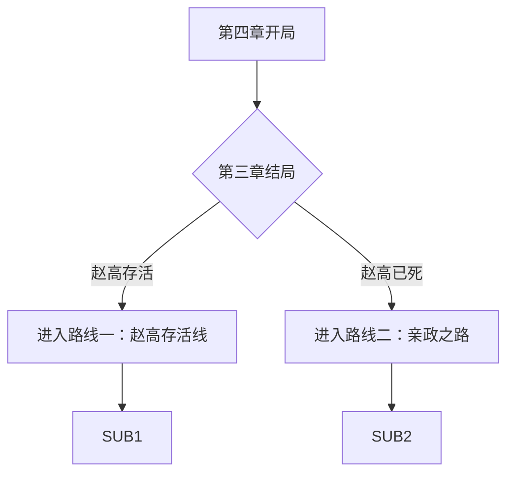
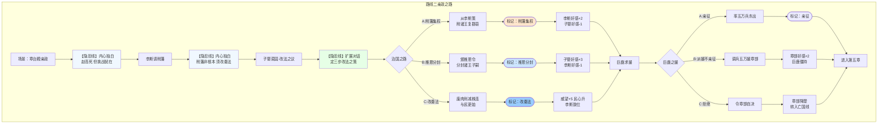

# 《胡亥模拟器》第四章：指鹿为马（隐忍线增改版）

## 【使用说明】

本剧本在主线第四章基础上进行增量创作。由于隐忍线在第三章可能出现**赵高已死**或**赵高存活**两种状态，本章剧本分为两条路线：

- **路线一：赵高存活线**——沿用主线“指鹿为马”框架，嵌入隐忍线专属内心独白、隐藏场景及扩展选项（反将一军、宫中刺杀详细剧情）。
- **路线二：赵高已死线**——全新剧本“亲政之路”，胡亥亲掌大权，面对李斯派系、蒙氏旧部、关东叛乱等复杂局面。

**加粗段落**为隐忍线专属新增内容，**以 `【若隐忍线】` 标注的段落**为内心独白/隐藏场景，**以 `【路线二：亲政之路】` 标注的段落**为赵高已死时的替代剧情。

## 【前情回顾】

*画面淡入，黑底白字浮现*

**公元前208年，秋。**

**关东烽火遍地。章邯苦战于定陶。**

**李斯已死。冯去疾被黜。朝中再无人敢与赵高抗衡。**

**胡亥坐在咸阳宫的御座上，发现自己的手，已经很久没有碰过玉玺了。**

**所有的奏章，都先经过赵高。所有的诏书，都出自赵高之手。**

**他是皇帝。**

**但咸阳宫里每一个人都知道——真正说了算的，是郎中令。**

**【若隐忍线·字幕追加（赵高存活）】**

**“但在无人看见的密室里，胡亥的秘密记录已经写满了五卷竹简。”**

**“禁卫中，公孙季、杨喜等眼线已经悄然渗透到赵高党羽的周围。”**

**“子婴的菜园里，冬菜已经收了一茬，新翻的泥土等着下一季的种子。”**

**“他还在等。等一个让赵高万劫不复的时机。”**

**【若隐忍线·字幕追加（赵高已死）】**

**“赵高已死。胡亥亲政。”**

**“但大秦的敌人还在。关东还在反，章邯还在苦战，黔首还在怨恨。”**

**“李斯依旧坐在丞相的位置上，目光深沉，难以捉摸。”**

**“赵高只是第一条毒蛇，不是最后一条。”**

**“真正的仗，才刚刚开始。”**

## 【路线一：赵高存活线】

*（以下内容在赵高存活时触发。若第三章未选择“借机除掉赵高”或选项C失败，则进入此线。）*

### 【场景一：咸阳宫·章台殿】

*这一日，朝会。*

*你坐在御座上，冕旒垂在眼前，将殿中群臣的面孔分割成无数碎片。你看不清他们的表情，也懒得去看。*

*朝会的内容一如既往——关东的战报、各郡的钱粮、刑狱的奏谳。所有的奏报都由赵高代为宣读，所有的处置都由赵高代为拟定。你只需要点头。*

*点头。点头。再点头。*

*你觉得自己像一个泥塑的木偶。*

*然后，殿外传来一阵骚动。*

*你抬起头。*

*赵高从殿门走进来。他没有穿朝服，而是一身便装，面带微笑。他的身后，跟着两个宦官，牵着一头鹿。*

*一头鹿。*

*鹿角分叉，皮毛棕黄，四蹄踏在大殿的地砖上，发出清脆的嗒嗒声。它不安地转动着头颅，黑亮的眼睛里倒映着满朝文武惊愕的面孔。*

*殿中鸦雀无声。*

*赵高牵着鹿，缓步走到大殿中央。他向你和群臣躬身行礼，脸上依旧是那副恭谨温顺的笑容。*

**赵高**：“陛下。臣偶得一匹千里马，特来进献。”

*千里马。*

*他说那是一匹千里马。*

*你看着那头鹿。鹿角分叉，皮毛棕黄，温顺而惶恐地站在大殿中央。所有人都知道那是一头鹿。赵高也知道那是一头鹿。*

*但他还是说，这是马。*

*殿中死一般的寂静。*

*群臣的目光在你和赵高之间游移。没有人敢说话。没有人敢笑。甚至没有人敢呼吸。*

*你坐在御座上，忽然感到一阵彻骨的寒意。*

*这不是献马。*

*这是试探。*

*赵高在问所有人——在这座大殿里，谁是说了算的人？*

*如果群臣跟着他说这是马，那他们效忠的就不是你，而是他。*
*如果你说这是鹿，那你就是在公开挑战他的权威。*

*他在逼你做出选择。*

*在这满朝文武面前。*

*在这咸阳宫的大殿上。*

**【若隐忍线·内心独白】**

*你看着那头鹿，看着赵高，看着满朝文武惊恐或谄媚的面孔，心中却出奇地冷静。*

*赵高终于亮出了他的刀。他不再满足于在幕后操控，他要当着所有人的面证明——这座咸阳宫里，他说了算。*

*你等这一刻，等了两年。*

*你曾在密室里写下他的每一条罪行，在禁卫中安插你的眼线，在宗室中寻找你的盟友。你做这一切，不是为了永远做他的傀儡。你是为了今天——当他亮出刀的时候，你也有刀可亮。*

*你的手在袖中握紧，指节发白。但你的脸上没有任何表情。*

*你知道，接下来的每一个字，都将决定你的生死。*

*赵高微笑着看着你。他的眼睛像两口深井，看不到底。*

**赵高**：“陛下。此马日行千里，夜行八百，乃稀世良驹。请陛下鉴赏。”

*他顿了顿，缓缓扫视殿中群臣。*

**赵高**：“诸位同僚以为如何？这是马，还是鹿？”

*沉默。*

*沉默像一块巨石，压在每个人的胸口。*

*终于，有人开口了。*

*是少府的一名属官。他低着头，声音发颤。*

**属官甲**：“……是、是马。丞相所献，自然是千里马。”

*赵高满意地点了点头。*

*然后是第二个。第三个。*

*“是马。”*
*“确是良马。”*
*“丞相慧眼，此马非凡品。”*

*一个接一个。声音此起彼伏。*

*也有几个人没有开口。他们低着头，脸色苍白，一言不发。你把他们的面孔记在心里——那些是没有跟着赵高说“马”的人。*

**【若隐忍线·内心独白】**

*你默默记下那些没有开口的人。不多，寥寥十几个。*

*御史大夫德。廷尉姚。少府属官某。还有公子婴——他站在宗室队列的最末尾，神色平静如水，仿佛这一切与他无关。但你知道，他和你一样，在等。*

*这十几个人，就是你在这座朝堂上所有的、可能还忠于你的人。*

*十几个。对赵高的满朝党羽。*

*但够了。有，就比没有强。*

*最后，赵高转向你。*

**赵高**：“陛下？”

*满朝文武的目光都落在你身上。*

*你坐在御座上，冕旒的玉珠在你眼前微微晃动。那头鹿站在大殿中央，黑亮的眼睛望着你，仿佛在等待什么。*

*你必须回答。*

### ★ 核心选择节点一：指鹿为马 ★

**选项A：坚持说是鹿**

*你深吸一口气。*

*你忽然觉得受够了。受够了点头，受够了沉默，受够了做一个泥塑木偶。你是皇帝。你是始皇帝的儿子。你不能在一头鹿面前低头。*

**胡亥**：（声音不大，但很清晰）“赵高。这是鹿。”

*殿中空气骤然凝固。*

*赵高的笑容没有消失，但他的眼睛变了。那双深井般的眼睛里，有什么东西正在凝结——是冰，是刀，是被触怒的蛇。*

**赵高**：（语气不变）“陛下说笑了。此马……”

**胡亥**：（打断）“朕说，这是鹿。”

*你站起身，居高临下地看着他。冕旒的玉珠哗啦作响。*

**胡亥**：“朕自幼长于宫中，随父皇游猎无数次。鹿和马，朕还是分得清的。赵卿，你今日牵鹿上殿，指鹿为马——你是觉得朕瞎了，还是觉得满朝文武都瞎了？”

*赵高沉默了一瞬。然后，他缓缓跪下。*

**赵高**：“陛下息怒。臣老眼昏花，或许看错了。既然陛下说是鹿，那便是鹿。”

*他的声音平静，甚至带着一丝恭顺。但你看到了——他跪下时，手指在袖中攥紧，指节发白。*

*退朝后，群臣鱼贯而出。没有人敢看你，也没有人敢看赵高。大殿空了，只剩下你一个人坐在御座上。*

*你赢了。*

*你在满朝文武面前挫败了赵高的气焰。你说这是鹿，于是这就是鹿。*

*但你也知道，从这一刻起，赵高再也不会给你任何机会了。*

*（隐藏数值变化：威望值+2。赵高好感度归零，转为【死敌】状态。获得关键标记【指鹿为鹿】。恐惧值-1。后续章节中，赵高将加速政变准备，你需要尽快收拢权力、争取盟友，否则望夷宫之变将提前触发。）*

**【若隐忍线·内心独白】**

*你赢了这一局。但你心中没有喜悦，只有更深的警惕。*

*赵高今天输了面子，但他没有输掉实力。禁卫还在他手里，少府还在他手里，郎中令还在他手里。他今天跪下了，明天就会站起来，用更凶狠的方式报复。*

*你必须在他动手之前，先动手。*

*退朝后，你没有回寝殿。你径直走进密室，在秘密记录的竹简上添了一行字——“赵高指鹿为马，当众欺君。朕斥之为鹿，赵高阳奉阴违，怀恨在心。”*

*你放下笔，看着自己写下的字。赵高的罪证又多了一条。但这些罪证，什么时候才能用上？*

*你不知道。但你知道，那一天越来越近了。*

**选项B：违心说是马**

*你看着那头鹿。鹿角分叉，皮毛棕黄。它不安地刨着蹄子，发出嗒嗒的声响。*

*那是鹿。你知道那是鹿。*

*但你也知道，如果你说那是鹿，今天你可能走不出这座大殿。*

*赵高既然敢牵鹿上殿，他就一定做好了万全的准备。禁卫是他的人，郎中令是他的人，少府是他的人。你身边，还有谁？*

*你垂下眼睛。*

**胡亥**：（声音很低）“确是良马。丞相有心了。”

*赵高脸上的笑容扩大了。*

**赵高**：“陛下圣明。”

*他转向群臣，声音高亢。*

**赵高**：“陛下金口玉言，此乃千里马。诸位可都听清了？”

*群臣纷纷附和。那几个刚才没有开口的人，此刻面色如土。*

*退朝后，你独自坐在御座上。大殿空旷，只有那头鹿留下的几粒粪便，还在地上。*

*你看着那些粪便，忽然想笑。*

*你是皇帝。*

*但你连一头鹿都不敢认。*

*（隐藏数值变化：恐惧值+2。威望值-2。赵高好感度+1。获得关键标记【指鹿为马】。朝中群臣尽附赵高，你彻底沦为傀儡。锁死HE“明君逆袭”“傀儡翻身”。后续章节中，反抗赵高的难度极大提升。）*

**【若隐忍线·内心独白】**

*你说了“是马”。你屈服了。*

*你看着赵高得意的笑容，看着群臣如释重负的表情，看着那头被牵走的鹿。你心中没有愤怒，只有一种冰冷的清醒。*

*你今天屈服了。但你的屈服，是有目的的。*

*你要让赵高以为你彻底怕了，彻底认命了。你要让他放松警惕，让他以为你永远不会反抗。然后，在他最意想不到的时候，把刀捅进他的心脏。*

*你回到密室，在竹简上添了一行字——“赵高指鹿为马，当众欺君。朕隐忍不发，以骄其志。”*

*你放下笔。烛火将你的影子投在墙上。*

*忍。继续忍。忍到他露出最大破绽的那一天。*

*（隐藏数值变化：权谋值+2。赵高对你的警惕度略微下降——他认为你已经彻底屈服。）*

**选项C：反将一军**

*（此选项需序章选择C“隐忍待发”且权谋值≥3，或第三章成功保下李斯/冯去疾等大臣，积累了足够的朝堂势力。若不满足条件，此选项为灰色不可选。）*

*你看着那头鹿，看着赵高，看着满朝文武。*

*然后，你笑了。*

**胡亥**：“哦？丞相说这是千里马？”

*赵高微微一愣。他没想到你会笑。*

**赵高**：“正是。陛下请看此马——”

**胡亥**：（打断）“既然是千里马，想必日行千里、夜行八百。丞相为朕寻得如此良驹，朕心甚慰。”

*你站起身，缓步走下御阶。群臣纷纷避让，为你让出一条路。*

*你走到那头鹿面前，伸手摸了摸它的角。鹿不安地甩了甩头，但没有躲开。*

**胡亥**：“既然是千里马，朕便赐丞相一桩荣耀。”

*你转过身，看着赵高。*

**胡亥**：“请丞相骑上这匹‘千里马’，绕殿一周，让朕与诸位爱卿一睹良驹风采。”

*殿中死寂。*

*赵高的笑容僵住了。*

*骑鹿。绕殿一周。*

*如果他骑了，他就是承认自己是个笑话。如果他不骑，他就是当众承认这不是马。*

*皮球被你踢回了他脚下。*

*赵高看着你，你也看着他。殿中群臣屏息凝神，等着看这一局谁赢谁输。*

*沉默漫长得像一个世纪。*

*最后，赵高缓缓跪下。*

**赵高**：“……臣老迈，腿脚不便，恐难乘马。此马……或许是臣看错了。或许……是鹿。”

*你点点头，面不改色。*

**胡亥**：“原来是丞相看错了。无妨。丞相为国操劳，眼花也是常事。来人，赐丞相参汤一盏，补补眼睛。”

*群臣中，有人忍不住发出一声极轻的笑。随即死死捂住嘴。*

*赵高伏在地上，额头抵着地砖。你看不到他的表情，但你能看到他后颈的肌肉在微微跳动。*

*退朝后，公子婴在殿外等你。*

**子婴**：（低声）“陛下今日这一手，漂亮。但赵高不会善罢甘休。”

**胡亥**：“朕知道。”

**子婴**：“陛下打算怎么办？”

*你沉默片刻。*

**胡亥**：“他亮刀了。朕也得亮。”

*（隐藏数值变化：威望值+3。赵高好感度-2。获得关键标记【反将一军】。恐惧值-1。后续解锁“智斗赵高”剧情线。赵高对你的敌意达到顶峰，但他也会变得更加谨慎——他意识到你不是一个可以随意摆布的傀儡。）*

**【若隐忍线·隐藏扩展——反将一军后的密议】**

*（此场景在选项C触发后，紧随退朝剧情。）*

*当夜。密室。*

*子婴如约而来。他走进密室时，神色比往日更加凝重。*

**子婴**：“陛下。今日朝堂之上，陛下挫败了赵高的气焰。但臣收到消息——赵高回府后，摔碎了三个酒爵。”

**胡亥**：“他怒了。”

**子婴**：“不止是怒。他怕了。他没想到陛下敢在满朝文武面前反将他一军。他意识到，陛下不是他可以随意摆布的傀儡。”

*你沉默了一瞬。*

**胡亥**：“叔父。赵高接下来会怎么做？”

**子婴**：“他会加快动手。指鹿为马，本是他的试探。试探的结果出乎他的意料。他不会再试探了——下一次，他会直接动手。”

*你握紧了拳头。*

**胡亥**：“朕还有多少时间？”

**子婴**：“短则一月，长则三月。”

*他顿了顿。*

**子婴**：“陛下。臣之前说的三策，必须提前了。”

*你点了点头。烛火在你的瞳孔里跳动。*

**胡亥**：“叔父。三策之中，你觉得哪一策最可行？”

*子婴沉默了很久。*

**子婴**：“密诏章邯回师，远水难救近火。离京出巡，等于将咸阳拱手让给赵高。臣以为……唯有下策。”

*你看着他。*

**胡亥**：“宫中刺杀。”

**子婴**：“是。”

*他从袖中取出那张帛书，摊在案上。三个名字——公孙季、杨喜、少府厨令赵某。*

**子婴**：“这三人，臣已接触妥当。公孙季是郎中令属官，可策应内应。杨喜是卫尉属吏，可调开赵高亲卫。赵某是少府厨令，赵高每日饮用的羹汤必经其手。”

*他指着第三个名字。*

**子婴**：“毒，从这里下。”

*你看着那张帛书，手指微微发抖。不是因为恐惧，是因为这一天终于来了。*

**胡亥**：“几分把握？”

**子婴**：“若一切顺利，三分。若赵高提前察觉……一分都没有。”

*三分。七分是死。*

*你闭上眼睛。然后睁开。*

**胡亥**：“够了。安排。”

*子婴深深叩首。*

**子婴**：“陛下……保重。”

*（隐藏数值变化：权谋值+2。子婴好感度+1。获得关键标记【刺杀准备】。后续“宫中刺杀”选项成功率微幅提升。）*

### 【场景二：咸阳宫·寝殿·夜】

*指鹿为马事件后，你连续数夜无法安眠。*

*无论你在大殿上做出了什么选择，有一件事是确定的——赵高已经亮出了他的刀。他不再满足于做幕后之人，他要在满朝文武面前证明，这座咸阳宫里，他说了算。*

*你坐在寝殿里，烛火摇曳。案上摊着一份你命人秘密整理的名单。*

*上面记录着指鹿为马那天，每一个开口说“是马”的官员的名字。密密麻麻，写满了大半卷竹简。*

*还有一列很短的名字——那些没有开口的人。*

*你提起笔，在“没有开口”的那一列最上方，写下了一个名字：公子婴。*

*然后你又写了几个名字。御史大夫德。廷尉姚。少府属官某。名字不多，寥寥十几个。*

*这就是你在朝中所有的、可能还忠于你的人。*

*十几个。对赵高的满朝党羽。*

*你放下笔。烛火跳了跳。*

*你忽然想起父皇。父皇在位时，朝中可有人敢这样对他？蒙恬、蒙毅、李斯、冯去疾、王翦、王贲……哪一个不是当世人杰？他们跪在父皇面前，没有一个敢抬头。*

*可现在呢？*

*那些人死的死，黜的黜。剩下的，都跪在赵高面前。*

*你闭上眼睛。*

*你终于明白了父皇说的那句话——皇帝是一把刀。你要么永远锋利，要么被别人折断。*

*你现在这把刀，已经卷刃了。*

**【若隐忍线·内心独白】**

*但你还没有断。*

*你睁开眼睛，将那份名单重新卷起，收入密室的暗格中。与秘密记录的竹简放在一起。*

*十几个忠于你的人。不多。但够用了。*

*公孙季在郎中令属下，杨喜在卫尉署，少府厨令赵某在赵高的饮食上。子婴在宫外，替你联络蒙氏旧部和宗室可用之人。你自己，坐在这座寝殿里，扮演着一个顺从的傀儡。*

*每一个人，都是一枚棋子。*

*你在等。等一个能把所有棋子同时落下的时机。*

*殿门被轻轻推开。一个宦官端着羹汤走进来。*

*你抬头，认出他是韩谈——那个曾被刺客顶替过的老宦官。刺客事件后，你将他调回了身边。他是在这座宫里，你为数不多还信得过的人。*

**韩谈**：（低声）“陛下，公子婴求见。”

*你微微一怔。*

**胡亥**：“这么晚了……让他进来。”

*子婴走进寝殿时，穿着一身深色便服，外面罩着一件带兜帽的斗篷。他将兜帽掀开，露出一张平静而苍老的面孔。*

**子婴**：（行礼）“陛下。”

**胡亥**：“叔父深夜入宫，所为何事？”

*子婴没有立刻回答。他从袖中取出一卷竹简，双手呈上。*

**子婴**：“陛下前日命臣留意禁卫轮值。这是臣查到的。”

*你接过竹简，展开。*

*上面是禁卫的轮值表。每一班的将领姓名、士兵来源、换防时间，清清楚楚。但最让你心惊的，是子婴用朱笔圈出的几个名字。*

*卫尉竭。郎中令属官阎乐。少府属官某……*

*每一个被圈出的名字旁边，都有小字标注——“赵高姻亲”“赵高故吏”“受赵高厚赂”。*

*你一行一行看下去，越看越觉得手冷。*

*禁卫十二屯，有八屯的将领是赵高的人。郎中令所属的郎官，十之六七是赵高提拔的。*

*这座咸阳宫，从上到下，已经被赵高渗透成了筛子。*

**子婴**：（低声）“陛下。赵高若想动手，只需一声令下。陛下的寝殿，撑不过半个时辰。”

*你放下竹简，沉默了很久。*

**胡亥**：“……叔父有什么办法？”

*子婴抬起头，那双平静如深水的眼睛里，第一次露出了某种锐利的东西。*

**子婴**：“陛下若要破局，唯有三策。”

*他伸出一根手指。*

**子婴**：“上策。陛下密诏章邯回师咸阳，以平叛之名，清洗赵高党羽。章邯手握重兵，且对陛下忠心。只要他回来，赵高便不足为惧。”

*他伸出第二根手指。*

**子婴**：“中策。陛下以出巡之名离开咸阳，前往雍城或栎阳旧都，摆脱赵高控制。然后以皇帝的名义，号召天下兵马勤王。赵高在咸阳势力虽大，但出了咸阳，他便鞭长莫及。”

*他伸出第三根手指。*

**子婴**：“下策。陛下在宫中动手，刺杀赵高。臣已在禁卫中物色了几个可用之人，虽不多，但若出其不意，或可一击得手。只是此策风险极大，一旦失败，陛下将万劫不复。”

*他放下手，静静地看着你。*

**子婴**：“三策各有利弊。请陛下圣断。”

*烛火跳动。你的影子在墙壁上晃动，像一个困在笼中的兽。*

*章邯远在定陶，调他回师，关东战局必然崩坏。*
*离开咸阳，等于将都城拱手让给赵高。*
*在宫中动手，一旦失败，你连逃的机会都没有。*

*三个选择，没有一个是安全的。*

*但你必须选一个。*

**【若隐忍线·内心独白】**

*你看着子婴，心中忽然涌起一种奇异的感觉。*

*这三策，子婴一定已经想了很久。上策、中策、下策——他把所有的路都摆在你面前，让你自己选。*

*你不是一个人在面对赵高。子婴在帮你。公孙季、杨喜、赵某在帮你。那十几个没有在朝堂上说“马”的臣子，也在用他们的沉默帮你。*

*你不再是一年前那个独自在密室里写罪证的孤独皇帝了。*

*你有一张网。虽然还不够大，但已经可以捕蛇了。*

### ★ 核心选择节点二：破局之策 ★

**选项A：密诏章邯回师（上策）**

*你沉默良久，最终开口。*

**胡亥**：“拟密诏。令章邯留一部守定陶，自率精锐回师咸阳，就说……入卫京师。”

*子婴点头。*

**子婴**：“陛下圣断。只是密诏送出，需避过赵高耳目。臣有一计。”

*他从袖中取出一块小小的竹符。*

**子婴**：“这是臣从旧都雍城寻来的先帝旧物。陛下将此符一分为二，一半随密诏送出，章邯见符如见陛下。另一半陛下自留。赵高纵使截获密诏，无此符，章邯也不会信。”

*你接过竹符。那是一块已经泛黄的竹片，上面刻着一个你熟悉的字迹——“政”。*

*是父皇的字。*

*你的手指摩挲着那个字，忽然觉得眼眶发热。*

**胡亥**：“……叔父，朕能信章邯吗？”

**子婴**：“章邯是陛下提拔的。赵高曾多次进谗，欲夺章邯兵权，是陛下保住了他。这份恩情，章邯记得。”

*他顿了顿。*

**子婴**：“而且，章邯是聪明人。他知道，如果赵高得势，他就算打赢了关东所有的仗，也逃不过兔死狗烹的下场。他的命，和陛下的命，已经绑在一起了。”

*你点点头。*

**胡亥**：“密诏今夜送出。”

*子婴躬身。*

**子婴**：“臣，领旨。”

*他退出殿外，兜帽重新遮住面容，消失在夜色中。*

*你独自坐在寝殿里，握着那半块竹符。上面父皇的字迹在烛光中明明暗暗。*

*父亲。保佑我。*

*（隐藏数值变化：子婴好感度+2。获得关键标记【密诏章邯】。后续章节解锁“章邯回师”剧情线。但关东战局将因章邯分兵而恶化，你需要在这段时间内独自应对赵高。）*

**【若隐忍线·隐藏扩展】**

*子婴走后，你走进密室。*

*你从暗格中取出那几卷秘密记录的竹简。赵高的罪证。你的记录。*

*你犹豫了一瞬，然后从中抽出一卷——上面记录着赵高自沙丘以来隐匿军情、阻挠章邯援军的全部罪行。你将这一卷单独包好，塞入怀中。*

*如果章邯回师，如果赵高伏诛，这一卷竹简，就是给章邯的交代。你要让他知道——不是朕不给你援军，是赵高扣下了朕的诏书。*

*你要让他恨的人，是赵高。不是你。*

**选项B：离京出巡（中策）**

*你沉思片刻，缓缓摇头。*

**胡亥**：“调章邯回师，关东必崩。朕不能为了除掉赵高，把大秦的江山葬送了。”

*子婴沉默。*

**胡亥**：“朕选第二策。出巡。”

**子婴**：“陛下打算以何为名？”

**胡亥**：“……祭祖。朕即位以来，尚未拜谒雍城祖庙。此乃大不孝。赵高没有理由阻拦。”

*子婴点头。*

**子婴**：“雍城距咸阳三百里。陛下车驾出城后，赵高便无法控制陛下。但陛下需知——一旦离开咸阳，便是与赵高公开决裂。他会不惜一切代价阻止陛下回京。”

**胡亥**：“朕知道。”

*你站起身，走到窗前。夜色中的咸阳宫层层叠叠，像一头匍匐的巨兽。*

**胡亥**：“叔父。替朕安排。三日后，朕便出发。”

**子婴**：“臣领旨。只是……”

*他犹豫了一下。*

**子婴**：“陛下出巡，需要扈从。禁卫虽多为赵高所控，但尚有一支可用。”

**胡亥**：“哪一支？”

**子婴**：“郎中令属下的郎官中，有数十人是蒙毅旧部。蒙毅死后，他们被赵高打压，不得升迁，心中怨愤。臣已与他们接触，他们愿为陛下效死。”

*你转过身，看着他。*

**胡亥**：“蒙毅的旧部……”

*你想起第一章里，你选择了处死蒙毅。那些人恨你吗？还是恨赵高更多？*

**子婴**：（似乎看穿了你的心思）“陛下。他们恨的是赵高。因为杀蒙毅的诏书，是赵高拟的。”

*你沉默片刻。*

**胡亥**：“……可用。”

*（隐藏数值变化：子婴好感度+2。获得关键标记【离京出巡】。后续解锁“雍城对决”剧情线。你将离开咸阳，在雍城与赵高展开一场远程博弈。）*

**【若隐忍线·隐藏扩展】**

*子婴退出后，你独自坐在寝殿中，忽然想起一个人——公孙季。*

*公孙季是郎中令属官，蒙毅旧部，也是你通过子婴安插在禁卫中的眼线。他恰好就在蒙毅旧部之中。*

*你心中涌起一个念头。你提起笔，写了一张极小的帛书，只有一行字——“随驾出巡。沿途留意赵高耳目。”*

*你将帛书交给韩谈，让他秘密转交公孙季。*

*赵高不会想到，他的禁卫之中，有你的眼睛。*

**选项C：宫中刺杀（下策）**

*（此选项主线为“需子婴好感度≥4”。隐忍线专属扩展：若已获得【刺杀准备】标记，此处增加详细执行剧情。）*

*你看着子婴，忽然问了一个问题。*

**胡亥**：“叔父方才说，已物色了几个可用之人。是谁？”

*子婴从袖中取出一张极小的帛书，递给你。*

**子婴**：“三人。郎中令属官公孙季，卫尉属吏杨喜，少府厨令赵某。”

*你看着这三个名字。*

**胡亥**：“厨令？”

**子婴**：“赵高每日饮用的羹汤，必经少府厨令之手。”

*你明白了。*

**胡亥**：“……毒？”

*子婴没有说话，只是静静地看着你。*

*毒杀赵高。在宫中。在赵高最意想不到的地方。*

*你握着那张帛书，手指微微发抖。不是因为恐惧，而是因为……这个计划，让你想起了一个人。*

*父皇。*

*父皇当年除掉嫪毐，也是先发制人，在蕲年宫设伏，一战而定。*

*你现在做的，和父皇当年做的，一模一样。*

**胡亥**：（低声）“叔父有几分把握？”

**子婴**：“三分。”

*三分。*

*七分是死。*

*你闭上眼睛。片刻后，睁开。*

**胡亥**：“够了。安排。”

*子婴深深叩首。*

**子婴**：“陛下……保重。”

*他退出殿外。烛火摇动，将他的影子拉得很长。*

*你独自坐在寝殿中，握着那张帛书。三分把握。七分是死。*

*但总比零分好。*

*（隐藏数值变化：子婴好感度+3。获得关键标记【宫中刺杀】。后续解锁“下毒”剧情线。此路线风险极高，一旦失败直接进入BE结局；若成功，则赵高死亡，你可重掌大权。此选项仅当子婴好感度≥4时可选。）*

**【若隐忍线·专属扩展——宫中刺杀详细执行】**

*（此场景在选项C触发后，若已获得【刺杀准备】标记，则解锁详细剧情。玩家可选择具体执行方案。）*

*子婴走后，你独自坐在密室中，将整个计划在脑中推演了一遍又一遍。*

*三日后，子婴再次入宫，带来了详细的执行方案。*

**子婴**：“陛下。刺杀赵高，有三个环节。”

*他伸出一根手指。*

**子婴**：“其一，调虎离山。赵高的贴身护卫，由他的女婿阎乐统领。臣已安排杨喜，在动手之日，以卫尉署临时调防为名，将阎乐及其亲信调离赵高身边。时间窗口，最多半个时辰。”*

*他伸出第二根手指。*

**子婴**：“其二，下毒。少府厨令赵某，会在赵高当日饮用的羹汤中投入剧毒之药。此药发作极快，半盏茶内便可见效。但赵高饮食之前，有专人试毒。赵某需在试毒之后、赵高饮用之前的瞬间投药——这需要极高的技巧和运气。”*

*他伸出第三根手指。*

**子婴**：“其三，策应。若赵高察觉有异，或毒药未能当场毙命，公孙季会率数名心腹郎官，以‘护驾’为名冲入，补刀斩杀赵高。但公孙季一旦动手，便是公然兵变，再无回头之路。”*

*你听完，沉默了很久。*

**胡亥**：“试毒之后、饮用之前……那片刻之间，赵某如何投药？”

**子婴**：“赵某说，赵高饮羹，必先用银匙搅动三下，待温度适宜，方才入口。搅动之时，赵某会以‘呈递羹汤’为名靠近，在赵高视线被银匙遮挡的瞬间，将藏在指甲中的毒药弹入汤中。”

*你心中一凛。*

**胡亥**：“若赵高那一日不用银匙，或不搅动呢？”

*子婴沉默了一瞬。*

**子婴**：“那便失败。”

*你握紧了拳头。三分把握。这三分，原来有这么多变数。*

**胡亥**：“叔父。能不能换一种毒？慢性之毒，数日后发作，不易追查。”

**子婴**：“臣也曾想过。但慢性之毒，赵高若在发作前察觉，或发作时不在宫中，便功亏一篑。剧毒虽险，但当场毙命，可一举定乾坤。”

*你闭上眼睛。片刻后，睁开。*

**胡亥**：“什么时候动手？”

**子婴**：“三日后。赵高每逢单日，必在府中饮羹。那一日，杨喜当值，可调开阎乐。公孙季休沐，可率人潜伏。赵某轮值少府厨房。天时、地利、人和，皆在那一天。”

*你点了点头。*

**胡亥**：“安排。”

*子婴叩首，退出密室。*

*你独自坐在烛火前，忽然想起沙丘那个夜晚。赵高问你——公子可想做皇帝？你点了头。然后你用了两年时间，等来了今天。*

*三天后，要么赵高死，要么你死。*

*（隐藏数值变化：权谋值+3。获得关键标记【刺杀执行】。后续刺杀成功与否，由权谋值、子婴好感度、赵高警惕度综合判定。）*

### 【场景三：关东战报·巨鹿】

*无论你在咸阳宫中如何运筹帷幄，关东的战火不会等你。*

*定陶之战后，章邯的军报一封接一封送入咸阳。*

*——若你在第三章选择全力增援章邯，项梁已死于定陶。章邯乘胜东进，围困赵王歇于巨鹿。楚军以宋义为上将军、项羽为次将，北上救赵。宋义畏战不前，被项羽斩杀。项羽率楚军渡漳水，破釜沉舟，直扑巨鹿。*

*——若你在第三章未全力增援，项梁未死，楚军兵锋更盛。章邯在定陶陷入苦战，巨鹿之围迟迟未合。*

*无论哪种情况，有一件事是相同的：*

*巨鹿。*

*这座赵国的旧城，正在成为决定大秦命运的地方。*

---

*章邯的求援信再次送入咸阳。*

*这一次，他的语气不再是请求，而是恳求。*

**章邯奏报**：“……项羽渡漳水，破釜沉舟，士卒皆以一当十。臣与王离合军，九战皆败。王离被虏，涉间自焚。臣退守棘原，收拢残兵。贼势浩大，臣独力难支。恳请陛下速发援兵，迟则大势去矣！”

*你握着这封军报，手指冰凉。*

*王离被虏。二十万长城军团覆灭。*

*那是大秦最后的主力。*

*赵高站在殿下，面色平静。*

**赵高**：“陛下，章邯作战不力，丧师辱国。臣请下诏切责，以正军法。”

*你抬起头，看着他。*

*你忽然很想问问他——援军呢？你扣下的那些援军呢？*

*但你问不出口。因为你已经知道了答案。*

**【若隐忍线·内心独白】**

*你握着章邯的求援奏报，心中涌起一股难以言说的情绪。*

*二十万长城军团。王离被虏。那是大秦最后的主力。章邯在巨鹿苦苦支撑，而赵高站在这里，还在说“切责”。*

*你忽然明白了子婴那句话——平叛靠章邯，但治天下，不能只靠章邯。*

*赵高不死，章邯必败。章邯一败，大秦必亡。*

*你必须尽快动手。*

### ★ 核心选择节点三：巨鹿之援 ★

*（此节点的可选范围，受第三章“章邯求援”选择及本章“破局之策”选择的双重影响。）*

**选项A：尽发关中兵，亲自东征**

*（此选项仅当你已除掉赵高或已离开咸阳时可选。若赵高仍在咸阳掌权，此选项为灰色。）*

*你放下军报，站起身。*

**胡亥**：“传朕旨意。尽发关中所有可用之兵，朕亲自东征。”

*殿中群臣哗然。*

*有人跪地劝谏——“陛下万乘之躯，不可亲临战阵！”*

*你没有理会。*

*你走下御阶，声音沉稳。*

**胡亥**：“巨鹿若败，章邯若亡，项羽下一步就是函谷关。函谷关一破，咸阳便再无屏障。到那时，朕坐在咸阳宫里等死吗？”

*群臣沉默。*

**胡亥**：“朕是秦国的天子。秦国的天子，从不畏战。”

*你转向子婴。*

**胡亥**：“叔父替朕坐镇咸阳。朕率师东征期间，咸阳一切事务，由叔父裁决。”

*子婴深深叩首。*

**子婴**：“臣……领旨。”

*三日后，你率关中最后的五万兵马，东出函谷关。*

*你不知道这一去是生是死。但你知道——与其在咸阳宫里等赵高杀你，不如死在战场上。*

*至少，那样更像父皇的儿子。*

*（隐藏数值变化：威望值+5。恐惧值归零。获得关键标记【亲征】。解锁HE“力挽狂澜”专属剧情线。后续章节将围绕巨鹿之战展开。）*

**【若隐忍线·内心独白（赵高已死时可选此选项）】**

*你选择了亲征。*

*不是因为你不怕死，是因为你知道——如果你不去，大秦就真的完了。章邯是名将，但他需要援军，需要粮草，需要一个皇帝站在他身后。*

*你去了。你带着关中最后的五万兵马，东出函谷关。*

*你不知道这一去是生是死。但你知道，从今天起，你不再是一个坐在咸阳宫里批奏章的皇帝。你是一个提剑上马、与士卒同生共死的皇帝。*

*这是父皇当年走过的路。你终于也走上了这条路。*

**选项B：派赵高出征监军**

*（此选项仅当赵高存活且你在“指鹿为马”中未与他彻底决裂时可选。）*

*你看着赵高，忽然有了一个念头。*

**胡亥**：“老师说得对。章邯作战不力，当派重臣监军。”

*赵高点头。*

**赵高**：“陛下圣明。臣举荐——”

**胡亥**：（打断）“朕意已决。就请老师亲自走一趟吧。”

*赵高的话噎在喉咙里。*

**胡亥**：“老师是先帝旧臣，深通兵法，又熟悉章邯。由老师去监军，朕最放心。”

*你的语气诚恳，表情真挚。*

*赵高看着你，你也看着他。*

*你知道他不想去。巨鹿前线兵凶战危，项羽的楚军悍勇无双。而且一旦他离开咸阳，他对朝堂的控制力就会像沙子一样从指缝间流走。*

*但他无法拒绝。因为你说的每一句话，都是他曾经用来堵别人嘴的。*

**赵高**：（沉默良久，终于叩首）“臣……领旨。”

*赵高以监军身份前往巨鹿。*

*一个月后，消息传回。*

*赵高到了前线，与章邯矛盾重重。他胡乱指挥，导致秦军连败。章邯多次上书请求召回赵高，但你把奏报全部压下。*

*让他在前线多待一阵。*

*咸阳的空气，终于清静了。*

*（隐藏数值变化：赵高好感度-1，章邯好感度-1。获得关键标记【赵高监军】。赵高离京期间，你可趁机调整禁卫、收拢朝权。但前线将帅不和，巨鹿战局将严重恶化。后续项羽击败章邯的几率大幅提升。）*

**【若隐忍线·隐藏扩展——赵高离京后的行动】**

*（此场景在选项B触发后自动插入。）*

*赵高离京的当夜，你在密室中召见了子婴。*

**胡亥**：“叔父。赵高走了。”

*子婴的眼中闪过一丝亮光。*

**子婴**：“陛下。这是天赐良机。”

**胡亥**：“朕知道。他走多久，朕不知道。但朕要在他回来之前，把咸阳变成朕的咸阳。”

*你从案上拿起一卷竹简，递给子婴。上面是禁卫、少府、郎中令三衙门的官员名单。赵高的党羽，你已经用朱笔圈出。*

**胡亥**：“这些人，朕要全部换掉。不能一次全换，分批换。先从禁卫中与赵高最亲近的将领开始。借口——巨鹿战事吃紧，禁卫需加强守备，调整轮值。”

*子婴接过竹简，仔细看过。*

**子婴**：“陛下。臣这就去安排。公孙季和杨喜，会以‘补缺’为名，安插到关键位置。”

*你点了点头。*

**胡亥**：“还有。章邯那边的求援奏报，朕这次要准。赵高不在，没人能卡朕的诏书。”

*你提起笔，在章邯的求援奏报上批了一个大大的“准”字。*

**胡亥**：“传朕旨意。令王离率长城军团十万，即刻南下，驰援章邯。”

*子婴看着你，眼中浮现出欣慰的神色。*

**子婴**：“陛下。您终于可以自己做主了。”

*你放下笔。烛火将你的影子投在墙上。*

*是的。赵高不在。这是你即位以来，第一次真正自己决定军国大事。*

*（隐藏数值变化：权谋值+3。获得关键标记【清洗赵党】【自主发兵】。章邯得到援军，巨鹿战局可能逆转。赵高党羽被逐步替换，赵高回京后将面对一个已经不属于他的咸阳。）*

**选项C：拒绝增援，坐观其变**

*你沉默了很久。最后，你放下军报。*

**胡亥**：“……关中之兵，需卫戍京师。不可轻动。”

*群臣沉默。*

*没有人劝谏。李斯死了，冯去疾黜了。剩下的，都是赵高的人。他们不会为章邯说话。*

*退朝后，子婴在殿外拦住你。*

**子婴**：（低声）“陛下，章邯若败，项羽必西进。咸阳无险可守。”

**胡亥**：“朕知道。”

**子婴**：“那陛下为何……”

*你停下脚步，看着他。*

**胡亥**：“叔父。朕能怎么办？关中兵，朕调得动吗？赵高不点头，朕连一个兵都调不出咸阳。”

*子婴沉默了。*

*你继续往前走，脚步沉重。*

*你知道你在做什么。你在眼睁睁看着章邯去死，看着大秦最后的精锐葬送在巨鹿。*

*但你没有办法。*

*你连自己都救不了，怎么救章邯？*

*（隐藏数值变化：恐惧值+2。威望值-2。获得关键标记【坐视章邯】。章邯好感度归零。巨鹿之战秦军必败，项羽将全歼秦军主力。锁死HE“力挽狂澜”“明君逆袭”。）*

**【若隐忍线·内心独白】**

*你没有发出援军。*

*不是因为你不信任章邯，是因为你现在还不能让赵高觉得你“失控”。赵高反对增援，你若是强行发出诏书，他会在其他事情上卡你——粮草、军械、后方补给。章邯就算得到了援军，也会被赵高从背后捅刀子。*

*你选择了退让。但你在密室的竹简上，添了一行字——“巨鹿之危，章邯求援，赵高阻之。朕不能发兵。”*

*将来有一天，如果章邯败了，如果追究责任，这卷竹简会告诉后人——不是朕的错。*

### 【场景四：望夷宫的阴影】

*公元前207年，初冬。*

*咸阳下了一场小雪。*

*你站在寝殿窗前，看着细雪落在宫阙的瓦片上，一层一层，无声无息。*

*巨鹿的消息还没有传回。但你已经有预感了。*

*章邯的军报断了。*

*最后一封军报是半个月前送到的，上面只有寥寥数语——“贼众我寡，援军不至。臣当以死报国。”*

*然后就没有了。*

*你每天派人去问赵高，有没有巨鹿的消息。赵高总是微笑着说，陛下不必忧虑，章邯将军正在苦战，不日必有捷报。*

*你知道他在骗你。*

*他也知道你知道他在骗你。*

*但你们谁都没有说破。*

---

*这一夜，韩谈忽然急匆匆走进寝殿。他的脸色白得像殿外的雪。*

**韩谈**：（声音发抖）“陛下……赵高……赵高派了他的女婿阎乐，率兵包围了望夷宫。”

*你转过头，看着他。*

*你没有惊慌。你甚至觉得有些释然。*

*终于来了。*

**胡亥**：“……有多少人？”

**韩谈**：“千余人。都是赵高的私兵。禁卫……没有动。”

*你点点头。禁卫没有动。意思是他们默许了赵高的行动。或者更准确地说，他们本就是赵高的人。*

**胡亥**：“子婴呢？”

**韩谈**：“公子婴的府邸也被围了。”

*你闭上眼睛。*

*窗外，雪越下越大。*

---

*殿门被撞开了。*

*寒风裹着雪花涌入。一个身材魁梧的将领大步走进来，身后跟着数十名全副武装的士卒。他的剑上还滴着血——那是殿外侍卫的血。*

*阎乐。赵高的女婿。*

*他看着你，目光冰冷，没有一丝敬畏。*

**阎乐**：“陛下。丞相有令，请陛下移驾。”

*你坐在御座上，看着他。*

**胡亥**：“丞相？赵高什么时候成了丞相？”

*阎乐没有回答。*

**胡亥**：“他要杀朕，对不对？”

*沉默。*

*你忽然笑了。不是苦笑，不是冷笑，是真的觉得好笑。*

**胡亥**：“朕做了三年皇帝。杀了兄长，杀了蒙恬，杀了李斯，杀了宗室。到头来，朕自己也要被杀了。”

*你站起身。*

**胡亥**：“赵高呢？让他亲自来见朕。”

**阎乐**：“丞相政务繁忙，无暇分身。请陛下移驾。”

*你看着他手中的剑。剑刃上的血已经快凝固了。*

*你忽然想起沙丘那个夜晚。赵高问你——公子可想做皇帝？*

*你点了头。*

*如果那一夜你没有点头，现在会是什么样子？*

*可惜，没有如果了。*

**【若隐忍线·内心独白（若已触发“宫中刺杀”且成功）】**

*（此段替代原“望夷宫的阴影”剧情。）*

*但你没有等到这一天。*

*因为在赵高动手之前，你先动了手。*

*三日前。少府厨房。赵某将藏在指甲中的剧毒弹入赵高的羹汤。赵高饮下，当场毙命。公孙季率人冲入，控制现场。杨喜带兵封锁赵高府邸，将阎乐等赵高党羽一网打尽。*

*你亲政了。*

*望夷宫的雪，没有落在你身上。*

### ★ 最终选择节点：望夷宫之变 ★

*（以下选项在赵高存活且未被除掉时触发。若赵高已死，则跳过此节点，直接进入第五章“亲政之路”结局分支。）*

**选项A：伏剑自刎**

*你看着阎乐手中的剑。*

**胡亥**：“……把剑给朕。”

*阎乐愣了一下。*

**胡亥**：（提高声音）“朕说，把剑给朕！朕是皇帝，轮不到你来杀！”

*阎乐犹豫片刻，将剑递了过来。*

*你接过剑。剑很重，比你想的重。剑刃上倒映着烛火，也倒映着你的面孔。*

*你看着剑刃上的自己。冕旒，玄衣，十二章纹。你是皇帝。*

*但你也只是一个二十一岁的年轻人。*

*你跪下来，面朝东方——那是上郡的方向，扶苏死去的方向。*

**胡亥**：（低声）“兄长。亥弟来了。”

*你举起剑。*

*剑光闪过。*

*烛火灭了。*

*（结局：TE·真实的二世）*

**【若隐忍线·内心独白】**

*你选择了自刎。*

*不是因为你不怕死，是因为你知道——你死了，赵高或许会放过子婴，放过那些曾经暗中帮助过你的人。*

*你活着，他们是你的软肋。你死了，他们就只是赵高眼中的蝼蚁，不值得他动手。*

*这是你最后能为他们做的事了。*

*剑光闪过时，你脑中最后浮现的，是密室里那几卷写满了赵高罪证的竹简。你没有烧掉它们。你希望有一天，有人能找到它们。*

**选项B：拼死抵抗**

*你猛地抓起案上的铜灯，砸向最近的士卒。*

**胡亥**：“来人！护驾！”

*韩谈从侧殿冲出，手持一柄短剑，挡在你身前。他是宦官，不会武艺，但他还是挡在了你身前。*

*阎乐冷笑。*

**阎乐**：“陛下何必徒增伤亡？”

*你没有回答。你从地上捡起一名死去侍卫的剑，握在手中。*

*剑柄上还带着死者的体温。*

*你举起剑，指向阎乐。*

**胡亥**：“朕是始皇帝的儿子。朕的命，不给你。”

*你冲了上去。*

*（战斗剧情触发。此线成败取决于此前积累的武力值、护卫忠诚度及子婴是否安排了援军。若战斗胜利，可逃出望夷宫；若失败，战死于乱军之中。）*

*（战斗失败→结局：BE·众叛亲离）*
*（战斗成功→转入逃亡线，后续可能达成HE·巴蜀之主/东渡沧海/北方之狼）*

**【若隐忍线·隐藏扩展（若已安插禁卫眼线且子婴安排援军）】**

*你冲向阎乐的那一刻，殿外忽然传来一阵喊杀声。*

*不是赵高的人。是公孙季和杨喜——他们带着你安插在禁卫中的眼线，从侧翼杀入望夷宫。阎乐的千余私兵腹背受敌，阵脚大乱。*

*你趁乱冲出大殿。韩谈在你身后倒下，你听到了他最后的呼喊——“陛下快走！”*

*你没有回头。*

*你逃出了望夷宫。身后是喊杀声，身前是咸阳城茫茫的雪夜。*

**选项C：设法出逃**

*（此选项需此前触发过“望夷宫密道”相关剧情——如蒙毅生前告知、子婴密报、或自己探查发现。若不满足条件，此选项为灰色。）*

*你没有犹豫。*

*你转身冲向寝殿深处。阎乐一愣，随即带兵追赶。*

*你推开书架，露出后面一道窄小的暗门。这是父皇留下的密道，从寝殿直通宫外。你从未走过，但你知道它存在。*

*韩谈在你身后关上暗门，用身体抵住。*

**韩谈**：（隔着门）“陛下快走！老奴挡住他们！”

**胡亥**：“韩谈——”

**韩谈**：“陛下！大秦不能没有陛下！走！”

*他的声音被门外的喊杀声淹没了。*

*你咬紧牙关，转身冲入黑暗的密道。身后，传来韩谈的惨呼声，然后是什么东西倒地的声音。*

*你没有回头。*

*密道又窄又黑，空气混浊。你不知道自己跑了多久，只知道肺像火烧一样疼。*

*终于，前方出现了一点光亮。*

*你推开尽头的暗门。冷风扑面。*

*你站在咸阳城外的一条干涸的水渠里。身后是咸阳城巍峨的城墙，城头灯火通明，隐约传来喊杀声。*

*你跪在雪地里，大口喘息。雪花落在你的头发上、肩膀上。*

*你逃出来了。*

*但你什么都不是了。*

*（转入逃亡线。后续剧情根据此前积累的势力、盟友不同，可导向HE·巴蜀之主/东渡沧海/北方之狼等结局。）*

**选项D：与赵高谈判**

*你看着阎乐，没有拔剑，也没有逃跑。*

**胡亥**：“朕要见赵高。”

*阎乐皱眉。*

**阎乐**：“丞相不会来。”

**胡亥**：“那就带朕去见他。他要的不就是朕的皇位吗？朕可以禅位。但朕要活着。”

*阎乐沉默片刻，挥了挥手。士卒们放下兵器。*

*你被带出了望夷宫。*

*在赵高的府邸，你见到了他。*

*他坐在案后，正在批阅奏章——你的奏章。他抬起头，看着你，面带微笑。*

**赵高**：“陛下来了。”

*他的语气，像在招呼一个老朋友。*

**胡亥**：“赵高。朕可以禅位。你来做皇帝，或者你立子婴。朕只要一条命。”

*赵高看着你，笑容不变。*

**赵高**：“陛下知道吗？臣侍奉先帝二十年，从未见过先帝向任何人低头。”

*他顿了顿。*

**赵高**：“陛下不是先帝。从来都不是。”

*你沉默了。*

**赵高**：“陛下放心。臣不会杀陛下。弑君之名，臣担不起。陛下只需下一道诏书——禅位于公子婴。然后，陛下就可以去雍城‘颐养天年’了。”

*你看着他，知道他说的“颐养天年”是什么意思。*

*但你没有办法。*

**胡亥**：“……拟诏。”

*（结局：TE·子婴的继承）*

## 【路线二：赵高已死线——亲政之路】

*（若第三章成功触发“借机除掉赵高”，则本章剧情替换为以下内容。原“指鹿为马”等赵高相关剧情不再触发。）*

### 【场景一：咸阳宫·章台殿·亲政】

*赵高已死。你亲政了。*

*即位的第三年，你终于真正坐上了这把御座。*

*但御座没有变暖。它和以前一样硬，一样冷。*

*殿下的群臣依旧是那些人。李斯站在文臣之首，须发皆白，面容枯瘦，但腰背挺得笔直。他的目光偶尔扫过你，像在评估什么。蒙毅旧部被召回了一些，填补赵高党羽留下的空缺。宗室中，子婴进位上卿，参赞朝政。*

*一切似乎都在变好。*

*但你知道，这只是开始。*

*赵高死了，但他的党羽还没有完全清洗干净。禁卫、少府、郎中令，这些关键衙门里，仍有许多赵高提拔的人。他们表面上臣服，心中未必没有怨恨。*

*李斯依旧是丞相。你保下了他，但他不会感激你。他只会觉得，你需要他。一旦他觉得你不需要他了，他就会成为第二个赵高。*

*关东还在反。章邯在巨鹿苦战，求援奏报一封接一封。你需要决定是否给他援军。*

*还有一件事，比这些都棘手——秦法。*

*子婴说得对。关东反的不是赵高，是秦法。你若不改秦法，就算平定了陈胜、项梁，还会有第三个、第四个陈胜。但改秦法，意味着触动整个大秦的根基。李斯会反对，法家一派会反对，那些靠秦法得势的官吏会反对。*

*你必须一步一步来。*

### 【场景二：咸阳宫·偏殿·李斯与推恩令】

*这一日，李斯求见。*

*他走进偏殿时，步履比往日更加缓慢。赵高死后，他似乎一下子老了十岁。但他的眼睛，依然锐利。*

**李斯**：（行礼）“陛下。老臣有一策，请陛下圣裁。”

**胡亥**：“丞相请讲。”

*李斯从袖中取出一卷竹简，双手呈上。*

**李斯**：“陛下。关东之乱，源于分封。先帝废分封、行郡县，天下归一。然陛下即位后，复行分封，裂土封王。今诸王或反或叛，郡国并行之制，已名存实亡。”

*他顿了顿。*

**李斯**：“老臣请陛下——下诏削藩。趁章邯平叛之机，收回诸王封地，彻底废除分封，复行郡县。”

*你接过竹简，展开。上面密密麻麻写着削藩的步骤、时限、兵力调配。*

*这是一份滴水不漏的计划。李斯不愧是李斯。*

*但你没有立刻回答。你想起子婴的话——“分封之弊，不在分封本身，在于封王无实权而生怨，有实权而坐大。”*

*你放下竹简。*

**胡亥**：“丞相。削藩之后呢？关东六国故地，谁来镇守？郡守郡尉？陈胜振臂一呼，郡兵根本压不住。”

*李斯沉默了一瞬。*

**李斯**：“陛下可派驻军。每郡设常备之兵，由咸阳直辖。”

**胡亥**：“钱粮从何而来？”

*李斯语塞。*

*你知道他答不上来。关东已残破，赋税收不上来。关中的钱粮要供养咸阳、要支撑章邯的大军、要修阿房宫和骊山陵。再养一支遍布关东的常备军，国库根本撑不住。*

**胡亥**：“丞相。削藩之事，容朕三思。”

*李斯抬起头，看了你一眼。那一眼里，有失望，有不解，还有一丝你读不懂的东西。*

**李斯**：“……臣，告退。”

*他退出偏殿。你看着他的背影，忽然觉得这个老人，正在离你越来越远。*

**【若隐忍线·内心独白】**

*你没有答应李斯。不是因为你不认同削藩，是因为你知道——削藩解决不了根本问题。*

*关东反的是秦法，不是分封。你不改秦法，就算把诸王全部削掉，黔首还是会反。郡守郡尉和封王一样，都会变成压在他们头上的石头。*

*你需要一个更根本的办法。*

*你想起子婴菜园里那棵干枯的菜根。“陛下若是只想拔叶子，叶子是拔不完的。”*

*改秦法。那是根。*

### 【场景三：公子婴的菜园·改法之议】

*当夜。你微服来到子婴的菜园。*

*子婴正蹲在地里，借着月光侍弄他的冬菜。听到脚步声，他没有回头。*

**子婴**：“陛下来了。”

*你在他身边蹲下。月光下，菜苗的影子细细碎碎。*

**胡亥**：“叔父。李斯今日来见朕，请朕削藩。”

*子婴手上的动作顿了顿。*

**子婴**：“陛下怎么回的？”

**胡亥**：“朕说，容朕三思。”

*子婴点了点头。*

**子婴**：“陛下做得对。削藩是急事，但不是根本。”

*他拔起一棵菜苗，看了看根，又埋回去。*

**子婴**：“陛下还记得臣说过的话吗？种菜不能只拔叶子，得松土、浇水、施肥。”

**胡亥**：“朕记得。叔父说的，是改秦法。”

*子婴抬起头，月光照在他苍老的面容上。*

**子婴**：“陛下想好了吗？改秦法，意味着触动整个大秦的根基。李斯会反对，法家一派会反对，那些靠秦法得势的官吏会反对。陛下刚刚除掉赵高，根基未稳。此时改法，风险极大。”

*你沉默了很久。*

**胡亥**：“叔父。朕知道风险。但朕更知道——不改，大秦必亡。”

*你站起身，看着夜空中那轮冷月。*

**胡亥**：“父皇灭六国，靠的是秦法。但秦法是一把刀，能杀人，不能服人。父皇能用它，是因为父皇是千古一帝。朕不是父皇。朕用不了这把刀。”

*子婴也站起身。*

**子婴**：“陛下想怎么改？”

**胡亥**：“朕还不知道。但朕知道从哪里开始。”

*你转过头，看着他。*

**胡亥**：“关东。减免赋税，与民休息。这是第一步。朕已经做了。第二步，废肉刑，减株连。让黔首知道，秦法不再是悬在他们头顶的刀。”

*子婴的眼中闪过一丝亮光。*

**子婴**：“第三步呢？”

**胡亥**：“第三步……朕还没想好。但朕知道方向——让黔首活下去，让他们有地种，有饭吃，有衣穿。只要他们能活下去，就不会反。”

*子婴沉默了很久。然后，他向你深深一揖。*

**子婴**：“陛下。您真的长大了。”

*秋风穿过菜园，吹动菜叶沙沙作响。你站在那里，心中忽然有了一种从未有过的清晰。*

*改秦法。这不是一道诏书能完成的事。这是一条路。你刚刚走上这条路。*

### ★ 核心选择节点（赵高已死线）：治国之路 ★

**选项A：削藩集权（李斯路线）**

*你思考了数日。最终，你召见了李斯。*

**胡亥**：“丞相。削藩之策，朕准了。”

*李斯眼中闪过一丝亮光。*

**李斯**：“陛下圣明！”

**胡亥**：“但朕有一个条件。”

**李斯**：“陛下请讲。”

**胡亥**：“削藩之后，关东各郡减免赋税三年，与民休息。朕不能刚收回封地，就让黔首觉得，只是换了一块压在头上的石头。”

*李斯沉默了一瞬，然后躬身。*

**李斯**：“臣，领旨。”

*削藩诏书颁布。诸王封地被收回，郡县制重新推行。章邯在巨鹿得到削藩后的兵力增援，战局渐趋稳定。*

*但你知道，这只是第一步。秦法未改，关东的根还在土里。*

*（隐藏数值变化：获得关键标记【削藩集权】。李斯好感度+2，子婴好感度-1。后续解锁“法治秦”路线。）*

---

**选项B：推恩分封（子婴路线）**

*你思考了数日。最终，你召见了子婴。*

**胡亥**：“叔父。朕不想削藩。”

*子婴抬起头。*

**胡亥**：“削藩，诸王必反。朕不想再打一场宗室内战。朕想用另一个办法。”

*你从案上拿起一卷竹简，递给他。上面是你这几日苦思冥想的结果——推恩令。*

**胡亥**：“封王死后，其封地非由嫡长子一人继承，而是分封给所有子嗣。一代之后，齐地不再是齐王一人所有，而是分为数个小国。二代之后，再分。三代之后，诸侯之地不过一县，兵力不过数百。届时，诸侯虽有心，亦无力与咸阳抗衡。”

*子婴接过竹简，一行一行地看。他的眼睛越来越亮。*

**子婴**：“推恩……推恩……陛下，此策大妙！”

*他放下竹简，向你深深一揖。*

**子婴**：“臣服了。”

*推恩令颁布。诸王虽有不悦，但无法反对——因为推恩令惠及所有封王子嗣，反对推恩，便是得罪自己的儿子们。*

*分封的裂痕，被推恩令一点一点地弥合。*

*（隐藏数值变化：获得关键标记【推恩分封】。子婴好感度+3，李斯好感度-1。后续解锁“郡国并行”路线。）*

---

**选项C：改秦法，与民休息（仁君路线）**

*你思考了数日。最终，你下了一道诏书。*

*不是削藩，不是推恩。是改秦法。*

*你废除了肉刑，减少了株连，减轻了赋税，放免了部分刑徒。你在诏书中写道——“朕即位以来，天下汹汹。非朕之过，乃法之弊。自今日起，与民更始。”*

*李斯当庭摘冠，长跪不起。*

**李斯**：“陛下！秦法乃先帝所立，陛下轻言废弃，是背叛先帝！”

*你看着他。*

**胡亥**：“丞相。先帝灭六国，靠的是秦法。但先帝也说过，治天下不同于取天下。朕不是在背叛先帝，朕是在完成先帝未竟之业。”

*李斯沉默了很久。最后，他缓缓叩首。*

**李斯**：“……臣，老矣。请骸骨归乡。”

*你看着他花白的头发，心中涌起一股复杂的情绪。这个老人，为大秦呕心沥血三十年。现在，他要走了。*

**胡亥**：“……准。”

*李斯退出大殿。他的背影佝偻，像一个被抽去了骨头的人。*

*你独自坐在御座上，很久没有说话。*

*改秦法。这是你选择的路。你不知道这条路能不能走通。但你知道，这是唯一的路。*

*（隐藏数值变化：获得关键标记【改秦法】。威望值+5，民心大幅上升。李斯致仕，法家一派离心。后续解锁“仁君”路线。）*

### 【场景四：关东战报·巨鹿（赵高已死线）】

*无论你选择了哪条治国之路，关东的战火都不会等你。*

*章邯的求援信再次送入咸阳。这一次，没有赵高阻拦。*

*你握着那封军报，沉默了很久。*

*王离被虏。二十万长城军团覆灭。章邯退守棘原，请求援军。*

*你必须做出决定。*

### ★ 核心选择节点：巨鹿之援（赵高已死线） ★

**选项A：尽发关中兵，亲自东征**

*（同主线选项A）*

**选项B：派王离余部及关中兵增援，不亲征**

*你沉默良久，最终开口。*

**胡亥**：“传朕旨意。调王离残部及关中可用之兵五万，驰援章邯。朕……不亲征。”

*子婴抬起头。*

**子婴**：“陛下？”

**胡亥**：“咸阳需要朕。改法刚刚开始，朕若离开，前功尽弃。”

*子婴沉默了一瞬，然后躬身。*

**子婴**：“臣，领旨。”

*援军发出。章邯得到增援，巨鹿战局渐趋稳定。但项羽的楚军悍勇无双，胜负仍在未定之天。*

*（隐藏数值变化：章邯好感度+2。巨鹿之战陷入僵持。）*

---

**选项C：拒绝增援，令章邯自决**

*你沉默了很久。最后，你放下军报。*

**胡亥**：“……关中之兵，需卫戍京师。令章邯……自决。”

*子婴猛地抬起头。*

**子婴**：“陛下！章邯若败，项羽必西进！”

**胡亥**：“朕知道。”

**子婴**：“那陛下为何——”

**胡亥**：（打断）“叔父。朕若调走关中兵，咸阳空虚。赵高余党未清，李斯虎视眈眈。朕不能冒这个险。”

*子婴沉默了。*

*诏书发出。章邯收到“自决”之诏后，沉默了很久。然后他派使者去了项羽的军营。投降。*

*二十万秦军放下兵器，跪在棘原的冻土上。*

*（隐藏数值变化：章邯降楚。巨鹿之战秦军覆灭。转入亡国线。）*

## 【第四章·终】

*画面暗下。雪落无声。*

*（若赵高存活）咸阳宫的玄色旌旗在风雪中猎猎作响。那头被牵上大殿的鹿，早已不知去向。只有雪，一层一层，覆盖了所有的血。*

*（若赵高已死）咸阳宫的玄色旌旗在风雪中猎猎作响。赵高的血已经干了，但大秦的敌人还在。关东还在反，章邯还在苦战，黔首还在怨恨。*

*字幕浮现。*

**“公元前207年，冬。”**

**“胡亥在望夷宫被赵高逼杀，时年二十四岁。”（若赵高存活且未触发反杀）**

**“子婴继位，诛赵高，夷其三族。”（若赵高被诛）**

**“四十六日后，刘邦入咸阳。子婴降。”**

**“秦亡。”**

*画面渐黑。*

*然后，字幕继续浮现。*

**“但在这款游戏中，你的选择，或许会带来不一样的结局。”**

## 【下章预告】

*画面亮起。*

*不同的画面碎片开始闪现，取决于你在前四章中的关键选择。*

*——若章邯得援：章邯的铁骑踏过巨鹿战场，项羽的楚旗倒在泥泞中。*
*——若赵高已死：你坐在空荡荡的章台殿里，面前是关东各郡重新臣服的奏报。*
*——若逃亡成功：一叶扁舟东渡沧海，船头站着一个褪去冠冕的年轻人。*
*——若一切已无法挽回：望夷宫的雪，永远地覆盖了一切。*

*字幕浮现。*

**第五章——《终章·大秦的余烬》**

**敬请期待。**

## 【第四章完成·数值结算】

*（赵高存活线数值同主线，略。赵高已死线数值如下。）*

**【赵高已死线数值】**

| 数值       | 削藩集权  | 推恩分封     | 改秦法       |
| :--------- | :-------- | :----------- | :----------- |
| 残暴值     | 中（2-3） | 低（1-2）    | 低（0-1）    |
| 威望值     | 高（6-8） | 极高（8-10） | 极高（9-12） |
| 恐惧值     | 中（2-3） | 低（1-2）    | 低（0-1）    |
| 李斯好感度 | +2        | -1           | 归零（致仕） |
| 子婴好感度 | -1        | +3           | +4           |
| 章邯好感度 | +2        | +2           | +2           |
| 民心       | 中        | 高           | 极高         |

**【隐忍线专属标记（赵高已死线）】**

- 若选削藩：获【削藩集权】
- 若选推恩：获【推恩分封】
- 若选改秦法：获【改秦法】

**第四章结束。存档。**

*（隐忍线第四章增改剧本完）*

```mermaid
flowchart TD
    subgraph 路线一赵高存活线
        S1[场景：章台殿<br>赵高指鹿为马] --> S1_HIDDEN[【隐忍线】内心独白<br>识破赵高试探<br>默记忠己者名单]
        S1_HIDDEN --> N1{指鹿为马}
        
        N1 -->|A:坚持说是鹿| A1[当众驳斥赵高]
        A1 --> A2([标记：指鹿为鹿])
        A2 --> A3[威望+2 赵高转死敌<br>恐惧-1]
        A3 --> A_HIDDEN[【隐忍线】内心独白<br>密室记录：赵高欺君<br>警惕报复]
        
        N1 -->|B:违心说是马| B1[屈服 附和赵高]
        B1 --> B2([标记：指鹿为马])
        B2 --> B3[恐惧+2 威望-2<br>赵高好感+1]
        B3 --> B_HIDDEN[【隐忍线】内心独白<br>权谋+2 以骄其志<br>赵高警惕略降]
        
        N1 -->|C:反将一军<br>⚠️隐忍线专属| C1[令赵高骑鹿绕殿]
        C1 --> C2([标记：反将一军])
        C2 --> C3[威望+3 赵高好感-2<br>恐惧-1]
        C3 --> C_HIDDEN[【隐藏扩展】反将一军后密议<br>权谋+2 子婴好感+1<br>获标记：刺杀准备]
        
        A_HIDDEN --> S2
        B_HIDDEN --> S2
        C_HIDDEN --> S2
        
        S2[场景：寝殿<br>子婴献三策] --> S2_HIDDEN[【隐忍线】内心独白<br>吾道不孤 已有一张网]
        S2_HIDDEN --> N2{破局之策}
        
        N2 -->|A:密诏章邯| D1[密诏章邯回师<br>获先帝竹符]
        D1 --> D2([标记：密诏章邯])
        D2 --> D3[子婴好感+2]
        D3 --> D_HIDDEN[【隐藏扩展】<br>备赵高罪证以释章邯]
        
        N2 -->|B:离京出巡| E1[以祭祖为名出巡雍城<br>蒙毅旧部扈从]
        E1 --> E2([标记：离京出巡])
        E2 --> E3[子婴好感+2]
        E3 --> E_HIDDEN[【隐藏扩展】<br>密令公孙季沿途监视]
        
        N2 -->|C:宫中刺杀<br>⚠️隐忍线扩展| F1[选定公孙季/杨喜/赵某<br>三环节下毒]
        F1 --> F2([标记：宫中刺杀])
        F2 --> F3[子婴好感+3]
        F3 --> F_HIDDEN[【专属扩展】详细执行方案<br>权谋+3 获标记：刺杀执行]
        
        D_HIDDEN --> S3
        E_HIDDEN --> S3
        F_HIDDEN --> S3
        
        S3[场景：巨鹿战报<br>章邯求援] --> S3_HIDDEN[【隐忍线】内心独白<br>赵高不死章邯必败<br>须尽快动手]
        S3_HIDDEN --> N3{巨鹿之援}
        
        N3 -->|A:亲征<br>需赵高已除/离京| G1[率五万兵东出<br>子婴坐镇咸阳]
        G1 --> G2([标记：亲征])
        G2 --> G3[威望+5 恐惧归零]
        
        N3 -->|B:派赵高监军| H1[调赵高赴巨鹿]
        H1 --> H2([标记：赵高监军])
        H2 --> H3[赵高好感-1 章邯好感-1]
        H3 --> H_HIDDEN[【隐藏扩展】赵高离京后<br>清洗赵党 自主发兵<br>权谋+3 获标记：清洗赵党]
        
        N3 -->|C:拒绝增援| I1[坐视章邯苦战]
        I1 --> I2([标记：坐视章邯])
        I2 --> I3[恐惧+2 威望-2<br>章邯好感归零]
        I3 --> I_HIDDEN[【隐忍线】内心独白<br>密室记录：赵高阻援]
        
        G3 --> S4
        H_HIDDEN --> S4
        I_HIDDEN --> S4
        
        S4[望夷宫之变] --> N4{最终选择}
        
        N4 -->|A:自刎| J1([TE·真实的二世])
        N4 -->|B:抵抗| J2{战斗结果}
        J2 -->|败| J2A([BE·众叛亲离])
        J2 -->|胜<br>有眼线援军| J2B[逃出转入逃亡线]
        N4 -->|C:出逃<br>需密道| J3[密道逃出<br>转入逃亡线]
        N4 -->|D:谈判| J4([TE·子婴的继承])
    end

    style A2 fill:#cce5ff
    style B2 fill:#ffcccc
    style C2 fill:#99ccff
    style D2 fill:#e6ffe6
    style E2 fill:#fff4cc
    style F2 fill:#ffccff
    style G2 fill:#99ff99
    style H2 fill:#ffe6cc
    style I2 fill:#ff9999
    
    style S1_HIDDEN fill:#f0f8ff
    style A_HIDDEN fill:#f0f8ff
    style B_HIDDEN fill:#f0f8ff
    style C_HIDDEN fill:#e6ffe6
    style S2_HIDDEN fill:#f0f8ff
    style D_HIDDEN fill:#e6ffe6
    style E_HIDDEN fill:#e6ffe6
    style F_HIDDEN fill:#e6ffe6
    style S3_HIDDEN fill:#f0f8ff
    style H_HIDDEN fill:#e6ffe6
    style I_HIDDEN fill:#f0f8ff
```

