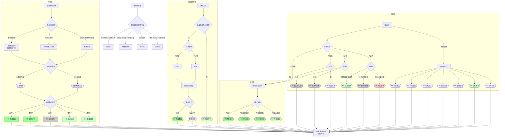

# 《胡亥模拟器》第五章：终章·大秦的余烬（完整修正版）

## 【使用说明】

本章为《胡亥模拟器》最终章，汇聚前四章所有选择，导向不同结局。剧本根据玩家在第四章结束时的状态，分为四条主要剧情线：

| 你在第四章结束时的状态         | 对应剧情线         |
| :----------------------------- | :----------------- |
| 赵高已死，你亲征巨鹿           | **【明君线】**     |
| 赵高离京监军，你坐镇咸阳       | **【傀儡翻身线】** |
| 你已逃离咸阳                   | **【逃亡线】**     |
| 赵高仍掌权，你困于宫中         | **【亡国线】**     |

**以 `【若隐忍线】` 标注的段落**为隐忍线专属内容，**以 `【若B1-2线】` 标注的段落**为 `B1-2` 专属内容，**以 `【条件分支】` 标注的段落**根据前序选择呈现不同文本。

本章除按第四章结尾分成四条外部局势线外，在每条局势线内部还会再按三条长期路线分出不同的终章问题：

- **主线**：你是否能以公开的军政选择，真正承担“二世”这个位置。
- **隐忍线**：你是否能处理密室、罪证、眼线与现身时机，不让三年的暗线反噬自己。
- **`B1-2`**：你是否能把沙丘那夜那次失败的告发，真正兑现为平反、交代或让贤，而不是只停在悔恨里。

*校订说明：本章承接第四章结尾，起点落在“秦二世三年，八月己亥后至望夷宫之变前后”。由于终章不同结局会继续推进到公元前206年及其后数年，以下时间线以各场景及结局起点为准；扶苏 IF 线结局已移出本章，统一归入扶苏剧本第五章处理。*

## 【前情回顾·动态字幕】

*画面淡入，黑底白字浮现。根据第四章实际结局动态生成。*

*时间线：秦二世三年，八月己亥后，至其后数年。*

**秦二世三年，八月己亥后。**

**巨鹿的雪，咸阳的血。**

**【若赵高已死】** 赵高伏诛。你亲政了。密室里那些写满罪证的竹简，已经被你烧掉。你站在章台殿的窗前，看着咸阳的雪。赵高死了，但大秦的敌人还在。

**【若赵高离京监军】** 赵高已离咸阳，正在河北前线督军。你坐镇咸阳。这是他离开时间最长的一次。禁卫中，公孙季和杨喜替你替换了赵高的核心党羽。你在等——等他回来，或者等他死在前线，再也回不来。

**【若逃亡成功】** 你跪在咸阳城外的雪地里，身后是追兵的喊杀声，身前是茫茫夜色。你活着。隐忍三年，不是为了赢，是为了活。现在，你要选择去向何方。

**【若赵高仍掌权】** 章邯的求援信一封接一封送入咸阳。赵高把持着禁卫，把持着奏章，把持着你的生死。你站在望夷宫的窗前，看着咸阳的雪。这是你最后一次做选择了。

# 剧情线一：明君线（赵高已死，亲征巨鹿）

## 【场景一：函谷关外·大军营帐】

*时间线：公元前207年，冬，东出函谷关后，巨鹿战局后段，决战前夜。*

*夜。寒风凛冽。*

*你站在营帐外，望着远处的地平线。那里是巨鹿的方向。五万关中兵马，是你手中最后的筹码。子婴坐镇咸阳，替你稳住后方。*

**【条件分支：若第四章来自“密诏章邯线”】**

*章邯已率三万精锐回师咸阳，与你合兵一处。咸阳宫的那场决战，你赢了。赵高伏诛，阎乐授首。但关东未平——王离已败，章邯主力尚待重整，项羽兵锋正盛。你没有时间休整。留下子婴镇守咸阳，你与章邯率军星夜东出，直奔河北战场。*

**【条件分支：若第四章来自“离京出巡线”】**

*雍城对峙后，你整合勤王之师，与章邯派来的接应兵马会合。你没有回咸阳——咸阳有子婴。你选择了直接东出函谷关。章邯的信使带来了河北前线的军报：项羽破釜沉舟，王离兵败后秦军连失锐气。你必须尽快赶到。*

**【条件分支：若第四章直接来自赵高已死线亲政】**

*这是你亲政后第一次亲临战阵。你不是父皇，你没有他的铁腕和雄略。但你站在这里，站在寒风里，站在你的士兵面前——这本身就是一种选择。*

*章邯的信使刚刚离开。信中说，项羽已渡漳水，破釜沉舟，楚军人人怀必死之心。王离既败，秦军残部士气大挫。*

**章邯**：（低声）“陛下，臣有一言。”

*你转头。章邯站在你身侧，面容瘦削，铠甲上还带着风干的泥浆。*

**胡亥**：“说。”

**章邯**：“项羽破釜沉舟，士气正锐。此时与之正面交锋，胜算不大。臣有一计——佯攻巨鹿，吸引楚军回援。同时分兵袭其后路，断其粮道。楚军粮少，不日自溃。”

*你沉默片刻。*

**胡亥**：“需要多久？”

**章邯**：“短则十日，长则一月。”

**胡亥**：“一个月。”

*你重复了一遍这三个字。一个月。一个月里，咸阳会发生什么？子婴能压住赵高余党吗？一个月后，你手中的五万兵马还剩下多少？*

*但你也知道，章邯说得对。项羽的楚军是哀兵，是困兽。与困兽正面搏杀，再锋利的刀也会崩口。*

*你需要做出选择。*

**【若隐忍线·内心独白】**

*你看着章邯疲惫而坚毅的面容，心中涌起一股复杂的情绪。*

*这个人，是你亲自提拔的少府。在赵高把持朝政的那些日子里，你保住了他，给了他兵权，给了他信任。现在他站在你面前，用他的忠诚和兵法回报你。*

*你忽然想起密室里那些已经烧掉的竹简。其中有一卷，记录着赵高每一次阻挠章邯援军的罪行。你没有把那卷竹简给章邯看过。不需要。他用他的剑证明了他站在哪边。*

*这就够了。*

## ★ 核心选择节点：巨鹿决战 ★

**选项A：听从章邯，围而不战**

*你沉默良久，最终点头。*

**胡亥**：“就按将军说的办。”

*章邯躬身。*

**章邯**：“陛下圣明。”

*围城开始了。*

*章邯率军围困楚军粮道，却避而不战。项羽数次挑战，秦军皆高悬免战牌。楚军粮草日渐枯竭，士卒开始杀马为食。*

*半个月后，项羽终于撑不住了。他率残部突围，被章邯伏兵截杀。项羽身中数箭，被亲卫拼死救出，逃回彭城。经此一败，楚军元气大伤，短期内无力再战。*

*巨鹿之围遂解。*

*消息传回咸阳，全城沸腾。子婴在奏报中写道：“咸阳民心已定，赵高余党不敢妄动。陛下可从容东进，收复关东。”*

*你拿着那封奏报，站在巨鹿城头，望着被战火熏黑的城墙。*

*你赢了。*

*但你知道，这只是开始。项羽未死，六国未平。你只是赢得了一场战役，还没有赢得整个天下。*

*不过，至少现在，你有了选择的权利。*

*（隐藏数值变化：威望值+3。章邯好感度+2。获得关键标记【巨鹿解围】。）*

**选项B：主动出击，一决胜负**

*你看着章邯，缓缓摇头。*

**胡亥**：“将军。朕不是来围城的。朕是来赢的。”

*章邯抬起头。*

**胡亥**：“项羽破釜沉舟，是告诉他的士兵——他们没有退路。朕要告诉朕的士兵——朕也没有退路。”

*你翻身上马。五万关中兵在你身后列阵，黑压压的军旗在寒风中猎猎作响。*

**胡亥**：“传朕旨意。全军出击。朕亲自冲锋。”

*章邯沉默片刻，然后拔剑。*

**章邯**：“臣，愿随陛下赴死。”

*那一战，秦楚两军在巨鹿城外的平原上杀得天昏地暗。*

*你冲在最前面。箭矢擦过你的脸颊，温热的血顺着脖子流下来。你没有停。你想起父皇说过的话——秦国的男儿，从不退缩。*

*当你的玄色大旗出现在楚军侧翼时，项羽的军阵终于出现了裂痕。章邯趁势猛攻，楚军大乱。项羽在乱军中被亲卫拼死救走，但他的破釜沉舟之师，已折损大半。*

*黄昏时分，战场上堆满了尸体。你坐在一块石头上，让御医包扎脸上的伤口。章邯走过来，单膝跪地。*

**章邯**：“陛下神武。臣……心服口服。”

*你没有说话。你看着夕阳下的战场，忽然觉得很累。*

*但你也知道——从今天起，你的士兵不再把你当作一个坐在咸阳宫里的傀儡。他们为你流了血，你为他们流了血。这是比任何诏书都牢固的纽带。*

*（隐藏数值变化：威望值+5，恐惧值归零。章邯好感度+3。获得关键标记【巨鹿大捷·亲征】。）*

## 【明君线·结局分支】

*无论你在巨鹿选择了何种战术，有一件事是确定的：你赢了。章邯赢了。大秦赢了。*

*但这不意味着天下太平。项羽退回彭城，但未死。刘邦已破武关，兵锋直指咸阳。六国旧贵族仍在各地割据。*

*你站在人生的分岔路口。接下来的选择，将决定你最终的命运。*

### 【路线分化层：赢下巨鹿之后，你要先回答什么？】

**【若主线】**

*对你而言，巨鹿的意义首先不是洗清旧账，而是终于有了公开执政的资格。你接下来要回答的问题，是怎么把“打赢一仗”变成“坐稳天下”。所以主线在这里关心的是军政取舍、对刘邦与项羽的处置、以及你是否配得上这个帝位。*

**【若隐忍线】**

*对你而言，巨鹿大捷只是最后一张明牌。真正的问题不是会不会打仗，而是三年来埋在暗处的那张网，要在什么时候收，收多干净，收完之后你还剩下多少自己。密室里的竹简、禁卫里的眼线、子婴与章邯对你的信任，都会在这里转化成“现身为帝”还是“退回幕后”的分歧。*

**【若B1-2线】**

*对你而言，这一战最大的意义，是你终于有资格回头处理沙丘留下的旧债。你不是先问天下怎么看你，而是先问蒙氏、宗室、李斯这些人还能不能得到一句迟来的交代。若你继续把“以后再说”挂在嘴边，`B1-2` 线的意义就会再次落空；若你先把旧债摆上案头，第五章才会真正进入这条线自己的收束。*

### 结局一：HE·明君逆袭

*时间线：公元前207年，冬，至公元前202年，冬。*

*（达成条件：巨鹿大捷 + 威望值≥7 + 宗室支持度≥3 + 子婴好感度≥4 + 章邯好感度≥5）*

*你率军西返，在峣关与刘邦相遇。*

*刘邦没有与你交战。他派使者送来一封信，言辞恭谨。信中说，他愿率部归顺，只求保全将士性命。*

*你拿着那封信，沉默了很久。*

*杀刘邦，易如反掌。但杀了刘邦，他的数万旧部必反。关东未平，项羽未死，你再树新敌，何苦？*

*你召见了刘邦。*

*那个泗水亭长出身的汉子，跪在你面前时，姿态卑微，眼神却精明。*

**胡亥**：“刘邦。朕可以赦免你。但朕要你做一件事。”

**刘邦**：“陛下请讲。”

**胡亥**：“替朕平定楚地。项羽的人头，换你的王爵。”

*刘邦抬起头，眼中闪过一丝亮光。*

**刘邦**：“臣……领旨。”

*你给了他一个机会，也给了他一把刀。他会不会反噬？你不知道。但你知道——只要你的刀比他更锋利，他就不敢反。*

*接下来的五年，你没有急于收复六国。你听从子婴的建议，先固关中，减免赋税，与民休息。阿房宫的工程停了，骊山陵的刑徒散了。咸阳的市井重新热闹起来，黔首的脸上开始有了笑容。*

*五年后，关中富庶，兵精粮足。你命章邯出函谷关，刘邦出武关，南北夹击项羽。项羽在垓下兵败，自刎于乌江。*

*天下重归一统。*

*你坐在咸阳宫的御座上，冕旒垂在眼前。殿下群臣三跪九叩，山呼万岁。*

*你忽然想起沙丘那个夜晚。赵高问你——公子可想做皇帝？*

*你点了头。*

*然后你用了八年时间，才真正成为了皇帝。*

*（史家评语·司马迁：“二世初立，天下汹汹。然能诛赵高，亲征巨鹿，收章邯、刘邦而用之。虽非始皇之雄才，亦有中主之器量。惜乎，沙丘之变，终为史笔所诛。”）*

*（结局达成：HE·明君逆袭）*

### 结局二：HE·重塑天下

*时间线：公元前207年，冬，至公元前206年及其后。*

*（达成条件：巨鹿解围或大捷 + 第二章获得【庇护宗室】+ 子婴好感度≥4 + 第三章获得【菜园论政】）*

*巨鹿战后，你没有急着回咸阳。你让章邯继续驻守关东，自己只带了两百亲卫，微服西行。*

*你去了很多地方。*

*你去了上郡，看了扶苏自尽的那座军帐。帐中空空，只有风穿过破旧的帷幕。你站在那里，很久没有说话。*

*你去了三川，看了公子将闾被槛车押回咸阳的那条路。路边的野草已经淹没了车辙。*

*你去了雍城，去了子婴的菜园。菜园里的冬菜已经收了一茬，新翻的泥土散发着潮湿的气息。子婴蹲在地里，像往常一样摆弄着他的菜苗。*

*你站在他身后。*

**胡亥**：“叔父。朕不想做皇帝了。”

*子婴的手停住了。*

**胡亥**：“不是不想做。是做不了。朕杀了太多人，欠了太多债。关东的黔首恨朕，六国的遗民恨朕，宗室的孤寡恨朕。朕就算用刀剑让他们闭嘴，他们的子孙还会反。”

*子婴站起来，拍了拍手上的泥土。*

**子婴**：“陛下想做什么？”

**胡亥**：“朕想……分天下。”

*子婴沉默了。*

**胡亥**：“父皇统一六国，用的是刀。但刀能杀人，不能服人。朕想试试别的。”

*公元前206年，你颁布了一道震动天下的诏书——*

*“废郡县，复分封。”*

*你封章邯为雍王，领关中。刘邦为汉王，领巴蜀汉中。项羽为楚王，领故楚之地。其余六国旧贵族，各归其国。*

*天下哗然。*

*有人说你疯了，有人说你怂了。但你说——朕不是始皇帝。朕不必走他的路。*

*分封之后，你退居雍城，不再称帝，自号“秦公”。*

*战火平息了。六国旧贵族得到了他们想要的封地，不再造反。项羽得到了楚国，不再喊着“楚虽三户，亡秦必楚”。刘邦得到了汉中，老老实实地做他的汉王。*

*你不再是天下的皇帝。但大秦的宗庙保住了。嬴姓的血脉保住了。关中的黔首不用再打仗了。*

*你坐在雍城旧都的城楼上，看着夕阳沉入秦岭。子婴坐在你身边，递给你一壶酒。*

**子婴**：“陛下后悔吗？”

*你喝了一口酒。*

**胡亥**：“朕只后悔……杀扶苏的时候，没有多想一想。”

*子婴没有说话。夕阳将你们的影子拉得很长很长。*

*（史家评语·司马迁：“二世废郡县，复分封，天下遂安。或曰：‘此非秦之亡乎？’然嬴姓宗庙得存，关中黔首免于兵燹。以一人之退，易天下之安，虽非雄主，亦仁者矣。”）*

*（结局达成：HE·重塑天下）*

### 结局三：TE·章邯之降

*时间线：公元前207年，冬，至公元前206年，冬。*

*（达成条件：巨鹿之战中秦军战败 + 章邯被逼投降 + 你未能扭转局势）*

*巨鹿之战，你败了。*

*不是章邯的错，不是士兵的错。是援军来迟了一步，是粮草在最后关头耗尽，是楚军的悍勇超出了所有人的预料。*

*章邯退守棘原，派司马欣回咸阳求援。但咸阳空虚——你带走了关中最后的精锐。子婴尽力搜刮粮草，但关中的仓库已经见底。*

*司马欣空手而归。他对章邯说——*

*“咸阳无粮，援军无望。”*

*章邯沉默了一整夜。*

*第二天，他派使者去了项羽的军营。*

*投降。*

*二十万秦军放下兵器，跪在棘原的冻土上。项羽接受了投降，但不久后，在新安城南，他将这二十万秦卒全部坑杀。*

*消息传到咸阳时，你正在章台殿中。子婴把军报呈给你，面色苍白。*

**子婴**：“陛下……章邯降了。巨鹿……没了。”

*你没有说话。*

*你看着那份军报，手指微微发抖。二十万人。那是大秦最后的精锐。他们没有被项羽杀死在战场上，而是放下兵器之后，被活埋了。*

*你忽然觉得很冷。不是身体的冷，是骨头缝里的冷。*

*接下来的事，像一场无法醒来的噩梦。项羽西进，刘邦入关。你做了能做的一切——整军、布防、遣使求和。但大势已去。*

*公元前206年，冬。刘邦兵临咸阳。子婴素车白马，系颈以组，封皇帝玺符节，降于轵道旁。*

*秦朝，亡了。*

*（史家评语·司马迁：“章邯为秦将，数有功。然巨鹿之败，非战之罪。二世亲征而不能救，秦之亡，非天也，势也。”）*

*（结局达成：TE·章邯之降）*

### 结局四：HE·隐龙出渊（隐忍线专属）

*时间线：公元前207年，冬，至其后六年。*

*（达成条件：赵高已死 + 巨鹿大捷 + 权谋值≥10 + 子婴好感度≥5 + 章邯好感度≥5 + 曾获得【秘密记录】【禁卫眼线】【反杀赵高】等标记）*

*天下重归一统的那一天，你独自走进了密室。*

*这间密室，是你隐忍三年的见证。你曾在这里一笔一划记录赵高的罪行，曾在这里与子婴密议反杀之策，曾在这里焚烧那些不再需要的罪证竹简。*

*现在，密室空了。*

*你在密室的石壁上，用刀刻下了最后一行字——“胡亥。始皇帝第十八子。隐忍三年，诛赵高。亲征三年，平天下。凡六年，终成帝业。”*

*你刻完最后一个字，将刀放下。*

*你走出密室，走进章台殿。群臣已经在殿中等候。子婴站在宗室之首，章邯站在武将之首。他们看着你，眼中不再是当年看一个傀儡的神色。*

*是敬畏。是忠诚。是追随。*

*你坐上御座。冕旒垂在眼前，玉珠轻轻碰撞，发出清脆的声响。*

*你忽然想起沙丘那个夜晚。赵高问你——公子可想做皇帝？你点了头。然后你在心里对自己说：我点头，不是因为我怕他，是因为我要让他以为我怕他。*

*你用了六年时间，让这句话变成了现实。*

*你不是傀儡。你是皇帝。*

*（史家评语·司马迁：“胡亥以弱冠之年，隐忍于赵高肘腋之下。外示柔顺，内蓄锋芒。三年不鸣，一鸣而赵高伏诛。三年不飞，一飞而天下砥定。始皇帝有子如此，当含笑九泉矣。”）*

*（结局达成：HE·隐龙出渊）*

### 结局五：HE·英雄救赎（B1-2线专属）

*时间线：公元前207年，冬，至其后十年。*

*（达成条件：序章B1-2获得【曾试图告发】+ 第一章赦免蒙毅 + 第二章保护宗室 + 第三章保李斯 + 第四章反杀赵高成功 + 巨鹿大捷）*

*巨鹿大捷后，你没有立刻班师回朝。你站在巨鹿城头，望着战场上尚未掩埋的尸骸，忽然想起了一个人——蒙毅。*

*你想起沙丘那个夜晚，你向蒙毅告发赵高，却未能阻止矫诏。蒙毅被李斯的士卒押出偏殿时，回头看了你一眼。那一眼里没有恨意，只有惋惜和不甘。*

*你欠他一个交代。*

*班师回咸阳后，你做的第一件事，不是庆功，而是召见蒙毅。*

*他在你即位之初被你赦免留用，这些年一直沉默地守在朝堂边缘。你看着他，问了一句话。*

**胡亥**：“蒙上卿。朕若为蒙氏平反，你可愿替朕整饬禁卫？”

*蒙毅抬起头，眼中闪过一丝亮光。他跪伏在地。*

**蒙毅**：“陛下……臣等了三年，就等这句话。”

*你知道，他等的不只是这一道平反诏。也是沙丘那夜那句没能救下任何人的告发，终于在三年后落到了实处。*

*你为蒙恬、蒙毅平反，追复蒙恬官爵，厚恤其家。蒙毅进位郎中令，接管禁卫。公孙季、杨喜等被你安插在禁卫中的眼线，皆得擢升。*

*你召见了李斯。这个须发皆白的老人，曾在第三章被你从赵高刀下救出。他跪在你面前时，你已经看不清他的表情。*

**胡亥**：“丞相。赵高已死。朕需要你替朕做一件事。”

**李斯**：“陛下请讲。”

**胡亥**：“改秦法。不是废，是改。严刑峻法，减三成。株连之罪，限于三代。与民休息，减免赋税。”

*李斯沉默了很久。然后他叩首。*

**李斯**：“老臣……愿为陛下草拟新法。”

*你召见了宗室中被你保护下来的公子婴等人。你留子婴在咸阳总理宗室与朝政，又封其余宗室诸公子分镇关东。你对他们说——*

**胡亥**：“朕欠宗室的血债，这辈子还不完。但朕至少可以，不再欠新的。”

*你说完这句话，忽然想起沙丘偏殿里那个仓促开口、却什么都没能改变的自己。那时你没能保住扶苏，没能保住蒙氏，也没能拦下后来的血。如今你仍还不清旧债，但至少终于开始一笔一笔偿还。*

*此后的十年，大秦没有灭亡。章邯平定了关东，蒙毅整饬了禁卫，李斯修订了秦法，子婴等宗室分镇四方。你坐在咸阳宫的御座上，看着大秦一点一点从崩溃的边缘走回来。*

*你从来不是雄主。你没有父皇的铁腕，没有扶苏的仁厚，没有赵高的权谋。你只是一个在沙丘之夜点了头的、怕死的年轻人。*

*但你活下来了。你用了十年时间，把你欠蒙氏的、欠宗室的、欠旧臣的，也欠沙丘那夜那个自己的债，一笔一笔地还。*

*（史家评语·司马迁：“二世虽得位不正，然能赦蒙毅、保宗室、存李斯，以宽仁聚人心。及赵高伏诛，忠良盈朝，遂能平定关东，延秦祚数十年。盖得道者多助，非虚言也。”）*

*（结局达成：HE·英雄救赎）*

# 剧情线二：傀儡翻身线（赵高离京，你坐镇咸阳）

## 【场景一：咸阳宫·章台殿】

*时间线：公元前207年，冬，赵高离京监军后不久。*

*赵高走了。*

*他以监军身份前往章邯军中，你终于有了喘息的空间。他走的那天，咸阳的天空难得放晴。你站在章台殿门口，看着他的车驾驶出宫门，消失在驰道的尽头。*

*子婴站在你身后。*

**子婴**：“陛下。时间不多。”

*你点点头。*

*赵高不在咸阳。这是他离开时间最长的一次。你必须在他回来之前，把他留下的网全部拆掉。*

*你转过身，看着子婴。*

**胡亥**：“叔父。名单。”

*子婴从袖中取出一卷竹简。上面密密麻麻写着名字——禁卫将领、少府属官、郎中令属吏……每一个名字后面，都用小字标注着与赵高的关系。*

*你把竹简摊在案上，提起笔。*

*一个一个地勾。*

**【若隐忍线·内心独白】**

*你提起笔，看着名单上那些被朱笔圈出的名字，心中涌起一种奇异的感觉。*

*这份名单上的大多数人，你早在密室的竹简上记录过。公孙季替你查明的，杨喜替你核实的，子婴替你整理的。你隐忍三年，等的就是这一刻。*

*赵高以为他离开咸阳，只是暂时的。他不知道，你等这个“暂时”，等了三年。*

*你落下第一笔。朱砂在竹简上洇开，像一滴血。*

## ★ 核心选择节点：清洗赵高党羽 ★

**选项A：雷霆手段，一网打尽**

*你勾掉了竹简上大半的名字。*

**胡亥**：“这些人，全部拿下。连夜审，不必报朕。”

*子婴沉默了一瞬。*

**子婴**：“陛下，有些人罪不至死……”

**胡亥**：（打断）“叔父。朕没有时间分善恶。朕只能分敌我。”

*子婴没有再说话。*

*那一夜，咸阳城中马蹄声不断。禁卫被换防，少府被查封，郎中令属下的郎官一个接一个被从家中带走。有人喊冤，有人反抗，有人跪地求饶。*

*天亮时，赵高在咸阳经营了十余年的势力，被连根拔起。*

*代价是，咸阳的监狱人满为患，东市的刑台从早到晚没有停过。咸阳百姓围观行刑，有人拍手称快，有人噤若寒蝉。*

*你站在宫墙上，看着东市方向升起的烟尘。*

*你想起公子婴的话——“虫子这种东西，你不理它，它就会越来越多。等你想理的时候，菜已经被啃光了。”*

*你理了。但你的手，已经沾满了血。*

*（隐藏数值变化：残暴值+2，威望值+1。获得关键标记【雷霆清洗】。赵高党羽被肃清，但朝中人心惶惶。）*

**选项B：分化瓦解，恩威并施**

*你放下笔。*

**胡亥**：“叔父。这些人里，哪些是赵高的心腹，哪些只是被迫依附？”

*子婴接过竹简，仔细看过。他用朱笔圈出了十几个名字。*

**子婴**：“这十几人，是赵高的死党。其余人，不过是随波逐流。”

*你点点头。*

**胡亥**：“传朕旨意。这十几人，下狱议罪。其余人——只要上书自劾，与赵高划清界限，朕既往不咎。”

*诏书发出。*

*第一天，只有寥寥数人上书。第二天，多了十几个。第三天，案上的自劾奏疏堆成了小山。*

*你一份一份地看。有些人的文字诚恳，有些人明显是投机。但你全部批了一个字——“准”。*

*你不在乎他们是不是真心。你在乎的是，他们现在站在你这边。*

*半个月后，朝堂上再也没有人敢公开为赵高说话。他的党羽或死或降，他的势力土崩瓦解。*

*你用最小的血，换来了最大的胜利。*

*（隐藏数值变化：威望值+2。获得关键标记【分化瓦解】。赵高党羽被瓦解，朝中人心渐定。）*

## 【傀儡翻身线·结局分支】

*清洗完赵高党羽后，你开始等待。等待巨鹿的战报，等待赵高的归来——或者，等待他再也回不来。*

### 【路线分化层：赵高离京之后，你要拆掉什么？】

**【若主线】**

*主线在这里面对的，是一场公开的宫廷翻盘。你要决定的是拆网的手法，是雷霆清洗还是分化瓦解，以及赵高回来之后，你要把这场胜利塑造成“皇帝亲政”，还是“趁敌不备的侥幸反扑”。因此主线在傀儡翻身线的焦点，是公开权力如何回到你手里。*

**【若隐忍线】**

*隐忍线在这里面对的，则是“多年暗线终于浮出水面”后的收网问题。你不是临时起意地清赵党，而是在用三年来埋好的眼线、名单和罪证一点点拆他的骨架。问题也因此变了：你是要亲手清算，把自己从密室里推到殿前；还是干脆借前线、借章邯、借外敌，把最后一刀也藏在别人手里。*

**【若B1-2线】**

*若 `B1-2` 走到这里，它与主线最大的区别，不是清不清赵党，而是清完之后你准备先做什么。是先坐稳皇位，再慢慢谈蒙氏与宗室的旧账；还是趁赵高失势的空档，把迟来的平反与交代立刻提上日程。也就是说，`B1-2` 在这一局势线里关注的是“翻身之后是否马上补债”，而不只是“能不能翻身”。*

### 结局六：HE·傀儡翻身

*时间线：公元前207年，冬，至公元前207年，春。*

*（达成条件：成功清洗赵高党羽 + 章邯巨鹿大捷或僵持 + 赵高从前线回京）*

*赵高回到咸阳时，迎接他的不是旧日仪仗，而是三道已经盖了皇帝玺印的诏书。*

*第一道，夺其旧部兵权。第二道，命廷尉会审阎乐与赵党。第三道，令百官次日齐集章台殿，当庭听审。*

*他终于意识到，这一次你不是在密室里等他，也不是在狱中和他算私仇。你是要在朝堂上，当着满朝文武和咸阳城，把他从“老师”和“丞相”，打回待罪之臣。*

*次日章台殿中，子婴、冯去疾、公孙季、杨喜分列两侧。你亲自念出赵高的罪名：矫诏、专权、欺君、逼杀宗室、构陷李斯、挟制禁卫。每念一条，殿中就静一分。*

*赵高起初还想辩。直到阎乐、少府属官、禁卫将领一份份供词摆到面前，他终于抬头看向你。*

**赵高**：“陛下今日，是要把沙丘之事都推到臣一人头上么？”

*你没有避开他的目光。*

**胡亥**：“沙丘之事，朕有罪。可今日审的，是你如何把朝廷变成了你的私门。”

*你顿了顿。*

**胡亥**：“朕会记自己的账。你的账，也要算。”

*这句话落下时，殿中许多人第一次真正抬头看你。因为他们终于明白，坐在御座上的人不再只是一个会点头的少年，而是愿意把责任和权力一起扛住的人。*

*三日后，赵高腰斩于东市，夷其党羽。行刑后你没有回寝殿，而是直接回到尚书案前批阅奏章。*

**子婴**：“陛下不歇一歇？”

**胡亥**：“不歇。赵高死了，不等于朝廷自己会长好。朕今天若只会杀人，明天还会再长出一个赵高。”

*子婴看着你，慢慢点头。*

*关东仍乱，项羽仍在，刘邦仍在。可至少从这一夜起，大秦的政令重新从章台殿发出，而不是从赵高的府邸里拐出来。*

*你终于不是“活下来的傀儡”，而是“坐上去的皇帝”。*

*（史家评语·司马迁：“二世能诛赵高者，未足奇；难者，在能以朝堂诛赵高，而非以私室诛赵高。政令既复出章台，故曰‘翻身’，不独杀一人而已。”）*

*（结局达成：HE·傀儡翻身）*

### 结局七：HE·借刀杀人（隐忍线专属）

*时间线：公元前207年，冬，至公元前207年，春。*

*（达成条件：第四章选择派赵高监军 + 清洗赵党成功 + 章邯巨鹿大捷 + 赵高死于前线）*

*赵高没有回到咸阳。*

*他在巨鹿前线，被项羽的楚军围困。章邯没有救他。你也没有下令救他。*

*消息传回咸阳时，是一封简短的军报——“赵高监军，陷于阵中，不知所踪。”*

*你拿着那封军报，看了很久。*

*不知所踪。就是死了。*

*你没有追问。没有彻查。你只是批了一个字——“知”。*

*子婴站在殿下，看着你。*

**子婴**：“陛下。赵高死了。”

**胡亥**：“朕知道。”

**子婴**：“陛下……不难过？”

*你放下笔，看着子婴。*

**胡亥**：“叔父。朕隐忍三年，不是为了亲手杀他。是为了让他死。他死在谁手里，不重要。重要的是，他死了。”

*你站起身，走到窗前。咸阳的天空湛蓝如洗。*

**胡亥**：“从今天起，朕不用再做任何人的傀儡了。”

*赵高死了。你借项羽的刀，杀了他。你没有沾血，但你知道，这把刀迟早要还。项羽是下一个敌人。*

*但至少今天，你赢了。*

*（史家评语·司马迁：“二世以监军之名遣赵高于巨鹿，借楚人之刀除腹心之患。不亲弑而仇已报，不血刃而权已收。权谋之深，有乃父之风。”）*

*（结局达成：HE·借刀杀人）*

### 附加片段：隐忍变体（权谋值≥10时触发额外对话）

*时间线：公元前207年，春，赵高行刑前夜。*

*（在HE·傀儡翻身结局中，若权谋值≥10，触发以下额外内容。）*

*赵高被腰斩的前一夜，你在廷尉狱中见了他最后一面。*

*他坐在角落里，须发蓬乱，囚服污秽。但看到你时，他的嘴角仍然挂着那抹笑意。*

**赵高**：“陛下是来送臣最后一程的？”

*你看着他，沉默了很久。*

**胡亥**：“朕来，是想问你一句话。”

**赵高**：“陛下请问。”

**胡亥**：“沙丘那夜，你对朕说，扶苏即位，朕必死。你是真心这样认为，还是只是为了拉朕入伙？”

*赵高笑了。笑声在空旷的牢狱中回荡。*

**赵高**：“陛下到现在还在想这个问题？”

*他没有回答。他只是靠在墙上，闭上眼睛，低声哼起了一首古老的秦地歌谣。那是他教你的第一首歌谣。*

*你没有再问。你转身离开。*

*身后，赵高的歌声越来越低，最后消失在牢狱深处。*

*第二天，他死了。*

*你站在宫墙上，看着东市方向升起的黑烟。子婴站在你身边。*

**子婴**：“陛下。赵高死了。陛下为何面无喜色？”

*你沉默了很久。*

**胡亥**：“因为朕知道，他教朕的那些东西——权术、狱法、怎么控制人心——朕这辈子，都丢不掉了。”

# 剧情线三：逃亡线（你已逃离咸阳）

## 【场景一：咸阳/雍城郊外·雪地】

*时间线：公元前207年，冬，望夷宫变后当夜。*

*你逃出来了。*

*但你什么都不是了。*

*你的冕旒丢在了密道里，玄色龙袍被荆棘刮破，脚上的靴子掉了一只。你赤着一只脚踩在雪里，已经感觉不到冷了。*

*你跪在那里，很久没有动。雪花落在你的头发上，肩膀上。*

**【若隐忍线·内心独白】**

*你跪在雪地里，忽然想起密室里那些竹简。*

*那些你一笔一划记录的赵高罪证，那些你暗中积累的筹码，那些你隐忍三年的证据——全都留在了密室里。你没有来得及带走。*

*但没关系。你告诉自己。那些东西，本来就是为了有一天能用来反杀赵高的。现在你用不上了。你连咸阳都丢了，还要那些罪证做什么？*

*你活着。这就够了。*

*然后，你听到了马蹄声。*

*你抬起头。一队人马从夜色中驶来，当先一人身材高大，穿着深色斗篷。他在你面前勒马，掀开兜帽。*

*子婴。*

*他看着你，沉默了很久。然后他翻身下马，跪在你面前。*

**子婴**：“陛下。”

*你看着他，忽然想笑。你穿着一身破衣，赤着一只脚，跪在雪地里。而你的堂叔，跪在你面前，叫你陛下。*

**胡亥**：“叔父。朕不是陛下了。”

**子婴**：“陛下永远是陛下。”

*他站起来，脱下自己的斗篷，披在你身上。*

**子婴**：“咸阳已经回不去了。陛下必须离开关中。”

*你裹紧斗篷。斗篷上还有子婴的体温。*

**胡亥**：“……去哪里？”

*子婴沉默片刻。*

**子婴**：“巴蜀。那里是秦国的旧地，山高皇帝远。赵高的手伸不到那里。”

*他顿了顿。*

**子婴**：“或者……东边。渡过漳水，出函谷关。章邯还在棘原。天下之大，总有陛下容身之处。”

*你看着漆黑的夜色。雪花无声地落着。*

*你必须做出选择。*

**【若隐忍线·专属选项扩展】**

*（若权谋值≥8且子婴好感度≥4，此处额外出现第四选项。）*

**选项D：隐入暗处，伺机再起**

*你沉默了很久。然后你开口了。*

**胡亥**：“叔父。朕哪里都不去。”

*子婴抬起头。*

**胡亥**：“巴蜀太远，关东太乱。朕就留在关中。”

**子婴**：“可是赵高……”

**胡亥**：“赵高以为朕死了，或者逃了。他不会想到，朕就藏在咸阳城外，藏在骊山的刑徒中，藏在关中的乡野间。”

*你看着子婴。*

**胡亥**：“叔父。朕隐忍了三年。现在，朕要继续忍。忍到赵高露出破绽，忍到章邯大军回师，忍到刘邦攻破武关——忍到天下大乱，朕再出来。”

*子婴看着你，那双深水般的眼睛里，浮现出一种复杂的神色。*

**子婴**：“陛下……这是最苦的路。”

**胡亥**：“朕知道。但朕已经苦了三年。不差再苦几年。”

*（转入【隐忍线专属结局：东山再起】）*

## ★ 核心选择节点：逃亡之路 ★

**选项A：南下汉中，图谋巴蜀**

*你选择了子婴的第一条路。*

*巴蜀。那里是秦国的旧疆，当年司马错伐蜀，为秦国打下了这片天府之地。那里有粮，有兵，有崇山峻岭作为屏障。*

*你带着子婴派给你的二十名亲卫，一路南下。过秦岭，穿剑阁，进入汉中盆地。*

*你在南郑落脚。*

*当地郡守姓吕，是秦国的旧吏。他认出了你。他没有声张，只是跪在你面前，老泪纵横。*

**吕郡守**：“陛下……老臣以为……以为再也见不到秦室的天子了……”

*你扶起他。*

*你在南郑住了下来。你没有称帝，没有建号，只是以“秦公子”的身份，暗中收拢旧部，积蓄力量。*

*一年后，刘邦被封汉王，来到汉中。他得知了你的存在。他没有告发你，也没有来拜见你。他只是派人送来了一封信。*

*信中只有一句话——“公子若不弃，邦愿与公子共分天下。”*

*你拿着那封信，沉默了很久。*

*（转入结局：HE·巴蜀之主）*

**选项B：东出函谷，投奔章邯**

*你选择了子婴的第二条路。*

*章邯。大秦最后的名将，你亲自提拔的少府。他现在在棘原，被项羽围困。你不知道他会不会接纳你。你杀了蒙恬，杀了李斯，杀了宗室。你欠的人命，数都数不清。章邯是秦将，他忠于大秦，但未必忠于你。*

*但你没有别的路可走了。*

*你带着几名亲卫，昼伏夜出，穿过层层封锁线，一路向东。你在路上听到了消息——巨鹿战败，章邯退守棘原。*

*你在棘原找到了章邯的军营。*

*章邯看到你时，愣了很久。然后他缓缓跪倒。*

**章邯**：“陛下……”

*你看着他。他的铠甲上沾满泥浆，面容憔悴，眼中布满血丝。他已经很久没有睡过一个好觉了。*

**胡亥**：“章邯。朕不是陛下了。朕只是一个逃出来的人。”

*章邯沉默。*

**胡亥**：“朕来，是想问你——你还愿意为大秦而战吗？”*

*章邯抬起头，看着你。他的眼睛里，有什么东西在燃烧。*

*（转入结局：HE·北方之狼）*

**选项C：隐姓埋名，了此残生**

*你看着子婴，缓缓摇头。*

**胡亥**：“叔父。朕不想再争了。”

*子婴愣住了。*

**胡亥**：“朕杀了扶苏，杀了蒙恬，杀了李斯，杀了宗室。朕杀了太多人。朕欠的债，几辈子都还不完。”

*你站起身，拍了拍身上的雪。*

**胡亥**：“朕不配做皇帝。朕也不配做将军。朕只想……做一个普通人。”

*子婴沉默了很久。最后，他点点头。*

**子婴**：“陛下要去哪里？”

**胡亥**：“……东边。听说东海之外，有仙山。”

*子婴从怀中取出一袋钱币，递给你。*

**子婴**：“陛下……保重。”

*你接过钱袋，转身走向夜色。*

*你没有回头。*

*（转入结局：HE·东渡沧海）*

## 【逃亡线·结局分支】

### 【路线分化层：逃出咸阳之后，你还想保住什么？】

**【若主线】**

*主线走到这里，意味着公开帝位已经保不住了。于是问题从“如何统治天下”改成了“还要不要保住秦室的一点余火”。巴蜀、北疆、东海三条路，分别对应地方割据、军镇生存与彻底退场，它们讨论的是帝位失去之后，你还剩下哪一种活法。*

**【若隐忍线】**

*隐忍线走到这里，则不是单纯逃命。你丢掉的是咸阳，但未必丢掉了布局。你要问的是：要不要继续躲在暗处，把这次逃亡变成更长一轮潜伏；还是承认三年的筹谋已尽，只求活命。于是逃亡线在隐忍线内部的真正分歧，是“继续忍”还是“终于退”。*

**【若B1-2线】**

*若 `B1-2` 走到逃亡线，这条线的重心就不再是单纯择路，而是“带着旧债逃走，是否等于第二次逃避”。你明明已经比沙丘那夜多做过一次尝试，可若此刻仍只是把蒙氏、扶苏、宗室全丢在身后，那么这条线的补偿弧线就会再次中断。因此 `B1-2` 在逃亡线里要补的是负债感，而不是风景感。*

### 结局八：HE·巴蜀之主

*时间线：公元前207年，冬，至汉初。*

*（达成条件：南下汉中 + 积蓄力量 + 乱世中割据一方）*

*你到南郑后的第一件事，不是招兵，也不是称王，而是重修宗庙。*

*庙很小，礼器不全，很多东西都只能临时拼凑。可当第一缕祭烟升起时，你站在庭中，第一次觉得自己不是在逃，而是在替嬴姓留下一个能点灯、能行礼、能告诉世人“秦还没有断”的地方。*

*此后三年，你不再提东出复国。你做的是另一件事：安置关中逃来的旧民，修栈道，屯粮，整盐铁，让汉中的秦人先活下去。*

*刘邦入汉中后，曾派人试探你，问你愿不愿共争天下。你只回了一句话。*

**胡亥**：“争天下的人太多了。朕如今只想守住一盏灯。”

*使者听懂了。于是刘邦不再逼你站队，只默认南郑有一支不称王、不举旗、却始终供奉秦宗庙的嬴姓余脉。*

*后来楚汉相争，难民一次次翻过秦岭来到南郑。你收拢旧民，调剂粮食，修渠筑堰。你发现自己已经不再关心谁是天子，谁是霸王。你更关心冬祭时有没有新谷，仓中还能撑几个月。*

*汉朝建立后，刘邦正式下诏封你为汉中侯，世守南郑，以奉秦祀。你接诏时没有觉得屈辱，也没有觉得光荣。因为你知道，从这一刻起，你不再是失天下的皇帝，而是替亡国守火的人。*

*你没有复国。你只保住了秦。*

*（史家评语·司马迁：“二世入汉中，不复言帝，而专言宗祀。守一隅而存一姓者，虽不能复秦，亦非寻常亡国之主可比也。”）*

*（结局达成：HE·巴蜀之主）*

### 结局九：HE·东渡沧海

*时间线：公元前207年，冬，至汉初。*

*（达成条件：隐姓埋名 + 东行 + 放弃一切权力）*

*你离开关中时，带走的东西很少：几件旧衣，一柄短剑，一枚刻着“亥”字的小玉佩。*

*到东海边后，你把那枚玉佩埋进了沙里。不是怕追兵，而是怕自己哪天又把它挖出来，对着它想“或许还可以回去”。*

*从那天起，你不再叫嬴胡亥，也不再叫秦余。你给自己换了一个连意义都没有的名字，只为了让它像海边所有普通人的名字一样，喊出来不会让任何人停步。*

*你在渔村补网、抬盐、修船。第一次跟船出海时吐得昏天黑地，老船户笑你不像吃海饭的命。你也笑，因为这是很多年来第一次，没有谁会从你的笑里猜你的心思。*

*再后来，你独自驾小船去了更远的外海。没有仙山，没有长生药，也没有徐福故事里那些金碧辉煌的海外王国。只有风、潮、浪和看不到尽头的天水。*

*商船偶尔靠岸，会带来新的消息：项羽死了，刘邦称帝了，咸阳又烧过一次，关中已经不再认秦。你每次都听，然后点头，把消息放回火盆边。你不再追问，因为你来到这里，为的就是把“天下后来如何”从自己身上切出去。*

*很多年后，你在风暴后的海边捡到一面残破铜镜。镜中人头发灰白，皮肤粗糙，眼角尽是风盐刻出的纹。你盯着看了很久，忽然发现自己已经认不出那个在章台殿里戴冕旒的年轻人。*

*你没有难过。因为这正是你要的结果。*

*（史家评语·司马迁：“二世东渡之说，荒忽难考。然使其真有此事，则其所求者非仙，乃无名耳。亡国之主能舍名，未始非一脱也。”）*

*（结局达成：HE·东渡沧海）*

### 结局十：HE·北方之狼

*时间线：公元前207年，冬，至汉初。*

*（达成条件：逃亡中选择投奔章邯 + 章邯存活 + 退守北疆）*

*章邯没有问你值不值得救。*

*他只是把披风扔给你，又命亲兵腾出一匹马。*

**章邯**：“陛下要是还想做皇帝，臣护不了。陛下若只想守住秦人的边塞，臣还能陪一程。”

*你听懂了。于是从那天开始，你第一次主动放下了“二世”这个称呼。*

*你们一路北撤，收拢的是溃兵、刑徒、边民和失了主家的旧秦卒。人越来越杂，旗号越来越破，连粮袋都要一只只缝补。可越往北走，你越觉得呼吸顺了。因为这里没有章台殿，也没有赵高站在身后教你怎么说话。这里只有风、马、弓弦和一座座等着补的烽燧。*

*真正让你留下来的，不是章邯，而是第一场雪后的巡边。你看见老卒带着少年重新立木桩、修鹿角，他们看到你，只问了一句：*

**老卒**：“将军，这座亭子还守不守？”

*他没有叫你陛下。可你听见“将军”时，心里反而落了地。*

*匈奴南试那一年，你和章邯在河套迎战。那一仗很苦，苦到你从马上滚进雪泥里，起来时手上全是血。可夜里清点伤亡时，营中士卒围着火堆给你让了一个位置。没有人跪，也没有人山呼万岁。可那是你第一次觉得，自己不靠皇位也能被这些人认作头领。*

*后来刘邦建汉，使者北来，劝你们归顺。你看完书信，只说了一句：*

**胡亥**：“关中的天下没守住，就把北地的门守住吧。”

*使者带着沉默回去了。你和章邯继续沿着长城巡边。几十年后，中原几度换主，边塞仍旧是边塞。河套的烽火会记得，曾有一个失了天下的皇帝，最后活成了北地最像样的一头狼。*

*（史家评语·司马迁：“二世北走，不复争天下，而与章邯守边。失帝而得将，失宫阙而得关塞。虽非常胜，然其气已非咸阳旧日之胡亥矣。”）*

*（结局达成：HE·北方之狼）*

### 结局十一：HE·东山再起（隐忍线专属）

*时间线：公元前207年，冬，至公元前206年。*

*（达成条件：逃亡中选择“隐入暗处”+ 权谋值≥8 + 子婴好感度≥4 + 刘邦入咸阳后）*

*你没有离开关中。*

*你藏在骊山的刑徒中，藏在关中的乡野间，藏在那些被赵高忽略的角落里。子婴定期派人给你送来消息——赵高的动向，章邯的战况，刘邦的兵锋。*

*你等了三个月。*

*三个月后，刘邦攻破武关，兵临咸阳。赵高杀了你留在望夷宫中的替身，向天下宣布“二世驾崩”，立子婴为秦王。*

*子婴没有拒绝。他即位那天，在咸阳宫设宴，请赵高赴宴。赵高来了。子婴在宴席上亲手刺杀了赵高。*

*消息传到你的藏身处时，你沉默了很久。*

*子婴替你做了你想做的事。*

*你连夜赶往咸阳。在子婴准备向刘邦投降的前一夜，你站在了他的面前。*

**子婴**：（愣住）“陛下……你还活着……”

**胡亥**：“叔父。朕活着。”

*你看着他。*

**胡亥**：“但朕不想再做皇帝了。朕来，是想告诉叔父——不要降。”

**子婴**：“不降？刘邦十万大军已至霸上……”

**胡亥**：“朕知道。但朕也知道，项羽大军正在东来。刘邦和项羽，必有一战。叔父若降刘邦，项羽必怒。若不降，据守咸阳，待楚汉相争，或可渔利。”

*子婴看着你，沉默了很久。*

*然后他点了点头。*

*子婴没有投降。他据守咸阳，同时派使者与刘邦、项羽周旋。两个月后，项羽入关，鸿门宴上放走了刘邦。随后项羽分封诸侯，将关中一分为三，封章邯为雍王、司马欣为塞王、董翳为翟王。子婴被废为庶人，但保住了性命。*

*你带着子婴，离开咸阳，去了南郑。*

*后来刘邦出陈仓，还定三秦。你没有参与。你只是在南郑的城楼上，看着秦岭的皑皑白雪，对子婴说了一句话。*

**胡亥**：“叔父。朕这辈子，做错了很多事。但有一件事，朕做对了。”

**子婴**：“什么事？”

**胡亥**：“在沙丘那个夜晚，朕没有拒绝赵高。朕点了头。因为朕知道，只有活着，才有机会翻盘。”

*（史家评语·司马迁：“二世隐于关中，待赵高伏诛乃出。不争帝位，不贪权柄，唯以存身存宗为念。其智可佩，其忍可叹。”）*

*（结局达成：HE·东山再起）*

# 剧情线四：亡国线（赵高掌权，你困于宫中）

## 【场景一：望夷宫·雪夜】

*时间线：公元前207年，冬，望夷宫之变当夜。*

*赵高没有给你任何机会。*

*你没有除掉他，没有逃离他，没有反抗他。你只是坐在御座上，看着他一步一步收紧手中的绳索。*

*现在，绳索套在了你的脖子上。*

*阎乐率兵包围了望夷宫。殿外的喊杀声越来越近。你身边只剩下韩谈和几个垂垂老矣的宦官。*

*韩谈跪在你面前，老泪纵横。*

**韩谈**：“陛下……老奴无能……老奴护不住陛下……”

*你看着他花白的头发。他服侍了父皇二十年，服侍了你三年。他是这座宫里，唯一没有背叛过你的人。*

**胡亥**：（低声）“韩谈。不怪你。”

*殿门被撞开了。*

*阎乐大步走进来，剑上滴着血。他看着你，目光冰冷。*

**阎乐**：“陛下。丞相有令，请陛下移驾。”

*你坐在御座上，看着他。*

*你没有惊慌。你早就知道这一天会来。从沙丘那个夜晚开始，从你点头的那一刻开始。*

**【若隐忍线·内心独白（权谋值≥10但未触发反杀）】**

*你看着阎乐手中的剑，心中忽然涌起一种奇异的感觉。不是恐惧。是遗憾。*

*你隐忍了三年。你在密室里记录了赵高所有的罪行，在禁卫中安插了眼线，在宗室中找到了子婴这个盟友。你做了能做的一切。*

*但你没有等到出手的机会。赵高比你想象的更谨慎，也更果断。他先动手了。*

*你忽然想起子婴说过的话——“陛下要忍，但不能只忍。陛下要学会在顺从的外表下，做赵高看不到的事。”*

*你做了。但做得还不够。*

*你闭上眼睛。然后睁开。*

## ★ 最终选择：望夷宫终局 ★

**选项A：伏剑自刎**

*你看着阎乐手中的剑。*

**胡亥**：“……把剑给朕。”

*阎乐愣了一下。*

**胡亥**：（提高声音）“朕说，把剑给朕！朕是皇帝，轮不到你来杀！”

*阎乐犹豫片刻，将剑递了过来。*

*你接过剑。剑很重。剑刃上倒映着烛火，也倒映着你的面孔。你看着剑刃上的自己。冕旒，玄衣，十二章纹。你是皇帝。*

*但你也只是一个二十一岁的年轻人。*

*你跪下来，面朝东方——那是上郡的方向，扶苏死去的方向。*

**胡亥**：（低声）“兄长。亥弟来了。”

*你举起剑。*

*剑光闪过。*

*（转入结局：TE·真实的二世 或 TE·迟来的觉醒）*

**选项B：拼死抵抗**

*你猛地抓起案上的铜灯，砸向最近的士卒。*

**胡亥**：“来人！护驾！”

*韩谈从侧殿冲出，手持一柄短剑，挡在你身前。*

*你从地上捡起一名死去侍卫的剑，握在手中。你举起剑，指向阎乐。*

**胡亥**：“朕是始皇帝的儿子。朕的命，不给你。”

*你冲了上去。*

*（战斗触发。此线成败取决于前三章积累的武力值与护卫忠诚度。）*

*你倒下了。*

*剑从你手中滑落，落在地砖上，发出清脆的响声。你仰面倒在地上，看着殿顶的藻井彩绘。画的是龙凤呈祥。*

*真讽刺。*

*你想说什么，但嘴里涌出温热的液体，你说不出话来。殿顶的彩绘越来越模糊。你听到韩谈的哭喊声，听到阎乐冷漠的脚步声。*

*然后你什么都听不到了。*

*（转入结局：BE·众叛亲离）*

**选项C：设法出逃**

*（此选项需此前触发过“望夷宫密道”相关剧情。若不满足条件，此选项为灰色。）*

*你没有犹豫。*

*你转身冲向寝殿深处。阎乐一愣，随即带兵追赶。*

*你推开书架，露出后面一道窄小的暗门。这是父皇留下的密道，从寝殿直通宫外。*

*韩谈在你身后关上暗门，用身体抵住。*

**韩谈**：（隔着门）“陛下快走！老奴挡住他们！”

*他的声音被门外的喊杀声淹没了。*

*你咬紧牙关，转身冲入黑暗的密道。*

*（转入【逃亡线】）*

**选项D：与赵高谈判**

*你看着阎乐，没有拔剑。*

**胡亥**：“朕要见赵高。”

*你被带到了赵高的府邸。他坐在案后，正在批阅奏章——你的奏章。他抬起头，看着你，面带微笑。*

**赵高**：“陛下来了。”

**胡亥**：“赵高。朕可以禅位。朕只要一条命。”

*赵高看着你，笑容不变。*

**赵高**：“陛下放心。臣不会杀陛下。弑君之名，臣担不起。陛下只需下一道诏书——禅位于公子婴。”

*你看着他的眼睛。你知道“颐养天年”是什么意思。但你没有办法。*

**胡亥**：“……拟诏。”

*（转入结局：TE·子婴的继承 或 HE·急流勇退）*

## 【亡国线·结局分支】

### 【路线分化层：望夷宫之夜，你最后要承认什么？】

**【若主线】**

*主线走到亡国线，核心问题是最直接的：你是否终于为自己的军政判断、宗室处置与用人失误承担后果。这里的结局不再讨论谋略精巧，而是讨论一个公开失败的皇帝，最后是硬抗、伏剑、被俘，还是在亡国前承认自己就是那个把秦一步步送到这里的人。*

**【若隐忍线】**

*隐忍线走到亡国线，问题则变成了“你三年的暗线到底留下了什么”。若你还有子婴、有替身、有密道、有未烧尽的筹码，就可能把亡国夜变成退场夜；若你只剩下习惯性的伪装，那这条线就会滑向空壳、撕裂与自毁。也就是说，隐忍线在望夷宫的终局，不是普通失败，而是暗线成败与主体性是否还在。*

**【若B1-2线】**

*`B1-2` 走到亡国线时，终于只剩最核心的问题了：你要不要在一切都晚了的时候，给沙丘那夜、给扶苏、给蒙氏、给子婴一个明确说法。于是这条线在这里不会停留在“怎么死”或“怎么逃”，而会聚焦于三种不同收束：承认却已太迟、让位以求补过、以及既没保住天下也没完成交代的两头皆失。*

### 结局十二：TE·真实的二世

*时间线：公元前207年，冬，望夷宫之变当夜。*

*（达成条件：选项A自刎，且未满足“迟来的觉醒”条件）*

*你接过剑，没有再看阎乐，也没有再回头看韩谈。*

*你不是突然顿悟，也不是终于成了英雄。你只是明白，再往后退，连“胡亥”这个名字都会被别人替你写完。*

*你跪下面朝东方。那是上郡的方向，也是史书迟早会把你和扶苏放在同一行的位置。一个没来得及做皇帝，一个做了三年坏皇帝。*

**胡亥**：“朕就是胡亥。始皇帝第十八子。秦二世。”

*你把这句话说得很慢，像是在说给后人听。因为到了最后，你能留下的不是辩解，不是悔词，只是这个名字和这个称号。*

*剑光闪过。*

*你的尸身被赵高以黔首之礼草草葬于杜南宜春苑。没有尊号，没有谥法，甚至没有一块像样的石碑。你成了“二世”这两个字最冷的一种解释：不是第二位皇帝，而是把第一位皇帝留下来的天下，在自己手里用完的人。*

*（史家评语·司马迁：“二世临死，无他奇语，独自称‘胡亥，秦二世’而已。夫其不辩，正所以成其真。故曰‘真实’，非美之，乃直书之也。”）*

*（结局达成：TE·真实的二世）*

### 结局十三：TE·迟来的觉醒（B1-2线专属）

*时间线：公元前207年，冬，望夷宫之变当夜。*

*（达成条件：`B1-2`线 + 选项A自刎）*

*阎乐把剑递到你手里时，你忽然想起的，不是指鹿为马，也不是赵高那些年说过的每一句“陛下圣明”。*

*你想起的是沙丘偏殿里，自己曾经真的开过一次口。*

*你当时去找过蒙毅，想把赵高和李斯的谋划说出来。你不是从头到尾都沉默。你只是只开了那一次口，失败以后，就再也没把事情做到底。*

*这一念头像刀一样扎进来。你终于明白，所谓“曾试图告发”，如果最后没能救下任何人，也没能逼自己继续往前走，那它既不是功劳，也不是赎罪。它只是一个让你苟活三年的借口。*

*你跪下面朝东方。那是扶苏死去的方向，也是蒙氏、宗室和所有旧债汇到一起的方向。*

**胡亥**：“兄长。蒙上卿。亥弟当年不是没说过。只是说了一句，就又退回去了。”

*你低下头。*

**胡亥**：“原来开口一次，不算反抗。走到底，才算。”

*阎乐没有听懂你在说什么。可这已经不重要了。你终于把那场失败说清楚了，不是说给赵高听，也不是说给后人听，而是说给那个以为“至少我试过”的自己听。*

*你举剑自刎。*

*死前最后一刻，你没有觉得自己洗净了罪，也没有觉得自己配得上原谅。你只是第一次准确地叫出了自己的失败：不是从未反抗，而是反抗得太浅，醒得太迟。*

*（史家评语·司马迁：“二世临终自言，昔于沙丘尝欲告发，而不能竟其事。夫知其非而不能尽改，亦人情之常；然国亡身死，正在此‘半步而止’。故曰觉醒虽真，终嫌其迟。”）*

*（结局达成：TE·迟来的觉醒）*

### 结局十四：BE·众叛亲离

*时间线：公元前207年，冬，望夷宫之变当夜。*

*（达成条件：选项B抵抗 + 武力值/护卫忠诚度不足 + 战败）*

*你喊了“护驾”。*

*可真正冲上来的，只有韩谈和几个老得提不动刀的宦官。殿角那些原本该护驾的禁卫，有人低头装作没听见，有人干脆后退一步，把路让给阎乐。*

*那一刻你才看明白，自己不是死在兵少，也不是死在阎乐的剑快。你是死在前三年一点一点把所有肯为你拼命的人都耗尽了。*

*韩谈替你挡了第一刀，第二刀，第三刀。第四刀下去时，他整个人扑倒在你脚边，手里还死死拽着一个秦军士卒的腿。你想伸手去拉他，却先被长戈捅穿了侧腹。*

*你踉跄后退，撞上御座台阶。四周没有山呼，也没有请罪。阎乐只是冷冷看着，像在等一场早该结束的戏。*

*倒下前你听见殿外有人低声说：“别再死了，快结束吧。”*

*那不是对敌人的咒骂，也不是对皇帝的哀哭。那只是厌倦。*

*这比刀更重。*

*（史家评语·司马迁：“二世死于望夷，其可悲不在战败，乃在呼护驾而应者寥寥。夫君失其人心，至死而后知，斯谓‘众叛亲离’。”）*

*（结局达成：BE·众叛亲离）*

### 结局十五：TE·子婴的继承（B1-2线专属）

*时间线：公元前207年，冬，至公元前206年，春。*

*（达成条件：`B1-2`线 + 选项D谈判 + 愿意让贤补过）*

*你答应禅位，不只是为了活命。*

*在赵高要你下诏的那一刻，你第一次清楚地知道，自己已经没有本事把残局收住了。可子婴也许还可以。至少他比你更知道宗室还能靠谁维系，比你更知道朝堂里还有哪些人能用，比你更有资格在最后时刻替秦室收一个不那么难看的尾。*

*诏书写完后，你又加了一道手敕。那不是给赵高看的，是密封给子婴的。里面只有三句话：*

*为蒙氏平反。*

*厚恤仍存宗室。*

*若秦不可保，先保关中百姓。*

*你写完最后一个字，停了很久。因为你知道，这不是皇帝在交代继承人，更像一个做错了的人，终于把“该补哪几处”写在了纸上，交给另一个更适合收尾的人。*

*你被迁去雍城旧宫后，没过多久就听说子婴杀了赵高。再后来，你又听说刘邦入关，子婴素车白马而降。秦朝还是亡了。*

*消息传来那天，你一个人在院中坐了很久。你想的不是御座，而是那道手敕有没有被打开，里面那三句话有没有至少做成一两句。*

*几个月后，一个旧宦官悄悄从咸阳带来回话：蒙氏已得追复，宗室遗骸已收，关中在刘邦入关后也暂得休息。你听完，闭上眼睛。*

*秦没有保住。皇位也没有保住。可你终于把最后一件能做的事，交到了一个比你更合适的人手里。*

*这不是胜利。只是继承。*

*（史家评语·司马迁：“二世禅位子婴，非独苟生，亦有让贤补过之意。然秦势已去，子婴虽贤，不能复振。故此结局不曰‘善终’，而曰‘继承’。”）*

*（结局达成：TE·子婴的继承）*

### 结局十六：HE·急流勇退（隐忍线专属）

*时间线：公元前207年，冬，至其晚年。*

*（达成条件：隐忍线 + 亡国线选D + 子婴好感度≥5 + 暗线尚存）*

*你被软禁在雍城旧宫的第三夜，来敲窗的不是一个人。子婴站在外面，公孙季在墙角放风，杨喜守着马车。那一瞬间你忽然明白，自己这三年埋下的暗线并没有白费。它们最后一次出现，不是为了把你重新抬回御座，而是为了把你完整地从这局死棋里摘出来。*

*子婴递给你一包东西。里面不是钱，而是三样更要紧的东西：一件庶民旧衣、一份已经改好的路引、和最后一卷密简。*

**子婴**：“这是剩下的名单。赵高党羽、禁卫眼线、可用的人、不可用的人，都在这里。”

*你看着那卷竹简，没有立刻接。*

**胡亥**：“叔父想让朕带走？”

**子婴**：“臣想问陛下，还要不要带着它继续活。”

*你沉默了很久，最后把竹简放到烛火上。火苗先舔到竹片边缘，然后一路烧进那些你写了三年的名字里。*

**胡亥**：“够了。朕不是要去另一个地方，再做一次隐忍的皇帝。”

*你换上粗布衣，跟着他们从侧门离开雍城。路上没有人跪，也没有人喊陛下。你却觉得，这是自己这一生走得最稳的一段路。*

*后来赵高果然死了，子婴果然回了咸阳，天下也果然换了主人。但那些都不再需要你亲自下场了。你做过该做的布局，也亲手结束了它。*

*你在秦岭脚下的小村子里住了下来，会认药，会修犁，会在夜里梦见章台殿，但醒来只需要去挑第二天的水。*

*临终前，你想起的不是沙丘，也不是望夷，而是那一夜自己把最后一卷密简烧掉时，火光在指节上跳的样子。你终于从局里退出来了。不是被赶出来，是自己走出来。*

*（史家评语·司马迁：“隐忍之士，难在出手，亦难在收手。二世能于末路焚其密简，自断后势，不复恋权，是为‘急流勇退’。较之抱网自沉者，高下一见。”）*

*（结局达成：HE·急流勇退）*

### 结局十七：BE·宗室屠夫

*时间线：公元前207年，冬，至公元前206年。*

*（达成条件：第二章获得【宗室屠夫】标记 + 巨鹿战败/咸阳城破）*

*巨鹿战败后，项羽、刘邦等联军西进。咸阳城中，宗室已被你屠戮殆尽，无人可用，无人可守。*

*城破之日，你独坐章台殿。*

*起义军冲入大殿。为首的将领是一个中年人，面容沧桑，眼神如刀。他没有立即杀你，而是盯着你看了很久。*

**将领**：“陛下可还记得公子高？”

*你愣住了。公子高。你的三兄。被你赐死。*

**将领**：“臣是公子高的门客。公子死前，让臣转交一卷诗赋给陛下。陛下看了吗？”

*你没有看。那卷诗赋后来在宫中乱局里失散了。*

*将领从怀中取出一卷残破的竹简，扔在你面前。那是公子高的诗赋——秋风起兮白云飞，草木黄落兮雁南归……*

**将领**：“公子到死，都在问——亥弟可好？”

*你跪在地上，看着那卷诗赋，浑身发抖。*

*将领没有再说话。他挥了挥手。士卒将你押到咸阳东市——当年宗室诸公子被行刑的地方。*

*当众处死。围观百姓无一同情。*

*刀落时，你听到人群中有人说——“活该。”*

*（史家评语·司马迁：“二世屠戮宗室，自剪羽翼。及天下叛秦，竟无一人可守咸阳。身死东市，为天下笑。岂非自取乎？”）*

*（结局达成：BE·宗室屠夫）*

### 结局十八：BE·六国复仇

*时间线：公元前207年，冬，至公元前206年。*

*（达成条件：第三章选择“置之不理”或“安抚招安”导致六国坐大 + 巨鹿战败 + 被六国联军俘虏）*

*咸阳城破时，先冲进来的不是刘邦或项羽的整齐军阵，而是六国旧旗。齐、赵、魏、韩、燕、楚，颜色杂乱，仇恨却出奇一致。*

*他们不要你立刻死。对他们而言，死太便宜了。他们要的是把“秦二世”这个名字拉到六国故地去，一城一城看，一庙一庙跪，把当年秦军带给他们的耻辱尽量原样还回来。*

*你被囚车押着东行。每到一座旧城，城门口都站满人。有人扔石头，有人吐口水，有人只是沉默地看。最让你难受的，不是骂声，而是那些老人看你的眼神。他们不像在看一个人，更像在看一面终于倒过来的秦旗。*

*到了郢城，六国遗贵让你在楚王旧庙前跪下。齐有齐史，赵有赵器，楚有楚歌，魏有魏鼎残片。每一样东西都在提醒你：秦统一天下的时候，以为这些名字已经消失了，其实它们只是躲到人心里去了。*

*一个楚国老贵族捧着新抄好的国史走到你面前。*

**老贵族**：“这不是杀你一个人。是让六国都看见，秦也会跪。”

*你被迫逐条宣读秦的罪状。读到最后，台下没有一个人喊停。因为他们等的不是你的悔，而是那一刀。*

*刀落之后，你的头颅被传示六国故地。秦曾经用驰道把军令送到天下，现在六国也用自己的道路，把你的死讯送回天下。*

*（史家评语·司马迁：“秦并六国，以为海内一统而旧怨可尽。及二世失政，六国之人并起，不争为君，先争报秦。故此结局之惨，正在其非一国之杀，乃六国之共算也。”）*

*（结局达成：BE·六国复仇）*

### 结局十九：BE·亡国罪人

*时间线：公元前207年，冬，至公元前206年。*

*（达成条件：第三章选择“置之不理”导致起义军坐大 + 第四章选择“拒绝增援”导致巨鹿战败、章邯降楚 + 咸阳城破）*

*咸阳城破前的那一夜，你把军报一封一封摊在案上。*

*大泽乡时你说再看看，陈胜吴广就长成了诸侯。六国旧贵族起势时你说不必全理，他们就连成了火。章邯求援时你怕关中空虚，不肯尽发兵，于是巨鹿败了，棘原降了，二十万秦卒被坑了。*

*这些事从前都像是分开的。直到咸阳城头烽火四起，你才看见它们原来连在一起，像一条早就写好的绳子，一头系在沙丘，一头套在今天的脖子上。*

*你没有再逃。因为到了这一步，逃也不是逃命，只是把“亡国罪人”四个字换个地方听。*

*乱军冲入望夷宫时，你仍穿着冕服坐在御座上。不是为了体面，而是因为你忽然不想再把这笔账推给赵高、推给秦法、推给天下大势。至少这一次，你想亲自坐在这里，等它落到自己头上。*

*最先冲进来的楚卒很年轻，脸上还带着血和灰。他显然不认得你，也没兴趣辨认，只是一剑捅了过来。*

*剑入胸口时，你没有喊，也没有骂。你只是低头看见冕旒珠串一颗颗滚到台阶下，像把这三年的每一次错误都数了一遍。*

*后来没有人为你收尸。望夷宫烧了又停，停了又烧。三天后，一个老宦官才用破席把你裹起，拖去城外。沿路没有哭声，连骂声都没有。因为到那时，所有人更关心新主人是谁，而不是旧皇帝死在哪里。*

*你终于成了自己最该成为的那个名字。*

*（史家评语·司马迁：“二世之亡，不在一失，而在失之相续。弃陈胜，纵六国，误章邯，皆其手定。故曰‘亡国罪人’，非后人苛之，乃其自取之也。”）*

*（结局达成：BE·亡国罪人）*

### 结局二十：BE·坠入深渊（隐忍线专属）

*时间线：公元前207年，冬，至公元前206年，春前后。*

*（达成条件：隐忍线 + 残暴值、恐惧值过高 + 长期撕裂失控）*

*你不是一下子疯的。你是慢慢把自己拆坏的。*

*一开始只是改竹简。你明明记下了赵高哪天杀了谁，哪道诏是怎么伪造的，禁卫里哪几个是自己的人。可每当夜深，你又会把其中几处刮掉，改成另一个说法。*

*因为你越来越怕。怕这卷密简被赵高搜到，也怕它哪天真的被翻出来时，连你自己也要在里面对上自己的罪。于是你开始一边写证据，一边替自己留后路；一边想翻盘，一边想把所有能证明自己也有份的地方抹干净。*

*改到后来，连你自己都不知道哪一卷是真的。*

*你开始怀疑公孙季，怀疑杨喜，怀疑子婴送来的每一句话。你把同一件事交给三拨人，又怕三拨人互相知道，于是再派第四拨去盯前三拨。密室里的竹简越堆越高，你却越来越分不清自己是在织网，还是在把自己一层层包进去。*

*终于有一夜，你独自坐在密室里，把所有竹简一口气点燃。火起来得很快。你本该立刻走，却站在原地不动。因为就在那一瞬间，你忽然不知道自己该带走什么。带走罪证，你怕。带走空白，你更怕。*

*于是你站着，看着火把你三年的隐忍、算计、恐惧和辩解一起卷了进去。*

*等人赶到时，密室已经塌了半边。有人说你死在里面，有人说你从另一道暗门逃了出去，从此疯疯癫癫流落关中。无论哪一种，都没有区别。那个真正知道自己在做什么的胡亥，已经在那场火里先死了一次。*

*（史家评语·司马迁：“隐忍之术，本为制人；及其反噬，则先制其心。二世疑人、疑事、疑己，终至密简尽焚，自沉深渊。此非外人杀之，乃其心自裂也。”）*

*（结局达成：BE·坠入深渊）*

### 结局二十一：BE·两头皆失（B1-2线专属）

*时间线：公元前207年，冬，至公元前206年，春。*

*（达成条件：`B1-2`线 + 试图让贤补过，但子婴信任不足或旧债过深）*

*你想补。可到了这一步，已经不是你想补就能补。*

*赵高逼你下禅位诏时，你确实想过把位置交给子婴，让他去平反蒙氏、收拢宗室、替秦做最后一层止血。可你真正把这些话说出口时，子婴只沉默地看着你。那目光不像恨，也不像怜，更像在看一个终于明白道理、却已经把时机用完的人。*

**子婴**：“陛下如今想交代，臣明白。可咸阳城外的兵，不会等臣慢慢交代。”

*你还想再说蒙氏、说扶苏、说那些年本该追回来的血债。可宫门外的马蹄、城中的风声、赵高的催逼，把一切都压得太快。子婴来不及接住你想交出去的全部东西，你也来不及把自己欠下的账一笔笔说清。*

*几日后，子婴的确杀了赵高。可再过不久，刘邦便入关，秦朝还是亡了。更糟的是，你一直想补的那些旧债，也并没有真正补上。蒙氏只来得及半纸追复，宗室只收拢了几具遗骸，扶苏之名仍旧悬在那里，没有新的答案。*

*你被困在雍城旧宫里，听着一件件消息传来，忽然发现自己竟然把最坏的局面走全了：天下没保住，交代也没做成；帝位丢了，补偿也没落地。*

*春末时，雍城旧宫断了药。老宦官问你要不要给子婴再递一封信。你摇头。*

**胡亥**：“算了。别再让他替朕收拾一次了。”

*你死在那天夜里。没有遗诏，没有平反，没有谁能明确说你最后到底想救什么。你既没保住天下，也没还清旧债。*

*（史家评语·司马迁：“二世既知其过，又欲补之，此心不可谓不真。然补过有时，失时则真心亦难济事。故其所失者，不止天下，亦失其交代，故曰‘两头皆失’。”）*

*（结局达成：BE·两头皆失）*

### 结局二十二：BE·傀儡至死（隐忍线专属）

*时间线：公元前207年，冬，至其终年。*

*（达成条件：隐忍线 + 一味维持伪装而始终不肯现身）*

*你本来想把“装顺从”当作一时之计。可装得久了，它先骗过的不是赵高，而是你自己。*

*每一次该现身的时候，你都告诉自己再等等。再等一封供词，再等一支能用的禁卫，再等章邯那边有确定战报，再等子婴把宗室再稳一点。*

*等到后来，公孙季、杨喜、子婴都已经习惯替你动手、替你传话、替你出面，连你自己也习惯躲在屏风后听结果。你明明握着线头，却一次次把最后露脸的机会让给别人。*

*赵高死后，本来还有一次机会。子婴来问你，要不要回章台殿，当着百官把事情说开。你下意识地回答：*

**胡亥**：“再等等。”

*这一等，就再也没有章台殿了。*

*朝廷慢慢学会了没有你也能运转。百官见子婴、见章邯、见真正主持大局的人，却不再追问“陛下何在”。你仍活着，却越来越像一个只能藏在帘后批注几句的人影。*

*后来连批注都不再需要你。因为别人已经太熟悉你会怎么想、怎么怕、怎么回避。他们甚至不用问，就能替你作出那个最稳妥、最不冒头的选择。*

*你活了很多年，住在一处安静得近乎空白的院子里。衣食无忧，消息不断，安全得像一个被层层包住的壳。只是没有一天再属于你自己。*

*你死的时候，没有人说“陛下崩”。侍从只低声说：“那位旧主，没了。”*

*这比被人当众杀死还要冷。*

*（史家评语·司马迁：“隐忍本欲制人，而二世终为‘忍’所制。久假不归，遂失其真；久处幕后，竟空其身。故曰‘傀儡至死’，非赵高操之，乃其自耗之也。”）*

*（结局达成：BE·傀儡至死）*

### 结局二十三：TE·隐忍终老（隐忍线专属）

*时间线：公元前207年，冬，至其终年。*

*（达成条件：隐忍线 + 权谋值极高但始终未决定现身）*

*你比很多人都更早看懂局势。*

*你知道赵高会走到哪一步，知道章邯会不会反，知道子婴能不能用，知道什么时候该藏，什么时候该装傻。可你总在最后一步停下。不是因为你不够聪明，而是因为你太清楚每一步的代价。你越清楚，就越不肯赌。*

*于是别人死去的时候，你活着；别人出手的时候，你看着；别人做决定的时候，你在心里把对错推演了三遍，最后仍旧让那一步悬着。*

*赵高死了，秦亡了，子婴也没了，汉朝立了。你像一块被旧时代遗忘的石头，被放在雍城旧宫的一角，谁都懒得再动。偶尔有老人认出你，也只会怔一下，然后继续低头。因为那段历史已经翻过去了，而你仍停在那一页边上。*

*你活得很久，久到足以见证所有敌人先后退场。可你并没有因此赢。因为真正赢的人，是那些敢在某一刻把自己押上去的人。*

*临终前，你把那几根鹰羽握在手里，想起自己一生最擅长的事，其实不是谋，也不是忍，而是“等等看”。而人生最残忍的地方就在于，有些事一旦一直等，就永远只剩下看。*

*（史家评语·司马迁：“二世知机而不乘，知险而不渡，知人而不任，知时而不赴。其忍非伪，亦非智尽，乃终身不决耳。故虽终老，止可曰‘隐忍终老’，不可曰‘隐忍成功’。”）*

*（结局达成：TE·隐忍终老）*

### 结局二十四：BE·功亏一篑（隐忍线专属）

*时间线：公元前207年，冬，望夷宫之变前后。*

*（达成条件：第三章或第四章反杀赵高失败 + 被赵高反扑）*

*最痛的不是失败。是你明明已经摸到胜机了。*

*毒酒、假诏、眼线、密道、替身、内应，你几乎把每一处都铺到了。只差最后一夜，只差最后一封信，只差最后一个点头。可偏偏就在那最像成功的时刻，赵高先闻到了味道。*

*他没有立刻抓你。他先抓的是外围最不起眼的人：送药的厨令、传话的小黄门、夜里换班的禁卫。等第一层口供一开，第二层、第三层就像被抽掉竹签的简册，一卷卷散了。*

*你苦心经营的暗线，不是突然断的，是在一个时辰里，一根一根被人从地下拔出来。*

*公孙季失踪，杨喜被捕，子婴府外起了火。你坐在密室里，手边摊着那卷还没来得及焚掉的总名单，第一次真正体会到什么叫“前功尽弃”。不是没有准备，而是准备得太多，牵连得太广，于是任何一处漏风都会把整张网一起掀翻。*

*阎乐破门而入时，你甚至没有立刻起身。因为你知道，自己不是败在胆怯，也不是败在愚蠢。你败在差一点。*

*而“差一点”这三个字，往往比彻底没做更让人难咽。*

*你最后看了一眼那卷名单，然后亲手把它撕成两半。纸竹断裂的声音很轻，可你知道，那就是三年隐忍真正断掉的声音。*

*（史家评语·司马迁：“隐忍之败，多不败于始，常败于终；多不败于无谋，常败于收网太急。二世距成功只一线，而终失之一线，此所谓‘功亏一篑’也。”）*

*（结局达成：BE·功亏一篑）*

## 【终章·史家评语】

*画面暗下。字幕浮现。*

**《胡亥模拟器》·全剧本终**

*缓缓浮现一行行篆书——*

**“太史公曰：秦之先，伯益佐禹。穆公霸西戎，孝公用商鞅，至始皇乃并天下。然二世而亡，何也？”**

**“或曰：胡亥不当立。矫诏夺位，屠戮宗室，诛杀大臣，苛敛天下。此亡秦者，胡亥也。”**

**“或曰：秦法严苛，黔首不堪。陈胜揭竿，天下响应。此亡秦者，秦法也。”**

**“或曰：赵高弄权，蒙蔽主上。章邯降楚，子婴素车。此亡秦者，赵高也。”**

**“然太史公观之，秦之亡，非一人之过，非一事之由。沙丘之谋，二世之昏，赵高之奸，秦法之苛，天下之势——此数者合，而秦遂亡。”**

**“悲夫！使胡亥不生于帝王家，或可为一富家翁，终老牖下。然历史不容假设，帝王不由人选。”**

**“后人观史，当知兴替。慎之，戒之。”**

**【若隐忍线·史家评语追加】**

**“太史公又曰：余观胡亥之事，有深慨焉。其初立也，非不欲有为。然制于赵高，困于时势，虽有隐忍之志，终难脱网罗之缚。或隐忍而成功，或隐忍而败亡，或隐忍而终老。同一忍也，其果各异。盖天时、人事、机遇，缺一不可。后人观此，当知成事在天，谋事在人。慎之，戒之。”**

## 【全剧本完·结局总览】

*以下是《胡亥模拟器》本篇第五章的24个结局列表：*

### 主线（12个）

1. HE·明君逆袭
2. HE·重塑天下
3. HE·傀儡翻身
4. HE·巴蜀之主
5. HE·东渡沧海
6. HE·北方之狼
7. TE·章邯之降
8. TE·真实的二世
9. BE·众叛亲离
10. BE·宗室屠夫
11. BE·六国复仇
12. BE·亡国罪人

### 隐忍线（8个）

13. HE·隐龙出渊
14. HE·借刀杀人
15. HE·东山再起
16. HE·急流勇退
17. TE·隐忍终老
18. BE·功亏一篑
19. BE·傀儡至死
20. BE·坠入深渊

### B1-2线（4个）

21. HE·英雄救赎
22. TE·子婴的继承
23. TE·迟来的觉醒
24. BE·两头皆失

*画面渐黑。*

*一行小字浮现在最下方——*

**“本作参考《史记》之《秦始皇本纪》《李斯列传》《蒙恬列传》《项羽本纪》《高祖本纪》等，及出土文献《赵政书》。史实为骨，虚构为肉。谨以此作，致敬太史公。”**

**（《胡亥模拟器》全剧本完）**

