# 《胡亥模拟器》第五章：终章·大秦的余烬（完整修正版）

## 【使用说明】

本章为《胡亥模拟器》最终章，汇聚前四章所有选择，导向不同结局。剧本根据玩家在第四章结束时的状态，分为五条主要剧情线：

| 你在第四章结束时的状态         | 对应剧情线         |
| :----------------------------- | :----------------- |
| 赵高已死，你亲征巨鹿           | **【明君线】**     |
| 赵高离京监军，你坐镇咸阳       | **【傀儡翻身线】** |
| 你已逃离咸阳                   | **【逃亡线】**     |
| 赵高仍掌权，你困于宫中         | **【亡国线】**     |
| 序章进入扶苏即位线且与扶苏为敌 | **【兄弟相残线】** |

**以 `【若隐忍线】` 标注的段落**为隐忍线专属内容，**以 `【条件分支】` 标注的段落**根据前序选择呈现不同文本。

## 【前情回顾·动态字幕】

*画面淡入，黑底白字浮现。根据第四章实际结局动态生成。*

**公元前207年，冬。**

**巨鹿的雪，咸阳的血。**

**【若赵高已死】** 赵高伏诛。你亲政了。密室里那些写满罪证的竹简，已经被你烧掉。你站在章台殿的窗前，看着咸阳的雪。赵高死了，但大秦的敌人还在。

**【若赵高离京监军】** 赵高在巨鹿。你坐镇咸阳。这是他离开时间最长的一次。禁卫中，公孙季和杨喜替你替换了赵高的核心党羽。你在等——等他回来，或者等他在巨鹿再也回不来。

**【若逃亡成功】** 你跪在咸阳城外的雪地里，身后是追兵的喊杀声，身前是茫茫夜色。你活着。隐忍三年，不是为了赢，是为了活。现在，你要选择去向何方。

**【若赵高仍掌权】** 章邯的求援信一封接一封送入咸阳。赵高把持着禁卫，把持着奏章，把持着你的生死。你站在望夷宫的窗前，看着咸阳的雪。这是你最后一次做选择了。

**【若IF线·扶苏即位】** 扶苏即位于咸阳。你起兵反抗，兵败被俘。章台殿中，扶苏坐在御座上。他看着你，沉默了很久。

# 剧情线一：明君线（赵高已死，亲征巨鹿）

## 【场景一：函谷关外·大军营帐】

*夜。寒风凛冽。*

*你站在营帐外，望着远处的地平线。那里是巨鹿的方向。五万关中兵马，是你手中最后的筹码。子婴坐镇咸阳，替你稳住后方。*

**【条件分支：若第四章来自“密诏章邯线”】**

*章邯已率三万精锐回师咸阳，与你合兵一处。咸阳宫的那场决战，你赢了。赵高伏诛，阎乐授首。但关东未平——项羽已渡漳水，王离被围，巨鹿危在旦夕。你没有时间休整。留下子婴镇守咸阳，你与章邯率军星夜东出，直奔巨鹿。*

**【条件分支：若第四章来自“离京出巡线”】**

*雍城对峙后，你整合勤王之师，与章邯派来的接应兵马会合。你没有回咸阳——咸阳有子婴。你选择了直接东出函谷关。章邯的信使带来了巨鹿的军报：项羽破釜沉舟，王离的长城军团被围。你必须尽快赶到。*

**【条件分支：若第四章直接来自赵高已死线亲政】**

*这是你亲政后第一次亲临战阵。你不是父皇，你没有他的铁腕和雄略。但你站在这里，站在寒风里，站在你的士兵面前——这本身就是一种选择。*

*章邯的信使刚刚离开。信中说，项羽已渡漳水，破釜沉舟，楚军人人怀必死之心。王离被围，危在旦夕。*

**章邯**：（低声）“陛下，臣有一言。”

*你转头。章邯站在你身侧，面容瘦削，铠甲上还带着风干的泥浆。*

**胡亥**：“说。”

**章邯**：“项羽破釜沉舟，士气正锐。此时与之正面交锋，胜算不大。臣有一计——佯攻巨鹿，吸引楚军回援。同时分兵袭其后路，断其粮道。楚军粮少，不日自溃。”

*你沉默片刻。*

**胡亥**：“需要多久？”

**章邯**：“短则十日，长则一月。”

**胡亥**：“一个月。”

*你重复了一遍这三个字。一个月。一个月里，咸阳会发生什么？子婴能压住赵高余党吗？一个月后，你手中的五万兵马还剩下多少？*

*但你也知道，章邯说得对。项羽的楚军是哀兵，是困兽。与困兽正面搏杀，再锋利的刀也会崩口。*

*你需要做出选择。*

**【若隐忍线·内心独白】**

*你看着章邯疲惫而坚毅的面容，心中涌起一股复杂的情绪。*

*这个人，是你亲自提拔的少府。在赵高把持朝政的那些日子里，你保住了他，给了他兵权，给了他信任。现在他站在你面前，用他的忠诚和兵法回报你。*

*你忽然想起密室里那些已经烧掉的竹简。其中有一卷，记录着赵高每一次阻挠章邯援军的罪行。你没有把那卷竹简给章邯看过。不需要。他用他的剑证明了他站在哪边。*

*这就够了。*

## ★ 核心选择节点：巨鹿决战 ★

**选项A：听从章邯，围而不战**

*你沉默良久，最终点头。*

**胡亥**：“就按将军说的办。”

*章邯躬身。*

**章邯**：“陛下圣明。”

*围城开始了。*

*章邯率军围困楚军粮道，却避而不战。项羽数次挑战，秦军皆高悬免战牌。楚军粮草日渐枯竭，士卒开始杀马为食。*

*半个月后，项羽终于撑不住了。他率残部突围，被章邯伏兵截杀。项羽身中数箭，被亲卫拼死救出，逃回彭城。经此一败，楚军元气大伤，短期内无力再战。*

*巨鹿之围遂解。*

*消息传回咸阳，全城沸腾。子婴在奏报中写道：“咸阳民心已定，赵高余党不敢妄动。陛下可从容东进，收复关东。”*

*你拿着那封奏报，站在巨鹿城头，望着被战火熏黑的城墙。*

*你赢了。*

*但你知道，这只是开始。项羽未死，六国未平。你只是赢得了一场战役，还没有赢得整个天下。*

*不过，至少现在，你有了选择的权利。*

*（隐藏数值变化：威望值+3。章邯好感度+2。获得关键标记【巨鹿解围】。）*

**选项B：主动出击，一决胜负**

*你看着章邯，缓缓摇头。*

**胡亥**：“将军。朕不是来围城的。朕是来赢的。”

*章邯抬起头。*

**胡亥**：“项羽破釜沉舟，是告诉他的士兵——他们没有退路。朕要告诉朕的士兵——朕也没有退路。”

*你翻身上马。五万关中兵在你身后列阵，黑压压的军旗在寒风中猎猎作响。*

**胡亥**：“传朕旨意。全军出击。朕亲自冲锋。”

*章邯沉默片刻，然后拔剑。*

**章邯**：“臣，愿随陛下赴死。”

*那一战，秦楚两军在巨鹿城外的平原上杀得天昏地暗。*

*你冲在最前面。箭矢擦过你的脸颊，温热的血顺着脖子流下来。你没有停。你想起父皇说过的话——秦国的男儿，从不退缩。*

*当你的玄色大旗出现在楚军侧翼时，项羽的军阵终于出现了裂痕。章邯趁势猛攻，楚军大乱。项羽在乱军中被亲卫拼死救走，但他的破釜沉舟之师，已折损大半。*

*黄昏时分，战场上堆满了尸体。你坐在一块石头上，让御医包扎脸上的伤口。章邯走过来，单膝跪地。*

**章邯**：“陛下神武。臣……心服口服。”

*你没有说话。你看着夕阳下的战场，忽然觉得很累。*

*但你也知道——从今天起，你的士兵不再把你当作一个坐在咸阳宫里的傀儡。他们为你流了血，你为他们流了血。这是比任何诏书都牢固的纽带。*

*（隐藏数值变化：威望值+5，恐惧值归零。章邯好感度+3。获得关键标记【巨鹿大捷·亲征】。）*

## 【明君线·结局分支】

*无论你在巨鹿选择了何种战术，有一件事是确定的：你赢了。章邯赢了。大秦赢了。*

*但这不意味着天下太平。项羽退回彭城，但未死。刘邦已破武关，兵锋直指咸阳。六国旧贵族仍在各地割据。*

*你站在人生的分岔路口。接下来的选择，将决定你最终的命运。*

### 结局一：HE·明君逆袭

*（达成条件：巨鹿大捷 + 威望值≥7 + 宗室支持度≥3 + 子婴好感度≥4 + 章邯好感度≥5）*

*你率军西返，在峣关与刘邦相遇。*

*刘邦没有与你交战。他派使者送来一封信，言辞恭谨。信中说，他愿率部归顺，只求保全将士性命。*

*你拿着那封信，沉默了很久。*

*杀刘邦，易如反掌。但杀了刘邦，他的数万旧部必反。关东未平，项羽未死，你再树新敌，何苦？*

*你召见了刘邦。*

*那个泗水亭长出身的汉子，跪在你面前时，姿态卑微，眼神却精明。*

**胡亥**：“刘邦。朕可以赦免你。但朕要你做一件事。”

**刘邦**：“陛下请讲。”

**胡亥**：“替朕平定楚地。项羽的人头，换你的王爵。”

*刘邦抬起头，眼中闪过一丝亮光。*

**刘邦**：“臣……领旨。”

*你给了他一个机会，也给了他一把刀。他会不会反噬？你不知道。但你知道——只要你的刀比他更锋利，他就不敢反。*

*接下来的五年，你没有急于收复六国。你听从子婴的建议，先固关中，减免赋税，与民休息。阿房宫的工程停了，骊山陵的刑徒散了。咸阳的市井重新热闹起来，黔首的脸上开始有了笑容。*

*五年后，关中富庶，兵精粮足。你命章邯出函谷关，刘邦出武关，南北夹击项羽。项羽在垓下兵败，自刎于乌江。*

*天下重归一统。*

*你坐在咸阳宫的御座上，冕旒垂在眼前。殿下群臣三跪九叩，山呼万岁。*

*你忽然想起沙丘那个夜晚。赵高问你——公子可想做皇帝？*

*你点了头。*

*然后你用了八年时间，才真正成为了皇帝。*

*（史家评语·司马迁：“二世初立，天下汹汹。然能诛赵高，亲征巨鹿，收章邯、刘邦而用之。虽非始皇之雄才，亦有中主之器量。惜乎，沙丘之变，终为史笔所诛。”）*

*（结局达成：HE·明君逆袭）*

### 结局二：HE·重塑天下

*（达成条件：巨鹿解围或大捷 + 第二章获得【庇护宗室】+ 子婴好感度≥4 + 第三章获得【菜园论政】）*

*巨鹿战后，你没有急着回咸阳。你让章邯继续驻守关东，自己只带了两百亲卫，微服西行。*

*你去了很多地方。*

*你去了上郡，看了扶苏自尽的那座军帐。帐中空空，只有风穿过破旧的帷幕。你站在那里，很久没有说话。*

*你去了三川，看了公子将闾被槛车押回咸阳的那条路。路边的野草已经淹没了车辙。*

*你去了雍城，去了子婴的菜园。菜园里的冬菜已经收了一茬，新翻的泥土散发着潮湿的气息。子婴蹲在地里，像往常一样摆弄着他的菜苗。*

*你站在他身后。*

**胡亥**：“叔父。朕不想做皇帝了。”

*子婴的手停住了。*

**胡亥**：“不是不想做。是做不了。朕杀了太多人，欠了太多债。关东的黔首恨朕，六国的遗民恨朕，宗室的孤寡恨朕。朕就算用刀剑让他们闭嘴，他们的子孙还会反。”

*子婴站起来，拍了拍手上的泥土。*

**子婴**：“陛下想做什么？”

**胡亥**：“朕想……分天下。”

*子婴沉默了。*

**胡亥**：“父皇统一六国，用的是刀。但刀能杀人，不能服人。朕想试试别的。”

*公元前206年，你颁布了一道震动天下的诏书——*

*“废郡县，复分封。”*

*你封章邯为雍王，领关中。刘邦为汉王，领巴蜀汉中。项羽为楚王，领故楚之地。其余六国旧贵族，各归其国。*

*天下哗然。*

*有人说你疯了，有人说你怂了。但你说——朕不是始皇帝。朕不必走他的路。*

*分封之后，你退居雍城，不再称帝，自号“秦公”。*

*战火平息了。六国旧贵族得到了他们想要的封地，不再造反。项羽得到了楚国，不再喊着“楚虽三户，亡秦必楚”。刘邦得到了汉中，老老实实地做他的汉王。*

*你不再是天下的皇帝。但大秦的宗庙保住了。嬴姓的血脉保住了。关中的黔首不用再打仗了。*

*你坐在雍城旧都的城楼上，看着夕阳沉入秦岭。子婴坐在你身边，递给你一壶酒。*

**子婴**：“陛下后悔吗？”

*你喝了一口酒。*

**胡亥**：“朕只后悔……杀扶苏的时候，没有多想一想。”

*子婴没有说话。夕阳将你们的影子拉得很长很长。*

*（史家评语·司马迁：“二世废郡县，复分封，天下遂安。或曰：‘此非秦之亡乎？’然嬴姓宗庙得存，关中黔首免于兵燹。以一人之退，易天下之安，虽非雄主，亦仁者矣。”）*

*（结局达成：HE·重塑天下）*

### 结局三：TE·章邯之降

*（达成条件：巨鹿之战中秦军战败 + 章邯被逼投降 + 你未能扭转局势）*

*巨鹿之战，你败了。*

*不是章邯的错，不是士兵的错。是援军来迟了一步，是粮草在最后关头耗尽，是楚军的悍勇超出了所有人的预料。*

*章邯退守棘原，派司马欣回咸阳求援。但咸阳空虚——你带走了关中最后的精锐。子婴尽力搜刮粮草，但关中的仓库已经见底。*

*司马欣空手而归。他对章邯说——*

*“咸阳无粮，援军无望。”*

*章邯沉默了一整夜。*

*第二天，他派使者去了项羽的军营。*

*投降。*

*二十万秦军放下兵器，跪在棘原的冻土上。项羽接受了投降，但不久后，在新安城南，他将这二十万秦卒全部坑杀。*

*消息传到咸阳时，你正在章台殿中。子婴把军报呈给你，面色苍白。*

**子婴**：“陛下……章邯降了。巨鹿……没了。”

*你没有说话。*

*你看着那份军报，手指微微发抖。二十万人。那是大秦最后的精锐。他们没有被项羽杀死在战场上，而是放下兵器之后，被活埋了。*

*你忽然觉得很冷。不是身体的冷，是骨头缝里的冷。*

*接下来的事，像一场无法醒来的噩梦。项羽西进，刘邦入关。你做了能做的一切——整军、布防、遣使求和。但大势已去。*

*公元前206年，冬。刘邦兵临咸阳。子婴素车白马，系颈以组，封皇帝玺符节，降于轵道旁。*

*秦朝，亡了。*

*（史家评语·司马迁：“章邯为秦将，数有功。然巨鹿之败，非战之罪。二世亲征而不能救，秦之亡，非天也，势也。”）*

*（结局达成：TE·章邯之降）*

### 结局四：HE·隐龙出渊（隐忍线专属）

*（达成条件：赵高已死 + 巨鹿大捷 + 权谋值≥10 + 子婴好感度≥5 + 章邯好感度≥5 + 曾获得【秘密记录】【禁卫眼线】【反杀赵高】等标记）*

*天下重归一统的那一天，你独自走进了密室。*

*这间密室，是你隐忍三年的见证。你曾在这里一笔一划记录赵高的罪行，曾在这里与子婴密议反杀之策，曾在这里焚烧那些不再需要的罪证竹简。*

*现在，密室空了。*

*你在密室的石壁上，用刀刻下了最后一行字——“胡亥。始皇帝第十八子。隐忍三年，诛赵高。亲征三年，平天下。凡六年，终成帝业。”*

*你刻完最后一个字，将刀放下。*

*你走出密室，走进章台殿。群臣已经在殿中等候。子婴站在宗室之首，章邯站在武将之首。他们看着你，眼中不再是当年看一个傀儡的神色。*

*是敬畏。是忠诚。是追随。*

*你坐上御座。冕旒垂在眼前，玉珠轻轻碰撞，发出清脆的声响。*

*你忽然想起沙丘那个夜晚。赵高问你——公子可想做皇帝？你点了头。然后你在心里对自己说：我点头，不是因为我怕他，是因为我要让他以为我怕他。*

*你用了六年时间，让这句话变成了现实。*

*你不是傀儡。你是皇帝。*

*（史家评语·司马迁：“胡亥以弱冠之年，隐忍于赵高肘腋之下。外示柔顺，内蓄锋芒。三年不鸣，一鸣而赵高伏诛。三年不飞，一飞而天下砥定。始皇帝有子如此，当含笑九泉矣。”）*

*（结局达成：HE·隐龙出渊）*

### 结局五：HE·英雄救赎

*（达成条件：序章B1-2获得【曾试图告发】+ 第一章赦免蒙毅 + 第二章保护宗室 + 第三章保李斯 + 第四章反杀赵高成功 + 巨鹿大捷）*

*巨鹿大捷后，你没有立刻班师回朝。你站在巨鹿城头，望着战场上尚未掩埋的尸骸，忽然想起了一个人——蒙毅。*

*你想起沙丘那个夜晚，你向蒙毅告发赵高，却未能阻止矫诏。蒙毅被李斯的士卒押出偏殿时，回头看了你一眼。那一眼里没有恨意，只有惋惜和不甘。*

*你欠他一个交代。*

*班师回咸阳后，你做的第一件事，不是庆功，而是召见蒙毅。*

*他在你即位之初被你赦免留用，这些年一直沉默地守在朝堂边缘。你看着他，问了一句话。*

**胡亥**：“蒙上卿。朕若为蒙氏平反，你可愿替朕整饬禁卫？”

*蒙毅抬起头，眼中闪过一丝亮光。他跪伏在地。*

**蒙毅**：“陛下……臣等了三年，就等这句话。”

*你为蒙恬、蒙毅平反，追复蒙恬官爵，厚恤其家。蒙毅进位郎中令，接管禁卫。公孙季、杨喜等被你安插在禁卫中的眼线，皆得擢升。*

*你召见了李斯。这个须发皆白的老人，曾在第三章被你从赵高刀下救出。他跪在你面前时，你已经看不清他的表情。*

**胡亥**：“丞相。赵高已死。朕需要你替朕做一件事。”

**李斯**：“陛下请讲。”

**胡亥**：“改秦法。不是废，是改。严刑峻法，减三成。株连之罪，限于三代。与民休息，减免赋税。”

*李斯沉默了很久。然后他叩首。*

**李斯**：“老臣……愿为陛下草拟新法。”

*你召见了宗室中被你保护下来的公子婴等人。你封子婴为韩王，封其余宗室诸公子分镇关东。你对他们说——*

**胡亥**：“朕欠宗室的血债，这辈子还不完。但朕至少可以，不再欠新的。”

*此后的十年，大秦没有灭亡。章邯平定了关东，蒙毅整饬了禁卫，李斯修订了秦法，子婴等宗室分镇四方。你坐在咸阳宫的御座上，看着大秦一点一点从崩溃的边缘走回来。*

*你从来不是雄主。你没有父皇的铁腕，没有扶苏的仁厚，没有赵高的权谋。你只是一个在沙丘之夜点了头的、怕死的年轻人。*

*但你活下来了。你用了十年时间，把你欠的债，一笔一笔地还。*

*（史家评语·司马迁：“二世虽得位不正，然能赦蒙毅、保宗室、存李斯，以宽仁聚人心。及赵高伏诛，忠良盈朝，遂能平定关东，延秦祚数十年。盖得道者多助，非虚言也。”）*

*（结局达成：HE·英雄救赎）*

# 剧情线二：傀儡翻身线（赵高离京，你坐镇咸阳）

## 【场景一：咸阳宫·章台殿】

*赵高走了。*

*他以监军身份前往章邯军中，你终于有了喘息的空间。他走的那天，咸阳的天空难得放晴。你站在章台殿门口，看着他的车驾驶出宫门，消失在驰道的尽头。*

*子婴站在你身后。*

**子婴**：“陛下。时间不多。”

*你点点头。*

*赵高不在咸阳。这是他离开时间最长的一次。你必须在他回来之前，把他留下的网全部拆掉。*

*你转过身，看着子婴。*

**胡亥**：“叔父。名单。”

*子婴从袖中取出一卷竹简。上面密密麻麻写着名字——禁卫将领、少府属官、郎中令属吏……每一个名字后面，都用小字标注着与赵高的关系。*

*你把竹简摊在案上，提起笔。*

*一个一个地勾。*

**【若隐忍线·内心独白】**

*你提起笔，看着名单上那些被朱笔圈出的名字，心中涌起一种奇异的感觉。*

*这份名单上的大多数人，你早在密室的竹简上记录过。公孙季替你查明的，杨喜替你核实的，子婴替你整理的。你隐忍三年，等的就是这一刻。*

*赵高以为他离开咸阳，只是暂时的。他不知道，你等这个“暂时”，等了三年。*

*你落下第一笔。朱砂在竹简上洇开，像一滴血。*

## ★ 核心选择节点：清洗赵高党羽 ★

**选项A：雷霆手段，一网打尽**

*你勾掉了竹简上大半的名字。*

**胡亥**：“这些人，全部拿下。连夜审，不必报朕。”

*子婴沉默了一瞬。*

**子婴**：“陛下，有些人罪不至死……”

**胡亥**：（打断）“叔父。朕没有时间分善恶。朕只能分敌我。”

*子婴没有再说话。*

*那一夜，咸阳城中马蹄声不断。禁卫被换防，少府被查封，郎中令属下的郎官一个接一个被从家中带走。有人喊冤，有人反抗，有人跪地求饶。*

*天亮时，赵高在咸阳经营了十余年的势力，被连根拔起。*

*代价是，咸阳的监狱人满为患，东市的刑台从早到晚没有停过。咸阳百姓围观行刑，有人拍手称快，有人噤若寒蝉。*

*你站在宫墙上，看着东市方向升起的烟尘。*

*你想起公子婴的话——“虫子这种东西，你不理它，它就会越来越多。等你想理的时候，菜已经被啃光了。”*

*你理了。但你的手，已经沾满了血。*

*（隐藏数值变化：残暴值+2，威望值+1。获得关键标记【雷霆清洗】。赵高党羽被肃清，但朝中人心惶惶。）*

**选项B：分化瓦解，恩威并施**

*你放下笔。*

**胡亥**：“叔父。这些人里，哪些是赵高的心腹，哪些只是被迫依附？”

*子婴接过竹简，仔细看过。他用朱笔圈出了十几个名字。*

**子婴**：“这十几人，是赵高的死党。其余人，不过是随波逐流。”

*你点点头。*

**胡亥**：“传朕旨意。这十几人，下狱议罪。其余人——只要上书自劾，与赵高划清界限，朕既往不咎。”

*诏书发出。*

*第一天，只有寥寥数人上书。第二天，多了十几个。第三天，案上的自劾奏疏堆成了小山。*

*你一份一份地看。有些人的文字诚恳，有些人明显是投机。但你全部批了一个字——“准”。*

*你不在乎他们是不是真心。你在乎的是，他们现在站在你这边。*

*半个月后，朝堂上再也没有人敢公开为赵高说话。他的党羽或死或降，他的势力土崩瓦解。*

*你用最小的血，换来了最大的胜利。*

*（隐藏数值变化：威望值+2。获得关键标记【分化瓦解】。赵高党羽被瓦解，朝中人心渐定。）*

## 【傀儡翻身线·结局分支】

*清洗完赵高党羽后，你开始等待。等待巨鹿的战报，等待赵高的归来——或者，等待他再也回不来。*

### 结局六：HE·傀儡翻身

*（达成条件：成功清洗赵高党羽 + 章邯巨鹿大捷或僵持 + 赵高从前线回京）*

*赵高回到咸阳时，一切都已经变了。*

*他以为他回来时，迎接他的会是夹道相迎的百官。但他看到的，是宫门前被悬首示众的阎乐——他的女婿。*

*他愣在宫门前，第一次露出了你从未见过的表情。不是愤怒，不是恐惧。是……茫然。*

*他被押入廷尉狱。你亲自审问了他。*

*你坐在狱中简陋的案后，看着这个曾经掌控你生死的男人。他穿着囚服，须发凌乱，眼眶深陷。但他看到你时，嘴角仍然微微勾起。*

**赵高**：“陛下长大了。”

*你没有接话。*

**赵高**：“臣侍奉先帝二十年，侍奉陛下三年。臣教陛下狱法，教陛下权术，教陛下如何做一个皇帝。陛下今日的一切，都是臣给的。”

*你看着他。*

**胡亥**：“是。朕的皇位是你给的。朕的恐惧是你给的。朕杀扶苏，杀蒙恬，杀李斯，杀宗室——都是你让朕杀的。”

*你站起身，走到他面前。*

**胡亥**：“但赵高，你忘了教朕一件事。”

*赵高抬起头。*

**胡亥**：“你没教朕——怎么不做你的傀儡。”

*你摆了摆手。侍卫将赵高拖了出去。*

*公元前207年，春。赵高腰斩于咸阳东市，夷三族。*

*那一天，咸阳百姓奔走相告，有人甚至放起了爆竹。你站在宫墙上，看着东市方向的黑烟，没有说话。*

*子婴站在你身边。*

**子婴**：“陛下。接下来，是关东。”

*你点点头。*

*赵高死了。但项羽还在，刘邦还在，六国还在。你的仗，还没有打完。*

*但至少，从今天起，坐在御座上的人，是你自己。*

*（史家评语·司马迁：“二世为赵高所立，亦为赵高所制。然能隐忍三年，终诛高而亲政。虽未能挽狂澜于既倒，其智其忍，亦有可观。”）*

*（结局达成：HE·傀儡翻身）*

### 结局七：HE·借刀杀人（隐忍线专属）

*（达成条件：第四章选择派赵高监军 + 清洗赵党成功 + 章邯巨鹿大捷 + 赵高死于前线）*

*赵高没有回到咸阳。*

*他在巨鹿前线，被项羽的楚军围困。章邯没有救他。你也没有下令救他。*

*消息传回咸阳时，是一封简短的军报——“赵高监军，陷于阵中，不知所踪。”*

*你拿着那封军报，看了很久。*

*不知所踪。就是死了。*

*你没有追问。没有彻查。你只是批了一个字——“知”。*

*子婴站在殿下，看着你。*

**子婴**：“陛下。赵高死了。”

**胡亥**：“朕知道。”

**子婴**：“陛下……不难过？”

*你放下笔，看着子婴。*

**胡亥**：“叔父。朕隐忍三年，不是为了亲手杀他。是为了让他死。他死在谁手里，不重要。重要的是，他死了。”*

*你站起身，走到窗前。咸阳的天空湛蓝如洗。*

**胡亥**：“从今天起，朕不用再做任何人的傀儡了。”*

*赵高死了。你借项羽的刀，杀了他。你没有沾血，但你知道，这把刀迟早要还。项羽是下一个敌人。*

*但至少今天，你赢了。*

*（史家评语·司马迁：“二世以监军之名遣赵高于巨鹿，借楚人之刀除腹心之患。不亲弑而仇已报，不血刃而权已收。权谋之深，有乃父之风。”）*

*（结局达成：HE·借刀杀人）*

### 结局八：隐忍变体（权谋值≥10时触发额外对话）

*（在HE·傀儡翻身结局中，若权谋值≥10，触发以下额外内容。）*

*赵高被腰斩的前一夜，你在廷尉狱中见了他最后一面。*

*他坐在角落里，须发蓬乱，囚服污秽。但看到你时，他的嘴角仍然挂着那抹笑意。*

**赵高**：“陛下是来送臣最后一程的？”

*你看着他，沉默了很久。*

**胡亥**：“朕来，是想问你一句话。”

**赵高**：“陛下请问。”

**胡亥**：“沙丘那夜，你对朕说，扶苏即位，朕必死。你是真心这样认为，还是只是为了拉朕入伙？”

*赵高笑了。笑声在空旷的牢狱中回荡。*

**赵高**：“陛下到现在还在想这个问题？”

*他没有回答。他只是靠在墙上，闭上眼睛，低声哼起了一首古老的秦地歌谣。那是他教你的第一首歌谣。*

*你没有再问。你转身离开。*

*身后，赵高的歌声越来越低，最后消失在牢狱深处。*

*第二天，他死了。*

*你站在宫墙上，看着东市方向升起的黑烟。子婴站在你身边。*

**子婴**：“陛下。赵高死了。陛下为何面无喜色？”

*你沉默了很久。*

**胡亥**：“因为朕知道，他教朕的那些东西——权术、狱法、怎么控制人心——朕这辈子，都丢不掉了。”*

# 剧情线三：逃亡线（你已逃离咸阳）

## 【场景一：咸阳/雍城郊外·雪地】

*你逃出来了。*

*但你什么都不是了。*

*你的冕旒丢在了密道里，玄色龙袍被荆棘刮破，脚上的靴子掉了一只。你赤着一只脚踩在雪里，已经感觉不到冷了。*

*你跪在那里，很久没有动。雪花落在你的头发上，肩膀上。*

**【若隐忍线·内心独白】**

*你跪在雪地里，忽然想起密室里那些竹简。*

*那些你一笔一划记录的赵高罪证，那些你暗中积累的筹码，那些你隐忍三年的证据——全都留在了密室里。你没有来得及带走。*

*但没关系。你告诉自己。那些东西，本来就是为了有一天能用来反杀赵高的。现在你用不上了。你连咸阳都丢了，还要那些罪证做什么？*

*你活着。这就够了。*

*然后，你听到了马蹄声。*

*你抬起头。一队人马从夜色中驶来，当先一人身材高大，穿着深色斗篷。他在你面前勒马，掀开兜帽。*

*子婴。*

*他看着你，沉默了很久。然后他翻身下马，跪在你面前。*

**子婴**：“陛下。”

*你看着他，忽然想笑。你穿着一身破衣，赤着一只脚，跪在雪地里。而你的堂叔，跪在你面前，叫你陛下。*

**胡亥**：“叔父。朕不是陛下了。”

**子婴**：“陛下永远是陛下。”

*他站起来，脱下自己的斗篷，披在你身上。*

**子婴**：“咸阳已经回不去了。陛下必须离开关中。”

*你裹紧斗篷。斗篷上还有子婴的体温。*

**胡亥**：“……去哪里？”

*子婴沉默片刻。*

**子婴**：“巴蜀。那里是秦国的旧地，山高皇帝远。赵高的手伸不到那里。”*

*他顿了顿。*

**子婴**：“或者……东边。渡过漳水，出函谷关。章邯还在棘原。天下之大，总有陛下容身之处。”*

*你看着漆黑的夜色。雪花无声地落着。*

*你必须做出选择。*

**【若隐忍线·专属选项扩展】**

*（若权谋值≥8且子婴好感度≥4，此处额外出现第四选项。）*

**选项D：隐入暗处，伺机再起**

*你沉默了很久。然后你开口了。*

**胡亥**：“叔父。朕哪里都不去。”

*子婴抬起头。*

**胡亥**：“巴蜀太远，关东太乱。朕就留在关中。”*

**子婴**：“可是赵高……”

**胡亥**：“赵高以为朕死了，或者逃了。他不会想到，朕就藏在咸阳城外，藏在骊山的刑徒中，藏在关中的乡野间。”*

*你看着子婴。*

**胡亥**：“叔父。朕隐忍了三年。现在，朕要继续忍。忍到赵高露出破绽，忍到章邯大军回师，忍到刘邦攻破武关——忍到天下大乱，朕再出来。”*

*子婴看着你，那双深水般的眼睛里，浮现出一种复杂的神色。*

**子婴**：“陛下……这是最苦的路。”*

**胡亥**：“朕知道。但朕已经苦了三年。不差再苦几年。”*

*（转入【隐忍线专属结局：东山再起】）*

## ★ 核心选择节点：逃亡之路 ★

**选项A：南下汉中，图谋巴蜀**

*你选择了子婴的第一条路。*

*巴蜀。那里是秦国的旧疆，当年司马错伐蜀，为秦国打下了这片天府之地。那里有粮，有兵，有崇山峻岭作为屏障。*

*你带着子婴派给你的二十名亲卫，一路南下。过秦岭，穿剑阁，进入汉中盆地。*

*你在南郑落脚。*

*当地郡守姓吕，是秦国的旧吏。他认出了你。他没有声张，只是跪在你面前，老泪纵横。*

**吕郡守**：“陛下……老臣以为……以为再也见不到秦室的天子了……”

*你扶起他。*

*你在南郑住了下来。你没有称帝，没有建号，只是以“秦公子”的身份，暗中收拢旧部，积蓄力量。*

*一年后，刘邦被封汉王，来到汉中。他得知了你的存在。他没有告发你，也没有来拜见你。他只是派人送来了一封信。*

*信中只有一句话——“公子若不弃，邦愿与公子共分天下。”*

*你拿着那封信，沉默了很久。*

*（转入结局：HE·巴蜀之主）*

**选项B：东出函谷，投奔章邯**

*你选择了子婴的第二条路。*

*章邯。大秦最后的名将，你亲自提拔的少府。他现在在棘原，被项羽围困。你不知道他会不会接纳你。你杀了蒙恬，杀了李斯，杀了宗室。你欠的人命，数都数不清。章邯是秦将，他忠于大秦，但未必忠于你。*

*但你没有别的路可走了。*

*你带着几名亲卫，昼伏夜出，穿过层层封锁线，一路向东。你在路上听到了消息——巨鹿战败，章邯退守棘原。*

*你在棘原找到了章邯的军营。*

*章邯看到你时，愣了很久。然后他缓缓跪倒。*

**章邯**：“陛下……”

*你看着他。他的铠甲上沾满泥浆，面容憔悴，眼中布满血丝。他已经很久没有睡过一个好觉了。*

**胡亥**：“章邯。朕不是陛下了。朕只是一个逃出来的人。”

*章邯沉默。*

**胡亥**：“朕来，是想问你——你还愿意为大秦而战吗？”*

*章邯抬起头，看着你。他的眼睛里，有什么东西在燃烧。*

*（转入结局：HE·北方之狼）*

**选项C：隐姓埋名，了此残生**

*你看着子婴，缓缓摇头。*

**胡亥**：“叔父。朕不想再争了。”*

*子婴愣住了。*

**胡亥**：“朕杀了扶苏，杀了蒙恬，杀了李斯，杀了宗室。朕杀了太多人。朕欠的债，几辈子都还不完。”*

*你站起身，拍了拍身上的雪。*

**胡亥**：“朕不配做皇帝。朕也不配做将军。朕只想……做一个普通人。”*

*子婴沉默了很久。最后，他点点头。*

**子婴**：“陛下要去哪里？”*

**胡亥**：“……东边。听说东海之外，有仙山。”*

*子婴从怀中取出一袋钱币，递给你。*

**子婴**：“陛下……保重。”*

*你接过钱袋，转身走向夜色。*

*你没有回头。*

*（转入结局：HE·东渡沧海）*

## 【逃亡线·结局分支】

### 结局九：HE·巴蜀之主

*（达成条件：南下汉中 + 积蓄力量 + 乱世中割据一方）*

*你在南郑住了三年。*

*三年里，天下发生了翻天覆地的变化。项羽分封十八路诸侯，自号西楚霸王。刘邦被封汉王，来到汉中。你和刘邦达成了默契——你不称王，他不犯你。你替他经营汉中粮草，他替你在项羽面前遮掩。*

*三年后，刘邦出陈仓，还定三秦。你没有跟随。你留在了汉中，继续做你的“秦公子”。*

*楚汉相争四年。刘邦赢了。他做了皇帝，国号为汉。*

*他派人来南郑找你。使者带来了一封诏书——“封嬴胡亥为汉中侯，世守南郑，以奉秦祀。”*

*你接过诏书，沉默了很久。*

*你没有做回皇帝。但你保住了嬴姓的宗庙，保住了大秦的最后一点香火。*

*你站在南郑的城楼上，望着秦岭的皑皑白雪。山的那边，是咸阳。是你出生的地方，是你杀了扶苏的地方，是你跪在雪地里逃出来的地方。*

*你很久没有回去过了。*

*（史家评语·司马迁：“二世失国，亡走汉中。及汉王定天下，封为汉中侯，以奉秦祀。秦之宗庙，赖此不绝。”）*

*（结局达成：HE·巴蜀之主）*

### 结局十：HE·东渡沧海

*（达成条件：隐姓埋名 + 东行 + 放弃一切权力）*

*你走了很远。*

*你从咸阳走到函谷关，从函谷关走到大梁，从大梁走到彭城，从彭城走到东海之滨。*

*你不再叫嬴胡亥。你给自己取了一个名字——“秦遗”。*

*你在东海边的一个渔村住了下来。没有人认识你。没有人知道这个沉默寡言的年轻人，曾经是天下最尊贵的人。*

*你学会了打鱼。第一次出海，你吐得一塌糊涂。老渔民笑你，说一看你就是北方来的旱鸭子。你也笑了。你已经很久没有笑过了。*

*后来，你攒够了钱，买了一条小船。你独自驾船出海，想去看看传说中的仙山。*

*你没有找到仙山。但你找到了一个无人居住的小岛。岛上草木葱茏，海鸟成群。你在岛上搭了一间木屋，住了下来。*

*你每天看日出，看日落，看潮起潮落。有时候你会想起咸阳，想起父皇，想起扶苏。但那些记忆越来越远，越来越淡，像海面上的雾，太阳一出就散了。*

*有一年，一条路过的商船给你带来了一卷竹简。上面写着——刘邦打败了项羽，做了皇帝，国号为汉。*

*你读完，把竹简放在一边。海风吹过，翻动着竹简，发出哗啦哗啦的声音。*

*你没有说话。你只是望着海面，望着海天相接的地方。*

*那里什么都没有。*

*那里什么都有。*

*（史家评语·司马迁：“二世失国，或言东渡，莫知所终。嗟乎！使二世早知此乐，何至望夷之祸乎？”）*

*（结局达成：HE·东渡沧海）*

### 结局十一：HE·北方之狼

*（达成条件：逃亡中选择投奔章邯 + 章邯存活 + 退守北疆）*

*章邯接纳了你。*

*他本可以把你绑了送给项羽，换取高官厚禄。但他没有。他是秦将，是始皇帝一手提拔的少府。他说——“臣是大秦的将军。陛下是大秦的皇帝。臣不忠陛下，便是叛秦。”*

*章邯率残部退往北疆。那里是蒙恬曾经镇守的地方，是长城军团的故地。三十万大军已灰飞烟灭，但长城还在，边塞还在。*

*你和章邯收拢溃兵，集结了数千人。你们没有去打项羽，也没有去打刘邦。你们只是守在那里，守着大秦的北疆。*

*匈奴人听说中原大乱，试图南下。你和章邯在河套与他们打了一仗。你们人少，但你们没有退路。那一仗，你们赢了。*

*渐渐地，你不再是那个坐在咸阳宫里的傀儡皇帝。你变成了一个真正的边塞将领。你的手被弓弦磨出了茧，你的脸被朔风吹得粗糙。但你睡得比以前任何时候都踏实。*

*多年后，刘邦打败了项羽，建立了汉朝。他派人来北疆，问你们是否愿意归顺。*

*你没有回答。章邯也没有。*

*使者走了。*

*你和章邯继续守在那里，守着长城，守着边塞。你们不再是秦朝的将军和皇帝。你们只是两个不想让匈奴人南下牧马的人。*

*（史家评语·司马迁：“二世北走，与章邯共守长城。虽失天下，不失其节。秦之亡，而秦人不亡。”）*

*（结局达成：HE·北方之狼）*

### 结局十二：HE·东山再起（隐忍线专属）

*（达成条件：逃亡中选择“隐入暗处”+ 权谋值≥8 + 子婴好感度≥4 + 刘邦入咸阳后）*

*你没有离开关中。*

*你藏在骊山的刑徒中，藏在关中的乡野间，藏在那些被赵高忽略的角落里。子婴定期派人给你送来消息——赵高的动向，章邯的战况，刘邦的兵锋。*

*你等了三个月。*

*三个月后，刘邦攻破武关，兵临咸阳。赵高杀了你留在望夷宫中的替身，向天下宣布“二世驾崩”，立子婴为秦王。*

*子婴没有拒绝。他即位那天，在咸阳宫设宴，请赵高赴宴。赵高来了。子婴在宴席上亲手刺杀了赵高。*

*消息传到你的藏身处时，你沉默了很久。*

*子婴替你做了你想做的事。*

*你连夜赶往咸阳。在子婴准备向刘邦投降的前一夜，你站在了他的面前。*

**子婴**：（愣住）“陛下……你还活着……”

**胡亥**：“叔父。朕活着。”

*你看着他。*

**胡亥**：“但朕不想再做皇帝了。朕来，是想告诉叔父——不要降。”*

**子婴**：“不降？刘邦十万大军已至霸上……”

**胡亥**：“朕知道。但朕也知道，项羽四十万大军正在东来。刘邦和项羽，必有一战。叔父若降刘邦，项羽必怒。若不降，据守咸阳，待楚汉相争，或可渔利。”*

*子婴看着你，沉默了很久。*

*然后他点了点头。*

*子婴没有投降。他据守咸阳，同时派使者与刘邦、项羽周旋。两个月后，项羽入关，鸿门宴上放走了刘邦。随后项羽分封诸侯，将关中一分为三，封章邯为雍王、司马欣为塞王、董翳为翟王。子婴被废为庶人，但保住了性命。*

*你带着子婴，离开咸阳，去了南郑。*

*后来刘邦出陈仓，还定三秦。你没有参与。你只是在南郑的城楼上，看着秦岭的皑皑白雪，对子婴说了一句话。*

**胡亥**：“叔父。朕这辈子，做错了很多事。但有一件事，朕做对了。”*

**子婴**：“什么事？”*

**胡亥**：“在沙丘那个夜晚，朕没有拒绝赵高。朕点了头。因为朕知道，只有活着，才有机会翻盘。”*

*（史家评语·司马迁：“二世隐于关中，待赵高伏诛乃出。不争帝位，不贪权柄，唯以存身存宗为念。其智可佩，其忍可叹。”）*

*（结局达成：HE·东山再起）*

# 剧情线四：亡国线（赵高掌权，你困于宫中）

## 【场景一：望夷宫·雪夜】

*赵高没有给你任何机会。*

*你没有除掉他，没有逃离他，没有反抗他。你只是坐在御座上，看着他一步一步收紧手中的绳索。*

*现在，绳索套在了你的脖子上。*

*阎乐率兵包围了望夷宫。殿外的喊杀声越来越近。你身边只剩下韩谈和几个垂垂老矣的宦官。*

*韩谈跪在你面前，老泪纵横。*

**韩谈**：“陛下……老奴无能……老奴护不住陛下……”

*你看着他花白的头发。他服侍了父皇二十年，服侍了你三年。他是这座宫里，唯一没有背叛过你的人。*

**胡亥**：（低声）“韩谈。不怪你。”

*殿门被撞开了。*

*阎乐大步走进来，剑上滴着血。他看着你，目光冰冷。*

**阎乐**：“陛下。丞相有令，请陛下移驾。”

*你坐在御座上，看着他。*

*你没有惊慌。你早就知道这一天会来。从沙丘那个夜晚开始，从你点头的那一刻开始。*

**【若隐忍线·内心独白（权谋值≥10但未触发反杀）】**

*你看着阎乐手中的剑，心中忽然涌起一种奇异的感觉。不是恐惧。是遗憾。*

*你隐忍了三年。你在密室里记录了赵高所有的罪行，在禁卫中安插了眼线，在宗室中找到了子婴这个盟友。你做了能做的一切。*

*但你没有等到出手的机会。赵高比你想象的更谨慎，也更果断。他先动手了。*

*你忽然想起子婴说过的话——“陛下要忍，但不能只忍。陛下要学会在顺从的外表下，做赵高看不到的事。”*

*你做了。但做得还不够。*

*你闭上眼睛。然后睁开。*

## ★ 最终选择：望夷宫终局 ★

**选项A：伏剑自刎**

*你看着阎乐手中的剑。*

**胡亥**：“……把剑给朕。”

*阎乐愣了一下。*

**胡亥**：（提高声音）“朕说，把剑给朕！朕是皇帝，轮不到你来杀！”

*阎乐犹豫片刻，将剑递了过来。*

*你接过剑。剑很重。剑刃上倒映着烛火，也倒映着你的面孔。你看着剑刃上的自己。冕旒，玄衣，十二章纹。你是皇帝。*

*但你也只是一个二十一岁的年轻人。*

*你跪下来，面朝东方——那是上郡的方向，扶苏死去的方向。*

**胡亥**：（低声）“兄长。亥弟来了。”

*你举起剑。*

*剑光闪过。*

*（转入结局：TE·真实的二世 或 TE·迟来的觉醒）*

**选项B：拼死抵抗**

*你猛地抓起案上的铜灯，砸向最近的士卒。*

**胡亥**：“来人！护驾！”

*韩谈从侧殿冲出，手持一柄短剑，挡在你身前。*

*你从地上捡起一名死去侍卫的剑，握在手中。你举起剑，指向阎乐。*

**胡亥**：“朕是始皇帝的儿子。朕的命，不给你。”

*你冲了上去。*

*（战斗触发。此线成败取决于前三章积累的武力值与护卫忠诚度。）*

*你倒下了。*

*剑从你手中滑落，落在地砖上，发出清脆的响声。你仰面倒在地上，看着殿顶的藻井彩绘。画的是龙凤呈祥。*

*真讽刺。*

*你想说什么，但嘴里涌出温热的液体，你说不出话来。殿顶的彩绘越来越模糊。你听到韩谈的哭喊声，听到阎乐冷漠的脚步声。*

*然后你什么都听不到了。*

*（转入结局：BE·众叛亲离）*

**选项C：设法出逃**

*（此选项需此前触发过“望夷宫密道”相关剧情。若不满足条件，此选项为灰色。）*

*你没有犹豫。*

*你转身冲向寝殿深处。阎乐一愣，随即带兵追赶。*

*你推开书架，露出后面一道窄小的暗门。这是父皇留下的密道，从寝殿直通宫外。*

*韩谈在你身后关上暗门，用身体抵住。*

**韩谈**：（隔着门）“陛下快走！老奴挡住他们！”

*他的声音被门外的喊杀声淹没了。*

*你咬紧牙关，转身冲入黑暗的密道。*

*（转入【逃亡线】）*

**选项D：与赵高谈判**

*你看着阎乐，没有拔剑。*

**胡亥**：“朕要见赵高。”

*你被带到了赵高的府邸。他坐在案后，正在批阅奏章——你的奏章。他抬起头，看着你，面带微笑。*

**赵高**：“陛下来了。”

**胡亥**：“赵高。朕可以禅位。朕只要一条命。”

*赵高看着你，笑容不变。*

**赵高**：“陛下放心。臣不会杀陛下。弑君之名，臣担不起。陛下只需下一道诏书——禅位于公子婴。”

*你看着他的眼睛。你知道“颐养天年”是什么意思。但你没有办法。*

**胡亥**：“……拟诏。”

*（转入结局：TE·子婴的继承 或 HE·急流勇退）*

## 【亡国线·结局分支】

### 结局十三：TE·真实的二世

*（达成条件：选项A自刎，且未满足“迟来的觉醒”条件）*

*你跪下来，面朝东方——那是上郡的方向，扶苏死去的方向。*

**胡亥**：（低声）“兄长。亥弟来了。”

*你举起剑。*

*剑光闪过。*

*你的尸身被赵高以黔首之礼草草埋葬在杜南宜春苑。没有人记得你。只有一个老宦官，每年冬天，会在那片废墟上，烧一卷空白的竹简。*

*（史家评语·司马迁：“二世立三年，杀于望夷宫。赵高以黔首之礼葬之于杜南宜春苑。秦之亡，自二世始。”）*

*（结局达成：TE·真实的二世）*

### 结局十四：TE·迟来的觉醒

*（达成条件：全章顺从赵高 + 第四章指鹿为马中选择“违心说是马” + 选项A自刎）*

*阎乐的剑架在脖子上时，你忽然想通了一切。*

*你想起沙丘那夜，想起扶苏，想起蒙恬，想起那些你点头杀掉的人。你想起赵高每一次微笑着说“陛下圣明”时，眼底那抹轻蔑的笑意。*

*你忽然明白——赵高从来都不是你的老师。他是你的狱卒。而你自己，从来都不是皇帝。你是囚徒。*

*从沙丘那夜你闭上嘴的那一刻起，你就是囚徒了。*

*你抬起头，看着阎乐。*

**胡亥**：“告诉赵高。朕在下面等他。”

*阎乐愣住了。*

*你夺过他手中的剑。他没有反应过来——他没想到，这个懦弱了三年、顺从了三年、连一头鹿都不敢认的皇帝，会夺他的剑。*

*你跪下来，面朝东方。那是上郡的方向，扶苏死去的方向。*

**胡亥**：“兄长。亥弟来了。亥弟这辈子，只做错了一件事——在沙丘，亥弟没有开口。”

*你举起剑。*

*剑光闪过时，你脑中最后浮现的，是父皇教你射箭的样子。他的手握着你的手，温暖而有力。他说，胡亥，你要记住，秦国的男儿，从不退缩。*

*你退缩了一辈子。至少死的时候，你没有。*

*（史家评语·司马迁：“二世临终，方悟赵高之奸。然悔之晚矣。使二世早悟，何至望夷之祸？然人之将死，其言也善。后之览者，当以此悟为戒。”）*

*（结局达成：TE·迟来的觉醒）*

### 结局十五：BE·众叛亲离

*（达成条件：选项B抵抗 + 武力值/护卫忠诚度不足 + 战败）*

*你倒下了。*

*剑从你手中滑落，落在地砖上，发出清脆的响声。你仰面倒在地上，看着殿顶的藻井彩绘。画的是龙凤呈祥。*

*真讽刺。*

*你想说什么，但嘴里涌出温热的液体，你说不出话来。殿顶的彩绘越来越模糊。你听到韩谈的哭喊声，听到阎乐冷漠的脚步声。*

*然后你什么都听不到了。*

*你死在望夷宫冰冷的地砖上。身边没有一个为你流泪的人。*

*（史家评语·司马迁：“二世欲抗赵高，力不能敌，死于乱刃之下。众叛亲离，不亦悲乎！”）*

*（结局达成：BE·众叛亲离）*

### 结局十六：TE·子婴的继承

*（达成条件：选项D谈判 + 子婴好感度<5 或 有【宗室屠夫】标记）*

*你被软禁在雍城旧宫。几天后，你听说赵高被子婴杀了。又过了几十天，你听说刘邦进了咸阳，子婴降了。秦朝，亡了。*

*没有人来雍城告诉你这些。你只是从送饭的老宦官口中，断断续续地听到了这些消息。*

*你坐在雍城旧宫的窗前，看着院子里的树。春天了，树发了新芽。你想起很久以前，扶苏从北方给你带回来的鹰羽。还收在咸阳宫的匣子里。*

*咸阳宫现在是什么样子？*

*你不知道。你可能永远不会知道了。*

*（史家评语·司马迁：“子婴立，诛赵高。四十六日，沛公入关，子婴降。秦遂亡。”）*

*（结局达成：TE·子婴的继承）*

### 结局十七：HE·急流勇退

*（达成条件：亡国线选D + 子婴好感度≥5 + 无【宗室屠夫】标记）*

*你被软禁在雍城旧宫的第三天夜里，有人敲响了你的窗户。*

*你打开窗。子婴站在窗外，穿着一身深色便服，兜帽遮住半张脸。他身后，是一辆朴素的马车。*

**子婴**：（低声）“陛下。跟臣走。”

*你愣住了。*

**胡亥**：“叔父……赵高……”

**子婴**：“赵高以为陛下在雍城。臣已安排好替身。天亮之前，他不会发现。”

*你翻出窗户。子婴将一件庶民的粗布衣递给你。你换上。他带你上了马车，车驾驶入夜色。*

*出城后，子婴才开口。*

**子婴**：“陛下。臣能做的，只有这些了。出了雍城，天下之大，陛下自己走吧。”

**胡亥**：“叔父……你呢？”*

**子婴**：“臣要回咸阳。赵高必须死。”

*你看着他。月光下，他苍老的面容平静如水。*

**胡亥**：“叔父。你……”

**子婴**：“陛下不必为臣担心。臣在咸阳活了五十年，知道怎么活。”*

*他顿了顿。*

**子婴**：“陛下。从今往后，您不是皇帝了。您只是一个普通人。活着。比什么都重要。”*

*他从怀中取出一袋钱币，递给你。然后跳下马车，转身走向咸阳的方向。他的背影消失在夜色中。你没有再见过他。*

*后来你听说，子婴刺杀了赵高。又听说他向刘邦投降了。又听说项羽杀了他。你不知道哪个消息是真的。你只知道，那个在菜园里种菜的堂叔，用他的命，换了你的命。*

*你化名“秦余”，在关中的一个小村庄里住了下来。你种地，砍柴，偶尔去集市上卖菜。没有人认识你。*

*你活到了六十岁。临终前，你让村里的孩子把你收藏的那几根鹰羽拿来。那是扶苏从北方给你带回来的。你握在手中，闭上眼睛。*

*你这一生，做过皇帝，做过傀儡，做过逃犯，做过农夫。最后死在自家的土炕上，身边围着几个叫你“秦爷爷”的孩子。*

*你觉得，这样也不错。*

*（史家评语·司马迁：“二世禅位子婴，本以求活。然子婴不忍，阴纵之于乡野。胡亥遂以庶民终老，不复闻天下事。或曰：使胡亥早知此乐，何至沙丘之祸？然生于帝王家，欲为庶人而不可得。悲夫！”）*

*（结局达成：HE·急流勇退）*

### 结局十八：BE·宗室屠夫

*（达成条件：第二章获得【宗室屠夫】标记 + 巨鹿战败/咸阳城破）*

*巨鹿战败后，项羽、刘邦等联军西进。咸阳城中，宗室已被你屠戮殆尽，无人可用，无人可守。*

*城破之日，你独坐章台殿。*

*起义军冲入大殿。为首的将领是一个中年人，面容沧桑，眼神如刀。他没有立即杀你，而是盯着你看了很久。*

**将领**：“陛下可还记得公子高？”*

*你愣住了。公子高。你的三兄。被你赐死。*

**将领**：“臣是公子高的门客。公子死前，让臣转交一卷诗赋给陛下。陛下看了吗？”*

*你没有看。你让赵高烧了。*

*将领从怀中取出一卷残破的竹简，扔在你面前。那是公子高的诗赋——秋风起兮白云飞，草木黄落兮雁南归……*

**将领**：“公子到死，都在问——亥弟可好？”*

*你跪在地上，看着那卷诗赋，浑身发抖。*

*将领没有再说话。他挥了挥手。士卒将你押到咸阳东市——当年宗室诸公子被行刑的地方。*

*当众处死。围观百姓无一同情。*

*刀落时，你听到人群中有人说——“活该。”*

*（史家评语·司马迁：“二世屠戮宗室，自剪羽翼。及天下叛秦，竟无一人可守咸阳。身死东市，为天下笑。岂非自取乎？”）*

*（结局达成：BE·宗室屠夫）*

### 结局十九：BE·六国复仇

*（达成条件：第三章选择“置之不理”或“安抚招安”导致六国坐大 + 巨鹿战败 + 被六国联军俘虏）*

*咸阳城破时，攻入城中的不是刘邦，而是六国旧贵族的联军。他们恨秦入骨。*

*你被联军俘获，关在囚车里，从咸阳一路押送到楚地。每经过一座城池，当地的黔首就向你投掷石块和烂菜叶。*

*在楚国的旧都郢城，六国贵族举行了一场仪式。他们让你跪在楚国宗庙前，宣读秦国的罪状。*

*一条一条。灭六国。屠宗室。坑降卒。焚诗书。*

*你跪在那里，听着自己的罪行，没有任何表情。*

*最后，一个楚国的老贵族走到你面前，手里捧着一卷竹简。那是楚国的国史。*

**老贵族**：“秦灭楚时，这卷国史被烧了。老臣花了二十年，一字一字重新写出来。”*

*他顿了顿。*

**老贵族**：“今日，用秦二世的血，祭我楚国。”*

*刀落。你的头颅被传示六国故地，沿途百姓争相观看。*

*（史家评语·司马迁：“秦灭六国，六国怨秦。二世即位，不能抚其民，不能守其国。卒为六国所虏，身死国灭，为天下笑。报应之理，岂不信乎？”）*

*（结局达成：BE·六国复仇）*

### 结局二十：BE·亡国罪人

*（达成条件：第三章选择“置之不理”导致起义军坐大 + 第四章选择“拒绝增援”导致巨鹿战败、章邯降楚 + 咸阳城破）*

*巨鹿战败后，项羽坑杀二十万秦卒，随即西进。函谷关破，咸阳门户大开。*

*你坐在望夷宫中，听着越来越近的喊杀声。你没有逃。你知道自己逃不掉了。*

*乱军冲入宫中时，你穿着冕服，坐在御座上。没有人对你行礼。*

*一个年轻的楚军士卒，不认识你是谁，一剑刺入了你的胸口。*

*你倒下时，冕旒的玉珠散落一地。那士卒捡起一颗玉珠，擦了擦，揣进怀里，然后头也不回地走了。*

*大秦，亡了。你的尸体在望夷宫中躺了三天，没有人来收。最后是一个老宦官，用一张破席子把你卷起来，埋在咸阳城外的乱葬岗。*

*没有墓碑。没有人记得你。*

*（史家评语·司马迁：“二世承始皇之余烈，然三年而亡天下。诛忠良，亲奸佞，纵叛乱，拒援军。秦之亡，非天也，二世自亡之也。”）*

*（结局达成：BE·亡国罪人）*

### 结局二十一：BE·坠入深渊

*（达成条件：残暴值≥5 + 恐惧值≥5 + 精神崩溃）*

*你疯了。*

*长期的恐惧、愧疚、压抑终于压垮了你。你开始分不清现实和梦境。你看见扶苏站在寝殿门口，穿着沾血的衣袍，问你——“亥弟，你为什么要杀我？”你看见蒙恬、蒙毅、李斯、公子高、公子将闾……所有你杀过的人，排着队，站在你的床前。*

*你不再上朝。你蜷缩在寝殿的角落里，嘴里反复念着“朕不是故意的”。赵高派人来看你，你抓着来人的衣襟，叫他“父皇”。*

*阿房宫仍在修建。某夜，一场大火吞噬了未完工的宫殿。火光照亮了半个咸阳。*

*你的尸身在废墟中被发现。有人说你是自己放的火，有人说火是赵高放的。没人知道真相。*

*你的尸身被烧得面目全非。赵高以黔首之礼葬了你。没有谥号，没有陵墓。只有一个老宦官，每年冬天，会在那片废墟上，烧一卷空白的竹简。*

*（史家评语·司马迁：“二世以弱冠之年，承非分之位。内迫于赵高，外困于叛乱。杀人日多，愧疚日深。终至神志溃散，自焚于阿房。悲夫！使胡亥不为帝，或可保天年乎？”）*

*（结局达成：BE·坠入深渊）*

### 结局二十二：BE·断子绝孙

*（达成条件：第二章获得【宗室屠夫】标记 + 赵高反扑成功 + 嬴姓血脉断绝）*

*你被赵高废为庶人，囚于雍城。你以为赵高会让你活着。*

*但赵高没有。他需要嬴姓的血脉彻底断绝，才能名正言顺地取而代之。在一个冬夜，赵高派人送来了鸩酒。你没有挣扎，饮尽了。*

*你不知道的是，就在同一天，赵高在咸阳将嬴姓宗族——包括那些尚在襁褓中的侄子侄女——全部处死。始皇帝的血脉，在这一夜彻底断绝。*

*赵高还没来得及篡位，便被子婴刺杀。子婴还没来得及稳住局势，刘邦便入了咸阳。*

*大秦，没有了主人。嬴姓，没有了后人。*

*多年后，有人在雍城旧宫的废墟中发现了一卷竹简。上面只有一行字，字迹稚嫩而凌乱——*

*“胡亥。始皇帝第十八子。生于某年某月。卒年不详。”*

*没有人知道那卷竹简是谁写的。也许是那个老宦官。也许是胡亥自己。*

*（史家评语·司马迁：“二世屠宗室，赵高屠嬴姓。始皇帝扫六合、并天下，不过十余年，血脉竟绝。悲夫！天乎？人乎？”）*

*（结局达成：BE·断子绝孙）*

### 结局二十三：BE·傀儡至死

*（达成条件：全章从未反抗赵高 + 恐惧值≥6 + 赵高始终不杀胡亥）*

*赵高没有杀你。他需要你继续坐在御座上，做他的印章。*

*你每天上朝，点头，退朝。日复一日，年复一年。关东的叛乱被章邯平定——或者更准确地说，章邯降楚后，项羽和刘邦打起来了，无暇西顾。大秦在赵高的统治下勉强维持。*

*你活到了三十岁，四十岁，五十岁。你每天坐在御座上，冕旒垂在眼前。群臣向你跪拜，但你知道，他们跪的不是你。*

*你从未真正掌权过一天。从未亲自批过一封奏疏，从未亲自下过一道诏书。你的手，只用来握玉玺——盖章。*

*你死在望夷宫的寝殿里，死因不明。赵高为你举行了隆重的葬礼，然后立了新君。从头到尾，没有人问过你——你想不想做这个皇帝。*

*你的谥号是“二世”。和父皇一样。但你不知道，后人会怎么看你。你也不知道，后人会不会记得你。*

*你只知道，你这一生，从沙丘那个夜晚开始，就再也没有做过一次选择。*

*（史家评语·司马迁：“二世为帝三年，实为傀儡终身。赵高不死，胡亥不亲政。及至寿终，天下但知有赵高，不知有二世。呜呼，生为傀儡，死为傀儡，岂不哀哉！”）*

*（结局达成：BE·傀儡至死）*

### 结局二十四：TE·隐忍终老（隐忍线专属）

*（达成条件：赵高仍掌权 + 权谋值≥12但始终未出手 + 赵高自然死亡或被他人所除）*

*你没有死。*

*不是因为赵高仁慈，是因为你太顺从了。顺从到他甚至懒得杀你。*

*赵高在望夷宫之变后，没有逼你自刎。他只是将你迁入雍城旧宫，软禁终身。你坐在雍城旧宫的窗前，日复一日，年复一年。*

*后来你听说，赵高被子婴杀了。你没有高兴。*

*后来你听说，子婴向刘邦投降了。你没有难过。*

*后来你听说，刘邦打败了项羽，做了皇帝。你没有感觉。*

*你只是在雍城旧宫中，每日望着院中那棵老槐树。春天它发芽，夏天它繁茂，秋天它落叶，冬天它光秃。一年又一年。*

*你活到了四十岁，五十岁，六十岁。你比扶苏活得久，比蒙恬活得久，比李斯活得久，比赵高活得久，比子婴活得久。你比所有人都活得久。*

*但你从来没有真正活过。*

*临终前，你让老宦官把你收藏的那几根鹰羽拿来。那是扶苏从北方给你带回来的。你握在手中，闭上眼睛。*

*你想起沙丘那个夜晚。赵高问你——公子可想做皇帝？你点了头。*

*如果那一夜你没有点头，会是什么样子？*

*你不知道。你只知道，你隐忍了一辈子，忍到所有敌人都死了，忍到你自己也死了。*

*（史家评语·司马迁：“二世以柔顺存身，终老于雍城。观其一生，无日不在忍中。忍而生，忍而老，忍而死。或曰：此非大智，乃大悲也。”）*

*（结局达成：TE·隐忍终老）*

### 结局二十五：BE·功亏一篑（隐忍线专属）

*（达成条件：第三章或第四章反杀赵高失败 + 被赵高反扑）*

*你出手了。你败了。*

*你隐忍三年，在密室里记录了赵高所有的罪行，在禁卫中安插了眼线，在宗室中找到了子婴这个盟友。你以为你准备好了。*

*但赵高比你想象的更警惕。*

*你的刺杀计划失败了。少府厨令赵某在下毒前被赵高的亲卫拿下，酷刑之下供出了公孙季和杨喜。一夜之间，你安插在禁卫中的眼线被一网打尽。*

*子婴的府邸被围。他没有供出你，但赵高不需要口供。他只需要怀疑。*

*当夜，阎乐率兵包围了望夷宫。*

*你坐在御座上，看着阎乐走进大殿。你忽然想起沙丘那个夜晚。赵高问你——公子可想做皇帝？你点了头。然后你在心里对自己说：我点头，不是因为我怕他，是因为我要让他以为我怕他。*

*你做到了前半句。你没有做到后半句。*

*阎乐拔剑。你闭上眼睛。*

*剑光闪过。*

*（史家评语·司马迁：“二世欲诛赵高，事泄，反为所害。隐忍三载，功亏一篑。悲夫！使二世能忍而不躁，待其时之自至，或可免于难乎？”）*

*（结局达成：BE·功亏一篑）*

# 剧情线五：兄弟相残线（IF线·扶苏即位）

## 【场景一：咸阳宫·章台殿·囚室】

*你败了。*

*你的蜀兵走出汉中时，迎面撞上的不是咸阳空虚的守军，而是章邯回师的三万铁骑。你被生擒，押入咸阳。*

*章台殿中，扶苏坐在御座上。他看着你，沉默了很久。*

**扶苏**：“亥弟。朕给过你机会。”

*你没有辩解。你知道自己输了。*

**胡亥**：“兄长。沙丘那夜，臣弟试过救你。”

*扶苏的眉头微微一颤。*

**胡亥**：“臣弟向蒙毅告发了赵高。但李斯的人来得更快。臣弟失败了。”

*扶苏沉默了很久。*

**扶苏**：“……朕不知道。”

**胡亥**：“臣弟知道兄长不知道。”

*扶苏站起身，走到你面前。他比你高，比你年长，比你更像父皇。你跪在他脚下，像一个犯了错的孩子。*

**扶苏**：“亥弟。朕不杀你。朕不想再杀嬴姓的血脉了。”

*你抬起头，看着他。*

**扶苏**：“但朕也不能让你留在关中。你去巴蜀吧。永远不要回来。”

*你低下头。*

**胡亥**：“……谢兄长。”

*你被押往巴蜀。在路上，你听到了消息——扶苏废除了阿房宫和骊山陵的工程，减免了关东的赋税徭役，改秦法，与民休息。关东的叛乱渐渐平息。六国旧贵族有的归顺，有的被章邯平定。*

*扶苏做到了你做不到的事。*

*你在巴蜀住了下来。没有人监视你，也没有人来探望你。你只是活着。*

*很多年后，你听说扶苏驾崩了。他的儿子即位，是为秦三世。大秦的国祚，延续了下去。*

*你活到了六十岁。临终前，你让人把扶苏从北方给你带回来的鹰羽拿来。你握在手中，闭上眼睛。*

*你想起很久以前，扶苏摸着你的头说，亥弟，你又长高了。*

*他是你最好的兄长。你杀了他一次。他放过了你。*

*（史家评语·司马迁：“胡亥于沙丘之谋，初未与闻。然扶苏即位，亥不自安，遂起兵相抗。兵败，扶苏不忍杀，流之巴蜀。胡亥遂以庶人终老。兄弟阋墙，而终以仁恕收场。悲夫？幸夫？”）*

*（结局达成：BE·兄弟相残）*

## 【终章·史家评语】

*画面暗下。字幕浮现。*

**《胡亥模拟器》·全剧本终**

*缓缓浮现一行行篆书——*

**“太史公曰：秦之先，伯益佐禹。穆公霸西戎，孝公用商鞅，至始皇乃并天下。然二世而亡，何也？”**

**“或曰：胡亥不当立。矫诏夺位，屠戮宗室，诛杀大臣，苛敛天下。此亡秦者，胡亥也。”**

**“或曰：秦法严苛，黔首不堪。陈胜揭竿，天下响应。此亡秦者，秦法也。”**

**“或曰：赵高弄权，蒙蔽主上。章邯降楚，子婴素车。此亡秦者，赵高也。”**

**“然太史公观之，秦之亡，非一人之过，非一事之由。沙丘之谋，二世之昏，赵高之奸，秦法之苛，天下之势——此数者合，而秦遂亡。”**

**“悲夫！使胡亥不生于帝王家，或可为一富家翁，终老牖下。然历史不容假设，帝王不由人选。”**

**“后人观史，当知兴替。慎之，戒之。”**

**【若隐忍线·史家评语追加】**

**“太史公又曰：余观胡亥之事，有深慨焉。其初立也，非不欲有为。然制于赵高，困于时势，虽有隐忍之志，终难脱网罗之缚。或隐忍而成功，或隐忍而败亡，或隐忍而终老。同一忍也，其果各异。盖天时、人事、机遇，缺一不可。后人观此，当知成事在天，谋事在人。慎之，戒之。”**

## 【全剧本完·结局总览】

*以下是《胡亥模拟器》全部27个结局列表：*

### HE类（Happy Ending·对胡亥有利）

1. HE·明君逆袭
2. HE·重塑天下
3. HE·傀儡翻身
4. HE·巴蜀之主
5. HE·东渡沧海
6. HE·北方之狼
7. HE·急流勇退
8. HE·英雄救赎
9. HE·隐龙出渊（隐忍线专属）
10. HE·借刀杀人（隐忍线专属）
11. HE·东山再起（隐忍线专属）

### BE类（Bad Ending·胡亥惨死或失败）

12. BE·众叛亲离
13. BE·宗室屠夫
14. BE·傀儡至死
15. BE·六国复仇
16. BE·坠入深渊
17. BE·兄弟相残
18. BE·断子绝孙
19. BE·亡国罪人
20. BE·功亏一篑（隐忍线专属）

### TE类（True Ending·贴近真实历史或中立）

21. TE·真实的二世
22. TE·子婴的继承
23. TE·章邯之降
24. TE·迟来的觉醒
25. TE·隐忍终老（隐忍线专属）
26. TE·大秦的余烬
27. TE·历史的轮回

*画面渐黑。*

*一行小字浮现在最下方——*

**“本作参考《史记》之《秦始皇本纪》《李斯列传》《蒙恬列传》《项羽本纪》《高祖本纪》等，及出土文献《赵政书》。史实为骨，虚构为肉。谨以此作，致敬太史公。”**

**（《胡亥模拟器》全剧本完）**

```mermaid
flowchart TD
    C4_END[第四章结束] --> C5_CHECK{第四章结局状态判定}

    C5_CHECK -->|赵高已死 + 亲征巨鹿| LINE1[明君线]
    C5_CHECK -->|赵高离京监军 + 坐镇咸阳| LINE2[傀儡翻身线]
    C5_CHECK -->|逃亡成功| LINE3[逃亡线]
    C5_CHECK -->|赵高仍掌权 + 困于宫中| LINE4[亡国线]
    C5_CHECK -->|IF线:扶苏即位+胡亥起兵| LINE5[兄弟相残线]

    subgraph 明君线
        M1[函谷关外营帐] --> M2{第四章来源?}
        M2 -->|密诏章邯线| M2A[章邯已回师<br>巨鹿战局不同]
        M2 -->|离京出巡线| M2B[从雍城发兵亲征]
        M2 -->|赵高已死线直接亲征| M2C[标准亲征]
        M2A & M2B & M2C --> M3{巨鹿决战策略}
        M3 -->|A:围而不战| M3A([巨鹿解围])
        M3 -->|B:主动出击| M3B([巨鹿大捷·亲征])
        M3A --> M4
        M3B --> M4
        M4{结局条件判定}
        M4 -->|条件1| O1[HE·明君逆袭]
        M4 -->|条件2| O2[HE·重塑天下]
        M4 -->|条件3| O3[TE·章邯之降]
        M4 -->|条件4| O4[HE·隐龙出渊]
    end

    subgraph 傀儡翻身线
        P1[赵高离京] --> P2{赵高是否死于前线?}
        P2 -->|是| P8([HE·借刀杀人])
        P2 -->|否| P3{清洗策略}
        P3 -->|A:雷霆| P3A
        P3 -->|B:分化| P3B
        P3A & P3B --> P4[赵高回京被诛]
        P4 --> P5{条件判定}
        P5 -->|主线| P6([HE·傀儡翻身])
        P5 -->|权谋≥10| P7([隐忍变体])
    end

    subgraph 逃亡线
        E1[咸阳/雍城郊外] --> E2{逃亡方向}
        E2 -->|A:南下| E3A([HE·巴蜀之主])
        E2 -->|B:东出投章邯| E3B([HE·北方之狼])
        E2 -->|C:隐姓埋名| E3C([HE·东渡沧海])
        E2 -->|D:隐入暗处| E3D([HE·东山再起])
    end

    subgraph 亡国线
        F1[望夷宫] --> F2{最终选择}
        F2 -->|A:自刎| F3A([TE·真实的二世])
        F2 -->|B:抵抗| F3B{战斗}
        F3B -->|败| F3B1([BE·众叛亲离])
        F3B -->|胜| E1
        F2 -->|C:出逃| E1
        F2 -->|D:谈判| F3D
        F3D -->|子婴救| F3D1([HE·急流勇退])
        F3D -->|否则| F3D2([TE·子婴的继承])
        
        F1 -->|特殊条件| F_HIDDEN[各种BE/TE]
        F_HIDDEN --> H1([BE·宗室屠夫])
        F_HIDDEN --> H2([BE·六国复仇])
        F_HIDDEN --> H3([BE·亡国罪人])
        F_HIDDEN --> H4([BE·坠入深渊])
        F_HIDDEN --> H5([BE·断子绝孙])
        F_HIDDEN --> H6([BE·傀儡至死])
        F_HIDDEN --> H7([TE·隐忍终老])
        F_HIDDEN --> H8([BE·功亏一篑])
        F_HIDDEN --> H9([TE·迟来的觉醒])
    end

    subgraph 兄弟相残线_IF
        I1[扶苏即位<br>胡亥起兵] --> I2[兵败被俘]
        I2 --> I3([BE·兄弟相残])
    end

    O1 & O2 & O3 & O4 --> END_ALL
    P6 & P7 & P8 --> END_ALL
    E3A & E3B & E3C & E3D --> END_ALL
    F3A & F3B1 & F3D1 & F3D2 & H1 & H2 & H3 & H4 & H5 & H6 & H7 & H8 & H9 --> END_ALL
    I3 --> END_ALL

    END_ALL[终章·史家评语<br>全剧本完]

    style O1 fill:#99ff99
    style O2 fill:#99ff99
    style O4 fill:#ccffcc
    style P6 fill:#99ff99
    style P8 fill:#ccffcc
    style E3A fill:#99ff99
    style E3B fill:#99ff99
    style E3C fill:#99ff99
    style E3D fill:#ccffcc
    style F3D1 fill:#99ff99
    style F3A fill:#cccccc
    style F3D2 fill:#cccccc
    style O3 fill:#cccccc
    style H7 fill:#ccffcc
    style H9 fill:#cccccc
```

